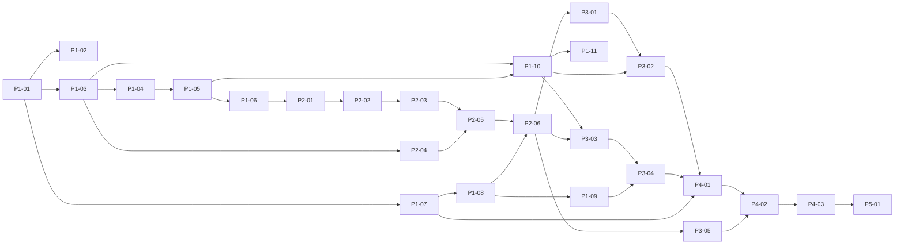

# 실행 문서 — M1 개발

M1(첫 출시) 기능 280개와 API 101개를 **실행 문서 26개**로 나눴다. 문서 하나를 Claude Code에 한 번 맡기면 되는 크기다. 위에서부터 차례로 하나씩 실행한다.

- 범위 근거: [기능 리스트 v0.2](../prd/04_기능리스트.md) · [API 명세 v0.2](../dev/05_API/05-2_openapi.yaml) · [ERD v0.4](../dev/04_데이터베이스/04-1_ERD.md) · [화면 시안](../design/README.md)
- 각 문서의 '2. 범위' 표는 설계 문서에서 스크립트로 옮겼다. M1 기능·API·테이블이 빠짐없이, 겹치지 않게 한 문서씩에 들어 있다(검사 완료).
- 설계 문서의 빈칸·어긋남 158건은 [_열린질문.md](_열린질문.md)에 문서별로 모았다. 실행 전에 해당 문서 항목을 본다.

## 실행 방법

1. 진행표에서 다음 문서를 고른다. '선행 작업'이 끝났는지 본다.
2. Claude Code에 이렇게 입력한다.

   ```
   @docs/action/phase-1_기반/P1-01_공통기반.md 실행해
   ```

3. Claude가 문서의 '7. 완료 조건'을 모두 채우면 끝이다. 결과 보고를 읽고, 진행표에 체크한다(Claude가 체크해도 된다).
4. 문서 하나가 한 번에 끝나지 않으면 "이어서 해"라고 하면 된다. 문서의 완료 조건이 기준이다.

## 순서



같은 줄의 선행 작업만 끝났으면 순서를 바꿔도 된다. 예를 들어 P1-07(비밀정보)은 P1-01 뒤라면 언제든 할 수 있다.

## 진행표

### Phase 1 · 기반

모든 단계가 같이 쓰는 뼈대: 외부 호출 관문, 설정, 후보·단계 실행 엔진, 게이트, 비밀정보·커머스API 인증, 메타 동기화, 구매대행 프로필, AI 실행기와 AI 엔진 페이지

| 완료 | 문서 | 내용 | 규모 | 선행 |
|---|---|---|---|---|
| [x] | [P1-01](phase-1_기반/P1-01_공통기반.md) | 공통 기반: 외부 호출 관문·진행 알림(SSE)·이미지 파일·감사 기록 | 기능 10 · API 4 | — |
| [x] | [P1-02](phase-1_기반/P1-02_FE공통부품.md) | FE 공통 부품·앱 셸·API 훅·진행 알림 구독 | 기능 0 · API 0 | P1-01 |
| [x] | [P1-03](phase-1_기반/P1-03_설정파일.md) | 설정 파일 로더·검증·설정 스냅샷 | 기능 6 · API 2 | P1-01 |
| [x] | [P1-04](phase-1_기반/P1-04_후보·상태.md) | 후보 만들기·목록·상태 전환·이어 하기(대시보드) | 기능 10 · API 10 | P1-03 |
| [x] | [P1-05](phase-1_기반/P1-05_단계실행.md) | 단계 실행 엔진: 실행·버전·입력 지문·재실행 필요 전파 | 기능 18 · API 6 | P1-04 |
| [x] | [P1-06](phase-1_기반/P1-06_연속실행·게이트.md) | 연속 실행·게이트(G1~G4) 통과 기록 | 기능 4 · API 4 | P1-05 |
| [x] | [P1-07](phase-1_기반/P1-07_비밀정보·인증.md) | 비밀정보(키체인)·커머스API 토큰 발급·인증 상태 | 기능 6 · API 4 | P1-01 |
| [x] | [P1-08](phase-1_기반/P1-08_메타동기화.md) | 커머스API 메타데이터 동기화(카테고리·원산지·주소록·반품 택배사) | 기능 2 · API 6 | P1-07 |
| [x] | [P1-09](phase-1_기반/P1-09_구매대행프로필.md) | 구매대행 프로필(출고지·반품지·택배사·고정값) | 기능 4 · API 3 | P1-08 |
| [x] | [P1-10](phase-1_기반/P1-10_AI실행기.md) | AI 실행기와 엔진 어댑터 3개(claude·agy·codex) | 기능 14 · API 0 | P1-03, P1-05 |
| [x] | [P1-11](phase-1_기반/P1-11_AI엔진페이지.md) | AI 엔진 설정 페이지(SCR-13)·AI CLI 점검·첫 실행 | 기능 8 · API 4 | P1-10 |

### Phase 2 · 키워드·소싱·판정

① 키워드 → ② 라쿠텐 소싱 → ③ 가격 판정(G2) → ④ 카테고리

| 완료 | 문서 | 내용 | 규모 | 선행 |
|---|---|---|---|---|
| [x] | [P2-01](phase-2_소싱·판정/P2-01_키워드.md) | ① 키워드: 데이터랩 수집·아동화 제외·키워드 선택(G1) | 기능 10 · API 9 | P1-06 |
| [x] | [P2-02](phase-2_소싱·판정/P2-02_라쿠텐연동.md) | ② 라쿠텐 연동: 검색·URL 가져오기·페이지 조회·아동화 차단 | 기능 21 · API 5 | P2-01 |
| [x] | [P2-03](phase-2_소싱·판정/P2-03_소싱비교표.md) | ② 소싱 비교표: 동일 상품·재고·실질가·최종 후보 | 기능 20 · API 6 | P2-02 |
| [x] | [P2-04](phase-2_소싱·판정/P2-04_환율·요금표.md) | 환율 자동 수집·수동 입력과 배대지 요금표 | 기능 7 · API 6 | P1-03 |
| [x] | [P2-05](phase-2_소싱·판정/P2-05_가격판정.md) | ③ 가격 판정: 원가·면세·판매가·마진, 비교 없이 확정, G2 | 기능 22 · API 6 | P2-03, P2-04 |
| [ ] | [P2-06](phase-2_소싱·판정/P2-06_카테고리.md) | ④ 카테고리: 리프 후보·성별 검사·예외 차단 | 기능 10 · API 2 | P2-05, P1-08 |

### Phase 3 · 콘텐츠

⑤ 썸네일(G3) → ⑥ 상세 콘텐츠·고시 → ⑦ 태그

| 완료 | 문서 | 내용 | 규모 | 선행 |
|---|---|---|---|---|
| [ ] | [P3-01](phase-3_콘텐츠/P3-01_썸네일준비.md) | ⑤ 썸네일 준비: 원본 이미지·레퍼런스·프롬프트·인물 가드레일 | 기능 8 · API 3 | P2-06 |
| [ ] | [P3-02](phase-3_콘텐츠/P3-02_썸네일생성·G3.md) | ⑤ 썸네일 생성·비교·선택(G3) | 기능 9 · API 3 | P3-01, P1-10 |
| [ ] | [P3-03](phase-3_콘텐츠/P3-03_카피·사양.md) | ⑥-1 상세 카피·⑥-2 사양 추출(근거 포함) | 기능 11 · API 3 | P1-10, P2-06 |
| [ ] | [P3-04](phase-3_콘텐츠/P3-04_고시·HTML·상품명.md) | ⑥-3 고시 매핑·구매대행 고지·원산지 코드·상세 HTML·상품명 | 기능 23 · API 2 | P3-03, P1-09 |
| [ ] | [P3-05](phase-3_콘텐츠/P3-05_태그.md) | ⑦ 태그: 추천·경쟁 태그·정제·검증·최종 10개 | 기능 15 · API 4 | P2-06 |

### Phase 4 · 승인·등록

⑧ 이미지 업로드 → 사전 검증·G4 최종 승인 → ⑨ 등록

| 완료 | 문서 | 내용 | 규모 | 선행 |
|---|---|---|---|---|
| [ ] | [P4-01](phase-4_승인·등록/P4-01_이미지업로드.md) | ⑧ 이미지 업로드: 정규화·순차 전송·URL 재사용 | 기능 8 · API 1 | P3-02, P3-04, P1-07 |
| [ ] | [P4-02](phase-4_승인·등록/P4-02_사전검증·승인.md) | 사전 검증 14종·최종 승인 미리보기(G4 화면) | 기능 17 · API 2 | P4-01, P3-05 |
| [ ] | [P4-03](phase-4_승인·등록/P4-03_등록.md) | ⑨ 등록: 요청 본문·중복 방지·사이즈 옵션·차단 스위치·결과 확인 | 기능 17 · API 6 | P4-02 |

### Phase 5 · M1 마무리

끝까지 흐름 테스트, 명세 대조, 보안 점검, M1 종료 리허설

| 완료 | 문서 | 내용 | 규모 | 선행 |
|---|---|---|---|---|
| [ ] | [P5-01](phase-5_마무리/P5-01_M1마무리.md) | 끝까지 흐름 테스트·명세 대조·보안 점검·M1 리허설 | 기능 0 · API 0 | P4-03 |

## 공통 규칙

모든 실행 문서에 적용한다. 문서마다 다시 적지 않는다.

**실행 환경**
- 저장소 루트에서 작업하고, 명령 전에 `nvm use`를 한다(Node 24.21.0, `.nvmrc`). pnpm은 corepack의 9.15.0이다.
- `npx` 대신 `pnpm exec <명령>`을 쓴다.
- 의존성을 더하면 `pnpm --filter <패키지> add -E <이름>@<버전>`으로 정확한 버전을 고정하고, 결과 보고에 적는다.

**설계 문서가 원본이다**
- API는 [05-2 openapi.yaml](../dev/05_API/05-2_openapi.yaml), DB는 [04-3 schema.prisma](../dev/04_데이터베이스/04-3_schema.prisma)가 원본이다.
- 구현하다 명세를 바꿔야 하면 원본 문서를 먼저 고치고 이유를 적는다.
- DB를 바꿀 때는 기존 마이그레이션(`20260927000000_v1_init`)을 고치지 않고 새 마이그레이션을 더한다. 그다음 `pnpm --filter @autostore/be db:check-sync`로 문서와 앱 사본이 같은지 확인한다.
- 실행 전에 [_열린질문.md](_열린질문.md)에서 해당 문서 항목을 본다.
- 문서에 없는 것을 정하면 해당 설계 문서에 'Proposed'로 적고, 결과 보고의 '오너 검토'에 올린다.

**외부 호출 금지(개발·테스트)**
- 데이터랩, 라쿠텐(API·상품 페이지), 커머스API, 환율 출처를 실제로 부르지 않는다. 저장해 둔 응답(fixture)과 가짜 서버로 만든다.
- AI CLI(claude·agy·codex)를 실제로 부르는 테스트는 기본으로 돌지 않게 한다. 켜는 방법(예: 환경변수)을 정해 문서에 적는다.
- 화면은 런타임에 외부 글꼴·CDN을 부르지 않는다.

**안전**
- 비밀정보(커머스API 시크릿, 토큰, API 키)는 코드·`.env`·로그·AI 프롬프트·DB에 넣지 않는다. OS 키체인에만 둔다.
- 등록 API 차단 스위치는 기본으로 켜져 있다. 실제 스토어이고 샌드박스가 없다.
- 로컬 보안 규칙을 유지한다: 127.0.0.1 바인딩, Host·Origin 검사, `X-AutoStore-Client` 헤더, CORS 없음.
- 단계 모듈끼리 서로 부르지 않는다. 앞 단계 산출물은 step-engine을 거쳐 받는다(03-ADR-003).

**화면**
- 라이트 테마만(D-13). 색·크기는 토큰 변수만 쓴다. 시안 보드의 구성과 문구를 따른다.

**끝내기 전**
- 저장소 루트에서 `pnpm lint && pnpm typecheck && pnpm test && pnpm test:e2e && pnpm build`가 통과해야 한다.
- **커밋·푸시는 하지 않는다.** 오너가 나중에 한다.
- 결과 보고에는 만든 것, 검증 결과, 정한 것(Proposed), 남은 일을 적는다.

## M0 스파이크·오너 준비와의 관계

실행 문서는 fixture로 먼저 만들 수 있다. 실제 연결은 아래가 끝난 뒤에 붙인다.

| 필요한 것 | 영향을 받는 문서 | 그 전에는 |
|---|---|---|
| S6 AI 격리·비전 확인 | P1-10 | 설계대로 만들고 녹화한 CLI 출력으로 검증 |
| S7 엔진 동등성, `codex` 설치·로그인 | P1-10, P1-11 | codex는 fixture로만 검증, 페이지에 '실험적' 표시 가능 |
| 커머스API 앱 등록(PRD §0 5번), S3 | P1-07, P1-08, P4-01, P4-03 | 가짜 서버로 검증, 차단 스위치 켬 |
| 라쿠텐 앱 키(§0 6번), S2 | P2-02, P2-03 | 샵 페이지·API fixture |
| S4 데이터랩 | P2-01 | 순위 붙여넣기 경로와 fixture |
| S5 셀러라이프·manuTag 샘플 | P2-05, P3-05 | 샘플 fixture, 자유 텍스트 입력 |
| S1 썸네일 이미지 생성 경로 | P3-02 | `ImageGenProvider` 포트와 가짜 공급자 |

## M1 종료 조건 (PRD §17)

실제 상품 5건이 키워드부터 등록(처음 10건 모드)까지 끝까지 통과하고, 라쿠텐 URL로 시작한 상품 1건도 등록까지 통과한다. Must·제약(CON) 태그 인수조건이 모두 통과한다. P5-01까지 끝낸 뒤 오너가 직접 확인한다.
