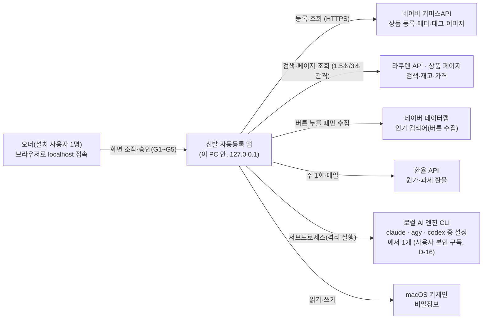
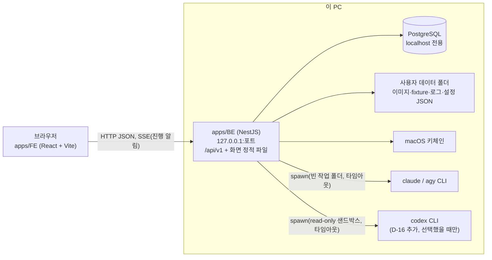
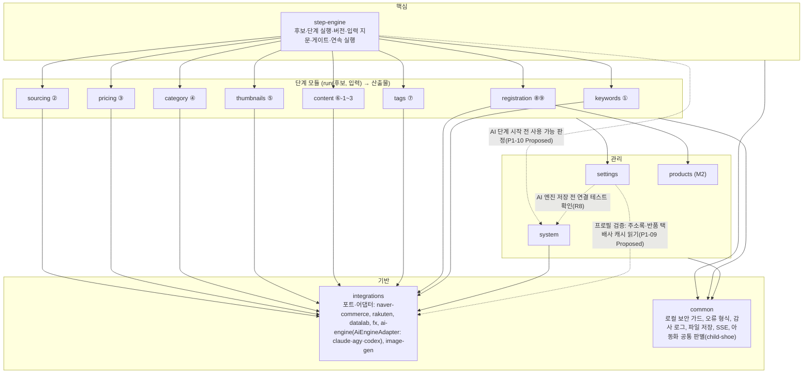

# 03-2. C4 다이어그램

## 1. System Context



외부 호출은 허용 목록에 있는 곳만 나간다(GEN-01). 사용 기록을 밖으로 보내지 않는다.

## 2. Container



- 개발 중에는 Vite 개발 서버(5173)가 `/api`를 BE로 넘긴다. 배포본은 BE가 FE 빌드 결과를 같이 내보낸다(한 프로세스).
- 이미지 원본·생성본은 파일로 두고, DB에는 경로와 SHA-256만 둔다.

## 3. Component (apps/BE 모듈)



- 의존 방향: step-engine이 단계 모듈을 부른다. 단계 모듈끼리는 서로 부르지 않고, 앞 단계 산출물은 step-engine이 넘긴다. 외부 호출은 integrations의 포트로만 한다.
- 게이트·안전 검사(아동화 차단, 최종 승인 사전 검증, 중복 방지)는 단계 모듈과 registration 안에 둔다. 호출 경로(단계·연속·일괄·CLI)와 상관없이 빠지지 않는다(GEN-02).
- **AI 엔진(D-16)**: integrations에 `AiEngineAdapter { code, detect(), authStatus(), smokeTest(model), runStructured(task, schema, inputs, {model, timeoutMs}) }` 포트와 구현 `ClaudeCodeAdapter`·`AgyAdapter`·`CodexAdapter`를 둔다. 이미지 생성 포트(`ImageGenProvider`)와 분리한다. 단계 모듈은 포트만 부르고, 실행기가 단계를 시작할 때 설정의 선택 엔진으로 어댑터를 골라 StepRun에 엔진·모델·CLI 버전을 고정한다. 선택 엔진을 쓸 수 없으면 멈추고 다른 엔진으로 넘어가지 않는다(M1).
- **AI 실행기(P1-10, Proposed 2026-09-30 — 오너 검토)**: 단계 모듈은 `AiExecutor.run(PinnedAiContext, task, schema, input)`(integrations) 하나로만 AI를 부른다. step-engine은 AI 단계(`usesAi`)를 시작할 때 **트랜잭션 전에** system의 `AiEngineAvailabilityService.assertUsable(선택 엔진)`(최신 `ai_cli_check`)과 `--version` 감지를 끝내고(그림의 `engine -.-> sy`), 시작 INSERT 때 `step_run.ai_engine`·`ai_model`·`ai_cli_version`을 쓴다. 실행 문맥 `pinnedAi`(엔진·텍스트/비전 모델·버전·스냅샷 id)는 실행 도중 설정이 바뀌어도 그대로다. system은 앱 시작 점검(`AiEngineStartupCheck`)과 점검 기록(`AiCliCheckRecorder`)을 두고 integrations의 `AiExecutor`로 감지·연결 테스트를 부른다. spawn은 `IsolatedCliRunner` 한 곳(`node:child_process`를 import하는 유일한 파일)에서만 한다.
- **settings**는 설정 JSON의 `ai` 섹션(선택 엔진·엔진별 모델) 쓰기를 맡고(원자적 쓰기 + 새 `settings_snapshot`), **system**은 감지·연결 테스트 기록 `ai_cli_check`를 소유한다. settings는 저장 전에 system의 최근 연결 테스트 통과(10분)를 확인한다.
- **AI 엔진 저장(P1-11, Proposed 2026-09-30 — 오너 검토)**: 그림의 `st -.-> sy`는 system의 읽기 창구 `AiCliCheckQueryService` 하나다. system도 선택 엔진을 settings에서 읽으므로 두 Nest 모듈이 서로 import하지 않게, 읽기 창구만 담은 `AiCliCheckQueryModule`(DB만 씀)을 떼어 둘이 함께 import한다(`forwardRef` 없음). AGY 모델 목록(`agy models`)은 integrations의 `AgyModelsProvider`(AGY 어댑터 `listModels`, 감지 때 갱신) — settings가 목록과 모델 검사에 쓴다(그림의 `st --> integ`).
- **구매대행 프로필(P1-09, Proposed 2026-09-30 — 오너 검토)**: 프로필(`purchase_agency_profile`)은 settings 소유다. 해외 출고지·반품지·반품 택배사를 검사하려고 settings가 integrations의 `CommerceMetaCacheService`(P1-08 캐시 읽기 창구)를 읽는다(그림의 `st -.-> integ`). integrations는 원래 settings를 읽으므로(하루 조회 상한) 두 Nest 모듈은 서로 `forwardRef`로 부른다. 프로필이 바뀌면 재실행 필요 전파는 settings의 포트(`PROFILE_RERUN_PROPAGATOR`)로 부르고, step-engine이 시작할 때 실제 전파(`PropagationService.onProfileChanged`)를 끼운다(settings → step-engine 의존 없음, 설정 파일 변경 포트와 같은 방식). 단계 모듈(⑥-3·⑨)은 `PurchaseAgencyProfileService`(SettingsModule export)로 프로필을 읽는다(그림의 `steps --> st`).
- **비밀정보 저장소(P1-07, Proposed 2026-09-30 — 오너 검토)**: 그림에 자리가 없어 `common/secrets`(전역 모듈)에 `SecretStore` 포트(`get`·`set`·`status`, 토큰 `SECRET_STORE`)와 M1 구현(macOS 키체인, `@napi-rs/keyring`)을 둔다. system(키 입력 API)과 integrations(커머스·라쿠텐·환율)가 같이 쓰기 때문이다. OS별 구현은 이 토큰만 바꿔 끼운다. 커머스API 토큰 발급·캐시(`CommerceTokenService`)와 클라이언트(`CommerceApiClient`)는 integrations/naver-commerce에 두고, system의 인증 상태 API가 `CommerceTokenService`를 쓴다(그림의 `sy --> integ`).
- **① 키워드(P2-01, Proposed 2026-09-30 — 오너 검토)**: keywords는 데이터랩을 integrations의 포트 `DATALAB_RANK_PORT`(`fetchRankPage({cid, startDate, endDate, page})` → `{httpStatus, contentType, bodyText}`, 구현 `DatalabRankHttpAdapter` = 외부 호출 관문 target DATALAB)로만 부르고, 응답 해석(정상·끝·이상 8종)은 keywords의 순수 함수(`datalab-response.ts`)가 한다. 쉼·하루 상한 판단은 `CallUsageService`(`call_log`)를 읽는다(그림의 `kw --> integ`). 설정은 `SettingsService`로만 읽고, 아동 단어 더하기는 settings가 설정 파일의 `safety.childKeywords`만 원자적으로 다시 쓰고 새 스냅샷을 만든다(`SettingsService.addChildKeyword`). 후보 만들기(`creationPath=KEYWORD`)는 step-engine이 `keyword` 표를 읽어 검사하고 keywords는 step-engine을 import하지 않는다(G1 = `keyword.selected_at`, 후보 단위 게이트가 아님).
- **아동화 공통 판별(F-BS-12, P2-01 Proposed)**: 키워드(①)·검색어·URL(② P2-02)·카테고리(④ P2-06)가 같은 순수 함수를 불러야 하는데 단계 모듈끼리 import할 수 없어 `common/child-shoe/child-shoe.rules.ts`에 둔다(`hasChildTerm`·`isGenreInScope`·`isChildSizeSuspect`·`findWheeledShoeWord`·`findSeniorShoeWord`·`judgeChildShoe`, 값은 `childShoeRulesOf(settings)`로 인자로 받는다). DB·설정 파일을 읽지 않고 끄는 옵션이 없다(F-BS-04). 기본 단어·사이즈 하한(235)도 여기 한 곳이고 settings의 안전 기준 하한 검사가 같은 상수를 쓴다.

### 3.1 StepRunner 규약 (P1-05, Proposed 2026-09-30 — 오너 검토)

단계 모듈(②~⑨, P2~P4)은 step-engine에 **실행기** 하나를 꽂는다. 단계 모듈이 step-engine에서 가져오는 것은 `modules/step-engine/contracts/step-runner.ts`와 `StepEngineApi`(`modules/step-engine/step-engine.api.ts`)뿐이다. step-engine은 단계 모듈을 import하지 않는다(순환 없음).

```ts
@StepRunnerFor('PRICING')          // 메타데이터(SetMetadata) — 클래스마다 한 단계
@Injectable()
export class PricingRunner implements StepRunner {
  readonly stepCode = 'PRICING';
  readonly usesAi = false;                                     // PRE_G2_AI_COST·AI 엔진 고정(P1-10)
  readonly aiModelKind?: 'TEXT' | 'VISION';                   // AI 단계의 주 작업(ai_model에 넣을 모델, 기본 TEXT, P1-10)
  readInputs(ctx: StepInputContext): Promise<StepInput[]>;    // 값 포함. 트랜잭션 안에서도 불린다 — DB 읽기만
  run(ctx: StepRunContext): Promise<StepOutcome>;             // 트랜잭션 밖. 외부·AI 호출은 여기서만
  persist(tx, stepRunId, outcome): Promise<void>;             // 끝 트랜잭션 안(모든 결과 종류)
  copyOutput(tx, fromStepRunId, toStepRunId, edit?): Promise<CandidateEffects | void>; // 오너 수정·다시 고르기
  ownerInputsOf?(db, stepRunId);                              // 다시 실행 기본값(직전 버전 실행 중 오너 입력)
  anchorKeyOf?(db, stepRunId);                                // ② 다시 고르기의 ANCHOR_KEY_MISMATCH 검사
  onInterrupted?(tx, run): Promise<CandidateStatusEffect | null>; // 재시작 정리(⑨, P4-03)
  refetch?(ctx: StepRunContext): Promise<StepOutcome>;        // ② 재조회 모드(6시간 규칙, P2-02 · P1-06)
  judgementPageCollectedAt?(db, stepRunId): Promise<Date | null>; // ③ 판정에 쓴 페이지 수집 시각(P2-05 · P1-06)
}
```

- **등록**: 실행기 클래스에 `@StepRunnerFor(code)`를 달고 자기 모듈 `providers`에 넣는다. `StepRunnerRegistry`가 `onModuleInit`에서 `DiscoveryService`로 모은다. 한 단계에 둘이거나 표시와 `stepCode`가 다르면 앱 시작을 멈춘다. 실행기가 없는 단계는 실행 요청이 422 `INVALID_STEP_CODE`(`details.reason = NO_RUNNER`).
- **입력**: `StepInput = { inputKey, sourceType(PREV_STEP·OWNER_INPUT·SETTINGS), sourceStepRunId?, isStartCondition, required, value }`. 입력 키와 단계별 시작 조건은 `domain/input-keys.ts`·`domain/step-graph.ts`(`STEP_INPUT_SPECS`, PRD §5.3 표)를 따른다. 앞 단계 산출물은 `ctx.completedRunId(stepCode)`(현재 버전이 완료일 때만)로 읽는다. 엔진이 값 해시(정규화 JSON SHA-256)와 지문(시작 조건만)을 계산해 `step_run_input`에 남긴다. 이미지는 파일 해시, 설명은 `normalizeText`(NFKC·공백)한 글을 값으로 넣고, 수집 시각은 넣지 않는다.
- **결과**: `StepOutcome` = `COMPLETED { output, candidateEffects? }` · `WAITING_INPUT { waitingReasonCode, pendingInputs }` · `FAILED { failureKind(EXTERNAL_API·AI·INPUT_VALIDATION), errorCode, errorMessage }`. `run`이 던지면 엔진이 FAILED로 남긴다(ApiException 코드로 종류를 정하고, 그 밖 예외는 INPUT_VALIDATION·INTERNAL_ERROR). 실행 중 실패는 HTTP 오류가 아니라 실행 기록과 SSE `step-run.status-changed`다.
- **후보 효과**(`candidateEffects`): ② 앵커 확정·소싱 선택·성별 판단, ④ 리프 카테고리, 제외 사유. 엔진이 끝 트랜잭션 안에서 P1-04 서비스로 적용한다(단계 모듈은 `candidate`를 직접 쓰지 않는다). 409·422로 막히면 그 실행을 FAILED(INPUT_VALIDATION)로 닫는다.
- **`StepEngineApi`**: `resumeWaiting(stepRunId, { data })`(입력 대기 이어 가기 — RUNNING으로 되돌리고 `run`을 다시 돈다), `resumeWaiting(stepRunId, { outcome, scope? })`(결과로 끝내기 — 예: G3 선택으로 ⑤ 완료), `ownerInputChanged(candidateId, inputKey, scope?)`(완료 뒤 오너 입력 새 행 → 재실행 필요), `currentCompletedRun(candidateId, stepCode)`.
- **단일 진입점**: 단계 실행·연속 실행(P1-06)·일괄(M2)·CLI(M3)는 모두 `StepExecutionService.start(candidateId, stepCode, { mode, ownerInputs, stepChainId })`를 부른다. 시작 조건·잠금 검사(`execution/start-conditions.ts`·`step-locks.ts`·`step-blocks.ts`)는 실행 API의 409·레일의 `disabledReason`·목록 `runnableStep`이 같은 함수를 쓴다. 게이트·안전 검사는 실행기 안에 둔다.
- **포트**: `AI_ENGINE_RESOLVER`(AI를 쓰는 실행기의 시작 트랜잭션 전 선택 엔진 준비 `prepare()` → 시작 INSERT 때 엔진·모델·CLI 버전 고정, P1-10 `SelectedAiEngineResolver`. 실행기 선택 속성 `aiModelKind: 'TEXT'|'VISION'`이 `ai_model`에 넣을 모델을 정한다), `PAGE_DATA`(② 페이지 수집 시각, P2-02), `SETTINGS_RERUN_PROPAGATOR`(설정 변경 전파, step-engine이 끼운다).

### 3.2 GateBasisProvider 규약 (P1-06, Proposed 2026-09-30 — 오너 검토)

게이트를 확인하는 단계 모듈(pricing P2-05 → G2, thumbnails P3-02 → G3)은 step-engine에 **게이트 공급자** 하나를 꽂는다. `StepRunner`와 같은 방식이다: `modules/step-engine/contracts/gate-basis.ts`만 가져오고, `@GateBasisFor(gate)`를 단 provider를 `GateBasisRegistry`가 `DiscoveryService`로 모은다(한 게이트에 둘이면 앱 시작을 멈춘다).

```ts
@GateBasisFor('G2')
@Injectable()
export class PricingGateBasis implements GateBasisProvider {
  readonly gate = 'G2';
  basis(tx, candidateId, basisStepRunId): Promise<GateBasis>;                 // 지문 구성값 — g2Basis()·g3Basis()로 만든다
  blockers(tx, candidateId, basisStepRunId, body | null): Promise<GateBlocker[]>; // NOT_SALE_CANDIDATE·NO_COMPARISON_NOT_CONFIRMED·CHECKLIST_INCOMPLETE …
  passBasis?(tx, candidateId, basisStepRunId, body): Promise<GateBasis>;     // 통과 요청이 새 값을 정할 때(G3 대표 이미지)
  onPass?(scope, candidateId, gatePassId, body): Promise<GatePassEffect | void>; // G3: thumbnail_selection·⑤ 완료(같은 트랜잭션)
  warnings?(tx, candidateId, basisStepRunId): Promise<CandidateWarning[]>;
}
```

- **지문**: 구성값의 키 정렬 JSON SHA-256(`gateFingerprint`). G2 = `g2Basis({ itemCode, selectedColor, saleCandidate, saleSizes[{ sizeMm, salePriceKrw, optionPriceKrw }] })`(사이즈 정렬, P_min·환율 없음), G3 = `g3Basis({ referenceHashes(정렬), selectedHash, anchorKey })`. 구성값은 `gate_pass.fingerprint_basis`에 남고, 바뀐 잎 경로(`salePrices.250` 등)가 `changedBasisKeys`다.
- **유효성**(`GATE_VALIDITY` = `GateValidityService`): 게이트별 최신 `gate_pass` 지문 = 근거 단계(G2 ③·G3 ⑤) **현재 버전**(산출물이 있는 COMPLETED·RERUN_REQUIRED)으로 `basis`를 다시 계산한 지문이면 유효. 현재 버전이 실행 중·입력 대기·실패·미실행이거나 공급자가 없으면 무효.
- **무효 감지**: 단계 완료 끝 트랜잭션·오너 수정·② 소싱 선택 변경이 바꾸기 전 `snapshot` → 바꾼 뒤 `detectInvalidation`. 무효가 되면 같은 트랜잭션에서 후보를 재평가하고(승인대기·검증완료 → 작업중 `GATE_FINGERPRINT_CHANGED`) 커밋 뒤 SSE `gate.invalidated`.
- **통과**는 웹 화면 API(`POST /candidates/{id}/gates/{G2|G3}/pass`, 로컬 보안 가드)로만 기록한다. `StepEngineApi`(CLI M3가 쓸 창구)에는 열지 않는다. G4는 등록 기록이다.

## 4. 트랜잭션 경계

| 흐름 | 경계 | 이유 |
|---|---|---|
| 단계 시작·완료 | 시작: StepRun 새 버전 + 현재 버전 포인터 이동을 **한 트랜잭션**. 완료: 산출물 + StepRun 종료 상태 + 뒷단계 '재실행 필요' 표시를 **한 트랜잭션**(포인터 시점은 [ERD §7.2-17](../04_데이터베이스/04-1_ERD.md) — P1-05는 ERD대로 **시작** 트랜잭션에서 옮긴다. 시작 트랜잭션에는 `step_run_input`과 후보 상태 재평가, 완료 트랜잭션에는 끝 지문 비교·후보 효과·후보 상태 재평가가 함께 든다) | 중간에 앱이 꺼져도 상태가 어긋나지 않게(GEN-03). 뒷단계는 앞 단계 현재 버전이 '완료'일 때만 읽는다(PRD §5.3) |
| 게이트 통과(G2·G3) | 게이트 지문 기록 + 후보 상태 전이를 **한 트랜잭션**. G4(최종 승인)는 등록 기록의 승인 시각이 원본이다([ERD §7.1-3](../04_데이터베이스/04-1_ERD.md)). P1-06: `gate_pass`(추가만) + 공급자 `onPass`(G3 선택·⑤ 완료) + 후보 재평가(이력 `gate_pass_id`) + `user_action_log`(GATE_PASSED), 커밋 뒤 SSE `gate.passed` | 재통과 판단의 원본 |
| 연속 실행 | 시작: 후보 행 잠금(`FOR UPDATE`) + 열린 묶음 확인 + `step_chain` 1행 + 건너뛰기 기록 + 첫 실행(CHAIN) 시작을 **한 트랜잭션**(첫 실행이 막히면 묶음도 남지 않는다). 이어 가기: 묶음 안 실행이 끝날 때마다 새 트랜잭션에서 다음 행동. 멈춤: `ended_at`·`stop_reason`·`stop_step_code`를 한 번에(P1-06) | 후보당 열린 묶음 하나는 DB가 막지 않는다(ERD §7.2-12) — 행 잠금으로 지킨다 |
| ⑨ 등록 | ① 등록 기록을 '등록요청중'으로 **먼저 커밋** → ② 커머스API 호출(트랜잭션 밖) → ③ 결과로 '등록됨'/오류 갱신. 응답을 못 받으면 '결과확인필요'로 두고 판매자관리코드로 조회 | 외부 호출은 DB 트랜잭션에 넣을 수 없다. 중복 등록 방지(RG-12)와 멱등(§8.7) |
| 커머스API 메타 동기화(P1-08, Proposed) | 대상별 run 행 RUNNING 만들기를 **한 트랜잭션**(advisory 잠금 + 진행 중 재확인) → 202. 대상 하나마다 외부 호출은 모두 **트랜잭션 밖**에서 끝내고, 캐시 upsert + `removed_at` 표시 + run SUCCEEDED를 **한 트랜잭션**. 실패하면 run만 FAILED(`error_message`)로 따로 쓴다 | 실패해도 이전 캐시가 그대로 남는다. 캐시 id를 유지해야 프로필 FK(ON DELETE RESTRICT)가 끊기지 않는다 |
| 구매대행 프로필 저장(P1-09, Proposed) | 참조 검사(주소록·반품 택배사 캐시, 설정의 발송 택배사 목록)는 트랜잭션 전에 하고, `purchase_agency_profile` upsert + 재실행 필요 전파(바뀐 `profile.*` 입력을 읽은 단계, 후보 상태 재평가 포함) + `user_action_log`(SETTING_CHANGED)를 **한 트랜잭션**. 전파 SSE는 커밋 뒤. 같은 값이면 쓰지 않는다 | 단계 완료 원칙과 같다: 프로필만 바뀌고 단계가 '완료'로 남는 순간이 없게 한다 |
| ① 데이터랩 버튼 수집(P2-01, Proposed) | advisory 잠금 + 수집 중 재확인 + RUNNING `keyword_snapshot` 1행을 **한 트랜잭션** → 202. 요청은 모두 **트랜잭션 밖**에서 하나씩 보내고, 페이지마다 `keyword` 행을 넣는다(중단돼도 받은 줄은 남는다). 끝은 조건 갱신(`status='RUNNING'`일 때만) 한 번으로 COMPLETED·ABORTED. 붙여넣기는 묶음 + 키워드 행을 한 트랜잭션. G1 고르기는 `selected_at` 조건 갱신 + `user_action_log`(GATE_PASSED) 한 트랜잭션 | 외부 호출은 트랜잭션에 넣지 않는다. 오래 걸리는 수집이 행 잠금을 잡지 않게 |
| 앱 재시작 | '실행중' StepRun → '실패(중단됨)'. ⑨ 중이던 후보는 등록 기록으로 복구. RUNNING `commerce_meta_sync_run` → FAILED(P1-08). RUNNING `keyword_snapshot` → ABORTED `APP_RESTART`(P2-01, ERD v0.5) | PRD §5.2 |

## 5. 로컬 보안 (로그인 없는 로컬 API 보호)

- BE는 127.0.0.1에만 붙는다. PostgreSQL도 localhost에서만 받는다.
- `Host` 헤더가 `127.0.0.1:포트`·`localhost:포트`가 아니면 거부한다(DNS 리바인딩 방지).
- 상태를 바꾸는 요청(POST·PUT·PATCH·DELETE)은 `Origin`이 앱 자신일 때만 받고, 사용자 정의 헤더(`X-AutoStore-Client`)를 요구한다. CORS는 열지 않는다(다른 사이트가 localhost API를 부르지 못하게).
- 비밀정보는 키체인에만 있고 API 응답·로그에 나오지 않는다. 키 입력 API는 쓰기만 하고 값을 돌려주지 않는다.
