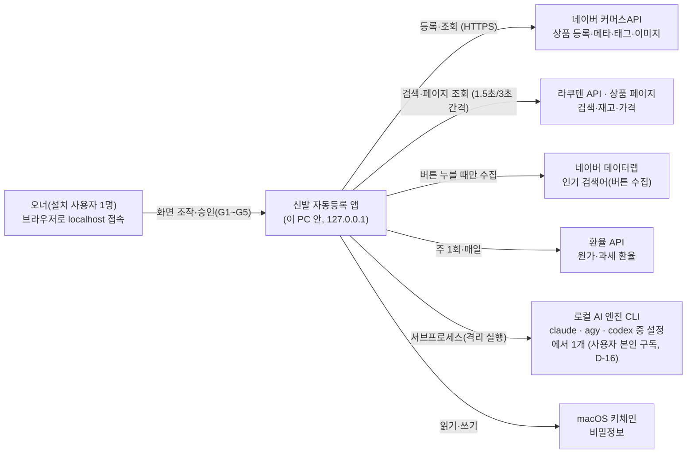
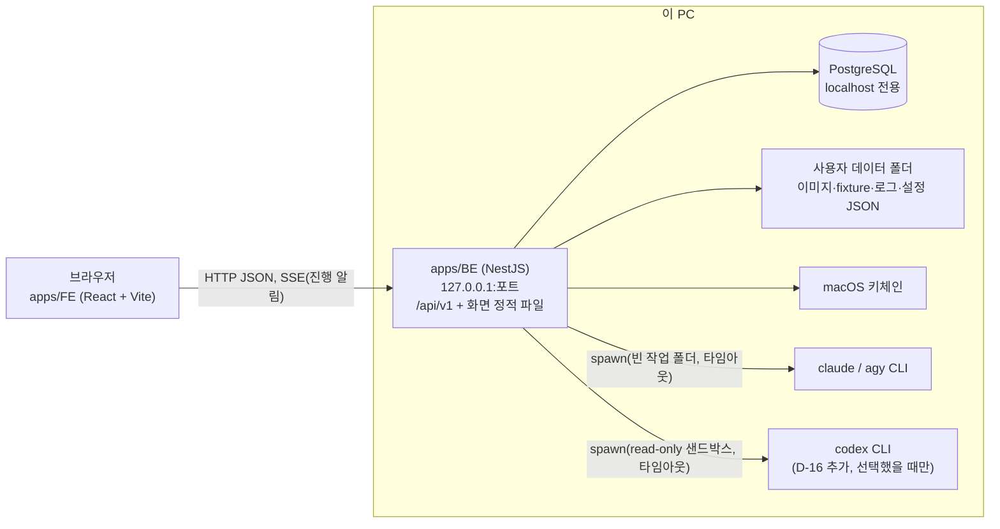
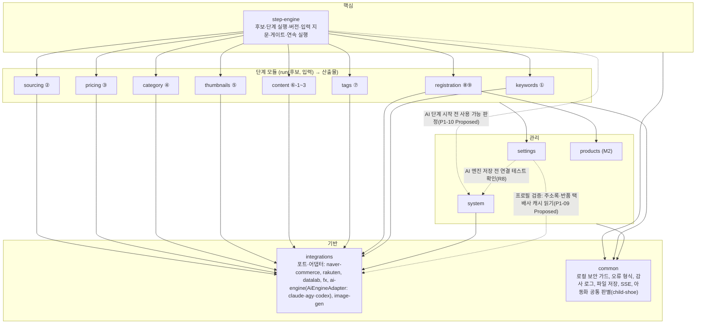

# 03-2. C4 다이어그램

## 1. System Context



외부 호출은 허용 목록에 있는 곳만 나간다(GEN-01). 사용 기록을 밖으로 보내지 않는다.

## 2. Container



- 개발 중에는 Vite 개발 서버(5173)가 `/api`를 BE로 넘긴다. 배포본은 BE가 FE 빌드 결과를 같이 내보낸다(한 프로세스).
- 이미지 원본·생성본은 파일로 두고, DB에는 경로와 SHA-256만 둔다.

## 3. Component (apps/BE 모듈)



- 의존 방향: step-engine이 단계 모듈을 부른다. 단계 모듈끼리는 서로 부르지 않고, 앞 단계 산출물은 step-engine이 넘긴다. 외부 호출은 integrations의 포트로만 한다.
- 게이트·안전 검사(아동화 차단, 최종 승인 사전 검증, 중복 방지)는 단계 모듈과 registration 안에 둔다. 호출 경로(단계·연속·일괄·CLI)와 상관없이 빠지지 않는다(GEN-02).
- **AI 엔진(D-16)**: integrations에 `AiEngineAdapter { code, detect(), authStatus(), smokeTest(model), runStructured(task, schema, inputs, {model, timeoutMs}) }` 포트와 구현 `ClaudeCodeAdapter`·`AgyAdapter`·`CodexAdapter`를 둔다. 이미지 생성 포트(`ImageGenProvider`)와 분리한다. 단계 모듈은 포트만 부르고, 실행기가 단계를 시작할 때 설정의 선택 엔진으로 어댑터를 골라 StepRun에 엔진·모델·CLI 버전을 고정한다. 선택 엔진을 쓸 수 없으면 멈추고 다른 엔진으로 넘어가지 않는다(M1).
- **AI 실행기(P1-10, Proposed 2026-09-30 — 오너 검토)**: 단계 모듈은 `AiExecutor.run(PinnedAiContext, task, schema, input)`(integrations) 하나로만 AI를 부른다. step-engine은 AI 단계(`usesAi`)를 시작할 때 **트랜잭션 전에** system의 `AiEngineAvailabilityService.assertUsable(선택 엔진)`(최신 `ai_cli_check`)과 `--version` 감지를 끝내고(그림의 `engine -.-> sy`), 시작 INSERT 때 `step_run.ai_engine`·`ai_model`·`ai_cli_version`을 쓴다. 실행 문맥 `pinnedAi`(엔진·텍스트/비전 모델·버전·스냅샷 id)는 실행 도중 설정이 바뀌어도 그대로다. system은 앱 시작 점검(`AiEngineStartupCheck`)과 점검 기록(`AiCliCheckRecorder`)을 두고 integrations의 `AiExecutor`로 감지·연결 테스트를 부른다. spawn은 `IsolatedCliRunner` 한 곳(`node:child_process`를 import하는 유일한 파일)에서만 한다.
- **settings**는 설정 JSON의 `ai` 섹션(선택 엔진·엔진별 모델) 쓰기를 맡고(원자적 쓰기 + 새 `settings_snapshot`), **system**은 감지·연결 테스트 기록 `ai_cli_check`를 소유한다. settings는 저장 전에 system의 최근 연결 테스트 통과(10분)를 확인한다.
- **AI 엔진 저장(P1-11, Proposed 2026-09-30 — 오너 검토)**: 그림의 `st -.-> sy`는 system의 읽기 창구 `AiCliCheckQueryService` 하나다. system도 선택 엔진을 settings에서 읽으므로 두 Nest 모듈이 서로 import하지 않게, 읽기 창구만 담은 `AiCliCheckQueryModule`(DB만 씀)을 떼어 둘이 함께 import한다(`forwardRef` 없음). AGY 모델 목록(`agy models`)은 integrations의 `AgyModelsProvider`(AGY 어댑터 `listModels`, 감지 때 갱신) — settings가 목록과 모델 검사에 쓴다(그림의 `st --> integ`).
- **구매대행 프로필(P1-09, Proposed 2026-09-30 — 오너 검토)**: 프로필(`purchase_agency_profile`)은 settings 소유다. 해외 출고지·반품지·반품 택배사를 검사하려고 settings가 integrations의 `CommerceMetaCacheService`(P1-08 캐시 읽기 창구)를 읽는다(그림의 `st -.-> integ`). integrations는 원래 settings를 읽으므로(하루 조회 상한) 두 Nest 모듈은 서로 `forwardRef`로 부른다. 프로필이 바뀌면 재실행 필요 전파는 settings의 포트(`PROFILE_RERUN_PROPAGATOR`)로 부르고, step-engine이 시작할 때 실제 전파(`PropagationService.onProfileChanged`)를 끼운다(settings → step-engine 의존 없음, 설정 파일 변경 포트와 같은 방식). 단계 모듈(⑥-3·⑨)은 `PurchaseAgencyProfileService`(SettingsModule export)로 프로필을 읽는다(그림의 `steps --> st`).
- **비밀정보 저장소(P1-07, Proposed 2026-09-30 — 오너 검토)**: 그림에 자리가 없어 `common/secrets`(전역 모듈)에 `SecretStore` 포트(`get`·`set`·`status`, 토큰 `SECRET_STORE`)와 M1 구현(macOS 키체인, `@napi-rs/keyring`)을 둔다. system(키 입력 API)과 integrations(커머스·라쿠텐·환율)가 같이 쓰기 때문이다. OS별 구현은 이 토큰만 바꿔 끼운다. 커머스API 토큰 발급·캐시(`CommerceTokenService`)와 클라이언트(`CommerceApiClient`)는 integrations/naver-commerce에 두고, system의 인증 상태 API가 `CommerceTokenService`를 쓴다(그림의 `sy --> integ`).
- **① 키워드(P2-01, Proposed 2026-09-30 — 오너 검토)**: keywords는 데이터랩을 integrations의 포트 `DATALAB_RANK_PORT`(`fetchRankPage({cid, startDate, endDate, page})` → `{httpStatus, contentType, bodyText}`, 구현 `DatalabRankHttpAdapter` = 외부 호출 관문 target DATALAB)로만 부르고, 응답 해석(정상·끝·이상 8종)은 keywords의 순수 함수(`datalab-response.ts`)가 한다. 쉼·하루 상한 판단은 `CallUsageService`(`call_log`)를 읽는다(그림의 `kw --> integ`). 설정은 `SettingsService`로만 읽고, 아동 단어 더하기는 settings가 설정 파일의 `safety.childKeywords`만 원자적으로 다시 쓰고 새 스냅샷을 만든다(`SettingsService.addChildKeyword`). 후보 만들기(`creationPath=KEYWORD`)는 step-engine이 `keyword` 표를 읽어 검사하고 keywords는 step-engine을 import하지 않는다(G1 = `keyword.selected_at`, 후보 단위 게이트가 아님).
- **아동화 공통 판별(F-BS-12, P2-01 Proposed)**: 키워드(①)·검색어·URL(② P2-02)·카테고리(④ P2-06)가 같은 순수 함수를 불러야 하는데 단계 모듈끼리 import할 수 없어 `common/child-shoe/child-shoe.rules.ts`에 둔다(`hasChildTerm`·`isGenreInScope`·`isChildSizeSuspect`·`findWheeledShoeWord`·`findSeniorShoeWord`·`judgeChildShoe`, 값은 `childShoeRulesOf(settings)`로 인자로 받는다). DB·설정 파일을 읽지 않고 끄는 옵션이 없다(F-BS-04). 기본 단어·사이즈 하한(235)도 여기 한 곳이고 settings의 안전 기준 하한 검사가 같은 상수를 쓴다.
- **카테고리 공용 규칙(P2-06, Proposed 2026-10-01 — 오너 검토)**: 성별 경로 판정 `genderPathMatches(gender, wholeCategoryName)`·`categoryPathGender`·`GENDER_SHOE_PATH_PREFIX`(`common/rules/category-gender.ts`)와 아동·판매 제외 품목 카테고리 내장 말(`common/rules/category-words.ts`)은 ④ category와 최종 승인 검사(P4-02 F-AP-24 registration)가 같이 쓰므로 `common/rules`에 둔다(registration이 category를 import하지 않게). integrations 메타 캐시(P1-08 `GENDER_PATH_PREFIX`·`CATEGORY_BLOCK_WORDS`)와 settings 안전 하한(내장 목록)도 이 파일을 쓴다.

- **이미지 생성 포트(P3-02, Proposed 2026-10-01 — 오너 검토, M0 S1 계약으로 확정)**: integrations `image-gen/image-gen.port.ts`의 `ImageGenProvider { identify(provider) → { provider, model, providerVersion }; generate({ identity, prompt, referenceImagePaths, sizePx, timeoutMs, signal }) → { kind: 'IMAGE', bytes, fileName } | { kind: 'REFUSED', reason } }`(그 밖 실패는 `ImageGenError(userMessage)` — 비밀·로컬 경로 없는 한국어), 주입 토큰 `IMAGE_GEN_PROVIDER`. 선택 AI 엔진(`AiEngineAdapter`·`AiExecutor`)과 섞지 않는다 — ⑤ `step_run.ai_*`는 NULL(D-16 R1). 공급자 코드는 설정 `thumbnail.imageProvider`(AGY 기본, `AGY`·`GEMINI_API`·`OPENAI_API`·`CODEX` — `ck_gen_provider`)이고 생성 한 건 하드 타임아웃은 설정 `thumbnail.generationTimeoutSeconds`(1~900초, 기본 900 = 15분). M0 S1 전에는 가짜 공급자 `FakeImageGenProvider`(밖을 부르지 않는 단색 PNG, 기록 모델 `fake-image-gen`, `call_log` 없음)만 붙는다. 실제 어댑터(agy `generate_image` 또는 Gemini API)는 관문(`ExternalHttpGateway`) 또는 `IsolatedCliRunner`로만 부르고 호출마다 `call_log`(`IMAGE_GEN_CALL_TARGET`: AGY → `AI_AGY_CLI`, GEMINI_API → `AI_GEMINI_API`, OPENAI_API → `AI_OPENAI_API`, CODEX → `AI_CODEX_CLI`)를 남긴다. 생성은 thumbnails `GenerationWorker`가 이미지 슬롯 1개로 순서대로 돌린다(AI-03 — P1-10 `StepExecutor`에는 이미지 슬롯이 없다). 결과 형식은 늘 내용으로 판별한다(agy가 확장자·크기를 지키지 않을 수 있다).

### 3.1 StepRunner 규약 (P1-05, Proposed 2026-09-30 — 오너 검토)

단계 모듈(②~⑨, P2~P4)은 step-engine에 **실행기** 하나를 꽂는다. 단계 모듈이 step-engine에서 가져오는 것은 `modules/step-engine/contracts/step-runner.ts`와 `StepEngineApi`(`modules/step-engine/step-engine.api.ts`)뿐이다. step-engine은 단계 모듈을 import하지 않는다(순환 없음).

```ts
@StepRunnerFor('PRICING')          // 메타데이터(SetMetadata) — 클래스마다 한 단계
@Injectable()
export class PricingRunner implements StepRunner {
  readonly stepCode = 'PRICING';
  readonly usesAi = false;                                     // PRE_G2_AI_COST·AI 엔진 고정(P1-10)
  readonly aiModelKind?: 'TEXT' | 'VISION';                   // AI 단계의 주 작업(ai_model에 넣을 모델, 기본 TEXT, P1-10)
  readInputs(ctx: StepInputContext): Promise<StepInput[]>;    // 값 포함. 트랜잭션 안에서도 불린다 — DB 읽기만
  run(ctx: StepRunContext): Promise<StepOutcome>;             // 트랜잭션 밖. 외부·AI 호출은 여기서만
  persist(tx, stepRunId, outcome, hooks?): Promise<void>;     // 끝 트랜잭션 안(모든 결과 종류). hooks.afterCommit(fn) = 커밋 뒤 SSE(P2-02)
  beforeStart?(ctx: StepStartContext): Promise<void>;         // 시작 전 단계별 검사(P2-02) — 던지면 실행을 만들지 않는다
  prepareInputs?(ctx: StepStartContext): Promise<void>;       // 시작 조건 행 준비(P2-05) — 입력 지문 전, 시작 트랜잭션 안
  copyOutput(tx, fromStepRunId, toStepRunId, edit?): Promise<CandidateEffects | void>; // 오너 수정·다시 고르기
  ownerInputsOf?(db, stepRunId);                              // 다시 실행 기본값(직전 버전 실행 중 오너 입력)
  anchorKeyOf?(db, stepRunId);                                // ② 다시 고르기의 ANCHOR_KEY_MISMATCH 검사
  onInterrupted?(tx, run): Promise<CandidateStatusEffect | null>; // 재시작 정리(⑨, P4-03)
  refetch?(ctx: StepRunContext): Promise<StepOutcome>;        // ② 재조회 모드(6시간 규칙, P2-02 · P1-06)
  judgementPageCollectedAt?(db, stepRunId): Promise<Date | null>; // ③ 판정에 쓴 페이지 수집 시각(P2-05 · P1-06)
}
```

- **등록**: 실행기 클래스에 `@StepRunnerFor(code)`를 달고 자기 모듈 `providers`에 넣는다. `StepRunnerRegistry`가 `onModuleInit`에서 `DiscoveryService`로 모은다. 한 단계에 둘이거나 표시와 `stepCode`가 다르면 앱 시작을 멈춘다. 실행기가 없는 단계는 실행 요청이 422 `INVALID_STEP_CODE`(`details.reason = NO_RUNNER`).
- **입력**: `StepInput = { inputKey, sourceType(PREV_STEP·OWNER_INPUT·SETTINGS), sourceStepRunId?, isStartCondition, required, value }`. 입력 키와 단계별 시작 조건은 `domain/input-keys.ts`·`domain/step-graph.ts`(`STEP_INPUT_SPECS`, PRD §5.3 표)를 따른다. 앞 단계 산출물은 `ctx.completedRunId(stepCode)`(현재 버전이 완료일 때만)로 읽는다. 엔진이 값 해시(정규화 JSON SHA-256)와 지문(시작 조건만)을 계산해 `step_run_input`에 남긴다. 이미지는 파일 해시, 설명은 `normalizeText`(NFKC·공백)한 글을 값으로 넣고, 수집 시각은 넣지 않는다.
- **결과**: `StepOutcome` = `COMPLETED { output, candidateEffects? }` · `WAITING_INPUT { waitingReasonCode, pendingInputs, output? }`(P2-02: 입력 대기 중 중간 산출물 — ② 검색 결과 행) · `FAILED { failureKind(EXTERNAL_API·AI·INPUT_VALIDATION), errorCode, errorMessage }`. `run`이 던지면 엔진이 FAILED로 남긴다(ApiException 코드로 종류를 정하고, 그 밖 예외는 INPUT_VALIDATION·INTERNAL_ERROR). 실행 중 실패는 HTTP 오류가 아니라 실행 기록과 SSE `step-run.status-changed`다.
- **후보 효과**(`candidateEffects`): ② 앵커 확정·소싱 선택·성별 판단, ④ 리프 카테고리, 제외 사유. 엔진이 끝 트랜잭션 안에서 P1-04 서비스로 적용한다(단계 모듈은 `candidate`를 직접 쓰지 않는다). 409·422로 막히면 그 실행을 FAILED(INPUT_VALIDATION)로 닫는다.
- **`StepEngineApi`**: `resumeWaiting(stepRunId, { data })`(입력 대기 이어 가기 — RUNNING으로 되돌리고 `run`을 다시 돈다), `resumeWaiting(stepRunId, { outcome, scope? })`(결과로 끝내기 — 예: G3 선택으로 ⑤ 완료), `ownerInputChanged(candidateId, inputKey, scope?)`(완료 뒤 오너 입력 새 행 → 재실행 필요), `currentCompletedRun(candidateId, stepCode)`.
- **단일 진입점**: 단계 실행·연속 실행(P1-06)·일괄(M2)·CLI(M3)는 모두 `StepExecutionService.start(candidateId, stepCode, { mode, ownerInputs, stepChainId })`를 부른다. 시작 조건·잠금 검사(`execution/start-conditions.ts`·`step-locks.ts`·`step-blocks.ts`)는 실행 API의 409·레일의 `disabledReason`·목록 `runnableStep`이 같은 함수를 쓴다. 게이트·안전 검사는 실행기 안에 둔다.
- **포트**: `AI_ENGINE_RESOLVER`(AI를 쓰는 실행기의 시작 트랜잭션 전 선택 엔진 준비 `prepare()` → 시작 INSERT 때 엔진·모델·CLI 버전 고정, P1-10 `SelectedAiEngineResolver`. 실행기 선택 속성 `aiModelKind: 'TEXT'|'VISION'`이 `ai_model`에 넣을 모델을 정한다), `PAGE_DATA`(② 페이지 수집 시각, P2-02), `SETTINGS_RERUN_PROPAGATOR`(설정 변경 전파, step-engine이 끼운다).
- **P2-02 확장(Proposed, 2026-09-30 — 오너 검토)**: ① `beforeStart?(StepStartContext{db, candidate, settings, ownerInputs, refetch, executionMode})` — 시작 트랜잭션 안, 엔진의 잠금·시작 조건 검사 **뒤**, INSERT **전**. DB·키체인·`call_log`만 보고 외부 호출은 하지 않는다(② 422 `RAKUTEN_QUERY_INVALID`·409 `SECRET_NOT_CONFIGURED`·재조회의 409 `SOURCING_SELECTION_REQUIRED`·`DAILY_LIMIT_REACHED`·`EXTERNAL_CALL_COOLDOWN`). ② `persist`는 입력 대기를 끝내며 같은 실행에 다시 불릴 수 있어 이미 쓴 산출물은 다시 쓰지 않는다. ③ `StepEngineApi.recordInlineRun(scope, candidateId, stepCode, outcomeFor)` — 호출자 트랜잭션 안에서 버전을 열고 바로 닫는다(외부 호출 없이 결과를 정할 때만 — ② 'URL로 만들기'가 후보 만들기 트랜잭션 안에서 쓴다. P2-02는 AI 단계를 막았고 P2-03이 풀었다 — ②가 AI 단계가 되어). ④ 단계 모듈이 앱 시작 때 끼우는 자리: `registerCandidateCreationExtension(ext)`(P1-04 `CANDIDATE_CREATION_EXTENSION` 대신 — 엔진 → 단계 방향만), `registerSourcingSelectionReader(reader)` + `readSourcingSelection(sourcingStepRunId, db?)`(③⑤⑥이 ② 소싱 선택을 읽는 유일한 길, ERD '소싱 선택 읽기 규칙'). ⑤ 재조회 진입점 `StepExecutionService.startRefetch(candidateId)`(`POST /candidates/{id}/refetch` — ② `refetch` 모드 새 버전, ③ 버전이 있으면 끝난 뒤 ③ STEP). ⑥ 테스트 대역 `@StepRunnerTestDouble()`(같은 단계의 운영 실행기를 테스트에서만 바꿔 낀다, 운영 코드는 쓰지 않는다).
- **② 라쿠텐(P2-02, Proposed)**: sourcing은 integrations의 포트 `RAKUTEN_SEARCH_PORT`(Item Search — 6시간 캐시 `rakuten_search_cache`, 관문 RAKUTEN_API, 429·503 백오프)·`RAKUTEN_PAGE_PORT`(상품 페이지 — 관문 RAKUTEN_PAGE 직렬 큐 하나, 캐시 없음)·`RAKUTEN_GENRE_PORT` + `RakutenGenreService`(IchibaGenre, `rakuten_genre`)로만 라쿠텐을 부른다. 외부 응답 캐시는 integrations 소유(ERD 결정 ⑭), 스냅샷(`rakuten_item`·`rakuten_sku`)과 비교표는 sourcing 소유. 신규 소싱·URL 입구·재고 확인·재조회가 같은 페이지 큐를 지나 '세고 → 보내기'가 경합하지 않는다.

- **P2-03 확장(Proposed, 2026-09-30 — 오너 검토)**: ① `StepEngineApi.registerGenderInputListener(listener)` — 오너 성별 입력(`PUT /candidates/{id}/gender`, P1-04)을 열린 단계에 넘기는 리스너(`GenderInputListener.onOwnerGender(scope, {candidateId, gender})` → 이어 간 실행 id). `GENDER_INPUT_LISTENERS`의 값이 `StepModulePorts.genderInputListeners`가 됐다(② P2-03, ④ P2-06이 더한다). ② `StepEngineApi.pinnedAiOf(stepRunId, db?)` — 그 실행이 시작 때 고정한 AI 문맥(엔진·모델·CLI 버전·설정 스냅샷 모델, call_log용 stepRunId·candidateId). 입력 대기 중 백그라운드 작업(② AI 동일 상품 판정 보조)이 `AiExecutor.run`에 넘긴다. ③ `recordInlineRun`이 AI 단계도 받는다(AI를 부르지 않는 결과만 — `ai_*` NULL). ④ 소싱 선택(`PUT …/selection`)은 `resumeWaiting(stepRunId, { scope, outcome: COMPLETED + candidateEffects{sourcingSelection, anchor?, step2Gender?} })`로 ②를 닫는다(한 트랜잭션, §4).
- **② 비교표(P2-03, Proposed)**: sourcing 안에서 순수 규칙(동일 상품·성별·재고·실질가·순위·제외)과 비교표 저장소·쓰기 범위(`ComparisonScope` — 후보 행 잠금 + 입력 대기 확인)를 나눈다. 앵커 뒤 페이지 조회·재고 확인은 P2-02 페이지 큐(`RAKUTEN_PAGE_PORT`)만 지나고, AI는 P1-10 `AiExecutor`만, 후보 제외는 step-engine 상태 재평가만 쓴다.
- **③ 판정 기준 데이터(P2-04, Proposed 2026-10-01 — 오너 검토)**: 환율(pricing 소유 `fx_rate`)은 pricing이 integrations 포트 `FX_SOURCE_PORT`(`KeximAdapter` 관문 FX_KOREAEXIM · `CustomsServiceAdapter` 관문 FX_CUSTOMS, 원값·단위 문자열만)로 받고 정규화·저장한다. 배대지 요금표(`forwarder_rate_*`)는 settings 소유. 둘 다 ③이 시작 조건으로 읽는다 — pricing `FxRatesService.getLatestForJudgement()`·`perUnit()`, settings `ForwarderRateTablesService.activeForJudgement()`. 새 최신값·활성 교체의 재실행 필요 전파는 step-engine `PropagationService.onReferenceInputsChanged`(입력 이름 `fx.*`·`forwarder.rateTable`, **값 해시가 다를 때만**): pricing → `StepEngineApi.referenceInputsChanged`(pricing은 step-engine을 import한다), settings → 포트 `RATE_TABLE_RERUN_PROPAGATOR`(step-engine이 onModuleInit에서 끼운다 — settings는 step-engine을 import하지 않는다, 프로필 포트 P1-09와 같다). 자동 수집 `FxCollectorService`는 pricing 안(새 의존성 없이 타이머).
- **③ 판정(P2-05, Proposed 2026-10-01 — 오너 검토)**: ① 실행기 규약 선택 메서드 `prepareInputs?(StepStartContext)` — 시작 트랜잭션 안, 엔진의 잠금·단계 실행 가능 검사 **뒤**, `readInputs`(입력 지문) **전**. 실행 body의 오너 입력을 시작 조건 행으로 넣을 때만 쓴다(③ URL 후보 `ownerInputs.couponYen` → `pricing_coupon_input` 새 행 → `owner.coupon`, ERD §7.2-19). 던지면(422 `COUPON_NOT_ALLOWED` 등) 실행을 만들지 않고 넣은 행도 되돌린다. ② `SourcingSelectionReader.readTargetSkus?(db, sourcingStepRunId, gender)` + `StepEngineApi.readSourcingTargetSkus(sourcingStepRunId, gender, db?)` — ② 버전의 목표 사이즈별 SKU·재고 칸(sourcing이 ② 재고 판정을 그 버전 설정 사본으로 다시 돌려 만든다 — ③은 재고 규칙을 복제하지 않고 sourcing을 import하지 않는다). ③ `PricingStepRunner`는 순수 계산 `pricing/calc/price-judgement.calc.ts`(`judgePrice`, DB·Nest 모름) → 판정 스냅샷(`PricingSnapshotRepository`)이고, 판매 후보 아님은 `candidateEffects.exclusion = NOT_SALE_CANDIDATE`로 step-engine이 같은 완료 트랜잭션에서 후보를 제외한다(pricing은 `candidate`·`candidate_step`을 쓰지 않는다). 국내 기준가 입력은 `StepEngineApi.resumeWaiting`(입력 대기 이어 가기)·`ownerInputChanged`(완료 뒤 재실행 필요)만 쓴다. ④ '비교 없이 확정'(`candidate.no_comparison_confirmed_at`)은 step-engine `NoComparisonService`(웹 화면 전용, `StepEngineApi`에 열지 않는다).
- **④ 카테고리(P2-06, Proposed 2026-10-01 — 오너 검토)**: ① ② 장르·상품유형은 sourcing이 등록한 읽기 함수의 새 선택 메서드 `SourcingSelectionReader.readGenre?(db, sourcingStepRunId)` → `SourcingGenreView{ genreId, genreIdPath, productType }`(고른 페이지 스냅샷 `rakuten_item.genre_id`·`genre_path`·`product_type`)를 `StepEngineApi.readSourcingGenre(runId, db?)`로만 읽는다(category는 sourcing을 import하지 않는다). ② `StepEngineApi.refreshWaitingRunInputs(scope, stepRunId, inputKeys)`(= `StepExecutionService.refreshWaitingInputs`) — 입력 대기 중인 실행의 입력 행(값 해시·출처·앞 단계 버전)과 시작 지문을 지금 값으로 다시 쓴다. ④ 성별 재확인(F-CA-05)이 같은 실행에서 이어 가는 예외라 끝 지문 비교가 '재실행 필요'를 내지 않게 한다(열린 실행만 — 409 STEP_RUN_NOT_WAITING_INPUT). ③ `CategoryStepRunner`(`@StepRunnerFor('CATEGORY')`, `usesAi=false`): `beforeStart`가 메타 캐시(사라지지 않은 `commerce_category`)가 비었으면 409 COMMERCE_META_NOT_SYNCED, 입력 = `sourcing.genre`·`candidate.gender`·설정 `settings.category.leafMapping`·`settings.safety.childCategoryWords`·`settings.safety.excludedCategoryWords`. 입력 대기의 중간 산출물(`WAITING_INPUT.output`)로 후보 목록을 `category_decision`에 쓰고, 고르기 API는 `resumeWaiting({ scope, outcome: COMPLETED, candidateEffects.leafCategory })` 한 번으로 끝낸다(후보 리프·뒷단계 전파·상태 재평가가 엔진 끝 트랜잭션에 묶인다). ④ 성별 재확인 리스너(`CategoryGenderRecheckHandler`, `registerGenderInputListener`) — P1-04 성별 입력 트랜잭션 안에서 입력 대기 ④의 후보를 새 성별로 다시 뽑는다.
- **⑥-1·⑥-2(P3-03, Proposed 2026-10-01 — 오너 검토)**: ② 선택 상품의 글·속성은 sourcing 읽기 함수의 새 선택 메서드 `SourcingSelectionReader.readItemContent?(db, sourcingStepRunId)` → `SourcingItemContentView{ itemCode, itemUrl, itemName, descriptionText, descriptionHtml, itemAttributes, skuAttributes[], selectedColorRaw, … }`를 `StepEngineApi.readSourcingItemContent(runId, db?)`로만 읽는다(content는 sourcing을 import하지 않는다). `CopyStepRunner`(COPY, AI 텍스트)·`NoticeRawStepRunner`(NOTICE_RAW, AI 비전 — 시작 때 늘 `ai_*` 고정)는 P1-10 `AiExecutor.run`으로만 AI를 부른다. 오너 수정(EDIT·KEEP_AS_IS·RESTORE_VERSION)은 엔진이 실행기 `copyOutput(tx, from, to, edit)`로 content 처리기에 넘긴다. 원산지 직접 입력(`PUT /step-runs/{id}/content-fields/fact.origin`)은 대기 입력이 다 차면 `resumeWaiting({outcome, scope})`로 같은 실행을 끝낸다. 원산지 나라 검사는 integrations `CommerceMetaCacheService.findOriginAreasByCountry`(새 읽기 창구)를 쓴다.
- **⑤ 썸네일 준비(P3-01, Proposed 2026-10-01 — 오너 검토)**: ① ② 선택 상품의 원본 이미지 출처는 sourcing 읽기 함수의 새 선택 메서드 `SourcingSelectionReader.readImages?(db, sourcingStepRunId)` → `SourcingImagesView{ itemCode, shopCode, imageUrls, modelCodeNorm, colorCode, … }`를 `StepEngineApi.readSourcingImages(runId, db?)`로만 읽는다(thumbnails는 sourcing을 import하지 않는다). ② '완료만 보는 앞 단계' 표 `COMPLETION_ONLY_INPUTS`(`domain/step-graph.ts`): ⑤는 ② 현재 버전 완료가 시작 조건이지만(`STEP_GRAPH.THUMBNAIL.requires`) ② 산출물은 입력 지문에 넣지 않는다 — ⑤ 지문은 설정 `settings.thumbnail.promptTemplate`·`faceOptionDefault` 두 키뿐이라 같은 앵커 키 안에서 샵만 바뀐 ② 새 버전으로 ⑤·G3이 무너지지 않는다(PRD §5.2). ③ `ThumbnailStepRunner`(`@StepRunnerFor('THUMBNAIL')`, `usesAi=false`): `beforeStart`(② 소싱 선택 없음 409), `run`(원본 받기 — integrations `RAKUTEN_IMAGE_PORT` 관문 `RAKUTEN_IMAGE` + `_ex` 대체는 `RAKUTEN_SEARCH_PORT`) → 입력 대기 중간 산출물로 `persist`가 레퍼런스 기본값을 복사. 레퍼런스 저장은 `refreshWaitingRunInputs(scope, runId, ['owner.referenceSelection'])`로 실행 중 오너 입력 기록을 새 해시로 맞춘다(지문은 그대로).
- **⑥-3 고시·HTML(P3-04, Proposed 2026-10-01 — 오너 검토)**: ① 앞 단계 산출물 읽기 창구 둘을 더했다 — `PricingOutputReader.readSaleSizes(db, pricingStepRunId)`(pricing이 `onModuleInit`에 `StepEngineApi.registerPricingOutputReader`로 등록, ③ 판매 사이즈) → `StepEngineApi.readPricingSaleSizes(runId, db?)`, `ThumbnailSelectionReader.readCurrentSelection(db, candidateId)`(thumbnails가 `registerThumbnailSelectionReader`로 등록, ⑤ 현재 버전 G3 선택본) → `StepEngineApi.readThumbnailSelection(candidateId, db?)` — ⑥-3 미리보기만 쓰고 ⑥-3 입력이 아니다. 두 자리 모두 둘째 등록은 앱 시작을 멈춘다. content는 pricing·thumbnails를 import하지 않는다. ② 창구 `SourcingItemContentView`에 `modelCode`를 더했다. ② 실행기 규약 선택 메서드 `editWarnings?(db, stepRunId)` — 오너 수정(EDIT) 새 버전 산출물을 쓴 뒤 같은 트랜잭션에서 불러 owner-edits 응답 `warnings[]`를 채운다(⑥-3 상품명 경고). ③ `NoticeHtmlStepRunner`(NOTICE_HTML, AI 없음)는 프로필을 settings `PurchaseAgencyProfileService`로, 원산지 코드를 integrations `CommerceMetaCacheService`로 읽고, 시작 전(`beforeStart`) 프로필 빈칸이면 409 `PROFILE_INCOMPLETE`. ④ 상세 HTML 계약(이미지 자리표시자·고지 블록 표식·블록 해시)은 단계 모듈 밖 공용 `common/rules/detail-html.ts`에 두어 ⑧ upload(P4-01)·사전 검증(P4-02)이 content를 import하지 않고 같은 함수를 쓴다. `STEP_GRAPH.NOTICE_HTML.requires`에 ②를 더했다(상품명이 ② 모델 정보를 읽는다).

### 3.2 GateBasisProvider 규약 (P1-06, Proposed 2026-09-30 — 오너 검토)

게이트를 확인하는 단계 모듈(pricing P2-05 → G2, thumbnails P3-02 → G3)은 step-engine에 **게이트 공급자** 하나를 꽂는다. `StepRunner`와 같은 방식이다: `modules/step-engine/contracts/gate-basis.ts`만 가져오고, `@GateBasisFor(gate)`를 단 provider를 `GateBasisRegistry`가 `DiscoveryService`로 모은다(한 게이트에 둘이면 앱 시작을 멈춘다).

```ts
@GateBasisFor('G2')
@Injectable()
export class PricingGateBasis implements GateBasisProvider {
  readonly gate = 'G2';
  basis(tx, candidateId, basisStepRunId): Promise<GateBasis>;                 // 지문 구성값 — g2Basis()·g3Basis()로 만든다
  blockers(tx, candidateId, basisStepRunId, body | null): Promise<GateBlocker[]>; // NOT_SALE_CANDIDATE·NO_COMPARISON_NOT_CONFIRMED·CHECKLIST_INCOMPLETE …
  passBasis?(tx, candidateId, basisStepRunId, body): Promise<GateBasis>;     // 통과 요청이 새 값을 정할 때(G3 대표 이미지)
  onPass?(scope, candidateId, gatePassId, body): Promise<GatePassEffect | void>; // G3: thumbnail_selection·⑤ 완료(같은 트랜잭션)
  warnings?(tx, candidateId, basisStepRunId): Promise<CandidateWarning[]>;
}
```

- **지문**: 구성값의 키 정렬 JSON SHA-256(`gateFingerprint`). G2 = `g2Basis({ itemCode, selectedColor, saleCandidate, saleSizes[{ sizeMm, salePriceKrw, optionPriceKrw }] })`(사이즈 정렬, P_min·환율 없음), G3 = `g3Basis({ referenceHashes(정렬), selectedHash, anchorKey })`. 구성값은 `gate_pass.fingerprint_basis`에 남고, 바뀐 잎 경로(`salePrices.250` 등)가 `changedBasisKeys`다.
- **유효성**(`GATE_VALIDITY` = `GateValidityService`): 게이트별 최신 `gate_pass` 지문 = 근거 단계(G2 ③·G3 ⑤) **현재 버전**(산출물이 있는 COMPLETED·RERUN_REQUIRED)으로 `basis`를 다시 계산한 지문이면 유효. 현재 버전이 실행 중·입력 대기·실패·미실행이거나 공급자가 없으면 무효.
- **무효 감지**: 단계 완료 끝 트랜잭션·오너 수정·② 소싱 선택 변경이 바꾸기 전 `snapshot` → 바꾼 뒤 `detectInvalidation`. 무효가 되면 같은 트랜잭션에서 후보를 재평가하고(승인대기·검증완료 → 작업중 `GATE_FINGERPRINT_CHANGED`) 커밋 뒤 SSE `gate.invalidated`.
- **통과**는 웹 화면 API(`POST /candidates/{id}/gates/{G2|G3}/pass`, 로컬 보안 가드)로만 기록한다. `StepEngineApi`(CLI M3가 쓸 창구)에는 열지 않는다. G4는 등록 기록이다.
- **G2 공급자(P2-05, Proposed 2026-10-01 — 오너 검토)**: pricing `PricingG2GateBasis`. `basis` = 후보 현재 `item_code`·`selected_color` + ③ 버전 판정 스냅샷의 판매 후보 여부·판매 가능 사이즈(`size_mm` 순)·사이즈별 판매가·옵션가(정수). 스냅샷이 없는 버전(입력 대기·실패)은 `saleCandidate: null`로 지문이 달라 무효. `blockers` = `NOT_SALE_CANDIDATE`(`details.exclusionReason`), 판정이 읽은 ② 버전이 비교하지 않은 버전(`params.sourcing.comparisonPerformed=false`)인데 체크가 없으면 `NO_COMPARISON_NOT_CONFIRMED`. 테스트 대역 표시 `@GateBasisTestDouble()`(테스트 전용 — 같은 게이트의 운영 공급자를 바꿔 낀다, `@StepRunnerTestDouble()`과 같은 방식).
- **G3 공급자(P3-02, Proposed 2026-10-01 — 오너 검토)**: thumbnails `ThumbnailG3GateBasis`(`gate/g3-gate.handler.ts`). `basis` = ⑤ 버전의 레퍼런스 파일 SHA-256 + 선택본 해시(`selectionSetSha256` — 대표 + 추가 **전체**를 `sort_order` 순 `<순서>:<파일 SHA-256>`로 이은 값의 SHA-256) + 후보 앵커 키, `passBasis`는 같은 함수로 요청의 대표·추가를 계산한다. `blockers`(`checkG3Selection`) = 체크리스트 7개 → 추가 9장 초과 → 없는 이미지 → 원본·다른 실행 생성본(`IMAGE_NOT_ALLOWED` NOT_GENERATED·OTHER_RUN) → '같은 상품·색상'(앵커 키가 다르거나 색상 코드를 모르는 레퍼런스) → 생성 중. `onPass`: ⑤ 입력 대기면 `StepEngineApi.resumeWaiting({ outcome: THUMBNAIL_SELECTION, scope })`(실행기 `persist`가 닫기 전에 `thumbnail_selection`+image를 쓴다), 완료면 `StepEngineApi.recordOwnerEditRun`(새 창구 — OWNER_EDIT·EDIT 새 버전을 열어 레퍼런스를 복사하고 새 선택으로 닫는다, 뒷단계 전파·게이트 무효 감지는 엔진 끝 트랜잭션 그대로). '이 실행의 생성본'은 오너 수정 버전이면 `base_step_run_id`를 따라 올라간 버전의 `generation_run`이다. `GateService.pass`의 '같은 지문 → 200'은 근거 버전이 산출물을 가진(완료) 때만이다(입력 대기 ⑤는 늘 기록하고 끝낸다). 산출물 조회의 G3 유효는 새 창구 `StepEngineApi.gateState(candidateId, gate)`로 읽는다.

## 4. 트랜잭션 경계

| 흐름 | 경계 | 이유 |
|---|---|---|
| 단계 시작·완료 | 시작: StepRun 새 버전 + 현재 버전 포인터 이동을 **한 트랜잭션**. 완료: 산출물 + StepRun 종료 상태 + 뒷단계 '재실행 필요' 표시를 **한 트랜잭션**(포인터 시점은 [ERD §7.2-17](../04_데이터베이스/04-1_ERD.md) — P1-05는 ERD대로 **시작** 트랜잭션에서 옮긴다. 시작 트랜잭션에는 `step_run_input`과 후보 상태 재평가, 완료 트랜잭션에는 끝 지문 비교·후보 효과·후보 상태 재평가가 함께 든다) | 중간에 앱이 꺼져도 상태가 어긋나지 않게(GEN-03). 뒷단계는 앞 단계 현재 버전이 '완료'일 때만 읽는다(PRD §5.3) |
| 게이트 통과(G2·G3) | 게이트 지문 기록 + 후보 상태 전이를 **한 트랜잭션**. G4(최종 승인)는 등록 기록의 승인 시각이 원본이다([ERD §7.1-3](../04_데이터베이스/04-1_ERD.md)). P1-06: `gate_pass`(추가만) + 공급자 `onPass`(G3 선택·⑤ 완료) + 후보 재평가(이력 `gate_pass_id`) + `user_action_log`(GATE_PASSED), 커밋 뒤 SSE `gate.passed` | 재통과 판단의 원본 |
| 연속 실행 | 시작: 후보 행 잠금(`FOR UPDATE`) + 열린 묶음 확인 + `step_chain` 1행 + 건너뛰기 기록 + 첫 실행(CHAIN) 시작을 **한 트랜잭션**(첫 실행이 막히면 묶음도 남지 않는다). 이어 가기: 묶음 안 실행이 끝날 때마다 새 트랜잭션에서 다음 행동. 멈춤: `ended_at`·`stop_reason`·`stop_step_code`를 한 번에(P1-06) | 후보당 열린 묶음 하나는 DB가 막지 않는다(ERD §7.2-12) — 행 잠금으로 지킨다 |
| ⑨ 등록 | ① 등록 기록을 '등록요청중'으로 **먼저 커밋** → ② 커머스API 호출(트랜잭션 밖) → ③ 결과로 '등록됨'/오류 갱신. 응답을 못 받으면 '결과확인필요'로 두고 판매자관리코드로 조회 | 외부 호출은 DB 트랜잭션에 넣을 수 없다. 중복 등록 방지(RG-12)와 멱등(§8.7) |
| 커머스API 메타 동기화(P1-08, Proposed) | 대상별 run 행 RUNNING 만들기를 **한 트랜잭션**(advisory 잠금 + 진행 중 재확인) → 202. 대상 하나마다 외부 호출은 모두 **트랜잭션 밖**에서 끝내고, 캐시 upsert + `removed_at` 표시 + run SUCCEEDED를 **한 트랜잭션**. 실패하면 run만 FAILED(`error_message`)로 따로 쓴다 | 실패해도 이전 캐시가 그대로 남는다. 캐시 id를 유지해야 프로필 FK(ON DELETE RESTRICT)가 끊기지 않는다 |
| 구매대행 프로필 저장(P1-09, Proposed) | 참조 검사(주소록·반품 택배사 캐시, 설정의 발송 택배사 목록)는 트랜잭션 전에 하고, `purchase_agency_profile` upsert + 재실행 필요 전파(바뀐 `profile.*` 입력을 읽은 단계, 후보 상태 재평가 포함) + `user_action_log`(SETTING_CHANGED)를 **한 트랜잭션**. 전파 SSE는 커밋 뒤. 같은 값이면 쓰지 않는다 | 단계 완료 원칙과 같다: 프로필만 바뀌고 단계가 '완료'로 남는 순간이 없게 한다 |
| ① 데이터랩 버튼 수집(P2-01, Proposed) | advisory 잠금 + 수집 중 재확인 + RUNNING `keyword_snapshot` 1행을 **한 트랜잭션** → 202. 요청은 모두 **트랜잭션 밖**에서 하나씩 보내고, 페이지마다 `keyword` 행을 넣는다(중단돼도 받은 줄은 남는다). 끝은 조건 갱신(`status='RUNNING'`일 때만) 한 번으로 COMPLETED·ABORTED. 붙여넣기는 묶음 + 키워드 행을 한 트랜잭션. G1 고르기는 `selected_at` 조건 갱신 + `user_action_log`(GATE_PASSED) 한 트랜잭션 | 외부 호출은 트랜잭션에 넣지 않는다. 오래 걸리는 수집이 행 잠금을 잡지 않게 |
| ② 소싱 선택·비교표 쓰기(P2-03, Proposed) | 선택: 후보 행 잠금 + 행 `is_selected` + 머리 행 신호 + ② 완료(끝 지문·현재 버전·뒷단계 재실행 필요·상태 재평가) + 후보 `item_code`·`selected_color`·② 성별(처음이면 앵커 키 + `anchor_fixed_at`)을 **한 트랜잭션**, G2 무효는 같은 트랜잭션 안 지문 비교 → 커밋 뒤 SSE `gate.invalidated`. 앵커·행 수정·수동 행: 후보 행 잠금 + 입력 대기 확인 + 쓰기를 **한 트랜잭션**. 앵커 뒤 페이지 조회·재고 확인: 외부 호출은 **트랜잭션 밖**, 행 하나를 쓸 때마다 잠금·입력 대기 재확인 트랜잭션 | F-SO-29, F-CW-02·04, `trg_output_frozen`(입력 대기 버전만 쓰기) |
| 환율 저장·배대지 요금표 가져오기(P2-04, Proposed) | 환율: 외부 호출은 **트랜잭션 밖**(수집기), 자동 행 `INSERT … ON CONFLICT DO NOTHING` + 새 최신값이면 ③ 재실행 필요 전파(+ 수동 입력은 감사 기록)를 **한 트랜잭션** → 커밋 뒤 SSE `fx-rate.updated`·`candidate-step.changed`. 실패는 행 없이 `call_log`만. 요금표: 파일 검사·해석·원본 CSV 쓰기(내용 주소)는 트랜잭션 전, advisory 잠금 + 표 1행 + 구간 N행 + 기존 활성 끄기 → 새 버전 켜기 + 전파 + 감사 기록을 **한 트랜잭션**(프로세스 안 직렬) | F-BS-42·44, F-ST-04·06, `uq_fx_rate_auto`, `uq_forwarder_rate_table_one_active`(끄기가 먼저) |
| ③ 판정·국내 기준가·'비교 없이 확정'(P2-05, Proposed) | ③ 시작: 잠금·실행 가능 검사 → `prepareInputs`(URL 후보 쿠폰 행) → 입력 지문 → StepRun 새 버전을 **한 트랜잭션**(쿠폰이 막히면 행도 되돌린다). 계산은 트랜잭션 밖(순수 함수, 외부 호출 없음). 완료: 판정 스냅샷(`price_judgement` + 사이즈 행) + StepRun 종료 + (판매 후보 아님이면) 후보 EXCLUDED·상태 이력 + 뒷단계 재실행 필요 + G2 무효 감지를 **한 트랜잭션**(step-engine 끝 트랜잭션 한 번). 국내 기준가: 후보 행 잠금 + 새 행 + (완료였으면) `owner.domesticPrice` 재실행 필요를 **한 트랜잭션** → 커밋 뒤 입력 대기면 이어 계산. 비교 없이 확정: 후보 행 잠금 + 값 + `user_action_log`를 **한 트랜잭션**(해제는 G2 유효성 검사 포함) | F-PJ-13·14·18·20·21, `price_judgement_frozen`(닫힌 실행 스냅샷 수정 거부), `ck_pj_exclusion` |
| ④ 카테고리 고르기·성별 재확인(P2-06, Proposed) | 고르기: 후보 행 잠금 + 입력 대기·목록·예외(캐시 지금 값) 검사 → `category_decision`(리프·경로·성별 일치·예외 판단·KC 면제 조각·확정 시각 — 실행기 `persist`, step_run을 닫기 전) + ④ 완료(끝 지문·현재 버전) + 후보 `leaf_category_id`·`whole_category_name`(후보 효과) + 뒷단계 재실행 필요(⑥-3·⑦, 직접 읽는 단계) + 상태 재평가 + `user_action_log`(CATEGORY_DECISION)를 **한 트랜잭션**. 차단(아동·제외 품목·성별)은 그 트랜잭션을 되돌린 **뒤** 감사 기록 1행만 따로 쓴다(409). 성별 재확인: P1-04 성별 쓰기·③⑥-3⑦ 재실행 필요와 **같은 트랜잭션**에서 결정의 성별·후보 목록·`gender_changed_in_run` + 이 실행의 입력 행(`candidate.gender`)·시작 지문 | 확정·예외 판단·감사를 한 번에 남기고(RG-04), 막힌 판단은 롤백과 상관없이 남긴다(F-CA-10) |
| ⑤ 썸네일 생성·G3(P3-02, Proposed) | 생성 요청: 후보 행 잠금 + 입력 대기·레퍼런스·생성 중 확인 + 번호마다 `generation_run`(RUNNING)을 **한 트랜잭션** → 202, 커밋 뒤 SSE·대기열. 이미지 모델 호출은 **트랜잭션 밖**(이미지 슬롯 1개), 결과 이미지 `image_asset` + 시도 마감(SUCCEEDED·결과·종료 시각)을 **한 트랜잭션**(RUNNING 행만 한 번). 거부·실패는 마감 한 번. ⑤ 단계 상태는 바꾸지 않는다. G3: `gate_pass` + 선택본(`persist` — ⑤를 닫기 전) + ⑤ 완료(또는 OWNER_EDIT 새 버전) + 뒷단계 재실행 필요(⑧) + 후보 재평가를 **한 트랜잭션** | ERD `generation_run`(한 번만 마감), `trg_output_frozen`, F-TH-16 |
| 앱 재시작 | '실행중' StepRun → '실패(중단됨)'. ⑨ 중이던 후보는 등록 기록으로 복구. RUNNING `commerce_meta_sync_run` → FAILED(P1-08). RUNNING `keyword_snapshot` → ABORTED `APP_RESTART`(P2-01, ERD v0.5). RUNNING `generation_run` → FAILED('앱이 꺼져 이미지 생성이 중단되었습니다. 다시 만들어 주세요.', P3-02 `GenerationRecovery`) | PRD §5.2 |

## 5. 로컬 보안 (로그인 없는 로컬 API 보호)

- BE는 127.0.0.1에만 붙는다. PostgreSQL도 localhost에서만 받는다.
- `Host` 헤더가 `127.0.0.1:포트`·`localhost:포트`가 아니면 거부한다(DNS 리바인딩 방지).
- 상태를 바꾸는 요청(POST·PUT·PATCH·DELETE)은 `Origin`이 앱 자신일 때만 받고, 사용자 정의 헤더(`X-AutoStore-Client`)를 요구한다. CORS는 열지 않는다(다른 사이트가 localhost API를 부르지 못하게).
- 비밀정보는 키체인에만 있고 API 응답·로그에 나오지 않는다. 키 입력 API는 쓰기만 하고 값을 돌려주지 않는다.
