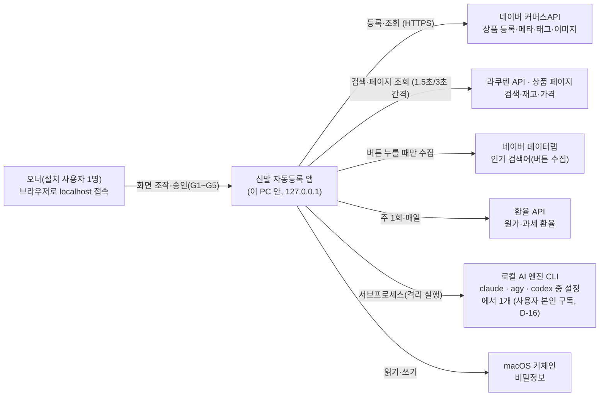
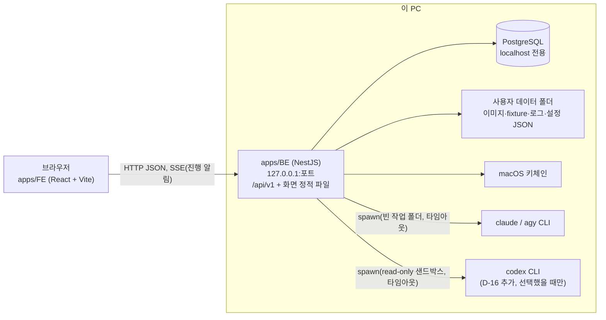
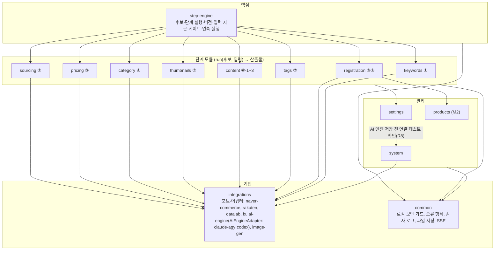

# 03-2. C4 다이어그램

## 1. System Context



외부 호출은 허용 목록에 있는 곳만 나간다(GEN-01). 사용 기록을 밖으로 보내지 않는다.

## 2. Container



- 개발 중에는 Vite 개발 서버(5173)가 `/api`를 BE로 넘긴다. 배포본은 BE가 FE 빌드 결과를 같이 내보낸다(한 프로세스).
- 이미지 원본·생성본은 파일로 두고, DB에는 경로와 SHA-256만 둔다.

## 3. Component (apps/BE 모듈)



- 의존 방향: step-engine이 단계 모듈을 부른다. 단계 모듈끼리는 서로 부르지 않고, 앞 단계 산출물은 step-engine이 넘긴다. 외부 호출은 integrations의 포트로만 한다.
- 게이트·안전 검사(아동화 차단, 최종 승인 사전 검증, 중복 방지)는 단계 모듈과 registration 안에 둔다. 호출 경로(단계·연속·일괄·CLI)와 상관없이 빠지지 않는다(GEN-02).
- **AI 엔진(D-16)**: integrations에 `AiEngineAdapter { code, detect(), authStatus(), smokeTest(model), runStructured(task, schema, inputs, {model, timeoutMs}) }` 포트와 구현 `ClaudeCodeAdapter`·`AgyAdapter`·`CodexAdapter`를 둔다. 이미지 생성 포트(`ImageGenProvider`)와 분리한다. 단계 모듈은 포트만 부르고, 실행기가 단계를 시작할 때 설정의 선택 엔진으로 어댑터를 골라 StepRun에 엔진·모델·CLI 버전을 고정한다. 선택 엔진을 쓸 수 없으면 멈추고 다른 엔진으로 넘어가지 않는다(M1).
- **settings**는 설정 JSON의 `ai` 섹션(선택 엔진·엔진별 모델) 쓰기를 맡고(원자적 쓰기 + 새 `settings_snapshot`), **system**은 감지·연결 테스트 기록 `ai_cli_check`를 소유한다. settings는 저장 전에 system의 최근 연결 테스트 통과(10분)를 확인한다.

### 3.1 StepRunner 규약 (P1-05, Proposed 2026-09-30 — 오너 검토)

단계 모듈(②~⑨, P2~P4)은 step-engine에 **실행기** 하나를 꽂는다. 단계 모듈이 step-engine에서 가져오는 것은 `modules/step-engine/contracts/step-runner.ts`와 `StepEngineApi`(`modules/step-engine/step-engine.api.ts`)뿐이다. step-engine은 단계 모듈을 import하지 않는다(순환 없음).

```ts
@StepRunnerFor('PRICING')          // 메타데이터(SetMetadata) — 클래스마다 한 단계
@Injectable()
export class PricingRunner implements StepRunner {
  readonly stepCode = 'PRICING';
  readonly usesAi = false;                                     // PRE_G2_AI_COST·AI 엔진 고정(P1-10)
  readInputs(ctx: StepInputContext): Promise<StepInput[]>;    // 값 포함. 트랜잭션 안에서도 불린다 — DB 읽기만
  run(ctx: StepRunContext): Promise<StepOutcome>;             // 트랜잭션 밖. 외부·AI 호출은 여기서만
  persist(tx, stepRunId, outcome): Promise<void>;             // 끝 트랜잭션 안(모든 결과 종류)
  copyOutput(tx, fromStepRunId, toStepRunId, edit?): Promise<CandidateEffects | void>; // 오너 수정·다시 고르기
  ownerInputsOf?(db, stepRunId);                              // 다시 실행 기본값(직전 버전 실행 중 오너 입력)
  anchorKeyOf?(db, stepRunId);                                // ② 다시 고르기의 ANCHOR_KEY_MISMATCH 검사
  onInterrupted?(tx, run): Promise<CandidateStatusEffect | null>; // 재시작 정리(⑨, P4-03)
}
```

- **등록**: 실행기 클래스에 `@StepRunnerFor(code)`를 달고 자기 모듈 `providers`에 넣는다. `StepRunnerRegistry`가 `onModuleInit`에서 `DiscoveryService`로 모은다. 한 단계에 둘이거나 표시와 `stepCode`가 다르면 앱 시작을 멈춘다. 실행기가 없는 단계는 실행 요청이 422 `INVALID_STEP_CODE`(`details.reason = NO_RUNNER`).
- **입력**: `StepInput = { inputKey, sourceType(PREV_STEP·OWNER_INPUT·SETTINGS), sourceStepRunId?, isStartCondition, required, value }`. 입력 키와 단계별 시작 조건은 `domain/input-keys.ts`·`domain/step-graph.ts`(`STEP_INPUT_SPECS`, PRD §5.3 표)를 따른다. 앞 단계 산출물은 `ctx.completedRunId(stepCode)`(현재 버전이 완료일 때만)로 읽는다. 엔진이 값 해시(정규화 JSON SHA-256)와 지문(시작 조건만)을 계산해 `step_run_input`에 남긴다. 이미지는 파일 해시, 설명은 `normalizeText`(NFKC·공백)한 글을 값으로 넣고, 수집 시각은 넣지 않는다.
- **결과**: `StepOutcome` = `COMPLETED { output, candidateEffects? }` · `WAITING_INPUT { waitingReasonCode, pendingInputs }` · `FAILED { failureKind(EXTERNAL_API·AI·INPUT_VALIDATION), errorCode, errorMessage }`. `run`이 던지면 엔진이 FAILED로 남긴다(ApiException 코드로 종류를 정하고, 그 밖 예외는 INPUT_VALIDATION·INTERNAL_ERROR). 실행 중 실패는 HTTP 오류가 아니라 실행 기록과 SSE `step-run.status-changed`다.
- **후보 효과**(`candidateEffects`): ② 앵커 확정·소싱 선택·성별 판단, ④ 리프 카테고리, 제외 사유. 엔진이 끝 트랜잭션 안에서 P1-04 서비스로 적용한다(단계 모듈은 `candidate`를 직접 쓰지 않는다). 409·422로 막히면 그 실행을 FAILED(INPUT_VALIDATION)로 닫는다.
- **`StepEngineApi`**: `resumeWaiting(stepRunId, { data })`(입력 대기 이어 가기 — RUNNING으로 되돌리고 `run`을 다시 돈다), `resumeWaiting(stepRunId, { outcome, scope? })`(결과로 끝내기 — 예: G3 선택으로 ⑤ 완료), `ownerInputChanged(candidateId, inputKey, scope?)`(완료 뒤 오너 입력 새 행 → 재실행 필요), `currentCompletedRun(candidateId, stepCode)`.
- **단일 진입점**: 단계 실행·연속 실행(P1-06)·일괄(M2)·CLI(M3)는 모두 `StepExecutionService.start(candidateId, stepCode, { mode, ownerInputs, stepChainId })`를 부른다. 시작 조건·잠금 검사(`execution/start-conditions.ts`·`step-locks.ts`·`step-blocks.ts`)는 실행 API의 409·레일의 `disabledReason`·목록 `runnableStep`이 같은 함수를 쓴다. 게이트·안전 검사는 실행기 안에 둔다.
- **포트**: `AI_ENGINE_RESOLVER`(AI를 쓰는 실행기의 시작 INSERT 전 엔진·모델·CLI 버전 고정, P1-10), `PAGE_DATA`(② 페이지 수집 시각, P2-02), `SETTINGS_RERUN_PROPAGATOR`(설정 변경 전파, step-engine이 끼운다).

## 4. 트랜잭션 경계

| 흐름 | 경계 | 이유 |
|---|---|---|
| 단계 시작·완료 | 시작: StepRun 새 버전 + 현재 버전 포인터 이동을 **한 트랜잭션**. 완료: 산출물 + StepRun 종료 상태 + 뒷단계 '재실행 필요' 표시를 **한 트랜잭션**(포인터 시점은 [ERD §7.2-17](../04_데이터베이스/04-1_ERD.md) — P1-05는 ERD대로 **시작** 트랜잭션에서 옮긴다. 시작 트랜잭션에는 `step_run_input`과 후보 상태 재평가, 완료 트랜잭션에는 끝 지문 비교·후보 효과·후보 상태 재평가가 함께 든다) | 중간에 앱이 꺼져도 상태가 어긋나지 않게(GEN-03). 뒷단계는 앞 단계 현재 버전이 '완료'일 때만 읽는다(PRD §5.3) |
| 게이트 통과(G2·G3) | 게이트 지문 기록 + 후보 상태 전이를 **한 트랜잭션**. G4(최종 승인)는 등록 기록의 승인 시각이 원본이다([ERD §7.1-3](../04_데이터베이스/04-1_ERD.md)) | 재통과 판단의 원본 |
| ⑨ 등록 | ① 등록 기록을 '등록요청중'으로 **먼저 커밋** → ② 커머스API 호출(트랜잭션 밖) → ③ 결과로 '등록됨'/오류 갱신. 응답을 못 받으면 '결과확인필요'로 두고 판매자관리코드로 조회 | 외부 호출은 DB 트랜잭션에 넣을 수 없다. 중복 등록 방지(RG-12)와 멱등(§8.7) |
| 앱 재시작 | '실행중' StepRun → '실패(중단됨)'. ⑨ 중이던 후보는 등록 기록으로 복구 | PRD §5.2 |

## 5. 로컬 보안 (로그인 없는 로컬 API 보호)

- BE는 127.0.0.1에만 붙는다. PostgreSQL도 localhost에서만 받는다.
- `Host` 헤더가 `127.0.0.1:포트`·`localhost:포트`가 아니면 거부한다(DNS 리바인딩 방지).
- 상태를 바꾸는 요청(POST·PUT·PATCH·DELETE)은 `Origin`이 앱 자신일 때만 받고, 사용자 정의 헤더(`X-AutoStore-Client`)를 요구한다. CORS는 열지 않는다(다른 사이트가 localhost API를 부르지 못하게).
- 비밀정보는 키체인에만 있고 API 응답·로그에 나오지 않는다. 키 입력 API는 쓰기만 하고 값을 돌려주지 않는다.
