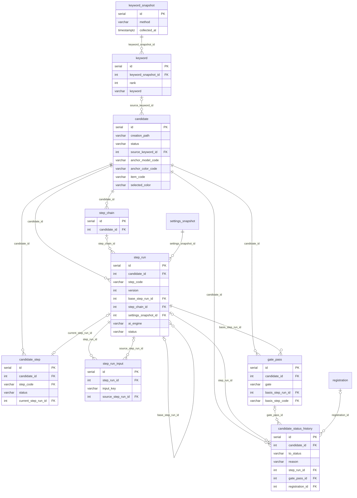
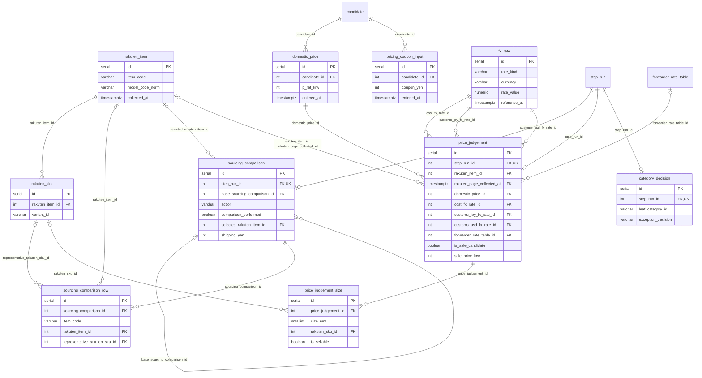

# 04-1. ERD — 신발 자동등록 로컬 웹앱

| 항목 | 내용 |
|---|---|
| 버전 | 0.4(D-16 AI 엔진 선택 반영, 이 문서 §8) |
| 날짜 | 2026-09-27 |
| 상태 | 초안 · 오너 검토 대기(D-11) |
| 근거 문서 | [PRD 초안](../../prd/03-PRD초안.md) §5.1 게이트 · §5.2 상태 모델 · §5.3 단계 실행 · §8 단계별 규칙 · §9 비기능 · §12 핵심 데이터 개체 · §18 구현 참고 [요구사항 추출](../../prd/03-1_요구사항추출.md) · [기능 리스트](../../prd/04_기능리스트.md) · [C4 다이어그램](../03_아키텍처/03-2_C4다이어그램.md) · [ADR-001 기술 스택](../02_기술스택/02-ADR-001_기술스택.md) |
| 짝 파일 | [04-3_schema.prisma](04-3_schema.prisma) — M1 테이블만. `prisma validate` 통과, 로컬 PostgreSQL 14.20 새 DB에 적용 확인(이 문서 §5.8) |
| 규모 | M1 테이블 55개(Prisma 스키마), M2 예정 테이블 18개(이 문서 §6) |

## 한눈에 보기

- **후보 한 건이 중심이다.** 후보(`candidate`)마다 단계(②~⑨, ⑥은 셋) 10개가 있고, 단계를 한 번 돌릴 때마다 `step_run`에 새 버전이 한 줄 쌓인다. 단계의 결과물(비교표, 판정, 카피, 태그, 등록 기록 등)은 각 단계 테이블이 그 버전(`step_run_id`)에 붙는다.
- **지우지 않는다.** 실행 기록·판정·등록 기록은 물리 삭제하지 않는다. 후보 '제외'도 상태로만 표시한다. 캐시(검색·메타)만 덮어쓴다. 삭제·수정 금지는 앱 규약에 더해 트리거가 막는다(이 문서 §1.3).
- **비밀정보는 DB에 없다.** API 키·토큰·쿠키는 macOS 키체인에만 둔다(NFR-02). 경쟁 태그 붙여넣기 원본도 저장하지 않는다(TG-01).
- **설정은 JSON 파일이 원본이다.** DB에는 로드한 설정의 해시·내용 사본(`settings_snapshot`)과, M1 화면에서 바꾸는 값(구매대행 프로필, 배대지 요금표, 환율 수동 입력, 등록 API 차단 스위치)만 둔다. 사용자가 고른 AI 엔진(Claude Code·Antigravity CLI·Codex)도 설정 JSON `ai` 섹션이 원본이고, DB에는 엔진 점검 이력(`ai_cli_check`)과 실행마다 실제로 쓴 엔진·모델·CLI 버전(`step_run.ai_*`)만 둔다(v0.4, D-16).
- **PRD 상태 이름은 그대로다.** 후보 8개·단계 6개 상태를 영어 코드로 1:1 옮겼다(이 문서 §4.1). 새 상태를 만들지 않았다.
- **네 영역 설계안을 합쳤다.** 겹치던 설정 스냅샷·요금표·로그·오너 입력 저장 위치를 하나로 모았고, 결정과 근거는 이 문서 §5에 있다. 정해지지 않은 것은 이 문서 §7에 ⚠️로 남겼다.

## 1. 읽는 법

### 1.1 타입 규칙

| 값 | PostgreSQL | Prisma | 비고 |
|---|---|---|---|
| PK | `serial`(integer) | `Int @id @default(autoincrement())` | 1인 로컬 앱 규모. JS BigInt 직렬화 문제를 피한다 |
| FK | `integer` | `Int` | 이름은 `{참조테이블}_id`. 역할을 밝혀야 하면(같은 테이블을 두 번 가리키거나, 현재·근거·대표·결과처럼 관계의 뜻이 있을 때) 앞에 뜻을 붙인다(`cost_fx_rate_id`, `current_step_run_id`, `return_commerce_addressbook_id`). 어느 경우든 참조 테이블 이름으로 끝난다 |
| 원화·엔화 | `integer` | `Int` | 최소 단위 정수. 이름 끝에 `_krw`·`_yen` |
| 달러 | `numeric(10,2)` | `Decimal @db.Decimal(10, 2)` | `v_usd` |
| 환율 | `numeric(12,4)` | `Decimal @db.Decimal(12, 4)` | `fx_rate.rate_value` |
| 비율·요율·배율 | `numeric(7,4)` | `Decimal @db.Decimal(7, 4)` | 0.0363 = 3.63% |
| 무게 | `numeric(6,3)` | `Decimal @db.Decimal(6, 3)` | kg. float를 쓰지 않는다 |
| 시각 | `timestamptz(6)` | `DateTime @db.Timestamptz(6)` | 모든 시각 |
| 날짜 | `date` | `DateTime @db.Date` | KST 기준 일자(`kst_date`), 기준일 |
| 상태·종류 | `varchar(n)` + CHECK | `String @db.VarChar(n)` | PG enum·Prisma enum을 쓰지 않는다. 값은 영어 대문자 코드, 한국어 대응은 이 문서 §4 |
| SHA-256 | `char(64)` + CHECK(소문자 hex) | `String @db.Char(64)` | 파일·지문·해시 |
| 네이버 int64 번호 | `varchar(20)` + CHECK(숫자만) | `String` | originProductNo 등. BigInt 직렬화 회피 |
| 문서형 값 | `jsonb` | `Json` | 이 문서 §5.6에 적은 곳에만 |
| 목록 | `varchar(n)[]`, `smallint[]` | `String[]` 등 | NOT NULL + 기본 `'{}'`. Prisma는 목록 열을 NULL 허용으로 만들므로 NOT NULL은 Prisma 밖 SQL에서 건다(0.2, `prisma migrate diff`가 되돌리지 않음을 확인) |

### 1.2 명명 규칙

- 테이블·컬럼: snake_case, 테이블은 단수(`candidate`, `step_run`). Prisma 모델은 PascalCase 단수 + `@@map`, 필드는 camelCase + `@map`.
- 엔티티 이름 정본은 PRD §12다. 쪼개거나 새로 만든 테이블은 이 문서 §3 각 표의 'PRD 개체' 칸과 이 문서 §5에 근거를 적었다.
- 제약 이름: CHECK `ck_{테이블 약어}_{뜻}`, 부분 UNIQUE `uq_…`, 부분 인덱스 `ix_…`. Prisma가 만드는 UNIQUE·인덱스·FK는 Prisma 기본 이름을 쓴다.
- 단계 코드(`step_code`)와 후보 상태 코드는 모든 테이블에서 같은 값을 쓴다(이 문서 §4.1, §4.2).
- 절 표시: '§5.2'·'§8.3'·'§12'처럼 앞에 아무것도 없으면 **PRD 절**이다. 이 문서의 절은 '이 문서 §5.6'처럼 적고, 통합 결정은 '결정 ⑧'(이 문서 §5.1 표의 번호)로 적는다. '03-2 §4'·'C4 §3'은 아키텍처 문서 절이다.

### 1.3 삭제·수정 정책

- FK의 ON DELETE는 기본 **RESTRICT**다. 로그성 참조(`call_log`, `user_action_log`의 후보·실행·등록 참조)만 **SET NULL**이다.
- FK의 ON UPDATE는 모두 **RESTRICT**다. Prisma는 `onUpdate`를 적지 않으면 CASCADE를 만들므로 모든 `@relation`에 `onUpdate: Restrict`를 적었다. PK는 serial이라 바뀌지 않는다.
- 거래·이력성 데이터는 물리 삭제하지 않는다. 후보 '제외'는 `candidate.status = 'EXCLUDED'`, 경쟁 태그 입력 빼기는 `removed_at`, 메타에서 사라진 항목은 `removed_at`으로 표시한다.
- `step_run`은 추가만 한다. 열린 실행(실행중·입력대기)만 상태를 바꿀 수 있고, 닫힌 행 수정과 삭제는 트리거가 막는다.
- 단계 산출물 테이블은 그 StepRun이 열려 있는 동안(오너 입력을 기다리는 동안)만 고친다. 닫힌 뒤에는 바꾸지 않고 새 버전을 만든다. 예외는 이 문서 §5.5.
- 물리 삭제를 허용하는 곳: 캐시(`rakuten_search_cache`, `rakuten_genre`, `commerce_*` 캐시, 메타 문서 덮어쓰기)뿐이다.
- **DB가 막는 방법**(Prisma 밖 SQL의 트리거 5종):
  - `trg_step_run_append_only` — `step_run`: 닫힌 행 수정·모든 삭제 거부. 열린 행이어도 시작 때 고정한 AI 엔진 열(`ai_engine`·`ai_model`·`ai_cli_version`) 변경 거부(v0.4).
  - `trg_append_only` — 추가만 하는 이력(수정·삭제 거부): `candidate_status_history`, `gate_pass`, `rakuten_item`, `rakuten_sku`, `domestic_price`, `pricing_coupon_input`, `fx_rate`, `image_asset`, `thumbnail_reference_input`, `tag_competitor_item`, `uploaded_image`, `forwarder_rate_tier`, `user_action_log`, `ai_cli_check`(v0.4).
  - `trg_forbid_delete` — 값은 갱신하지만 지우지 않는 표(삭제만 거부): `candidate`, `candidate_step`, `step_chain`, `keyword_snapshot`, `keyword`, `generation_run`, `tag_competitor_input`, `registration`, `registration_switch`, `settings_snapshot`, `forwarder_rate_table`, `purchase_agency_profile`, `commerce_meta_sync_run`, `call_log`.
  - `trg_output_frozen` — 단계 산출물과 그 자식(수정·삭제는 그 StepRun이 실행중·입력대기일 때만): `step_run_input`, `sourcing_comparison`(+`_row`), `price_judgement`(+`_size`), `category_decision`, `thumbnail_reference`, `thumbnail_selection`(+`_image`), `content_draft_copy`·`fact`·`field`·`assembly`, `tag_set`, `tag_candidate`, `tag_owner_edit`, `tag_set_competitor_input`, `upload_result`(+`_image`). `registration`·`generation_run`은 닫힌 뒤에도 고치는 예외라 여기서 뺐다(이 문서 §5.5).
  - `trg_candidate_anchor_fixed` — 확정된 앵커 키 변경 거부.
  - 테스트 데이터 정리는 `deleteMany`가 아니라 `TRUNCATE`로 한다(행 트리거가 돌지 않는다).

### 1.4 산출물 참조 규약

- 단계 산출물 테이블이 `step_run_id`로 StepRun을 가리킨다. `step_run` 쪽에는 산출물 FK를 두지 않는다(순환 참조를 피하고, 단계를 더해도 `step_run`이 바뀌지 않는다).

| 단계 | step_code | 산출물(1:1, `step_run_id` UNIQUE) | 같은 버전의 1:N 자식 |
|---|---|---|---|
| ② 소싱 | SOURCING | `sourcing_comparison` | `sourcing_comparison_row` |
| ③ 판정 | PRICING | `price_judgement` | `price_judgement_size` |
| ④ 카테고리 | CATEGORY | `category_decision` | — |
| ⑤ 썸네일 | THUMBNAIL | `thumbnail_selection` | `generation_run`, `thumbnail_reference`, `thumbnail_selection_image` |
| ⑥-1 카피 | COPY | `content_draft_copy` | `content_draft_field`(copy.*) |
| ⑥-2 고시 원자료 | NOTICE_RAW | `content_draft_fact` | `content_draft_field`(fact.*) |
| ⑥-3 고시·사양·고지·HTML | NOTICE_HTML | `content_draft_assembly` | `content_draft_field`(notice.*, product_name) |
| ⑦ 태그 | TAGS | `tag_set` | `tag_candidate`, `tag_owner_edit` |
| ⑧ 업로드 | UPLOAD | `upload_result` | `upload_result_image` |
| ⑨ 등록 | REGISTER | `registration` | — |

- 후보는 산출물 → `step_run.candidate_id`로 찾는다. 산출물 테이블에는 `candidate_id`를 두지 않는다(결정 ⑮).
- 현재 버전 = `candidate_step.current_step_run_id`. 복합 FK `(current_step_run_id, candidate_id, step_code) → step_run(id, candidate_id, step_code)`로 다른 후보·다른 단계의 실행을 가리키지 못한다.
- 같은 방식의 복합 FK를 다른 StepRun 참조에도 걸었다: `step_run.base_step_run_id`(같은 후보·같은 단계), `gate_pass.basis_step_run_id`(같은 후보, G2 → PRICING·G3 → THUMBNAIL), `step_run.step_chain_id`(같은 후보의 묶음). 후보 id가 없는 교차 참조(`step_run_input.source_step_run_id`, `candidate_status_history.step_run_id`·`gate_pass_id`, `price_judgement.domestic_price_id`, `registration.price_judgement_id`·`upload_result_id`, `tag_set_competitor_input`)는 앱이 검사한다(이 문서 §7.2-13).
- 산출물의 `step_run`이 맞는 단계인지(예: `price_judgement` → PRICING)는 step-engine의 저장 함수가 검사한다. DB로 막으려면 산출물마다 `step_code` 열을 더해야 해서 두지 않았다(이 문서 §7).
- '다시 실행'·재조회·오너 수정·'그대로 유지'·'이전 버전 다시 고르기'는 모두 새 StepRun과 새 산출물 행이다. 버전에 딸린 오너 입력 행(비교표 행별 쿠폰·배율, 필드별 오너 입력, 태그 추가·삭제)은 새 버전으로 복사해 가져간다.
- 완료 뒤에도 바뀔 수 있는 실행 중 오너 입력과 오너가 넣는 시작 조건은 후보 단위 추가만 테이블에 둔다: ③ 국내 기준가(`domestic_price`), URL 후보의 ③ 쿠폰(`pricing_coupon_input`), ⑤ 레퍼런스 선택(`thumbnail_reference_input`). 단계는 실행할 때 최신 행을 읽고, 읽은 값의 해시를 `step_run_input`에 남긴다. 완료 뒤 새 행이 생기면 그 해시와 달라져 '재실행 필요'와 바뀐 입력 이름(`candidate_step.stale_inputs`)을 계산할 수 있다(§5.3, F-BS-21).

### 1.5 Prisma 밖 SQL

- CHECK 제약, 부분·식 UNIQUE와 부분 인덱스, 트리거, 목록 열의 NOT NULL은 Prisma가 만들지 못한다. [04-3_schema.prisma](04-3_schema.prisma) 맨 아래 '// === Prisma 밖 SQL' 주석 블록에 SQL 문으로 적었고, 첫 마이그레이션(`prisma migrate dev --create-only`) 끝에 붙인다.
- `prisma migrate diff`는 이 객체들을 무시한다. 수동으로 만든 부분 인덱스·CHECK·트리거가 다음 마이그레이션에서 지워지지 않는 것을 로컬 PG 14.20에서 확인했다.
- Prisma 7.10에는 `partialIndexes` 미리보기 기능이 있지만 쓰지 않았다. 부분 UNIQUE를 `findUnique` 조건으로 노출해 '진행 중인 건만 유일하다'는 뜻을 흐리기 때문이다.
- §3의 각 테이블에 'CHECK'와 '(SQL)' 표시 인덱스를 적었다. 둘은 스키마 파일의 SQL과 같은 원본에서 만들었다.

## 2. 전체 관계도

영역별 네 장으로 나눴다. 각 그림에는 PK·FK와 주요 속성만 적었고, 길이·전체 컬럼은 이 문서 §3 표에 있다. 다른 그림의 테이블(예: `step_run`)은 이름만 나온다. 선 표기: `||` 반드시 1, `|o` 0 또는 1, `o{` 0 이상, `o|` 0 또는 1(1:1).

### 2.1 핵심 — 후보·단계 엔진·키워드

후보(`candidate`) 한 건에 단계 행(`candidate_step`) 10개와 실행 버전(`step_run`)이 붙는다. 게이트 통과(`gate_pass`)와 상태 전이 이력(`candidate_status_history`)도 후보에 붙는다. 산출물 테이블은 다음 그림들에서 `step_run`을 가리킨다.

### 2.2 소싱·판정·카테고리 (②③④)

라쿠텐 페이지 스냅샷(`rakuten_item`·`rakuten_sku`)은 후보와 독립이고, 비교표 행·판정이 FK로 가리킨다. 비교를 하지 않은 ② 버전('URL로 만들기')은 비교표 행 없이 머리 행(`sourcing_comparison.selected_rakuten_item_id`)이 고른 스냅샷을 가리킨다. 판정은 환율 3종과 요금표 버전을 FK로 고정하고, 판정에 쓴 페이지와 그 수집 시각은 복합 FK 하나로 고정한다. URL 후보의 ③ 쿠폰은 후보 단위 입력(`pricing_coupon_input`)이다.

### 2.3 이미지·콘텐츠·태그 (⑤⑥⑦)

이미지 파일 메타(`image_asset`)는 원본·생성본·업로드본을 한 표에 담는다. 레퍼런스 선택은 후보 단위 입력 이력(`thumbnail_reference_input`)과 ⑤ 버전이 쓴 사본(`thumbnail_reference`) 두 곳에 둔다. 콘텐츠는 ⑥-1·⑥-2·⑥-3이 각각 산출물을 갖고, 필드 단위 값·근거·오너 입력은 `content_draft_field`가 맡는다. ⑦ 버전이 읽은 경쟁 태그 입력은 연결 테이블(`tag_set_competitor_input`)로 잇는다.

```mermaid
erDiagram
  image_asset {
    serial id PK
    varchar kind
    char sha256
    varchar source_item_code
    int candidate_id FK
    int derived_from_image_asset_id FK
  }
  generation_run {
    serial id PK
    int step_run_id FK
    smallint slot_no
    varchar status
    int result_image_asset_id FK, UK
  }
  thumbnail_reference {
    serial id PK
    int step_run_id FK
    int image_asset_id FK
  }
  thumbnail_reference_input {
    serial id PK
    int candidate_id FK
    int input_no
    int image_asset_id FK
    smallint sort_order
  }
  thumbnail_selection {
    serial id PK
    int step_run_id FK, UK
  }
  thumbnail_selection_image {
    serial id PK
    int thumbnail_selection_id FK
    int image_asset_id FK
  }
  content_draft_copy {
    serial id PK
    int step_run_id FK, UK
  }
  content_draft_fact {
    serial id PK
    int step_run_id FK, UK
  }
  content_draft_field {
    serial id PK
    int step_run_id FK
    varchar field_key
    int evidence_image_asset_id FK
  }
  content_draft_assembly {
    serial id PK
    int step_run_id FK, UK
    varchar product_name
  }
  tag_set {
    serial id PK
    int step_run_id FK, UK
  }
  tag_candidate {
    serial id PK
    int tag_set_id FK
    varchar text
    varchar outcome
  }
  tag_owner_edit {
    serial id PK
    int tag_set_id FK
    varchar action
  }
  tag_competitor_input {
    serial id PK
    int candidate_id FK
  }
  tag_competitor_item {
    serial id PK
    int tag_competitor_input_id FK
    varchar tag_text
  }
  tag_set_competitor_input {
    serial id PK
    int tag_set_id FK
    int tag_competitor_input_id FK
  }
  candidate |o--o{ image_asset : "candidate_id"
  image_asset |o--o{ image_asset : "derived_from_image_asset_id"
  step_run ||--o{ generation_run : "step_run_id"
  image_asset |o--o| generation_run : "result_image_asset_id"
  step_run ||--o{ thumbnail_reference : "step_run_id"
  image_asset ||--o{ thumbnail_reference : "image_asset_id"
  candidate ||--o{ thumbnail_reference_input : "candidate_id"
  image_asset ||--o{ thumbnail_reference_input : "image_asset_id"
  step_run ||--o| thumbnail_selection : "step_run_id"
  thumbnail_selection ||--o{ thumbnail_selection_image : "thumbnail_selection_id"
  image_asset ||--o{ thumbnail_selection_image : "image_asset_id"
  step_run ||--o| content_draft_copy : "step_run_id"
  step_run ||--o| content_draft_fact : "step_run_id"
  step_run ||--o{ content_draft_field : "step_run_id"
  image_asset |o--o{ content_draft_field : "evidence_image_asset_id"
  step_run ||--o| content_draft_assembly : "step_run_id"
  step_run ||--o| tag_set : "step_run_id"
  tag_set ||--o{ tag_candidate : "tag_set_id"
  tag_set ||--o{ tag_owner_edit : "tag_set_id"
  candidate ||--o{ tag_competitor_input : "candidate_id"
  tag_competitor_input ||--o{ tag_competitor_item : "tag_competitor_input_id"
  tag_set ||--o{ tag_set_competitor_input : "tag_set_id"
  tag_competitor_input ||--o{ tag_set_competitor_input : "tag_competitor_input_id"
```

### 2.4 등록·설정·연동·시스템 (⑧⑨ 외)

등록 기록은 판정·⑧ 산출물을 FK로 고정한다. 설정 스냅샷은 모든 실행이 참조한다. 커머스API·라쿠텐 캐시는 단계 산출물과 FK 없이 값으로 잇는다. AI 엔진 점검 이력(`ai_cli_check`, v0.4)은 FK가 없고 엔진 코드로만 읽는다(실행이 쓴 엔진은 `step_run.ai_engine`에 값으로 남는다).

```mermaid
erDiagram
  registration {
    serial id PK
    int step_run_id FK, UK
    int price_judgement_id FK
    int upload_result_id FK
    varchar status
    varchar item_code
    varchar selected_color
    varchar color_code
    varchar seller_management_code
  }
  registration_switch {
    serial id PK
    boolean api_blocked
  }
  uploaded_image {
    serial id PK
    char source_sha256 UK
    int image_asset_id FK, UK
  }
  upload_result {
    serial id PK
    int step_run_id FK, UK
  }
  upload_result_image {
    serial id PK
    int upload_result_id FK
    int uploaded_image_id FK
  }
  settings_snapshot {
    serial id PK
    char content_sha256 UK
    varchar schema_version
  }
  forwarder_rate_table {
    serial id PK
    boolean is_active
  }
  forwarder_rate_tier {
    serial id PK
    int forwarder_rate_table_id FK
    numeric weight_max_kg
  }
  purchase_agency_profile {
    serial id PK
    int overseas_shipping_commerce_addressbook_id FK
    int return_commerce_addressbook_id FK
    int commerce_return_delivery_company_id FK
  }
  rakuten_search_cache {
    serial id PK
    char query_hash UK
    timestamptz expires_at
  }
  rakuten_genre {
    serial id PK
    int genre_id UK
  }
  commerce_category {
    serial id PK
    varchar category_id UK
    varchar whole_category_name
  }
  commerce_origin_area {
    serial id PK
    varchar origin_area_code UK
  }
  commerce_addressbook {
    serial id PK
    varchar address_book_no UK
    boolean is_overseas
  }
  commerce_return_delivery_company {
    serial id PK
    varchar code UK
  }
  commerce_meta_document {
    serial id PK
    varchar kind
    varchar scope_key
  }
  commerce_meta_sync_run {
    serial id PK
    varchar target
    varchar status
  }
  call_log {
    serial id PK
    timestamptz called_at
    date kst_date
    varchar target
    smallint http_status
    int candidate_id FK
    int step_run_id FK
  }
  user_action_log {
    serial id PK
    timestamptz occurred_at
    varchar event_type
    int candidate_id FK
    int step_run_id FK
    int registration_id FK
  }
  ai_cli_check {
    serial id PK
    varchar engine_code
    varchar trigger
    varchar auth_status
    varchar smoke_status
    timestamptz checked_at
  }
  step_run ||--o| registration : "step_run_id"
  price_judgement ||--o{ registration : "price_judgement_id"
  upload_result ||--o{ registration : "upload_result_id"
  image_asset ||--o| uploaded_image : "image_asset_id"
  step_run ||--o| upload_result : "step_run_id"
  upload_result ||--o{ upload_result_image : "upload_result_id"
  uploaded_image ||--o{ upload_result_image : "uploaded_image_id"
  forwarder_rate_table ||--o{ forwarder_rate_tier : "forwarder_rate_table_id"
  commerce_addressbook |o--o| purchase_agency_profile : "overseas_shipping_commerce_addressbook_id"
  commerce_addressbook |o--o| purchase_agency_profile : "return_commerce_addressbook_id"
  commerce_return_delivery_company |o--o| purchase_agency_profile : "commerce_return_delivery_company_id"
  candidate |o--o{ call_log : "candidate_id"
  step_run |o--o{ call_log : "step_run_id"
  candidate |o--o{ user_action_log : "candidate_id"
  step_run |o--o{ user_action_log : "step_run_id"
  registration |o--o{ user_action_log : "registration_id"
```

## 3. 테이블 정의

### 3.0 M1 테이블 목록

| # | 테이블 | 모듈 | 한 줄 설명 |
|---|---|---|---|
| 1 | [`candidate`](#candidate) | step-engine | 후보: 작업 단위(앵커 키 = 型番 또는 앵커 상품 + 색상) 한 건과 그 현재값 |
| 2 | [`candidate_status_history`](#candidate_status_history) | step-engine | 후보 상태 전이 이력(추가만). §5.2 전이 라벨을 사유 코드로 남긴다 |
| 3 | [`candidate_step`](#candidate_step) | step-engine | 후보·단계(②~⑨, ⑥-1~⑥-3 각각)마다 한 행: 현재 버전 포인터와 현재 단계 상태 |
| 4 | [`step_run`](#step_run) | step-engine | 단계 실행 한 번 = 단계의 한 버전(추가만). 산출물 테이블이 step_run_id로 이 행을 가리킨다 |
| 5 | [`step_run_input`](#step_run_input) | step-engine | 단계 실행이 읽은 입력 항목별 출처와 값 해시 |
| 6 | [`gate_pass`](#gate_pass) | step-engine | G2·G3 통과 기록과 게이트 지문(추가만) |
| 7 | [`step_chain`](#step_chain) | step-engine | '여기부터 연속 실행'·'재실행 필요 단계 모두 실행' 한 번의 묶음 |
| 8 | [`keyword_snapshot`](#keyword_snapshot) | keywords | 데이터랩 버튼 수집·붙여넣기 한 번의 결과 묶음 |
| 9 | [`keyword`](#keyword) | keywords | 스냅샷 안의 순위·키워드 한 줄과 G1 선택 기록 |
| 10 | [`rakuten_item`](#rakuten_item) | sourcing | 라쿠텐 상품 페이지 JSON을 한 번 읽고 파싱한 스냅샷(추가만) |
| 11 | [`rakuten_sku`](#rakuten_sku) | sourcing | rakuten_item 스냅샷 하나의 SKU(색상·사이즈·폭) 행 |
| 12 | [`sourcing_comparison`](#sourcing_comparison) | sourcing | ② 소싱 StepRun 버전 하나의 산출물 머리 행(1:1) |
| 13 | [`sourcing_comparison_row`](#sourcing_comparison_row) | sourcing | 비교표(RK-09) 한 행 = 라쿠텐 상품 하나 |
| 14 | [`domestic_price`](#domestic_price) | pricing | 후보의 국내 기준가(P_ref) 입력 이력(추가만) |
| 15 | [`pricing_coupon_input`](#pricing_coupon_input) | pricing | 비교표 행이 없는 후보(URL 후보)의 ③ 쿠폰 금액 입력 이력(추가만, ③ 시작 조건) |
| 16 | [`price_judgement`](#price_judgement) | pricing | ③ 판정 StepRun 버전 하나의 판정 스냅샷 머리 행(1:1) |
| 17 | [`price_judgement_size`](#price_judgement_size) | pricing | 판정 스냅샷의 사이즈별 비용 분해·면세·최소 판매가·판매 가능 |
| 18 | [`fx_rate`](#fx_rate) | pricing | 원가 환율·과세환율의 수집·수동 입력 기록(추가만) |
| 19 | [`category_decision`](#category_decision) | category | ④ 카테고리 StepRun 버전 하나의 산출물(1:1) |
| 20 | [`image_asset`](#image_asset) | common | 이미지 파일 1개의 메타데이터(파일은 사용자 데이터 폴더, 추가만) |
| 21 | [`generation_run`](#generation_run) | thumbnails | AI 썸네일 생성 시도 1회(결과 이미지 0~1장) |
| 22 | [`thumbnail_reference`](#thumbnail_reference) | thumbnails | ⑤ 버전이 쓴 레퍼런스 1~3장과 '사람·얼굴 없음' 확인(후보 입력의 버전별 사본) |
| 23 | [`thumbnail_reference_input`](#thumbnail_reference_input) | thumbnails | 후보의 레퍼런스 선택 입력 이력(추가만). 최신 입력 번호가 현재 선택 |
| 24 | [`thumbnail_selection`](#thumbnail_selection) | thumbnails | ⑤ 버전의 G3 선택 결과(체크리스트·'같은 상품·색상' 확인) |
| 25 | [`thumbnail_selection_image`](#thumbnail_selection_image) | thumbnails | G3 선택본에 들어간 이미지(대표 1장 + 추가 0~9장) |
| 26 | [`content_draft_copy`](#content_draft_copy) | content | ⑥-1 카피 StepRun 버전의 산출물(1:1) |
| 27 | [`content_draft_fact`](#content_draft_fact) | content | ⑥-2 고시 원자료 StepRun 버전의 머리 행(1:1) |
| 28 | [`content_draft_field`](#content_draft_field) | content | ⑥-1·⑥-2·⑥-3 버전의 필드 단위 값·근거·오너 입력·재확인 필요 |
| 29 | [`content_draft_assembly`](#content_draft_assembly) | content | ⑥-3 고시·사양·고지·HTML StepRun 버전의 조립 결과(1:1) |
| 30 | [`tag_set`](#tag_set) | tags | ⑦ 태그 StepRun 버전의 머리 행(1:1) |
| 31 | [`tag_candidate`](#tag_candidate) | tags | ⑦ 버전의 태그 후보 1개(출처·필터·restricted·최종 선정) |
| 32 | [`tag_owner_edit`](#tag_owner_edit) | tags | ⑦ 버전에 적용한 오너의 태그 추가·삭제 목록 |
| 33 | [`tag_set_competitor_input`](#tag_set_competitor_input) | tags | ⑦ 버전이 읽은 경쟁 태그 입력(입력 출처) |
| 34 | [`tag_competitor_input`](#tag_competitor_input) | tags | 오너가 넣은 경쟁 태그 입력 1건의 머리 행(원본은 저장하지 않음) |
| 35 | [`tag_competitor_item`](#tag_competitor_item) | tags | 경쟁 태그 입력 1건에서 파서가 뽑은 태그 한 줄 |
| 36 | [`registration`](#registration) | registration | G4 승인 1회당 1행인 등록 기록(⑨ 산출물) |
| 37 | [`registration_switch`](#registration_switch) | registration | 등록 API 차단 스위치(드라이런)의 현재 상태(단일 행) |
| 38 | [`uploaded_image`](#uploaded_image) | registration | 커머스API 이미지 업로드로 받은 URL(원천 이미지 해시별 1행) |
| 39 | [`upload_result`](#upload_result) | registration | ⑧ 업로드 StepRun 버전의 산출물(최종 detailContent, 1:1) |
| 40 | [`upload_result_image`](#upload_result_image) | registration | ⑧ 산출물에 들어간 업로드 이미지와 역할·순서 |
| 41 | [`settings_snapshot`](#settings_snapshot) | settings | 앱 시작 때 검증을 통과한 설정 파일 묶음의 스냅샷(내용 해시별 1행) |
| 42 | [`forwarder_rate_table`](#forwarder_rate_table) | settings | 배대지 요금표 CSV를 가져올 때마다 만드는 버전(활성 1개) |
| 43 | [`forwarder_rate_tier`](#forwarder_rate_tier) | settings | 요금표 버전의 무게 구간별 요금 |
| 44 | [`purchase_agency_profile`](#purchase_agency_profile) | settings | 해외구매대행 프로필(설치본당 1행) |
| 45 | [`rakuten_search_cache`](#rakuten_search_cache) | integrations | Ichiba Item Search 응답의 쿼리별 6시간 캐시 |
| 46 | [`rakuten_genre`](#rakuten_genre) | integrations | IchibaGenre API로 받은 장르 트리 캐시 |
| 47 | [`commerce_category`](#commerce_category) | integrations | 커머스API 리프 카테고리와 예외 유형 캐시 |
| 48 | [`commerce_origin_area`](#commerce_origin_area) | integrations | 커머스API 원산지 코드 캐시 |
| 49 | [`commerce_addressbook`](#commerce_addressbook) | integrations | 스토어 주소록 캐시 |
| 50 | [`commerce_return_delivery_company`](#commerce_return_delivery_company) | integrations | 반품 택배사 목록 캐시 |
| 51 | [`commerce_meta_document`](#commerce_meta_document) | integrations | 통째로 읽는 커머스API 메타 응답 캐시((종류, 범위 키)별 1행) |
| 52 | [`commerce_meta_sync_run`](#commerce_meta_sync_run) | integrations | 메타 동기화 1회(대상별) 기록(추가만) |
| 53 | [`call_log`](#call_log) | integrations | 외부 HTTP·AI 호출 1회당 1행. 비공식 수집 기록·하루 조회 상한·차단 휴지의 단일 원본 |
| 54 | [`user_action_log`](#user_action_log) | common | 오너 행위·게이트·설정 변경의 감사 기록(추가만). M2부터 화면 체류 이벤트도 |
| 55 | [`ai_cli_check`](#ai_cli_check) | system | AI 엔진(CLI) 감지·연결 테스트 1회의 엔진별 결과(추가만, v0.4 D-16) |

### 3.1 step-engine — 후보·단계 실행·게이트

#### `candidate`

| 항목 | 내용 |
|---|---|
| PRD 개체 | Candidate |
| 소유 모듈 · 마일스톤 | step-engine · M1 |
| 목적 | 작업 단위 한 건. 생성 경로, 앵커 키, 소싱 선택(itemCode·selectedColor), 성별, 리프 카테고리의 **현재값**과 후보 상태를 둔다. 단계별 현재 버전 포인터는 `candidate_step`, 게이트 통과 기록은 `gate_pass`, 상태 전이 이력은 `candidate_status_history`로 뗐다(§18 '현재 버전 포인터를 따로 둔다'). 등록되면 끝나고, 이후는 SmartstoreProduct(M2)가 맡는다. '제외'는 상태로만 표시하고 행을 지우지 않는다. |
| 받쳐 주는 기능 | F-CW-03, F-CW-04, F-CW-05, F-CW-06, F-CW-07, F-CW-08, F-CW-09, F-CW-11, F-CW-12, F-CW-22, F-CW-25, F-CW-26, F-BS-18, F-BS-23, F-KW-06, F-SO-01, F-SO-18, F-SO-19, F-SO-35, F-PJ-02, F-PJ-18, F-CA-05, F-AP-23, F-DB-01, F-DB-03 |

| 컬럼 | 타입 | NULL | 기본값 | 설명·근거 |
|---|---|---|---|---|
| `id` (PK) | serial | N | — | PK |
| `creation_path` | varchar(16) | N | — | 생성 경로(§12: 키워드 / 검색어 / 라쿠텐 URL / 직접 입력). F-BS-23, GEN-07 |
| `status` | varchar(24) | N | 'WORKING' | 후보 상태(§5.2 후보 상태도 8개, 코드는 이 문서 §4). 임시 후보는 'TEMP'로 만든다 |
| `status_changed_at` | timestamptz(6) | N | now() | 마지막 상태 전이 시각. 목록·대시보드 정렬(F-CW-09, F-DB-03) |
| `excluded_reason` | varchar(24) | Y | — | '제외' 사유(§5.2 전이 라벨 4개). 다시 작업중이 되면 NULL(F-CW-06, F-PJ-18) |
| `source_keyword_id` (FK) | integer | Y | — | 출처 키워드(G1에서 고른 keyword). 후보의 단계가 아니라 정보로만 표시(§5.2, F-KW-06) |
| `rakuten_query` | varchar(128) | Y | — | 라쿠텐 검색어(반각 128자 이내, RK-01). varchar(n)은 글자 수라 128이면 충분하다 |
| `source_url` | varchar(2048) | Y | — | 'URL로 만들기'에 붙여 넣은 라쿠텐 상품 URL(RK-02, F-SO-35) |
| `anchor_model_code` | varchar(128) | Y | — | 앵커 型番 정규화값(NFKC→대문자→공백·하이픈 제거, RK-03). 확정 뒤 바꿀 수 없다(트리거) |
| `anchor_item_code` | varchar(128) | Y | — | 型番이 없을 때의 앵커 상품 itemCode(§5.2). anchor_model_code와 둘 중 하나만 채운다 |
| `anchor_color_code` | varchar(64) | Y | — | 앵커 색상 코드. 임시 후보·앵커 선택 전에는 NULL. 값의 출처는 ⚠️ M0 S2. 색상 코드를 못 얻는 상품이면 `ck_candidate_anchor_fixed`·`ck_candidate_ready` 때문에 앵커를 확정하지 못하고 승인대기로도 못 간다(이 문서 §7.3-1) |
| `anchor_fixed_at` | timestamptz(6) | Y | — | 앵커 키 확정 시각. 이 값이 있으면 anchor_* 변경을 트리거가 거부한다(F-CW-03) |
| `item_code` | varchar(128) | Y | — | 소싱 선택 itemCode(샵코드:상품ID로 정규화). 같은 앵커 키 안에서 ②가 바꿀 수 있다. RG-12 키 |
| `selected_color` | varchar(128) | Y | — | PRD selectedColor. RG-12 키의 두 번째 값. 값 형식(색상 코드인지 원문인지)은 ⚠️ 이 문서 §7 |
| `gender` | varchar(8) | Y | — | 후보 성별 현재값(§5.3 '성별'). ③·④·⑥-3·⑦의 시작 조건 |
| `gender_source` | varchar(8) | Y | — | 성별 출처(② 자동 / 오너 입력). 오너 입력은 ② 재실행이 덮어쓰지 않는다 |
| `gender_recheck_required` | boolean | N | false | ② 판단이 오너 입력 성별과 다를 때 '재확인 필요'(§5.3, F-CW-08). 오너 입력 성별일 때만 true가 될 수 있다(CHECK) |
| `leaf_category_id` | varchar(20) | Y | — | ④ 확정 leafCategoryId 현재값(§12). 버전 이력은 category_decision |
| `whole_category_name` | varchar(500) | Y | — | ④ wholeCategoryName 현재값. ⑦ 태그 필터·상품명이 읽는다 |
| `no_comparison_confirmed_at` | timestamptz(6) | Y | — | '비교 없이 확정' 체크 시각(§12, G2 조건, 웹 화면만). F-PJ-02, F-AP-23 |
| `created_at` | timestamptz(6) | N | now() | 생성 시각 |
| `updated_at` | timestamptz(6) | N | now() · @updatedAt | Prisma @updatedAt |

**FK**

- `(source_keyword_id)` → `keyword(id)` ON DELETE RESTRICT — keyword 1 : 0..N candidate

**인덱스**

- `(status, status_changed_at)` — 후보 목록·대시보드가 상태로 거르고 최근 전이 순으로 정렬한다(F-CW-09, F-DB-01·03). 매 화면 조회 경로
- (SQL) `uq_candidate_active_item_color`: `CREATE UNIQUE INDEX uq_candidate_active_item_color ON candidate (item_code, selected_color) WHERE item_code IS NOT NULL AND status NOT IN ('EXCLUDED','REGISTERED');` — 부분 UNIQUE. 진행 중 후보끼리 같은 itemCode+색상 금지(§5.2 후보 중복, RG-12). 후보 생성·임시 연결·소싱 선택 변경·제외 해제 때의 중복 조회도 이 인덱스가 받친다

**CHECK**

- `ck_candidate_creation_path`: `creation_path IN ('KEYWORD','SEARCH_QUERY','RAKUTEN_URL','DIRECT_INPUT')`
- `ck_candidate_status`: `status IN ('TEMP','WORKING','EXCLUDED','AWAITING_APPROVAL','VALIDATED','REGISTERING','RESULT_CHECK_REQUIRED','REGISTERED')`
- `ck_candidate_excluded_reason`: `excluded_reason IN ('ANCHOR_NO_MATCH','INSUFFICIENT_STOCK','NOT_SALE_CANDIDATE','OWNER_EXCLUDED')`
- `ck_candidate_excluded_pair`: `(status = 'EXCLUDED') = (excluded_reason IS NOT NULL)`
- `ck_candidate_gender`: `gender IN ('MALE','FEMALE')`
- `ck_candidate_gender_source`: `gender_source IN ('STEP2','OWNER')`
- `ck_candidate_gender_pair`: `(gender IS NULL) = (gender_source IS NULL)`
- `ck_candidate_gender_recheck`: `NOT gender_recheck_required OR gender_source = 'OWNER'` — '재확인 필요'는 ②가 오너 입력 성별을 덮어쓰지 않을 때만 생긴다(§5.3 성별)
- `ck_candidate_temp`: `status <> 'TEMP' OR (creation_path = 'DIRECT_INPUT' AND item_code IS NULL AND anchor_color_code IS NULL)`
- `ck_candidate_item_color_pair`: `(item_code IS NULL) = (selected_color IS NULL)`
- `ck_candidate_anchor_one`: `num_nonnulls(anchor_model_code, anchor_item_code) <= 1`
- `ck_candidate_anchor_base`: `anchor_color_code IS NULL OR anchor_model_code IS NOT NULL OR anchor_item_code IS NOT NULL`
- `ck_candidate_anchor_fixed`: `(anchor_color_code IS NULL) = (anchor_fixed_at IS NULL)` — ⚠️ 색상 코드를 늘 얻는다는 가정. M0 S2 뒤 확정(이 문서 §7.3-1)
- `ck_candidate_ready`: `status IN ('TEMP','WORKING','EXCLUDED') OR (item_code IS NOT NULL AND anchor_color_code IS NOT NULL AND gender IS NOT NULL AND leaf_category_id IS NOT NULL)` — ⚠️ 위와 같은 가정
- `ck_candidate_category_pair`: `(leaf_category_id IS NULL) = (whole_category_name IS NULL)`
- `ck_candidate_url_path`: `creation_path <> 'RAKUTEN_URL' OR source_url IS NOT NULL`
- `ck_candidate_keyword_path`: `creation_path <> 'KEYWORD' OR source_keyword_id IS NOT NULL`

**트리거(SQL)**: `candidate_anchor_fixed` — 앵커 키는 후보 안에서 고정(§5.2, F-CW-03). CHECK로는 이전 값과 비교할 수 없어 트리거로 막는다

#### `candidate_status_history`

| 항목 | 내용 |
|---|---|
| PRD 개체 | Candidate '상태'의 전이 이력(신규 분리). §5.2 '상태가 바뀔 때마다 UserActionLog 저장' 중 상태 전이 부분 |
| 소유 모듈 · 마일스톤 | step-engine · M1 |
| 목적 | 후보 상태 전이를 추가만 하는 이력으로 남긴다. §5.2 전이 라벨을 사유 코드로 보존하고, 전이를 일으킨 단계 실행·게이트 통과·등록 기록과 FK로 잇는다. 상태 자체의 원본은 `candidate.status`다. 재시작 복구(F-BS-18)와 SCR-12 상태 이력, 처리량 집계가 읽는다. 성공 지표 '처리 건수'(승인대기에 처음 닿은 후보, F-DB-04 M2)는 따로 저장하지 않고 후보별 `min(changed_at) WHERE to_status = 'AWAITING_APPROVAL'`로 센다. |
| 받쳐 주는 기능 | F-CW-05, F-CW-06, F-CW-07, F-BS-17, F-BS-18, F-PJ-18, F-AP-26, F-AP-28, F-AP-29, F-AP-30, F-AP-31, F-DB-04 |

| 컬럼 | 타입 | NULL | 기본값 | 설명·근거 |
|---|---|---|---|---|
| `id` (PK) | serial | N | — | PK |
| `candidate_id` (FK) | integer | N | — | 대상 후보 |
| `from_status` | varchar(24) | Y | — | 이전 상태. 생성 기록이면 NULL. 승인대기→승인대기(재조회 뒤 G2 지문 불변)처럼 같을 수 있다 |
| `to_status` | varchar(24) | N | — | 새 상태 |
| `reason` | varchar(32) | N | — | 전이 사유 = §5.2 전이 라벨 코드(이 문서 §4 대응표) |
| `step_run_id` (FK) | integer | Y | — | 전이를 일으킨 단계 실행(예: ③ 재판정 → 제외, ⑨ 등록) |
| `gate_pass_id` (FK) | integer | Y | — | 같은 트랜잭션에서 기록한 G2·G3 통과(03-2 §4 트랜잭션 경계) |
| `registration_id` (FK) | integer | Y | — | G4 승인·등록 결과로 생긴 전이의 등록 기록(검증완료·등록요청중·결과확인필요·등록됨) |
| `changed_at` | timestamptz(6) | N | now() | 전이 시각 |

**FK**

- `(candidate_id)` → `candidate(id)` ON DELETE RESTRICT — candidate 1 : N
- `(step_run_id)` → `step_run(id)` ON DELETE RESTRICT — step_run 1 : 0..N
- `(gate_pass_id)` → `gate_pass(id)` ON DELETE RESTRICT — gate_pass 1 : 0..N
- `(registration_id)` → `registration(id)` ON DELETE RESTRICT — registration 1 : 0..N

**인덱스**

- `(candidate_id, changed_at)` — SCR-12 후보 상태 이력 조회. 전체 행은 계속 쌓이므로 후보별 조회에 필요

**CHECK**

- `ck_csh_from_status`: `from_status IN ('TEMP','WORKING','EXCLUDED','AWAITING_APPROVAL','VALIDATED','REGISTERING','RESULT_CHECK_REQUIRED','REGISTERED')`
- `ck_csh_to_status`: `to_status IN ('TEMP','WORKING','EXCLUDED','AWAITING_APPROVAL','VALIDATED','REGISTERING','RESULT_CHECK_REQUIRED','REGISTERED')`
- `ck_csh_reason`: `reason IN ('CREATED','TEMP_LINKED','ANCHOR_NO_MATCH','INSUFFICIENT_STOCK','NOT_SALE_CANDIDATE','OWNER_EXCLUDED','REOPENED','READY_FOR_APPROVAL','STEP_NOT_CURRENT','GATE_FINGERPRINT_CHANGED','REFETCH_G2_UNCHANGED','G4_APPROVED_BLOCKED','BLOCK_SWITCH_OFF','G4_APPROVED','REGISTER_SUCCEEDED','REGISTER_4XX','REGISTER_UNKNOWN','APP_RESTART','RESTART_REVERTED','SELLER_CODE_FOUND','SELLER_CODE_NOT_FOUND')`
- `ck_csh_created`: `(from_status IS NULL) = (reason = 'CREATED')`

#### `candidate_step`

| 항목 | 내용 |
|---|---|
| PRD 개체 | Candidate '단계별 현재 버전 포인터'(§12) — §18 '현재 버전 포인터를 따로 둔다' |
| 소유 모듈 · 마일스톤 | step-engine · M1 |
| 목적 | 후보·단계마다 한 행(후보 생성 때 10행을 NOT_RUN으로 만든다). 현재 버전 포인터와 현재 단계 상태(§5.2 단계 상태 6개)를 둔다. StepRun은 추가만 하므로, 완료 뒤 '재실행 필요'로 바뀌는 상태와 사유(바뀐 입력 이름)는 이 행에서 갱신한다. 포인터는 복합 FK로 같은 후보·같은 단계의 StepRun만 가리킬 수 있다. |
| 받쳐 주는 기능 | F-BS-16, F-BS-17, F-BS-18, F-BS-19, F-BS-21, F-CW-09, F-CW-10, F-CW-11, F-CW-13, F-CW-14, F-CW-15, F-CW-16, F-CW-18, F-CW-21, F-AP-07, F-AP-23, F-DB-01, F-DB-03 |

| 컬럼 | 타입 | NULL | 기본값 | 설명·근거 |
|---|---|---|---|---|
| `id` (PK) | serial | N | — | PK |
| `candidate_id` (FK) | integer | N | — | 후보 |
| `step_code` (FK) | varchar(16) | N | — | 단계 코드(이 문서 §4) |
| `status` | varchar(16) | N | 'NOT_RUN' | 현재 단계 상태(§5.2 단계 상태 6개). 시작 조건 검사·잠금·이어 하기·RG-08 단계 최신성이 읽는다 |
| `current_step_run_id` (FK) | integer | Y | — | 현재 버전 = 이 단계의 최신 StepRun. **실행 시작 트랜잭션**에서 새 StepRun(RUNNING)으로 옮기고 status도 RUNNING으로 바꾼다. 완료 트랜잭션은 StepRun 종료 + 산출물 + 이 행의 status + 뒷단계 '재실행 필요'를 함께 쓴다. 그래서 실행이 실패하면 현재 버전은 실패한 실행이고, 뒷단계는 읽지 못한다(§5.3 '현재 버전이 완료일 때만 읽는다'). C4 §4 '단계 완료' 행은 포인터를 완료 때 옮긴다고 적어 이 문서와 다르다(⚠️ 이 문서 §7.2-17) |
| `last_version` | integer | N | 0 | 마지막으로 발급한 버전 번호. UPDATE … RETURNING으로 다음 version을 원자적으로 발급(F-BS-19) |
| `stale_inputs` | varchar(64)[] | N | '{}' | '재실행 필요' 사유 = 바뀐 입력 이름 목록(step_run_input.input_key). F-CW-11, F-BS-21 |
| `stale_since` | timestamptz(6) | Y | — | '재실행 필요'가 된 시각 |
| `updated_at` | timestamptz(6) | N | now() · @updatedAt | Prisma @updatedAt |

**FK**

- `(candidate_id)` → `candidate(id)` ON DELETE RESTRICT — candidate 1 : 10
- `(current_step_run_id, candidate_id, step_code)` → `step_run(id, candidate_id, step_code)` ON DELETE RESTRICT — step_run 1 : 0..1 (같은 후보·단계만, 복합 FK)

**UNIQUE**

- `(candidate_id, step_code)` — 후보 한 건의 단계 레일 조회(SCR-12)와 단계 상태 확인 — 모든 단계 실행의 기본 경로

**인덱스**

- (SQL) `ix_candidate_step_attention`: `CREATE INDEX ix_candidate_step_attention ON candidate_step (status) WHERE status IN ('RUNNING','WAITING_INPUT','FAILED','RERUN_REQUIRED');` — 대시보드 '재실행 필요 후보 모아 보기'(F-DB-01)·이어 하기(F-CW-10)·단계별 대기 건수(F-DB-03)와 재시작 정리(F-BS-18). 대부분 행은 완료·미실행이라 부분 인덱스가 작다

**CHECK**

- `ck_candidate_step_code`: `step_code IN ('SOURCING','PRICING','CATEGORY','THUMBNAIL','COPY','NOTICE_RAW','NOTICE_HTML','TAGS','UPLOAD','REGISTER')`
- `ck_candidate_step_status`: `status IN ('NOT_RUN','RUNNING','WAITING_INPUT','COMPLETED','FAILED','RERUN_REQUIRED')`
- `ck_candidate_step_pointer`: `(status = 'NOT_RUN') = (current_step_run_id IS NULL)`
- `ck_candidate_step_stale`: `(status = 'RERUN_REQUIRED') = (stale_since IS NOT NULL)`
- `ck_candidate_step_stale_inputs`: `status = 'RERUN_REQUIRED' OR cardinality(stale_inputs) = 0`
- `ck_candidate_step_last_version`: `last_version >= 0`

#### `step_run`

| 항목 | 내용 |
|---|---|
| PRD 개체 | StepRun |
| 소유 모듈 · 마일스톤 | step-engine · M1 |
| 목적 | 단계 실행 한 번(= 그 단계의 한 버전). 추가만 하고 지우지 않는다. 열린 실행(실행중·입력대기)만 상태·종료 지문·대기 시간을 갱신하고, 닫힌 행은 트리거가 막는다. 오너 수정·그대로 유지·이전 버전 다시 고르기도 새 버전 행으로 남긴다. 산출물은 각 단계 모듈의 산출물 테이블이 `step_run_id`로 이 행을 가리킨다(이 문서 §1.4 '산출물 참조 규약'). AI를 부르는 단계는 실행 시작 때 선택 엔진·모델·CLI 버전을 이 행에 고정하고 끝까지 그 엔진으로 돈다. 설정에서 엔진을 바꿔도 진행 중인 실행과 이미 만든 결과는 그대로다(v0.4, D-16 R9·R11). |
| 받쳐 주는 기능 | F-BS-15, F-BS-17, F-BS-18, F-BS-19, F-BS-20, F-BS-22, F-BS-23, F-CW-01, F-CW-13, F-CW-14, F-CW-16, F-CW-19, F-CW-21, F-CW-28, F-PJ-14, F-BS-75, F-BS-76 |

| 컬럼 | 타입 | NULL | 기본값 | 설명·근거 |
|---|---|---|---|---|
| `id` (PK) | serial | N | — | PK |
| `candidate_id` (FK) | integer | N | — | 후보 |
| `step_code` | varchar(16) | N | — | 단계(②~⑨, ⑥-1~⑥-3 각각). 코드는 이 문서 §4 |
| `version` | integer | N | — | 후보·단계별 1부터. '다시 실행'은 입력이 같아도 새 버전(F-BS-19) |
| `execution_mode` | varchar(12) | N | — | 실행 방식(§12: 단계 / 연속 / 일괄 / CLI / 오너 수정) |
| `owner_action` | varchar(16) | Y | — | 오너 수정 종류(값 편집 / 그대로 유지 / 이전 버전 다시 고르기). execution_mode=OWNER_EDIT일 때만. F-CW-01·19·21 |
| `base_step_run_id` (FK) | integer | Y | — | 이 버전의 바탕 버전(오너 수정·그대로 유지 대상·다시 고른 이전 버전). 같은 후보·같은 단계의 실행만(복합 FK) |
| `step_chain_id` (FK) | integer | Y | — | 연속 실행 묶음(execution_mode=CHAIN일 때). 같은 후보의 묶음만(복합 FK) |
| `settings_snapshot_id` (FK) | integer | N | — | 실행 시작 때 로드돼 있던 설정 파일 스냅샷(요율·템플릿·사전 버전의 근거, PR-06 '요율 버전') |
| `ai_engine` | varchar(16) | Y | — | 실행 시작 때 고정한 AI 엔진(CLAUDE·AGY·CODEX, 이 문서 §4.2). AI를 부르지 않는 단계는 NULL. 다른 엔진으로 몰래 넘어가지 않는다(D-16 R10). 화면 'AI 생성 · Claude Code' 표시의 근거(R11, F-BS-75) |
| `ai_model` | varchar(100) | Y | — | 실행 시작 때 고정한 모델 별칭·ID(`sonnet`, `gemini-3.8-flash-medium` 등. `--model`로 명시한 값, AI-01). `ai_engine`이 있으면 NOT NULL. 텍스트·비전 모델이 다르면 이 단계의 주 작업 모델 |
| `ai_cli_version` | varchar(40) | Y | — | 실행 시작 때 감지한 CLI 버전(`--version` 결과). 버전 확인에 실패하면 NULL |
| `status` | varchar(16) | N | 'RUNNING' | 이 실행의 상태(§5.2 단계 상태 중 미실행을 뺀 5개). 끝날 때 지문이 다르면 RERUN_REQUIRED |
| `failure_kind` | varchar(20) | Y | — | 실패 종류(§5.2 전이 라벨: 외부 API·AI 오류, 입력 검증 실패, 앱 종료로 중단). INTERRUPTED = '실패(중단됨)' |
| `error_code` | varchar(100) | Y | — | 오류 코드(외부 상태 코드·AGY_ERROR 등). 실행 중 선택 엔진을 쓸 수 없게 되면 `AI_ENGINE_UNAVAILABLE`(failure_kind = AI, D-16 R10, F-BS-76). 비밀정보 금지 |
| `error_message` | text | Y | — | 한국어 안내 문구 |
| `input_fingerprint_start` | char(64) | N | — | 시작 때 입력 지문(시작 조건 키 정렬 JSON의 SHA-256 hex, §18). 실행 중 오너 입력·수집 시각 제외(F-BS-20) |
| `input_fingerprint_end` | char(64) | Y | — | 끝날 때 시작 조건으로 다시 계산한 지문(§5.3 규칙 2) |
| `rerun_reason_inputs` | varchar(64)[] | N | '{}' | 끝날 때 지문이 달라 RERUN_REQUIRED가 된 경우 바뀐 입력 이름 |
| `waiting_since` | timestamptz(6) | Y | — | 현재 입력 대기 시작 시각 |
| `wait_seconds_total` | integer | N | 0 | 입력 대기 누적 초. 자동 처리 시간 = (종료−시작) − 대기(NFR-01, F-BS-22) |
| `started_at` | timestamptz(6) | N | now() | 시작 시각 |
| `ended_at` | timestamptz(6) | Y | — | 종료 시각. 열린 실행은 NULL |

**FK**

- `(candidate_id)` → `candidate(id)` ON DELETE RESTRICT — candidate 1 : N
- `(base_step_run_id, candidate_id, step_code)` → `step_run(id, candidate_id, step_code)` ON DELETE RESTRICT — step_run 1 : 0..N (복합 자기 참조. 다른 후보·다른 단계의 버전을 바탕으로 삼지 못한다)
- `(step_chain_id, candidate_id)` → `step_chain(id, candidate_id)` ON DELETE RESTRICT — step_chain 1 : N (다른 후보의 묶음을 가리키지 못한다)
- `(settings_snapshot_id)` → `settings_snapshot(id)` ON DELETE RESTRICT — settings_snapshot 1 : N

**UNIQUE**

- `(candidate_id, step_code, version)` — 단계별 버전 이력(F-CW-21)과 직전 버전 찾기(F-BS-21)를 겸한다
- `(id, candidate_id, step_code)` — candidate_step·step_run(바탕 버전)·gate_pass 복합 FK의 대상. 다른 후보·단계를 가리키지 못하게 한다

**인덱스**

- (SQL) `uq_step_run_one_open`: `CREATE UNIQUE INDEX uq_step_run_one_open ON step_run (candidate_id, step_code) WHERE status IN ('RUNNING','WAITING_INPUT');` — 부분 UNIQUE. 후보·단계마다 열린 실행(실행중·입력대기)은 하나(§5.3 '같은 단계는 한 번에 하나만 실행'). 동시 클릭이나 CLI·웹이 같은 단계를 두 번 여는 것을 DB가 막는다. 앱 재시작 때 '실행중' → '실패(중단됨)' 일괄 전환(F-BS-18)도 열린 행만 담은 이 인덱스로 찾는다. 입력대기 중인 실행을 새 실행으로 대체할 때 이전 행을 닫을 상태가 없다(⚠️ 이 문서 §7.1-15)

**CHECK**

- `ck_step_run_code`: `step_code IN ('SOURCING','PRICING','CATEGORY','THUMBNAIL','COPY','NOTICE_RAW','NOTICE_HTML','TAGS','UPLOAD','REGISTER')`
- `ck_step_run_mode`: `execution_mode IN ('STEP','CHAIN','BATCH','CLI','OWNER_EDIT')`
- `ck_step_run_status`: `status IN ('RUNNING','WAITING_INPUT','COMPLETED','FAILED','RERUN_REQUIRED')`
- `ck_step_run_owner_action`: `owner_action IN ('EDIT','KEEP_AS_IS','RESTORE_VERSION')`
- `ck_step_run_owner_edit`: `(execution_mode = 'OWNER_EDIT') = (owner_action IS NOT NULL)`
- `ck_step_run_owner_base`: `owner_action IS NULL OR base_step_run_id IS NOT NULL`
- `ck_step_run_keep_copy_only`: `owner_action IS DISTINCT FROM 'KEEP_AS_IS' OR step_code = 'COPY'`
- `ck_step_run_chain`: `(execution_mode = 'CHAIN') = (step_chain_id IS NOT NULL)`
- `ck_step_run_failure_kind`: `failure_kind IN ('EXTERNAL_API','AI','INPUT_VALIDATION','INTERRUPTED')`
- `ck_step_run_failure_pair`: `(status = 'FAILED') = (failure_kind IS NOT NULL)`
- `ck_step_run_open`: `(status IN ('RUNNING','WAITING_INPUT')) = (ended_at IS NULL)`
- `ck_step_run_waiting`: `(status = 'WAITING_INPUT') = (waiting_since IS NOT NULL)`
- `ck_step_run_rerun_reason`: `status <> 'RERUN_REQUIRED' OR cardinality(rerun_reason_inputs) > 0`
- `ck_step_run_cli`: `execution_mode <> 'CLI' OR step_code <> 'REGISTER'`
- `ck_step_run_version`: `version >= 1`
- `ck_step_run_wait`: `wait_seconds_total >= 0`
- `ck_step_run_time`: `ended_at IS NULL OR ended_at >= started_at`
- `ck_step_run_fp`: `input_fingerprint_start ~ '^[0-9a-f]{64}$' AND (input_fingerprint_end IS NULL OR input_fingerprint_end ~ '^[0-9a-f]{64}$')`
- `ck_step_run_ai_engine`: `ai_engine IN ('CLAUDE','AGY','CODEX')` (v0.4)
- `ck_step_run_ai_model`: `(ai_engine IS NULL) = (ai_model IS NULL)` — 엔진이 있으면 모델도 있고, 엔진이 없으면 모델도 없다 (v0.4)
- `ck_step_run_ai_cli_version`: `ai_cli_version IS NULL OR ai_engine IS NOT NULL` (v0.4)

**트리거(SQL)**: `step_run_append_only` — StepRun 추가만(§12, §18). 열린 실행만 상태를 바꿀 수 있고, 닫힌 행 수정과 삭제를 막는다. 열린 실행이어도 `ai_engine`·`ai_model`·`ai_cli_version`은 시작 때(INSERT) 쓴 값에서 바꾸지 못한다(v0.4, 'AI engine columns are fixed at start')

#### `step_run_input`

| 항목 | 내용 |
|---|---|
| PRD 개체 | StepRun '입력 항목별 출처'(§12, §5.3 'M1 데이터 모델에 미리 넣을 것') — 자식 테이블로 분리 |
| 소유 모듈 · 마일스톤 | step-engine · M1 |
| 목적 | 실행이 읽은 입력 항목마다 출처(앞 단계 산출물 버전 / 오너 입력 / 설정)와 값 해시를 남긴다. '재실행 필요' 전파 때 항목별 해시를 비교해 '바뀐 입력 이름'을 내고, 단계 레일에 입력 출처를 보여 준다. 조회·비교에 쓰므로 JSONB가 아니라 행으로 뺐다. |
| 받쳐 주는 기능 | F-BS-20, F-BS-21, F-BS-23, F-CW-11, F-CW-16, F-CW-19, F-CW-26, F-CA-05 |

| 컬럼 | 타입 | NULL | 기본값 | 설명·근거 |
|---|---|---|---|---|
| `id` (PK) | serial | N | — | PK |
| `step_run_id` (FK) | integer | N | — | 이 입력을 읽은 실행 |
| `input_key` | varchar(64) | N | — | 입력 항목 이름(§5.3 시작 조건·실행 중 오너 입력을 코드로. 예: sourcing.skuPrices, candidate.gender, settings.pricing.kCard, owner.domesticPrice, owner.coupon(URL 후보 ③ 쿠폰, 시작 조건), owner.referenceSelection(⑤ 레퍼런스 선택, 실행 중 오너 입력), settings.thumbnail.promptTemplate·settings.thumbnail.faceOptionDefault(⑤ 시작 조건)). 코드 상수로 관리 |
| `source_type` | varchar(12) | N | — | 출처(앞 단계 산출물 버전 / 오너 입력 / 설정) |
| `source_step_run_id` (FK) | integer | Y | — | source_type=PREV_STEP일 때 읽은 앞 단계 버전. 판정의 '② 버전'(PR-06)도 여기서 읽는다 |
| `is_start_condition` | boolean | N | — | true = 시작 조건(지문에 포함), false = 실행 중 오너 입력(지문 제외, §5.3) |
| `value_hash` | char(64) | N | — | 항목 값의 SHA-256(정규화 JSON, 이미지는 파일 해시, 설명은 NFKC·공백 정리 텍스트). '선택' 입력이 없으면 null 값의 해시 |

**FK**

- `(step_run_id)` → `step_run(id)` ON DELETE RESTRICT — step_run 1 : N
- `(source_step_run_id)` → `step_run(id)` ON DELETE RESTRICT — step_run 1 : 0..N

**UNIQUE**

- `(step_run_id, input_key)` — 전파 계산은 후보의 현재 버전(최대 10개)의 입력을 step_run_id로 읽는다. source_step_run_id 역방향은 후보 단위 계산이라 인덱스를 두지 않는다

**완료 뒤 바뀐 오너 입력 판정**: 후보 단위 입력 테이블(`domestic_price`, `pricing_coupon_input`, `thumbnail_reference_input`)에 새 행이 생기면, step-engine이 최신 값의 해시를 현재 버전의 같은 `input_key` 행 `value_hash`와 비교한다. 다르면 그 단계를 '재실행 필요'로 두고 `candidate_step.stale_inputs`에 이 `input_key`를 넣는다. 시작 조건(owner.coupon)은 지문 재계산으로, 계산에 쓰는 실행 중 오너 입력(owner.domesticPrice, owner.referenceSelection)은 이 비교로 잡는다(§5.3, F-BS-21).

**CHECK**

- `ck_step_run_input_source`: `source_type IN ('PREV_STEP','OWNER_INPUT','SETTINGS')`
- `ck_step_run_input_prev`: `(source_type = 'PREV_STEP') = (source_step_run_id IS NOT NULL)`
- `ck_step_run_input_hash`: `value_hash ~ '^[0-9a-f]{64}$'`

**M2에 더할 것**: direct_input_id int NULL → direct_input.id (GEN-07 입구 값 출처, F-CW-25·26)

#### `gate_pass`

| 항목 | 내용 |
|---|---|
| PRD 개체 | Candidate '게이트 통과 기록(게이트, 시각, 게이트 지문)'(§12) — 자식 테이블로 분리 |
| 소유 모듈 · 마일스톤 | step-engine · M1 |
| 목적 | G2(소싱 확정)·G3(썸네일 선택) 통과를 추가만 하는 기록으로 남긴다. 게이트 지문을 저장하고, 현재 값으로 다시 계산한 지문과 **최신 통과 행**을 비교해 유효성을 판단한다(§5.1). 후보 상태 전이와 한 트랜잭션(03-2 §4). G1은 `keyword.selected_at`, G4는 `registration.approved_at`, G5는 M2 SmartstoreProduct가 맡는다. |
| 받쳐 주는 기능 | F-CW-02, F-CW-05, F-CW-11, F-CW-15, F-CW-17, F-PJ-20, F-TH-16, F-AP-23 |

| 컬럼 | 타입 | NULL | 기본값 | 설명·근거 |
|---|---|---|---|---|
| `id` (PK) | serial | N | — | PK |
| `candidate_id` (FK) | integer | N | — | 후보 |
| `gate` | varchar(2) | N | — | 게이트(G2 / G3) |
| `fingerprint` | char(64) | N | — | 게이트 지문 SHA-256. G2 = itemCode·선택 색상 + 판매 후보 여부·판매 사이즈 집합·사이즈별 판매가·옵션가 / G3 = 레퍼런스 파일 해시 + 선택본 파일 해시 + 앵커 키(§5.1) |
| `fingerprint_basis` | jsonb | N | — | 지문을 만든 구성값 스냅샷(문서형). 지문이 바뀌었을 때 무엇이 바뀌었는지 보여 주는 용도로만 쓴다 |
| `basis_step_run_id` (FK) | integer | N | — | 통과 근거 단계 버전(G2 → ③ 판정 버전, G3 → ⑤ 썸네일 버전) |
| `basis_step_code` (FK) | varchar(16) | N | — | 근거 버전의 단계 코드. 복합 FK와 CHECK로 G2는 PRICING, G3은 THUMBNAIL 실행만 근거로 삼게 한다 |
| `passed_at` | timestamptz(6) | N | now() | 통과 시각(웹 화면에서만 기록, §5.1) |

**FK**

- `(candidate_id)` → `candidate(id)` ON DELETE RESTRICT — candidate 1 : N
- `(basis_step_run_id, candidate_id, basis_step_code)` → `step_run(id, candidate_id, step_code)` ON DELETE RESTRICT — step_run 1 : 0..N (복합 FK. 다른 후보의 판정이나 엉뚱한 단계를 근거로 한 통과 기록을 막는다)

**인덱스**

- `(candidate_id, gate, passed_at DESC)` — 게이트별 최신 통과 행 조회 — 후보 상태 자동 전환(F-CW-05), 연속 실행 멈춤 판단(F-CW-15), RG-08 단계 최신성(F-AP-23)이 매번 부른다

**CHECK**

- `ck_gate_pass_gate`: `gate IN ('G2','G3')`
- `ck_gate_pass_basis`: `(gate = 'G2' AND basis_step_code = 'PRICING') OR (gate = 'G3' AND basis_step_code = 'THUMBNAIL')`
- `ck_gate_pass_fp`: `fingerprint ~ '^[0-9a-f]{64}$'`

**트리거(SQL)**: `gate_pass_append_only`(`trg_append_only`) — 통과 기록은 고치거나 지우지 않는다

**G3과 레퍼런스 변경**: G3 지문은 ⑤ **현재 버전**의 레퍼런스·선택본으로 계산한다. 완료 뒤 레퍼런스만 바꾸면(`thumbnail_reference_input` 새 행) ⑤ 현재 버전은 그대로라 지문도 그대로다. 대신 ⑤가 '재실행 필요'가 되어 후보는 승인대기로 갈 수 없고(F-CW-05), ⑧도 시작할 수 없다(§5.3 필수 시작 조건). ⑤를 다시 실행해 새 G3 선택을 하면 지문이 바뀌고 새 `gate_pass` 행이 생긴다.

#### `step_chain`

| 항목 | 내용 |
|---|---|
| PRD 개체 | (신규) StepRun 실행 방식 '연속'의 묶음 — §5.3 연속 실행·'재실행 필요 단계 모두 실행' |
| 소유 모듈 · 마일스톤 | step-engine · M1 |
| 목적 | 연속 실행 한 번을 묶는다. 화면을 다시 열어도(SSE 재연결) 진행 중인 연속 실행과 멈춘 이유를 보여 주고, 앱 재시작 때 열린 묶음을 닫는다. §12에 없는 개체라 신규이며, execution_mode=CHAIN인 StepRun이 이 묶음을 가리킨다. |
| 받쳐 주는 기능 | F-CW-14, F-CW-15, F-CW-16, F-BS-15, F-BS-18 |

| 컬럼 | 타입 | NULL | 기본값 | 설명·근거 |
|---|---|---|---|---|
| `id` (PK) | serial | N | — | PK |
| `candidate_id` (FK) | integer | N | — | 후보 |
| `kind` | varchar(16) | N | — | 여기부터 연속 실행 / 재실행 필요 단계 모두 실행 |
| `start_step_code` | varchar(16) | Y | — | 고른 시작 단계(FROM_HERE는 필수). G2 전에는 SOURCING·PRICING만 허용(앱 규칙, F-CW-15) |
| `started_at` | timestamptz(6) | N | now() | 시작 시각 |
| `ended_at` | timestamptz(6) | Y | — | 끝난 시각. 진행 중이면 NULL |
| `stop_reason` | varchar(24) | Y | — | 멈춘 이유(§5.3 '연속 실행 세부'의 멈추는 곳) |
| `stop_step_code` | varchar(16) | Y | — | 멈춘 단계 |
| `skipped_step_codes` | varchar(16)[] | N | '{}' | 연속 실행이 '완료·최신'이라 건너뛴 단계 코드(F-CW-14·15, 화면 표시). API 05-1 §7.6 S4 반영(v0.3). CHECK `ck_step_chain_skipped` |

**FK**

- `(candidate_id)` → `candidate(id)` ON DELETE RESTRICT — candidate 1 : N

**UNIQUE**

- `(id, candidate_id)` — step_run 복합 FK `(step_chain_id, candidate_id)`의 대상. 조회 경로가 아니다

**인덱스**

- (SQL) `ix_step_chain_open`: `CREATE INDEX ix_step_chain_open ON step_chain (candidate_id) WHERE ended_at IS NULL;` — 후보 화면·SSE 재연결에서 진행 중 연속 실행 찾기, 앱 재시작 때 열린 묶음 닫기(F-BS-18)

**CHECK**

- `ck_step_chain_kind`: `kind IN ('FROM_HERE','RERUN_STALE')`
- `ck_step_chain_start`: `kind <> 'FROM_HERE' OR start_step_code IS NOT NULL`
- `ck_step_chain_start_code`: `start_step_code IN ('SOURCING','PRICING','CATEGORY','THUMBNAIL','COPY','NOTICE_RAW','NOTICE_HTML','TAGS','UPLOAD')`
- `ck_step_chain_stop_code`: `stop_step_code IN ('SOURCING','PRICING','CATEGORY','THUMBNAIL','COPY','NOTICE_RAW','NOTICE_HTML','TAGS','UPLOAD','REGISTER')`
- `ck_step_chain_stop_reason`: `stop_reason IN ('AWAIT_G2','AWAIT_G3','AWAIT_G4','NO_RUNNABLE_STEP','APP_RESTART')`
- `ck_step_chain_end`: `(ended_at IS NULL) = (stop_reason IS NULL)`

### 3.2 keywords — ① 키워드

#### `keyword_snapshot`

| 항목 | 내용 |
|---|---|
| PRD 개체 | KeywordSnapshot |
| 소유 모듈 · 마일스톤 | keywords · M1 |
| 목적 | 데이터랩 버튼 수집 또는 붙여넣기 한 번의 결과 묶음(수집 시각·방식·기간·범위·결과 상태). 이상 응답으로 멈춘 수집도 남긴다. 403·418·429 뒤 24시간 쉬는 판단은 이 표가 아니라 `call_log`(target=DATALAB)로 한다(이 문서 §5 결정 ⑦). F-KW-06의 '필터'는 M1에서 성별·연령·기기가 늘 '전체'라(필터 선택 F-KW-10은 M2) 열을 두지 않는다. M1 스냅샷의 필터 = 전체이고, M2에 `filters`(NULL = 전체)를 더한다. |
| 받쳐 주는 기능 | F-KW-01, F-KW-02, F-KW-03, F-KW-04, F-KW-05, F-KW-06, F-KW-09, F-KW-10, F-BS-33 |

| 컬럼 | 타입 | NULL | 기본값 | 설명·근거 |
|---|---|---|---|---|
| `id` (PK) | serial | N | — | PK |
| `method` | varchar(8) | N | — | 버튼 수집 / 붙여넣기(KW-01, F-KW-01·05) |
| `collected_at` | timestamptz(6) | N | now() | 수집 시각 |
| `requested_cids` | varchar(16)[] | N | '{}' | 요청한 cid 목록(M1 기본 50000173·50000174). 붙여넣기는 고른 1개 또는 빈 배열(모름) |
| `period_start` | date | Y | — | 요청 시작일(종료일 − 1개월, KST). 붙여넣기는 NULL(F-KW-03) |
| `period_end` | date | Y | — | 요청 종료일(어제, KST) |
| `rank_limit` | integer | Y | — | 수집 범위(100 / 500위, F-KW-02) |
| `response_range` | varchar(40) | Y | — | 응답 range 원문(예: 2026.08.23. ~ 2026.09.23.) |
| `range_matched` | boolean | Y | — | range를 파싱해 요청 기간과 맞춰 본 결과(F-KW-03) |
| `status` | varchar(12) | N | — | 정상 종료 / 이상으로 중단(§8.1) |
| `abort_reason` | varchar(20) | Y | — | 이상 사유(§8.1 목록, F-KW-04) |
| `http_status` | smallint | Y | — | 중단 때 HTTP 상태 코드 |

**인덱스**: PK 말고 없음(조회 경로가 PK·FK 조인뿐이거나 행이 적다).

**CHECK**

- `ck_kws_method`: `method IN ('BUTTON','PASTE')`
- `ck_kws_status`: `status IN ('RUNNING','COMPLETED','ABORTED')` — RUNNING은 버튼 수집이 202로 수락된 뒤 진행 중인 묶음(API 05-1 §7.6 S1, v0.3)
- `ck_kws_abort_reason`: `abort_reason IN ('NO_RANKS_KEY','HTTP_404','NOT_JSON','RETURN_CODE','COUNT_MISMATCH','HTTP_403','HTTP_418','HTTP_429')`
- `ck_kws_abort_pair`: `(status = 'ABORTED') = (abort_reason IS NOT NULL)`
- `ck_kws_button`: `method = 'PASTE' OR (period_start IS NOT NULL AND period_end IS NOT NULL AND rank_limit IS NOT NULL)`
- `ck_kws_rank_limit`: `rank_limit IN (100, 500)`
- `ck_kws_period`: `period_start IS NULL OR period_end IS NULL OR period_start <= period_end`
- `ck_kws_http`: `http_status IS NULL OR status = 'ABORTED'`

**M2에 더할 것**: filters jsonb NULL — 성별·연령·기기 필터 요청값(F-KW-10). NULL = 전체

#### `keyword`

| 항목 | 내용 |
|---|---|
| PRD 개체 | Keyword |
| 소유 모듈 · 마일스톤 | keywords · M1 |
| 목적 | 스냅샷 안의 순위·키워드 한 줄. 아동화 제외 여부와 G1 선택 기록(`selected_at`)을 둔다. 후보는 고른 키워드만 출처 키워드로 참조한다. |
| 받쳐 주는 기능 | F-KW-05, F-KW-06, F-KW-07, F-KW-08, F-KW-11, F-KW-12, F-KW-13, F-KW-14 |

| 컬럼 | 타입 | NULL | 기본값 | 설명·근거 |
|---|---|---|---|---|
| `id` (PK) | serial | N | — | PK |
| `keyword_snapshot_id` (FK) | integer | N | — | 소속 스냅샷 |
| `cid` | varchar(16) | Y | — | 카테고리 ID(50000173 여 / 50000174 남). 붙여넣기에서 '모름'이면 NULL(후보 성별은 ②가 정한다, F-KW-05) |
| `rank` | integer | N | — | 순위 |
| `keyword` | varchar(100) | N | — | 키워드 원문 |
| `excluded_reason` | varchar(12) | Y | — | 제외 사유. M1은 아동화 키워드(CON-08) 하나. '제외됨' 필터로만 보인다(F-KW-07) |
| `selected_at` | timestamptz(6) | Y | — | G1에서 오너가 고른 시각(G1 통과 기록, F-KW-08). 후보 단위 게이트가 아니라 gate_pass에 두지 않는다 |

**FK**

- `(keyword_snapshot_id)` → `keyword_snapshot(id)` ON DELETE RESTRICT — keyword_snapshot 1 : N

**UNIQUE**

- `(keyword_snapshot_id, cid, rank)` — 키워드 화면(SCR-02)이 스냅샷 하나를 cid·순위 순으로 읽는 경로를 겸한다. cid가 NULL인 행끼리는 PG14에서 중복 검사가 안 되므로 파서가 막는다

**CHECK**

- `ck_keyword_rank`: `rank >= 1`
- `ck_keyword_excluded`: `excluded_reason IN ('CHILD')`
- `ck_keyword_excluded_not_selected`: `excluded_reason IS NULL OR selected_at IS NULL`

**M2에 더할 것**: classification varchar(16) NULL — 규칙 분류 GENERAL/BRAND/BRAND_MODEL(KW-04, F-KW-11)

### 3.3 sourcing — ② 라쿠텐 소싱

#### `rakuten_item`

| 항목 | 내용 |
|---|---|
| PRD 개체 | RakutenItem |
| 소유 모듈 · 마일스톤 | sourcing · M1 |
| 목적 | 라쿠텐 상품 페이지 JSON(item-page-app-data)을 조회·파싱할 때마다 한 행을 추가하는 스냅샷(수정·삭제 없음). 2단계 조회·'재고 확인'·'재조회'·URL 입구(·M2 동기화) 모두 새 행이다. 후보와 독립이라 후보를 만들기 전 URL 조회도 담는다. 파싱 자체가 실패하면 행을 만들지 않고 비교표 행에 '수동 확인'으로 남긴다. §12의 '검증 여부'는 `sourcing_comparison_row.is_verified`로 옮겼다(이 표의 행은 모두 페이지를 실제로 읽은 것). JAN은 SKU 단위라 `rakuten_sku.article_number`에 둔다. |
| 받쳐 주는 기능 | F-SO-07, F-SO-12, F-SO-13, F-SO-14, F-SO-15, F-SO-17, F-SO-31, F-SO-32, F-SO-33, F-SO-34, F-SO-35, F-BS-36, F-BS-37, F-CW-20, F-TH-01, F-CT-05, F-SO-43, F-PM-13 |

| 컬럼 | 타입 | NULL | 기본값 | 설명·근거 |
|---|---|---|---|---|
| `id` (PK) | serial | N | — | PK |
| `item_code` | varchar(128) | N | — | `샵코드:상품ID` API 형식으로 정규화(RG-12, F-SO-32, F-BS-37). 스냅샷이라 UNIQUE 아님 |
| `shop_code` | varchar(64) | N | — | 샵 코드 |
| `shop_name` | varchar(255) | Y | — | 샵명(비교표 열, RK-09) |
| `item_name` | text | N | — | 상품명. 아동 단어·NGKeyword 제외어 검사, ⑥-1·⑦·상품명 입력 |
| `item_url` | varchar(2048) | N | — | 라쿠텐 상품 링크(CON-14 크레딧·링크) |
| `model_code` | varchar(128) | Y | — | メーカー型番 원문(RK-03 5, F-SO-10) |
| `model_code_norm` | varchar(128) | Y | — | NFKC→대문자→공백·하이픈 제거(RK-03 2). 앵커 비교 키 |
| `entry_source` | varchar(8) | N | — | 출처(§12: API·수동). MANUAL = 라쿠텐 URL 붙여넣기(RK-02) |
| `fetch_reason` | varchar(16) | N | — | 조회 이유(신규 소싱 / URL 입구 / 재고 확인 / 재조회 / 동기화(M2)) |
| `collected_at` | timestamptz(6) | N | — | 페이지 수집 시각. '오래됨' 6시간(F-CW-20), 판정 유효 시간(F-PJ-22)의 근거 |
| `genre_id` | integer | Y | — | 라쿠텐 genreId(외부 값). rakuten_genre와 논리 대응만 하고 FK는 두지 않는다(캐시에 없을 수 있음) |
| `genre_source` | varchar(16) | N | — | 장르 출처(§12: API / 페이지 JSON / Item Search 보완 / 얻지 못함) |
| `genre_path` | varchar(500) | Y | — | 수집 시점 장르 경로(ID·이름) 사본. 성별 판정(RK-05)·④ 매핑 입력 |
| `product_type` | varchar(64) | Y | — | 상품유형(예: 러닝화). ④ 매핑표 키·⑦·상품명 입력. 정하는 방법 ⚠️ 이 문서 §7 |
| `back_order_flag` | boolean | Y | — | identicalVariants.backOrderFlag(取り寄せ). 기본 제외(RK-05) |
| `unlimited_inventory` | boolean | Y | — | identicalVariants.unlimitedInventoryFlag |
| `all_sku_same_price` | boolean | Y | — | standardPrice.identical(모든 SKU 같은 가격) |
| `sale_starts_at` | timestamptz(6) | Y | — | 세일 시작(RK-04 '(있으면) 세일 기간', 경로 M0 S2) |
| `sale_ends_at` | timestamptz(6) | Y | — | 세일 종료. M2 타임세일 배지·종료 임박 경고(F-SO-43, F-PJ-25) 입력 |
| `description_html` | text | Y | — | 설명 HTML 원문(경로 M0 S2) |
| `description_text` | text | Y | — | HTML에서 뽑은 텍스트(NFKC·공백 정리). ⑥-1·⑥-2 입력이자 입력 지문 재료(§5.3 규칙 1) |
| `attributes` | jsonb | Y | — | 상품 속성 원문(외부 응답 문서) |
| `variant_selectors` | jsonb | Y | — | variantSelectors[] 원문(カラー·サイズ·ウイズ 축). 색상 선택 화면용 |
| `image_urls` | jsonb | N | '[]' | media.images[] 원본 이미지 URL 목록. 받은 파일은 image_asset(F-TH-01·02) |
| `manual_check_required` | boolean | N | false | 키 누락 등으로 일부 항목을 '수동 확인'으로 넘김(F-SO-14) |
| `manual_check_note` | varchar(500) | Y | — | 수동 확인 사유(읽지 못한 키) |
| `raw_file_path` | varchar(1024) | Y | — | 원본 페이지 JSON 파일 경로(사용자 데이터 폴더). 감사·fixture(NFR-06) |
| `raw_file_sha256` | char(64) | Y | — | 원본 파일 SHA-256 |
| `raw_file_bytes` | integer | Y | — | 원본 파일 크기(바이트) |

**UNIQUE**

- `(id, collected_at)` — price_judgement 복합 FK `(rakuten_item_id, rakuten_page_collected_at)`의 대상. 판정의 수집 시각 사본이 원본과 같음을 DB가 보장한다. 조회 경로가 아니다

**인덱스**: 위 UNIQUE 말고 없음(조회 경로가 PK·FK 조인뿐이다).

**트리거(SQL)**: `rakuten_item_append_only`(`trg_append_only`) — 스냅샷은 고치거나 지우지 않는다(`rakuten_sku`도 같다)

**CHECK**

- `ck_rakuten_item_entry`: `entry_source IN ('API','MANUAL')`
- `ck_rakuten_item_fetch`: `fetch_reason IN ('SOURCING','URL_ENTRY','STOCK_CHECK','REFETCH','SYNC')`
- `ck_rakuten_item_genre_source`: `genre_source IN ('API','PAGE_JSON','ITEM_SEARCH','NOT_FOUND')`
- `ck_rakuten_item_genre_pair`: `(genre_source = 'NOT_FOUND') = (genre_id IS NULL)`
- `ck_rakuten_item_raw_pair`: `(raw_file_path IS NULL) = (raw_file_sha256 IS NULL)`
- `ck_rakuten_item_raw`: `raw_file_sha256 IS NULL OR (raw_file_sha256 ~ '^[0-9a-f]{64}$' AND raw_file_bytes >= 0)`

**M2에 더할 것**: 인덱스 (item_code, collected_at DESC) — 동기화(OP-02)가 등록 상품의 직전 스냅샷을 찾는 경로. M1에는 이 경로가 없다

#### `rakuten_sku`

| 항목 | 내용 |
|---|---|
| PRD 개체 | RakutenSku |
| 소유 모듈 · 마일스톤 | sourcing · M1 |
| 목적 | rakuten_item 스냅샷 하나의 SKU(색상·사이즈·폭 조합) 행. itemInfoSku.sku[]에 variantMappedInventories를 variantId로 조인한 결과다(짝 없는 재고 행은 버린다). 재고 판정(RK-05), 대표 SKU가(RK-06), 사이즈별 판정 원가(PR-01), 사이즈 옵션·재고(RG-06)의 원천. 스냅샷과 함께 추가만. |
| 받쳐 주는 기능 | F-SO-05, F-SO-10, F-SO-13, F-SO-20, F-SO-22, F-SO-24, F-PJ-03, F-AP-39, F-AP-40, F-CT-17 |

| 컬럼 | 타입 | NULL | 기본값 | 설명·근거 |
|---|---|---|---|---|
| `id` (PK) | serial | N | — | PK |
| `rakuten_item_id` (FK) | integer | N | — | 소속 스냅샷 |
| `variant_id` | varchar(64) | N | — | variantId. 재고 조인 키 |
| `color_label` | varchar(128) | Y | — | selectorValues의 カラー 원문. ⑥-2 색상 한국어 표기 입력 |
| `color_code` | varchar(64) | Y | — | 색상 코드(앵커 키 구성). 출처 ⚠️ M0 S2 |
| `size_label` | varchar(64) | Y | — | 사이즈 라벨 원문(예: 24.5cm, S/M/L, US) |
| `size_mm` | smallint | Y | — | JP cm → KR mm(24.5 → 245). cm가 아닌 라벨은 NULL = '수동 확인'(F-SO-20). 아동화 의심 최댓값 판정(F-SO-05) |
| `width_label` | varchar(64) | Y | — | ウイズ(幅) 원문. 기본 폭(설정)과 비교 |
| `tax_included_price_yen` | integer | Y | — | taxIncludedPrice(세금 포함, 쿠폰 전) = Y_item_i |
| `quantity` | integer | Y | — | variantMappedInventories.quantity. NULL = 재고 정보 없음 |
| `hidden` | boolean | N | false | hidden. 재고 있음 = quantity > 0 AND NOT hidden(RK-05) |
| `back_order` | boolean | Y | — | SKU 取り寄せ 여부(§12 SKU별 backOrder) |
| `stock_condition` | varchar(32) | Y | — | newPurchaseSku.stockCondition(sold-out·almost-out일 때만) |
| `article_number` | varchar(32) | Y | — | articleNumber(JAN/UPC). 동일 상품 재확인(F-SO-10) |
| `postage_included` | boolean | Y | — | shipping.postageIncluded. true면 송료 0(RK-06, F-SO-24) |
| `single_item_shipping` | boolean | Y | — | shipping.singleItemShipping |
| `selector_values` | jsonb | N | — | selectorValues 원문 전체(축이 셋 이상인 경우 대비) |
| `attributes` | jsonb | Y | — | SKU attributes[] 원문(⑥-1 SKU 속성 입력) |

**FK**

- `(rakuten_item_id)` → `rakuten_item(id)` ON DELETE RESTRICT — rakuten_item 1 : N

**UNIQUE**

- `(rakuten_item_id, variant_id)` — 스냅샷의 SKU 목록 조회와 중복 방지

**CHECK**

- `ck_rakuten_sku_price`: `tax_included_price_yen IS NULL OR tax_included_price_yen >= 0`
- `ck_rakuten_sku_size`: `size_mm IS NULL OR size_mm > 0`

**M2에 더할 것**: regular_price_yen int NULL — 정상가(RK-11, 경로 M0 S2)

#### `sourcing_comparison`

| 항목 | 내용 |
|---|---|
| PRD 개체 | SourcingComparison |
| 소유 모듈 · 마일스톤 | sourcing · M1 |
| 목적 | ② 소싱 StepRun 버전 하나의 산출물 머리 행(1:1). 동작(검색·비교 / URL로 만들기 / 재조회), 앵커, 성별 판정, 아동화 신호 결과, 실행 중 오너 입력('성인용 상품 확인', 성별 선택), 비교 여부, 적용한 소싱 설정값을 둔다. 비교표 행은 `sourcing_comparison_row`. 버전마다 자기완결: 재조회·오너의 소싱 선택 변경은 새 StepRun + 새 머리 행 + 행 복사. 후보의 현재값(앵커 키·itemCode·selectedColor·gender)은 candidate 소유이고 step-engine이 이 산출물로 갱신한다. |
| 소싱 선택 읽기 규칙 | ②의 '소싱 선택'(고른 페이지 스냅샷·송료)은 비교 여부에 따라 한 곳에만 있다. **비교를 한 버전**(`comparison_performed = true`): `is_selected` 행의 `rakuten_item_id`·`representative_rakuten_sku_id`·`shipping_yen`·`coupon_yen`. **비교를 하지 않은 버전**('URL로 만들기'와 그 재조회, `comparison_performed = false`): 비교표 행을 만들지 않고(F-SO-35 '비교표를 비운 채', F-PJ-01 '비교표 행이 없는 URL 후보') 이 머리 행의 `selected_rakuten_item_id`·`shipping_yen`·`shipping_source`. 쿠폰은 `pricing_coupon_input`(③ 시작 조건). ③(SKU가·재고·송료), ⑤(원본 이미지), ⑥-1·⑥-2(설명·속성)는 sourcing 모듈의 같은 읽기 함수로 이 값을 얻는다. '비교 안 함 ⇒ 행 0개'는 두 표에 걸친 조건이라 앱이 검사한다. 대표 SKU는 실질가 순위용이라 비교를 하지 않은 버전에는 두지 않는다 |
| 받쳐 주는 기능 | F-SO-01, F-SO-04, F-SO-05, F-SO-06, F-SO-07, F-SO-08, F-SO-11, F-SO-17, F-SO-18, F-SO-19, F-SO-21, F-SO-31, F-SO-35, F-SO-36, F-BS-12, F-BS-23, F-CW-12 |

| 컬럼 | 타입 | NULL | 기본값 | 설명·근거 |
|---|---|---|---|---|
| `id` (PK) | serial | N | — | PK |
| `step_run_id` (FK, UQ) | integer | N | — | ② StepRun 버전(1:1) |
| `base_sourcing_comparison_id` (FK) | integer | Y | — | 재조회·오너 수정의 바탕 버전(행별 쿠폰·배율 기본값을 가져오는 곳) |
| `action` | varchar(16) | N | — | ② 소싱의 세 동작(§5.3). '비교 안 함' 배지(F-CW-12)·재조회 판단 |
| `search_keyword` | varchar(128) | Y | — | 라쿠텐 검색어(① 키워드에서 만들거나 직접 입력, F-SO-01). URL_CREATE는 NULL |
| `source_url` | varchar(2048) | Y | — | 붙여 넣은 라쿠텐 URL 원문(RK-02, F-SO-31) |
| `anchor_input_method` | varchar(16) | Y | — | 앵커 확정 방법(RK-03 1). 앵커 전(탐색 모드, F-SO-11)은 NULL |
| `anchor_item_code` | varchar(128) | Y | — | 앵커로 고른 라쿠텐 상품 itemCode(型番 직접 입력이면 NULL) |
| `anchor_model_code` | varchar(128) | Y | — | 앵커 型番 원문 |
| `anchor_model_code_norm` | varchar(128) | Y | — | 앵커 型番 정규화값(행 분류 기준) |
| `anchor_color_code` | varchar(64) | Y | — | 앵커 색상 코드. 출처 ⚠️ M0 S2 |
| `anchor_color_label` | varchar(128) | Y | — | 앵커 색상 원문 라벨(SKU 필터) |
| `comparison_performed` | boolean | N | true | false = '비교 안 함' 배지(RK-02, F-SO-35, F-CW-12). false면 비교표 행이 없다 |
| `selected_rakuten_item_id` (FK) | integer | Y | — | 비교를 하지 않은 버전의 소싱 선택 = 'URL로 만들기'로 읽은 페이지 스냅샷(RK-02). 비교를 한 버전은 NULL(선택은 행에 있다). 색상 선택 전(입력 대기)에는 NULL일 수 있다 |
| `shipping_yen` | integer | Y | — | 비교를 하지 않은 버전의 일본 내 송료(엔). 0 또는 기본 송료(RK-06). ③ 시작 조건 '송료' |
| `shipping_source` | varchar(20) | Y | — | 위 송료 식의 경우(`sourcing_comparison_row.shipping_source`와 같은 코드). DEFAULT_ESTIMATE = '송료 추정' 배지 |
| `detected_gender` | varchar(8) | Y | — | ② 자동 성별. NULL = 공용·판단 불가 → 입력 대기(F-SO-18·19) |
| `gender_basis` | varchar(16) | Y | — | 자동 성별 판정 근거(RK-05) |
| `owner_gender` | varchar(8) | Y | — | ②에서 오너가 고른 성별(실행 중 오너 입력). candidate.gender(출처 오너 입력)로 반영 |
| `child_size_suspect` | boolean | Y | — | 전체 사이즈 최댓값 ≤ 설정값(기본 235mm) → '아동화 의심'(F-SO-05) |
| `genre_scope` | varchar(16) | Y | — | 설정 genreId(靴) 하위 여부(F-SO-07) |
| `adult_product_confirmed_at` | timestamptz(6) | Y | — | '성인용 상품 확인' 체크 시각(웹 화면 전용, F-SO-06). ④의 'KC 면제 성인용 확인'과 저장 필드를 나눈다(§5.3) |
| `params` | jsonb | N | — | 적용한 소싱 설정 실효값 사본(k_rank, SPU, 포인트 내림, 기본 송료, 목표 사이즈 범위, 최소 사이즈 수, 기본 폭, 取り寄せ 제외, K·M, 아동화 기준 mm) |
| `created_at` | timestamptz(6) | N | now() | 생성 시각 |
| `updated_at` | timestamptz(6) | N | now() · @updatedAt | 입력 대기 중 오너 입력 반영 시각(닫힌 실행의 산출물은 바꾸지 않는다) |

**FK**

- `(step_run_id)` → `step_run(id)` ON DELETE RESTRICT — step_run 1 : 0..1
- `(selected_rakuten_item_id)` → `rakuten_item(id)` ON DELETE RESTRICT — rakuten_item 1 : 0..N
- `(base_sourcing_comparison_id)` → `sourcing_comparison(id)` ON DELETE RESTRICT — 자기 참조 1 : 0..N

**UNIQUE**

- `(step_run_id)` — 버전당 산출물 1행(1:1) 보장. 단계 버전의 산출물을 step_run_id로 여는 경로(단계 화면·SCR-12·뒷단계 입력 읽기)를 겸한다

**CHECK**

- `ck_sc_action`: `action IN ('SEARCH_COMPARE','URL_CREATE','REFETCH')`
- `ck_sc_url_source`: `action <> 'URL_CREATE' OR source_url IS NOT NULL`
- `ck_sc_search_keyword`: `action <> 'SEARCH_COMPARE' OR search_keyword IS NOT NULL`
- `ck_sc_selection_uncompared`: `NOT comparison_performed OR (selected_rakuten_item_id IS NULL AND shipping_yen IS NULL AND shipping_source IS NULL)` — 비교를 한 버전의 선택은 행에만
- `ck_sc_shipping_pair`: `(shipping_yen IS NULL) = (shipping_source IS NULL)`
- `ck_sc_shipping_selected`: `shipping_yen IS NULL OR selected_rakuten_item_id IS NOT NULL`
- `ck_sc_shipping_source`: `shipping_source IN ('FREE','DEFAULT_ESTIMATE','OWNER_INPUT')`
- `ck_sc_shipping_free`: `shipping_source IS DISTINCT FROM 'FREE' OR shipping_yen = 0`
- `ck_sc_shipping_default`: `shipping_source IS DISTINCT FROM 'DEFAULT_ESTIMATE' OR shipping_yen > 0`
- `ck_sc_anchor_method`: `anchor_input_method IN ('SEARCH_PICK','CODE_ENTRY','URL_ITEM')`
- `ck_sc_detected_gender`: `detected_gender IN ('MALE','FEMALE')`
- `ck_sc_owner_gender`: `owner_gender IN ('MALE','FEMALE')`
- `ck_sc_gender_basis`: `gender_basis IN ('KEYWORD_CID','GENRE_PATH','ITEM_NAME')`
- `ck_sc_gender_pair`: `(detected_gender IS NULL) = (gender_basis IS NULL)`
- `ck_sc_genre_scope`: `genre_scope IN ('IN_SCOPE','OUT_OF_SCOPE','NOT_FOUND')`
- `ck_sc_url_no_compare`: `action <> 'URL_CREATE' OR comparison_performed = false`
- `ck_sc_search_compare`: `action <> 'SEARCH_COMPARE' OR comparison_performed = true`

#### `sourcing_comparison_row`

| 항목 | 내용 |
|---|---|
| PRD 개체 | SourcingComparison의 '후보 목록'(분리) — 행마다 오너 입력·앵커 판정·검증 여부·실질가가 있다 |
| 소유 모듈 · 마일스톤 | sourcing · M1 |
| 목적 | 비교표 한 행 = 라쿠텐 상품 하나. 비교를 한 ② 버전(`comparison_performed = true`)에만 행이 있다. 'URL로 만들기' 버전은 행을 만들지 않고 선택을 머리 행에 둔다(이 문서 `sourcing_comparison` '소싱 선택 읽기 규칙'). API 검색 행과 수동(URL) 행을 같은 구조로 둔다. API 값은 검색 캐시에서 복사하고, 페이지를 읽으면 rakuten_item 스냅샷을 연결해 '검증'이 된다. 행별 오너 입력(쿠폰 금액, 샵·이벤트 배율), 송료(추정 여부), 포인트 분해, 실질가, 앵커 일치 판정(규칙·JAN·AI·오너 최종), 선택 결과를 담는다. 검색 결과 상품명의 아동 단어로 뺀 행(F-SO-04)은 저장하지 않는다. |
| 받쳐 주는 기능 | F-SO-09, F-SO-10, F-SO-12, F-SO-14, F-SO-15, F-SO-20, F-SO-21, F-SO-22, F-SO-23, F-SO-24, F-SO-25, F-SO-26, F-SO-27, F-SO-28, F-SO-29, F-SO-34, F-BS-38, F-SO-37, F-SO-38, F-SO-40 |

| 컬럼 | 타입 | NULL | 기본값 | 설명·근거 |
|---|---|---|---|---|
| `id` (PK) | serial | N | — | PK |
| `sourcing_comparison_id` (FK) | integer | N | — | 소속 비교표 |
| `row_source` | varchar(8) | N | — | 출처(API / 수동). 비교표 '수동' 행(F-SO-34) |
| `search_rank` | smallint | Y | — | API 결과 순서(+itemPrice). 수동 행은 NULL |
| `item_code` | varchar(128) | N | — | itemCode(샵코드:상품ID) |
| `shop_code` | varchar(64) | N | — | 샵 코드 |
| `shop_name` | varchar(255) | Y | — | 샵명(비교표 열) |
| `item_name` | text | N | — | 상품명(비교표 열. 並行輸入品·アウトレット 표시는 여기서 계산) |
| `item_url` | varchar(2048) | N | — | 라쿠텐 링크(비교표 열) |
| `api_item_price_yen` | integer | Y | — | API itemPrice |
| `api_item_price_min3_yen` | integer | Y | — | API itemPriceMin3(구매 가능 SKU 최저가). 2단계 조회 1차 순위(F-SO-12) |
| `api_point_rate` | smallint | Y | — | API pointRate(배). 수동 행 출처 ⚠️ M0 S2 |
| `api_postage_flag` | smallint | Y | — | API postageFlag(0 = 송료 포함·무료) |
| `review_count` | integer | Y | — | 리뷰 수(비교표 열) |
| `review_average` | numeric(3,2) | Y | — | 평점 0.00~5.00(비교표 열) |
| `ship_overseas` | boolean | Y | — | shipOverseasFlag(해외 배송 가능) |
| `api_collected_at` | timestamptz(6) | Y | — | API 결과 수집 시각(검색 캐시 fetched_at). 검증 행의 수집 시각은 rakuten_item.collected_at |
| `model_code_norm` | varchar(128) | Y | — | 행 상품의 정규화 型番 |
| `color_code` | varchar(64) | Y | — | 행 상품의 색상 코드(앵커 비교) |
| `anchor_match` | varchar(16) | Y | — | 앵커 일치 판정(RK-03 3). 앵커 전(탐색 모드)은 NULL |
| `jan_match` | boolean | Y | — | 페이지 조회 뒤 JAN 재확인 결과. NULL = 확인 안 함(F-SO-10) |
| `maker_model_match` | boolean | Y | — | 페이지 조회 뒤 メーカー型番 재확인 결과 |
| `ai_match` | jsonb | Y | — | AI 동일 상품 판정 보조 응답 {match, confidence, reason}(F-BS-38). AI 응답 스냅샷 |
| `owner_match_decision` | varchar(16) | Y | — | 오너 최종 판단(RK-03 6) |
| `fetch_order` | smallint | Y | — | 2단계 페이지 조회 순서(F-SO-12). 조회 안 했으면 NULL |
| `is_verified` | boolean | N | false | 검증 / 미검증(RK-09). 미검증 행은 실질가 정렬에서 빠지고 고를 수 없다(F-SO-15) |
| `rakuten_item_id` (FK) | integer | Y | — | 이 행을 검증한 페이지 스냅샷 |
| `manual_check_required` | boolean | N | false | 점검·삭제 페이지·파싱 실패 → '수동 확인'(F-SO-14) |
| `manual_check_reason` | varchar(500) | Y | — | 수동 확인 사유 |
| `in_stock_size_count` | smallint | Y | — | 목표 사이즈 재고 수(선택 색상·기본 폭, 取り寄せ 제외, RK-05) |
| `stock_pass` | boolean | Y | — | true = 재고 통과, false = '재고 부족'(F-SO-21). 미검증은 NULL |
| `representative_rakuten_sku_id` (FK) | integer | Y | — | 대표 SKU = 재고 있는 목표 사이즈 중 가장 비싼 것(RK-06) |
| `representative_price_yen` | integer | Y | — | SKU가_대표(엔) |
| `shipping_yen` | integer | Y | — | 일본 내 송료(엔). 0 또는 기본 송료(¥800) |
| `shipping_source` | varchar(20) | Y | — | 송료 식의 경우(RK-06). DEFAULT_ESTIMATE = '송료 추정' 배지 |
| `coupon_yen` | integer | N | 0 | 행별 쿠폰 금액(엔) 오너 입력, 기본 0(F-SO-25) |
| `shop_event_multiplier` | numeric(7,4) | N | 0 | 샵·이벤트 포인트 배율(배) 오너 입력(F-SO-26) |
| `point_base_amount_yen` | integer | Y | — | 세전 기준액 base = floor((SKU가_대표 − 쿠폰) / 1.1) |
| `points_base_pt` | integer | Y | — | 기본 1배 포인트(pt) |
| `points_item_pt` | integer | Y | — | 상품 추가분 포인트(pt) |
| `points_shop_event_pt` | integer | Y | — | 샵·이벤트 포인트(pt) |
| `points_spu_pt` | integer | Y | — | SPU 포인트(pt, '근사' 표시) |
| `points_total_pt` | integer | Y | — | 포인트 합(pt). 테스트 기대값 ¥12,000·10배 → 1,090pt |
| `effective_price_yen` | integer | Y | — | 실질가 = SKU가_대표 + 송료 − 쿠폰 − 포인트 × k_rank(순위용, 검증 행만). 소수 처리 ⚠️ 이 문서 §7 |
| `is_selected` | boolean | N | false | 최종 후보 1개 선택(F-SO-29). 비교표당 최대 1행(부분 UNIQUE) |
| `created_at` | timestamptz(6) | N | now() | 생성 시각 |
| `updated_at` | timestamptz(6) | N | now() · @updatedAt | 입력 대기 중 쿠폰·배율·판단 수정 시각 |

**FK**

- `(sourcing_comparison_id)` → `sourcing_comparison(id)` ON DELETE RESTRICT — sourcing_comparison 1 : N
- `(rakuten_item_id)` → `rakuten_item(id)` ON DELETE RESTRICT — rakuten_item 1 : 0..N
- `(representative_rakuten_sku_id)` → `rakuten_sku(id)` ON DELETE RESTRICT — rakuten_sku 1 : 0..N

**UNIQUE**

- `(sourcing_comparison_id, item_code)` — 비교표 한 장의 행 목록 조회와 같은 상품 중복 방지

**인덱스**

- (SQL) `uq_scr_one_selected`: `CREATE UNIQUE INDEX uq_scr_one_selected ON sourcing_comparison_row (sourcing_comparison_id) WHERE is_selected;` — 부분 UNIQUE. 비교표 한 장에서 최종 후보는 1개(F-SO-29)

**CHECK**

- `ck_scr_row_source`: `row_source IN ('API','MANUAL')`
- `ck_scr_anchor_match`: `anchor_match IN ('MATCH','NEEDS_REVIEW','NO_MATCH')`
- `ck_scr_owner_match`: `owner_match_decision IN ('MATCH','NO_MATCH')`
- `ck_scr_shipping_source`: `shipping_source IN ('FREE','DEFAULT_ESTIMATE','OWNER_INPUT')`
- `ck_scr_shipping_free`: `shipping_source IS DISTINCT FROM 'FREE' OR shipping_yen = 0`
- `ck_scr_shipping_default`: `shipping_source IS DISTINCT FROM 'DEFAULT_ESTIMATE' OR shipping_yen > 0`
- `ck_scr_verified`: `NOT is_verified OR rakuten_item_id IS NOT NULL`
- `ck_scr_selected`: `NOT is_selected OR is_verified`
- `ck_scr_coupon`: `coupon_yen >= 0`
- `ck_scr_multiplier`: `shop_event_multiplier >= 0`
- `ck_scr_review`: `review_average IS NULL OR review_average BETWEEN 0 AND 5`

**M2에 더할 것**: coupon_percent numeric(7,4), coupon_min_amount_yen int, coupon_combinable boolean, coupon_page_url varchar(2048) — 쿠폰 상세(RK-07, F-SO-37); risk_flags varchar(24)[] — 가격 이상·리뷰 적음·並行輸入品·アウトレット·中古(RK-10, F-SO-38·40); shipping_source='OWNER_INPUT' 사용 시작(송료 직접 입력, RK-08)

### 3.4 pricing — ③ 가격·마진 판정

#### `domestic_price`

| 항목 | 내용 |
|---|---|
| PRD 개체 | DomesticPrice |
| 소유 모듈 · 마일스톤 | pricing · M1 |
| 목적 | 후보의 국내 기준가(P_ref = 판매가 + 고객 배송비 총액) 입력 이력. ③의 실행 중 오너 입력이며 값을 바꿀 때마다 새 행을 추가한다(수정 없음). price_judgement가 쓴 행을 FK로 가리키고, ③ 다시 실행 때 최신 행을 기본값으로 쓴다. 완료 뒤 새 행이 생기면 ③이 '재실행 필요'(§5.3, F-PJ-13). |
| 받쳐 주는 기능 | F-PJ-13, F-PJ-14, F-PJ-23, F-PJ-28 |

| 컬럼 | 타입 | NULL | 기본값 | 설명·근거 |
|---|---|---|---|---|
| `id` (PK) | serial | N | — | PK |
| `candidate_id` (FK) | integer | N | — | 후보 |
| `p_ref_krw` | integer | N | — | 국내 기준가 총액(원). 추천 정의: 네이버 전체 최저가(구매대행 포함, ②-6) |
| `source_kind` | varchar(16) | N | — | 입력 방법(PR-05: 수동 / 셀라파인더 가져오기(M2)) |
| `source_label` | varchar(100) | Y | — | 오너가 적는 출처 설명(예: '네이버쇼핑 전체 최저가', 판매처명). PR-05·F-PJ-13 '출처'. URL이 없는 입력도 근거가 남는다 |
| `source_url` | varchar(2048) | Y | — | 근거 URL(네이버쇼핑 상품 등, PR-05 '출처·URL') |
| `entered_at` | timestamptz(6) | N | now() | 입력 시각(PR-05 '일시') |

**FK**

- `(candidate_id)` → `candidate(id)` ON DELETE RESTRICT — candidate 1 : N

**인덱스**

- `(candidate_id, entered_at DESC)` — ③ 실행·다시 실행 때 후보의 최신 국내 기준가를 기본값으로 읽는 경로(SCR-04, §5.3)

**CHECK**

- `ck_domestic_price_positive`: `p_ref_krw > 0`
- `ck_domestic_price_source`: `source_kind IN ('MANUAL','SELLAFINDER')`

**트리거(SQL)**: `domestic_price_append_only`(`trg_append_only`)

**M2에 더할 것**: domestic_price_import_row_id int NULL → domestic_price_import_row.id (셀라파인더 행 선택, F-PJ-28) + CHECK source_kind <> 'SELLAFINDER' OR 이 값 NOT NULL

#### `pricing_coupon_input`

| 항목 | 내용 |
|---|---|
| PRD 개체 | (신규) PriceJudgement 입력 '쿠폰'(§12)의 URL 후보 몫 — §5.3 ③ 시작 조건 '쿠폰(선택, 기본 0)', 직접 넣을 수 있는 값 '쿠폰 금액 1칸(RK-06)'. SourcingComparison '쿠폰 입력'은 비교표 행에 있어 행이 없는 후보에게는 둘 곳이 없었다 |
| 소유 모듈 · 마일스톤 | pricing · M1 |
| 목적 | 비교표 행이 없는 후보(URL 후보, `comparison_performed = false`)가 판정 화면의 쿠폰 1칸(엔)에 넣은 값의 이력. ③의 **시작 조건**이라 ③ 실행 전에 있어야 하고, 값을 바꿀 때마다 새 행을 추가한다(수정 없음). ③은 최신 행을 OWNER_INPUT 출처·시작 조건(`step_run_input.input_key = 'owner.coupon'`)으로 읽고 `price_judgement.coupon_yen`에 사본을 남긴다. 행이 없으면 0. 완료 뒤 새 행이 생기면 ③ 입력 지문이 달라져 '재실행 필요'가 된다. 비교를 한 버전은 선택 행의 `coupon_yen`을 쓰고 이 표는 읽지 않는다. |
| 받쳐 주는 기능 | F-PJ-01, F-PJ-14, F-PJ-21, F-BS-21 |

| 컬럼 | 타입 | NULL | 기본값 | 설명·근거 |
|---|---|---|---|---|
| `id` (PK) | serial | N | — | PK |
| `candidate_id` (FK) | integer | N | — | 후보 |
| `coupon_yen` | integer | N | — | 쿠폰 금액(엔, 0 이상). C_goods만 줄이고 V_usd·CV는 그대로(§8.3) |
| `entered_at` | timestamptz(6) | N | now() | 입력 시각 |

**FK**

- `(candidate_id)` → `candidate(id)` ON DELETE RESTRICT — candidate 1 : N

**인덱스**

- `(candidate_id, entered_at DESC)` — ③ 실행·지문 계산 때 후보의 최신 쿠폰을 읽는 경로(SCR-04)

**CHECK**

- `ck_pci_coupon`: `coupon_yen >= 0`

**트리거(SQL)**: `pricing_coupon_input_append_only`(`trg_append_only`)

#### `price_judgement`

| 항목 | 내용 |
|---|---|
| PRD 개체 | PriceJudgement |
| 소유 모듈 · 마일스톤 | pricing · M1 |
| 목적 | ③ 판정 StepRun 버전 하나의 판정 스냅샷 머리 행(1:1, 추가만). 입력 스냅샷(SKU가 출처, 판정에 쓴 라쿠텐 페이지와 그 수집 시각, 환율 3종 FK, 요금표 버전, 기준값 params)과 결과(판매 후보 여부, salePrice, 판매 사이즈 수, 제외 사유, 판정 시각)를 둔다. 사이즈별 행은 `price_judgement_size`. 등록 기록이 이 행을 참조하고(F-AP-34), RG-08 '판정 유효 시간'은 `rakuten_page_collected_at` + 6시간으로 검사한다(③만 다시 실행해도 이 시각은 새로 찍히지 않음, F-PJ-22). 요율·설정 버전은 step_run.settings_snapshot_id로, 읽은 ② 버전은 step_run_input으로 추적한다. |
| 받쳐 주는 기능 | F-PJ-01, F-PJ-03, F-PJ-06, F-PJ-07, F-PJ-14, F-PJ-16, F-PJ-18, F-PJ-19, F-PJ-20, F-PJ-21, F-PJ-22, F-PJ-24, F-PJ-32, F-PJ-33, F-BS-23, F-BS-44, F-AP-19, F-AP-21, F-AP-34, F-CW-14, F-ST-05 |

| 컬럼 | 타입 | NULL | 기본값 | 설명·근거 |
|---|---|---|---|---|
| `id` (PK) | serial | N | — | PK |
| `step_run_id` (FK, UQ) | integer | N | — | ③ StepRun 버전(1:1) |
| `sku_price_source` | varchar(16) | N | — | SKU가 출처(§12: ② / 오너 입력). OWNER_INPUT(GEN-07, M2) = '계산 전용', 등록 불가(F-AP-47) |
| `rakuten_item_id` (FK) | integer | Y | — | 판정에 쓴 페이지 스냅샷(② 소싱 선택. 이 문서 `sourcing_comparison` '소싱 선택 읽기 규칙') |
| `rakuten_page_collected_at` (FK) | timestamptz(6) | Y | — | 판정에 쓴 라쿠텐 페이지 수집 시각(= rakuten_item.collected_at 사본, 의도적 반정규화, 이 문서 §5.7). PRD §5.3 'M1 데이터 모델' 명시 필드. `rakuten_item_id`와 복합 FK라 원본과 다를 수 없다 |
| `domestic_price_id` (FK) | integer | N | — | P_ref 입력 행. 행이 불변이라 FK가 곧 스냅샷 |
| `coupon_yen` | integer | N | 0 | Coupon(엔) 사본. 비교를 한 버전은 ② 선택 행 값, URL 후보는 `pricing_coupon_input` 최신 값(없으면 0, F-PJ-01). C_goods만 줄이고 V_usd·CV는 그대로 |
| `shipping_yen` | integer | N | — | Y_ship(엔) |
| `shipping_estimated` | boolean | N | — | 기본 송료 사용 = '송료 추정' 가정값 배지(F-PJ-19) |
| `cost_fx_rate_id` (FK) | integer | N | — | FX_base(원가 환율, JPY) |
| `customs_jpy_fx_rate_id` (FK) | integer | N | — | FX_cJPY(과세환율 엔) |
| `customs_usd_fx_rate_id` (FK) | integer | N | — | FX_cUSD(과세환율 달러) |
| `forwarder_rate_table_id` (FK) | integer | Y | — | 판정에 쓴 배대지 요금표 버전. NULL = 요금표 없음 → 기본 15,000원 + '가정값' |
| `chargeable_weight_kg` | numeric(6,3) | Y | — | 청구무게 = max(실무게, 부피무게)(기본 박스 33×22×12cm, 1.2kg, F-PJ-06) |
| `c_ship_intl_krw` | integer | Y | — | 국제운임 C_ship_intl(원). 과세 CIF 계산에도 사용 |
| `c_fwd_krw` | integer | N | — | 배대지 비용 C_fwd(원, 셀러라이프 쿠폰 차감 뒤). 사이즈 공통 |
| `fwd_coupon_krw` | integer | N | 0 | 이 판정에서 C_fwd에서 뺀 셀러라이프 배대지 쿠폰 금액(원, F-ST-05). 0 = 적용 안 함. 월 한도 안에서 적용했는지는 실행 때 판단이라 설정 사본으로는 알 수 없어 열로 남긴다(한도의 뜻은 ⚠️ 이 문서 §7.1-13) |
| `fwd_assumed` | boolean | N | — | 요금표 없음 기본값 사용 = '가정값' 배지(F-PJ-07) |
| `duty_free_limit_yen` | integer | Y | — | 면세가 끝나는 엔화 경계값(F-PJ-11). 사이즈 공통 |
| `vat_mode` | varchar(1) | N | — | 셀러 부가세 모드 A / B / C(PR-07, 기본 A). 모드 B 게이트는 모드와 무관하게 적용 |
| `pricing_rule` | varchar(20) | N | — | 가격 책정 규칙(§8.3) |
| `target_margin_rate` | numeric(7,4) | N | — | 목표 마진 m(예: 0.1000). RG-08 가격 검사 `Π ≥ max(m × P, Π_min)`(F-AP-19)가 읽어서 열로 뺐다 |
| `min_profit_krw` | integer | N | — | 최소 이익 Π_min(원). 같은 검사가 읽는다 |
| `params` | jsonb | N | — | 계산에만 쓰고 검사·조회에 쓰지 않는 적용 기준값 사본: k_card, r_sale, r_order, C_misc, δ_judge, 면세 한도·버퍼, 관세율·간이세율, 최소 사이즈 수, 반올림, '면세만' 여부, 배대지 비용 입력(box_dims_cm·box_weight_kg 신발 박스 기본값, inspection_packing_included 검수·포장비 포함 여부, sellerlife_coupon_enabled·쿠폰 단가). PR-06·F-PJ-21 '기준값', PR-10·F-PJ-32 재계산 입력 |
| `is_sale_candidate` | boolean | N | — | 판매 후보 / 판매 후보 아님(§8.3 11). G2 지문 구성 요소 |
| `sellable_size_count` | smallint | N | — | 모드 B 게이트를 통과한 판매 가능 사이즈 수 |
| `sale_price_krw` | integer | Y | — | salePrice(원). 판매 가능 사이즈가 없으면 NULL |
| `exclusion_reason` | varchar(500) | Y | — | 판매 후보 아님 사유(F-PJ-18) |
| `judged_at` | timestamptz(6) | N | now() | 판정 시각(PR-06) |

**FK**

- `(step_run_id)` → `step_run(id)` ON DELETE RESTRICT — step_run 1 : 0..1
- `(rakuten_item_id, rakuten_page_collected_at)` → `rakuten_item(id, collected_at)` ON DELETE RESTRICT — rakuten_item 1 : 0..N (복합 FK. 수집 시각 사본이 원본과 같음을 보장. 둘 중 하나가 NULL이면 검사하지 않으므로 STEP2는 `ck_pj_step2_page`가 둘 다 요구한다)
- `(domestic_price_id)` → `domestic_price(id)` ON DELETE RESTRICT — domestic_price 1 : 0..N
- `(cost_fx_rate_id)` → `fx_rate(id)` ON DELETE RESTRICT — fx_rate 1 : 0..N
- `(customs_jpy_fx_rate_id)` → `fx_rate(id)` ON DELETE RESTRICT — fx_rate 1 : 0..N
- `(customs_usd_fx_rate_id)` → `fx_rate(id)` ON DELETE RESTRICT — fx_rate 1 : 0..N
- `(forwarder_rate_table_id)` → `forwarder_rate_table(id)` ON DELETE RESTRICT — forwarder_rate_table 1 : 0..N

**UNIQUE**

- `(step_run_id)` — 버전당 산출물 1행(1:1) 보장. 단계 버전의 산출물을 step_run_id로 여는 경로(단계 화면·SCR-12·뒷단계 입력 읽기)를 겸한다

**CHECK**

- `ck_pj_sku_source`: `sku_price_source IN ('STEP2','OWNER_INPUT')`
- `ck_pj_step2_page`: `sku_price_source <> 'STEP2' OR (rakuten_item_id IS NOT NULL AND rakuten_page_collected_at IS NOT NULL)`
- `ck_pj_vat_mode`: `vat_mode IN ('A','B','C')`
- `ck_pj_pricing_rule`: `pricing_rule IN ('REF_MINUS_1PCT','REF_MINUS_100','MAX_SKU_SINGLE','OPTION_PRICE')`
- `ck_pj_nonneg`: `coupon_yen >= 0 AND shipping_yen >= 0 AND c_fwd_krw >= 0 AND fwd_coupon_krw >= 0 AND sellable_size_count >= 0`
- `ck_pj_targets`: `target_margin_rate >= 0 AND target_margin_rate < 1 AND min_profit_krw >= 0`
- `ck_pj_fwd_assumed`: `fwd_assumed = (forwarder_rate_table_id IS NULL)`
- `ck_pj_sale_price`: `NOT is_sale_candidate OR sale_price_krw IS NOT NULL`
- `ck_pj_sale_sizes`: `NOT is_sale_candidate OR sellable_size_count >= 1` — 판매 후보는 판매 가능 사이즈가 1개 이상(§8.3 11)
- `ck_pj_exclusion`: `is_sale_candidate = (exclusion_reason IS NULL)` — 제외 사유는 판매 후보 아님일 때만, 그때는 반드시

**트리거(SQL)**: `price_judgement_frozen`(`trg_output_frozen`) — ③ 실행이 닫히면 판정 스냅샷(과 `price_judgement_size`)을 고칠 수 없다(PR-06). 입력 대기 중 국내 기준가를 바꿔 다시 계산하는 것은 허용

**M2에 더할 것**: 동기화 재판정(OP-02, F-PM-18)을 여기 쌓으면 step_run_id NULL 허용 + smartstore_product_id 추가 ⚠️ 이 문서 §7

#### `price_judgement_size`

| 항목 | 내용 |
|---|---|
| PRD 개체 | PriceJudgement의 '사이즈별 비용 분해·면세·P_min_i·판매 가능'(분리) |
| 소유 모듈 · 마일스톤 | pricing · M1 |
| 목적 | 판정 스냅샷의 사이즈별 행(재고 있는 목표 사이즈마다 1행). 원가·면세·관부가세·P_min·판매가(salePrice + 옵션가)에서의 수수료·부가세 A/B·순이익과 판매 가능 여부·불가 사유를 둔다. 11) 재계산 뒤 최종값만 저장. 사이즈 옵션·재고(F-AP-39·40)는 판매 가능 행과 rakuten_sku.quantity를 읽는다. RG-08 사이즈별 가격 검사가 행 단위로 읽어 자식 테이블로 뗐다. |
| 받쳐 주는 기능 | F-PJ-03, F-PJ-04, F-PJ-05, F-PJ-08, F-PJ-09, F-PJ-10, F-PJ-11, F-PJ-15, F-PJ-16, F-PJ-17, F-PJ-18, F-PJ-19, F-AP-19, F-AP-39, F-AP-40 |

| 컬럼 | 타입 | NULL | 기본값 | 설명·근거 |
|---|---|---|---|---|
| `id` (PK) | serial | N | — | PK |
| `price_judgement_id` (FK) | integer | N | — | 판정 스냅샷 |
| `size_mm` | smallint | N | — | 사이즈(mm) |
| `rakuten_sku_id` (FK) | integer | Y | — | 원천 SKU. 엔화 직접 입력(M2)은 NULL |
| `sku_price_yen` | integer | N | — | Y_item_i(쿠폰 전) |
| `c_goods_krw` | integer | N | — | 상품원가 (Y_item + Y_ship − Coupon) × FX_base × (1 + k_card) |
| `v_usd` | numeric(10,2) | N | — | (Y_item + Y_ship) × FX_cJPY / FX_cUSD(쿠폰 전, F-PJ-08) |
| `is_duty_free` | boolean | N | — | 면세 / 과세(V_usd ≤ 150 − 버퍼 5) |
| `two_pair_taxable` | boolean | N | — | 2켤레 주문 시 과세 전환(표시용) |
| `is_boundary` | boolean | N | — | 150달러 경계 ±5% '경계' 배지(F-PJ-11) |
| `customs_value_krw` | integer | Y | — | 과세가격 CV_i(CIF). 과세일 때만 |
| `c_tax_krw` | integer | N | 0 | 관부가세 예상액. 면세면 0 |
| `p_min_krw` | integer | Y | — | 최소 판매가 P_min_i(100원 올림) |
| `option_price_krw` | integer | N | 0 | 옵션가_i(단일가 방식이면 0) |
| `size_sale_price_krw` | integer | Y | — | 사이즈별 판매가_i = salePrice + 옵션가_i |
| `c_mkt_krw` | integer | Y | — | 판매수수료 + Npay 수수료(판매가_i 기준) |
| `vat_a_krw` | integer | Y | — | 셀러 부가세(모드 A) |
| `vat_b_krw` | integer | Y | — | 셀러 부가세(모드 B) |
| `profit_a_krw` | integer | Y | — | 순이익 Π(모드 A) |
| `profit_b_krw` | integer | Y | — | 순이익 Π_B(모드 B 게이트) |
| `margin_rate_a` | numeric(7,4) | Y | — | 마진율(모드 A) = Π / P |
| `points_reference_pt` | integer | Y | — | 포인트 참고치(k_margin = 0이라 이익에 불포함, PR-06 표시) |
| `is_sellable` | boolean | N | — | 판매 가능 / 판매 불가(최종, 모드 B 게이트 반영) |
| `unsellable_reason` | varchar(20) | Y | — | 판매 불가 사유(F-PJ-09·15·17) |

**FK**

- `(price_judgement_id)` → `price_judgement(id)` ON DELETE RESTRICT — price_judgement 1 : N
- `(rakuten_sku_id)` → `rakuten_sku(id)` ON DELETE RESTRICT — rakuten_sku 1 : 0..N

**UNIQUE**

- `(price_judgement_id, size_mm)` — 판정의 사이즈 목록 조회(SCR-04, G2 지문, RG-08)

**CHECK**

- `ck_pjs_sellable_pair`: `is_sellable = (unsellable_reason IS NULL)`
- `ck_pjs_reason`: `unsellable_reason IN ('TAXABLE','P_MIN_OVER_REF','MODE_B_NEGATIVE')`
- `ck_pjs_taxable_reason`: `unsellable_reason IS DISTINCT FROM 'TAXABLE' OR NOT is_duty_free` — 과세 사유는 과세 사이즈에만
- `ck_pjs_nonneg`: `option_price_krw >= 0 AND c_tax_krw >= 0 AND sku_price_yen >= 0 AND size_mm > 0`
- `ck_pjs_duty_free_tax`: `NOT is_duty_free OR c_tax_krw = 0`
- `ck_pjs_taxable_cv`: `is_duty_free OR customs_value_krw IS NOT NULL`
- `ck_pjs_sellable_price`: `NOT is_sellable OR size_sale_price_krw IS NOT NULL`

#### `fx_rate`

| 항목 | 내용 |
|---|---|
| PRD 개체 | FxRate |
| 소유 모듈 · 마일스톤 | pricing · M1 |
| 목적 | 원가 환율(수출입은행 deal_bas_r, 영업일 1회)과 과세환율(관세청, 주 1회, JPY·USD)의 수집·수동 입력 기록(추가만). 판정이 FK로 참조하므로 값을 고치지 않고 새 행을 넣는다. 최신값 = 종류·통화별 reference_at 최신 행. 자동 수집이 실패하면 마지막 행을 계속 쓰고 경고한다(F-BS-42). 수집은 integrations(fx 어댑터), 설정 화면의 수동 입력(F-ST-06)은 settings가 하지만, 판정이 참조하는 도메인 데이터라 pricing이 소유한다. |
| 받쳐 주는 기능 | F-BS-40, F-BS-41, F-BS-42, F-BS-43, F-BS-44, F-ST-06, F-PJ-03, F-PJ-08, F-PJ-10 |

| 컬럼 | 타입 | NULL | 기본값 | 설명·근거 |
|---|---|---|---|---|
| `id` (PK) | serial | N | — | PK |
| `rate_kind` | varchar(8) | N | — | 종류(§12: 원가 / 과세) |
| `currency` | varchar(3) | N | — | 통화 JPY / USD |
| `rate_value` | numeric(12,4) | N | — | 고시 원값(원/unit). 계산용 = rate_value / unit |
| `unit` | smallint | N | — | 단위(§12: 1엔·100엔). 응답 화폐단위명이 100엔이면 100 |
| `source` | varchar(16) | N | — | 출처(수출입은행 / 관세청 / 수동, PR-02·03, F-ST-06) |
| `source_note` | varchar(200) | Y | — | 수동 입력 때 오너가 적은 출처 설명(F-ST-06) |
| `reference_at` | timestamptz(6) | N | — | 기준 시각(수출입은행 고시일 11시 / 관세청 적용 주 시작 등) |
| `collected_at` | timestamptz(6) | N | now() | 수집(입력) 시각 |
| `raw_response` | jsonb | Y | — | 외부 응답 해당 항목 스냅샷(authkey·serviceKey 제외. 최상위 키로 들어오면 CHECK가 막는다) |

**인덱스**

- `(rate_kind, currency, reference_at DESC)` — ③ 실행마다 종류·통화별 최신 환율 1행을 고르는 경로(F-PJ-03·08)와 원가·과세 ±20% 비교(F-BS-43)
- (SQL) `uq_fx_rate_auto`: `CREATE UNIQUE INDEX uq_fx_rate_auto ON fx_rate (rate_kind, currency, source, reference_at) WHERE source <> 'MANUAL';` — 부분 UNIQUE. 자동 수집 재시도가 같은 고시를 두 번 넣지 못하게 한다. 수동 입력은 여러 번 허용

**CHECK**

- `ck_fx_kind`: `rate_kind IN ('COST','CUSTOMS')`
- `ck_fx_currency`: `currency IN ('JPY','USD')`
- `ck_fx_unit`: `unit IN (1, 100) AND (currency = 'JPY' OR unit = 1)`
- `ck_fx_source`: `source IN ('KEXIM','CUSTOMS_SERVICE','MANUAL')`
- `ck_fx_source_kind`: `(source <> 'KEXIM' OR rate_kind = 'COST') AND (source <> 'CUSTOMS_SERVICE' OR rate_kind = 'CUSTOMS')`
- `ck_fx_positive`: `rate_value > 0`
- `ck_fx_no_secret`: `raw_response IS NULL OR NOT (raw_response ?| array['authkey','authKey','serviceKey','servicekey'])` — 응답 사본에 인증 키가 섞이지 않게(NFR-02). 최상위 키만 본다

**트리거(SQL)**: `fx_rate_append_only`(`trg_append_only`) — 판정이 FK로 참조하므로 고치지 않고 새 행을 넣는다

### 3.5 category — ④ 카테고리

#### `category_decision`

| 항목 | 내용 |
|---|---|
| PRD 개체 | (신규) ④ 카테고리 산출물 — §12에는 Candidate.leafCategoryId만 있으나 ④가 버전을 갖는 StepRun이고 판단 감사(RG-04)를 버전별로 남겨야 한다 |
| 소유 모듈 · 마일스톤 | category · M1 |
| 목적 | ④ StepRun 버전 하나의 산출물(1:1). 입력(장르·상품유형·성별), 후보 추출 방식과 후보 목록, 고른 리프 카테고리, 성별 경로 일치, 예외 판단(통과·KC 면제·차단)과 KC 면제 정보, 실행 중 오너 입력('KC 면제 성인용 확인', 성별 재확인)을 둔다. RG-04 '판단 결과는 감사 로그'의 원본이다. 네이버 메타 캐시는 FK 없이 값을 복사한다(재동기화로 캐시가 바뀌어도 근거 보존). candidate.leaf_category_id·whole_category_name은 step-engine이 현재 버전으로 갱신한다. |
| 받쳐 주는 기능 | F-CA-01, F-CA-02, F-CA-03, F-CA-04, F-CA-05, F-CA-06, F-CA-07, F-CA-08, F-CA-09, F-CA-10, F-CA-11, F-AP-24 |

| 컬럼 | 타입 | NULL | 기본값 | 설명·근거 |
|---|---|---|---|---|
| `id` (PK) | serial | N | — | PK |
| `step_run_id` (FK, UQ) | integer | N | — | ④ StepRun 버전(1:1) |
| `input_genre_id` | integer | Y | — | 입력 ② 라쿠텐 genreId(외부 값). URL 후보에서 못 얻으면 NULL |
| `input_product_type` | varchar(64) | Y | — | 입력 ② 상품유형 |
| `gender` | varchar(8) | N | — | 결정에 쓴 후보 성별(재확인 반영 뒤 값) |
| `gender_changed_in_run` | boolean | N | false | ④에서 성별 재확인으로 바꿈(F-CA-05) → ③·⑥-3·⑦ 재실행 필요 |
| `candidate_source` | varchar(20) | N | — | 리프 후보 추출 방식(RG-04, F-CA-02·04·11) |
| `category_options` | jsonb | N | — | 보여 준 리프 후보 [{leafCategoryId, wholeCategoryName}] 목록(아동 카테고리 제외 후). 표시·감사용 문서 |
| `leaf_category_id` | varchar(20) | Y | — | 고른 네이버 leafCategoryId. 입력 대기 중 NULL |
| `whole_category_name` | varchar(500) | Y | — | wholeCategoryName(예: 패션잡화>남성신발>…) |
| `gender_path_match` | boolean | Y | — | 성별과 카테고리 경로 일치(F-CA-06). false면 막는다 |
| `exceptional_categories` | jsonb | Y | — | 카테고리 상세 exceptionalCategories 원문(외부 응답 스냅샷) |
| `exception_decision` | varchar(16) | Y | — | 예외 판단(F-CA-10: 차단·KC 면제·통과) |
| `block_reason` | varchar(500) | Y | — | 차단 사유(CHILD_CERTIFICATION·아동 카테고리 F-CA-07, CON-08 제외 품목 F-CA-09) |
| `kc_exempt_adult_confirmed_at` | timestamptz(6) | Y | — | 'KC 면제 성인용 확인' 체크 시각(웹 전용, F-CA-08). ②의 '성인용 상품 확인'과 별도 |
| `certification_exclude_content` | jsonb | Y | — | 자동 구성한 certificationTargetExcludeContent(요청 JSON 조각) |
| `decided_at` | timestamptz(6) | Y | — | 카테고리 확정 시각 |
| `created_at` | timestamptz(6) | N | now() | 생성 시각 |
| `updated_at` | timestamptz(6) | N | now() · @updatedAt | 입력 대기 중 선택 반영 시각 |

**FK**

- `(step_run_id)` → `step_run(id)` ON DELETE RESTRICT — step_run 1 : 0..1

**UNIQUE**

- `(step_run_id)` — 버전당 산출물 1행(1:1) 보장. 단계 버전의 산출물을 step_run_id로 여는 경로(단계 화면·SCR-12·뒷단계 입력 읽기)를 겸한다

**CHECK**

- `ck_cd_gender`: `gender IN ('MALE','FEMALE')`
- `ck_cd_source`: `candidate_source IN ('MAPPING','GENDER_PATH_ALL','SEARCH')`
- `ck_cd_exception`: `exception_decision IN ('PASS','KC_EXEMPT','BLOCKED')`
- `ck_cd_kc_exempt`: `exception_decision IS DISTINCT FROM 'KC_EXEMPT' OR (kc_exempt_adult_confirmed_at IS NOT NULL AND certification_exclude_content IS NOT NULL)`
- `ck_cd_blocked`: `exception_decision IS DISTINCT FROM 'BLOCKED' OR block_reason IS NOT NULL`
- `ck_cd_leaf_pair`: `(leaf_category_id IS NULL) = (whole_category_name IS NULL)`
- `ck_cd_decided`: `decided_at IS NULL OR leaf_category_id IS NOT NULL`

### 3.6 common — 이미지 파일 메타

#### `image_asset`

| 항목 | 내용 |
|---|---|
| PRD 개체 | ImageAsset |
| 소유 모듈 · 마일스톤 | common · M1 |
| 목적 | 이미지 파일 1개의 메타데이터. 파일은 사용자 데이터 폴더(내용 주소 방식)에 두고 DB에는 경로·SHA-256·크기·해상도·출처·권리 용도만 둔다. 한 표에 라쿠텐 원본(⑤ 상품 이미지, ⑥-2 OCR용 설명 스펙 이미지), AI 생성본, ⑧ 업로드용 정규화본(1000×1000 JPEG), (M2) 직접 올린·가공한 레퍼런스를 담는다. 라쿠텐 원본은 itemCode 단위로 후보끼리 공유하므로 candidate_id를 비운다. '참조 전용' 파일은 업로드 함수가 거부한다(F-BS-45, CON-07). 쓰는 모듈이 셋(thumbnails·content·registration)이라 C4의 common '파일 저장'이 소유한다. '인물 없음 확인'은 레퍼런스를 고를 때의 확인이라 `thumbnail_reference`에, '채택 여부'는 `thumbnail_selection_image`에 둔다. |
| 받쳐 주는 기능 | F-TH-01, F-TH-02, F-TH-03, F-TH-04, F-TH-07, F-TH-15, F-TH-17, F-TH-19, F-TH-20, F-TH-21, F-TH-22, F-TH-23, F-TH-28, F-CT-10, F-AP-02, F-AP-04, F-AP-12, F-AP-22, F-BS-45 |

| 컬럼 | 타입 | NULL | 기본값 | 설명·근거 |
|---|---|---|---|---|
| `id` (PK) | serial | N | — | PK |
| `kind` | varchar(16) | N | — | 종류(§12: 원본 / 레퍼런스 / 생성 / 업로드본). M1에서 레퍼런스 선택은 ORIGINAL 행을 thumbnail_reference로 가리키는 관계이고, REFERENCE 행은 레퍼런스 전용 파일(M2 직접 올린 이미지·가공본)에만 쓴다 |
| `file_path` | varchar(1024) | N | — | 사용자 데이터 폴더 기준 상대 경로. 같은 해시 파일은 디스크에 한 번만 둔다(C4 §2, GEN-01) |
| `sha256` | char(64) | N | — | 파일 SHA-256(소문자 hex). G3 지문, ⑤·⑥-2 입력 지문, ⑧ URL 재사용의 키(§5.1, §5.3, F-AP-05) |
| `byte_size` | integer | N | — | 파일 크기(바이트). 업로드 호출당 10MB 미만 검사(RG-05) |
| `mime_type` | varchar(32) | N | — | 실제로 판별한 형식(image/jpeg 등). agy는 확장자와 다른 형식을 낼 수 있어 확장자를 믿지 않는다(§8.4, F-AP-02) |
| `width` | integer | N | — | 가로 px(IM-01 해상도 표시, F-AP-12 1000×1000 검사) |
| `height` | integer | N | — | 세로 px |
| `source_section` | varchar(20) | Y | — | ORIGINAL만: 상품 이미지(media.images[]) / 설명 HTML 속 스펙표 이미지(⑥-2 AI OCR 근거, CT-02) |
| `source_url` | varchar(2048) | Y | — | 출처 URL(IM-01). ORIGINAL은 필수 |
| `source_item_code` | varchar(128) | Y | — | 출처 라쿠텐 itemCode(정규화). RG-08 대표이미지 출처 판정(F-AP-22). rakuten_item은 스냅샷이라 FK 없이 값으로 잇는다 |
| `source_shop_code` | varchar(64) | Y | — | 출처 샵(IM-01 메타데이터 '샵') |
| `source_model_code_norm` | varchar(128) | Y | — | 출처 상품의 정규화 型番(§12 '앵커 키'의 모델 부분). 레퍼런스가 후보와 같은 앵커 키인지 판정(§5.1 G3, F-TH-15) |
| `source_color_code` | varchar(64) | Y | — | 알면 이미지가 보여 주는 SKU 색상 코드(§12 '알면 SKU 색상'). 모르면 G3 '같은 상품·색상' 확인으로 대신한다 |
| `collected_at` | timestamptz(6) | Y | — | 수집 시각(IM-01). ORIGINAL은 필수 |
| `usage_right` | varchar(16) | N | 'REFERENCE_ONLY' | 권리 용도(§12: 참조 전용 / 허락됨). M1: 원본·레퍼런스는 항상 참조 전용, 앱이 만든 생성본·업로드본은 허락됨(⚠️ 이 문서 §7) |
| `candidate_id` (FK) | integer | Y | — | 후보에 딸린 파일(생성본·업로드본·M2 직접 올린 이미지)만 채운다. 라쿠텐 원본은 NULL |
| `derived_from_image_asset_id` (FK) | integer | Y | — | 원 파일. 업로드 정규화본 → 생성본, (M2) 가공 레퍼런스 → 원본 |
| `created_at` | timestamptz(6) | N | now() | 행 생성 시각 |

**FK**

- `(candidate_id)` → `candidate(id)` ON DELETE RESTRICT — candidate 1 : 0..N
- `(derived_from_image_asset_id)` → `image_asset(id)` ON DELETE RESTRICT — image_asset 1 : 0..N (자기 참조)

**인덱스**

- (SQL) `uq_image_asset_original`: `CREATE UNIQUE INDEX uq_image_asset_original ON image_asset (source_item_code, sha256) WHERE kind = 'ORIGINAL';` — 부분 UNIQUE. 같은 상품의 같은 원본을 다시 받아도 한 행만 둔다. 썸네일 화면의 '현재 itemCode 원본 목록'(F-TH-03, SCR-05) 조회도 받친다

**CHECK**

- `ck_image_asset_kind`: `kind IN ('ORIGINAL','REFERENCE','GENERATED','UPLOAD')`
- `ck_image_asset_right`: `usage_right IN ('REFERENCE_ONLY','PERMITTED')`
- `ck_image_asset_section`: `source_section IN ('PRODUCT_IMAGE','DESCRIPTION_IMAGE')`
- `ck_image_asset_sha`: `sha256 ~ '^[0-9a-f]{64}$'`
- `ck_image_asset_dims`: `width > 0 AND height > 0 AND byte_size > 0`
- `ck_image_asset_original`: `kind <> 'ORIGINAL' OR (source_url IS NOT NULL AND source_item_code IS NOT NULL AND collected_at IS NOT NULL AND source_section IS NOT NULL)`
- `ck_image_asset_section_original`: `kind = 'ORIGINAL' OR source_section IS NULL`
- `ck_image_asset_right_by_kind`: `(kind IN ('ORIGINAL','REFERENCE') AND usage_right = 'REFERENCE_ONLY') OR (kind IN ('GENERATED','UPLOAD') AND usage_right = 'PERMITTED')`
- `ck_image_asset_candidate`: `(kind = 'ORIGINAL') = (candidate_id IS NULL)`
- `ck_image_asset_upload`: `kind <> 'UPLOAD' OR (derived_from_image_asset_id IS NOT NULL AND mime_type = 'image/jpeg' AND width = 1000 AND height = 1000 AND byte_size < 10485760)`

**M2에 더할 것**: person_detected boolean NULL — 인물·얼굴 자동 탐지(IM-02, F-TH-22); auto_recommended boolean NULL — 레퍼런스 자동 추천(IM-02, F-TH-21); M3 원본 이용 허락 기록(F-TH-32) 도입 때 허락 근거 컬럼과 함께 ck_image_asset_right_by_kind 완화

### 3.7 thumbnails — ⑤ 썸네일

#### `generation_run`

| 항목 | 내용 |
|---|---|
| PRD 개체 | GenerationRun |
| 소유 모듈 · 마일스톤 | thumbnails · M1 |
| 목적 | AI 썸네일 생성 시도 1회. ⑤ StepRun 한 버전 안에서 후보 번호(slot)마다 여러 회차가 생길 수 있다(첫 생성, G3의 '다시 만들기'·'프롬프트 조정'). 이미지 생성 이력(NFR-03, F-BS-50)의 원본이다. 추가만 하고, RUNNING 행의 상태·종료 시각·결과만 한 번 갱신한다. 앱을 다시 켤 때 RUNNING으로 남은 행은 FAILED로 바꾼다. '채택 여부'는 저장하지 않고 thumbnail_selection_image에 있는지로 판단한다. |
| ⑤ 입력 기록 규칙 | §5.3 ⑤ 시작 조건 '프롬프트·얼굴 노출 옵션'은 **설정값**(프롬프트 골격, 얼굴 노출 기본값 '전체', ①-4)이다. ⑤ 실행은 이것을 `step_run_input`(`settings.thumbnail.promptTemplate`, `settings.thumbnail.faceOptionDefault`, SETTINGS, 시작 조건)으로 남긴다. 오너가 생성할 때 고르는 얼굴 노출 수준(F-TH-11)과 프롬프트 조정(F-TH-13)은 시도마다 달라질 수 있는 실행 중 오너 입력이라 이 표의 `face_option`·`prompt`·`prompt_adjusted`가 원본이고, 지문에 넣지 않는다. 다시 실행할 때 기본값은 직전 현재 버전의 마지막 `generation_run`(attempt_no 최대) 값이다. 완료 뒤에는 닫힌 ⑤에 새 시도를 더할 수 없으므로 이 값을 바꾸려면 ⑤를 다시 실행한다('재실행 필요'로 두지 않는다. §5.3이 그렇게 두는 입력은 ③ 국내 기준가·⑤ 레퍼런스 선택뿐이다) |
| 받쳐 주는 기능 | F-TH-06, F-TH-07, F-TH-08, F-TH-09, F-TH-10, F-TH-11, F-TH-12, F-TH-13, F-TH-24, F-TH-25, F-TH-26, F-TH-27, F-AP-22, F-BS-50 |

| 컬럼 | 타입 | NULL | 기본값 | 설명·근거 |
|---|---|---|---|---|
| `id` (PK) | serial | N | — | PK |
| `step_run_id` (FK) | integer | N | — | 이 생성을 실행한 ⑤ StepRun 버전 |
| `slot_no` | smallint | N | — | 후보 번호 1..N(기본 N=2, 설정. IM-03) |
| `attempt_no` | smallint | N | — | 같은 후보 번호 안의 회차(1부터). M2 자동 재생성 '최대 3회'를 셀 때도 쓴다 |
| `trigger_type` | varchar(16) | N | — | 첫 생성 / 오너가 다시 만들기·프롬프트 조정(F-TH-13) / 자동 재생성(M2, F-TH-26) |
| `prompt` | text | N | — | 실제로 보낸 프롬프트 전문(골격 + 해상도 + 얼굴 옵션 + 오너 조정). 실존 인물 차단어 검사를 통과한 것만 남는다(IM-07) |
| `prompt_adjusted` | boolean | N | false | 오너가 프롬프트를 고쳤는지(F-TH-13) |
| `face_option` | varchar(16) | N | — | 얼굴 노출 수준(IM-07, F-TH-11). 콘텐츠 필터 거부 뒤 수준을 낮춘 재시도도 남는다(F-TH-09) |
| `requested_size_px` | integer | N | — | 요청 해상도 px(2K=2048, 설정. M0 S1에서 확정). 실제 해상도는 결과 image_asset |
| `provider` | varchar(16) | N | — | 공급자(§8.4 공급자 표, IM-09). M1은 M0에서 정한 1개 |
| `model` | varchar(100) | N | — | 모델 ID |
| `provider_version` | varchar(40) | Y | — | CLI·API 버전(예: agy 1.2.9). §12 '공급자·모델·버전' |
| `reference_set_sha256` | char(64) | N | — | 레퍼런스 해시 = 고른 레퍼런스 파일 SHA-256들을 정렬해 이은 값의 SHA-256(§12) |
| `status` | varchar(16) | N | — | 생성 호출 1건의 결과(§5.2 단계 상태가 아님) |
| `refusal_reason` | text | Y | — | 콘텐츠 필터 거부 사유(§8.4, F-TH-09) |
| `error_message` | text | Y | — | 실패 사유(타임아웃, 빈 SUCCESS, 형식 판별 실패 등). 비밀정보 금지 |
| `result_image_asset_id` (FK, UQ) | integer | Y | — | 결과 이미지(kind=GENERATED). SUCCEEDED일 때만 |
| `started_at` | timestamptz(6) | N | now() | 생성 시작 시각 |
| `finished_at` | timestamptz(6) | Y | — | 생성 종료 시각 |

**FK**

- `(step_run_id)` → `step_run(id)` ON DELETE RESTRICT — step_run(⑤) 1 : 0..N
- `(result_image_asset_id)` → `image_asset(id)` ON DELETE RESTRICT — image_asset 1 : 0..1

**UNIQUE**

- `(step_run_id, slot_no, attempt_no)` — ⑤ 버전의 후보 그리드 조회(SCR-05, F-TH-12)가 step_run_id로 시작한다
- `(result_image_asset_id)` — 생성 이미지 1장은 생성 시도 1회에서만 나온다(1:1). 조회 경로가 아니다

**CHECK**

- `ck_gen_status`: `status IN ('RUNNING','SUCCEEDED','FAILED','REFUSED')`
- `ck_gen_trigger`: `trigger_type IN ('INITIAL','OWNER_RETRY','AUTO_RETRY')`
- `ck_gen_face`: `face_option IN ('FULL_FACE','CHIN_CROP','HANDS_UPPER_BODY')`
- `ck_gen_provider`: `provider IN ('AGY','GEMINI_API','OPENAI_API','CODEX')`
- `ck_gen_numbers`: `slot_no >= 1 AND attempt_no >= 1 AND requested_size_px > 0`
- `ck_gen_refset`: `reference_set_sha256 ~ '^[0-9a-f]{64}$'`
- `ck_gen_result`: `(status = 'SUCCEEDED') = (result_image_asset_id IS NOT NULL)`
- `ck_gen_refused`: `status <> 'REFUSED' OR refusal_reason IS NOT NULL`
- `ck_gen_finished`: `(status = 'RUNNING') = (finished_at IS NULL)`
- `ck_gen_time`: `finished_at IS NULL OR finished_at >= started_at`

**M2에 더할 것**: shoe_ratio numeric(7,4), shoe_ratio_metric varchar(16), shoe_box jsonb — 신발 비중(IM-04, F-TH-24); detail_verdict jsonb, detail_pass boolean, color_delta_e numeric(6,2) — 디테일 검증(IM-05, F-TH-25~27); call_log_id int NULL(FK 없음) — AI 비용 연결(AI-06)

#### `thumbnail_reference`

| 항목 | 내용 |
|---|---|
| PRD 개체 | ImageAsset(레퍼런스 선택 관계, §12 '인물 없음 확인') — §5.3 ⑤ 산출물 '고른 레퍼런스(파일 해시)', IM-03 1~3장 |
| 소유 모듈 · 마일스톤 | thumbnails · M1 |
| 목적 | ⑤ StepRun 버전이 **실제로 쓴** 레퍼런스 1~3장과 '사람·얼굴 없음' 확인(§5.3 ⑤ 산출물 '고른 레퍼런스(파일 해시)'). 오너의 선택 자체는 후보 단위 `thumbnail_reference_input`에 쌓이고, ⑤ 실행(과 실행 중 선택)이 최신 입력을 이 표로 복사한다. 그래서 완료 뒤 오너가 레퍼런스를 바꿔도 이 버전의 기록은 그대로이고, 새 선택은 입력 표에 남아 ⑤를 '재실행 필요'로 만든다(§5.3, F-BS-21). G3 지문의 '레퍼런스 파일 해시'와 RG-08 '레퍼런스 출처' 검사가 여기서 image_asset으로 이어진다. 입력 대기 중(G3 전)에는 다시 고른 선택으로 행을 바꿀 수 있고, ⑤가 닫힌 뒤에는 트리거가 막는다. |
| 받쳐 주는 기능 | F-TH-04, F-TH-05, F-TH-12, F-TH-15, F-TH-16, F-TH-19, F-BS-21, F-AP-22, F-CW-21 |

| 컬럼 | 타입 | NULL | 기본값 | 설명·근거 |
|---|---|---|---|---|
| `id` (PK) | serial | N | — | PK |
| `step_run_id` (FK) | integer | N | — | ⑤ StepRun 버전 |
| `image_asset_id` (FK) | integer | N | — | 레퍼런스 파일. ORIGINAL(PRODUCT_IMAGE) 또는 M2 REFERENCE만 허용(앱 가드) |
| `sort_order` | smallint | N | — | 1~3(정면·측면·로고 클로즈업 순서 권장, §8.4 2) |
| `no_person_confirmed_at` | timestamptz(6) | N | — | '사람·얼굴 없음' 확인 시각(§12 ImageAsset '인물 없음 확인', IM-03, CON-07, F-TH-05). `thumbnail_reference_input`에서 복사. 확인 없이는 행을 만들 수 없게 NOT NULL |
| `created_at` | timestamptz(6) | N | now() | 선택 시각 |

**FK**

- `(step_run_id)` → `step_run(id)` ON DELETE RESTRICT — step_run(⑤) 1 : 0..3
- `(image_asset_id)` → `image_asset(id)` ON DELETE RESTRICT — image_asset 1 : 0..N

**UNIQUE**

- `(step_run_id, image_asset_id)` — 버전의 레퍼런스 목록 조회(G3 지문 계산, SCR-05). image_asset_id 쪽은 조회 경로가 없어 인덱스를 두지 않는다
- `(step_run_id, sort_order)` — 버전당 순서 중복 방지(최대 3장은 CHECK와 함께 보장)

**CHECK**

- `ck_thumb_ref_order`: `sort_order BETWEEN 1 AND 3`

#### `thumbnail_reference_input`

| 항목 | 내용 |
|---|---|
| PRD 개체 | (신규) ImageAsset '인물 없음 확인' + §5.3 ⑤ 실행 중 오너 입력 '레퍼런스 선택'의 후보 단위 이력. `domestic_price`와 같은 규칙(완료 뒤 바꾸면 '재실행 필요')의 짝 |
| 소유 모듈 · 마일스톤 | thumbnails · M1 |
| 목적 | 오너가 레퍼런스를 고를 때마다(⑤ 입력 대기 중이든 완료 뒤 썸네일 화면에서든) 선택 한 번을 같은 `input_no`의 1~3행으로 추가한다. 최신 `input_no`가 후보의 현재 선택이다. ⑤는 실행할 때 이 값을 읽어 버전별 `thumbnail_reference`로 복사하고, `step_run_input`(`owner.referenceSelection`, OWNER_INPUT, 실행 중 오너 입력이라 지문 제외)에 선택의 해시(파일 SHA-256 정렬 → SHA-256, `generation_run.reference_set_sha256`과 같은 정의)를 남긴다. 완료 뒤 새 선택이 생기면 해시가 달라져 ⑤가 '재실행 필요'가 되고 `stale_inputs`에 `owner.referenceSelection`이 들어간다. 다시 실행할 때 기본값은 이 표의 최신 선택이다(완료 뒤 바꾸지 않았다면 직전 버전의 선택과 같다). G3 지문과의 관계는 이 문서 `gate_pass` 'G3과 레퍼런스 변경'. |
| 받쳐 주는 기능 | F-TH-04, F-TH-05, F-BS-21, F-CW-11 |

| 컬럼 | 타입 | NULL | 기본값 | 설명·근거 |
|---|---|---|---|---|
| `id` (PK) | serial | N | — | PK |
| `candidate_id` (FK) | integer | N | — | 후보 |
| `input_no` | integer | N | — | 후보 안의 선택 번호(1부터). 같은 번호의 행들이 선택 한 번. 앱이 max + 1로 발급하고 UNIQUE가 겹침을 막는다 |
| `image_asset_id` (FK) | integer | N | — | 레퍼런스 파일. ORIGINAL(PRODUCT_IMAGE) 또는 M2 REFERENCE만(앱 가드) |
| `sort_order` | smallint | N | — | 1~3 |
| `no_person_confirmed_at` | timestamptz(6) | N | — | '사람·얼굴 없음' 확인 시각(IM-03, CON-07, F-TH-05). 웹 화면에서만 |
| `entered_at` | timestamptz(6) | N | now() | 선택 시각 |

**FK**

- `(candidate_id)` → `candidate(id)` ON DELETE RESTRICT — candidate 1 : N
- `(image_asset_id)` → `image_asset(id)` ON DELETE RESTRICT — image_asset 1 : 0..N

**UNIQUE**

- `(candidate_id, input_no, sort_order)` — 후보의 최신 선택(`input_no` 최대)을 읽는 경로(⑤ 실행·다시 실행 기본값·완료 뒤 변경 판정)와 선택당 순서 중복 방지
- `(candidate_id, input_no, image_asset_id)` — 한 선택에 같은 이미지를 두 번 넣지 못하게 한다

**CHECK**

- `ck_thumb_ref_in_order`: `sort_order BETWEEN 1 AND 3`
- `ck_thumb_ref_in_no`: `input_no >= 1`

**트리거(SQL)**: `thumbnail_reference_input_append_only`(`trg_append_only`)

#### `thumbnail_selection`

| 항목 | 내용 |
|---|---|
| PRD 개체 | GenerationRun '채택'·G3 선택본(신규) — §5.3 ⑤ 산출물 '선택본', §5.1 G3 체크리스트 |
| 소유 모듈 · 마일스톤 | thumbnails · M1 |
| 목적 | ⑤ StepRun 버전의 G3 선택 결과. 체크리스트 확인, (필요할 때) '같은 상품·색상' 확인, 선택 시각을 둔다. 고른 이미지는 `thumbnail_selection_image`. ⑤는 G3 선택까지 '입력 대기'로 머물고 선택하면 완료된다(§5.3 표: G3은 ⑤의 실행 중 오너 확인). 완료 뒤 다시 고르면 ⑤의 새 버전(오너 수정)과 새 선택 행이 생긴다. 게이트 통과·G3 지문은 `gate_pass`가 맡고, 여기에는 G3이 확인한 내용만 둔다. 추가만. |
| 받쳐 주는 기능 | F-TH-14, F-TH-15, F-TH-16, F-TH-18, F-AP-22, F-CW-02, F-CW-21 |

| 컬럼 | 타입 | NULL | 기본값 | 설명·근거 |
|---|---|---|---|---|
| `id` (PK) | serial | N | — | PK |
| `step_run_id` (FK, UQ) | integer | N | — | ⑤ StepRun 버전(버전당 최대 1행) |
| `checklist` | jsonb | N | — | G3 체크리스트 항목별 확인값과 체크리스트 버전 스냅샷(신발 비중, 디테일, 색상 일치, 레퍼런스 인물 없음, 실존 인물 연상 없음, 문구·가격 없음, 상품 1개·모델 1명. §5.1, IM-06). 모두 true여야 행을 만든다(앱 검사) |
| `same_product_color_confirmed_at` | timestamptz(6) | Y | — | '같은 상품·색상' 확인 시각. 레퍼런스 중 후보 앵커 키와 다른 것이 있을 때 필수(§5.1 G3, RG-08, F-TH-15). 두 표에 걸친 조건이라 앱이 검사 |
| `selected_at` | timestamptz(6) | N | — | G3 선택 시각(웹 화면에서만) |

**FK**

- `(step_run_id)` → `step_run(id)` ON DELETE RESTRICT — step_run(⑤) 1 : 0..1

**UNIQUE**

- `(step_run_id)` — 버전당 산출물 1행(1:1) 보장. 단계 버전의 산출물을 step_run_id로 여는 경로(단계 화면·SCR-12·뒷단계 입력 읽기)를 겸한다

**CHECK**

- `ck_thumb_sel_checklist`: `jsonb_typeof(checklist) = 'object'`

#### `thumbnail_selection_image`

| 항목 | 내용 |
|---|---|
| PRD 개체 | GenerationRun '채택 여부'(행으로 표현) — §8.4 M1 업로드 구성, RG-08 '대표 1장, 추가 9장 이하' |
| 소유 모듈 · 마일스톤 | thumbnails · M1 |
| 목적 | G3 선택본에 포함된 이미지. 대표 1장(sort_order 0)과 추가 이미지(1~9). M1에서는 AI 생성본만 고를 수 있고 원본은 추가 이미지로도 고를 수 없다(F-TH-17) — 앱 가드와 업로드 거부(F-BS-45)가 이중으로 막는다. ⑧ 업로드가 이 목록을 읽는다(F-AP-01·04). |
| 받쳐 주는 기능 | F-TH-16, F-TH-17, F-AP-01, F-AP-04, F-AP-07, F-AP-12 |

| 컬럼 | 타입 | NULL | 기본값 | 설명·근거 |
|---|---|---|---|---|
| `id` (PK) | serial | N | — | PK |
| `thumbnail_selection_id` (FK) | integer | N | — | G3 선택 |
| `image_asset_id` (FK) | integer | N | — | 고른 이미지(M1은 kind=GENERATED만, 앱 가드) |
| `role` | varchar(16) | N | — | 대표이미지 / 추가이미지 |
| `sort_order` | smallint | N | — | 0 = 대표, 1~9 = 추가 순서. 대표 1장·추가 9장 이하를 DB가 보장 |

**FK**

- `(thumbnail_selection_id)` → `thumbnail_selection(id)` ON DELETE RESTRICT — thumbnail_selection 1 : 1..10
- `(image_asset_id)` → `image_asset(id)` ON DELETE RESTRICT — image_asset 1 : 0..N

**UNIQUE**

- `(thumbnail_selection_id, sort_order)` — 선택본 이미지 목록 조회(⑧ 업로드, G3 지문의 선택본 해시)
- `(thumbnail_selection_id, image_asset_id)` — 같은 이미지를 두 번 넣지 못하게 한다

**CHECK**

- `ck_thumb_sel_img_role`: `role IN ('REPRESENTATIVE','ADDITIONAL')`
- `ck_thumb_sel_img_order`: `sort_order BETWEEN 0 AND 9`
- `ck_thumb_sel_img_rep`: `(role = 'REPRESENTATIVE') = (sort_order = 0)`

### 3.8 content — ⑥ 상세 콘텐츠·고시

#### `content_draft_copy`

| 항목 | 내용 |
|---|---|
| PRD 개체 | ContentDraft(⑥-1 카피 부분). 쪼갠 근거: ⑥-1·⑥-2·⑥-3은 각각 StepRun이라 버전·지문·재실행 필요가 따로 움직인다 |
| 소유 모듈 · 마일스톤 | content · M1 |
| 목적 | ⑥-1 StepRun 버전의 카피 산출물. 카피 스키마는 문서형이라 JSONB로 둔다(§8.5 CT-01). AI 원 결과(generated_copy)와 필드별 오너 입력을 덮어쓴 유효 카피(copy)를 함께 둔다. 오너가 고친 필드와 '나란히 보여 주고 고르기' 상태는 `content_draft_field`(copy.*)에 둔다. '그대로 유지'는 StepRun(owner_action=KEEP_AS_IS)이 기록한다. 카피를 만든 AI 엔진·모델은 ⑥-1 StepRun의 `ai_engine`·`ai_model`이 원본이다(v0.4에서 `ai_provider`·`ai_model` 열을 뺐다, D-16). |
| 받쳐 주는 기능 | F-CT-05, F-CT-06, F-CT-07, F-CT-08, F-CT-36, F-CW-19, F-CW-21, F-BS-19, F-AP-18, F-AP-20 |

| 컬럼 | 타입 | NULL | 기본값 | 설명·근거 |
|---|---|---|---|---|
| `id` (PK) | serial | N | — | PK |
| `step_run_id` (FK, UQ) | integer | N | — | ⑥-1 StepRun 버전(1:1) |
| `generated_copy` | jsonb | N | — | 이 버전의 AI 원 결과(§8.5 카피 스키마, 앱 재검증 통과본. AI-02). 오너 수정 버전은 직전 값을 그대로 가져온다 |
| `copy` | jsonb | N | — | 유효 카피 = generated_copy + 필드별 오너 입력. ⑥-3 HTML 조립과 RG-08 문구 검사(F-AP-18·20)가 읽는다. source_facts_used 포함(F-CT-07) |
| `created_at` | timestamptz(6) | N | now() | 행 생성 시각 |

**FK**

- `(step_run_id)` → `step_run(id)` ON DELETE RESTRICT — step_run(⑥-1) 1 : 0..1

**UNIQUE**

- `(step_run_id)` — 버전당 산출물 1행(1:1) 보장. 단계 버전의 산출물을 step_run_id로 여는 경로(단계 화면·SCR-12·뒷단계 입력 읽기)를 겸한다

**CHECK**

- `ck_cdc_json`: `jsonb_typeof(generated_copy) = 'object' AND jsonb_typeof(copy) = 'object'`

#### `content_draft_fact`

| 항목 | 내용 |
|---|---|
| PRD 개체 | ContentDraft(⑥-2 고시 원자료 부분: 원산지·소재·굽높이 + 근거, 색상 한국어 표기, 소재별 주의 문구) |
| 소유 모듈 · 마일스톤 | content · M1 |
| 목적 | ⑥-2 StepRun 버전의 머리 행. 이 버전이 근거로 쓴 소싱 선택(itemCode)·출처 URL·선택 색상 원문을 둔다. AI 추출·색상 보조·주의 문구 보완을 부른 엔진·모델은 ⑥-2 StepRun의 `ai_engine`·`ai_model`이 원본이다(규칙으로만 끝났으면 NULL. v0.4에서 `ai_provider`·`ai_model` 열과 CHECK를 뺐다, D-16). 필드별 값·원문 발췌·출처 URL·추출 방법·오너 입력·재확인 필요는 `content_draft_field`(fact.*)에 행으로 둔다. 원산지를 확정하지 못하면 ⑥-2는 '입력 대기'가 되고, 오너가 근거 URL과 함께 국가를 넣으면 같은 StepRun의 fact.origin 행을 채운다(CT-02). |
| 받쳐 주는 기능 | F-CT-09, F-CT-10, F-CT-11, F-CT-12, F-CT-13, F-CT-14, F-CT-17, F-CT-21, F-CT-35, F-AP-16 |

| 컬럼 | 타입 | NULL | 기본값 | 설명·근거 |
|---|---|---|---|---|
| `id` (PK) | serial | N | — | PK |
| `step_run_id` (FK, UQ) | integer | N | — | ⑥-2 StepRun 버전(1:1) |
| `source_item_code` | varchar(128) | Y | — | 이 버전이 읽은 ② 소싱 선택 itemCode. RG-08 원산지 검사의 기준(F-AP-16). M2 설명 텍스트 입구면 NULL |
| `source_page_url` | varchar(2048) | Y | — | 근거 출처 URL 기본값(itemCode 상품 페이지, M2는 설명 텍스트의 출처 URL) |
| `selected_color_raw` | varchar(128) | Y | — | 선택 색상 원문(시작 조건). 색상 한국어 표기의 근거(CT-03, F-CT-17) |
| `created_at` | timestamptz(6) | N | now() | 행 생성 시각 |

**FK**

- `(step_run_id)` → `step_run(id)` ON DELETE RESTRICT — step_run(⑥-2) 1 : 0..1

**UNIQUE**

- `(step_run_id)` — 버전당 산출물 1행(1:1) 보장. 단계 버전의 산출물을 step_run_id로 여는 경로(단계 화면·SCR-12·뒷단계 입력 읽기)를 겸한다

#### `content_draft_field`

| 항목 | 내용 |
|---|---|
| PRD 개체 | ContentDraft '고시 필드 + 근거(원문 발췌·URL·방법)' + StepRun '필드별 오너 입력 값'(§12) — 콘텐츠 단계(⑥-1~⑥-3)의 필드 단위 값 |
| 소유 모듈 · 마일스톤 | content · M1 |
| 목적 | ⑥-1·⑥-2·⑥-3 StepRun 버전의 필드 단위 값 기록. (1) ⑥-2 사실 필드(fact.*)는 근거를 남겨야 해서 버전마다 항상 행을 둔다. (2) 그 밖의 필드(copy.*, notice.*, product_name)는 오너가 고쳤거나 확인한 필드만 행을 둔다. 다시 실행해도 오너 입력은 덮어쓰지 않고, 새 결과가 다르면 choice_pending으로 나란히 보여 준다. 파생 필드(⑥-2 원산지·소재·굽높이, ⑥-3 고시 size·material·원산지)의 오너 입력은 근거(itemCode, 판매 사이즈, ⑥-2 결과)가 바뀐 뒤 새 버전으로 옮길 때 '재확인 필요'로 표시하고, 오너가 다시 확인해야 그 단계가 완료된다(§5.3 예외, F-CT-15). 행은 그 StepRun이 열려 있는 동안만 고친다(오너 입력·재확인). RG-08 원산지·재확인 검사가 읽는다. |
| 받쳐 주는 기능 | F-CT-08, F-CT-09, F-CT-10, F-CT-11, F-CT-12, F-CT-13, F-CT-14, F-CT-15, F-CT-17, F-CT-21, F-CT-23, F-CT-34, F-CW-01, F-CW-11, F-BS-21, F-AP-16, F-AP-23 |

| 컬럼 | 타입 | NULL | 기본값 | 설명·근거 |
|---|---|---|---|---|
| `id` (PK) | serial | N | — | PK |
| `step_run_id` (FK) | integer | N | — | ⑥-1·⑥-2·⑥-3 StepRun 버전 |
| `field_key` | varchar(48) | N | — | 필드 경로(copy.* / fact.* / notice.* / product_name). 목록은 앱이 검증(SHOES 항목은 M0 S3로 바뀔 수 있음) |
| `value` | jsonb | Y | — | 유효 값(문자열·배열·{value,unit} 같은 작은 구조값). NULL = '정보 없음'(CT-02 4순위, 추측 금지) |
| `generated_value` | jsonb | Y | — | 이 버전에서 단계가 계산·추출한 값. 오너 입력과 나란히 보여 줄 때 쓴다(§5.3) |
| `value_source` | varchar(16) | N | — | 단계 결과 / 오너 입력(§5.3 필드 단위 '오너 입력') |
| `extraction_method` | varchar(24) | Y | — | ⑥-2 필드만: 추출 방법(CT-02 표, CT-03, F-CT-12) |
| `evidence_quote` | text | Y | — | 원문 발췌(일본어)(CT-02, F-CT-12·13) |
| `evidence_url` | varchar(2048) | Y | — | 근거 출처 URL. 원산지 오너 입력이면 필수. RG-08은 이 URL이 현재 itemCode 페이지인지 본다(F-AP-16) |
| `evidence_image_asset_id` (FK) | integer | Y | — | AI가 OCR로 읽은 설명 스펙 이미지(CT-02 3순위) |
| `basis_item_code` | varchar(128) | Y | — | 값을 추출하거나 오너가 입력·확인한 때의 itemCode. RG-08 '현재 itemCode로 바뀐 뒤에 기록'(F-AP-16)과 ITEM_CODE_CHANGED 판정 근거 |
| `basis_sha256` | char(64) | Y | — | 오너 입력 당시 근거 요약값(판매 사이즈 집합 또는 ⑥-2 결과). SALE_SIZES_CHANGED·NOTICE_RAW_CHANGED 판정 근거 |
| `owner_confirmed_at` | timestamptz(6) | Y | — | 오너가 값을 입력·확인한 시각(색상 표기 확인, 재확인, 나란히 보기에서 고르기 포함) |
| `choice_pending` | boolean | N | false | 다시 실행한 결과가 오너 입력과 달라 오너가 골라야 함(§5.3, F-CT-08, F-CW-01) |
| `recheck_reason` | varchar(24) | Y | — | '재확인 필요'로 표시한 이유(§5.3 예외의 세 경우). 표시 = recheck_reason IS NOT NULL AND recheck_resolved_at IS NULL |
| `recheck_resolved_at` | timestamptz(6) | Y | — | 오너가 현재 근거로 다시 확인·입력한 시각(웹 화면만). 이 값이 없으면 RG-08이 막는다(F-AP-16) |
| `created_at` | timestamptz(6) | N | now() | 행 생성 시각 |
| `updated_at` | timestamptz(6) | N | now() · @updatedAt | 열린 실행 안에서 오너 입력·재확인을 반영한 시각 |

**FK**

- `(step_run_id)` → `step_run(id)` ON DELETE RESTRICT — step_run(⑥-x) 1 : 0..N
- `(evidence_image_asset_id)` → `image_asset(id)` ON DELETE RESTRICT — image_asset 1 : 0..N

**UNIQUE**

- `(step_run_id, field_key)` — 버전의 필드 목록 조회(SCR-06 근거 대조, SCR-12 재확인 표시, RG-08 원산지·재확인 검사). evidence_image_asset_id 쪽은 조회 경로가 없다

**CHECK**

- `ck_cdfield_key`: `field_key ~ '^(copy|fact|notice)\.[a-z_]+$' OR field_key = 'product_name'`
- `ck_cdfield_source`: `value_source IN ('GENERATED','OWNER_INPUT')`
- `ck_cdfield_method`: `extraction_method IN ('SKU_ATTRIBUTE','DESCRIPTION_PATTERN','AI','DICTIONARY','TEMPLATE','NONE')`
- `ck_cdfield_recheck_reason`: `recheck_reason IN ('ITEM_CODE_CHANGED','SALE_SIZES_CHANGED','NOTICE_RAW_CHANGED')`
- `ck_cdfield_recheck_target`: `recheck_reason IS NULL OR (value_source = 'OWNER_INPUT' AND field_key IN ('fact.origin','fact.material_upper','fact.material_lining','fact.material_sole','fact.heel_height','notice.size','notice.material','notice.origin_area'))`
- `ck_cdfield_resolved`: `recheck_resolved_at IS NULL OR recheck_reason IS NOT NULL`
- `ck_cdfield_owner_time`: `value_source <> 'OWNER_INPUT' OR owner_confirmed_at IS NOT NULL`
- `ck_cdfield_origin_url`: `field_key <> 'fact.origin' OR value_source <> 'OWNER_INPUT' OR evidence_url IS NOT NULL`
- `ck_cdfield_fact_method`: `field_key NOT LIKE 'fact.%' OR extraction_method IS NOT NULL OR value_source = 'OWNER_INPUT'`
- `ck_cdfield_basis`: `basis_sha256 IS NULL OR basis_sha256 ~ '^[0-9a-f]{64}$'`

#### `content_draft_assembly`

| 항목 | 내용 |
|---|---|
| PRD 개체 | ContentDraft(⑥-3 고시·사양·고지·HTML 부분: 고시 필드, 사양 블록, 고지 템플릿 버전·블록 해시, 상품명, HTML) |
| 소유 모듈 · 마일스톤 | content · M1 |
| 목적 | ⑥-3 StepRun 버전의 조립 결과(AI를 쓰지 않음). 등록 요청에 들어갈 SHOES 고시 객체는 문서형이라 JSONB로 두고, RG-08이 검사하는 값은 컬럼으로 뺐다(상품명, 고시·사양 사이즈 집합, 원산지 코드·상세, importer, 사양 블록의 제조국 표기, 고지 블록 ID, HTML 해시). HTML은 이미지 자리에 자리표시자를 써서 썸네일을 다시 골라도 이 행은 그대로이고 ⑧만 다시 돈다(CT-06). 고시 필드·상품명의 오너 수정과 재확인은 `content_draft_field`(notice.*, product_name). |
| 받쳐 주는 기능 | F-CT-01, F-CT-02, F-CT-03, F-CT-04, F-CT-16, F-CT-18, F-CT-19, F-CT-20, F-CT-21, F-CT-22, F-CT-24, F-CT-25, F-CT-26, F-CT-27, F-CT-28, F-CT-29, F-CT-30, F-CT-31, F-CT-32, F-CT-34, F-CT-37, F-CT-38, F-AP-05, F-AP-06, F-AP-11, F-AP-13, F-AP-15, F-AP-16, F-AP-17, F-AP-18, F-AP-20, F-CW-21 |

| 컬럼 | 타입 | NULL | 기본값 | 설명·근거 |
|---|---|---|---|---|
| `id` (PK) | serial | N | — | PK |
| `step_run_id` (FK, UQ) | integer | N | — | ⑥-3 StepRun 버전(1:1) |
| `product_name` | varchar(255) | N | — | 유효 상품명(CT-07 제안 + 오너 수정). 100자 초과도 초안으로는 저장하고 RG-08이 막는다(F-CT-34, F-AP-11) |
| `notice_fields` | jsonb | N | — | SHOES 고시 객체(등록 요청 형태, 오너 수정 반영. CT-03, F-CT-16~22). 0/1 입력 형식은 M0 S3 |
| `notice_sizes_mm` | smallint[] | N | — | 고시 size·사양 블록에 쓴 판매 사이즈(mm) 집합(③ 판매 사이즈). RG-08 '옵션 사이즈와 같다' 검사(F-AP-13, F-CT-18) |
| `origin_area_code` | varchar(20) | N | — | originAreaInfo 원산지 코드(CT-03, F-CT-25·27). commerce_origin_area에서 조회한 값을 복사 |
| `origin_area_plural` | boolean | N | false | 복수 원산지 표시(F-CT-26). 조합 방식은 M0 S3 |
| `origin_area_content` | varchar(200) | Y | — | 03·04 코드일 때 상세 표기 |
| `importer` | varchar(100) | N | — | 수입자(구매대행 프로필 스냅샷). 비어 있으면 ⑥-3을 시작할 수 없다(F-CT-24). RG-08 필수 필드(F-AP-11) |
| `spec_block_html` | text | N | — | 상품 사양 블록(제조국, 소재, 굽·밑창 높이, 사이즈 mm·JP cm). 근거 없는 행은 뺀다(CT-06, F-CT-28) |
| `spec_origin_label` | varchar(200) | N | — | 사양 블록의 제조국 표기. RG-08 '03·04이면 실제 국가 표기', 판매국·제조국 혼동 검사(F-AP-16·17) |
| `disclosure_template_version` | varchar(40) | N | — | 구매대행 고지 템플릿 버전(§12, CT-04) |
| `disclosure_template_date` | date | N | — | 템플릿 기준일(CT-04, F-CT-02, OP-06) |
| `disclosure_block_ids` | varchar(40)[] | N | — | 넣은 고지 블록 ID(필수 + 조건부: 가죽·정보 없음 F-CT-03, AI 이미지 고지 F-CT-01). RG-08 조건부 블록 검사(F-AP-15) |
| `disclosure_blocks` | jsonb | N | — | 블록별 [{block_id, sha256, conditional}]. ⑥-3이 넣은 블록의 기록(§12 '블록 해시', 감사용). RG-08 법정 고지 검사(F-AP-15)는 이 값을 믿지 않고 최종 detailContent에서 블록을 다시 해시해 앱 내장 템플릿 해시와 비교한다('편집됐으면 막는다'). 그래서 검사 대상 값이 아니라 JSONB로 둔다 |
| `html` | text | N | — | 상세 HTML(고지 + 카피 + 사양 블록, 이미지 자리표시자). script·style·data: URI·외부 링크 제거(CT-06, F-CT-29·30) |
| `html_sha256` | char(64) | N | — | HTML 해시. ⑧ 입력 지문과 '⑥-3만 바뀜' 판단(F-AP-05·07) |
| `created_at` | timestamptz(6) | N | now() | 행 생성 시각 |

**FK**

- `(step_run_id)` → `step_run(id)` ON DELETE RESTRICT — step_run(⑥-3) 1 : 0..1

**UNIQUE**

- `(step_run_id)` — 버전당 산출물 1행(1:1) 보장. 단계 버전의 산출물을 step_run_id로 여는 경로(단계 화면·SCR-12·뒷단계 입력 읽기)를 겸한다

**CHECK**

- `ck_cda_notice_json`: `jsonb_typeof(notice_fields) = 'object' AND jsonb_typeof(disclosure_blocks) = 'array'`
- `ck_cda_sizes`: `cardinality(notice_sizes_mm) > 0`
- `ck_cda_blocks`: `cardinality(disclosure_block_ids) > 0`
- `ck_cda_importer`: `char_length(importer) > 0`
- `ck_cda_html_sha`: `html_sha256 ~ '^[0-9a-f]{64}$'`
- `ck_cda_origin_detail`: `origin_area_code !~ '^0[34]' OR origin_area_content IS NOT NULL`

**M2에 더할 것**: linter_result jsonb NULL, linter_blocking_count smallint NULL — 문구 린터(CT-05, F-CT-38)

### 3.9 tags — ⑦ 태그

#### `tag_set`

| 항목 | 내용 |
|---|---|
| PRD 개체 | TagSet |
| 소유 모듈 · 마일스톤 | tags · M1 |
| 목적 | ⑦ StepRun 버전의 태그 산출물 머리 행. 추천 조회에 보낸 키워드, 필터에 쓴 카테고리(없으면 '카테고리 미확정'), 1차 restricted 검증 시각, AI 관련성 판정 예외 여부를 둔다. 읽은 경쟁 태그 입력은 `tag_set_competitor_input`, 후보·점수·필터 사유·restricted 결과·최종 태그는 `tag_candidate`, 직접 추가·삭제는 `tag_owner_edit`. 승인 화면의 restricted 재검증 결과는 registration.validation_result에 남는다. 추천 태그 응답(F-TG-01 '짧게 캐시')은 DB에 두지 않는다(부록 A). |
| 받쳐 주는 기능 | F-TG-01, F-TG-08, F-TG-09, F-TG-10, F-TG-15, F-CW-21, F-BS-14 |

| 컬럼 | 타입 | NULL | 기본값 | 설명·근거 |
|---|---|---|---|---|
| `id` (PK) | serial | N | — | PK |
| `step_run_id` (FK, UQ) | integer | N | — | ⑦ StepRun 버전(1:1) |
| `recommend_keywords` | varchar(100)[] | N | '{}' | recommend-tags에 보낸 키워드(시드 키워드·모델명·상품유형·용도어)(TG-02, F-TG-01). §12 '입력 출처' |
| `leaf_category_id` | varchar(20) | Y | — | 카테고리 경로 필터에 쓴 ④ 리프 ID. NULL = '카테고리 미확정'. ④가 끝나면 ⑦이 재실행 필요(F-TG-09) |
| `restricted_checked_at` | timestamptz(6) | Y | — | 태그 단계 1차 restricted-tags 검증 시각(F-TG-10) |
| `ai_relevance_enabled` | boolean | N | false | 태그 관련성 AI 판정을 켰는지. 켜면 CON-13 예외 기록이 된다(F-TG-08, F-BS-14) |
| `created_at` | timestamptz(6) | N | now() | 행 생성 시각 |

**FK**

- `(step_run_id)` → `step_run(id)` ON DELETE RESTRICT — step_run(⑦) 1 : 0..1

**UNIQUE**

- `(step_run_id)` — 버전당 산출물 1행(1:1) 보장. 단계 버전의 산출물을 step_run_id로 여는 경로(단계 화면·SCR-12·뒷단계 입력 읽기)를 겸한다

#### `tag_set_competitor_input`

| 항목 | 내용 |
|---|---|
| PRD 개체 | TagSet '입력 출처'(§12) — ⑦ 버전과 경쟁 태그 입력의 N:M 연결(신규) |
| 소유 모듈 · 마일스톤 | tags · M1 |
| 목적 | ⑦ 버전이 읽은 경쟁 태그 입력(`tag_competitor_input`)을 FK로 잇는다. 로그가 아니라 버전 산출물의 입력 출처라 FK 없는 배열(0.1의 `tag_set.competitor_input_ids`)을 이 표로 바꿨다. 입력 지문 계산과 SCR-12 입력 출처 표시가 읽는다. 입력이 같은 후보의 것인지는 두 표에 걸친 조건이라 앱이 검사한다(이 문서 §7.2-13). |
| 받쳐 주는 기능 | F-TG-02, F-TG-03, F-TG-04, F-CW-21, F-BS-20 |

| 컬럼 | 타입 | NULL | 기본값 | 설명·근거 |
|---|---|---|---|---|
| `id` (PK) | serial | N | — | PK |
| `tag_set_id` (FK) | integer | N | — | ⑦ 산출물 |
| `tag_competitor_input_id` (FK) | integer | N | — | 읽은 경쟁 태그 입력 |

**FK**

- `(tag_set_id)` → `tag_set(id)` ON DELETE RESTRICT — tag_set 1 : 0..N
- `(tag_competitor_input_id)` → `tag_competitor_input(id)` ON DELETE RESTRICT — tag_competitor_input 1 : 0..N

**UNIQUE**

- `(tag_set_id, tag_competitor_input_id)` — 버전의 입력 목록 조회(조회 경로는 tag_set_id뿐이라 이것 하나면 된다)와 중복 방지

#### `tag_candidate`

| 항목 | 내용 |
|---|---|
| PRD 개체 | TagSet(추천 태그, 후보·점수, 필터 사유, restricted 결과, 최종 태그 code·text) |
| 소유 모듈 · 마일스톤 | tags · M1 |
| 목적 | ⑦ 버전의 태그 후보마다 한 행. 추천·경쟁·오너 추가 후보를 정규화 키(text_key)로 합친 뒤 출처, 경쟁 순위·빈도, 규칙 필터 결과와 사유, restricted 결과, 최종 선정 순서를 둔다. 최종 태그 = outcome=SELECTED 행을 final_order 순으로 읽는다. code가 있으면 {code,text}, 없으면 {text}로 보낸다(F-TG-12). final_order 1~10 + UNIQUE로 10개 상한을 DB가 보장한다. |
| 받쳐 주는 기능 | F-TG-01, F-TG-07, F-TG-08, F-TG-10, F-TG-11, F-TG-12, F-TG-13, F-TG-14, F-TG-17, F-TG-18, F-TG-19, F-AP-14, F-AP-25 |

| 컬럼 | 타입 | NULL | 기본값 | 설명·근거 |
|---|---|---|---|---|
| `id` (PK) | serial | N | — | PK |
| `tag_set_id` (FK) | integer | N | — | 소속 태그 산출물 |
| `text` | varchar(100) | N | — | 보낼 태그 텍스트. 추천과 정확히 일치하면 API text를 그대로 둔다(code·text 짝) |
| `text_key` | varchar(100) | N | — | 정규화 키(trim, '#' 제거, 영문 소문자, 공백 정리, F-TG-07). 중복 제거 기준 |
| `code` | varchar(20) | Y | — | recommend-tags 태그 ID(int64라 숫자 문자열로 둔다). 추천과 정확히 일치할 때만(TG-04) |
| `in_recommend` | boolean | N | false | 추천(사전) 태그에 있음(TG-02) |
| `in_competitor` | boolean | N | false | 경쟁 태그 입력에 있음(TG-01) |
| `owner_added` | boolean | N | false | 오너가 직접 추가(F-TG-14). code가 없으면 '사전 미등록' 경고 |
| `competitor_best_rank` | integer | Y | — | 경쟁 입력의 최고 순위(TG-03 순위 가중) |
| `competitor_frequency` | integer | Y | — | 경쟁 상품 사용 빈도(빈도가 있는 입력만, F-TG-02) |
| `input_order` | integer | Y | — | 경쟁 태그 입력 순서(빈도가 없을 때 선정 순서 기준, TG-04) |
| `outcome` | varchar(16) | N | — | 선정 결과(§8.6 4~7) |
| `filter_reason` | varchar(24) | Y | — | 규칙 필터 사유(§8.6 4, F-TG-08) |
| `filter_detail` | varchar(200) | Y | — | 걸린 사전 항목이나 설명(화면 '뺀 태그와 사유', F-TG-13) |
| `restricted` | boolean | Y | — | restricted-tags 1차 결과. NULL = 조회 안 함(규칙 필터로 이미 빠짐)(F-TG-10) |
| `final_order` | smallint | Y | — | 최종 태그 순서 1~10(SELECTED만) |

**FK**

- `(tag_set_id)` → `tag_set(id)` ON DELETE RESTRICT — tag_set 1 : 0..N

**UNIQUE**

- `(tag_set_id, text_key)` — 버전의 후보표·최종 태그 조회(SCR-07, RG-08 태그 재검증 F-AP-14, ⑨ 본문 F-AP-25)
- `(tag_set_id, final_order)` — 최종 순서 중복 방지. PG14에서 NULL끼리는 겹쳐도 되므로 SELECTED 행에만 걸린다

**CHECK**

- `ck_tag_cand_outcome`: `outcome IN ('SELECTED','NOT_SELECTED','FILTERED','RESTRICTED','OWNER_REMOVED','BELOW_SCORE')`
- `ck_tag_cand_filter_reason`: `filter_reason IN ('CATEGORY_TOKEN','BRAND_NAME','STORE_NAME','PROMOTION','ATTRIBUTE_MISMATCH')`
- `ck_tag_cand_filtered`: `(outcome = 'FILTERED') = (filter_reason IS NOT NULL)`
- `ck_tag_cand_restricted`: `(outcome = 'RESTRICTED') = COALESCE(restricted, false)`
- `ck_tag_cand_selected`: `(outcome = 'SELECTED') = (final_order IS NOT NULL)`
- `ck_tag_cand_order`: `final_order IS NULL OR final_order BETWEEN 1 AND 10`
- `ck_tag_cand_origin`: `in_recommend OR in_competitor OR owner_added`
- `ck_tag_cand_code`: `code IS NULL OR in_recommend`
- `ck_tag_cand_code_digits`: `code IS NULL OR code ~ '^[0-9]+$'` — 네이버 int64 번호(이 문서 §1.1)
- `ck_tag_cand_numbers`: `(competitor_best_rank IS NULL OR competitor_best_rank >= 1) AND (competitor_frequency IS NULL OR competitor_frequency >= 1)`

**M2에 더할 것**: score numeric(7,4) NULL — 0.6×경쟁 빈도비 + 0.4×사전 등재(TG-03, F-TG-17·19). outcome 'BELOW_SCORE' 사용 시작

#### `tag_owner_edit`

| 항목 | 내용 |
|---|---|
| PRD 개체 | TagSet(직접 추가·삭제 목록) — §5.3 '태그의 추가·삭제는 목록으로 저장해 다시 적용' |
| 소유 모듈 · 마일스톤 | tags · M1 |
| 목적 | ⑦ 버전에 적용한 오너의 태그 추가·삭제 누적 목록. 버전마다 복사해 가져간다. 다시 실행하면 이 목록을 새 결과에 다시 적용한 뒤 규칙 필터와 restricted 검증을 다시 거친다(오너 수정도 검사를 건너뛰지 않는다). 이전 버전을 다시 고르면 그 버전의 목록이 되살아난다(F-CW-21). 추가만. |
| 받쳐 주는 기능 | F-TG-14, F-CW-01, F-CW-21, F-AP-46 |

| 컬럼 | 타입 | NULL | 기본값 | 설명·근거 |
|---|---|---|---|---|
| `id` (PK) | serial | N | — | PK |
| `tag_set_id` (FK) | integer | N | — | 소속 태그 산출물 |
| `action` | varchar(8) | N | — | 추가 / 삭제 |
| `text` | varchar(100) | N | — | 오너가 넣거나 뺀 태그 텍스트 |
| `text_key` | varchar(100) | N | — | 정규화 키(tag_candidate.text_key와 같은 규칙) |
| `edited_at` | timestamptz(6) | N | — | 오너가 처음 편집한 시각(복사할 때도 유지) |

**FK**

- `(tag_set_id)` → `tag_set(id)` ON DELETE RESTRICT — tag_set 1 : 0..N

**UNIQUE**

- `(tag_set_id, text_key)` — 버전의 편집 목록을 읽어 다시 적용한다

**CHECK**

- `ck_tag_edit_action`: `action IN ('ADD','REMOVE')`

**M2에 더할 것**: edit_source varchar(24) NULL — OWNER / REGISTRATION_ERROR(등록 오류 복구로 뺌, TG-05, F-AP-46)

#### `tag_competitor_input`

| 항목 | 내용 |
|---|---|
| PRD 개체 | TagSet '입력 출처(원본은 저장 안 함)' — 경쟁 태그 입력은 ⑦의 시작 조건이라 ⑦ 실행보다 먼저 후보 단위로 있다 |
| 소유 모듈 · 마일스톤 | tags · M1 |
| 목적 | 경쟁 태그 입력 1건(파일 1개 또는 붙여넣기 1회)의 머리 행. 입력 출처 종류와 개수만 둔다. 붙여 넣은 원본(엑셀·JSON·HAR·텍스트 전문)과 파일 이름은 저장하지 않고, Cookie·Authorization 헤더와 판매자 연락처는 파싱할 때 버린다(TG-01, CON-09). 오너가 입력을 빼면 removed_at만 채운다. 활성 입력이 바뀌면 ⑦ 입력 지문이 달라져 '재실행 필요'가 된다. |
| 받쳐 주는 기능 | F-TG-02, F-TG-03, F-TG-04, F-TG-05, F-TG-13 |

| 컬럼 | 타입 | NULL | 기본값 | 설명·근거 |
|---|---|---|---|---|
| `id` (PK) | serial | N | — | PK |
| `candidate_id` (FK) | integer | N | — | 후보 |
| `source_type` | varchar(24) | N | — | 입력원(§8.6 2 ①②③, F-TG-02~04) |
| `has_frequency` | boolean | N | — | 빈도 정보가 있는 입력인지. 없으면 입력 순서로 대신한다(TG-03). 셀라파인더 빈도 유무는 M0 S5 |
| `item_count` | integer | N | — | 파싱한 태그 수 |
| `imported_at` | timestamptz(6) | N | — | 입력 시각 |
| `removed_at` | timestamptz(6) | Y | — | 오너가 뺀 시각. 물리 삭제하지 않는다 |

**FK**

- `(candidate_id)` → `candidate(id)` ON DELETE RESTRICT — candidate 1 : 0..N

**인덱스**

- (SQL) `ix_tag_competitor_input_active`: `CREATE INDEX ix_tag_competitor_input_active ON tag_competitor_input (candidate_id) WHERE removed_at IS NULL;` — ⑦ 실행·지문 계산과 SCR-07이 후보의 활성 경쟁 입력을 읽는다

**CHECK**

- `ck_tag_ci_source`: `source_type IN ('SELLERFINDER','BROWSER_RESPONSE','FREE_TEXT')`
- `ck_tag_ci_count`: `item_count >= 0`

#### `tag_competitor_item`

| 항목 | 내용 |
|---|---|
| PRD 개체 | TagSet(경쟁 태그 파싱 결과) — TG-01 '파서는 태그, 순위, 상품 ID만 저장' |
| 소유 모듈 · 마일스톤 | tags · M1 |
| 목적 | 경쟁 태그 입력 1건에서 파서가 뽑은 태그를 한 행씩 둔다. 저장하는 값은 태그, 순위, 네이버 상품 ID, 빈도뿐이다. 네이버 출처 데이터라 AI 입력에 넣지 않는다(CON-13). 빈도는 TG-01·F-TG-05의 저장 허용 목록(태그·순위·상품 ID)에 없지만 F-TG-02(M1)의 '빈도순 표시'에 필요해 두었다(⚠️ 이 문서 §7.1-14). |
| 받쳐 주는 기능 | F-TG-02, F-TG-03, F-TG-04, F-TG-05, F-TG-11, F-TG-13 |

| 컬럼 | 타입 | NULL | 기본값 | 설명·근거 |
|---|---|---|---|---|
| `id` (PK) | serial | N | — | PK |
| `tag_competitor_input_id` (FK) | integer | N | — | 소속 입력 |
| `seq` | integer | N | — | 입력 안에서의 순서(1부터) |
| `tag_text` | varchar(100) | N | — | 파서가 뽑은 태그 1개(정규화 전). 원본 전문이 아니다 |
| `source_rank` | integer | Y | — | 입력원이 준 순위 |
| `naver_product_id` | varchar(20) | Y | — | 태그를 쓴 경쟁 상품 ID(TG-01 허용). 판매자 상호·연락처는 저장하지 않는다(CON-09) |
| `frequency` | integer | Y | — | 입력원이 준 빈도(있을 때만) |

**FK**

- `(tag_competitor_input_id)` → `tag_competitor_input(id)` ON DELETE RESTRICT — tag_competitor_input 1 : 0..N

**UNIQUE**

- `(tag_competitor_input_id, seq)` — 입력별 태그 목록을 읽는다(⑦ 실행, SCR-07)

**CHECK**

- `ck_tag_citem_numbers`: `seq >= 1 AND (source_rank IS NULL OR source_rank >= 1) AND (frequency IS NULL OR frequency >= 1)`
- `ck_tag_citem_product_id`: `naver_product_id IS NULL OR naver_product_id ~ '^[0-9]+$'` — 네이버 int64 번호(이 문서 §1.1)

### 3.10 registration — ⑧ 업로드 · ⑨ 등록

#### `registration`

| 항목 | 내용 |
|---|---|
| PRD 개체 | Registration |
| 소유 모듈 · 마일스톤 | registration · M1 |
| 목적 | G4 승인 1회당 1행인 등록 기록(⑨ StepRun 산출물, 1:1). 드라이런(차단 스위치 켬)은 '검증완료'로 저장하고, 실제 등록은 '등록요청중'을 먼저 커밋한 뒤 결과로 갱신한다(멱등, §8.7, 03-2 §4). 외부 결과를 반영하는 상태 행이라 산출물 불변 규칙의 예외다(⑨ 실행이 끝난 뒤 SELLER_CODE 조회 결과로도 바뀐다). RG-12 로컬 중복 방지 키(item_code + selected_color)와 멱등 조회 키(seller_management_code)를 각각 부분 UNIQUE로 강제하고, '처음 10건 전시중지' 판단은 별도 카운터 없이 같은 조건의 행 수로 센다. |
| ⑨ StepRun과의 대응(규칙) | 등록 결과의 원본은 **`registration.status`**다. ⑨ StepRun은 실행 자체가 정상 응답으로 끝났는지만 나타낸다. ① G4 승인 트랜잭션에서 ⑨ StepRun(RUNNING)과 이 행(VALIDATED 또는 REGISTERING)을 함께 만든다. ② 드라이런은 같은 트랜잭션에서 ⑨를 COMPLETED로 닫는다. ③ 실제 등록은 응답을 처리한 뒤 닫는다: 2xx → COMPLETED(이 행 REGISTERED), 4xx → FAILED(EXTERNAL_API)(이 행 `failed_at`·INVALID_INPUT_4XX), 타임아웃·5xx·연결 오류 → FAILED(EXTERNAL_API)(이 행 RESULT_CHECK_REQUIRED). ④ 앱 재시작 때 RUNNING이던 ⑨는 PRD §5.2대로 FAILED(INTERRUPTED)이고, 후보 상태는 이 행으로 정한다. ⑤ 그 뒤의 SELLER_CODE 조회 결과는 이 행과 `candidate.status`만 바꾸고, 닫힌 ⑨ StepRun과 `candidate_step`(REGISTER)은 바꾸지 않는다(추가만). 그래서 SCR-12의 ⑨ 표시와 후보 목록은 ⑨ 현재 버전에 등록 기록이 있으면 이 행의 상태(검증완료·등록요청중·결과확인필요·등록됨)를 먼저 보여 준다. ⚠️ 이 문서 §7.1-16 |
| 받쳐 주는 기능 | F-AP-09, F-AP-10, F-AP-21, F-AP-25, F-AP-26, F-AP-27, F-AP-28, F-AP-29, F-AP-30, F-AP-31, F-AP-32, F-AP-33, F-AP-34, F-AP-35, F-AP-36, F-AP-37, F-AP-38, F-AP-41, F-AP-45, F-AP-48, F-AP-49, F-BS-18, F-CW-07 |

| 컬럼 | 타입 | NULL | 기본값 | 설명·근거 |
|---|---|---|---|---|
| `id` (PK) | serial | N | — | PK |
| `step_run_id` (FK, UQ) | integer | N | — | 이 기록을 만든 ⑨ StepRun 버전(§5.3 ⑨ 산출물 = 등록 기록). 재시작 복구(F-BS-18)가 '실행중'이던 ⑨로 기록을 찾는다. 후보는 step_run으로 잇는다 |
| `price_judgement_id` (FK) | integer | N | — | 판정 스냅샷 참조(§12, PR-06, F-AP-34). 성공 지표 '역마진 등록 0건'(§2.3)을 이 값으로 잰다 |
| `upload_result_id` (FK) | integer | N | — | 승인 때 쓴 ⑧ 산출물 버전(업로드 이미지 URL·최종 detailContent, §12) |
| `status` | varchar(24) | N | — | 등록 기록 상태(§12 네 상태 = §5.2 후보 상태의 같은 이름. candidate.status와 같은 코드) |
| `item_code` | varchar(128) | N | — | 승인 시점 소싱 선택 itemCode(RG-12). 후보 값이 나중에 바뀌어도 고정 |
| `selected_color` | varchar(128) | N | — | 승인 시점 선택 색상(RG-12 키의 두 번째 값) |
| `color_code` | varchar(64) | N | — | 승인 시점 선택 색상 코드(= `candidate.anchor_color_code` 사본). sellerManagementCode의 `{colorCode}`(§8.7, F-AP-35). selectedColor와 같은 값인지 정해지기 전(⚠️ 이 문서 §7.1-4)까지 두 값을 따로 둔다 |
| `seller_management_code` | varchar(200) | N | — | 'RKT:{itemCode}:{colorCode}'(§8.7). CHECK로 `item_code`·`color_code`와 정확히 맞춘다. 길이는 'RKT:'(4) + itemCode(128) + ':'(1) + 색상 코드(64) = 197자까지라 200. API 쪽 제한은 ⚠️ M0 S3(이 문서 §7.3-5). '결과확인필요'의 SELLER_CODE 조회는 후보 현재 값이 아니라 이 값으로 한다(§5.2 잠금, F-AP-31) |
| `display_status_type` | varchar(20) | N | — | 등록 모드(RG-09, F-AP-27): 처음 N건(설정, 기본 10)은 전시중지, 그 뒤로는 즉시 전시 |
| `option_type` | varchar(20) | N | 'COMBINATION' | 사이즈 옵션 방식(RG-06, F-AP-41). 승인 화면에서 고른 값 |
| `request_json` | jsonb | N | — | POST /v2/products 요청 본문. 비밀값 없음(토큰은 헤더에만). 드라이런에도 저장(RG-09, M2 F-AP-49 내려받기) |
| `validation_result` | jsonb | N | — | 승인 직전 RG-08 사전 검증 결과(항목별 통과·실패와 사유, restricted-tags 재검증, SELLER_CODE 교차 확인. F-AP-09~24·36) |
| `approved_at` | timestamptz(6) | N | — | G4 승인 시각(G4 통과 기록의 원본) |
| `request_sent_at` | timestamptz(6) | Y | — | POST를 보낸 시각. 커밋 뒤 보내기 전에 앱이 꺼지면 NULL로 남아도 '결과확인필요'로 두고 SELLER_CODE 조회부터 한다 |
| `response_received_at` | timestamptz(6) | Y | — | 응답 수신 시각(타임아웃이면 NULL) |
| `last_result_check_at` | timestamptz(6) | Y | — | 마지막 SELLER_CODE 조회 시각(F-AP-31) |
| `registered_at` | timestamptz(6) | Y | — | '등록됨'이 된 시각(F-AP-37 '기존 상품 보기') |
| `origin_product_no` | varchar(20) | Y | — | originProductNo. int32를 넘을 수 있고 JS BigInt 직렬화를 피하려고 숫자 문자열로 둔다 |
| `channel_product_no` | varchar(20) | Y | — | smartstoreChannelProductNo(RG-09). SELLER_CODE 조회로 연결하면 못 얻을 수 있어 NULL 허용 ⚠️ |
| `http_status` | smallint | Y | — | 마지막 등록 응답의 HTTP 상태 |
| `error_code` | varchar(100) | Y | — | 커머스API 오류 코드 |
| `error_message` | text | Y | — | 한국어로 풀어 쓴 오류(F-AP-32) |
| `invalid_inputs` | jsonb | Y | — | 4xx invalidInputs 원문(F-AP-33). M2 태그 문제어 추출(F-AP-45) |
| `trace_id` | varchar(100) | Y | — | GNCP-GW-Trace-ID(RG-09, F-AP-32) |
| `idempotency_key` | varchar(64) | Y | — | 승인·등록 요청의 `Idempotency-Key`(UNIQUE). 같은 요청을 다시 보내면 이 행을 돌려준다. 판매자관리코드 부분 UNIQUE와 함께 이중 등록을 막는다. API 05-1 §7.6 S3 반영(v0.3) |
| `failed_at` | timestamptz(6) | Y | — | 등록 없이 끝난 시각(4xx, 또는 결과확인 조회 결과 없음). 상태를 늘리지 않고 이 값으로 종결을 표시 ⚠️ 이 문서 §7 |
| `failure_kind` | varchar(30) | Y | — | 종결 사유 |
| `created_at` | timestamptz(6) | N | now() | 기록 저장 시각(실제 등록이면 '등록요청중'을 먼저 커밋한 시각, F-AP-29) |
| `updated_at` | timestamptz(6) | N | now() · @updatedAt | Prisma @updatedAt |

**FK**

- `(step_run_id)` → `step_run(id)` ON DELETE RESTRICT — step_run(⑨) 1 : 0..1
- `(price_judgement_id)` → `price_judgement(id)` ON DELETE RESTRICT — price_judgement 1 : 0..N
- `(upload_result_id)` → `upload_result(id)` ON DELETE RESTRICT — upload_result 1 : 0..N

**UNIQUE**

- `(step_run_id)` — 버전당 산출물 1행(1:1) 보장. 단계 버전의 산출물을 step_run_id로 여는 경로(단계 화면·SCR-12·뒷단계 입력 읽기)를 겸한다

**인덱스**

- (SQL) `uq_registration_live_key`: `CREATE UNIQUE INDEX uq_registration_live_key ON registration (item_code, selected_color) WHERE status IN ('REGISTERING','RESULT_CHECK_REQUIRED','REGISTERED') AND failed_at IS NULL;` — 부분 UNIQUE. RG-12 로컬 중복 확인(승인 화면을 열 때와 승인 직전), '기존 상품 보기'(F-AP-37), '처음 10건' 셈(인덱스만으로 count)이 같은 조건을 쓴다. 드라이런(VALIDATED)과 종결 기록은 빠진다
- (SQL) `uq_registration_live_seller_code`: `CREATE UNIQUE INDEX uq_registration_live_seller_code ON registration (seller_management_code) WHERE status IN ('REGISTERING','RESULT_CHECK_REQUIRED','REGISTERED') AND failed_at IS NULL;` — 부분 UNIQUE. '결과확인필요'의 SELLER_CODE 조회(F-AP-31)가 찾은 상품을 연결할 등록 기록이 하나뿐이게 한다. selectedColor와 colorCode가 1:1이 아니어도 판매자관리코드가 같은 진행 중 기록 두 건은 생기지 못한다. 4xx 재시도는 같은 코드로 새 행을 만들므로 전체 UNIQUE가 아니라 위와 같은 조건의 부분 UNIQUE다

**CHECK**

- `ck_reg_status`: `status IN ('VALIDATED','REGISTERING','RESULT_CHECK_REQUIRED','REGISTERED')`
- `ck_reg_display`: `display_status_type IN ('SUSPENSION','ON')`
- `ck_reg_option`: `option_type IN ('COMBINATION','STANDARD')`
- `ck_reg_seller_code`: `seller_management_code = 'RKT:' || item_code || ':' || color_code` — M0 S3에서 길이 제한 때문에 줄이거나 해시해야 하면 이 CHECK를 그 규칙으로 바꾼다(이 문서 §7.3-5)
- `ck_reg_4xx_status`: `failure_kind IS DISTINCT FROM 'INVALID_INPUT_4XX' OR http_status BETWEEN 400 AND 499`
- `ck_reg_numbers`: `(origin_product_no IS NULL OR origin_product_no ~ '^[0-9]+$') AND (channel_product_no IS NULL OR channel_product_no ~ '^[0-9]+$')`
- `ck_reg_validated`: `status <> 'VALIDATED' OR (request_sent_at IS NULL AND origin_product_no IS NULL AND failed_at IS NULL)`
- `ck_reg_registered`: `status <> 'REGISTERED' OR (origin_product_no IS NOT NULL AND registered_at IS NOT NULL AND failed_at IS NULL)`
- `ck_reg_failure_pair`: `(failed_at IS NULL) = (failure_kind IS NULL)`
- `ck_reg_failure_kind`: `failure_kind IS NULL OR (failure_kind = 'INVALID_INPUT_4XX' AND status = 'REGISTERING') OR (failure_kind = 'NOT_FOUND_ON_CHECK' AND status = 'RESULT_CHECK_REQUIRED')`

**트리거(SQL)**: `registration_no_delete`(`trg_forbid_delete`) — 외부 결과를 반영해 갱신하지만 지우지 않는다

#### `registration_switch`

| 항목 | 내용 |
|---|---|
| PRD 개체 | (신규) RG-09 '등록 API 차단 스위치' — M1 화면(SCR-08) 토글이 있는 값이라 설정 파일이 아니라 DB 단일 행 |
| 소유 모듈 · 마일스톤 | registration · M1 |
| 목적 | 등록 API 차단 스위치의 현재 상태. 켜져 있으면 G4 승인 때 POST를 부르지 않고 registration을 '검증완료'로 저장한다. 끄면 검증완료 후보를 '승인대기'로 되돌린다(후보 상태 전이 BLOCK_SWITCH_OFF). 바꾼 이력은 user_action_log(SETTING_CHANGED)에 남긴다. |
| 받쳐 주는 기능 | F-AP-28, F-AP-26, F-BS-18 |

| 컬럼 | 타입 | NULL | 기본값 | 설명·근거 |
|---|---|---|---|---|
| `id` (PK) | serial | N | — | PK |
| `singleton_key` (UQ) | smallint | N | 1 | 설치본당 1행만 두는 키 |
| `api_blocked` | boolean | N | true | true면 등록 API 차단(드라이런). 기본 켬(§18 '외부 테스트는 차단 스위치 기본', 커머스API 앱 등록 전 운영) ⚠️ 기본값 확인 |
| `changed_at` | timestamptz(6) | N | now() | 마지막 변경 시각 |

**UNIQUE**

- `(singleton_key)` — 설치본당 1행 보장(CHECK singleton_key = 1과 함께). 조회 경로가 아니다

**CHECK**

- `ck_reg_switch_singleton`: `singleton_key = 1`

#### `uploaded_image`

| 항목 | 내용 |
|---|---|
| PRD 개체 | (신규) §5.3 ⑧ 산출물 '업로드 URL(이미지 해시별)'과 RG-05 '같은 파일 해시면 URL 재사용' — §12 Registration '업로드 이미지 URL'을 해시 단위로 뗌 |
| 소유 모듈 · 마일스톤 | registration · M1 |
| 목적 | 커머스API 이미지 업로드로 받은 shop-phinf URL을 원천 이미지 해시별로 1행씩 둔다. 같은 해시는 다시 올리지 않는다(F-AP-05). 후보·버전을 넘어 재사용하므로 ⑧ 산출물과 떼었다. 정규화본의 형식·크기·해상도는 image_asset(kind=UPLOAD)에 있다. |
| 받쳐 주는 기능 | F-AP-01, F-AP-02, F-AP-03, F-AP-05, F-AP-12, F-BS-45 |

| 컬럼 | 타입 | NULL | 기본값 | 설명·근거 |
|---|---|---|---|---|
| `id` (PK) | serial | N | — | PK |
| `source_sha256` (UQ) | char(64) | N | — | 원천 파일(G3 선택본) SHA-256. 재사용 키(RG-05). ⑧ 입력 지문의 'G3 선택본 파일 해시'와 같은 값(의도적 반정규화: 원천 image_asset.sha256 사본) |
| `image_asset_id` (FK, UQ) | integer | N | — | 올린 1000×1000 JPEG 정규화본(image_asset kind=UPLOAD, derived_from → 원천) |
| `url` (UQ) | varchar(500) | N | — | 업로드 API가 준 shop-phinf URL(F-AP-01) |
| `trace_id` | varchar(100) | Y | — | 업로드 호출 Trace-ID |
| `uploaded_at` | timestamptz(6) | N | now() | 업로드 시각 |

**FK**

- `(image_asset_id)` → `image_asset(id)` ON DELETE RESTRICT — image_asset 1 : 0..1

**UNIQUE**

- `(source_sha256)` — ⑧이 같은 해시 파일의 URL을 찾아 재사용하는 경로(RG-05, F-AP-05)이자 해시당 1행 보장
- `(image_asset_id)` — 정규화본 1개당 업로드 1회(1:1). 조회 경로가 아니다
- `(url)` — RG-08 이미지 검사(F-AP-12, '모두 업로드 API가 준 URL')가 요청 JSON의 URL로 이 표를 역조회하는 경로

**CHECK**

- `ck_uploaded_image_sha`: `source_sha256 ~ '^[0-9a-f]{64}$'`

#### `upload_result`

| 항목 | 내용 |
|---|---|
| PRD 개체 | (신규) ⑧ 업로드 단계의 산출물 — §5.3 표 '업로드 URL(이미지 해시별), 최종 detailContent'. §12에 ⑧ 산출물 개체가 없다 |
| 소유 모듈 · 마일스톤 | registration · M1 |
| 목적 | ⑧ StepRun 버전 하나의 산출물. 자리표시자를 업로드 URL로 바꾼 최종 detailContent와 쓴 이미지 목록(`upload_result_image`)을 둔다. G4 미리보기의 원본이다. 추가만. |
| 받쳐 주는 기능 | F-AP-01, F-AP-04, F-AP-05, F-AP-06, F-AP-07, F-AP-08 |

| 컬럼 | 타입 | NULL | 기본값 | 설명·근거 |
|---|---|---|---|---|
| `id` (PK) | serial | N | — | PK |
| `step_run_id` (FK, UQ) | integer | N | — | ⑧ StepRun 버전(1:1). 읽은 ⑥-3·G3 선택본 버전은 step_run_input에 있다 |
| `detail_content` | text | N | — | 최종 detailContent HTML(F-AP-06). ⑥-3만 바뀌면 업로드 없이 이 값만 새로 만든다(F-AP-05) |
| `detail_content_sha256` | char(64) | N | — | detail_content 해시 |
| `created_at` | timestamptz(6) | N | now() | 생성 시각 |

**FK**

- `(step_run_id)` → `step_run(id)` ON DELETE RESTRICT — step_run(⑧) 1 : 0..1

**UNIQUE**

- `(step_run_id)` — 버전당 산출물 1행(1:1) 보장. 단계 버전의 산출물을 step_run_id로 여는 경로(단계 화면·SCR-12·뒷단계 입력 읽기)를 겸한다

**CHECK**

- `ck_upload_result_sha`: `detail_content_sha256 ~ '^[0-9a-f]{64}$'`

#### `upload_result_image`

| 항목 | 내용 |
|---|---|
| PRD 개체 | (신규) upload_result 1:N(대표 1장 + 추가 9장 이하, RG-05·RG-08) |
| 소유 모듈 · 마일스톤 | registration · M1 |
| 목적 | ⑧ 산출물에 들어간 업로드 이미지와 역할·순서. |
| 받쳐 주는 기능 | F-AP-04, F-AP-08, F-AP-12 |

| 컬럼 | 타입 | NULL | 기본값 | 설명·근거 |
|---|---|---|---|---|
| `id` (PK) | serial | N | — | PK |
| `upload_result_id` (FK) | integer | N | — | ⑧ 산출물 |
| `uploaded_image_id` (FK) | integer | N | — | 업로드 URL 행 |
| `role` | varchar(16) | N | — | 대표이미지 / 추가이미지(다른 AI 후보를 고를 때만, F-AP-04) |
| `sort_order` | smallint | N | — | 0 = 대표, 1~9 = 추가 이미지 순서 |

**FK**

- `(upload_result_id)` → `upload_result(id)` ON DELETE RESTRICT — upload_result 1 : 1..10
- `(uploaded_image_id)` → `uploaded_image(id)` ON DELETE RESTRICT — uploaded_image 1 : 0..N

**UNIQUE**

- `(upload_result_id, sort_order)` — 산출물의 이미지 목록을 순서대로 읽는다. CHECK와 합쳐 대표 1장을 보장
- `(upload_result_id, uploaded_image_id)` — 같은 이미지 중복 방지

**CHECK**

- `ck_upload_img_role`: `role IN ('REPRESENTATIVE','ADDITIONAL')`
- `ck_upload_img_order`: `sort_order BETWEEN 0 AND 9`
- `ck_upload_img_rep`: `(role = 'REPRESENTATIVE') = (sort_order = 0)`

### 3.11 settings — 설정 스냅샷·요금표·프로필

#### `settings_snapshot`

| 항목 | 내용 |
|---|---|
| PRD 개체 | Settings / PolicyTemplate(설정 파일 로드 스냅샷). F-ST-01대로 비밀 아닌 설정은 JSON 파일이 원본이고 DB에는 버전·해시·내용 사본만 |
| 소유 모듈 · 마일스톤 | settings · M1 |
| 목적 | 앱을 켤 때 JSON Schema 검증을 통과한 설정 파일 묶음을 내용 해시별로 한 번씩만 저장한다. AI 엔진 페이지(SCR-13)에서 엔진·모델을 저장해 설정 JSON `ai` 섹션을 다시 쓸 때도 새 행을 만든다(v0.4, D-16 R8). 모든 StepRun이 이 행을 참조해 '어떤 설정으로 했는지'를 남긴다(판정·등록도 StepRun을 거쳐 참조). 직전 행과 비교해 설정이 바뀐 것을 감지하면 재실행 필요 전파(GEN-03 규칙 3)의 근거가 된다. 행을 지우지 않으므로 기준값 이력(OP-06, M2 F-BS-71)이 된다. 단, `ai` 섹션(엔진·모델)이 바뀐 것은 재실행 필요 전파에서 뺀다(이미 만든 결과를 '다시 실행 필요'로 바꾸지 않는다, D-16 R9). |
| 받쳐 주는 기능 | F-ST-01, F-ST-02, F-ST-03, F-ST-05, F-ST-12, F-ST-25, F-BS-05, F-BS-39, F-BS-53, F-BS-71, F-AP-34, F-DP-03, F-ST-31 |

| 컬럼 | 타입 | NULL | 기본값 | 설명·근거 |
|---|---|---|---|---|
| `id` (PK) | serial | N | — | PK |
| `content_sha256` (UQ) | char(64) | N | — | 파일 묶음을 정규화한 내용의 SHA-256. 같은 내용이면 기존 행을 재사용 |
| `schema_version` | varchar(20) | N | — | 설정 JSON Schema 버전. 업데이트 때 설정 이전 판단에도 쓴다(F-DP-03) |
| `app_version` | varchar(40) | N | — | 이 스냅샷을 처음 로드한 앱 버전 |
| `file_manifest` | jsonb | N | — | 파일별 이름·SHA-256·크기(설정이 여러 파일일 수 있음 ⚠️ 파일 구성 미정) |
| `content` | jsonb | N | — | 검증을 통과한 설정 전체(엔드포인트·요율·템플릿·사전·금지어·기준일 등). 구매대행 고지 템플릿의 변수 가운데 프로필 화면(F-ST-07)에 없는 배송기간 최소·최대(기본 10~20영업일)와 교환 정책 문구(§8.5 기본 문구)도 여기 있다(F-CT-02, F-BS-03 자리표시자). 비밀 키는 스키마가 허용하지 않는다(NFR-02). 안전 기준을 완화한 파일은 거부돼 여기 오지 않는다(F-BS-05). 고른 AI 엔진과 엔진별 텍스트·비전 모델(`ai.engine`, `ai.models`)의 사본도 여기 있다(v0.4, D-16. 원본은 설정 JSON) |
| `first_loaded_at` | timestamptz(6) | N | now() | 처음 로드한 시각 |
| `last_loaded_at` | timestamptz(6) | N | now() | 마지막 로드 시각. 현재 스냅샷 = 이 값이 가장 큰 행 |

**UNIQUE**

- `(content_sha256)` — 앱 시작 때 같은 내용의 스냅샷이 있는지 찾는 경로(있으면 재사용). 내용당 1행 보장

**CHECK**

- `ck_settings_snapshot_sha`: `content_sha256 ~ '^[0-9a-f]{64}$'`
- `ck_settings_snapshot_time`: `last_loaded_at >= first_loaded_at`

#### `forwarder_rate_table`

| 항목 | 내용 |
|---|---|
| PRD 개체 | Settings / PolicyTemplate '요금표 버전'(§12), PR-02 CSV |
| 소유 모듈 · 마일스톤 | settings · M1 |
| 목적 | 배대지 요금표 CSV를 가져올 때마다 버전 1행을 만든다(F-ST-04, M1 화면). 활성 버전은 하나뿐이다. 판정 스냅샷이 쓴 요금표 버전으로 이 id를 참조한다. 활성 버전이 없으면 판정은 기본값 15,000원과 '가정값' 배지를 쓴다(F-PJ-07). |
| 받쳐 주는 기능 | F-ST-04, F-PJ-06, F-PJ-07, F-PJ-21 |

| 컬럼 | 타입 | NULL | 기본값 | 설명·근거 |
|---|---|---|---|---|
| `id` (PK) | serial | N | — | PK = 요금표 버전 |
| `forwarder_name` | varchar(100) | Y | — | 배대지 이름(표시용) |
| `source_file_name` | varchar(255) | N | — | 가져온 CSV 파일 이름 |
| `source_file_path` | varchar(1024) | Y | — | 사용자 데이터 폴더에 보관한 원본 CSV 경로 |
| `source_file_sha256` (UQ) | char(64) | N | — | 원본 CSV 해시. 같은 파일을 다시 가져오면 새 행 없이 이 행을 활성화 |
| `row_count` | smallint | N | — | 무게 구간 수 |
| `is_active` | boolean | N | false | 현재 판정에 쓰는 버전 |
| `imported_at` | timestamptz(6) | N | now() | 가져온 시각 |
| `activated_at` | timestamptz(6) | Y | — | 마지막으로 활성화한 시각 |

**UNIQUE**

- `(source_file_sha256)` — 같은 CSV를 다시 가져올 때 기존 버전을 찾아 활성화하는 경로

**인덱스**

- (SQL) `uq_forwarder_rate_table_one_active`: `CREATE UNIQUE INDEX uq_forwarder_rate_table_one_active ON forwarder_rate_table ((true)) WHERE is_active;` — 부분 식 UNIQUE. 활성 요금표는 하나만. 판정이 활성 버전을 찾을 때도 쓴다

**CHECK**

- `ck_frt_rows`: `row_count > 0`
- `ck_frt_active`: `NOT is_active OR activated_at IS NOT NULL`
- `ck_frt_sha`: `source_file_sha256 ~ '^[0-9a-f]{64}$'`

**M2에 더할 것**: effective_date date NULL — 기준일(OP-06, 화면 표시는 M2)

#### `forwarder_rate_tier`

| 항목 | 내용 |
|---|---|
| PRD 개체 | Settings / PolicyTemplate(요금표 행). PR-02 CSV 열 |
| 소유 모듈 · 마일스톤 | settings · M1 |
| 목적 | 요금표 버전의 무게 구간별 요금. 판정이 청구무게로 구간을 찾는 계산에 쓰므로 JSONB가 아니라 열로 둔다. 가져온 뒤에는 바꾸지 않는다. |
| 받쳐 주는 기능 | F-ST-04, F-PJ-06 |

| 컬럼 | 타입 | NULL | 기본값 | 설명·근거 |
|---|---|---|---|---|
| `id` (PK) | serial | N | — | PK |
| `forwarder_rate_table_id` (FK) | integer | N | — | 요금표 버전 |
| `weight_max_kg` | numeric(6,3) | N | — | 구간 상한 무게(kg). 금액은 아니지만 float를 피해 Decimal |
| `fee` | integer | N | — | 요금(엔 또는 원, 최소 단위 정수). 엔화면 판정 때 FX_base로 환산(PR-02) |
| `currency` | varchar(3) | N | — | JPY / KRW |
| `volumetric_divisor` | integer | Y | — | 부피무게 나눗수(예: 5000·6000) |
| `volumetric_applies_when` | varchar(200) | Y | — | 부피무게 적용 조건 원문 ⚠️ 형식 미정 |

**FK**

- `(forwarder_rate_table_id)` → `forwarder_rate_table(id)` ON DELETE RESTRICT — forwarder_rate_table 1 : 1..N

**UNIQUE**

- `(forwarder_rate_table_id, weight_max_kg)` — 판정이 활성 버전의 구간을 무게 순으로 읽는다(F-PJ-06)

**CHECK**

- `ck_frtier_weight`: `weight_max_kg > 0`
- `ck_frtier_fee`: `fee >= 0`
- `ck_frtier_currency`: `currency IN ('JPY','KRW')`
- `ck_frtier_divisor`: `volumetric_divisor IS NULL OR volumetric_divisor > 0`

#### `purchase_agency_profile`

| 항목 | 내용 |
|---|---|
| PRD 개체 | Settings / PolicyTemplate(구매대행 프로필, RG-07) |
| 소유 모듈 · 마일스톤 | settings · M1 |
| 목적 | 한 번 설정해 모든 상품에 쓰는 해외구매대행 프로필(설치본당 1행, M1 화면 F-ST-07). 기본 템플릿은 비어 있다(GEN-01 자리표시자). 상호·A/S·importer가 비면 ⑥-3이 시작하지 않는 규칙은 앱이 검사한다. 고정값(customsTaxType=INCLUDED, businessCustomsClearanceSaleYn=false, minorPurchasable)은 코드 상수라 열로 두지 않는다. 구매대행 고지에 채우는 값(F-CT-02) 가운데 상호·주문당 수량·반품비·A/S는 이 행에서, 배송기간(최소·최대)과 교환 정책 문구는 프로필 화면에 없어 설정 파일(고지 템플릿 변수, `settings_snapshot.content`)에서 읽는다(⚠️ 이 문서 §7.2-18). 값이 바뀌면 step-engine이 이 값을 읽는 단계(⑥-3 등)의 지문을 다시 계산한다. |
| 받쳐 주는 기능 | F-ST-07, F-ST-08, F-ST-09, F-ST-10, F-AP-11, F-AP-25, F-CT-02, F-CT-22, F-CT-24 |

| 컬럼 | 타입 | NULL | 기본값 | 설명·근거 |
|---|---|---|---|---|
| `id` (PK) | serial | N | — | PK |
| `singleton_key` (UQ) | smallint | N | 1 | 설치본당 1행 |
| `overseas_shipping_commerce_addressbook_id` (FK) | integer | Y | — | 해외 출고지(claimDeliveryInfo.shippingAddressId). is_overseas 주소만 고를 수 있다(앱 검사, F-ST-08) |
| `return_commerce_addressbook_id` (FK) | integer | Y | — | 반품·교환지(returnAddressId) |
| `dispatch_delivery_company_code` | varchar(40) | Y | — | 발송 택배사 코드. 동기화하지 않고 출처를 밝힌 설정 파일 코드 목록에서 고른다(RG-03, F-ST-09). 해외 출고용 코드는 M0 S3 |
| `commerce_return_delivery_company_id` (FK) | integer | Y | — | 반품 택배사(동기화 목록에서 고름, F-ST-09) |
| `delivery_fee_krw` | integer | N | 0 | 고객 배송비(원). M1은 무료배송만(②-13, F-ST-10) |
| `return_fee_krw` | integer | Y | — | 반품비(원) |
| `exchange_fee_krw` | integer | Y | — | 교환비(원) |
| `business_name` | varchar(100) | Y | — | 상호. 비면 ⑥-3 시작 불가(RG-07, F-CT-24) |
| `after_service_phone` | varchar(40) | Y | — | A/S 연락처 |
| `after_service_guide` | varchar(1000) | Y | — | A/S 안내 문구 |
| `importer` | varchar(100) | Y | — | 수입자 표기. 기본은 비워 두고 사용자가 반드시 넣는다(F-AP-11) |
| `notice_fixed_texts` | jsonb | N | '{}' | 고시 고정 문구(고시 항목 키별 문구, RG-07, F-CT-22). 문서형이라 JSONB |
| `max_purchase_quantity_per_order` | smallint | N | 1 | 주문당 최대 구매수량(②-14). API 필드는 M0 S3 |
| `created_at` | timestamptz(6) | N | now() | 생성 시각 |
| `updated_at` | timestamptz(6) | N | now() · @updatedAt | Prisma @updatedAt |

**FK**

- `(overseas_shipping_commerce_addressbook_id)` → `commerce_addressbook(id)` ON DELETE RESTRICT — commerce_addressbook 1 : 0..1
- `(return_commerce_addressbook_id)` → `commerce_addressbook(id)` ON DELETE RESTRICT — commerce_addressbook 1 : 0..1
- `(commerce_return_delivery_company_id)` → `commerce_return_delivery_company(id)` ON DELETE RESTRICT — commerce_return_delivery_company 1 : 0..1

**UNIQUE**

- `(singleton_key)` — 설치본당 1행 보장(CHECK singleton_key = 1과 함께). 조회 경로가 아니다

**CHECK**

- `ck_pap_singleton`: `singleton_key = 1`
- `ck_pap_free_delivery`: `delivery_fee_krw = 0`
- `ck_pap_fees`: `(return_fee_krw IS NULL OR return_fee_krw >= 0) AND (exchange_fee_krw IS NULL OR exchange_fee_krw >= 0)`
- `ck_pap_qty`: `max_purchase_quantity_per_order >= 1`

**P1-09 구현(Proposed, 2026-09-30 — 오너 검토, 스키마 변경 없음)**

- 앱은 글 칸의 앞뒤 공백을 지우고 빈 문자열을 NULL로 저장한다. 값이 같으면 행을 고치지 않는다(`updated_at` 그대로). 행이 없을 때 빈 기본값을 저장하면 행을 만들지 않는다.
- `notice_fixed_texts` 키는 커머스API `SHOES` 고시 필드 이름이다(`warrantyPolicy`, 반품·보증 공통 5개 `returnCostReason`·`noRefundReason`·`qualityAssuranceStandard`·`compensationProcedure`·`troubleShootingContents`). 빈 문구는 키째 빼고, 20개·키 64자·문구 1000자까지 받는다(05-2).
- 이 행을 읽는 단계는 `step_run_input`에 `profile.<필드>`(`source_type='SETTINGS'`)를 남기고, 저장은 바뀐 필드의 이 이름으로 재실행 필요를 전파한다(05-1 §2.12 'P1-09 구현 결정').
- 등록 요청(⑨)의 `shippingAddressId`·`returnAddressId`는 FK가 가리키는 `commerce_addressbook.address_book_no`(숫자)다. 로컬 `id`를 보내지 않는다.

### 3.12 integrations — 외부 연동 캐시·호출 기록

#### `rakuten_search_cache`

| 항목 | 내용 |
|---|---|
| PRD 개체 | (신규) 라쿠텐 검색 캐시 — §8.2 RK-01 '같은 쿼리는 6시간 캐시', F-BS-34 |
| 소유 모듈 · 마일스톤 | integrations · M1 |
| 목적 | Ichiba Item Search API(20260701) 응답을 쿼리별로 6시간 캐시한다. 같은 검색·다시 실행·page=2 조회·itemCode 보완 조회(F-SO-07·F-BS-37)에 쓴다(§5.3 '외부 조회 캐시는 그대로 적용'). 이력이 아닌 캐시라 query_hash로 덮어쓰고 물리 삭제도 허용한다(삭제 금지 규칙의 예외). 비교표 값은 sourcing_comparison_row에 복사되므로 캐시가 바뀌어도 기록은 남는다. |
| 받쳐 주는 기능 | F-SO-01, F-SO-04, F-SO-07, F-SO-09, F-BS-34, F-BS-37 |

| 컬럼 | 타입 | NULL | 기본값 | 설명·근거 |
|---|---|---|---|---|
| `id` (PK) | serial | N | — | PK |
| `query_hash` (UQ) | char(64) | N | — | 정규화한 요청 파라미터(키 정렬 JSON, page 포함, 비밀값 제외)의 SHA-256. 캐시 키 |
| `keyword` | varchar(128) | Y | — | 검색어. itemCode로만 조회하는 보완 조회는 NULL |
| `genre_id` | integer | Y | — | 요청 genreId(설정 기본 558885 靴). 외부 값, FK 아님 |
| `page` | smallint | N | 1 | 검색 페이지. 앵커 일치 20개 미만이면 2까지(F-SO-09) |
| `request_params` | jsonb | N | — | 요청 파라미터 사본(sort, hits, availability, imageFlag, NGKeyword, minPrice 등). applicationId·accessKey는 넣지 않는다(NFR-02). 최상위 키로 들어오면 CHECK가 막는다 |
| `response_items` | jsonb | N | — | 응답 Items 배열 스냅샷(formatVersion=2). 200 응답만 캐시 |
| `result_count` | integer | N | — | 응답 건수 |
| `fetched_at` | timestamptz(6) | N | — | API 호출 시각. 비교표 행의 api_collected_at으로 복사 |
| `expires_at` | timestamptz(6) | N | — | fetched_at + 6시간. expires_at > now()인 행만 적중 |

**UNIQUE**

- `(query_hash)` — 검색할 때마다 캐시 적중을 찾는 경로이자 upsert 자연키

**CHECK**

- `ck_rsc_expiry`: `expires_at > fetched_at`
- `ck_rsc_numbers`: `page >= 1 AND result_count >= 0`
- `ck_rsc_hash`: `query_hash ~ '^[0-9a-f]{64}$'`
- `ck_rsc_no_secret`: `NOT (request_params ?| array['applicationId','accessKey','applicationid','accesskey'])` — 요청 사본에 라쿠텐 키가 섞이지 않게(NFR-02)

#### `rakuten_genre`

| 항목 | 내용 |
|---|---|
| PRD 개체 | (신규) 라쿠텐 장르 트리 캐시 — §8.2 '장르 트리는 IchibaGenre API로 캐시', F-BS-35 |
| 소유 모듈 · 마일스톤 | integrations · M1 |
| 목적 | IchibaGenre API로 받은 장르 트리 캐시. 상품 장르가 설정 genreId(558885 靴)의 하위인지(아동화 필터 '대상 외 장르', §5.3), 성별 장르 경로(メンズ靴 110983 / レディース靴 100480, RK-05) 판단에 쓴다. 수백 행 규모라 하위 판정은 id_path LIKE로 충분하다. 캐시라 재동기화 때 덮어쓴다. |
| 받쳐 주는 기능 | F-BS-35, F-SO-07, F-SO-18, F-BS-12, F-CA-02 |

| 컬럼 | 타입 | NULL | 기본값 | 설명·근거 |
|---|---|---|---|---|
| `id` (PK) | serial | N | — | PK |
| `genre_id` (UQ) | integer | N | — | 라쿠텐 genreId(외부 자연키) |
| `parent_genre_id` | integer | Y | — | 부모 genreId(외부 값). 적재 순서와 무관하게 넣도록 FK를 두지 않는다 |
| `genre_name` | varchar(255) | N | — | 장르 이름(일본어 원문) |
| `genre_level` | smallint | N | — | 트리 깊이 |
| `id_path` | varchar(255) | N | — | 루트→자기 genreId 경로(예: /558885/110983/…). 하위 판정 LIKE '/558885/%' |
| `fetched_at` | timestamptz(6) | N | — | 캐시 수집 시각 |

**UNIQUE**

- `(genre_id)` — 상품 장르로 경로(id_path)를 찾는 경로(성별·대상 장르 판정)이자 재동기화 upsert 자연키

**CHECK**

- `ck_rakuten_genre_level`: `genre_level >= 1`

#### `commerce_category`

| 항목 | 내용 |
|---|---|
| PRD 개체 | (신규) RG-03 메타 캐시(리프 카테고리 + 카테고리 상세의 예외 유형). §12에 없다 |
| 소유 모듈 · 마일스톤 | integrations · M1 |
| 목적 | /v1/categories?last=true로 받은 리프 카테고리와 /v1/categories/{id}의 exceptionalCategories 캐시. 하루 1회 갱신한다. 카테고리 ID를 코드에 박지 않고 여기서 쓴다(RG-03). 동기화는 자연키로 upsert하고, 사라진 행은 지우지 않고 removed_at만 찍는다(2026-04 같은 카테고리 개편 대비). category_decision은 FK 없이 값을 복사한다. |
| 받쳐 주는 기능 | F-BS-48, F-CA-02, F-CA-04, F-CA-06, F-CA-07, F-CA-08, F-AP-24 |

| 컬럼 | 타입 | NULL | 기본값 | 설명·근거 |
|---|---|---|---|---|
| `id` (PK) | serial | N | — | PK |
| `category_id` (UQ) | varchar(20) | N | — | 네이버 리프 카테고리 ID(leafCategoryId) |
| `name` | varchar(100) | N | — | 카테고리 이름 |
| `whole_category_name` | varchar(500) | N | — | 전체 경로(예: 패션잡화>남성신발>…). 성별 경로 필터(F-CA-02·04). 수천 행이라 인덱스 없이 스캔 |
| `exceptional_categories` | varchar(40)[] | N | '{}' | 카테고리 상세의 예외 유형(CHILD_CERTIFICATION, KC_CERTIFICATION 등). 차단·KC 판단(F-CA-07·08). 외부 enum이라 CHECK 없음 |
| `detail_synced_at` | timestamptz(6) | Y | — | 카테고리 상세를 받은 시각(상세 원문은 commerce_meta_document) |
| `synced_at` | timestamptz(6) | N | — | 마지막으로 목록에서 본 시각 |
| `removed_at` | timestamptz(6) | Y | — | 최신 동기화에서 사라진 시각. NULL이면 현재 있음 |

**UNIQUE**

- `(category_id)` — ④ 확정·RG-08 카테고리 검사가 리프 ID로 예외 유형을 찾는 경로이자 동기화 upsert 자연키

#### `commerce_origin_area`

| 항목 | 내용 |
|---|---|
| PRD 개체 | (신규) RG-03 원산지 코드 캐시(/v1/product-origin-areas/*). 2026-07 원산지 코드 개편 대응 |
| 소유 모듈 · 마일스톤 | integrations · M1 |
| 목적 | 원산지 코드와 이름 캐시. ⑥-3 고시와 요청의 originAreaInfo가 국가명을 코드로 바꿀 때 쓴다. 원산지 ID는 코드에 박지 않는다. |
| 받쳐 주는 기능 | F-BS-48, F-CT-25, F-AP-16 |

| 컬럼 | 타입 | NULL | 기본값 | 설명·근거 |
|---|---|---|---|---|
| `id` (PK) | serial | N | — | PK |
| `origin_area_code` (UQ) | varchar(20) | N | — | 원산지 코드(수입산 국가 코드, 03·04 기타) |
| `name` | varchar(100) | N | — | 이름. 이름 조회는 수백 행이라 스캔 |
| `parent_code` | varchar(20) | Y | — | 상위 코드(sub-origin-areas 계층). 응답 구조 ⚠️ M0 S3 |
| `synced_at` | timestamptz(6) | N | — | 마지막으로 본 시각 |
| `removed_at` | timestamptz(6) | Y | — | 사라진 시각 |

**UNIQUE**

- `(origin_area_code)` — RG-08 원산지 검사가 코드가 유효한지 확인하는 경로이자 동기화 upsert 자연키

#### `commerce_addressbook`

| 항목 | 내용 |
|---|---|
| PRD 개체 | (신규) RG-03 주소록 캐시(/v1/seller/addressbooks-for-page). 해외 주소록은 API로 만들 수 없어(P-03) 읽기만 |
| 소유 모듈 · 마일스톤 | integrations · M1 |
| 목적 | 스토어 주소록 캐시. 프로필이 해외 출고지(is_overseas)와 반품·교환지를 여기서 고른다. upsert로 id를 유지해 프로필 FK가 안정적이다. |
| 받쳐 주는 기능 | F-BS-48, F-ST-08, F-AP-11 |

| 컬럼 | 타입 | NULL | 기본값 | 설명·근거 |
|---|---|---|---|---|
| `id` (PK) | serial | N | — | PK(프로필 FK 대상) |
| `address_book_no` (UQ) | varchar(20) | N | — | 주소록 번호(숫자 문자열) |
| `name` | varchar(100) | N | — | 주소록 이름 |
| `address_type` | varchar(40) | Y | — | 응답의 주소 유형 원문. enum 미확인이라 CHECK 없음 ⚠️ |
| `is_overseas` | boolean | N | — | overseasAddress. 해외 출고지만 고를 수 있게 거른다(F-ST-08) |
| `address_summary` | varchar(500) | Y | — | 화면 표시용 한 줄 주소 |
| `raw` | jsonb | N | — | 응답 원문 스냅샷 |
| `synced_at` | timestamptz(6) | N | — | 마지막으로 본 시각 |
| `removed_at` | timestamptz(6) | Y | — | 사라진 시각. 프로필이 가리키는 주소가 사라지면 경고 |

**UNIQUE**

- `(address_book_no)` — 동기화 upsert 자연키(id를 유지해 프로필 FK가 안정적이다)

**CHECK**

- `ck_addressbook_no`: `address_book_no ~ '^[0-9]+$'`

#### `commerce_return_delivery_company`

| 항목 | 내용 |
|---|---|
| PRD 개체 | (신규) RG-03 반품 택배사 캐시(/v2/product-delivery-info/return-delivery-companies) |
| 소유 모듈 · 마일스톤 | integrations · M1 |
| 목적 | 반품 택배사 목록 캐시. 프로필이 여기서 고른다. 발송 택배사는 설정 파일 코드라 여기 두지 않는다. |
| 받쳐 주는 기능 | F-BS-48, F-ST-09 |

| 컬럼 | 타입 | NULL | 기본값 | 설명·근거 |
|---|---|---|---|---|
| `id` (PK) | serial | N | — | PK |
| `code` (UQ) | varchar(40) | N | — | 택배사 코드 |
| `name` | varchar(100) | N | — | 이름 |
| `synced_at` | timestamptz(6) | N | — | 마지막으로 본 시각 |
| `removed_at` | timestamptz(6) | Y | — | 사라진 시각 |

**UNIQUE**

- `(code)` — 동기화 upsert 자연키(id를 유지해 프로필 FK가 안정적이다)

#### `commerce_meta_document`

| 항목 | 내용 |
|---|---|
| PRD 개체 | (신규) RG-03 메타 중 문서형 응답(카테고리 상세 원문, 표준옵션, 카테고리 속성, SHOES 고시 항목) 캐시 |
| 소유 모듈 · 마일스톤 | integrations · M1 |
| 목적 | 조회·조인에 쓰지 않고 통째로 읽는 메타 응답을 (종류, 범위 키)별로 1행씩 둔다. 등록 때 무엇을 썼는지는 registration.request_json에 남으므로 캐시는 덮어쓴다. |
| 받쳐 주는 기능 | F-BS-48, F-AP-41, F-AP-51, F-CA-07, F-CA-08, F-CT-22 |

| 컬럼 | 타입 | NULL | 기본값 | 설명·근거 |
|---|---|---|---|---|
| `id` (PK) | serial | N | — | PK |
| `kind` | varchar(30) | N | — | 메타 종류 |
| `scope_key` | varchar(40) | N | — | 범위 키(카테고리 종류는 category_id, 고시는 'SHOES'). 여러 종류를 담아 FK는 두지 않는다 |
| `payload` | jsonb | N | — | 응답 원문 |
| `payload_sha256` | char(64) | N | — | 변경 감지용 해시 |
| `synced_at` | timestamptz(6) | N | — | 받은 시각 |

**UNIQUE**

- `(kind, scope_key)` — 표준옵션 전환(F-AP-41)과 고시 매핑이 (종류, 카테고리)로 연다

**CHECK**

- `ck_cmd_kind`: `kind IN ('CATEGORY_DETAIL','STANDARD_OPTIONS','PRODUCT_ATTRIBUTES','PROVIDED_NOTICE')`
- `ck_cmd_sha`: `payload_sha256 ~ '^[0-9a-f]{64}$'`

#### `commerce_meta_sync_run`

| 항목 | 내용 |
|---|---|
| PRD 개체 | (신규) RG-03 '메타 동기화 상태(마지막 동기화 시각, 성공·실패)'(F-SY-03) |
| 소유 모듈 · 마일스톤 | integrations · M1 |
| 목적 | 메타 동기화를 대상별로 한 번 할 때마다 1행을 추가한다. 시스템 상태 화면은 대상별 최신 행을 보여 주고, 하루 1회 실행 여부는 대상별 마지막 성공 시각으로 판단한다. 앱을 켤 때 RUNNING으로 남은 행은 FAILED로 바꾼다. 연 3천 행 수준이라 인덱스를 두지 않는다. |
| 받쳐 주는 기능 | F-BS-48, F-SY-03 |

| 컬럼 | 타입 | NULL | 기본값 | 설명·근거 |
|---|---|---|---|---|
| `id` (PK) | serial | N | — | PK |
| `target` | varchar(30) | N | — | 동기화 대상(RG-03 목록) |
| `status` | varchar(20) | N | — | 동기화 중 / 성공 / 실패 |
| `started_at` | timestamptz(6) | N | now() | 시작 |
| `finished_at` | timestamptz(6) | Y | — | 종료 |
| `item_count` | integer | Y | — | 받은 건수 |
| `error_message` | text | Y | — | 실패 사유(비밀 없음) |

**인덱스**: PK 말고 없음(조회 경로가 PK·FK 조인뿐이거나 행이 적다).

**CHECK**

- `ck_cmsr_target`: `target IN ('CATEGORY','CATEGORY_DETAIL','STANDARD_OPTIONS','PRODUCT_ATTRIBUTES','ORIGIN_AREA','ADDRESSBOOK','PROVIDED_NOTICE','RETURN_DELIVERY_COMPANY')`
- `ck_cmsr_status`: `status IN ('RUNNING','SUCCEEDED','FAILED')`
- `ck_cmsr_finished`: `(status = 'RUNNING') = (finished_at IS NULL)`
- `ck_cmsr_error`: `status <> 'FAILED' OR error_message IS NOT NULL`

#### `call_log`

| 항목 | 내용 |
|---|---|
| PRD 개체 | CallLog |
| 소유 모듈 · 마일스톤 | integrations · M1 |
| 목적 | 외부 HTTP 호출(과 AI 호출)을 1회에 1행씩 남긴다. M1부터 쓴다: 비공식 수집 기록(F-BS-11, CON-05 Must), 라쿠텐 페이지 하루 조회 상한(RK-04, F-BS-09), 403·418·429 뒤 24시간 정지(F-BS-10), 커머스API Trace-ID(F-AP-32)가 이 표에 기댄다. 조회 상한은 카운터 테이블 없이 (kst_date, target) 집계로, 차단 여부는 최근 쉼 시간 안의 403·418·429 행 유무로 판단한다(원본이 하나라 어긋나지 않는다). 요청을 보내기 **직전에** 행을 넣고(그래야 실패·중단된 요청도 상한에 든다), 응답을 받으면 결과 열을 한 번 채운다. 라쿠텐 페이지·데이터랩 수집기는 한 번에 하나씩 직렬로 돌아 '세고 → 보내기'가 경합하지 않는다(F-BS-09). 이미지 생성 상세 이력은 generation_run이 맡는다. AI 엔진 감지·연결 테스트의 결과는 `ai_cli_check`가 맡고(v0.4), 연결 테스트가 실제로 부른 CLI 호출 1회는 여기에도 1행 남는다(AI_CLAUDE_CLI·AI_AGY_CLI·AI_CODEX_CLI). |
| 받쳐 주는 기능 | F-BS-09, F-BS-10, F-BS-11, F-BS-34, F-BS-36, F-BS-50, F-KW-04, F-SO-15, F-SO-16, F-SO-17, F-SO-32, F-AP-32, F-SY-02, F-SY-11, F-SY-15, F-SY-16, F-PM-17, F-BS-65, F-BS-66, F-BS-67, F-SY-12, F-SY-13, F-BS-73, F-BS-74, F-ST-29 |

| 컬럼 | 타입 | NULL | 기본값 | 설명·근거 |
|---|---|---|---|---|
| `id` (PK) | serial | N | — | PK. 목록 화면(F-SY-11, M2)은 id 내림차순 |
| `called_at` | timestamptz(6) | N | — | 요청을 보내기 직전 시각(행을 이때 넣는다) |
| `kst_date` | date | N | — | called_at의 한국 날짜(Asia/Seoul). 하루 상한은 한국 시간 0시에 초기화(§8.8). 앱이 채우고 CHECK로 일치를 검사 |
| `target` | varchar(30) | N | — | 호출 대상. GEN-01 외부 호출 허용 목록과 1:1 |
| `http_method` | varchar(10) | Y | — | HTTP 메서드 |
| `host` | varchar(255) | Y | — | 호스트(NFR-03) |
| `url_masked` | varchar(2048) | Y | — | 비밀 쿼리값(accessKey·applicationId·authkey·serviceKey 등)을 ***로 가린 URL(NFR-02). 원문이 새면 CHECK가 막는다 |
| `http_status` | smallint | Y | — | 응답 코드. 403·418·429면 24시간 정지(F-BS-10) |
| `succeeded` | boolean | Y | — | 성공 여부. NULL = 응답 전 또는 앱 종료로 결과 없음 |
| `error_code` | varchar(100) | Y | — | GW.AUTHN, GW.IP_NOT_ALLOWED, CLIENT_IP_NOT_ALLOWED 등. 인증·IP 실패 안내(F-SY-02·15·16) |
| `error_message` | text | Y | — | 비밀 없는 오류 요약 |
| `item_count` | integer | Y | — | 건수(데이터랩 행 수, 검색 결과 수 등. NFR-03·F-BS-11) |
| `duration_ms` | integer | Y | — | 소요 시간(ms) |
| `trace_id` | varchar(100) | Y | — | GNCP-GW-Trace-ID |
| `candidate_id` (FK) | integer | Y | — | 관련 후보(로그성 참조) |
| `step_run_id` (FK) | integer | Y | — | 관련 단계 실행(로그성 참조) |

**FK**

- `(candidate_id)` → `candidate(id)` ON DELETE SET NULL — candidate 1 : 0..N (로그성)
- `(step_run_id)` → `step_run(id)` ON DELETE SET NULL — step_run 1 : 0..N (로그성)

**인덱스**

- `(kst_date, target)` — 라쿠텐 페이지를 요청할 때마다 오늘 조회 수를 센다(RK-04·F-BS-09). 오늘·어제 차단 응답 확인(F-BS-10)도 같은 인덱스. candidate_id·step_run_id에는 조회 경로가 없어 인덱스를 두지 않는다

**CHECK**

- `ck_call_log_kst`: `kst_date = (called_at AT TIME ZONE 'Asia/Seoul')::date`
- `ck_call_log_target`: `target IN ('COMMERCE_API','RAKUTEN_API','RAKUTEN_PAGE','DATALAB','FX_KOREAEXIM','FX_CUSTOMS','NOTICE_MONITOR','UPDATE_CHECK','AI_CLAUDE_CLI','AI_AGY_CLI','AI_CODEX_CLI','AI_GEMINI_API','AI_OPENAI_API')`
- `ck_call_log_no_secret`: `url_masked IS NULL OR url_masked !~* '(accesskey|applicationid|client_secret|authkey|servicekey)=[^*&]'`
- `ck_call_log_numbers`: `(duration_ms IS NULL OR duration_ms >= 0) AND (item_count IS NULL OR item_count >= 0)`

**트리거(SQL)**: `call_log_no_delete`(`trg_forbid_delete`) — 하루 조회 상한·24시간 차단 판단의 단일 원본이라 지우지 않는다(결과 열은 한 번 채운다)

**M2에 더할 것**: cli_exit_code smallint, cli_version varchar(40), ai_task varchar(30), ai_model varchar(100), input_tokens int, output_tokens int, image_count smallint, cost_usd numeric(10,2) — AI 호출·사용량(AI-06·07, F-BS-65·66, F-SY-12·13) + CHECK: AI_* 대상이 아니면 AI 열은 NULL; budget_bucket varchar(8) — 조회 상한 몫 SOURCING / SYNC(F-PM-17)

### 3.13 common — 감사 로그

#### `user_action_log`

| 항목 | 내용 |
|---|---|
| PRD 개체 | UserActionLog |
| 소유 모듈 · 마일스톤 | common · M1 (C4 §3 common '감사 로그'. `image_asset`을 common '파일 저장'에 둔 것과 같은 기준, 결정 ⑳) |
| 목적 | 오너 행위의 감사 타임라인(추가만). M1: 게이트 통과(G1~G4) 행위, 오너 확인 체크('성인용 상품 확인' 등), 오너 수정 저장, 카테고리 판단 감사(RG-04, F-CA-10), 설정·스위치 변경(차단 스위치, 프로필, 요금표 활성화, 환율 수동 입력, AI 예외 켜기 F-BS-14). M2: 게이트 진입, 단계·키워드 화면 진입·이탈, 창 비활성(후보당 작업 시간, NFR-03, F-BS-51·52), 등록 상품 조작. 상태 전이의 원본은 candidate_status_history·step_run·registration이고, 이 표는 판단 원본이 아닌 감사용 사본이다. |
| 받쳐 주는 기능 | F-BS-14, F-BS-51, F-BS-52, F-CA-10, F-AP-10, F-AP-28, F-ST-11, F-ST-06, F-TH-29 |

| 컬럼 | 타입 | NULL | 기본값 | 설명·근거 |
|---|---|---|---|---|
| `id` (PK) | serial | N | — | PK |
| `occurred_at` | timestamptz(6) | N | now() | 발생 시각 |
| `kst_date` | date | N | — | 한국 날짜. M2 일 단위 집계(F-BS-52) |
| `event_type` | varchar(40) | N | — | 이벤트 종류(이 문서 §4) |
| `candidate_id` (FK) | integer | Y | — | 후보 id. 키워드 화면(SCR-02) 이벤트는 NULL(NFR-03) |
| `step_run_id` (FK) | integer | Y | — | 관련 단계 실행 |
| `registration_id` (FK) | integer | Y | — | 관련 등록 기록(G4 승인) |
| `step_code` | varchar(16) | Y | — | 단계(step_run 단계 코드와 같은 값) |
| `gate` | varchar(2) | Y | — | G1~G5 |
| `detail` | jsonb | Y | — | 부가 정보(확인 항목 이름, 카테고리 판단 결과, 바뀐 설정 키 등). 비밀값과 경쟁 태그 원문은 넣지 않는다(NFR-02, TG-01) |

**FK**

- `(candidate_id)` → `candidate(id)` ON DELETE SET NULL — candidate 1 : 0..N (로그성)
- `(step_run_id)` → `step_run(id)` ON DELETE SET NULL — step_run 1 : 0..N (로그성)
- `(registration_id)` → `registration(id)` ON DELETE SET NULL — registration 1 : 0..N (로그성)

**인덱스**: PK 말고 없음(조회 경로가 PK·FK 조인뿐이거나 행이 적다).

**CHECK**

- `ck_ual_kst`: `kst_date = (occurred_at AT TIME ZONE 'Asia/Seoul')::date`
- `ck_ual_event`: `event_type IN ('GATE_PASSED','OWNER_CONFIRMED','OWNER_EDITED','CATEGORY_DECISION','SETTING_CHANGED','GATE_ENTERED','SCREEN_ENTERED','SCREEN_LEFT','WINDOW_INACTIVE','WINDOW_ACTIVE','PRODUCT_ACTION')`
- `ck_ual_gate`: `gate IN ('G1','G2','G3','G4','G5')`
- `ck_ual_gate_required`: `event_type NOT IN ('GATE_ENTERED','GATE_PASSED') OR gate IS NOT NULL`
- `ck_ual_step_code`: `step_code IN ('SOURCING','PRICING','CATEGORY','THUMBNAIL','COPY','NOTICE_RAW','NOTICE_HTML','TAGS','UPLOAD','REGISTER')`

**트리거(SQL)**: `user_action_log_append_only`(`trg_append_only`)

**M2에 더할 것**: screen_id varchar(6) NULL — SCR-01~SCR-13(F-BS-51. SCR-13 AI 엔진은 v0.4) + CHECK `ck_ual_screen`(`screen_id IS NULL OR screen_id ~ '^SCR-(0[1-9]|1[0-3])$'`)·`ck_ual_screen_required`(`event_type NOT IN ('SCREEN_ENTERED','SCREEN_LEFT') OR screen_id IS NOT NULL`); view_key varchar(36) NULL — 화면 진입·이탈 짝 맞춤 키(F-BS-51); 인덱스 (candidate_id, occurred_at) WHERE candidate_id IS NOT NULL, (kst_date) — 후보당 작업 시간·일 단위 집계(F-BS-52)

### 3.14 system — AI 엔진 점검

#### `ai_cli_check`

| 항목 | 내용 |
|---|---|
| PRD 개체 | (신규) AI-10 'AI 엔진 선택'(D-16)의 엔진 감지·연결 테스트 결과, AI-07 계약 테스트 결과. API 05-1 §7.6 S8 제안을 M1으로 받았다 |
| 소유 모듈 · 마일스톤 | system · M1 (v0.4) |
| 목적 | 세 AI 엔진(Claude Code `claude`·Antigravity CLI `agy`·Codex `codex`)의 감지(설치·경로·버전·지원 범위, 로그인 상태)와 연결 테스트('OK' 한 단어를 스키마로 받는 호출 1회) 결과를 **엔진마다 1행** 추가만 한다. 앱 시작 때(선택 엔진만 계약 테스트), AI 엔진 페이지(SCR-13)를 열거나 [다시 감지]·[연결 테스트]를 누를 때, 저장 직전, 첫 실행 점검 때 쌓인다. AI 엔진 페이지·시스템 상태 화면은 엔진별 최신 행을 보여 주고, 엔진 저장(`PUT /settings/ai-engine`)은 '같은 엔진·같은 텍스트 모델로 10분 안에 smoke PASSED인 행'이 있어야 받는다(D-16 R8). AI 단계 시작은 선택 엔진 최신 행이 미설치·연결 테스트 실패면 거절한다(R10). 고른 엔진 자체는 DB가 아니라 설정 JSON `ai` 섹션이 원본이다(사본은 `settings_snapshot.content`). 앱은 로그인 정보·토큰 파일을 읽지 않으므로 이 표에 비밀값이 없다(CON-11). |
| 받쳐 주는 기능 | F-SY-13, F-SY-23, F-ST-28, F-ST-29, F-ST-31, F-BS-67, F-BS-76 |

| 컬럼 | 타입 | NULL | 기본값 | 설명·근거 |
|---|---|---|---|---|
| `id` (PK) | serial | N | — | PK |
| `engine_code` | varchar(16) | N | — | 점검한 엔진(CLAUDE·AGY·CODEX, 이 문서 §4.2) |
| `trigger` | varchar(16) | N | — | 점검 계기: 앱 시작 / 사용자가 누름(다시 감지·연결 테스트) / 저장 직전 / 첫 실행 점검 |
| `installed` | boolean | N | — | 실행 파일을 찾았는지(`--version` 성공) |
| `bin_path` | varchar(1024) | Y | — | 찾은 실행 파일 경로. 미설치면 NULL |
| `cli_version` | varchar(40) | Y | — | `--version` 결과(예: 2.1.269). 미설치면 NULL |
| `version_supported` | boolean | Y | — | 앱이 지원하는 버전 범위(P-13) 안인지. 판단하지 못했으면 NULL |
| `auth_status` | varchar(16) | N | — | 로그인 상태. `claude auth status`·`codex login status`로 확인. `agy`는 확인 명령이 없어 UNKNOWN('연결 테스트로 확인', R6) |
| `smoke_status` | varchar(16) | N | — | 연결 테스트 결과. 감지만 했거나 미설치면 SKIPPED. 선택하지 않은 엔진은 사용자가 누를 때만 테스트한다(R7) |
| `model` | varchar(100) | Y | — | 연결 테스트에 쓴 모델(`--model` 값). SKIPPED면 NULL. 저장 규칙은 이 값이 저장할 텍스트 모델과 같은지 본다 |
| `latency_ms` | integer | Y | — | 연결 테스트에 걸린 시간(ms). SKIPPED면 NULL |
| `error_code` | varchar(100) | Y | — | 실패 코드(NOT_INSTALLED·NOT_LOGGED_IN·CONTRACT_FAILED·VERSION_UNSUPPORTED 등, API 05-1 `AI_ENGINE_UNAVAILABLE` details.reason과 같은 값). 비밀정보 금지 |
| `error_message` | text | Y | — | 한국어 안내 문구(비밀 없음) |
| `checked_at` | timestamptz(6) | N | now() | 점검을 마친 시각. 저장 규칙의 '10분 안'은 이 값으로 잰다 |

**인덱스**

- `(engine_code, checked_at DESC)` — 엔진별 최신 점검 1행 조회: AI 엔진 페이지·시스템 상태 화면(`GET /ai-cli-checks/latest`), 저장 전 '10분 안 통과' 확인, AI 단계 시작 때 선택 엔진 확인(F-BS-76)이 매번 부른다. 최근 점검 이력 표도 같은 인덱스

**CHECK**

- `ck_ai_cli_check_engine`: `engine_code IN ('CLAUDE','AGY','CODEX')`
- `ck_ai_cli_check_trigger`: `trigger IN ('STARTUP','MANUAL','BEFORE_SAVE','FIRST_RUN')`
- `ck_ai_cli_check_auth`: `auth_status IN ('OK','NOT_LOGGED_IN','UNKNOWN')`
- `ck_ai_cli_check_smoke`: `smoke_status IN ('PASSED','FAILED','SKIPPED')`
- `ck_ai_cli_check_not_installed`: `installed OR smoke_status = 'SKIPPED'` — 설치되지 않은 엔진은 연결 테스트를 하지 않는다
- `ck_ai_cli_check_skipped`: `smoke_status <> 'SKIPPED' OR (model IS NULL AND latency_ms IS NULL)`
- `ck_ai_cli_check_latency`: `latency_ms IS NULL OR latency_ms >= 0`

**트리거(SQL)**: `ai_cli_check_append_only`(`trg_append_only`) — 점검 결과는 추가만 한다(수정·삭제 거부). 점검 1회가 끝난 뒤 행을 넣으므로 진행 중 상태가 없다

## 4. 상태 코드 대응표

### 4.1 PRD §5.2 상태 (이름·개수 그대로 보존)

**후보 상태 — `candidate.status`, `candidate_status_history.from_status`·`to_status`** — 출처: PRD §5.2 후보(Candidate) 상태도

| 코드 | PRD 이름 | 비고 |
|---|---|---|
| `TEMP` | 임시 | 직접 입력으로 시작, 라쿠텐 상품 미연결(GEN-07, M2 입구) |
| `WORKING` | 작업중 | — |
| `EXCLUDED` | 제외 | 사유는 `excluded_reason` |
| `AWAITING_APPROVAL` | 승인대기 | — |
| `VALIDATED` | 검증완료 | 등록 API 차단 스위치가 켜진 상태의 G4 승인. `registration.status`도 같은 코드 |
| `REGISTERING` | 등록요청중 | `registration.status`도 같은 코드 |
| `RESULT_CHECK_REQUIRED` | 결과확인필요 | `registration.status`도 같은 코드 |
| `REGISTERED` | 등록됨 | `registration.status`도 같은 코드. 이후는 SmartstoreProduct(M2) |

**단계 상태 — `candidate_step.status`(6개), `step_run.status`(미실행 제외 5개)** — 출처: PRD §5.2 단계 상태(StepRun) 상태도

| 코드 | PRD 이름 | 비고 |
|---|---|---|
| `NOT_RUN` | 미실행 | `candidate_step`에만. 실행 행이 없는 상태 |
| `RUNNING` | 실행중 | — |
| `WAITING_INPUT` | 입력대기 | 본문 표기 '입력 대기' |
| `COMPLETED` | 완료 | — |
| `FAILED` | 실패 | '실패(중단됨)'은 새 상태가 아니라 FAILED + `failure_kind = INTERRUPTED`(이 문서 §7) |
| `RERUN_REQUIRED` | 재실행필요 | 본문 표기 '재실행 필요'. 완료 뒤 입력이 바뀐 경우는 `candidate_step`에만 표시(`step_run` 행은 불변) |

**등록 기록 상태 — `registration.status`** — 출처: PRD §12 Registration(= §5.2 후보 상태의 같은 이름 4개)

| 코드 | PRD 이름 | 비고 |
|---|---|---|
| `VALIDATED` | 검증완료 | — |
| `REGISTERING` | 등록요청중 | 4xx로 끝나면 상태는 그대로 두고 `failed_at`·`failure_kind`로 종결 표시(이 문서 §7) |
| `RESULT_CHECK_REQUIRED` | 결과확인필요 | 조회 결과 없음이면 `failed_at`·`failure_kind`로 종결 표시 |
| `REGISTERED` | 등록됨 | — |

- 등록 상품(SmartstoreProduct) 상태는 PRD §5.2에 정의가 없어 대응표를 만들지 않았다(이 문서 §7.1).

### 4.2 종류·판정·사유 코드

| 컬럼 | 코드 = PRD·요구사항의 이름 | 출처 |
|---|---|---|
| `step_code` (candidate_step, step_run, step_chain, user_action_log) | SOURCING=② 소싱, PRICING=③ 판정, CATEGORY=④ 카테고리, THUMBNAIL=⑤ 썸네일, COPY=⑥-1 카피, NOTICE_RAW=⑥-2 고시 원자료, NOTICE_HTML=⑥-3 고시·사양·고지·HTML, TAGS=⑦ 태그, UPLOAD=⑧ 업로드, REGISTER=⑨ 등록 | §5.3 단계별 입력과 산출물 표 |
| `candidate.creation_path` | KEYWORD=키워드, SEARCH_QUERY=검색어, RAKUTEN_URL=라쿠텐 URL, DIRECT_INPUT=직접 입력 | §12 Candidate 생성 경로 |
| `candidate.excluded_reason` | ANCHOR_NO_MATCH=앵커 일치 없음, INSUFFICIENT_STOCK=재고 부족, NOT_SALE_CANDIDATE=판매 후보 아님, OWNER_EXCLUDED=오너가 제외 | §5.2 '작업중 → 제외' 전이 라벨 |
| 성별 `candidate.gender`, `sourcing_comparison.detected_gender`·`owner_gender`, `category_decision.gender` | MALE=남, FEMALE=여. NULL = 공용이거나 판단할 수 없음(오너가 고른다) | §5.3 성별, RK-05 |
| `candidate.gender_source` | STEP2=② 자동, OWNER=오너 입력 | §12 gender(출처) |
| `candidate_status_history.reason` | CREATED=후보 생성, TEMP_LINKED=라쿠텐 상품·색상 연결(② 실행), ANCHOR_NO_MATCH=앵커 일치 없음, INSUFFICIENT_STOCK=재고 부족, NOT_SALE_CANDIDATE=판매 후보 아님, OWNER_EXCLUDED=오너가 제외, REOPENED=기준·입력을 바꿔 다시 실행, READY_FOR_APPROVAL=필수 단계 모두 완료·최신 + G2·G3 유효, STEP_NOT_CURRENT=필수 단계가 완료·최신이 아니게 됨, GATE_FINGERPRINT_CHANGED=게이트 지문이 바뀜, REFETCH_G2_UNCHANGED=6시간 초과 → 재조회 후 G2 지문 불변, G4_APPROVED_BLOCKED=G4 승인(차단 스위치 켜짐), BLOCK_SWITCH_OFF=차단 스위치 끔, G4_APPROVED=G4 승인, REGISTER_SUCCEEDED=성공, REGISTER_4XX=4xx 오류(수정 후 재시도), REGISTER_UNKNOWN=타임아웃·5xx·연결 오류, APP_RESTART=앱 재시작 때 응답 없이 남은 요청, RESTART_REVERTED=재시작 때 등록 기록 저장 전이거나 차단 스위치가 켜져 있어 승인대기로 되돌림, SELLER_CODE_FOUND=SELLER_CODE 조회로 존재 확인, SELLER_CODE_NOT_FOUND=조회 결과 없음 | §5.2 후보 상태도 전이 라벨, §5.2 본문(재시작 복구) |
| `step_run.execution_mode` | STEP=단계, CHAIN=연속, BATCH=일괄(M2), CLI=CLI, OWNER_EDIT=오너 수정 | §12 StepRun 실행 방식 |
| `step_run.owner_action` | EDIT=값 편집, KEEP_AS_IS=그대로 유지(⑥-1만), RESTORE_VERSION=이전 버전 다시 고르기 | §5.3 다시 실행과 오너 수정, 판정 규칙 6 |
| `step_run.failure_kind` | EXTERNAL_API=외부 API 오류, AI=AI 오류, INPUT_VALIDATION=입력 검증 실패, INTERRUPTED=앱 종료로 중단('실패(중단됨)') | §5.2 '실행중 → 실패' 전이 라벨 |
| `step_run_input.source_type` | PREV_STEP=앞 단계 산출물 버전, OWNER_INPUT=오너 입력, SETTINGS=설정 | §12 입력 항목별 출처(두 값) + §5.3 판정 규칙 3의 '설정 변경' |
| `gate_pass.gate` / `basis_step_code` | G2=소싱 확정, G3=썸네일 선택 (G1은 `keyword.selected_at`, G4는 `registration.approved_at`, G5는 M2) / G2 → PRICING, G3 → THUMBNAIL(`step_code`와 같은 값) | §5.1 오너 게이트 |
| `step_chain.kind` / `stop_reason` | FROM_HERE=여기부터 연속 실행, RERUN_STALE=재실행 필요 단계 모두 실행 / AWAIT_G2=③ 국내 기준가·G2에서 멈춤, AWAIT_G3=G3(⑧ 앞)에서 멈춤, AWAIT_G4=G4(끝)에서 멈춤, NO_RUNNABLE_STEP=더 실행할 단계 없음, APP_RESTART=앱 종료로 중단 | §5.3 실행 방식 표·연속 실행 세부 |
| `keyword_snapshot.method` / `status` / `abort_reason` | BUTTON=버튼 수집, PASTE=붙여넣기 / RUNNING=수집 중(v0.3), COMPLETED=정상 종료, ABORTED=이상으로 중단 / NO_RANKS_KEY=ranks 키 없음, HTTP_404=404, NOT_JSON=JSON 아님, RETURN_CODE=returnCode≠0, COUNT_MISMATCH=결과 건수 불일치, HTTP_403·HTTP_418·HTTP_429=차단 응답 | §8.1 수집 방식·정상과 이상 구분 |
| `keyword.excluded_reason` | CHILD=아동화 키워드 제외 | §8.1, CON-08 |
| `rakuten_item.entry_source`, `sourcing_comparison_row.row_source` | API=API, MANUAL=수동 | §12 RakutenItem 출처, RK-02 비교표 '수동' 행 |
| `rakuten_item.fetch_reason` | SOURCING=신규 소싱, URL_ENTRY=URL 입구, STOCK_CHECK=재고 확인, REFETCH=재조회, SYNC=동기화(M2) | §8.8 하루 조회 상한 집계 대상 |
| `rakuten_item.genre_source` | API=API, PAGE_JSON=페이지 JSON, ITEM_SEARCH=Item Search 보완, NOT_FOUND=얻지 못함 | §12 장르 ID·경로(출처) |
| `sourcing_comparison.action` | SEARCH_COMPARE=검색·비교, URL_CREATE=URL로 만들기, REFETCH=재조회 | §5.3 ② 소싱의 세 동작 |
| `sourcing_comparison.anchor_input_method` | SEARCH_PICK=검색 결과에서 기준 상품·색상을 고름, CODE_ENTRY=型番+색상 코드 직접 입력, URL_ITEM=라쿠텐 URL 상품이 앵커 | RK-03 1, §5.3 라쿠텐 URL 규칙 |
| `sourcing_comparison.gender_basis` | KEYWORD_CID=키워드 cid, GENRE_PATH=라쿠텐 장르 경로, ITEM_NAME=상품명 | RK-05 |
| `sourcing_comparison.genre_scope` | IN_SCOPE=설정 genreId(靴)의 하위, OUT_OF_SCOPE=대상 외 장르, NOT_FOUND=장르를 얻지 못함 | §5.3 아동화 필터 장르 신호 |
| `sourcing_comparison_row.anchor_match` / `owner_match_decision` | MATCH=일치, NEEDS_REVIEW=확인 필요, NO_MATCH=불일치(오너 판단은 MATCH·NO_MATCH만) | RK-03 3·6 |
| `sourcing_comparison_row.is_verified` / `stock_pass` | true=검증, false=미검증 / true=재고 통과, false=재고 부족, NULL=미검증 | RK-09 비교표 열, RK-05 |
| `sourcing_comparison_row.shipping_source`, `sourcing_comparison.shipping_source` | FREE=0(postageFlag=0 또는 postageIncluded), DEFAULT_ESTIMATE=기본 송료 + '송료 추정' 배지, OWNER_INPUT=오너 입력(M2) | RK-06 송료 식, RK-08 |
| `domestic_price.source_kind` | MANUAL=수동 입력, SELLAFINDER=셀라파인더 엑셀 가져오기(M2) | PR-05 |
| `price_judgement.sku_price_source` | STEP2=② 버전, OWNER_INPUT=오너 입력('계산 전용') | §12 PriceJudgement |
| `price_judgement.vat_mode` | A=모드 A(대행수수료 과세), B=모드 B(총액 과세), C=모드 C(미반영) | PR-07 |
| `price_judgement.pricing_rule` | REF_MINUS_1PCT=floor100(P_ref × 0.99)(기본), REF_MINUS_100=P_ref − 100원, MAX_SKU_SINGLE=가장 비싼 SKU 기준 단일가, OPTION_PRICE=옵션가 방식 | §8.3 기본 파라미터 |
| `price_judgement.is_sale_candidate` / `price_judgement_size.is_sellable` / `is_duty_free` | true=판매 후보 / 판매 가능 / 면세, false=판매 후보 아님 / 판매 불가 / 과세 | §8.3 계산 순서 |
| `price_judgement_size.unsellable_reason` | TAXABLE=과세 사이즈(M1은 면세만), P_MIN_OVER_REF=P_min_i > P_ref × (1 − δ_judge), MODE_B_NEGATIVE=모드 B 순이익 < 0 | §8.3 계산 순서 3)·8)·10) |
| `fx_rate.rate_kind` / `currency` / `unit` / `source` | COST=원가, CUSTOMS=과세 / JPY, USD / 1=1단위, 100=100엔 / KEXIM=한국수출입은행, CUSTOMS_SERVICE=관세청(data.go.kr), MANUAL=수동 입력 | §12 FxRate, PR-02·03, §10 |
| `category_decision.candidate_source` | MAPPING=설정 매핑표, GENDER_PATH_ALL=성별 경로 리프 전체(매핑 못 한 URL 후보), SEARCH=리프 검색·직접 선택(M2) | §8.7 카테고리 확정 1, §5.3 URL 규칙 |
| `category_decision.exception_decision` | PASS=통과, KC_EXEMPT=KC 면제, BLOCKED=차단 | F-CA-10, §8.7 3 |
| `image_asset.kind` / `usage_right` / `source_section` | ORIGINAL=원본, REFERENCE=레퍼런스, GENERATED=생성, UPLOAD=업로드본 / REFERENCE_ONLY=참조 전용, PERMITTED=허락됨 / PRODUCT_IMAGE=상품 이미지, DESCRIPTION_IMAGE=설명 속 스펙표 이미지 | §12 ImageAsset, IM-01, CT-02 |
| `generation_run.status` | RUNNING=생성 중, SUCCEEDED=성공, FAILED=실패, REFUSED=콘텐츠 필터 거부 (생성 호출 1건의 결과, §5.2 상태 아님) | §8.4 |
| `generation_run.trigger_type` / `face_option` / `provider` | INITIAL=첫 생성, OWNER_RETRY=다시 만들기·프롬프트 조정, AUTO_RETRY=자동 재생성(M2) / FULL_FACE=전체, CHIN_CROP=턱 아래 크롭, HANDS_UPPER_BODY=손·상반신만 / AGY, GEMINI_API, OPENAI_API, CODEX | §8.4 3·4, IM-07, IM-09 |
| `thumbnail_selection_image.role`, `upload_result_image.role` | REPRESENTATIVE=대표이미지, ADDITIONAL=추가이미지 | §8.4 M1 업로드 구성, RG-08 |
| AI 엔진 `step_run.ai_engine`, `ai_cli_check.engine_code` (v0.4) | CLAUDE=Claude Code(`claude`), AGY=Antigravity CLI(`agy`), CODEX=Codex(`codex`). 화면 표시 순서도 이 순서. 설정 JSON `ai.engine`과 API `selectedEngine`·`engineCode`도 같은 값 | D-16, AI-10 |
| `ai_cli_check.trigger` / `auth_status` / `smoke_status` (v0.4) | STARTUP=앱 시작(선택 엔진만), MANUAL=사용자가 누름(다시 감지·연결 테스트), BEFORE_SAVE=저장 직전, FIRST_RUN=첫 실행 점검 / OK=로그인됨, NOT_LOGGED_IN=로그인 안 됨, UNKNOWN=확인 명령 없음(`agy`)·확인 실패('연결 테스트로 확인') / PASSED=통과, FAILED=실패, SKIPPED=테스트 안 함(감지만·미설치) | D-16 R6·R7, AI-07 |
| `content_draft_field.value_source` / `extraction_method` | GENERATED=단계 결과, OWNER_INPUT=오너 입력 / SKU_ATTRIBUTE=SKU 속성, DESCRIPTION_PATTERN=설명문 패턴, AI=AI 추출(OCR 포함), DICTIONARY=색상 사전, TEMPLATE=주의 문구 템플릿, NONE=없음(정보 없음) | §5.3 필드 단위 오너 입력, CT-02·03 |
| `content_draft_field.recheck_reason` | ITEM_CODE_CHANGED=소싱 선택 itemCode 변경, SALE_SIZES_CHANGED=판매 사이즈 변경, NOTICE_RAW_CHANGED=⑥-2 결과 변경 | §5.3 예외(파생 필드) |
| `tag_candidate.outcome` / `filter_reason` | SELECTED=최종 태그, NOT_SELECTED=선정 안 됨(10개 초과), FILTERED=규칙 필터로 뺌, RESTRICTED=제한 태그, OWNER_REMOVED=오너 삭제, BELOW_SCORE=기준 점수 미만(M2) / CATEGORY_TOKEN=카테고리 경로 토큰, BRAND_NAME=브랜드명, STORE_NAME=판매처·스토어명, PROMOTION=홍보·가격·배송 수식어, ATTRIBUTE_MISMATCH=성별·용도·시즌 불일치 | §8.6 4~7, TG-03·04 |
| `tag_owner_edit.action` | ADD=추가, REMOVE=삭제 | §5.3 태그 추가·삭제, TG-04 |
| `tag_competitor_input.source_type` | SELLERFINDER=셀라파인더 manu태그, BROWSER_RESPONSE=브라우저 검색 응답(JSON·HAR), FREE_TEXT=자유 텍스트 | §8.6 2, TG-01 |
| `registration.display_status_type` / `option_type` / `failure_kind` | SUSPENSION=전시중지, ON=즉시 전시 / COMBINATION=조합형 옵션, STANDARD=표준형 옵션 / INVALID_INPUT_4XX=4xx 오류, NOT_FOUND_ON_CHECK=조회 결과 없음 | RG-09, RG-06, §5.2 전이 라벨 |
| `forwarder_rate_tier.currency` | JPY=엔, KRW=원 | PR-02 CSV |
| `commerce_meta_document.kind`, `commerce_meta_sync_run.target` / `status` | CATEGORY=리프 카테고리, CATEGORY_DETAIL=카테고리 상세, STANDARD_OPTIONS=표준옵션, PRODUCT_ATTRIBUTES=카테고리 속성, ORIGIN_AREA=원산지 코드, ADDRESSBOOK=주소록, PROVIDED_NOTICE=SHOES 고시 항목, RETURN_DELIVERY_COMPANY=반품 택배사 / RUNNING=동기화 중, SUCCEEDED=성공, FAILED=실패 | RG-03, F-SY-03 |
| `call_log.target` | COMMERCE_API=커머스API, RAKUTEN_API=라쿠텐 API(검색·장르), RAKUTEN_PAGE=라쿠텐 상품 페이지, DATALAB=데이터랩, FX_KOREAEXIM=수출입은행 환율, FX_CUSTOMS=관세청 관세환율, NOTICE_MONITOR=공지 모니터링(M2), UPDATE_CHECK=새 버전 확인, AI_CLAUDE_CLI=claude, AI_AGY_CLI=agy, AI_CODEX_CLI=codex(v0.4부터 M1, D-16), AI_GEMINI_API(M2), AI_OPENAI_API(M2) | GEN-01 외부 호출 허용 목록, §10 |
| `user_action_log.event_type` | GATE_PASSED=게이트 통과 행위(G1~G4), OWNER_CONFIRMED=오너 확인 체크, OWNER_EDITED=오너 수정 저장, CATEGORY_DECISION=카테고리 확정·예외 판단, SETTING_CHANGED=설정·스위치 변경 / M2: GATE_ENTERED=게이트 진입, SCREEN_ENTERED·SCREEN_LEFT=화면 진입·이탈, WINDOW_INACTIVE·WINDOW_ACTIVE=창 비활성·활성, PRODUCT_ACTION=등록 상품 조작 | NFR-03, §5.2, RG-04, F-BS-14 |

## 5. 통합 결정

네 영역(① step-engine·keywords, ② sourcing·pricing·category, ③ thumbnails·content·tags, ④ registration·settings·integrations·system) 설계자가 낸 후보를 합치며 정한 것이다.

### 5.1 합치거나 옮긴 것

| # | 결정 | 전 | 후 | 근거 |
|---|---|---|---|---|
| ① | 설정 스냅샷을 하나로 | `settings_snapshot`(가칭, 영역 ①②) / `config_snapshot`(영역 ④) | `settings_snapshot` | PRD 개체 이름 Settings에 맞췄다 |
| ② | 설정 스냅샷 참조를 `step_run` 한 곳으로 | price_judgement·sourcing_comparison·category_decision·registration이 각자 FK | `step_run.settings_snapshot_id`(NOT NULL)만 | 산출물은 모두 StepRun과 1:1이라 같은 값이 여러 곳에 생긴다. 판정의 '요율 버전'(PR-06)은 StepRun을 거쳐 읽는다 |
| ③ | 배대지 요금표를 하나로 | `forwarding_rate_table`(가칭, 영역 ②) / `forwarder_rate_table`+`forwarder_rate_tier`(영역 ④) | 영역 ④ 설계(settings 소유) | CSV 가져오기·활성 버전은 설정 화면(F-ST-04) 기능이다. 판정은 `forwarder_rate_table_id`로 참조 |
| ④ | 겹치는 상태 코드 통일 | 후보 REGISTERING·RESULT_CHECK_REQUIRED / 등록 기록 REQUESTING·NEEDS_RESULT_CHECK | 둘 다 REGISTERING·RESULT_CHECK_REQUIRED | PRD가 같은 이름의 상태로 적었다(§12 Registration). `_REQUIRED` 꼴을 RERUN_REQUIRED와 맞췄다 |
| ⑤ | 단계 코드 통일 | 영역 ③ 제안 CONTENT_COPY·CONTENT_FACT·CONTENT_ASSEMBLY | COPY·NOTICE_RAW·NOTICE_HTML(영역 ① 안) | 단계 코드는 step-engine 소유. `user_action_log.step_code`도 같은 값, varchar(16) |
| ⑥ | UserActionLog를 M1 한 테이블로 | 영역 ① M2 / 영역 ④ M1 | M1 `user_action_log` | F-CA-10(카테고리 판단 감사 기록)·F-BS-14(AI 예외 기록)가 M1이다. 화면 체류 이벤트 값은 M2부터 쓴다 |
| ⑦ | 비공식 수집 제어를 `call_log` 하나로 | 영역 ② `rakuten_page_budget`(하루 상한 카운터)·`collector_block`(차단 휴지), 영역 ① `keyword_snapshot.blocked_until` | `call_log`의 (kst_date, target) 집계와 최근 403·418·429 행 | 같은 사실을 세 곳에 두면 어긋난다. F-BS-11(수집 기록)이 M1 Must라 `call_log`는 어차피 M1이다. 요청 직전에 행을 넣고, 수집기가 직렬이라 '세고 → 보내기'가 경합하지 않는다 |
| ⑧ | 오너 입력은 단계 산출물에 | 영역 ① 범용 `step_run_owner_field` / 영역 ②③ 산출물 컬럼·필드 테이블 | 산출물 쪽. `step_run_owner_field` 삭제 | §5.3 '실행 중 오너 입력은 그 단계의 산출물(오너 입력 필드)로 저장'. 파생 필드 '재확인 필요'는 ⑥-2·⑥-3에만 있어 `content_draft_field`가 모두 맡는다 |
| ⑨ | 두 '성인용' 확인의 위치 | 영역 ① `step_run` 컬럼 / 영역 ② 산출물 컬럼 | `sourcing_comparison.adult_product_confirmed_at`, `category_decision.kc_exempt_adult_confirmed_at` | §5.3 '②·④ StepRun의 오너 확인 기록'을 그 StepRun의 1:1 산출물에 둔다. `step_run`에는 단계와 무관한 공통 열만 둔다 |
| ⑩ | ② 동작 코드의 위치 | `step_run.sourcing_action`(REFETCH) / `sourcing_comparison.action`(REFRESH) | `sourcing_comparison.action`, 값은 REFETCH | 한 곳에만. '재조회' 코드는 `rakuten_item.fetch_reason`까지 REFETCH로 통일 |
| ⑪ | '같은 상품·색상' 확인의 위치 | `gate_pass`(영역 ①) / `thumbnail_selection`(영역 ③) | `thumbnail_selection` | G3이 확인한 내용(체크리스트)과 한 행에 둔다 |
| ⑫ | G4 기록 | `gate_pass`의 G4 행(지문 없음) | `registration.approved_at` | G4 승인 1회 = 등록 기록 1행(드라이런 포함). `gate_pass`는 지문이 있는 G2·G3만 두어 지문을 NOT NULL로 강제. 상태 이력은 `candidate_status_history.registration_id`로 잇는다 |
| ⑬ | 업로드 이미지 메타 | `uploaded_image`에 해상도·크기·형식·정규화 해시 | `image_asset`(kind=UPLOAD)이 가짐 | 파일 메타는 `image_asset` 한 곳. 1000×1000·JPEG·10MB 미만 CHECK도 `image_asset`으로 옮겼다. `uploaded_image`는 원천 해시 → URL 매핑만 |
| ⑭ | 외부 응답 캐시 소유 | `rakuten_search_cache`·`rakuten_genre` = sourcing | integrations | 커머스API 메타 캐시와 같은 기준(외부 응답 캐시는 어댑터 소유, C4 §3 '외부 호출은 integrations 포트로만') |
| ⑮ | 산출물의 `candidate_id` 삭제 | sourcing_comparison·price_judgement·category_decision·registration에 `candidate_id` | 없음(`step_run`으로 조인) | `step_run.candidate_id`와 중복이고 일치를 DB가 보장하지 못한다. `step_run`의 UNIQUE(candidate_id, step_code, version)가 조인을 받친다 |
| ⑯ | 판정의 '② 버전' | `price_judgement.source_step_run_id` | `step_run_input`(PREV_STEP) | 입력 출처는 `step_run_input`이 원본이다. `rakuten_page_collected_at`은 PRD 명시 필드라 남겼다(이 문서 §5.7) |
| ⑰ | `image_asset` 소유 | thumbnails | common(파일 저장) | 쓰는 모듈이 셋(thumbnails·content·registration). C4 §3 common에 '파일 저장'이 있다 |
| ⑱ | 이미지 앵커 키 표현 | `source_anchor_key`(한 문자열) | `source_model_code_norm` + `source_color_code` | 후보의 앵커 열(`anchor_model_code`, `anchor_color_code`)과 같은 모양이어야 비교가 단순하다 |
| ⑲ | 재확인 필요 표시 | `recheck_required` + `recheck_reason` + `recheck_flagged_at` / 영역 ①의 `needs_reconfirm` + `reconfirmed_at` | `recheck_reason` + `recheck_resolved_at` | 불리언과 사유가 따로 놀지 않게 했다. 표시 = 사유 있음 AND 해소 시각 없음. 사유 이력은 남는다 |
| ⑳ | `user_action_log` 소유 (0.2) | system | common | C4 §3은 '감사 로그'를 common 책임으로 둔다. `image_asset`을 같은 C4 근거('파일 저장')로 common에 둔 것과 기준을 맞췄다 |
| ㉑ | 'URL로 만들기'의 소싱 선택 위치 (0.2) | 없음(비교표 행에만 선택이 있어 URL 후보는 ③·⑤·⑥이 읽을 선택이 없었다) | `sourcing_comparison.selected_rakuten_item_id`·`shipping_yen`·`shipping_source`(비교를 하지 않은 버전만) | 검증자 제안 (a) 'MANUAL 행 1개'는 F-SO-35 '비교표를 비운 채', F-PJ-01 '비교표 행이 없는 URL 후보'와 어긋나 (b)를 골랐다. 비교를 한 버전의 선택은 계속 행에만 두어 한 버전에 선택이 두 곳에 생기지 않게 CHECK로 막았다 |
| ㉒ | 완료 뒤 바뀌는 오너 입력의 저장 위치 (0.2) | ⑤ 레퍼런스 선택 = 버전별 `thumbnail_reference`만, URL 후보 쿠폰 = `price_judgement.coupon_yen`(③ 산출물)만 | 후보 단위 추가만 표 `thumbnail_reference_input`, `pricing_coupon_input` + 버전별 사본 | `domestic_price`와 같은 규칙. 닫힌 산출물은 고칠 수 없어(§1.3) 완료 뒤 새 선택·쿠폰을 둘 곳이 없었고, '바뀐 입력 이름'도 계산할 수 없었다(§5.3, F-BS-21, F-PJ-01) |
| ㉓ | ⑦이 읽은 경쟁 입력 (0.2) | `tag_set.competitor_input_ids integer[]`(FK 없음) | 연결 표 `tag_set_competitor_input` | 로그가 아니라 버전 산출물의 입력 출처(§12 TagSet)라 FK로 무결성을 지킨다 |
| ㉔ | 판매자관리코드 무결성 (0.2) | `LIKE 'RKT:%'`만 | `registration.color_code` + CHECK `ck_reg_seller_code`(판매자관리코드 = 'RKT:' + item_code + ':' + color_code) + 진행 중 기록끼리 부분 UNIQUE | 멱등 조회 키가 겹치면 SELLER_CODE 조회가 엉뚱한 상품을 '등록됨'으로 잇는다(§8.7 멱등성) |
| ㉕ | RG-08 가격 검사 기준값 (0.2) | `price_judgement.params` 안의 m·Π_min | `target_margin_rate`·`min_profit_krw` 열. 셀러라이프 배대지 쿠폰 차감액은 `fwd_coupon_krw` 열 | 검사에 쓰는 값은 열로 뺀다는 설계 규칙. 쿠폰 적용 여부는 실행 때 판단이라 설정 사본으로는 재현되지 않는다 |
| ㉖ | 다른 StepRun 참조의 무결성 (0.2) | 현재 버전 포인터만 복합 FK | `step_run.base_step_run_id`·`step_chain_id`, `gate_pass.basis_step_run_id`(+`basis_step_code`), `price_judgement`의 페이지·수집 시각까지 복합 FK | 다른 후보·다른 단계의 실행이나 어긋난 사본을 DB가 받지 않게 했다. 안전 게이트(G2·G3) 근거가 특히 중요하다 |
| ㉗ | 이력 삭제·수정 금지 (0.2) | `step_run` 트리거 하나 | 공통 트리거 3종(`trg_append_only`, `trg_forbid_delete`, `trg_output_frozen`) | FK RESTRICT는 참조받는 부모만 지킨다. 참조받지 않는 이력(`call_log`, `user_action_log`, `generation_run` 등)과 닫힌 산출물(판정 스냅샷 등)은 앱 규약만으로 지켜졌다(§1.3) |
| ㉘ | AI 엔진 선택의 저장 위치 (0.4, D-16) | 고른 엔진 없음(텍스트·비전은 `claude` 고정). ⑥-1·⑥-2 산출물에만 `ai_provider`(CLAUDE·AGY)·`ai_model`. AI CLI 점검 결과는 저장 위치 없음(API 05-1 §7.6 S8, M2) | ① 고른 엔진·엔진별 모델 = 설정 JSON `ai` 섹션이 원본(사본 `settings_snapshot.content`), DB 테이블을 두지 않는다. ② 실행 단위 기록 = `step_run.ai_engine`·`ai_model`·`ai_cli_version`(시작 때 쓰고 트리거로 고정). ③ 산출물의 `ai_provider`·`ai_model`과 CHECK 2개를 뺐다. ④ 감지·연결 테스트 이력 = 새 M1 표 `ai_cli_check`(추가만). `generation_run.provider`(이미지 생성 공급자)는 그대로 | 설정은 JSON 파일이 원본이라는 규칙(F-ST-01)을 지킨다. 엔진은 AI를 쓰는 모든 단계(②·⑤·⑥)에 걸리므로 산출물 두 곳이 아니라 StepRun 한 곳에 두어 중복을 없앴다. 진행 중 실행은 시작 때 고정한 엔진으로 끝내야 하고(R9) 결과마다 엔진·모델·CLI 버전이 남아야 한다(US-38 AC4). 저장 규칙 '10분 안 연결 테스트 통과'(R8)와 AI 단계 시작 거절(R10)이 점검 이력을 읽는다 |

### 5.2 새로 만들거나 쪼갠 것 (PRD §12에 이름이 없는 테이블)

| 테이블 | PRD 개체와의 관계 | 이유 |
|---|---|---|
| `candidate_step` | Candidate '단계별 현재 버전 포인터' | §18 '현재 버전 포인터를 따로 둔다'. 완료 뒤 '재실행 필요'는 추가만 하는 StepRun에 쓸 수 없어 여기서 갱신 |
| `candidate_status_history` | Candidate '상태'의 이력 | §5.2 전이 라벨을 CHECK된 사유 코드로 남기고 실행·게이트·등록 기록과 FK로 잇는다 |
| `gate_pass` | Candidate '게이트 통과 기록' | 추가만 하는 다건 기록이라 자식 테이블 |
| `step_run_input` | StepRun '입력 항목별 출처' | 항목별 해시 비교로 '바뀐 입력 이름'을 낸다. 조회·비교에 쓰므로 JSONB가 아닌 행 |
| `step_chain` | StepRun 실행 방식 '연속'의 묶음 | SSE 재연결 때 진행 중 연속 실행과 멈춘 이유를 보여 주고, 재시작 때 닫는다 |
| `sourcing_comparison_row` | SourcingComparison '후보 목록' | 행마다 오너 입력·앵커 판정·검증 여부·실질가가 있다 |
| `price_judgement_size` | PriceJudgement '사이즈별' 값 | RG-08 사이즈별 가격 검사·옵션·재고가 행 단위로 읽는다 |
| `pricing_coupon_input` (0.2) | PriceJudgement 입력 '쿠폰'(URL 후보 몫) | ③ 시작 조건인 쿠폰을 ③ 실행 전·후로 보관할 곳(결정 ㉒). `domestic_price`와 같은 후보 단위 추가만 표 |
| `thumbnail_reference_input` (0.2) | ImageAsset '인물 없음 확인' + ⑤ 레퍼런스 선택 | 완료 뒤 바꾼 레퍼런스 선택을 둘 곳(결정 ㉒) |
| `tag_set_competitor_input` (0.2) | TagSet '입력 출처' | FK 없는 배열을 연결 표로(결정 ㉓) |
| `category_decision` | Candidate.leafCategoryId + ④ 산출물 | ④가 버전을 갖는 StepRun이고, 판단 감사(RG-04)를 버전별로 남겨야 한다 |
| `thumbnail_reference`, `thumbnail_selection`, `thumbnail_selection_image` | ImageAsset '인물 없음 확인', GenerationRun '채택 여부', ⑤ 산출물 '고른 레퍼런스·선택본' | 선택이 버전마다 달라질 수 있어 파일 플래그가 아니라 버전 단위 관계로 둔다 |
| `content_draft_copy`, `content_draft_fact`, `content_draft_assembly` | ContentDraft를 ⑥-1·⑥-2·⑥-3으로 쪼갬 | 셋은 각각 StepRun이라 버전·입력 지문·재실행 필요가 따로 움직인다. ⑥-1은 ⑥-2를 읽지 않는다 |
| `content_draft_field` | ContentDraft '고시 필드 + 근거' + StepRun '필드별 오너 입력 값' | 필드 단위 근거·오너 입력·재확인을 RG-08이 행 단위로 검사한다 |
| `tag_candidate`, `tag_owner_edit`, `tag_competitor_input`, `tag_competitor_item` | TagSet을 쪼갬 | 후보표·필터 사유·최종 10개 상한, 추가·삭제 목록 재적용, 원본 없이 파싱 결과만 저장(TG-01) |
| `upload_result`, `upload_result_image`, `uploaded_image` | ⑧ 산출물, Registration '업로드 이미지 URL' | §12에 ⑧ 산출물 개체가 없다. URL은 해시 단위로 후보·버전을 넘어 재사용(RG-05) |
| `registration_switch` | RG-09 등록 API 차단 스위치 | M1 화면(SCR-08) 토글이라 설정 파일이 아니라 DB 단일 행 |
| `settings_snapshot`, `forwarder_rate_table`, `forwarder_rate_tier`, `purchase_agency_profile` | Settings / PolicyTemplate | 설계 규칙: DB에는 설정 파일 스냅샷과 M1 화면이 있는 값만 |
| `rakuten_search_cache`, `rakuten_genre` | (신규) RK-01 6시간 캐시, 장르 트리 캐시 | §8.2 |
| `commerce_category`, `commerce_origin_area`, `commerce_addressbook`, `commerce_return_delivery_company`, `commerce_meta_document`, `commerce_meta_sync_run` | (신규) RG-03 메타 동기화 | 카테고리·원산지 ID를 코드에 박지 않는다(RG-03) |
| `ai_cli_check` (0.4) | (신규) AI-10 엔진 감지·연결 테스트, AI-07 계약 테스트 | 저장 규칙(R8)·AI 단계 시작 거절(R10)·점검 이력 표가 읽을 결과를 남긴다. 결정 ㉘ |

### 5.3 뺀 것

| 테이블·컬럼 | 이유 |
|---|---|
| `step_run_owner_field`(영역 ①) | 결정 ⑧. 오너 입력은 단계 산출물에 둔다 |
| `rakuten_page_budget`, `collector_block`(영역 ②), `keyword_snapshot.blocked_until`(영역 ①) | 결정 ⑦. `call_log`가 단일 원본 |
| `step_run.sourcing_action`, `adult_product_confirmed_at`, `kc_exempt_adult_confirmed_at` | 결정 ⑨⑩ |
| `gate_pass.same_product_color_confirmed_at`, G4 행 | 결정 ⑪⑫ |
| 산출물의 `candidate_id`, `settings_snapshot_id`, `price_judgement.source_step_run_id` | 결정 ②⑮⑯ |
| `registration.candidate_id`, `registration.config_snapshot_id` | 결정 ②⑮. 등록 기록 → ⑨ StepRun → 후보·설정 |
| `user_action_log.from_status`·`to_status`(영역 ④) | 상태 전이의 원본은 `candidate_status_history`·`step_run`·`registration`이다. 감사 로그에 상태를 복제하지 않는다 |
| M2 전용 컬럼(키워드 분류·필터, 신발 비중·디테일 판정, 린터, 태그 점수, AI 사용량 등) | M1 Prisma에는 넣지 않고 이 문서 §6.2에 모았다 |
| `candidate.first_awaiting_approval_at` (0.2) | 근거 기능 F-DB-04가 M2이고, `candidate_status_history`에서 `min(changed_at) WHERE to_status = 'AWAITING_APPROVAL'`로 계산할 수 있는 중복 반정규화였다 |
| `user_action_log.screen_id`, `ck_ual_screen`, `ck_ual_screen_required` (0.2) | 화면 체류 기록(F-BS-51)은 M2 전용. 이 문서 §6.2로 옮겼다 |
| `tag_set.competitor_input_ids` (0.2) | 결정 ㉓ |
| `ix_step_run_open` (0.2) | 부분 UNIQUE `uq_step_run_one_open`이 같은 행을 담고 '열린 실행 하나' 불변식까지 막는다. `ix_candidate_step_attention`과 경로가 겹치던 문제도 없어졌다 |
| `content_draft_copy.ai_provider`·`ai_model`, `content_draft_fact.ai_provider`·`ai_model`, `ck_cdc_provider`, `ck_cdf_provider` (0.4) | 결정 ㉘. 같은 정보를 `step_run.ai_engine`·`ai_model`로 옮겼다(중복 제거). 값 목록도 CLAUDE·AGY에서 CLAUDE·AGY·CODEX로 넓어졌다 |

### 5.4 이름·타입 통일

| 값 | 통일한 타입 | 적용한 곳 |
|---|---|---|
| itemCode | `varchar(128)` | candidate, rakuten_item, sourcing_comparison(_row), registration, image_asset, content_draft_fact·field (영역마다 64·100·128이던 것) |
| 선택 색상(selectedColor) | `varchar(128)` | candidate, registration (RG-12 키) |
| 색상 코드 | `varchar(64)` | anchor_color_code, rakuten_sku.color_code, sourcing_comparison_row.color_code, image_asset.source_color_code, registration.color_code |
| 판매자관리코드 | `varchar(200)` | registration.seller_management_code('RKT:' + itemCode 128 + ':' + 색상 코드 64 = 197자) |
| 型番 | `varchar(128)` | candidate.anchor_model_code(정규화값), rakuten_item.model_code(_norm) 등 |
| 라쿠텐 검색어 | `varchar(128)` | candidate.rakuten_query, sourcing_comparison.search_keyword, rakuten_search_cache.keyword. RK-01은 반각 128자이고 varchar(n)은 글자 수라 128이면 넘치지 않는다 |
| leafCategoryId / wholeCategoryName | `varchar(20)` / `varchar(500)` | candidate, category_decision, tag_set, commerce_category |
| URL | `varchar(2048)` | 출처·상품·근거 URL. 업로드 결과 shop-phinf URL만 `varchar(500)`(UNIQUE 인덱스 크기) |
| 파일 경로 | `varchar(1024)` | image_asset, rakuten_item.raw_file_path, forwarder_rate_table, ai_cli_check.bin_path |
| 오류 코드·Trace-ID | `varchar(100)` | step_run, registration, uploaded_image, call_log, ai_cli_check |
| AI 모델 ID | `varchar(100)` | generation_run, step_run.ai_model, ai_cli_check.model (0.4에서 content_draft_copy·fact의 열은 뺐다) |
| AI 엔진 코드 | `varchar(16)` CLAUDE/AGY/CODEX | step_run.ai_engine, ai_cli_check.engine_code (0.4) |
| CLI 버전 | `varchar(40)` | step_run.ai_cli_version, ai_cli_check.cli_version, (M2) call_log.cli_version |
| 후보·등록 상태 | `varchar(24)` | candidate, candidate_status_history, registration |
| 단계 코드 | `varchar(16)` | candidate_step, step_run, step_chain, user_action_log |
| 성별 | `varchar(8)` MALE/FEMALE | candidate, sourcing_comparison, category_decision |

### 5.5 ON DELETE와 수정 예외

- FK는 모두 ON DELETE RESTRICT이고, `call_log`·`user_action_log`의 후보·실행·등록 참조만 SET NULL이다(로그성). ON UPDATE는 모두 RESTRICT다(Prisma 기본 CASCADE를 쓰지 않는다. `prisma migrate diff` 결과 FK 75개 모두 `ON UPDATE RESTRICT`).
- 닫힌 뒤에도 고치는 행(산출물 불변 규칙의 예외): `candidate`·`candidate_step`(현재값·현재 상태), `registration`(외부 등록 결과·SELLER_CODE 조회), `generation_run`(RUNNING 행을 한 번 마감), `call_log`(요청 직전에 넣고 결과를 한 번 채움), `tag_competitor_input.removed_at`, `forwarder_rate_table.is_active`, `purchase_agency_profile`, `registration_switch`, `settings_snapshot.last_loaded_at`, 캐시 테이블. 이 표들은 `trg_output_frozen`·`trg_append_only`를 걸지 않고, 캐시가 아닌 것은 `trg_forbid_delete`로 삭제만 막는다(이 문서 §1.3).

### 5.6 JSONB를 쓴 곳과 이유

조회·조인·CHECK에 쓰는 값은 모두 컬럼으로 뺐다. JSONB는 아래 문서형 값에만 쓴다.

| 컬럼 | 이유 |
|---|---|
| `gate_pass.fingerprint_basis` | 지문 구성값 스냅샷. 무엇이 바뀌었는지 보여 줄 때만 읽는다 |
| `rakuten_item.attributes`·`variant_selectors`·`image_urls`, `rakuten_sku.selector_values`·`attributes` | 외부 페이지 JSON 원문 조각. 판정·검사에 쓰는 값(가격·재고·사이즈·型番·장르)은 컬럼으로 뺐다 |
| `sourcing_comparison.params`, `price_judgement.params` | 적용한 설정 실효값 사본(재계산 PR-10의 입력). 조회 조건·RG-08 검사에 쓰지 않는다. 검사에 쓰는 m·Π_min과 쿠폰 차감액은 `price_judgement` 열로 뺐다(결정 ㉕) |
| `sourcing_comparison_row.ai_match` | AI 동일 상품 판정 응답 스냅샷 |
| `category_decision.category_options`·`exceptional_categories`·`certification_exclude_content` | 보여 준 후보 목록, 외부 응답, 요청 JSON 조각 |
| `thumbnail_selection.checklist` | 체크리스트 버전별 항목이 바뀔 수 있는 확인 기록 |
| `content_draft_copy.generated_copy`·`copy` | §8.5 카피 스키마(문서형 산출물) |
| `content_draft_field.value`·`generated_value` | 필드마다 모양이 다른 작은 값(문자열·배열·{value,unit}). 검사에 쓰는 근거 URL·itemCode·재확인은 컬럼 |
| `content_draft_assembly.notice_fields`·`disclosure_blocks` | 등록 요청에 들어갈 고시 객체, 블록 해시 목록(감사 기록). RG-08 검사 값(사이즈 집합·원산지·importer·블록 ID)은 컬럼. 고지 블록 해시 검사는 detailContent를 다시 해시하므로 저장된 해시를 읽지 않는다 |
| `registration.request_json`·`validation_result`·`invalid_inputs` | 요청 JSON, 검증 결과, 외부 오류 응답 |
| `settings_snapshot.file_manifest`·`content` | 설정 파일 내용 사본 |
| `purchase_agency_profile.notice_fixed_texts` | 고시 항목 키별 고정 문구 |
| `rakuten_search_cache.request_params`·`response_items`, `commerce_addressbook.raw`, `commerce_meta_document.payload`, `fx_rate.raw_response` | 외부 응답 스냅샷·캐시 |
| `user_action_log.detail` | 이벤트별 부가 정보 |

### 5.7 의도적 반정규화(스냅샷)

| 값 | 이유 |
|---|---|
| `candidate`의 현재값(item_code, selected_color, gender, leaf_category_id, whole_category_name, anchor_*) | 버전 이력의 원본은 산출물(`sourcing_comparison`, `category_decision`)이다. 후보 중복 부분 UNIQUE와 목록 화면이 조인 없이 읽도록 후보에 현재값을 둔다(§12도 Candidate 필드로 적었다). step-engine이 단계 완료 트랜잭션에서 함께 갱신한다 |
| `candidate_step.status` | `step_run.status`와 겹치지만 '미실행'과 완료 뒤 '재실행 필요'는 여기에만 있다. 현재 상태의 원본은 이 열이다 |
| `price_judgement.rakuten_page_collected_at` | `rakuten_item.collected_at` 사본. PRD §5.3 'M1 데이터 모델에 미리 넣을 것'이 명시한 필드이고, RG-08 판정 유효 시간 검사가 매번 읽는다. 복합 FK `(rakuten_item_id, rakuten_page_collected_at) → rakuten_item(id, collected_at)`로 원본과 같음을 DB가 보장한다 |
| `price_judgement.coupon_yen` | ② 선택 행 쿠폰 또는 `pricing_coupon_input` 최신 값의 사본. 판정 스냅샷(PR-06)이 입력값을 스스로 담게 한다 |
| `thumbnail_reference`(행 전체) | `thumbnail_reference_input` 최신 선택의 ⑤ 버전별 사본. 완료 뒤 선택이 바뀌어도 그 버전이 실제로 쓴 레퍼런스가 남는다(G3 지문·RG-08 레퍼런스 출처) |
| `registration.item_code`·`selected_color`·`color_code`·`seller_management_code` | 승인 시점 값을 고정한다. 결과확인 조회는 후보의 현재 값이 아니라 이 값으로 한다(§5.2 잠금). 판매자관리코드는 CHECK로 앞의 두 값과 맞춘다 |
| `sourcing_comparison_row`의 API 값(가격·포인트·리뷰 등) | 검색 캐시는 덮어써지므로 비교표 버전의 근거를 행에 복사한다 |
| `category_decision`의 카테고리 값, `content_draft_assembly.origin_area_code`·`importer` | 메타 캐시·프로필이 바뀌어도 그 버전이 쓴 값이 남는다. 캐시와는 FK 없이 값으로 잇는다 |
| `uploaded_image.source_sha256` | 원천 이미지(`image_asset.sha256`) 사본. URL 재사용 조회(RG-05)의 UNIQUE 키 |
| `image_asset.source_item_code`, `content_draft_fact.source_item_code`, `content_draft_field.basis_item_code` | `rakuten_item`은 조회할 때마다 새 행이라 FK 대신 itemCode 값으로 잇는다 |
| `user_action_log` | 게이트 통과·카테고리 판단 등 다른 표에 있는 사실의 감사용 사본. 판단 원본으로 쓰지 않는다 |
| `step_run.ai_engine`·`ai_model` (0.4) | `settings_snapshot.content`의 `ai` 섹션 값과 겹친다. 그러나 실행 도중 설정이 바뀌어도 진행 중 실행은 시작 때 엔진으로 끝나야 하고(D-16 R9), CLI 버전은 설정에 없다. 실행이 실제로 쓴 값을 그 행에 고정한다(트리거로 변경 금지) |

### 5.8 검증

| 확인 | 결과 |
|---|---|
| `prisma validate`(7.10.0) | 통과 |
| `prisma migrate diff --from-empty` SQL + Prisma 밖 SQL을 로컬 PostgreSQL 14.20 새 DB에 적용 | 오류 없음(0.4, `psql -v ON_ERROR_STOP=1`). 테이블 55, CHECK 258, FK 75(모두 ON UPDATE RESTRICT), Prisma 일반 인덱스 8, 부분·식 인덱스 11, 트리거 함수 5·트리거 49, NULL 허용 목록 열 0, PG enum 0 (0.3 실측: 테이블 54, CHECK 250, 트리거 48. 0.3 문서의 CHECK 249·252는 잘못 센 값이었다. 0.1: 테이블 51, CHECK 230, FK 69, 부분·식 인덱스 10, 트리거 2) |
| 적용한 DB → 스키마 `migrate diff` | 빈 마이그레이션(수동 CHECK·부분 인덱스·트리거를 Prisma가 지우려 하지 않음). 0.4도 `--from-config-datasource --to-schema` 결과 'This is an empty migration.' |
| 동작 확인(0.1) | 다른 단계 실행을 가리키는 포인터 거부(복합 FK), 닫힌 `step_run` 수정·삭제 거부(트리거), 확정된 앵커 키 변경 거부(트리거), 진행 중 후보의 같은 itemCode+색상 거부·제외 후보는 허용(부분 UNIQUE), `kst_date` 불일치 거부, 가리지 않은 비밀 쿼리값 거부(`call_log`), 활성 요금표 2개 거부 |
| 동작 확인(0.2, 모두 의도한 제약 이름으로 거부) | 같은 후보·단계 열린 실행 2개(`uq_step_run_one_open`), 다른 단계를 바탕 버전으로(복합 자기참조 FK), G2 근거가 THUMBNAIL(`ck_gate_pass_basis`), G2 근거가 다른 후보의 ③(복합 FK), 닫힌 ③의 판정 스냅샷 수정(`trg_output_frozen`), 판정 수집 시각 사본 불일치(복합 FK), 판매 후보인데 제외 사유·판매 사이즈 0(`ck_pj_exclusion`·`ck_pj_sale_sizes`), 국내 기준가 수정·페이지 스냅샷 삭제·게이트 통과 기록 수정(`trg_append_only`), 후보·호출 기록·등록 기록 삭제(`trg_forbid_delete`), 쿠폰 음수(`ck_pci_coupon`), 자동 성별의 재확인 표시(`ck_candidate_gender_recheck`), 비교한 버전의 머리 행 선택·URL 없는 URL로 만들기(`ck_sc_selection_uncompared`·`ck_sc_url_source`), 응답·요청 사본의 authkey·applicationId(`ck_fx_no_secret`·`ck_rsc_no_secret`), itemCode·색상 코드와 다른 판매자관리코드(`ck_reg_seller_code`), 진행 중 기록끼리 같은 판매자관리코드(`uq_registration_live_seller_code`), 4xx 종결에 HTTP 500(`ck_reg_4xx_status`), 숫자가 아닌 태그 code(`ck_tag_cand_code_digits`). 허용 확인: 열린 ③의 판정 수정, 4xx 종결 뒤 같은 판매자관리코드로 새 등록 기록 |
| 동작 확인(0.4, 규칙 위반 쓰기 14건 모두 의도한 이름으로 거부 + 뺀 열 2건 확인) | 없는 엔진 코드 GEMINI(`ck_ai_cli_check_engine`·`ck_step_run_ai_engine`), 없는 점검 계기(`ck_ai_cli_check_trigger`), 없는 로그인 상태(`ck_ai_cli_check_auth`), 미설치인데 연결 테스트 PASSED(`ck_ai_cli_check_not_installed`), SKIPPED인데 모델 있음(`ck_ai_cli_check_skipped`), 음수 지연(`ck_ai_cli_check_latency`), 점검 행 수정·삭제(`trg_append_only`), 엔진 없이 모델만·모델 없이 엔진만(`ck_step_run_ai_model`), 엔진 없이 CLI 버전(`ck_step_run_ai_cli_version`), 열린 실행의 모델 변경·나중에 엔진 채우기(`trg_step_run_append_only` 'AI engine columns are fixed at start'). `content_draft_copy.ai_provider`·`content_draft_fact.ai_model` 조회는 '열 없음'. 허용 확인: 엔진·모델·버전을 넣은 실행 시작, AI 열을 그대로 둔 채 열린 실행 완료, 정리는 `TRUNCATE ... RESTART IDENTITY CASCADE` |

- 확인용 DB(`autostore_erd_check`, 0.4는 `autostore_verify_d16`)는 이 확인에만 쓰고 지운 로컬 DB다. 앱 DB와 관계없다.

## 6. M2 예정 (Prisma 스키마에 넣지 않음)

### 6.1 M2 테이블

| 테이블 | 모듈 | PRD 개체 | 목적 | 주요 컬럼(개요) | 기능 |
|---|---|---|---|---|---|
| `brand_policy` | keywords | BrandPolicy | 브랜드 사전(한·일·영 표기, 국내 전용, 일본 브랜드 우선, 판매 정책). 키워드 분류(KW-04)·검색어 제안·G2/RG-08 브랜드 검사(RK-13)가 읽는다 | name_ko varchar(100) UNIQUE, name_ja·name_en varchar(100), domestic_only boolean, japan_brand_priority boolean, sale_policy varchar(20)(ALLOWED/CUSTOMS_HOLD_RISK/SALE_EXCLUDED), basis_date date, note varchar(500) | F-KW-11, F-KW-12, F-KW-13, F-ST-17, F-PJ-26, F-BS-70 |
| `batch_run` | step-engine | (신규) 일괄 처리 묶음(GEN-06) | 여러 후보(또는 키워드)를 한 번에 대기열에 넣은 묶음과 야간 실행 예약 | kind varchar(12)(PIPELINE/SAME_STEP), step_code varchar(16), run_after·started_at·ended_at timestamptz | F-CW-23, F-CW-24, F-BS-63 |
| `batch_run_item` | step-engine | (신규) 일괄 처리 대기열 항목 | 앱을 껐다 켜도 남는 대기열(AI-05·GEN-06). 항목 상태는 새로 만들지 않고 연결된 StepRun 상태를 따른다 | batch_run_id FK, position int(UNIQUE per batch), candidate_id \| keyword_id(둘 중 하나), step_chain_id, step_run_id, enqueued_at, started_at | F-CW-23, F-CW-24, F-BS-63 |
| `direct_input` | step-engine | (신규) GEN-07 직접 입력 입구 값 | 엔화 가격·카테고리 검색·내 신발 이미지·설명 텍스트·시드 키워드 입구 값과 연결 때의 선택('② 값으로 바꿈'/'오너 입력으로 유지') | candidate_id FK, entry_type varchar(20), payload jsonb, source_url varchar(2048), image_asset_id FK, leaf_category_id varchar(20), link_choice varchar(20), linked_at | F-CW-25, F-CW-26, F-PJ-24, F-CA-11, F-TH-19, F-TG-16, F-BS-23 |
| `domestic_price_import` | pricing | DomesticPriceImport | 셀라파인더 엑셀 가져오기 1회 = 1행. 원본 파일은 사용자 데이터 폴더, DB는 메타만. 파서 계약은 M0 샘플 뒤 확정(PR-05) | file_name, file_path varchar(1024), file_sha256 char(64) UNIQUE, file_size_bytes, parser_version, row_count, imported_at | F-PJ-27, F-PJ-28 |
| `domestic_price_import_row` | pricing | DomesticPriceImport(행 분리) | 가져온 엑셀의 행(상품명, 가격, 판매처, 플랫폼, 해외직구 여부, 링크). 고른 행은 domestic_price.domestic_price_import_row_id로 남는다 | domestic_price_import_id FK, row_no(UNIQUE per import), product_name text, price_krw int, seller_name, platform, is_overseas_direct, link_url | F-PJ-27, F-PJ-28 |
| `content_lint_waiver` | content | ContentDraft(린터 결과의 오너 해제) | 오너가 사유를 적고 해제한 린터 차단 항목(CT-05). ⑥-3을 다시 실행해도 유지되도록 후보 단위 | candidate_id FK, rule_id varchar(48), matched_text varchar(200), reason text, waived_at, revoked_at | F-CT-38, F-CT-39 |
| `smartstore_product` | products | SmartstoreProduct | 등록된 상품 1개당 1행. 등록 이후 상태, 검수·전시 미러, 동기화 요약, 조치 필요 표시. RG-12 키로 Registration과 잇는다. M2로 옮길 때 M1의 REGISTERED 등록 기록에서 채운다 | registration_id FK UNIQUE, item_code·selected_color(UNIQUE ⚠️), origin_product_no·channel_product_no varchar(20), status(⚠️ 상태 집합 미정), origin_status_type, display_status_type, display_suspended_since, inspection_status, last_synced_at, next_check_due_at, action_required, action_reasons varchar(30)[], sync_delayed | F-PM-01, F-PM-02, F-PM-03, F-PM-04, F-PM-05, F-PM-06, F-PM-07, F-PM-08, F-PM-09, F-PM-10, F-PM-16, F-PM-19, F-DB-02, F-DB-05, F-AP-37 |
| `smartstore_product_sync` | products | (신규) SmartstoreProduct '마지막 동기화'의 이력(OP-02) | 등록 상품 정기 동기화 1회 결과(추가만). 재판정 스냅샷은 PriceJudgement를 참조 | smartstore_product_id FK, checked_at, method(ITEM_SEARCH_API/PAGE), succeeded, change_detected, price_judgement_id FK, action_reasons varchar(30)[], result jsonb, error_message | F-PM-11, F-PM-12, F-PM-13, F-PM-14, F-PM-15, F-PM-16, F-PM-17, F-PM-18 |
| `sales_ratio_record` | products(⚠️ 대시보드 모듈 없음) | (신규) 판매상품비중 입력 기록(OP-03) | 스마트스토어센터에서 본 판매상품비중을 직접 입력하거나 CSV로 가져온 기록. 대시보드 5%·3% 경고가 최신 행을 읽는다 | measured_on date, ratio numeric(7,4), source(MANUAL/CSV), csv_file_path, csv_sha256, entered_at | F-DB-06, F-DB-07, F-DB-08 |
| `credential_lifecycle` | system | CredentialLifecycle | 자격증명 종류별 만료·인증 기한(비밀값 자체는 키체인) | credential_kind varchar(40) UNIQUE(RAKUTEN_APP/COMMERCE_MANAGER_AUTH/KOREAEXIM_API_KEY), expires_on date, note | F-SY-06, F-SY-07 |
| `credential_alert` | system | CredentialLifecycle(알림 이력) | 만료 30일·7일 전 경고를 보낸 이력. 같은 기한·단계는 한 번만 | credential_lifecycle_id FK, expires_on, threshold_days(30/7), alerted_at. UNIQUE(credential_lifecycle_id, expires_on, threshold_days) | F-SY-07 |
| `install_info` | system | InstallInfo | 설치본 정보(설치본당 1행) | singleton_key, first_run_at, last_run_app_version, data_dir_path varchar(1024), auto_update_check_enabled(기본 false) | F-SY-09, F-SY-10, F-BS-02, F-DP-03 |
| `install_notice_consent` | system | InstallInfo(이용 고지 동의 시각·고지 버전) | 첫 실행 이용 고지 동의 기록(고지 버전마다 1행). 동의 이력을 지우지 않으려고 분리 | notice_version UNIQUE, app_version, consented_at | F-SY-08 |
| `notice_monitor_check` | system | (신규) OP-08 공지 모니터링 | 외부 변경 확인 1회 결과(추가만). 직전 행과 비교해 변경 판단 | target(COMMERCE_API_NOTICE/COMMERCE_API_LLMS_TXT/RAKUTEN_RWS_BLOG), checked_at, succeeded, content_sha256, latest_marker, changed, change_summary | F-SY-18, F-SY-19, F-SY-20, F-SY-21, F-SY-22, F-DB-09 |
| `registered_ip` | system | (신규) RG-02 등록 IP 기록 | 커머스API센터 등록 IP(최대 3개, IPv4)와 라쿠텐 허용 IP를 사용자가 적어 둔다 | service(COMMERCE_API/RAKUTEN), ip_address inet, note, created_at, removed_at. UNIQUE(service, ip_address) | F-SY-14 |
| `prerequisite_check` | system | (신규) GEN-05 사전조건 체크리스트 | 사전조건 항목별 현재 상태. 수동 확인 항목은 재시작해도 남아야 한다 | item UNIQUE, status(CONFIRMED/UNCONFIRMED/FAILED), method(AUTO/MANUAL), detail, checked_at | F-SY-04, F-SY-05 |
| `ai_result_cache` | integrations | (신규) AI-05 입력 해시 결과 캐시 | 같은 입력의 AI 결과. 자동 재시도와 연속 실행의 건너뛰기에만 쓰고 오너가 누른 '다시 실행'에는 쓰지 않는다(§5.3) | input_sha256 char(64) UNIQUE(키에 AI 엔진·모델을 넣는다, D-16 R9), ai_task, target, ai_engine, ai_model, output jsonb, call_log_id FK(SET NULL), created_at | F-BS-64 |

- 공통 규칙은 M1과 같다(SERIAL PK, RESTRICT, 상태는 VarChar + CHECK, 이력은 추가만).

### 6.2 M1 테이블에 붙을 M2 컬럼·인덱스

| 테이블 | 더할 것 |
|---|---|
| `step_run_input` | direct_input_id int NULL → direct_input.id (GEN-07 입구 값 출처, F-CW-25·26) |
| `keyword_snapshot` | filters jsonb NULL — 성별·연령·기기 필터 요청값(F-KW-10). NULL = 전체(M1 스냅샷은 모두 전체) |
| `keyword` | classification varchar(16) NULL — 규칙 분류 GENERAL/BRAND/BRAND_MODEL(KW-04, F-KW-11) |
| `rakuten_item` | 인덱스 (item_code, collected_at DESC) — 동기화(OP-02)가 등록 상품의 직전 스냅샷을 찾는 경로. M1에는 이 경로가 없다 |
| `rakuten_sku` | regular_price_yen int NULL — 정상가(RK-11, 경로 M0 S2) |
| `sourcing_comparison_row` | coupon_percent numeric(7,4), coupon_min_amount_yen int, coupon_combinable boolean, coupon_page_url varchar(2048) — 쿠폰 상세(RK-07, F-SO-37) risk_flags varchar(24)[] — 가격 이상·리뷰 적음·並行輸入品·アウトレット·中古(RK-10, F-SO-38·40) shipping_source='OWNER_INPUT' 사용 시작(송료 직접 입력, RK-08) |
| `domestic_price` | domestic_price_import_row_id int NULL → domestic_price_import_row.id (셀라파인더 행 선택, F-PJ-28) + CHECK source_kind <> 'SELLAFINDER' OR 이 값 NOT NULL |
| `price_judgement` | 동기화 재판정(OP-02, F-PM-18)을 여기 쌓으면 step_run_id NULL 허용 + smartstore_product_id 추가 ⚠️ 이 문서 §7 |
| `image_asset` | person_detected boolean NULL — 인물·얼굴 자동 탐지(IM-02, F-TH-22) auto_recommended boolean NULL — 레퍼런스 자동 추천(IM-02, F-TH-21) M3 원본 이용 허락 기록(F-TH-32) 도입 때 허락 근거 컬럼과 함께 ck_image_asset_right_by_kind 완화 |
| `generation_run` | shoe_ratio numeric(7,4), shoe_ratio_metric varchar(16), shoe_box jsonb — 신발 비중(IM-04, F-TH-24) detail_verdict jsonb, detail_pass boolean, color_delta_e numeric(6,2) — 디테일 검증(IM-05, F-TH-25~27) call_log_id int NULL(FK 없음) — AI 비용 연결(AI-06) |
| `content_draft_assembly` | linter_result jsonb NULL, linter_blocking_count smallint NULL — 문구 린터(CT-05, F-CT-38) |
| `tag_candidate` | score numeric(7,4) NULL — 0.6×경쟁 빈도비 + 0.4×사전 등재(TG-03, F-TG-17·19). outcome 'BELOW_SCORE' 사용 시작 |
| `tag_owner_edit` | edit_source varchar(24) NULL — OWNER / REGISTRATION_ERROR(등록 오류 복구로 뺌, TG-05, F-AP-46) |
| `forwarder_rate_table` | effective_date date NULL — 기준일(OP-06, 화면 표시는 M2) |
| `call_log` | cli_exit_code smallint, cli_version varchar(40), ai_task varchar(30), ai_model varchar(100), input_tokens int, output_tokens int, image_count smallint, cost_usd numeric(10,2) — AI 호출·사용량(AI-06·07, F-BS-65·66, F-SY-12·13) + CHECK: AI_* 대상이 아니면 AI 열은 NULL budget_bucket varchar(8) — 조회 상한 몫 SOURCING / SYNC(F-PM-17) |
| `user_action_log` | screen_id varchar(6) NULL — SCR-01~SCR-13(F-BS-51) + CHECK `ck_ual_screen`(형식 `^SCR-(0[1-9]\|1[0-3])$`)·`ck_ual_screen_required`(SCREEN_ENTERED·SCREEN_LEFT면 NOT NULL). 0.1에서는 M1 스키마에 있었으나 M2 전용이라 옮겼다 view_key varchar(36) NULL — 화면 진입·이탈 짝 맞춤 키(F-BS-51) 인덱스 (candidate_id, occurred_at) WHERE candidate_id IS NOT NULL, (kst_date) — 후보당 작업 시간·일 단위 집계(F-BS-52) |
| `candidate_status_history` | (필요하면) 인덱스 (to_status, changed_at) WHERE to_status = 'AWAITING_APPROVAL' — 오늘 처리량(F-DB-04)을 '승인대기에 처음 닿은 후보'로 셀 때. 0.1의 `candidate.first_awaiting_approval_at`을 대신한다 |

## 7. ⚠️ 확인 필요 (열린 질문)

PRD에 없는 값은 지어내지 않고 여기에 남겼다. 오너 결정이 필요한 것은 7.1·7.2, 기술 확인(M0) 뒤 정할 것은 7.3이다.

### 7.1 PRD에 정의가 없는 것

1. ⚠️ 확인 필요: PRD §12는 SmartstoreProduct의 '상태(§5.2 등록 상품)'를 가리키지만 §5.2에는 후보·단계 상태도만 있다. 등록 상품 상태 집합(예: 판매중·전시중지·판매중지·삭제됨)을 M2 전에 PRD에 정해야 `smartstore_product.status`의 CHECK와 대응표를 만들 수 있다.
2. ⚠️ 확인 필요: 등록 기록이 4xx를 받았거나 '결과확인필요 → 조회 결과 없음'이면 후보는 승인대기로 돌아가지만, 등록 기록 자신의 상태는 §12 네 상태에 없다. 상태를 늘리지 않고 `failed_at`·`failure_kind`로 종결을 표시했다(종결 기록은 중복 방지 부분 UNIQUE에서 빠진다). PRD에 '등록실패' 같은 종결 상태를 둘지 정해야 한다.
3. ⚠️ 확인 필요: G4 게이트 지문이 PRD에 없다. G4는 `registration.approved_at`을 원본으로 두고 `gate_pass`에서 뺐다. 승인한 요청 JSON의 해시를 G4 지문으로 삼을지 정해야 한다. **C4 문서와의 차이**: 03-2 C4 §4 트랜잭션 표는 '게이트 통과(G2·G3·G4) = 게이트 지문 기록 + 후보 상태 전이를 한 트랜잭션'이라고 적었다. 이 문서는 지문을 G2·G3에만 두고, G4는 '⑨ StepRun + 등록 기록(`approved_at`) + 후보 상태 전이(`candidate_status_history.registration_id`)'를 한 트랜잭션으로 쓴다. PRD에 G4 지문이 정해지지 않는 한 C4 §4를 'G2·G3'으로 고치고 G4는 ⑨ 행에 적기를 권한다(이 문서 범위 밖이라 C4 문서는 고치지 않았다).
4. ⚠️ 확인 필요: selectedColor와 '선택 색상 코드'가 같은 값인가. RG-12 고유 키(itemCode, selectedColor)와 sellerManagementCode 'RKT:{itemCode}:{colorCode}'(F-AP-35 '선택 색상 코드')가 색상 코드를 쓰는데, 페이지 JSON의 selectorValues는 색상 이름 원문이다. 정규화 규칙과 원문·코드를 따로 둘지 정해야 한다. 지금은 `selected_color varchar(128)`, 앵커·SKU 색상 코드는 `varchar(64)`로 나눠 두었고, 등록 기록에는 두 값(`selected_color`, `color_code`)을 모두 남긴다. 판매자관리코드는 CHECK로 `color_code`와 맞추고 진행 중 기록끼리 부분 UNIQUE를 걸어, 두 값이 1:1이 아니어도 SELLER_CODE 조회 키가 겹치지 않는다. 같은 값으로 정해지면 `color_code`를 `selected_color`로 합친다.
5. ⚠️ 확인 필요: 型番이 없어 앵커가 '앵커 상품'인 후보(`anchor_item_code`)에서도 ②로 다른 샵의 itemCode로 바꿀 수 있는가. 앵커가 상품 자체면 같은 앵커 키 안의 다른 샵 상품이 성립하지 않는다.
6. ⚠️ 확인 필요: 상품유형(`rakuten_item.product_type`, 예: 러닝화)을 정하는 방법(장르 리프 이름인지, 상품명·속성 규칙인지). ④ 매핑표 키, ⑦ 추천 태그, 상품명 템플릿이 이 값을 쓴다.
7. ⚠️ 확인 필요: 실질가(`effective_price_yen`)의 소수 처리. 포인트 × k_rank(0.5)에서 0.5엔이 생긴다. 엔은 정수 규칙에 따라 Int로 두었고, 내림·반올림 규칙이 PRD에 없다(순위용이라 정렬만 맞으면 된다).
8. ⚠️ 확인 필요: 관세율 HS 호(6401 8% / 6402~6405 13%)를 상품마다 정하는 방법. M1은 면세 사이즈만 팔므로 적용 관세율은 `price_judgement.params`에만 남긴다.
9. ⚠️ 확인 필요: 과세환율은 주 단위로 적용되는데 §12 FxRate에는 '기준 시각'만 있다. 적용 주의 시작·끝 날짜를 따로 저장할지 정해야 한다.
10. ⚠️ 확인 필요(PRD 불일치): RG-04는 상품명이 ④ 카테고리 값을 쓴다고 적지만 §5.3 ⑥-3 시작 조건에는 ④가 없다. 상품명 템플릿이 ④ 리프 경로를 읽으면 ⑥-3 입력 지문에 넣어야 하고, ④가 바뀔 때 ⑥-3이 재실행 필요가 된다. **P1-05 적용(Proposed)**: ⑥-3의 **선택** 입력(`category.leafPath`)으로 두었다 — ④ 없이도 ⑥-3을 실행하고, ④가 바뀌면 ⑥-3이 재실행 필요가 된다(05-1 §7.2 P1-05 구현 결정). 스키마는 바꾸지 않았다.
11. ⚠️ 확인 필요: '비교 없이 확정'(`candidate.no_comparison_confirmed_at`)을 언제 지우는가. 소싱 선택 itemCode를 바꿨을 때, 나중에 '검색·비교'를 했을 때 유지할지 PRD에 없다.
12. ⚠️ 확인 필요: 연속 실행의 멈춤 사유 코드(`step_chain.stop_reason`)와 '연속 실행 취소' 동작, 한 후보에서 연속 실행을 둘 이상 동시에 돌릴 수 있는지 PRD에 없다. 지금은 제약 없이 조회용 부분 인덱스만 두었다.
13. ⚠️ 확인 필요: 배대지 요금표 CSV 열 `volumetric_applies_when`의 형식이 없어 원문으로 둔다. 셀러라이프 배대지 쿠폰의 '월 사용 한도'(F-ST-05)는 무엇을 세는지(판정 건수인지 실제 주문인지) 정의가 없다. 판정마다 실제로 뺀 금액은 `price_judgement.fwd_coupon_krw`에 남기지만(0.2), 한도를 세는 카운터는 정의가 나올 때까지 두지 않는다.
14. ⚠️ 확인 필요(PRD 안의 충돌): TG-01·F-TG-05는 '파서는 태그, 순위, 상품 ID(와 입력 출처)만 저장'이라고 하는데 F-TG-02(M1)는 '빈도가 있으면 빈도순으로 보여 준다'고 한다. 지금은 `tag_competitor_item.frequency`·`tag_competitor_input.has_frequency`·`tag_candidate.competitor_frequency`에 빈도를 저장한다(원본 붙여넣기는 저장하지 않으므로 TG-01의 핵심 금지는 지킨다). TG-01 저장 허용 항목에 빈도를 넣을지 정해야 한다. 거부하면 빈도 열을 빼고 `source_rank`(입력 순서)로 대신한다.
15. ⚠️ 확인 필요: 입력대기 중인 실행을 새 실행이 대체하는 경우의 종결 상태. §5.2 단계 상태도에는 '입력대기 → 다시 실행' 전이가 없고 '입력대기 → 재실행필요'(시작 조건이 바뀜)만 있다. 그런데 '여기부터 연속 실행'은 '고른 단계를 상태와 관계없이 실행한다'(§5.3)고 해서 입력대기 단계에서 새 실행이 열릴 수 있다. `uq_step_run_one_open`이 열린 실행을 하나로 막으므로 이전 행을 먼저 닫아야 하는데, 닫을 상태가 없다(FAILED는 `failure_kind` 4개 중 하나, RERUN_REQUIRED는 바뀐 입력이 필수). M1 기본은 '입력대기 단계에서는 새 실행을 열지 않고 기다리는 실행을 이어 간다'로 둔다. 대체를 허용하려면 `failure_kind`에 SUPERSEDED(다른 실행으로 대체) 같은 값을 더해야 하는데, PRD 전이 라벨을 늘리는 일이라 오너 확인이 필요하다. **P1-05 적용(Proposed)**: 기본안대로 구현했다 — 입력 대기 중인 단계의 새 실행·오너 수정 요청은 409 `STEP_ALREADY_RUNNING`(`details.status = WAITING_INPUT`)이고, 입력 대기 실행은 `StepEngineApi.resumeWaiting`으로 이어 가거나 끝낸다(05-1 §7.2 P1-05 구현 결정). 스키마는 바꾸지 않았다.
16. ⚠️ 확인 필요: ⑨ StepRun 종결 규칙(이 문서 `registration` '⑨ StepRun과의 대응'). PRD §5.2는 '⑨ 실행 중 앱이 꺼지면 ⑨는 실패(중단됨)'라고만 한다. (a) 타임아웃·5xx·연결 오류로 '결과확인필요'가 된 ⑨를 '실패(외부 API 오류)'로 닫는 것, (b) 그 뒤 SELLER_CODE 조회로 '등록됨'이 되어도 ⑨ 단계 상태는 '실패'로 두고 화면은 등록 기록 상태를 먼저 보여 주는 것이 맞는지 정해야 한다. 검증자 제안 중 '재시작 때 이미 기록이 있으면 ⑨를 완료로 닫는다'는 PRD §5.2('⑨는 실패(중단됨)')와 달라 따르지 않았다.

### 7.2 설계에서 해석한 것 (오너 확인)

1. ⚠️ 확인 필요: '검색·비교' 경로에서 후보 행은 앵커를 고르기 전에 만든다고 보았다(②가 후보 안에서 돌고 앵커·색상을 '실행 중 오너 입력'으로 받으므로). 그래서 작업중 후보의 앵커·itemCode가 NULL일 수 있다. 앵커를 고른 뒤에 후보를 만드는 방식이면 CHECK의 NULL 허용 범위가 좁아진다.
2. ⚠️ 확인 필요: '실패(중단됨)'을 새 상태가 아니라 FAILED + `failure_kind = INTERRUPTED`로 표현했다(§5.2 상태 6개 보존). 화면 표기만 '실패(중단됨)'으로 하면 되는지.
3. ⚠️ 확인 필요: '그대로 유지'를 새 버전(`execution_mode = OWNER_EDIT`, `owner_action = KEEP_AS_IS`)으로 남긴다. §12 실행 방식 목록에 따로 값이 없어서다.
4. ⚠️ 확인 필요: ⑤는 G3 선택까지 '입력 대기'로 머물고 선택하면 완료된다고 보았다(§5.3 표에서 G3이 ⑤의 실행 중 오너 확인). 완료 뒤 다시 고르면 ⑤의 새 버전이다.
5. ⚠️ 확인 필요: §5.2 '상태가 바뀔 때마다 UserActionLog를 저장'을 `candidate_status_history`(상태 전이 원본) + `user_action_log`(오너 행위 감사)로 나눠 만족시켰다. 감사 로그에도 모든 상태 전이를 복제해야 하는지.
6. ⚠️ 확인 필요: 라쿠텐 페이지 하루 상한에 실패한 요청(점검 페이지, 403·418·429, 타임아웃)도 1건으로 센다(요청 직전에 `call_log` 행을 넣으므로). 24시간 쉼을 오너가 직접 풀 수 있는지는 PRD에 없어 기다리는 것으로 두었다.
7. ⚠️ 확인 필요: 등록 API 차단 스위치의 기본값을 켬(true)으로 두었다(§18 '외부 테스트는 차단 스위치 기본', 커머스API 앱 등록 전).
8. ⚠️ 확인 필요: '처음 10건 전시중지'는 이 앱의 실제 등록 건수(등록요청중·결과확인필요·등록됨, 종결·드라이런 제외)로 센다. 앱 밖에서 등록한 상품과 M2에서 삭제한 상품을 셀지 정해야 한다.
9. ⚠️ 확인 필요: 제외(아동화) 키워드는 G1에서 고를 수 없게 CHECK를 걸었다. PRD는 '제외됨 필터로만 볼 수 있다'고만 한다.
10. ⚠️ 확인 필요: ImageAsset 종류 '레퍼런스'는 레퍼런스 전용 파일(M2 직접 올린 이미지·가공본)로 해석했다. M1 레퍼런스 선택은 원본 행을 `thumbnail_reference`로 가리키는 관계다.
11. ⚠️ 확인 필요: 앱이 만든 AI 생성본·업로드용 정규화본의 권리 용도를 '허락됨(PERMITTED)'으로 두었다(업로드 함수가 받아야 하므로). PRD는 '참조 전용·허락됨' 두 값뿐이라 '앱 생성' 같은 값이 따로 필요한지 정해야 한다.
12. ⚠️ 확인 필요: ② 새 버전(재조회, 오너의 소싱 선택 변경)은 비교표 행 30~60개를 복사해 버전마다 자기완결로 둔다(SCR-12 이전 버전 다시 고르기 대비). 직전 버전의 행별 쿠폰·배율은 item_code 기준으로 기본값으로 옮긴다.
13. ⚠️ 확인 필요: 두 표에 걸친 조건은 CHECK로 못 걸어 앱이 검사한다 — 선택본 이미지는 M1에서 생성본만, 레퍼런스는 원본·레퍼런스 종류만, 다른 앵커 키 레퍼런스가 있으면 '같은 상품·색상' 확인 필수, 산출물의 `step_run`이 맞는 단계인지, 비교를 하지 않은 ② 버전에는 비교표 행이 없는지, 그리고 후보 id가 없는 교차 참조가 같은 후보의 것인지(`step_run_input.source_step_run_id`, `candidate_status_history.step_run_id`·`gate_pass_id`, `price_judgement.domestic_price_id`, `registration.price_judgement_id`·`upload_result_id`, `tag_set_competitor_input.tag_competitor_input_id`). 후보 id가 있는 StepRun 참조(현재 버전 포인터, 바탕 버전, 게이트 근거, 연속 실행 묶음)는 0.2부터 복합 FK로 DB가 막는다. 안전장치(GEN-01·CON-07) 수준으로 보고 나머지도 트리거까지 둘지 정해야 한다.
14. ⚠️ 확인 필요: 표준형 옵션 전환(F-AP-41)을 승인 화면에서 고른 뒤 승인 전에 화면을 떠나도 선택을 유지할지. 유지한다면 저장 위치(⑨ 입력 대기 중 값 등)를 정해야 한다. 승인 때 값은 `registration.option_type`에 남는다.
15. ⚠️ 확인 필요: 데이터랩 붙여넣기에서 cid '모름'이면 NULL로 둔다. PG14는 NULL끼리 UNIQUE 검사를 하지 않아 (스냅샷, cid, 순위) 중복은 파서가 막는다(`NULLS NOT DISTINCT`는 PG15 전용이라 쓰지 않는다).
16. ⚠️ 확인 필요: PK를 Int(SERIAL)로 두었다. 가장 빨리 쌓이는 `step_run_input`·`call_log`도 하루 50건 기준 연 수백만 행이라 Int 범위(약 21억) 안이다. 여러 해를 넘게 운영하면 다시 본다.
17. ⚠️ 확인 필요(C4 문서와의 차이): 현재 버전 포인터를 옮기는 시점. 이 문서는 **실행 시작 트랜잭션**에서 옮긴다(실패하면 현재 버전 = 실패한 실행, 재시작 복구 뒤에도 같다). 03-2 C4 §4 '단계 완료' 행은 'StepRun 새 버전 + 산출물 + 현재 버전 포인터를 한 트랜잭션'으로 적어 완료 때 옮기는 것처럼 읽힌다. PRD §5.3('앞 단계 산출물은 그 단계의 현재 버전이 완료일 때만 읽는다. 앞 단계가 실행중·실패이면 읽는 단계는 실행할 수 없다')은 현재 버전이 실행중·실패일 수 있다는 뜻이라 이 문서 방식을 유지하고, C4 §4를 '실행 시작 = StepRun 새 버전 + 포인터 이동, 단계 완료 = StepRun 종료 + 산출물 + 뒷단계 재실행 필요 표시'로 고치기를 권한다(C4 문서는 이 작업 범위 밖이라 고치지 않았다).
18. ⚠️ 확인 필요: 구매대행 고지의 배송기간(최소·최대, 기본 10~20영업일)과 교환 정책 문구(F-CT-02, §8.5 템플릿 변수)를 설정 파일(`settings_snapshot.content`)에 두었다. F-ST-07 프로필 항목과 시안의 프로필 화면(Settings.dc.html)에 배송기간 칸이 없고, '교환은 반품 뒤 재주문으로 받습니다'는 교환비 칸의 도움말이라서다. 오너가 SCR-10에서 바꾸게 하려면 `purchase_agency_profile`에 `delivery_days_min`·`delivery_days_max smallint`, `exchange_policy_text varchar(500)`를 더한다.
19. ⚠️ 확인 필요: URL 후보의 ③ 쿠폰을 §5.3 표대로 **시작 조건**으로 보았다(실행 중 오너 입력이 아니다). 그래서 ③ 실행 전에 `pricing_coupon_input`에 넣고, 완료 뒤 바꾸면 ③ 입력 지문이 달라져 '재실행 필요'가 된다. 입력 대기 중인 ③ 안에서 쿠폰을 바꾸는 것도 시작 조건 변경이라 '입력대기 → 재실행필요'가 된다. 판정 화면(Judgement.dc.html '쿠폰 · URL 후보만 입력')에서 국내 기준가와 함께 넣게 할 때 이 흐름이 오너에게 자연스러운지 확인이 필요하다.
20. ⚠️ 확인 필요: 이력 삭제·수정 금지를 트리거로 강제했다(이 문서 §1.3). 잘못 넣은 행을 고치는 운영 절차도 '새 행 추가'로만 할 수 있다(예: 환율 수동 입력 오타 → 새 행). 운영 중 정정이 꼭 필요하면 트리거를 잠시 끄는 관리 명령을 둘지 정해야 한다.

### 7.3 M0 기술 확인 뒤 정할 것

1. ⚠️ 확인 필요(M0 S2): 앵커 키 '색상 코드'를 어디서 얻는가(SKU selectorValues의 カラー 라벨, 型番 접미사, SKU 속성). `rakuten_sku.color_code`·`anchor_color_code`를 NULL 허용으로 두었다. 다만 `ck_candidate_anchor_fixed`('앵커 확정 ⇔ 색상 코드 있음')와 `ck_candidate_ready`('승인대기 이상 ⇒ 색상 코드 있음'), `registration.color_code NOT NULL`은 색상 코드를 늘 얻는다는 가정이다. 시안 비교표에도 '확인 필요 · 색상 코드 없음' 행이 있어, 색상 코드를 못 얻는 상품은 앵커를 확정하지 못하고(F-CW-03) 승인대기로도 못 간다(F-CW-05). M0 S2 결과가 나오면 (a) 그런 상품을 '앵커 불가'로 제외할지, (b) 대체 키(예: 색상 원문 라벨을 NFKC·공백 정리한 정규화값)를 `anchor_color_code`에 넣을지 정하고 위 CHECK들을 확정한다.
2. ⚠️ 확인 필요(M0 S2): API 경로와 URL 경로의 itemCode가 같은지. `rakuten_item.item_code`는 항상 API 형식(샵코드:상품ID)으로 정규화해 저장한다고 가정했다.
3. ⚠️ 확인 필요(M0 S2): 수동(URL) 행의 포인트 배율. Item Search의 pointRate가 없으므로 페이지 JSON에 배율이 있는지, 없으면 Item Search로 보완할지.
4. ⚠️ 확인 필요(M0 S2): 설명 HTML 스펙 이미지 선택 규칙(최대 장수·크기). `image_asset.source_section = DESCRIPTION_IMAGE`로 받을 범위가 정해진다.
5. ⚠️ 확인 필요(M0 S3): sellerManagementCode의 길이·문자 제한. 0.2부터 `varchar(200)`(구성 값 최대 197자)과 `ck_reg_seller_code`(= 'RKT:' + itemCode + ':' + colorCode) 등식 CHECK를 건다. API 제한을 넘으면 줄이거나 해시하는 규칙이 필요하고, 그때 이 CHECK를 그 규칙으로 바꾼다.
6. ⚠️ 확인 필요(M0 S3): SELLER_CODE 조회로 '등록됨'을 연결할 때 channelProductNo도 얻을 수 있는지. 지금은 `channel_product_no`가 NULL을 허용한다.
7. ⚠️ 확인 필요(M0 S3): 업로드 이미지 URL(shop-phinf)의 유효기간과, 상품에 쓰지 않은 업로드 이미지가 지워지는지. 해시별 URL 재사용(RG-05)이 이것을 전제로 한다.
8. ⚠️ 확인 필요(M0 S3): SHOES 고시 0/1 입력 형식, 복수 원산지 코드 조합, restricted-tags 1회 최대 개수. `content_draft_assembly.notice_fields` 구조와 원산지 컬럼이 바뀔 수 있다.
9. ⚠️ 확인 필요(M0 S3): 커머스API 응답 형식 — 주소록 유형 enum, 원산지 코드 계층(sub-origin-areas), 표준옵션·속성을 전체 리프에 대해 받을지 신발 경로 리프만 받을지. 지금은 CHECK 없이 원문을 둔다.
   - **P1-08 구현(Proposed, 2026-09-30 — 오너 검토)**: 카테고리 상세·표준옵션·속성은 **성별 신발 경로 리프만** 받는다(`whole_category_name`이 `패션잡화>남성신발>`·`패션잡화>여성신발>`로 시작하고 `removed_at`이 없는 행, 아동·제외 품목 리프 포함 — 상세를 받아야 거를 수 있다). 리프 전체(수천 개)를 부르면 호출이 폭증하고 429가 난다. 속성은 `…/attributes`와 `…/attribute-values` 두 응답을 한 문서(`payload = { attributes, attributeValues }`)로 둔다. 원산지는 맨 위 목록(`GET /v1/product-origin-areas`) + 코드마다 하위 한 단계(`…/sub-origin-areas?code=`, 400·404는 '하위 없음')만 받고 `parent_code` = 상위 코드. 주소록은 `page`(1부터)·`size=100`으로 마지막 페이지까지. 응답 모양(목록을 감싼 키·필드 이름)은 모두 추정이라 변환 함수(`apps/BE/src/modules/integrations/commerce-meta/mappers/`)를 대상별로 떼고 원문(`raw`·문서 payload)을 남겼다. S3 뒤에는 변환 함수와 fixture(`apps/BE/test/fixtures/commerce/meta`)만 고친다. 스키마는 바꾸지 않았다.
10. ⚠️ 확인 필요(M0 S5): 셀라파인더 manu태그에 빈도·순위 필드가 있는지. `tag_competitor_item.frequency`·`source_rank`와 `has_frequency` 사용 여부가 여기에 달렸다.

### 7.4 M2 전에 정할 것

1. ⚠️ 확인 필요: 설정 파일이 하나인지 여러 개(템플릿·사전 분리)인지. `settings_snapshot.file_manifest`로 여러 파일에 대응했다. M2 설정 화면(GEN-04)이 같은 JSON 파일에 다시 쓰는지(원본 하나 권장), DB로 옮기는지도 정해야 한다.
   - **P1-03 구현(Proposed, 2026-09-30 — 오너 검토)**: 파일 **하나** `APP_DATA_DIR/settings/settings.json`(JSON Schema `schemaVersion` "1", draft-07). 첫 실행에 없으면 기본 템플릿(`apps/BE/src/modules/settings/defaults/settings.default.json`)을 그대로 복사해 만든다(다시 읽을 때도 같다). M2 설정 화면·P1-11 AI 엔진 저장도 같은 파일에 원자적으로(임시 파일 → rename) 다시 쓴다.
   - `file_manifest` = `[{ name: "settings.json", sha256: <파일 원문 SHA-256>, sizeBytes }]`(경로 없음). `content_sha256` = 기본값을 채운 검사 통과 내용을 **키 정렬 JSON**(공백 없음, 배열 순서 유지)으로 만든 글자의 SHA-256 → 키 순서·공백만 다른 파일은 같은 행을 쓴다. `app_version` = `apps/BE/package.json`의 version. `content`는 기본값을 채운 검사 통과 내용 전체다.
   - 섹션: `schemaVersion`·`costs`·`pricing`·`sourcing`·`keywords`·`safety`·`notice`·`ai`. 키 이름·표기(비율은 퍼센트 수 `…Pct`, 금액 `…Krw`·`…Yen`, 사이즈 `…Mm`)·자리표시자 모양·내장 안전 목록은 [06-4 §2.2](../06_개발환경/06-4_환경변수.md)에 적었다. 모든 객체가 모르는 키를 막고(`additionalProperties: false`, 비밀 키가 들어올 자리가 없다), 빠진 키는 기본 템플릿 값으로 채워 검사한다.
   - 현재 스냅샷은 `last_loaded_at`이 가장 큰 행(같으면 id가 큰 행). 시작 검사가 실패하면 그 행의 `content`를 지금 스키마·안전 기준으로 다시 검사해 통과할 때만 계속 쓴다. `changedKeys`는 직전 현재 스냅샷 `content`와의 차이(점 경로, 배열은 통째로 한 키)이고 `ai.*`는 전파 포트에 넘기지 않는다(D-16 R9).
2. ⚠️ 확인 필요: 동기화 재판정(OP-02, F-PM-18)을 `price_judgement`에 쌓으면 `step_run_id`를 NULL 허용으로 바꾸고 `smartstore_product_id`를 더해야 한다. 등록 상품 쪽 별도 테이블로 둘지 정해야 한다.
3. ⚠️ 확인 필요: 등록 상품을 삭제(RG-13)한 뒤 같은 itemCode+색상을 다시 등록하게 할지. 지금의 부분 UNIQUE(REGISTERED 포함)는 다시 등록을 영구히 막는다.
4. ⚠️ 확인 필요: 브랜드 사전(BrandPolicy)을 DB 테이블로 둘지 설정 JSON 사전으로 둘지. 설정 화면(F-ST-17)이 편집하므로 DB로 제안했다. 별칭(뉴발 ↔ 뉴발란스)과 후보의 브랜드를 정하는 방법(RK-13)도 PRD에 없다.
5. ⚠️ 확인 필요: 판매상품비중 CSV 형식(샘플 없음)과 '미판매 상품 정리 후보'(F-DB-08)에 필요한 상품별 판매 여부의 출처(주문 API는 쓰지 않음). `sales_ratio_record`는 C4에 대시보드 모듈이 없어 products로 임시 배정했다.
6. ⚠️ 확인 필요: AI 작업 영속 큐(F-BS-63, AI-05)를 `batch_run_item`과 같은 큐로 볼지. ADR-001대로 StepRun을 큐의 원본으로 쓰면 새 테이블이 필요 없다.
7. ⚠️ 확인 필요: AI 이미지 장당 비용($0.067 등)은 `cost_usd numeric(10,2)`에서 호출마다 반올림 오차가 쌓인다(하루 120장이면 최대 약 $0.6). 일일 상한 $15 판단에 영향을 주므로 이 열만 `numeric(10,4)` 예외로 둘지 정해야 한다.
8. ⚠️ 확인 필요: UserActionLog 이벤트 목록, 창 비활성 기준 'N분'(§2.3), 화면 진입·이탈 짝 맞춤(`view_key`)의 값이 PRD에 없다.
9. ⚠️ 확인 필요: PC 시계 NTP 점검(F-SY-17)은 네트워크 호출인데 GEN-01 허용 목록에 NTP가 없다. OS 명령으로 대신할지 정해야 한다. NTP를 쓰면 `call_log.target`에도 더해야 한다.
10. ⚠️ 확인 필요: 자격증명 수명 관리는 GEN-05의 3종(라쿠텐 앱, 커머스API 통합매니저 인증, 수출입은행 키)만 넣었다. data.go.kr 관세청 serviceKey 만료도 관리할지.
11. ⚠️ 확인 필요: 동기화 우선순위의 '최근 판매'(F-PM-14)는 주문 API를 쓰지 않아 판매 이력을 얻을 곳이 없다.
12. ⚠️ 확인 필요: M2 GEN-07 직접 입력 값(설명 텍스트 + 출처 URL, 시드 키워드)은 `direct_input`(step-engine)에 두고 `step_run_input.direct_input_id`로 읽게 제안했다. content·tags 모듈 표로 둘지 합의가 필요하다.

## 8. 변경 이력

| 버전 | 날짜 | 내용 |
|---|---|---|
| 0.1 | 2026-09-27 | 네 영역 설계안 통합. M1 테이블 51개 |
| 0.2 | 2026-09-27 | 검증 지적(coverage 14건, correctness 15건) 반영. 아래 표 |
| 0.3 | 2026-09-27 | API 명세(05) 작성 중 M1 스키마 추가 제안 3건 반영: `keyword_snapshot.status`에 RUNNING(S1), `registration.idempotency_key` UNIQUE(S3), `step_chain.skipped_step_codes`(S4). 후보 표시명(S2)은 컬럼 없이 현재 ② 버전의 `rakuten_item.item_name` 조인으로 정했다. M2 제안(S5~S12)은 05-1 §7.6에 남긴다 |
| 0.4 | 2026-09-27 | 오너 결정 D-16(AI 엔진을 Claude Code·Antigravity CLI·Codex 중에서 고른다) 반영. 새 M1 표 `ai_cli_check`(M1 테이블 54 → 55), `step_run.ai_engine`·`ai_model`·`ai_cli_version`, 산출물의 `ai_provider`·`ai_model` 삭제. API 05-1 §7.6 S8(AI CLI 점검 결과 테이블, M2)을 M1으로 받아 닫았다. 아래 표 |

**0.4에서 바꾼 것** (D-16, 결정 ㉘)

| 구분 | 바꾼 것 | 근거 |
|---|---|---|
| 새 테이블 | `ai_cli_check`(system, 추가만): 엔진별 감지·로그인·연결 테스트 결과. 인덱스 `(engine_code, checked_at DESC)`. M1 테이블 54 → 55 | D-16 R6·R7·R8·R10, F-SY-13(M2 → M1)·F-ST-28·29·31·F-BS-67·76·F-SY-23. 05-1 §7.6 S8 |
| 컬럼 추가 | `step_run.ai_engine` varchar(16), `ai_model` varchar(100), `ai_cli_version` varchar(40)(모두 NULL 허용, AI를 안 쓰는 단계는 NULL) | R9·R11, US-38 AC4, F-BS-75 |
| 컬럼 삭제 | `content_draft_copy.ai_provider`·`ai_model`, `content_draft_fact.ai_provider`·`ai_model` | 같은 정보를 `step_run`으로 옮겨 중복 제거 |
| CHECK | 추가 10: `ck_step_run_ai_engine`·`ai_model`·`ai_cli_version`, `ck_ai_cli_check_engine`·`trigger`·`auth`·`smoke`·`not_installed`·`skipped`·`latency`. 삭제 2: `ck_cdc_provider`, `ck_cdf_provider`. CHECK 250 → 258 | — |
| 트리거 | `trg_step_run_append_only`에 AI 엔진 열 고정 조건 추가(열린 실행이어도 변경 거부). `ai_cli_check_append_only`(`trg_append_only`) 추가. 트리거 48 → 49, 함수 5 그대로 | R9 '진행 중인 실행은 시작할 때 고정한 엔진으로 끝낸다' |
| 코드 | 엔진 코드 CLAUDE·AGY·CODEX, 점검 계기·로그인·연결 테스트 코드(이 문서 §4.2). `call_log.target`의 AI_CODEX_CLI가 M1에서 쓰인다(CHECK 값은 0.3과 같다) | D-16 §1 |
| 문서 | 한눈에 보기, §1.3, §2.1·§2.4 관계도, §3.0 목록, `settings_snapshot`(엔진 저장 때 새 행, `ai` 섹션은 재실행 필요 전파에서 제외), `call_log`, §5.1 결정 ㉘·§5.2·§5.3·§5.4·§5.7·§5.8, §6.1 `ai_result_cache` 키, §6.2 `screen_id` 범위 SCR-13까지, 부록 A. 0.3 문서의 CHECK 수(249·252)를 실측 250으로 바로잡았다 | — |

**0.2에서 바꾼 것**

| 구분 | 바꾼 것 | 지적·근거 |
|---|---|---|
| 새 테이블 | `pricing_coupon_input`(URL 후보 ③ 쿠폰, 시작 조건), `thumbnail_reference_input`(후보 단위 레퍼런스 선택 이력), `tag_set_competitor_input`(⑦ 입력 출처 연결). M1 테이블 51 → 54 | coverage(URL 쿠폰·레퍼런스 선택), correctness(FK 없는 배열). 결정 ㉒㉓ |
| 컬럼 추가 | `sourcing_comparison.selected_rakuten_item_id`·`shipping_yen`·`shipping_source`(비교를 하지 않은 버전의 소싱 선택), `gate_pass.basis_step_code`, `domestic_price.source_label`, `price_judgement.target_margin_rate`·`min_profit_krw`·`fwd_coupon_krw`, `registration.color_code` | coverage(URL_CREATE 선택·국내가 출처·params), correctness(판매자관리코드·검사 값 열). 결정 ㉑㉔㉕ |
| 컬럼 삭제·변경 | `candidate.first_awaiting_approval_at` 삭제(M2·중복), `user_action_log.screen_id` → M2(§6.2), `tag_set.competitor_input_ids` 삭제, `registration.seller_management_code` varchar(150) → varchar(200), `purchase_agency_profile` FK 이름 3개(`overseas_shipping_commerce_addressbook_id`, `return_commerce_addressbook_id`, `commerce_return_delivery_company_id`) | correctness(M2 컬럼, FK 명명) |
| FK | 복합 FK 추가: `step_run`(바탕 버전·연속 실행 묶음), `gate_pass`(근거 실행), `price_judgement`(페이지·수집 시각). 모든 FK ON UPDATE RESTRICT | correctness(교차 후보·단계 참조, onUpdate 기본값). 결정 ㉖ |
| 인덱스 | `ix_step_run_open` → 부분 UNIQUE `uq_step_run_one_open`, `uq_registration_live_seller_code` 추가. 각 UNIQUE에 조회 경로 근거 한 줄 | correctness(열린 실행 하나, 멱등 키, 인덱스 근거) |
| CHECK | `ck_candidate_gender_recheck`, `ck_gate_pass_basis`, `ck_sc_url_source`·`search_keyword`·`selection_uncompared`·`shipping_*`, `ck_pci_coupon`, `ck_pj_targets`·`sale_sizes`·`exclusion`(양방향), `ck_pjs_taxable_reason`, `ck_thumb_ref_in_*`, `ck_tag_cand_code_digits`, `ck_tag_citem_product_id`, `ck_reg_seller_code`(등식), `ck_reg_4xx_status`, `ck_fx_no_secret`, `ck_rsc_no_secret`. `ck_ual_screen*`는 M2로 | correctness(단일 행 불변식, 비밀정보 가드) |
| 트리거 | `trg_append_only`, `trg_forbid_delete`, `trg_output_frozen` 추가(트리거 2 → 48) | correctness(이력 삭제·닫힌 산출물 수정). 결정 ㉗ |
| 목록 열 NOT NULL | Prisma가 목록 열 7개(`stale_inputs`, `rerun_reason_inputs`, `requested_cids`, `notice_sizes_mm`, `disclosure_block_ids`, `recommend_keywords`, `exceptional_categories`)를 NULL 허용으로 만들어 이 문서의 'N'과 달랐다. Prisma 밖 SQL에 `SET NOT NULL`을 더했다 | 반영 작업 중 DDL 대조로 찾음(지적 목록 밖) |
| 문서 | ② 소싱 선택 읽기 규칙, 완료 뒤 바뀐 오너 입력 판정, G3과 레퍼런스 변경, ⑤ 입력 기록 규칙, ⑨ StepRun과 등록 기록의 대응, 현재 버전 포인터 시점, `user_action_log` 소유 common(결정 ⑳), Mermaid 카디널리티 3곳(0..1), keyword_snapshot M1 필터, 부록 A(F-TG-01 캐시, F-CT-02 배송기간·교환 정책, F-ST-05) | coverage(C4 불일치·⑨·필터·캐시·배송기간), correctness(Mermaid) |
| ⚠️ 추가·보강 | §7.1-3(C4 G4), §7.1-4, §7.1-13, §7.1-14(빈도 저장), §7.1-15(입력대기 대체), §7.1-16(⑨ 종결), §7.2-13, §7.2-17(포인터 시점), §7.2-18(배송기간 위치), §7.2-19(쿠폰 = 시작 조건), §7.2-20(트리거 정정 절차), §7.3-1(색상 코드 없음), §7.3-5(판매자관리코드 길이) | — |

**0.2에서 따르지 않은 제안**

| 제안 | 이유 |
|---|---|
| URL_CREATE도 MANUAL 비교표 행 1개를 만든다(coverage (a)안) | F-SO-35 '비교표를 비운 채 ②를 완료', F-PJ-01 '비교표 행이 없는 URL 후보'와 어긋난다. (b)안(머리 행에 선택)을 따랐다 |
| 완료 뒤 레퍼런스 변경 = 새 ⑤ StepRun을 입력대기로 연다(coverage (b)안) | §5.3은 '재실행 필요'로 두라고 한다. 후보 단위 입력 표((a)안)를 따랐다 |
| 재시작 때 등록 기록이 있으면 ⑨를 완료로 닫는다 | PRD §5.2 '⑨는 실패(중단됨)가 되고, 후보 상태는 등록 기록으로 정한다'와 다르다. ⑨ 상태는 그대로 두고 등록 결과의 원본을 `registration.status`로 정했다(§7.1-16) |
| `registration.approved_fingerprint`로 G4 지문을 둔다 | PRD에 G4 지문이 없어 지어내지 않았다. C4 차이만 §7.1-3에 적었다 |
| `purchase_agency_profile`에 배송기간·교환 정책 열 추가 | F-ST-07 프로필 항목과 시안 프로필 화면에 없다. 설정 파일에 두고 §7.2-18로 남겼다 |
| M1부터 `keyword_snapshot.filters` | M1 필터는 늘 '전체'라 늘 NULL인 M2 열이다. 표 목적에 적고 M2(§6.2)에 둔다 |
| `content_draft_assembly.disclosure_block_sha256 char(64)[]` 열 | RG-08 고지 검사(F-AP-15)는 detailContent를 다시 해시해 앱 내장 해시와 비교해야 '편집됐으면 막는다'를 지킨다. 저장된 해시는 감사 기록이라 JSONB에 둔다 |
| `price_judgement.judge_margin_rate`(δ_judge) 열 | δ_judge는 ③ 계산(판매 가능 판정)에만 쓰고 RG-08이 다시 검사하지 않는다. `params`에 둔다 |
| `registration.request_json` 비밀 키 CHECK | 요청 본문에 인증 값을 싣는 필드가 없고(토큰은 헤더) 막을 키 이름이 정해져 있지 않다. 비밀 키 CHECK는 파라미터를 복사하는 두 곳(`rakuten_search_cache.request_params`, `fx_rate.raw_response`)에만 걸었다 |
| C4 문서(03-2) §3·§4 수정 | 이 작업의 대상은 ERD와 Prisma 스키마 두 파일이다. 고칠 문구는 §7.1-3·§7.2-17에 권고로 적었다 |

## 부록 A. 테이블에 새 값을 쓰지 않는 기능

새 값을 쓰지 않고 계산·화면·규칙·키체인으로 끝나는 기능이다. 일부는 이 문서 §3 표의 '받쳐 주는 기능'에도 읽는 쪽으로 적혀 있다. 기능 리스트의 M1·M2 기능 415개는 이 문서 §3·§6의 테이블 또는 이 표 중 적어도 한 곳에 연결돼 있다(스크립트로 대조).

| 기능 | 저장하지 않는 이유와 읽는 곳 |
|---|---|
| F-CW-10 | 이어 하기: `candidate_step.status`를 흐름 순서로 읽어 첫 입력 대기·미실행·실패·재실행 필요 단계를 고르는 계산 |
| F-CW-15 | 연속 실행 멈춤 규칙: 단계 의존 그래프(코드 상수)와 `gate_pass` 유효성으로 계산. 결과만 `step_chain.stop_reason` |
| F-CW-17 | 판정 전 AI 비용 경고: 유효한 G2 `gate_pass` 유무로 띄우는 화면 경고 |
| F-CW-18 | 실행 중 단계 잠금: `candidate_step.status` + 단계 의존 그래프로 계산 |
| F-CW-20 | 페이지 데이터 '오래됨': `rakuten_item.collected_at`과 설정 6시간으로 계산 |
| F-CW-27 | (M3) 터미널 명령 실행: 단계 실행과 같은 경로(`execution_mode = CLI`) |
| F-BS-15, F-BS-16 | 단계 실행 공통 엔진·시작 조건 검사: 코드 구조, `candidate_step`·`step_run` 조회 |
| F-KW-03 | 수집 기간 자동 계산: 결과만 `keyword_snapshot.period_*`·`range_matched` |
| F-KW-07, F-KW-08 | 아동화 키워드 제외·G1 버튼 조건: 규칙(설정 파일 단어 목록). 결과만 `keyword.excluded_reason`·`selected_at` |
| F-DB-03, F-DB-05, F-DB-02, F-DB-09 | 대시보드 집계·경고: `candidate`·`candidate_step`·(M2) `smartstore_product`·`notice_monitor_check`를 읽기만 |
| F-SO-02, F-SO-03 | 검색어 형식 검사·라쿠텐 오류 한국어 안내: 입력 검증과 코드 매핑 |
| F-SO-11 | 앵커 전 탐색 모드: `sourcing_comparison` 앵커 컬럼과 행 `anchor_match`가 NULL인 상태로 표현 |
| F-SO-23 | 포인트 계산 기준값: 설정 JSON. 적용값 사본만 `sourcing_comparison.params` |
| F-SO-27 | 실질가 재정렬·분해 표시: 행의 분해 컬럼과 `effective_price_yen`으로 정렬만 |
| F-SO-30 | 라쿠텐 크레딧·링크 분리: 화면 배치 규칙(CON-14) |
| F-SO-33 | URL 상품 제외어 검사: 걸리면 후보를 만들지 않는다(페이지 조회는 `rakuten_item`·`call_log`에 남음) |
| F-SO-39, F-SO-41, F-SO-42, F-SO-43 | (M2) 도도부현 송료 규칙·위험 기준·정상가 기준 최소 판매가·타임세일 배지: 설정 규칙과 계산. 결과는 행의 기존 컬럼 |
| F-PJ-12 | 네이버쇼핑 검색 링크 열기: URL을 만들기만 |
| F-PJ-25, F-PJ-26 | (M2) 세일 종료 임박 경고·브랜드 정책 G2 검사: `rakuten_item.sale_ends_at`·`brand_policy`를 읽기만 |
| F-PJ-29, F-PJ-30, F-PJ-31 | (M2) 판매가 시뮬레이터·목표 마진 역산·통과 건수 재계산: 화면 계산 |
| F-PJ-32, F-PJ-33 | (M2) 과거 판정 재계산·차이 비교: `price_judgement`(+_size)·`params`·`fx_rate`를 읽어 계산 |
| F-CA-01 | 카테고리 단계 실행 시점: step-engine 실행 규칙 |
| F-BS-12 | 아동화 공통 판별 규칙: 설정 JSON. 판별 결과는 `sourcing_comparison.child_size_suspect`·`genre_scope`·`adult_product_confirmed_at` |
| F-BS-39, F-BS-43 | 소싱 기본값 설정 파일·원가/과세 환율 차이 경고: 설정 JSON(`settings_snapshot`)과 `fx_rate` 최신 두 값 비교 |
| F-TH-06, F-TH-10 | 프롬프트 골격 채우기·실존 인물 차단어 검사: 설정 사전으로 계산. 보낸 프롬프트만 `generation_run.prompt` |
| F-TH-12, F-TH-18, F-TH-20 | 원본·후보 나란히 보기, (M2) 목록형 일괄 검토, 'AI 생성' 표시: 화면. 선택 결과는 `thumbnail_selection` |
| F-CT-04, F-CT-06, F-CT-24, F-CT-30, F-CT-31, F-CT-33, F-CT-36 | 고지 미리보기, 카피 금지 규칙, 프로필 빈칸 검사, HTML 위험 요소 제거, 렌더링 미리보기, 상품명 금지어 경고, 'AI 생성' 표시: 계산·화면. 결과는 `content_draft_assembly` |
| F-TG-01(캐시 부분) | 추천 태그 응답의 '짧게 캐시'(§8.6): 프로세스 메모리 TTL 캐시(키 = 정규화한 시드 키워드)로 두고 DB에 저장하지 않는다. 버전에 쓴 추천 결과는 `tag_set.recommend_keywords`·`tag_candidate`에 남는다. TTL 값은 PRD에 없어 설정값으로 둔다(분 단위 가정) |
| F-TG-06, F-TG-12, F-TG-19 | 418 안내, 전송 형식 결정(`tag_candidate.code` 유무), 점수 표시: 화면·계산 |
| F-AP-03 | 10장·10MB 묶음·직렬 전송: 처리 규칙. 결과 메타는 `image_asset`(UPLOAD)·`uploaded_image` |
| F-AP-08, F-AP-09, F-AP-10 | 승인 화면 표시·버튼 잠금: 저장된 산출물을 읽기만. 승인 행위는 `user_action_log`(GATE_PASSED G4) |
| F-AP-11, F-AP-12, F-AP-13, F-AP-14, F-AP-15, F-AP-16, F-AP-17, F-AP-18, F-AP-19, F-AP-20, F-AP-21, F-AP-22, F-AP-23, F-AP-24 | RG-08 사전 검증 각 항목: 승인 화면을 열 때와 승인 직전에 계산. 승인 때 결과만 `registration.validation_result` |
| F-AP-25, F-AP-39, F-AP-40 | 요청 본문·사이즈 옵션·재고 수량 계산: 결과는 `registration.request_json` |
| F-AP-42, F-AP-43, F-AP-44, F-AP-47, F-AP-52 | (M2) 목록형 일괄 승인, 내 입력 유지 값 모아 보기, 브랜드·직접 입력 판정 검사, 승인 때 자동 재조회·재판정: 기존 테이블을 읽고 새 StepRun을 만든다 |
| F-AP-46 | (M2) 문제 태그를 빼고 재시도: `tag_set` 새 버전 + 새 `registration` 행 |
| F-AP-50 | (M2) 브랜드·카탈로그 매칭: API 미정. 결과는 `request_json`, 오너 확인 저장 위치는 M2 전에 정한다 |
| F-ST-02, F-ST-03, F-ST-05, F-ST-10 | 과세 사이즈 판매 스위치, 비용 기본값, 셀러라이프 배대지 쿠폰, 프로필 고정값: 설정 JSON 또는 코드 상수. DB에는 `settings_snapshot`. 판정마다 실제로 뺀 셀러라이프 쿠폰 금액만 `price_judgement.fwd_coupon_krw`에 남는다 |
| F-CT-02(배송기간·교환 정책) | 고지 템플릿 변수 가운데 프로필 화면에 없는 배송기간 최소·최대와 교환 정책 문구: 설정 JSON(`settings_snapshot.content`). 채운 결과는 `content_draft_assembly.html`·`disclosure_blocks`에 남는다(⚠️ 이 문서 §7.2-18) |
| F-ST-11, F-ST-12, F-ST-13, F-ST-14, F-ST-15, F-ST-16, F-ST-18, F-ST-19, F-ST-20, F-ST-21, F-ST-22, F-ST-23, F-ST-24, F-ST-25 | (M2) 설정 화면에서 고치는 값(AI 우선순위·상한, 부가세 모드, 템플릿·사전, 동기화 주기, 등록 한도, 기준일): 설정 JSON에 다시 쓰고 `settings_snapshot`이 버전을 남긴다(⚠️ 이 문서 §7.4) |
| F-SY-01 | 비밀정보 키 입력: macOS 키체인에만 저장(NFR-02). DB에 두지 않는 것이 요구사항 |
| F-SY-02, F-SY-15, F-SY-16 | 인증·IP 실패 안내: `call_log.error_code`로 판단하는 화면 |
| F-SY-17 | (M2) PC 시계 점검: 실행 중 표시. 점검 호출은 `call_log`. (F-SY-13 AI CLI 상태 점검은 0.4에서 M1이 되어 `ai_cli_check`에 남는다) |
| F-ST-27, F-ST-30, F-ST-32 | AI 엔진 페이지·엔진별 모델 선택·로그인 방법과 약관 안내(0.4, D-16): 화면과 설정 JSON `ai` 섹션. 저장 때 사본은 `settings_snapshot`, 점검 결과는 `ai_cli_check`, 실행이 쓴 값은 `step_run.ai_*` |
| F-DP-01, F-DP-02, F-DP-04 | (M2) 배포 패키지·포함물 검사·업데이트: 빌드 작업. DB 이전은 Prisma `_prisma_migrations` |
| F-BS-01, F-BS-03, F-BS-04, F-BS-06, F-BS-07, F-BS-08 | 로컬 바인딩, 자리표시자 템플릿, 안전장치, 허용 목록, UA: 코드·설정 규칙. 허용 목록은 `call_log.target` CHECK와 1:1 |
| F-BS-13, F-BS-49, F-BS-58 | AI 입력 보호와 출력 검사: 실행 규칙 |
| F-BS-24, F-BS-25 | 비밀정보 키체인 보관·마스킹: DB에 두지 않는 것이 요구사항 |
| F-BS-26, F-BS-27, F-BS-28, F-BS-29, F-BS-30, F-BS-31, F-BS-32 | AI 실행 계층의 격리 규약·템플릿·결과 검증: 실행 규칙. 호출은 `call_log` |
| F-BS-46, F-BS-47 | 커머스API 토큰 발급·3시간 캐시: 토큰은 비밀이라 메모리(필요하면 키체인)에만 |
| F-BS-53, F-BS-54, F-BS-55, F-BS-56, F-BS-57, F-BS-59, F-BS-60, F-BS-61, F-BS-62, F-BS-68, F-BS-69 | (M2) 설정 분리, 속도 조절, fixture, 시간 제한·재시도·동시성, 공급자 전환: 실행 규칙과 설정 |

