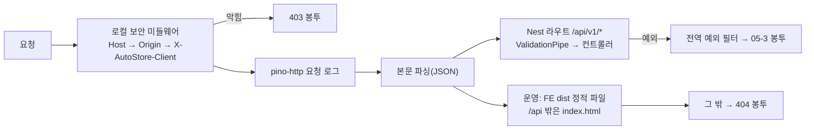

# 06-2. BE 스캐폴딩 (apps/BE)

| 항목 | 내용 |
|---|---|
| 상태 | **Proposed** (오너 위임 D-11. 오너가 짚으면 고친다) |
| 날짜 | 2026-09-27 |
| 스택 | NestJS 12.1 · Prisma 7.10(`prisma-client` 생성기 + `@prisma/adapter-pg`) · PostgreSQL 14.20 · Jest 30 + ts-jest · ESLint 9 |
| 근거 | [02-ADR-001](../02_기술스택/02-ADR-001_기술스택.md), [03-ADR-003](../03_아키텍처/03-ADR-003_아키텍처.md), [03-2 C4 §3·§5](../03_아키텍처/03-2_C4다이어그램.md), [04-3 Prisma 스키마](../04_데이터베이스/04-3_schema.prisma), [04-4 V1 SQL](../04_데이터베이스/04-4_V1__init.sql), [05-1 §1](../05_API/05-1_엔드포인트표.md), [05-2 openapi](../05_API/05-2_openapi.yaml), [05-3 오류 코드](../05_API/05-3_에러코드페이징규약.md) |
| 같이 볼 문서 | [06-1 저장소·형상관리](06-1_저장소·형상관리.md), [06-3 FE 스캐폴딩](06-3_FE스캐폴딩.md), [06-4 환경변수](06-4_환경변수.md) |

## 1. 한눈에 보기

- BE는 NestJS 프로세스 하나다. `127.0.0.1:3100`에만 붙고, API는 `/api/v1` 아래에 있다.
- 03-ADR-003의 모듈 13개를 빈 껍데기로 만들었다. 실제 엔드포인트는 배선 확인용 하나뿐이다: `GET /api/v1/ai-cli-checks/latest`(system 모듈, D-16).
- P1-01(공통 기반)에서 `GET /api/v1/events`(SSE), `GET /api/v1/image-assets/{id}`·`…/file`, `GET /api/v1/call-usage`와 외부 호출 관문·이미지 저장·감사 기록 서비스를 더했다(§9-8~16).
- 로컬 보안(Host·Origin·`X-AutoStore-Client`)은 Express 전역 미들웨어로 모든 요청 맨 앞에서 검사한다. CORS는 켜지 않는다.
- 모든 오류는 05-3 오류 봉투 `{ code, message, status, timestamp, path, fieldErrors?, details? }`로 나간다.
- Prisma 스키마와 첫 마이그레이션은 문서(04-3·04-4)의 사본이다. `db:check-sync`가 둘이 같은지 검사한다.
- **NestJS 12는 ESM 전용**이다. 그래서 BE도 ESM(`"type": "module"`)이다(§9-1).

## 2. 폴더 구조

```
apps/BE/
├─ src/
│  ├─ main.ts                 시작점. app.listen(PORT, '127.0.0.1')
│  ├─ app.module.ts           모듈 조립 + 운영에서 FE 정적 파일(serve-static)
│  ├─ app.setup.ts            main·e2e 공용 설정(보안 미들웨어·접두사·파이프·필터·404 봉투)
│  ├─ openapi-export.ts       구현 명세 → dist/openapi.impl.json
│  ├─ common/
│  │  ├─ common.module.ts     전역: 진행 알림·파일 저장·감사 기록(P1-01)
│  │  ├─ config/              환경변수 검증(env.validation.ts)·AppConfigService·경로(paths.ts)
│  │  ├─ security/            로컬 보안 규칙(local-security.ts)
│  │  ├─ errors/              오류 코드(error-codes.ts)·ApiException(headers)·전역 예외 필터·ValidationPipe
│  │  ├─ logging/             nestjs-pino 설정(비밀 헤더 가림)
│  │  ├─ time/kst.ts          한국 날짜(kst_date)·다음 KST 0시(Retry-After)
│  │  ├─ events/              SSE: 이벤트 타입 22개·ProgressEventsService·GET /events
│  │  ├─ files/               FileStorageService(APP_DATA_DIR)·ImageAssetsService·GET /image-assets/*
│  │  ├─ audit/               UserActionLogService(user_action_log)
│  │  ├─ secrets/             SecretStore 포트·키체인 구현·비밀 가림(secret-mask)·SecretsModule(전역, P1-07)
│  │  └─ safety/              안전장치 끄기 이름·개인 값 검사기(테스트·P1-03이 쓴다)
│  ├─ prisma/                 PrismaService(@prisma/adapter-pg)·PrismaModule(전역)
│  ├─ generated/prisma/       Prisma 생성물(git 제외, prisma generate가 만든다)
│  └─ modules/
│     ├─ step-engine/ keywords/ sourcing/ pricing/ category/ thumbnails/
│     ├─ content/ tags/ registration/ products/ settings/          (빈 껍데기, 책임 한 줄 주석)
│     │     settings/ 설정 파일(P1-03) · purchase-agency-profile/ GET·PUT /purchase-agency-profile·고정값·⑨ 요청 조각·입력 이름(P1-09)
│     │               · dispatch-delivery-companies/ GET /dispatch-delivery-companies(설정 파일 목록, P1-09)
│     ├─ system/              ai-cli-checks/ (첫 엔드포인트 · 점검 기록 AiCliCheckRecorder · 앱 시작 점검 · 사용 가능 판정, P1-10) · secrets/ GET·PUT /secrets · commerce-auth/ GET /auth-status·POST /auth-checks(P1-07)
│     └─ integrations/        http/ 외부 호출 관문(ExternalHttpGateway·대상 표·URL 가림·CallLogService·토큰 3개)
│                             call-usage/ GET /call-usage·KST 0시 타이머
│                             ai-engine/ ai-engine.port.ts·cli-isolation.ts(AI CLI 격리 검사기)·AiExecutor·어댑터 3개(adapters/)·
│                                        process/(IsolatedCliRunner·작업 폴더·환경변수 허용 목록·PATH 찾기)·schema/(규칙·재검증)·입력 보호(P1-10)
│                             naver-commerce/ 서명·토큰 캐시(CommerceTokenService)·CommerceApiClient·전송 포트(P1-07)
│                             commerce-meta/ 메타 동기화(대상별 syncers/·mappers/·수동 API·하루 1회 자동·재시작 정리)·캐시 목록 API 4개·CommerceMetaCacheService(P1-08)
├─ prisma/
│  ├─ schema.prisma           04-3 사본(generator output만 다름)
│  └─ migrations/
│     ├─ 20260927000000_v1_init/migration.sql   04-4 바이트 그대로
│     └─ migration_lock.toml
├─ test/                      e2e(app.e2e-spec.ts)·jest 설정·테스트 DB 준비
├─ scripts/                   check-db-sync.mjs · with-test-db.mjs · test-db-env.cjs
├─ prisma.config.ts           Prisma CLI 설정(DATABASE_URL)
├─ nest-cli.json · tsconfig.json · tsconfig.build.json · eslint.config.mjs · jest.config.cjs
└─ .env.example · .env(git 제외)
```

- 모듈 이름은 03-ADR-003 결정 3의 경계 그대로다. 단계 모듈끼리는 서로 부르지 않는다(03-2 §3). 이 규칙은 아직 코드 검사로 막지 않았다(§10).
- `ai-engine.port.ts`에는 PRD §8.9·03-2 §3의 `AiEngineAdapter { code, detect(), authStatus(), smokeTest(model), runStructured(task, schema, inputs, {model, timeoutMs}) }`만 있다. 결과 타입의 필드는 `ai_cli_check`(ERD v0.4)에서 가져왔다. 입력 타입(`AiEngineInputs { prompt, imagePaths? }`)은 Proposed다 — P1-10에서 모양은 그대로 두고 뜻을 정했다: `prompt`는 실행기가 출처 블록을 검사(§9-58)한 뒤 합친 글, `imagePaths`가 있으면 비전 호출(어댑터가 이번 호출 전용 이미지 폴더에 복사). 어댑터 3개(`ClaudeCodeAdapter`·`AgyAdapter`·`CodexAdapter`)는 P1-10에서 만들었다(§9-55).

## 3. 요청 처리 순서



- 보안 검사는 `app.use()`로 가장 먼저 등록한다. 그래서 없는 경로·정적 파일·SSE도 같은 검사를 받는다. 본문을 읽기 전에 막으므로, 밖에서 온 잘못된 JSON도 400이 아니라 403이 된다.
- 막은 요청은 `LocalSecurity` 로그에 `경고`로 남는다(코드·메서드·경로만, 헤더 값은 남기지 않는다).

## 4. Prisma 흐름과 문서 원본·사본 관계

| 문서 원본 | 앱 사본 | 규칙 |
|---|---|---|
| `docs/dev/04_데이터베이스/04-4_V1__init.sql` | `apps/BE/prisma/migrations/20260927000000_v1_init/migration.sql` | **바이트 그대로**. 한 글자도 다르면 안 된다 |
| `docs/dev/04_데이터베이스/04-6_V2__keyword_abort_reasons.sql`(ERD v0.5, P2-01) | `apps/BE/prisma/migrations/20260930000000_keyword_abort_reasons/migration.sql` | 바이트 그대로 |
| `docs/dev/04_데이터베이스/04-3_schema.prisma` | `apps/BE/prisma/schema.prisma` | `generator client` 블록의 `output`만 다를 수 있다 |

- 허용 차이는 하나다: `output = "../generated/prisma"` → `"../src/generated/prisma"`. 생성물을 `src` 안에 두어야 `nest build`(tsc)가 같이 컴파일한다. 이 경로는 루트 `.gitignore`·`.prettierignore`에 이미 들어 있다.
- `moduleFormat`은 넣지 않았다. BE가 ESM이라 Prisma 기본값(ESM, 상대 import에 `.js`)이 그대로 맞는다.
- 접속 URL은 `schema.prisma`가 아니라 `prisma.config.ts`가 준다(Prisma 7). `prisma.config.ts`는 `apps/BE/.env`를 읽되 셸에 이미 있는 값은 덮어쓰지 않는다(`process.loadEnvFile`).
- 런타임은 드라이버 어댑터를 쓴다: `new PrismaClient({ adapter: new PrismaPg({ connectionString: DATABASE_URL }) })`. 첫 쿼리 때 접속하고, 앱이 끝날 때 끊는다.

**스키마를 바꿀 때 순서**

1. 문서 04-3(필요하면 04-1 ERD)을 먼저 고친다.
2. 사본에 복사한다(`generator` 블록의 `output`은 그대로 둔다).
3. 새 마이그레이션 폴더를 만든다: `pnpm exec prisma migrate dev --create-only --name <이름>`. Prisma 밖 SQL(CHECK·부분 인덱스·트리거)은 손으로 끝에 붙인다(04-4 머리말).
4. `pnpm --filter @autostore/be db:migrate`(개발 DB) · `db:migrate:test`(테스트 DB)로 적용한다.
5. `db:diff`가 "No difference detected."인지, `db:check-sync`가 통과하는지 본다.

- ~~04-4처럼 문서에 SQL 원본을 두는 마이그레이션은 V1 하나다. V2부터 문서에 SQL을 둘지는 정하지 않았다(§10).~~ → P2-01(Proposed): V2부터도 문서에 SQL 원본(`04-6_V2__….sql`처럼 `04-<번호>_V<n>__<이름>.sql`)을 두고, `scripts/check-db-sync.mjs`의 `MIGRATIONS` 표에 (폴더, 문서) 한 줄을 더한다. 표에 없는 마이그레이션 폴더가 있으면 `db:check-sync`가 실패한다. 04-2 전체 DDL과 04-3 맨 아래 'Prisma 밖 SQL' 주석도 같은 값으로 고친다.

## 5. 스크립트

모두 `pnpm --filter @autostore/be <스크립트>`로 부른다. 저장소 루트에서 먼저 `nvm use`.

| 스크립트 | 하는 일 |
|---|---|
| `dev` | `nest start --watch`. `.env`의 `NODE_ENV=development` |
| `build` | `prisma generate && nest build` → `dist/main.js` |
| `start` | `nest start`(한 번 빌드하고 실행) |
| `start:prod` | `NODE_ENV=production node dist/main.js`. FE `dist`가 있으면 화면도 내보낸다 |
| `test` | 단위 테스트(`src/**/*.spec.ts`) |
| `test:e2e` | e2e(`test/*.e2e-spec.ts`). `autostore_test`에 마이그레이션을 적용한 뒤 돈다 |
| `lint` | ESLint(타입 정보 규칙 포함) |
| `typecheck` | `prisma generate && tsc --noEmit` |
| `db:generate` | Prisma 클라이언트 생성(`src/generated/prisma`) |
| `db:migrate` | `prisma migrate deploy`(개발 DB) |
| `db:migrate:test` | 같은 것을 테스트 DB에(`TEST_DATABASE_URL`) |
| `db:status` | `prisma migrate status` |
| `db:diff` | DB ↔ `schema.prisma` 차이. 다르면 exit 2 |
| `db:check-sync` | 문서 원본 ↔ 앱 사본 검사(§4, 마이그레이션 표의 폴더마다·표에 없는 폴더도 실패). 어긋나면 exit 1 |
| `openapi:export` | `nest build` 뒤 `dist/openapi.impl.json` 쓰기. HTTP 경로로는 내보내지 않는다 |

- `build`·`typecheck`가 `prisma generate`를 먼저 부르는 이유: 생성물이 git에 없어서 새로 받은 저장소에서도 바로 되게 하려고.
- `test`·`test:e2e`는 `NODE_OPTIONS='--experimental-vm-modules …'`로 Jest를 ESM 모드로 돌린다(§9-1).

## 6. 로컬 보안·오류·로그

**로컬 보안**(05-1 §1.2, 03-2 §5) — `src/common/security/local-security.ts`

| 순서 | 검사 | 대상 | 막으면 |
|---|---|---|---|
| 1 | `Host`가 `127.0.0.1:포트`·`localhost:포트` | 모든 요청(SSE·정적 파일 포함) | 403 `HOST_NOT_ALLOWED` |
| 2 | `Origin`이 있으면 앱 자신(`http://127.0.0.1:포트`·`http://localhost:포트`). 개발에서만 `DEV_FE_ORIGINS` 추가 | POST·PUT·PATCH·DELETE | 403 `ORIGIN_NOT_ALLOWED` |
| 3 | `X-AutoStore-Client: 1` | POST·PUT·PATCH·DELETE | 403 `CLIENT_HEADER_REQUIRED` |
| — | CORS | 켜지 않는다(`Access-Control-*` 헤더 없음) | — |

- '포트'는 요청이 실제로 들어온 포트(`req.socket.localPort`)다. 설정값을 따로 비교하지 않아서 e2e(임의 포트)에서도 같은 규칙이 돈다.
- Vite 개발 서버는 `/api`를 넘길 때 `changeOrigin: true`로 Host를 `127.0.0.1:3100`으로 바꾼다. Origin(`http://127.0.0.1:5173`)은 그대로라 개발에서만 허용한다.

**오류 봉투**(05-3 §2) — `src/common/errors/`

| 상황 | 코드 | HTTP |
|---|---|---|
| 도메인 오류(`ApiException`) | 코드 그대로 | 05-3 표 |
| 본문 검증 실패(ValidationPipe) | `VALIDATION_FAILED` + `fieldErrors` | 422 |
| 쿼리 검증 실패 | `INVALID_QUERY_PARAMETER` + `fieldErrors` | 422 |
| JSON을 읽을 수 없음 | `MALFORMED_REQUEST` | 400 |
| 본문이 너무 큼 | `PAYLOAD_TOO_LARGE` | 413 |
| 없는 경로(`/api/v1` 안팎 모두) | `ROUTE_NOT_FOUND` (**Proposed**, §9-3) | 404 |
| 예상 못 한 오류 | `INTERNAL_ERROR`(내부 메시지는 로그에만) | 500 |

- `timestamp`는 이 PC 시간대 오프셋을 붙인 ISO 8601이다(예 `2026-09-27T20:27:19+09:00`).
- ValidationPipe는 `whitelist`·`forbidNonWhitelisted`·`transform`을 켰다. 정의하지 않은 필드가 오면 422다.
- `fieldErrors[]`는 05-2 `FieldError` 형식 `{ field, message, rejectedValue? }`를 따른다(§9-4).

**로그** — nestjs-pino(`src/common/logging/`)

- 개발은 `pino-pretty` 한 줄 출력, 운영은 JSON 한 줄. 수준은 `LOG_LEVEL`.
- `authorization`·`proxy-authorization`·`cookie`·`set-cookie`·`x-*-secret`·`x-*-token`·`x-*-key` 헤더는 `***`로 가린다(P1-07에서 `[Redacted]` → `***`). 요청 본문은 남기지 않는다(키 입력 API, 05-1 §1.2). 로그 인자 전체를 `hooks.logMethod`로 한 번 더 거른다: 알려진 비밀값·`Bearer <토큰>`·비밀 이름의 키(`client_secret_sign`·`access_token` …)를 지운다(§9-32).
- 로그 파일은 아직 쓰지 않는다(표준 출력만). 파일 로그는 system 모듈을 만들 때 `APP_DATA_DIR/logs`로 붙인다.

## 7. 첫 엔드포인트 `GET /api/v1/ai-cli-checks/latest`

- 05-2 `getLatestAiCliChecks`의 응답 `AiCliCheckLatestList`를 따른다: `{ selectedEngine, items[3] }`, 엔진 순서 CLAUDE·AGY·CODEX, 각 `{ engineCode, selected, latest }`.
- `latest`는 `ai_cli_check`에서 엔진마다 `checked_at DESC, id DESC` 첫 행이다. 점검한 적 없으면 `null`(05-2 설명 그대로).
- `selectedEngine`: 원본은 설정 JSON의 `ai.engine`이다(D-16). ~~설정 JSON 로더(settings 모듈)가 아직 없어서, 가장 최근 `settings_snapshot.content.ai.engine`을 읽고 없으면 기본값 `CLAUDE`(PRD §8.9 R3)를 준다.~~ → **P1-03 로더로 바꿨다**(P1-10·P1-11): `AiCliChecksService.readSelectedEngine()`이 `SettingsService.currentOrNull()?.ai.engine`(쓸 수 있는 설정이 없으면 `CLAUDE`)을 읽는다. `test/app.e2e-spec.ts`도 설정 파일을 바꾸고 다시 읽어 선택 엔진을 확인한다.
- P1-11: 같은 컨트롤러에 `POST /ai-cli-checks`(202 + `Location`, 메모리 잠금)와 `GET /ai-cli-checks`(점검 이력, Proposed)를 더했다. 읽기 창구는 `ai-cli-checks/ai-cli-check.query.ts`의 `AiCliCheckQueryService`(DB만 쓰는 `AiCliCheckQueryModule` — SettingsModule도 import)다.
- 시각(`checkedAt`)은 UTC ISO 8601(`…Z`, 밀리초 포함)이다. 05-1 §1.1은 오프셋 표기를 허용할 뿐 강제하지 않는다.

## 8. 테스트

| 종류 | 위치 | 내용 |
|---|---|---|
| 단위 | `src/common/security/local-security.spec.ts` | Host 허용·거부 6가지, 조회 메서드 통과, 상태 변경 메서드의 헤더·Origin 규칙, 개발 FE Origin, 검사 순서 |
| 단위 | `src/common/errors/all-exceptions.filter.spec.ts` | ApiException 그대로, 빈 필드 빼기, Nest 예외 → 코드 매핑 6가지, 500에 내부 메시지 안 넣기, 시각 형식 |
| 단위 | `src/common/errors/app-validation.pipe.spec.ts` | 422 `VALIDATION_FAILED`·`INVALID_QUERY_PARAMETER`, 정의 밖 필드 거부 |
| 단위 | `src/common/config/env.validation.spec.ts` | 기본값, 형 변환, 필수·잘못된 값 거부 |
| e2e | `test/app.e2e-spec.ts` (supertest, `autostore_test`) | `/ai-cli-checks/latest` 200·형태(빈 DB, 최신 1건 고르기, 선택 엔진), Host 거부 2건, Origin 거부 2건, 헤더 없음 거부, 통과 후 404, CORS 없음, 404 봉투 2건, 400 봉투 |

**P1-01에서 더한 테스트**

| 종류 | 위치 | 내용 |
|---|---|---|
| 단위 | `src/common/time/kst.spec.ts` | KST 날짜 경계, 다음 0시까지 초 |
| 단위 | `src/modules/integrations/http/url-mask.spec.ts` · `external-targets.spec.ts` · `external-hosts.guard.spec.ts` · `external-http.gateway.spec.ts` | 비밀 쿼리 가림(CHECK 식), 대상 13개 = ERD CHECK, 간격 값, src 안 호스트 검사(F-BS-07), 허용·헤더 검사 |
| 단위 | `src/modules/integrations/ai-engine/cli-isolation.spec.ts` | 격리 규약 위반 6가지(F-BS-07) |
| 단위 | `src/common/safety/*.spec.ts` | 안전장치 끄기 키 없음(F-BS-04), 127.0.0.1 고정·바인딩 env 없음(F-BS-01), 개인 값 없음(F-BS-03) |
| 단위 | `src/common/audit/user-action-log.service.spec.ts` · `events/progress-events.service.spec.ts` · `files/*.spec.ts` | CHECK 11종·gate 필수·kst_date, 이벤트 22개 = 05-2 oneOf(M1), 후보 필터·경로 가림, 경로 탈출 거부·임시 파일 rename, 이미지 규칙·내용 판별 |
| e2e | `test/external-http.e2e-spec.ts` | 가짜 fetch·가짜 시계로 관문 전체(허용·UA·직렬·간격·하루 상한·24시간 쉼·call_log·SSE)와 `GET /call-usage` |
| e2e | `test/image-assets.e2e-spec.ts` · `test/events.e2e-spec.ts` | 이미지 메타·파일(ETag·304·404 두 가지), SSE 프레임·후보 필터·422·403 |
| e2e | `test/prisma-timezone.e2e-spec.ts` | 세션 TimeZone=UTC 회귀(§9-8) |
| e2e | `test/user-action-log.e2e-spec.ts` | KST 0~9시 CHECK 통과, 부르는 쪽 트랜잭션 안 기록·되돌림, 추가만 |

- P1-01 뒤 검증(2026-09-30): 단위 BE 17개 파일 185개·FE 27개, e2e 6개 파일 78개 통과. `lint`·`typecheck`·`build`·`format:check`·`secretlint`·`db:check-sync` 통과. `pnpm dev`에서 Vite 프록시(5173 → 3100)로 `GET /api/v1/events`가 헤더를 바로 받고 25초 뒤 `: keep-alive`가 끊기지 않고 온다.

**P1-07에서 더한 테스트**

| 종류 | 위치 | 내용 |
|---|---|---|
| 단위 | `src/common/secrets/secret-keys.spec.ts` · `secret-mask.spec.ts` | 허용 키 6개 = 05-2 enum 순서, 알려진 비밀값·Bearer·헤더·폼 본문·Error 가림 |
| 단위 | `src/common/secrets/keychain-secret-store.spec.ts` | 가짜 항목으로 set·get·status, 모든 예외 → 503 `KEYCHAIN_UNAVAILABLE`(로그에 값 없음), `security` 출력 mdat 해석. 실제 키체인은 `AUTOSTORE_KEYCHAIN_TEST=1`일 때만 |
| 단위 | `src/common/logging/logging.module.spec.ts` · `errors/all-exceptions.filter.spec.ts` · `errors/app-validation.pipe.spec.ts` | 로거 직렬화기(들어오는·나가는 헤더, 토큰 폼, 오류 객체), 예외 필터 응답·로그 가림, `@OmitRejectedValue()` |
| 단위 | `src/modules/integrations/naver-commerce/*.spec.ts` | 서명 고정 벡터(Python bcrypt), 토큰 폼 5필드·`type=SELF`·`account_id` 없음·13자리 timestamp, 14:00→16:29/16:30 재발급·17:00 만료, 동시 3번 → 발급 1번, invalidate, 401 `GW.AUTHN` 재발급 1회·재전송 1회·다시 401이면 `auth.failed` 1건, 원인 분류표 행마다 |
| e2e | `test/secrets.e2e-spec.ts` | `GET /secrets` 6개, `PUT` 204·멱등·404·422(`rejectedValue` 없음)·403·503, 감사 기록 키 이름만, 누출 검사(pino 메모리 스트림 + `call_log`·`user_action_log` 전체) |
| e2e | `test/commerce-auth.e2e-spec.ts` | 가짜 커머스 서버를 가짜 fetch 뒤에 두고 실제 관문으로: 409·200(`call_log` 1행·trace)·502 원인 5가지·`EXTERNAL_API_ERROR`(연결 오류·5xx)·SSE `auth.failed`·커머스 키 변경 뒤 `tokenValid=false` |

**P1-08에서 더한 테스트**

| 종류 | 위치 | 내용 |
|---|---|---|
| 단위 | `src/modules/integrations/commerce-meta/mappers/mappers.spec.ts` | fixture → 대상별 행·문서(`isOverseas` ← `overseasAddress`, `addressBookNo` 숫자 글자, `exceptionalCategories` 배열, `parentCode`), 빈·모양 다른 응답 오류, 문서 해시(정규화 JSON SHA-256) |
| 단위 | `…/syncers/cache-writes.spec.ts` | `categories-last` → `-v2` → 다시 `-last`: 사라진 행 `removed_at`·`id` 그대로·새 행·이름 변경·다시 나타나면 `removed_at=null`, 문서 같은 payload 1행·sha 같음/다르면 덮어씀 |
| 단위 | `…/commerce-meta-sync.service.spec.ts` | 전체 8개 SUCCEEDED·건수·SSE 8건·호출 38번, ADDRESSBOOK 500 실패 격리(이전 주소록 그대로), 403 권한 안내, 캐시 쓰기 실패 되돌림, 카테고리 캐시 없음, 429 재시도·한도, 인증 실패면 남은 대상 FAILED, 409 진행 중·키 없음·503 |
| 단위 | `…/commerce-meta-recovery.spec.ts` · `commerce-meta-sync.scheduler.spec.ts` · `commerce-meta-api.spec.ts` · `commerce-meta-query.service.spec.ts` | 재시작 RUNNING → FAILED, 자동 실행 판단(가짜 시계: 오늘 KST 성공이면 건너뜀·다음 날 실행·FAILED 6시간·키 없으면 건너뜀·꺼짐), RateLimit 헤더 쉼·429 재시도, 카테고리 거르기(MALE 3·FEMALE 3, 아동·CON-08·removed_at·신발 밖 제외) |
| e2e | `test/commerce-meta.e2e-spec.ts` | 빈 latest 8개 null, 409 키 없음·403·503, 202·Location·RUNNING 8 → SUCCEEDED 8·건수·SSE 8·`call_log` 39행(비밀 없음), 진행 중 409(`details.job=META_SYNC`), 422 5가지, 목록 4개(422·409·정렬·페이지·`raw` 없음·`includeRemoved`), v2 재동기화 `removed_at`·프로필 FK 유지, 재시작 정리 |

**P1-09에서 더한 테스트**

| 종류 | 위치 | 내용 |
|---|---|---|
| 단위 | `src/modules/settings/purchase-agency-profile/profile-values.spec.ts` | 12개 키·빈 기본값, `missingFields`(빈 기본값 → 10개·05-2 예시 4개 포함, 채움 → [], 빈 문자열·⑥-3용 좁은 목록), 정리(공백·빈 문자열 → null, 고시 빈 문구 제거), 바뀐 키(같음 [] · importer만 · 고시 키 순서 무관) |
| 단위 | `…/profile-registration-fragment.spec.ts` | 고정값(INCLUDED·개인통관 false·미성년 true·DELIVERY·FREE), 주소는 로컬 id가 아니라 주소록 번호 숫자(`'100000001'` → 100000001), 확인 안 된 필드 분리, 다른 행·큰 번호는 던짐 |
| 단위 | `…/purchase-agency-profile.service.spec.ts` | 메모리 Prisma(`FakeMetaPrisma` + `purchaseAgencyProfile`)와 실제 `CommerceMetaCacheService`: 참조 검사(해외 통과·국내 422·없는/사라진 id 404·목록 밖 발송 코드 422·설정 없음 503·반품 택배사 404), 저장(1행·profile.* 전파·감사 키 이름만·같은 값 무기록·공백 차이 무기록·importer만 전파·참조 오류 무기록·전파 실패 되돌림), 주소 경고, 요청 조각 |
| 단위 | `…/dto/purchase-agency-profile-input.dto.spec.ts` · `profile-input-keys.spec.ts` | 전역 ValidationPipe로 12개 키·빠진 키·`deliveryFeeKrw`·범위·길이·고시 값 모양, 입력 이름 64자·이름표(step-engine `inputKeyLabel`과 같다)·읽는 단계 |
| e2e | `test/purchase-agency-profile.e2e-spec.ts` | 빈 GET 18키, 시드 뒤 PUT 200·1행(`singleton_key=1`)·감사 1행(값 없음), 같은 PUT 무기록, 422 `ADDRESS_NOT_OVERSEAS`·404 두 가지·422 `DELIVERY_COMPANY_NOT_ALLOWED`·404 반품 택배사, 본문 422 6가지·403, `removed_at` 뒤 `addressWarnings`, 전파(⑥-3만 RERUN_REQUIRED·`stale_inputs=['profile.importer']`·SSE 1건·자동 실행 없음, 승인대기 → 작업중, 잠긴 후보 건너뜀), 발송 택배사 목록·스냅샷 없음 503 |

- 프로필 e2e는 캐시를 동기화하지 않고 `test/fixtures/settings/purchase-agency-profile/`(`seedProfileCaches`)로 직접 넣는다. 발송 택배사는 설정 파일에 fixture 목록(`settings-dispatch-companies.json`)을 끼워 앱을 켠다. 정리는 `TRUNCATE purchase_agency_profile, commerce_addressbook, commerce_return_delivery_company, …(step-engine 표) RESTART IDENTITY CASCADE`.
- 메타 e2e는 `test/support/fake-commerce-meta.ts`(가짜 커머스 메타 서버, fixture `test/fixtures/commerce/meta`)를 P1-07 가짜 커머스 서버 뒤에 끼워 실제 관문(`call_log`)을 지난다. 단위 테스트는 `test/support/commerce-meta-kit.ts`(메모리 Prisma `FakeMetaPrisma` — 실패하면 되돌리는 `$transaction`)를 쓴다. 202 뒤 백그라운드는 `CommerceMetaSyncService.whenIdle()`로 기다린 뒤 정리(TRUNCATE)한다.
- e2e는 `test/setup-env.cjs`가 `APP_DATA_DIR`을 `os.tmpdir()/autostore-e2e-*`로 잡고, 파일마다 끝나면 지운다(`test/cleanup-data-dir.cjs`). 저장소의 `.data/`는 쓰지 않는다.
- e2e 가짜는 `test/helpers/`(가짜 시계·가짜 fetch·`createTestApp`)에 있다. `HTTP_FETCH`·`CLOCK`·`SSE_HEARTBEAT_INTERVAL_MS`를 `overrideProvider`로 바꾸고, 메타데이터 자동 동기화(`COMMERCE_META_SCHEDULE`)는 끈다(P1-08).
- e2e는 `test/global-setup.cjs`가 테스트 DB에 `prisma migrate deploy`를 먼저 돌린다. `DATABASE_URL`은 `TEST_DATABASE_URL`로 바뀌고, DB 이름에 `test`가 없으면 멈춘다(개발 DB 보호).
**P1-10에서 더한 테스트**

| 종류 | 위치 | 내용 |
|---|---|---|
| 단위 | `src/modules/integrations/ai-engine/process/isolated-cli-runner.spec.ts` | 규칙 1(gemini·agy-image·/bin/sh·경로 → spawn 0회), 규칙 2(가짜 CLI 기록: cwd가 os.tmpdir() 아래·저장소 밖·시작 때 빈 폴더·호출 뒤 삭제, stdin `/dev/null`, `shell:false`·`stdio[0]='ignore'`, 모델 '' → spawn 없음), 규칙 3(자식 env에 과금 키·허용 밖 변수 없음, claude만 `DISABLE_AUTOUPDATER=1`), 빈 폴더 아님 → 격리 검사기, PATH에 없음 → NOT_INSTALLED, 시간 제한 → 자식 종료·`AI_TIMEOUT` |
| 단위 | `…/ai-engine/adapters/adapters.spec.ts` | 인자 빌더 3개(규칙 4·6: `--tools ""`·비전 `--tools Read --allowedTools Read --add-dir`·agy `120s`/`180s`·0/음수 거부·codex `exec <prompt> --image a --image b`), 결과 해석(structured_output만, 빈 결과·부분 출력·AGY_ERROR·exit 1·추가 필드·JSON 아님·codex 결과 파일 없음/깨짐 → 실패, codex는 stdout이 아니라 결과 파일), 비전 images_seen(맞음·없음·불일치, 이미지 전용 폴더에 이번 이미지만), 규칙 12(ENOENT → NOT_INSTALLED, 로그인 풀림 봉투 → NOT_LOGGED_IN), 로그인 확인·감지, 세 어댑터 공통 모양(파라미터), agy 로그인은 spawn 없이 UNKNOWN |
| 단위 | `…/ai-engine/schema/*.spec.ts` · `process/env-allowlist.spec.ts` · `cli-locator.spec.ts` · `work-dir.spec.ts` · `cli-isolation.spec.ts` | 규칙 7 스키마(fixture 통과·추가 필드 허용·required 누락·format·중첩·$ref·oneOf·튜플 거부), 재검증(빈·추가 필드·타입, 오류 문구에 값 없음, images_seen), 허용 목록, PATH 훑기, 작업 폴더(저장소 밖·이미지 순서 이름·실패해도 삭제), 감지 호출(probe) 검사 |
| 단위 | `…/ai-engine/ai-prompt-guard.spec.ts` · `ai-executor.service.spec.ts` · `child-process-boundary.spec.ts` | 규칙 14(비밀 패턴 8종·저장된 비밀값·개인정보(라쿠텐 글 제외)·네이버 출처 4종 → spawn·call_log 없음, 예외 켜기), 실행기(규칙 15 call_log 1행·본문 없음, 고정 엔진 어댑터만·모델·120s/180s, 모델 없음, 스키마 규칙, 재검증, 실패 기록), `node:child_process`는 러너 한 파일만, CLI 설치·업데이트 코드 없음 |
| 단위 | `…/ai-engine/live-cli.spec.ts` | `AI_CLI_LIVE=1`일 때만 진짜 CLI로 감지·로그인·연결 테스트(기본 건너뜀) |
| 단위 | `src/modules/system/ai-cli-checks/ai-engine-availability.service.spec.ts` · `step-engine/execution/ai-engine-pin.spec.ts` | 규칙 11 사유 표(행 없음·미설치·로그인·계약·모델·SKIPPED·지원 밖 버전 경고만)·409 details·문구, 규칙 10 고정(주 작업 모델·MODEL_NOT_SET·이어 가기는 실행 행+스냅샷), `ai.*` 키가 입력 지문에 없음 |
| e2e | `test/ai-engine.e2e-spec.ts` | 규칙 13(부팅 점검 3행 STARTUP·CLAUDE만 PASSED·AGY SKIPPED·CODEX 미설치·SSE 3건·AGY/CODEX smokeTest 0회·call_log 1행), 규칙 11(NOT_INSTALLED·CONTRACT_FAILED·NOT_LOGGED_IN·NOT_CHECKED·MODEL_NOT_SET 409, step_run 0행, 연속 실행 step_chain 0행, 제외 후보는 CANDIDATE_EXCLUDED가 먼저), 규칙 10(202 ai_* 고정·pinnedAi, AI 없는 단계 NULL·판정 안 부름, RUNNING 행 ai_model 변경 → 트리거, 실행 중 AGY로 바꿔도 CLAUDE로 끝남·다음 실행부터 AGY, 입력 대기 이어 가기도 고정 엔진), 규칙 12(ENOENT → FAILED·AI·AI_ENGINE_UNAVAILABLE·SSE·다른 어댑터 0회), 규칙 8(재검증 실패 → AI_OUTPUT_INVALID), 규칙 15(call_log 1행·step_run_id·본문 없음) |

- AI 테스트는 진짜 CLI를 부르지 않는다. 단위는 가짜 CLI(`test/fixtures/ai-engine/bin/fake-ai-cli.mjs`, `test/support/fake-ai-cli.ts`의 `createFakeCliWorld()` — 임시 폴더에 노드 절대 경로 shebang 실행 파일을 만들고 그 폴더와 `/usr/bin:/bin`만 PATH에 둔다)를 실제로 spawn하고, e2e는 `createTestApp`이 기본으로 `AI_ENGINE_ADAPTERS`를 가짜 어댑터(`test/support/fake-ai-engines.ts`)로 바꾸고 앱 시작 점검(`AI_ENGINE_STARTUP_CHECK`)을 끈다. AI 단계(가짜 ⑤·⑥-1·⑥-2)를 돌리는 e2e는 `seedUsableAiEngine(prisma)`로 쓸 수 있는 점검 행을 넣는다.
- 테스트 정리는 `TRUNCATE … RESTART IDENTITY CASCADE`다. `ai_cli_check`에 추가만 트리거, `settings_snapshot`에 삭제 금지 트리거가 있어 `deleteMany`는 막힌다(04-3 주석).
- Jest가 ESM 모드라 `jest.mock` 끌어올리기를 쓸 수 없다. 대신 Nest DI의 `overrideProvider`로 바꿔 끼운다.

## 9. 결정·차이(오너 검토 대상)

1. **BE를 ESM으로 했다.** `@nestjs/common`·`core`·`config`·`serve-static`·`swagger`·`testing` 12.x가 모두 `"type": "module"`이다. 그래서 `apps/BE/package.json`에 `"type": "module"`, tsconfig는 `module/moduleResolution: nodenext`, 상대 import는 `.js`를 붙인다. Jest는 `--experimental-vm-modules` + ts-jest `useESM`으로 돈다(Node 24에서 경고만 끄고 정상 동작).
2. **Origin 검사는 상태 변경 요청에만 한다.** 05-1 §1.2 표와 05-3 `ORIGIN_NOT_ALLOWED` 조건('상태를 바꾸는 요청의')을 따랐다. 조회(GET)는 CORS를 열지 않아서 다른 사이트가 응답을 읽을 수 없다. Origin이 없는 상태 변경 요청(curl 등)은 헤더 검사만 받는다.
3. **`ROUTE_NOT_FOUND`(404) 코드를 더했다.** 05-3 §5.1에 '없는 경로'용 공통 코드가 없다. 문구는 '요청한 주소를 찾을 수 없습니다.' 05-3·05-2에 넣을지 정해 주세요.
4. **`FieldError` 형식이 문서끼리 다르다.** 05-2는 `{ field, message, rejectedValue? }`, 05-3 §2 예시는 `{ field, reason, rejectedValue? }`다. 05-2(API 원본)를 따랐다. 05-3 예시를 고칠지, `reason`을 더할지 정해 주세요.
5. **구현 명세는 OpenAPI 3.0.0**이다(`@nestjs/swagger` 기본). 05-2는 3.1이다. 대조(13 테스트 단계)할 때 `nullable` ↔ `type: [x, 'null']` 차이를 감안한다.
6. **스크립트 2개를 더했다**: `db:migrate:test`, `db:diff`.
7. **serve-static은 `NODE_ENV=production`이고 `apps/FE/dist/index.html`이 있을 때만** 켠다. 개발(3100)에서는 화면을 내보내지 않고, 화면은 Vite(5173)가 맡는다.
8. **DB 세션 시간대를 UTC로 맞춘다(P1-01에서 찾은 버그).** `@prisma/adapter-pg` 7.10은 `timestamptz` 값을 오프셋 없는 UTC 벽시계 문자열로 보내고, 읽을 때 오프셋을 `+00:00`으로 바꿔 버린다. PostgreSQL 기본 시간대가 `Asia/Seoul`이라 저장 시각이 9시간 어긋났고, `ck_call_log_kst`·`ck_ual_kst`가 KST 0~9시에 깨졌다. `PrismaService`가 접속마다 `options: '-c TimeZone=UTC'`를 준다. 회귀 테스트 `test/prisma-timezone.e2e-spec.ts`. (psql로 볼 때는 여전히 서버 기본 시간대로 보인다.)

**P1-01 공통 기반에서 정한 것(Proposed, 2026-09-30 — 오너 검토)**

9. **외부 호출 관문(`ExternalHttpGateway`)**
   - 허용 목록 밖 요청을 막는 코드: `EXTERNAL_REQUEST_NOT_ALLOWED`(500, `details.target`·`reason`). 앱 코드의 잘못이라 500이다. 요청도 `call_log` 행도 만들지 않는다. 막는 것: 대상 표 밖 호스트, `https:`가 아닌 URL, 기본 포트가 아닌 URL, URL 속 사용자 정보, 호출자가 넣은 `User-Agent`·`Origin`·`Cookie`·`Host`·`Forwarded`·`Via`·`X-Forwarded-*`·`X-Real-IP` 등, DATALAB 밖이거나 PRD §8.1 값이 아닌 `Referer`. 05-3 §5.1에 행을 더했다.
   - UA 형식: `autoStore/<앱 버전> (local single-seller tool)`(앱 버전은 `apps/BE/package.json`). NFR-04는 UA를 설정 파일에 두라고 했지만, 브라우저 위장을 막으려고(F-BS-08) 코드 상수로 두고 설정으로 바꾸지 못하게 했다.
   - 최소 간격은 **앞 요청이 끝난 때부터** 잰다(더 보수적). 간격·직렬 큐만 프로세스 메모리에 두므로 앱을 다시 켠 직후 첫 요청은 기다리지 않는다.
   - 쉼·상한 검사는 두 번 한다: 큐에서 기다리기 전(빨리 거절)과 보내기 직전(판단 원본, 같은 대상 요청이 줄 서 있어도 상한을 넘지 않는다).
   - 데이터랩 하루 상한: **100요청**(버튼 수집 1회 = 상위 100위 10요청·500위 50요청). 값은 `daily-limit.provider.ts`의 `DEFAULT_DAILY_LIMITS` 한 곳에만 있고 P1-03이 설정 파일로 옮긴다.
   - 리다이렉트는 따라가지 않는다(`redirect: 'manual'`). 3xx를 그대로 돌려준다. 다른 호스트로 새지 않게 하려는 것이고, 따라가야 하면 부르는 쪽이 관문으로 다시 부른다(새 `call_log` 행).
   - 응답 대기 기본 30초(`timeoutMs`로 바꿀 수 있다). 넘거나 연결이 실패하면 `call_log`에 `succeeded=false`·`error_code=TIMEOUT|NETWORK_ERROR`를 남기고 502 `EXTERNAL_API_ERROR`(`details.target`·`reason`)를 던진다.
   - 2xx가 아닌 응답은 예외가 아니라 그대로 돌려준다(`error_code`는 `HTTP_<상태>`). 비공식 수집의 403·418·429만 쉼을 시작하고 409 `EXTERNAL_CALL_COOLDOWN`을 던진다. 본문을 봐야 아는 오류 코드(커머스API `GW.AUTHN` 등)·건수는 `ctx.describeResponse`로 준다(결과 열은 한 번만 쓰므로). `trace_id`는 응답 헤더 `GNCP-GW-Trace-ID`.
   - `call_log` 쓰기는 `CallLogService.start/finish/recordItemCount`에 모았다. AI CLI(P1-10)처럼 HTTP가 아닌 호출도 같은 서비스로 남긴다.
   - `url_masked`: 이름에 `accesskey`·`applicationid`·`client_secret`·`authkey`·`servicekey`·`apikey`·`token`·`password`·`secret`이 들어간 쿼리값을 `***`로, 사용자 정보·fragment는 빼고, 2048자로 자른다. 마지막에 CHECK 식과 같은 모양이 남아 있으면 한 번 더 가린다.
10. **`GET /call-usage` 목록 대상**: 허용 표에 호스트가 있는 대상만(§05-1 §7.1). KST 0시 타이머는 `setTimeout`(unref)으로 다음 0시 + 1초에 돌고, 목록 대상마다 `call-usage.changed`를 보낸다.
11. **이미지 파일**: 폴더 모양 `APP_DATA_DIR/images/<sha256 앞 2자>/<sha256>.<ext>`(ext: `jpg`·`png`·`webp`·`gif`). 받는 형식은 이 넷뿐이고 내용(sharp)으로 판별한다. 파일을 먼저 쓰고 행을 넣는다(행 없는 파일은 남을 수 있어도 파일 없는 행은 만들지 않는다). ORIGINAL 중복은 `INSERT … ON CONFLICT DO NOTHING`(`createManyAndReturn skipDuplicates`)으로 넣어 부르는 쪽 트랜잭션을 깨지 않는다. `usageRight`는 종류로 정한다(주면 종류와 맞아야 한다).
12. **데이터 폴더(F-BS-02)**: 운영 기본값은 OS 사용자 데이터 폴더(macOS `~/Library/Application Support/autoStore`, Windows `%APPDATA%\autoStore`, 그 밖 `$XDG_DATA_HOME/autoStore`). 개발·테스트 기본값은 지금처럼 저장소 루트 `.data`. `APP_DATA_DIR`이 `apps/` 안이면 시작하지 않고, 운영에서 저장소 안이면 시작하지 않는다(06-4).
13. **SSE**: 25초마다 주석 줄(`: keep-alive`)을 보낸다(`SSE_HEARTBEAT_INTERVAL_MS`, 테스트는 0으로 끈다). `id`는 프로세스 안 카운터(1부터). `data` 속 로컬 경로는 발행 전에 가린다.
14. **감사 기록**: `occurred_at`을 앱이 정해 `kst_date`와 같은 시각으로 쓴다(DB `now()`와 0시 경계에서 어긋나지 않게). `detail`에 넣지 못하는 키 이름 패턴: `secret`·`password`·`token`(단독), `client_secret`·`*Token`·`apiKey`·`accessKey`·`applicationId`·`authKey`·`serviceKey`·`competitorTag(s)`·`rawTag(s)`. 키 이름을 적는 `secretKey`는 된다.
15. **안전장치 끄기 이름(F-BS-04)**: '끄기·건너뛰기·허용·강제' 말(`disable`·`skip`·`bypass`·`ignore`·`allow`·`force`·`override`·`off`·`no-`)과 '안전장치 대상' 말(`g4`·`approv`·`gate`·`child`·`kid`·`person`·`celebrit`·`face`·`duplicate`·`dedup`·`original`·`safety`·`guard` 등)이 한 이름에 같이 있거나 `auto-approve`면 금지다(`common/safety/safety-rules.ts`). 개인 값 모양(F-BS-03): 이메일, 휴대전화·유선 번호, 사업자등록번호, 사용자 홈 경로.
16. **AI CLI 격리 검사기(`cli-isolation.ts`)**: 환경변수 허용 목록 `PATH`·`HOME`·`USER`·`LOGNAME`·`LANG`·`LC_ALL`·`LC_CTYPE`·`TMPDIR`·`TZ`·`TERM`·`NO_COLOR`·`DISABLE_AUTOUPDATER`. `ANTHROPIC_API_KEY`·`OPENAI_API_KEY`는 금지. claude 전역 설정 차단은 `--safe-mode` 또는 `--setting-sources`+`--strict-mcp-config` 중 하나(M0 S6에서 확정). cwd는 비어 있는 절대 경로이고 저장소 밖이어야 한다. 실행 파일은 `claude`·`agy`·`codex`만.

**P1-03 설정 파일 로더·검증·설정 스냅샷에서 정한 것(Proposed, 2026-09-30 — 오너 검토)**

17. **설정 파일**: `APP_DATA_DIR/settings/settings.json` 하나(ERD §7.4-1). 섹션·키·표기·내장 안전 목록은 06-4 §2.2. 첫 실행(파일 없음)에는 기본 템플릿을 그대로 복사해 만든다. 다시 읽을 때 파일이 없어도 같다(시작과 같은 코드). 기본 템플릿 JSON은 `nest-cli.json` `assets`로 `dist`에 복사하고 런타임에 `import.meta.url` 기준으로 읽는다. `SettingsModule`은 `SettingsService`만 export한다(P1-09부터 `PurchaseAgencyProfileService`도 — §9-49. `SettingsFileLoader`는 모듈 안에서만 쓴다 — 규칙 14를 DI에서도 막고, `settings-boundary.spec.ts`가 글자로도 본다).
18. **검사 순서와 오류**: JSON 문법 → JSON Schema(Ajv 8 `allErrors`·`useDefaults`·`strict`, `multipleOfPrecision 9`) + 값끼리의 관계(목표 사이즈·배송기간 최소 ≤ 최대, 고지 블록 ID 중복) → 안전 기준 하한. 앞에서 실패하면 뒤는 보지 않는다. `field`는 JSON Pointer이고 파일 전체(문법 오류·읽기 실패)는 `/`. 문구는 한국어로 바꾸고 값(`rejectedValue`)·파일 내용·절대 경로는 넣지 않는다. 문법 오류는 줄·칸만 알린다. 모든 객체 `additionalProperties: false`, 빠진 키는 기본 템플릿 값(`default`)으로 채워 검사한다(원본 파일은 그대로). 같은 모양을 나눠 쓰는 칸(`targetSizeMm.MALE`·`FEMALE`, `ai.models.*`)도 각자 제 기본값으로 채운다(`MALE: {}` → 250~290).
19. **스냅샷**: `content_sha256`은 기본값을 채운 내용의 키 정렬 JSON SHA-256. 같은 해시면 `last_loaded_at`만(시계가 뒤로 가도 `first_loaded_at`보다 작게 쓰지 않는다), 새 해시면 새 행. 시작 검사·다시 읽기는 한 프로세스 안에서 한 번에 하나씩 돈다(같은 해시로 두 행을 만들려다 UNIQUE에 걸리지 않게). 저장과 재실행 필요 전파 포트(`SETTINGS_RERUN_PROPAGATOR`, 기본 0)는 한 트랜잭션이다. 전파 구현은 DI 토큰을 바꾸거나 `SettingsService.setRerunPropagator()`로 끼운다(step-engine ↔ settings 모듈 순환을 피하는 창구).
20. **시작 검사 실패**: 앱은 뜬다. 가장 최근 스냅샷(`last_loaded_at` 최대)의 `content`를 지금 스키마·안전 기준으로 다시 검사해 통과하면 그것을 현재 설정으로 쓰고 `GET /settings`는 `valid:false`·`errors`. 없거나 통과하지 못하면 `current()`·`currentSnapshotId()`·`GET /settings`가 503 `SETTINGS_INVALID`(`fieldErrors`). DB 오류로 저장하지 못해도 던지지 않고 503 상태로 둔다(로그만).
21. **다시 읽기 실패 SSE**: 422를 던지기 전에 `settings.reloaded`(`settingsSnapshotId` null·`valid` false·`errors` = `"{경로}: {문구}"`)를 보낸다. GET /settings의 검사 결과가 바뀌었기 때문이다(05-2 설명에 반영).
22. **`ai` 섹션**: 파일에서 직접 바꾼 다시 읽기도 받아들인다(05-1 §7.5-51 처리). `ai.*` 키는 `changedKeys`에 넣고 전파 포트에는 넘기지 않는다. `AiCliChecksService.readSelectedEngine()`은 P1-11까지 스냅샷 `content.ai.engine`을 직접 읽는다(경로 그대로).
23. **하루 상한 원본**: `DAILY_LIMIT_PROVIDER`가 요청마다 설정을 읽는다(RAKUTEN_PAGE = `sourcing.pageFetchDailyLimit`, DATALAB = `keywords.datalabDailyLimit`). 쓸 수 있는 설정이 없으면 `DEFAULT_DAILY_LIMITS`(110·100). `IntegrationsModule`이 `SettingsModule`을 가져온다.
24. **앱 버전**: `common/config/app-version.ts`의 `APP_VERSION`(package.json version) 하나를 UA와 `settings_snapshot.app_version`이 같이 쓴다.
25. **e2e 도구**: `createTestApp({ beforeInit })` — 앱 init(시작 검사) 전에 DB를 비우거나 파일을 놓을 수 있다. 설정 e2e는 setup-env가 준 임시 `APP_DATA_DIR`만 쓰고 저장소 `.data`는 건드리지 않는다.

**P1-04 후보 만들기·목록·상태 전환에서 정한 것(Proposed, 2026-09-30 — 오너 검토, API 결정은 05-1 §7.2 'P1-04 구현 결정')**

26. **목록·페이징 공통(`common/paging/`)**: `parsePageRequest(경로, { page, size, sort })`가 page(0 이상)·size(1~100, 기본 20)·sort(`필드,asc|desc`, 허용 필드만, 같은 필드 두 번 금지)를 한 곳에서 검사하고 어긋나면 422 `INVALID_QUERY_PARAMETER`(fieldErrors). 경로별 허용 필드·기본 정렬은 `LIST_SORT_RULES`(05-3 §1 M1 행 그대로). 쿼리 DTO는 `PageQueryDto`를 상속한다. 같은 값끼리는 `id`(첫 정렬과 같은 방향)로 순서를 고정한다.
27. **step-engine 트랜잭션(`StepEngineTransactions.run(scope => …)`)**: 상태를 바꾸는 쓰기는 이 안에서 한다. `scope.now`(CLOCK)로 한 트랜잭션의 시각을 맞추고, SSE는 `scope.afterCommit`에 모아 커밋 뒤에만 보낸다(롤백된 전이는 알리지 않는다). 후보 행은 `SELECT … FOR UPDATE`로 잠그고 바꾼다(`CandidateGuardService.lockForUpdate`).
28. **포트 3개**: `GATE_VALIDITY`(P1-06이 지문 비교로 교체), `CANDIDATE_CREATION_EXTENSION`(P2-02가 ② URL_CREATE를 채움, 기본 null), `GENDER_INPUT_LISTENERS`(열린 ②·④에 성별을 넘김, 기본 빈 배열).
29. **DB 부분 UNIQUE 위반(23505) 변환**: `CandidateIdentityService.withDuplicateMapping(key, fn)`이 트랜잭션 밖에서 `uq_candidate_active_item_color` 위반(Prisma P2002)을 알아보고 기존 후보 id를 찾아 409 `CANDIDATE_DUPLICATE`로 바꾼다.
30. **단위 테스트 틀**: 실제 서비스들을 Nest DI로 묶고 DB·시계·게이트·SSE·감사 기록만 `overrideProvider`로 바꾸는 `candidates/candidate-services.testing.ts`와 메모리 Prisma `test/helpers/fake-prisma.ts`. `*.testing.ts`는 `tsconfig.build.json`에서 빼 빌드본에 들어가지 않는다.
31. **② 검색어 규칙 함수 위치**: `modules/sourcing/domain/rakuten-query.rules.ts`(순수 함수). 후보 만들기와 P2-02의 검색·`validateRakutenQuery`가 같이 쓴다.

**P1-07 비밀정보(키체인)·커머스API 토큰·인증 상태에서 정한 것(Proposed, 2026-09-30 — 오너 검토, API 결정은 05-1 §7.5-44)**

32. **비밀 가림 두 겹(`common/secrets/secret-mask.ts`)**: (1) 이름으로 — 비밀 헤더·필드(`client_secret_sign`·`access_token`·`apiKey`·`accessKey`·`applicationId`·`serviceKey` …) 값과 `Bearer <토큰>`을 `***`로. (2) 값으로 — 키체인에서 읽거나 쓴 값, 받은 토큰, 만든 서명을 프로세스 메모리의 '알려진 비밀' 목록(6자 이상, 최대 256개, 파일·DB에 쓰지 않음)에 올리고 로그 인자(`hooks.logMethod`)·예외 필터 응답(`message`·`details`·`fieldErrors`)과 로그·SSE `data`·`call_log.url_masked`·`error_message`·`error_code`에서 지운다. 키 **이름**(`secretKey: 'COMMERCE_CLIENT_ID'`)은 비밀이 아니다.
33. **`SecretStore` 포트 위치**: C4에 자리가 없어 `common/secrets`(전역 `SecretsModule`, 토큰 `SECRET_STORE`)에 둔다. M1 구현은 `KeychainSecretStore`(`@napi-rs/keyring` `AsyncEntry(서비스 'autoStore', 계정 = 키 이름)`). 모든 저장소 예외 → 503 `KEYCHAIN_UNAVAILABLE`(details.secretKey), 원 예외는 이름·가린 메시지만 경고 로그. `updatedAt`은 macOS `security find-generic-password`의 `mdat`(값을 꺼내지 않는 호출, 셸 없음, 5초 제한). 테스트 저장소 `test/support/in-memory-secret-store.ts`는 같은 클래스에 메모리 항목을 끼운 것이라 예외 변환·값 등록을 그대로 탄다.
34. **`@OmitRejectedValue()`**(`common/errors/app-validation.pipe.ts`): 이 데코레이터를 단 본문 DTO의 422 `fieldErrors`에는 `rejectedValue`를 넣지 않는다(정의 밖 필드 포함). `SecretValueRequestDto`가 쓴다.
35. **토큰(`integrations/naver-commerce/CommerceTokenService`)**: 메모리 캐시만(05-1 §1.2 '키체인'과 달리 05-2를 따름 — 05-1 §1.2에 적음). 남은 시간이 30분 이하면 쓰기 전에 새로 받는다(14:00 → 16:30, 만료 17:00). `expires_in`이 없으면 3시간, 30분보다 짧으면 절반 지점. 미리 받기가 실패해도 만료 전이면 기존 토큰을 쓴다. 동시에 여러 요청이 와도 발급은 한 번(single-flight). `invalidate()`는 진행 중인 발급 결과도 버린다(바뀐 키로 다시 받게). 토큰 값은 JS private 필드에 두고 `toString`·`toJSON`·`inspect`는 가린 모양만 준다. 값을 쓰는 곳은 `authorizationHeader()` 하나.
36. **발급 실패 분류**: 키 없음 409 `SECRET_NOT_CONFIGURED`(details.secretKeys), 키체인 503, `client_secret`이 bcrypt salt 모양이 아니면 보내지 않고 502 `COMMERCE_AUTH_FAILED`(SECRET_CHANGED, `CLIENT_SECRET_FORMAT_INVALID`), 발급 거절(4xx, 429 제외) 502 `COMMERCE_AUTH_FAILED`, 429·5xx·응답 없음·읽을 수 없는 200은 502 `EXTERNAL_API_ERROR`(`reason` RATE_LIMITED·SERVER_ERROR·TIMEOUT·NETWORK_ERROR·INVALID_RESPONSE, `httpStatus`·`traceId`). 발급 호출이 실패하면 SSE `auth.failed`. 원인 분류표는 05-3.
37. **`CommerceApiClient.request(method, path, { query, json, form, multipart, headers, candidateId, stepRunId, timeoutMs })`**: 2xx가 아니어도 던지지 않고 `{ status, ok, headers, body, data, error{code,message,invalidInputs,traceId}, traceId, callLogId, retriedAfterReissue }`를 준다. 예외는 인증 실패뿐 — 401 `GW.AUTHN`(또는 코드 없는 401)이면 재발급 1회 + 원 요청 1회 다시, 그래도 401이면 토큰을 버리고 `auth.failed` + 502. 403 `GW.IP_NOT_ALLOWED`도 `auth.failed` + 502.
38. **전송 포트 `COMMERCE_TRANSPORT`**: 실제 구현 `GatewayCommerceTransport`는 외부 호출 관문을 지나고 오류 본문의 `code`·`message`를 `call_log.error_code`·`error_message`로 남긴다(`trace_id`는 관문이 `GNCP-GW-Trace-ID`로). 테스트 가짜 `test/support/fake-commerce-transport.ts`는 요청 기록 + fixture 응답 + 막힘·연결 오류 모드를 두고, 단위 테스트는 포트로, **e2e는 가짜 fetch(HTTP_FETCH) handler로** 끼운다 — `call_log` 행을 실제 관문이 쓰는지까지 보려고(실행 문서는 e2e에서도 `COMMERCE_TRANSPORT`를 바꾸라고 했지만 그러면 `call_log`가 생기지 않는다).
39. **키 입력 감사 기록**: `PUT /secrets`가 성공하면 `user_action_log`에 `SETTING_CHANGED`·`detail = { secretKey }`만 남긴다. 기록이 실패해도 값은 이미 키체인에 들어갔으므로 요청은 204(경고 로그).
40. **로그 출력 주입 `LOG_DESTINATION`**(`common/logging`): 기본 null(표준 출력). e2e 누출 검사가 메모리 스트림과 수준을 넣는다. `createTestApp({ overrides })`로 `SECRET_STORE`·`LOG_DESTINATION` 등을 더 바꿔 끼운다.

**P1-08 커머스API 메타데이터 동기화에서 정한 것(Proposed, 2026-09-30 — 오너 검토, API 결정은 05-1 §2.13 'P1-08 구현 결정')**

41. **모듈 위치**: `modules/integrations/commerce-meta/`(ERD §3.12·05-2 태그 integrations). `system.module.ts` 주석의 '메타데이터 동기화'를 integrations 소유로 고쳤다(SCR-11은 보여 주기만 한다).
42. **동기화기 규약** `MetaTargetSyncer { target; fetch(ctx: { api, leaves }); apply(tx, raw, now) → itemCount }`: 대상마다 파일 하나(`syncers/*.syncer.ts`), 응답 → 행 변환은 순수 함수(`mappers/*.ts`). `fetch`는 트랜잭션 밖에서 외부 호출을 모두 끝내고 행으로 바꿔 둔다(모양이 다르면 여기서 실패해 캐시에 손대지 않는다).
43. **캐시 쓰기 `syncKeyedRows`**: 기존 행을 읽어 새 키 `createMany`, 값이 바뀐 행만 `update`, 응답에 있는 키 `updateMany(synced_at=now, removed_at=null)`, 없는 키 `updateMany(removed_at=now)`(이미 표시된 행은 그대로). 지우지 않아 `id`와 프로필 FK가 유지된다. 문서형은 `(kind, scope_key)` upsert + `payload_sha256` = 키 정렬 JSON의 SHA-256.
44. **`item_count`**: CATEGORY = 받은 리프 수, 카테고리 단위 3개 = 부른 리프 수, ORIGIN_AREA = 맨 위 + 하위 코드 수, ADDRESSBOOK = 주소록 수, PROVIDED_NOTICE = 문서 1, RETURN_DELIVERY_COMPANY = 택배사 수.
45. **읽기 창구 `CommerceMetaCacheService`**(IntegrationsModule export, 이름 고정): `findCategory(categoryId)`, `listShoeLeaves(gender)`(사라진 행 제외, `blockReason` 함께 — CHILD_CERTIFICATION·CHILD_CATEGORY·CON08_EXCLUDED·null), `getDocument(kind, scopeKey)`, `findOriginArea(code)`, `findAddressbook(id)`, `findReturnDeliveryCompany(id)`. 다른 모듈은 캐시 표에 쓰지 않는다.
46. **`error_message`**: 비밀 없는 한 줄(알려진 비밀값 가림, 500자). 커머스 응답 오류는 'HTTP 상태 · 코드 · 메시지', 주소록 403은 '판매자정보' API 그룹 안내, 알 수 없는 예외는 '앱 내부 오류' 문구(원 예외는 로그에만).
47. **자동 실행 끄기**: 환경변수 `COMMERCE_META_AUTO_SYNC=off`(06-4 §2), 테스트는 `COMMERCE_META_SCHEDULE` 토큰(`createTestApp`이 기본으로 끈다). 새 의존성(`@nestjs/schedule` 등)은 더하지 않았다.
48. **ALREADY_IN_PROGRESS 동시성**: DB RUNNING 행이 원본이다. 행 만들기는 `pg_advisory_xact_lock` 트랜잭션 안에서 진행 중을 한 번 더 본다(같은 대상 RUNNING 두 개 방지). 실행은 프로세스 안 한 줄(직렬)이라 수동·자동이 겹쳐도 커머스API 호출은 하나씩이다.

**P1-09 구매대행 프로필에서 정한 것(Proposed, 2026-09-30 — 오너 검토, API 결정은 05-1 §2.12 'P1-09 구현 결정')**

49. **모듈 경계**: 프로필·발송 택배사 목록은 `SettingsModule` 안(`modules/settings/purchase-agency-profile/`·`dispatch-delivery-companies/`)이고 `PurchaseAgencyProfileService`를 export한다. 주소록·반품 택배사 검사는 integrations의 `CommerceMetaCacheService`로 한다(settings → integrations, 03-2 §3). integrations가 이미 settings를 import하므로(하루 조회 상한) 두 모듈은 서로 `forwardRef`로 부른다. 모듈 파일끼리만 돌고, 서비스 파일은 서로 import하지 않는다.
50. **재실행 필요 전파 포트** `PROFILE_RERUN_PROPAGATOR`(`profile-rerun.port.ts`, 기본 0): 설정 변경 포트(`SETTINGS_RERUN_PROPAGATOR`)와 같은 모양이고, step-engine `PropagationService.onModuleInit`이 `PurchaseAgencyProfileService.setRerunPropagator`로 `onProfileChanged`를 끼운다(settings가 step-engine을 import하지 않게). `onProfileChanged`는 입력 이름을 **정확히** 맞춘다(설정 키의 앞부분 일치와 다르다). 두 전파는 `markSettingsReaders` 한 곳을 같이 쓴다.
51. **입력 이름** `profile.<필드>`(`profile-input-keys.ts`): 단계 실행기는 `profileStepInputs(stepCode, values)`를 `readInputs`에 더한다(`sourceType=SETTINGS`·시작 조건·`required=false` — 빈칸은 단계가 따로 막는다). `STEP_INPUT_SPECS`(가짜 실행기가 쓰는 표)에는 넣지 않았다: 실행기가 이 표 밖의 키를 더 읽는 것은 P1-05 규약이 허락하고, 표에 넣으면 기존 가짜 실행기 지문이 모두 바뀐다. 이름표는 `PROFILE_INPUT_KEY_LABEL`을 step-engine `INPUT_KEY_LABEL`과 FE `inputLabels.ts`가 같이 쓴다.
52. **PUT 본문 검증**: 12개 키는 `@RequiredKey(check)`(`dto/purchase-agency-profile-input.dto.ts`)로 본다 — 키가 없으면 '빠진 키' 문구, null은 통과(수량·고시 제외), 값이 있으면 형식·범위. class-validator `@IsDefined()`는 null도 막아 쓰지 않았다. 위 끝은 DB 열(int4 id·smallint 수량)과 설정 금액 칸(1억 원)에 맞췄다(05-2에 적음). 정의 밖 필드(`deliveryFeeKrw`)는 전역 ValidationPipe(forbidNonWhitelisted) 그대로다.
53. **저장 직렬화**: `replace`는 프로세스 안에서 한 번에 하나씩(설정 다시 읽기와 같은 큐 방식) 돈다. 바뀐 키 계산(트랜잭션 안에서 행을 다시 읽음)과 쓰기 사이에 다른 저장이 끼지 않게 한다.
54. **설정 키** `delivery.dispatchCompanies`(06-4 §2.2): 새 섹션 `delivery`를 더했다. 빠진 파일은 기본값(빈 목록)으로 채워 검사하므로 이미 있는 설정 파일이 깨지지 않는다. 같은 코드가 두 번 나오면 스키마 오류(`/delivery/dispatchCompanies/{i}/code`). 기본 템플릿·fixture(`test/fixtures/settings/*.json`)에 `delivery` 섹션을 더했다.

**P1-10 AI 실행기와 엔진 어댑터에서 정한 것(Proposed, 2026-09-30 — 오너 검토, API 결정은 05-1 §7.2 'P1-10 구현 결정')**

55. **어댑터 구현**: `integrations/ai-engine/adapters/`의 `ClaudeCodeAdapter`·`AgyAdapter`·`CodexAdapter`(포트 시그니처 그대로)와 순수 인자 빌더 `buildClaudeArgs`·`buildAgyArgs`·`buildCodexArgs`. 봉투 파서(`parseClaudeResult`·`parseAgyResult`·`parseCodexResult`)도 어댑터 파일에만 둔다 — M0 S6·S7 녹화본이 오면 이것과 `test/fixtures/ai-engine`만 고친다(지금은 모두 합성본). `IntegrationsModule`이 어댑터를 `AI_ENGINE_ADAPTERS` 배열로 등록하고 `AiExecutor`·`IsolatedCliRunner`를 export한다. 격리·시간 상수는 `ai-engine.constants.ts` 한 곳(claude `--safe-mode`, agy·codex 격리 플래그는 M0 전까지 빈 배열).
56. **spawn 한 곳**: `process/isolated-cli-runner.ts`만 `node:child_process`를 import한다(`child-process-boundary.spec.ts`). 실행 파일은 이름(`claude`·`agy`·`codex`)으로만 받고 경로는 러너가 셸 없이 `PATH`를 훑어 찾는다(상대 경로 PATH 항목 무시). `spawn(경로, 인자 배열, { shell:false, stdio:['ignore','pipe','pipe'] })` 직전에 격리 검사기를 부른다. 감지 호출(`--version`·`claude auth status`·`codex login status`)은 `probe` 모드로 `--model`·claude 전역 설정 옵션 검사만 뺀다(15초 제한, 비용 없음).
57. **환경변수 허용 목록(규칙 3)**: §9-16 목록 그대로(`PATH`·`HOME`·`USER`·`LOGNAME`·`LANG`·`LC_ALL`·`LC_CTYPE`·`TMPDIR`·`TZ`·`TERM`·`NO_COLOR`). 값이 빈 변수는 넘기지 않는다. `DISABLE_AUTOUPDATER`는 부모 값과 관계없이 claude에만 `1`로 넣고 agy·codex에는 넘기지 않는다. `ANTHROPIC_API_KEY`·`OPENAI_API_KEY`는 부모에 있어도 넘기지 않는다.
58. **입력 보호(규칙 14)**: 실행기 입력은 지시문 + 출처가 붙은 블록(`APP_TEMPLATE`·`RAKUTEN`·`OWNER_INPUT`·`SETTINGS`·`AI_OUTPUT`·`NAVER_DATALAB`·`NAVER_MANUTAG`·`NAVER_SHOPPING`·`NAVER_COMMERCE`)이다. 네이버 출처 4종은 M1에서 거부. 비밀 패턴: 키체인에서 읽은 비밀값(P1-07 '알려진 비밀'), 개인 키 블록, Bearer 토큰, JWT, `sk-…` API 키, AWS 키, Google API 키, bcrypt 값(커머스 client_secret 모양), `client_secret=`·`access_token:` 같은 비밀 이름=값. 개인정보(이메일·전화·사업자등록번호·홈 경로, §9-15 패턴)는 지시문·오너 입력·설정·AI 결과 블록에만 본다 — 라쿠텐 상품 글은 공개 판매 글이라 일본 상점 연락처가 흔해 비밀 검사만 한다. 걸리면 spawn·call_log 없이 `AI_INPUT_BLOCKED`(INPUT_VALIDATION). **네이버 데이터 예외**(`TAG_RELEVANCE_AI`·`KEYWORD_QUERY_CONVERSION`, M1에는 켜는 곳 없음)를 켜면 그 예외가 허락한 출처만 통과하고, 켠 사실은 앱 로그 경고(`aiNaverDataException`, 작업 이름·step_run id, 값 없음)와 결과 `naverDataException`으로 남긴다 — DB에 알맞은 열이 없다(오너 검토). 프롬프트는 `[지시]`로 시작해 `-`로 시작하는 글이 CLI 플래그로 읽히지 않게 한다.
59. **작업 폴더**: 호출마다 `os.tmpdir()/autostore-ai-XXXXXX`(spawn 때 비어 있음), 비전은 `autostore-ai-img-XXXXXX`에 이번 이미지만 `image-1.jpg`·`image-2.png`처럼 순서 이름으로 복사, codex `--output-schema` 파일은 `autostore-ai-io-XXXXXX`(작업 폴더를 비워 두려고), codex 결과 파일은 작업 폴더 안 `last-message.json`. 성공·실패와 관계없이 끝나면 모두 지운다. 앱 데이터 폴더·저장소에는 만들지 않는다.
60. **`images_seen` 형식(규칙 9)**: 모델이 읽은 **파일 이름 목록**(`string[]`). 실행기·어댑터가 결과 스키마 맨 위에 필수 필드로 더하고(호출자 스키마에는 넣지 않는다), 넘긴 이미지 이름 집합과 같아야 한다(경로가 붙어 오면 마지막 조각으로 비교, 순서 무관). 다르거나 없으면 `AI_IMAGES_NOT_SEEN`. 호출자에게는 `output`에서 빼고 `imagesSeen`으로 준다.
61. **시간 제한(M1)**: 텍스트 120s·비전 180s(agy는 `--print-timeout 120s`·`180s`). 러너는 그 시간 + 5초 뒤 SIGTERM, 다시 5초 뒤 SIGKILL로 자식을 끝내고 `AI_TIMEOUT`으로 실패시킨다. 단계적 종료(SIGINT → SIGTERM)·재시도·동시 2개·영속 큐·입력 해시 캐시는 M2(F-BS-59~64). 출력은 8 MiB까지만 모으고 넘으면 결과를 믿지 않는다(codex는 결과 파일만 믿으므로 stdout 잘림은 괜찮다).
62. **AI 실행 오류 코드**(`step_run.error_code`, ERD §3.1): `AI_ENGINE_UNAVAILABLE`·`AI_OUTPUT_INVALID`·`AI_IMAGES_NOT_SEEN`·`AGY_ERROR`·`AI_CLI_FAILED`·`AI_TIMEOUT`(모두 failure_kind AI), `AI_INPUT_BLOCKED`(INPUT_VALIDATION). 규칙을 어긴 결과 스키마는 앱 코드의 잘못이라 `AiSchemaRuleError` → 앱 오류(`INTERNAL_ERROR`)로 남긴다. 단계 실행기에서 던진 `AiExecutionError`는 step-engine이 그 코드·한국어 문구로 FAILED를 만든다. call_log도 같은 코드로 채운다.
63. **사용 가능 판정(규칙 11)**: `AiEngineAvailabilityService.assertUsable`(SystemModule export)이 최신 `ai_cli_check` 1행으로 판정한다. 행 없음 → `NOT_CHECKED`, 미설치 → `NOT_INSTALLED`, 로그인 풀림 → `NOT_LOGGED_IN`, 연결 테스트 FAILED → `CONTRACT_FAILED`(행 `error_code`가 `NOT_LOGGED_IN`·`MODEL_NOT_SET`이면 그 사유). 지원 밖 버전은 경고만(P-13 미정, `version_supported`는 M1에서 늘 NULL). 감지만 한 SKIPPED가 최신이면 쓸 수 있다고 본다(문서 규칙 그대로, 오너 검토). 앱 시작 점검이 도는 중이면 끝날 때까지 기다린다.
64. **step-engine 연결**: `AI_ENGINE_RESOLVER`는 `prepare()` 하나(`SelectedAiEngineResolver`): 현재 설정의 `ai.engine`·모델과 스냅샷 id → 사용 가능 판정 → `--version`. **시작 트랜잭션 전에** 부르고, 쓸 수 없음은 트랜잭션 안의 잠금·시작 조건 검사 뒤에 던진다. 연속 실행 이어 가기도 트랜잭션 전에 준비해 두고 다음 단계가 AI 단계일 때만 그 결과를 쓴다. 실행기 선택 속성 `aiModelKind?: 'TEXT'|'VISION'`(기본 TEXT — 문서 초안의 `aiUsage`를 P1-05 `usesAi`에 맞춰 나눴다)이 `ai_model`에 넣을 모델을 정하고, 그 모델이 설정에 없으면 409 `MODEL_NOT_SET`. 실행 문맥에 `pinnedAi: PinnedAiContext { engine, textModel, visionModel, cliVersion, settingsSnapshotId, stepRunId, candidateId }`를 넣는다. 입력 대기에서 이어 가면 `step_run.ai_*` + 그 실행의 설정 스냅샷 모델로 다시 만든다.
65. **앱 시작 점검(규칙 13)**: `AiEngineStartupCheck`(`OnApplicationBootstrap`, 기다리지 않음). 설정 시작 검사가 끝난 뒤 선택 엔진을 읽고, 세 엔진을 차례로 감지(+로그인) → 선택 엔진만 텍스트 모델로 연결 테스트 1회(call_log 1행) → 엔진마다 `ai_cli_check` 1행(STARTUP) + SSE. 로그인이 풀린 엔진은 연결 테스트를 건너뛴다(SKIPPED·`NOT_LOGGED_IN`). 모델이 없으면 FAILED·`MODEL_NOT_SET`(model·latency NULL). 점검은 한 번에 하나씩 돈다(`AiCliCheckRecorder` 큐 — P1-11 `POST /ai-cli-checks`도 같은 클래스). 끄기: 환경변수 `AI_ENGINE_STARTUP_CHECK=off`(06-4), 테스트는 DI 토큰 `AI_ENGINE_STARTUP_CHECK`. 선택 엔진이 agy이고 사용자 MCP를 끄는 방법이 확인되지 않았으면(`AGY_USER_MCP_DISABLE_KNOWN=false`) 앱 로그 경고만 — 검사 방법·기록 자리가 없다(M0 S6, 오너 검토).
66. **로그인 확인 해석**: 출력에 로그아웃 문구가 있으면 NOT_LOGGED_IN, exit 0이면 OK, 그 밖(명령 실패·시간 초과)은 UNKNOWN — 모르는 실패로 AI 단계가 모두 막히지 않게 연결 테스트가 판단한다. 로그인 정보·토큰 파일은 읽지 않는다.
67. **선택 엔진 읽기**: `AiCliChecksService.readSelectedEngine()`은 스냅샷 직접 읽기 대신 `SettingsService.currentOrNull()?.ai.engine`(없으면 CLAUDE)을 쓴다. `SystemModule`이 `SettingsModule`을 가져온다(P1-11의 settings → system 의존과 순환이 생기면 그때 forwardRef).
68. **실제 CLI 테스트**: `AI_CLI_LIVE=1`일 때만 `src/modules/integrations/ai-engine/live-cli.spec.ts`가 돈다(`AI_CLI_LIVE_ENGINES=claude,agy,codex`, `AI_CLI_LIVE_MODEL`). 예: `AI_CLI_LIVE=1 pnpm --filter @autostore/be test -- live-cli`. 연결 테스트 1회씩 구독 쿼터를 쓴다. 기본 실행·CI·e2e에서는 건너뛴다.
69. **FE**: `shared/lib/aiEngine.ts`(`AI_ENGINE_LABEL`·`aiGeneratedLabel`·`AI_ENGINE_SETTINGS_PATH`), `features/step-engine`의 `AiEngineSettingsLink`('AI 엔진 설정으로'). 단계 표 실패 줄·실행 요청 오류 띠·연속 실행 버튼 오류·`StepStatusBar`(실패 문구·`error` prop)에 `AI_ENGINE_UNAVAILABLE`이면 링크를 붙이고, `StepStatusBar`는 현재 실행에 엔진이 있으면 'AI 생성 · Claude Code' 칩을 보인다. `features/settings`의 `AI_ENGINE_DISPLAY_NAME`은 이 표를 다시 쓴다.

**P1-11 AI 엔진 설정 페이지·AI CLI 점검에서 정한 것(Proposed, 2026-09-30 — 오너 검토, API 결정은 05-1 §2.12·§2.14 'P1-11 구현 결정')**

70. **모듈 순환 없이**: settings(저장 조건 R8) → system(`ai_cli_check`), system(선택 엔진) → settings가 서로 부른다. `forwardRef`로 덮지 않고 읽기 창구 `AiCliCheckQueryService`만 담은 `AiCliCheckQueryModule`(`system/ai-cli-checks/`, PrismaService 전역이라 import 없음)을 떼어 SettingsModule·SystemModule이 함께 import한다(SystemModule은 다시 export). 쓰기(`AiCliCheckRecorder`)는 system에만 있다.
71. **설정 파일 쓰기**: `writeSettingsFileAtomically`에 fsync(임시 파일 핸들 `sync()`)를 더하고 쓴 바이트를 돌려준다(file_manifest 계산). 테스트용으로 rename을 바꿔 끼울 수 있다(`AtomicWriteOps`). `SettingsFileLoader.writeAiSection(ai, whole)`이 파일의 `ai` 키만 바꿔 쓰고, `SettingsService.replaceAiSection(ai, { inTransaction })`이 다시 읽기와 같은 줄에서 쓰기 → 스냅샷(+ 감사 기록 훅) → SSE를 한다. 로더는 여전히 settings 밖으로 export하지 않는다(P1-03 규칙 14).
72. **AGY 모델 목록**: 어댑터 포트에 선택 메서드 `listModels?()`를 더했다(`AgyAdapter`만 구현 — `agy models`를 probe 모드로, 파서 `parseAgyModels`는 `integrations/ai-engine/agy-models.provider.ts`). `AgyModelsProvider`(IntegrationsModule export)가 메모리 캐시를 두고, `AiCliCheckRecorder`가 AGY를 감지할 때(설치됨) `refresh()`한다. 받지 못하면 전 목록, 없으면 null(쓰는 쪽이 기본 모델로 대신한다). e2e 가짜 어댑터는 fixture(`agy/models.txt`)를 실제 파서로 읽은 목록을 준다.
73. **점검 잠금·순서**: `AiCliCheckLock`(메모리 하나). `POST /ai-cli-checks`는 검사를 모두 지난 뒤 잡고, 점검(기록기 큐)이 끝나면 `finally`로 푼다. 앱 시작 점검도 잡는다(이미 잡혀 있으면 잠금 없이 돈다 — CLI 호출은 기록기가 한 번에 하나씩). `AiCliChecksService.whenIdle()`은 마지막 점검과 잠금 풀기까지 기다린다(테스트).
74. **설정 다시 읽기 뒤 점검**(`AiEngineReloadCheck`): `ProgressEventsService.stream()`에서 `settings.reloaded`를 받아 05-1 §2.14의 조건일 때 선택 엔진만 계약 테스트(trigger STARTUP). 스위치 토큰 `AI_ENGINE_RELOAD_CHECK { enabled }` — 운영·개발은 `AI_ENGINE_STARTUP_CHECK` 환경변수 값, 테스트는 `createTestApp({ aiReloadCheck })`(기본 꺼짐)로 따로 끈다(P1-10 e2e가 시작 점검을 켜고 설정을 다시 읽어도 몰래 점검하지 않게).
75. **이력 목록**: `LIST_SORT_RULES['/ai-cli-checks']`(sort `checkedAt`, 기본 desc, 같은 시각이면 id 같은 방향). 쿼리 `engineCode`는 `AiCliCheckListQueryDto`의 `@IsIn`(밖 값 422 `INVALID_QUERY_PARAMETER`).
76. **오류 코드**: `AI_ENGINE_NOT_VERIFIED`(409)·`AI_MODEL_INVALID`(422)를 `error-codes.ts`에 05-3 문구 그대로 더했다. 모델 검사 함수(`settings/ai-engine/ai-model.validator.ts`)를 저장(settings)과 연결 테스트(system)가 같이 쓴다. 엔진 안내 상수·기본 모델·'실험적'은 `settings/ai-engine/ai-engine-options.ts` 한 곳.
77. **실제 CLI**: 이번 작업의 테스트는 모두 가짜 어댑터·가짜 CLI(`test/fixtures/ai-engine/bin/fake-ai-cli.mjs`에 `agy models`를 더했다)만 쓴다. 실제 확인은 P1-10과 같다(`AI_CLI_LIVE=1`, 06-2 §9-68).

**P2-01 ① 키워드(데이터랩 수집·아동화 제외·G1)에서 정한 것(Proposed, 2026-09-30 — 오너 검토, API 결정은 05-1 §7.2 'P2-01 구현 결정')**

78. **데이터랩 포트**: `integrations/datalab/datalab-rank.port.ts`의 `DATALAB_RANK_PORT`·`DatalabRankPort.fetchRankPage(req, { describe? })` → `{ httpStatus, contentType, bodyText }`. 구현 `DatalabRankHttpAdapter`는 순수 함수 `buildDatalabRankRequest`로 form(`cid`·`timeUnit=date`·기간·빈 `age`·`gender`·`device`·`page`·`count`)과 헤더(`Content-Type` form-urlencoded, `Referer` = 관문 허용 값 `DATALAB_REFERER`)를 만들고 관문 `request('DATALAB', …)`로 보낸다. UA는 관문의 앱 고유 값(`APP_USER_AGENT`, P1-01 §9-9 — 위장 금지라 설정에 두지 않는다). cid는 숫자 1~16자리 하나만(`assertSingleCid`, 콤마면 호출 0회로 `DatalabCidError`). 관문이 403·418·429 뒤 던지는 409는 받은 응답이 있으면 그 응답을 돌려준다(해석은 keywords).
79. **설정 키**(06-4 §2.2): `keywords.datalab{rankUrl, pageSize 20, maxPage 25, requestIntervalSeconds 2(2 미만 스키마 오류), defaultCids}`. `rankUrl` 호스트는 관문 허용 목록의 데이터랩 호스트만(스키마 pattern). Referer·UA·24시간 쉼은 관문 상수라 설정에 없다(작업 문서 §4-3 'URL·Referer·UA는 설정 값'과 다른 점 — 위장·우회를 막으려고). `safety.wheeledShoeWords`·`seniorShoeWords`(내장 단어는 뺄 수 없다 — 안전 기준 하한 `WHEELED_SHOE_WORD_REMOVED`·`SENIOR_SHOE_WORD_REMOVED`).
80. **수집 작업**(`keywords/keyword-collection.service.ts`): 프로세스 안 꼬리 약속(`tail`) 하나로 한 번에 한 수집만 돈다(`whenIdle()` — 테스트·종료용). 시계·대기는 새 토큰을 만들지 않고 P1-01 `CLOCK`(`now`·`sleep`)을 쓴다(작업 문서의 `Clock`·`Sleeper` 토큰 대신 — 가짜 시계 하나로 둘 다 바꾼다). 수집 계획(cid·기간·페이지 수·간격·아동 단어)은 시작 때 현재 설정으로 고정한다. 예외가 나도 묶음을 RUNNING으로 두지 않는다(`INTERRUPTED`).
81. **재시작 정리**: `KeywordCollectionRecovery`(`OnApplicationBootstrap`)가 RUNNING `keyword_snapshot`을 모두 ABORTED `APP_RESTART`로 닫는다(ERD v0.5 새 마이그레이션). SSE는 보내지 않는다.
82. **수집 시작 잠금**: `pg_advisory_xact_lock(8010201)`(메타 동기화 8010808과 다른 키) 안에서 RUNNING을 다시 보고 행을 만든다.
83. **JSON 본문 상한 1MB**(`app.setup.ts` `JSON_BODY_LIMIT`, `app.useBodyParser('json', { limit })`): Express 기본 100kb로는 붙여넣기 100,000자(한글 약 300KB)를 받지 못한다. 넘으면 body-parser가 413을 던지고, 전역 필터가 body-parser 오류(`expose`·숫자 `status`·`type` `entity.*`·`request.*`·`charset.*`·`encoding.*`)를 봉투로 바꾼다 — 413은 `PAYLOAD_TOO_LARGE`, 그 밖은 `MALFORMED_REQUEST`(전에는 JSON 문법 오류만 400이고 나머지는 500 `INTERNAL_ERROR`였다).
84. **설정 파일 한 키 쓰기**: `SettingsFileLoader.writeChildKeywords(list, whole)`는 P1-11 `writeAiSection`과 같은 규칙(파일의 그 키 경로만 바꾸고 나머지 키·순서·다시 읽지 않은 손 수정은 그대로, 파일이 없으면 `whole`, JSON 아니면 422)을 공통 `writeKeyPath`로 쓴다. `SettingsService.addChildKeyword(term, { inTransaction })`는 `replaceAiSection`과 같은 직렬 줄에서 돈다.
85. **아동화 공통 판별 위치**: `common/child-shoe/child-shoe.rules.ts`(03-2 §3). 내장 단어·사이즈 하한 235의 원본이고 settings `builtin-safety-lists.ts`가 다시 내보낸다.
86. **데이터랩 cid 상수 예외**: '카테고리 ID를 코드에 박지 않는다' 검사(`no-hardcoded-meta-ids.spec.ts`)에서 `50000173`·`50000174`만 뺀다. 커머스API 리프 카테고리가 아니라 PRD §8.1이 정한 데이터랩 수집 분야이고 원본은 설정 `keywords.datalab.defaultCids`다.
87. **마이그레이션 문서 원본(§4)**: V2부터도 문서에 SQL 원본을 두고 `check-db-sync.mjs` `MIGRATIONS` 표에 더한다(표에 없는 폴더는 실패).
88. **테스트 도구**: `test/support/datalab-fixture.adapter.ts`의 `DatalabFixtureServer`(`port` — 단위 테스트·`overrideProvider(DATALAB_RANK_PORT)`용, `fetchHandler` — e2e에서 가짜 fetch 뒤에 두어 실제 어댑터·관문을 지난다. `answer(cid, page, …)`·`hold()`·`release()`·`calls`·`callKeys`). fixture는 `test/fixtures/datalab/{rank,paste}`(합성, M0 S4 실측으로 바꾼다). e2e는 작업 문서 §6과 달리 포트를 바꾸지 않고 가짜 fetch를 쓴다(관문의 UA·Referer·간격·`call_log`·쉼까지 확인하려고, P1-07 §9-38과 같은 방식).

**P2-02 ② 라쿠텐 연동(검색·URL 가져오기·페이지 조회·아동화 차단)에서 정한 것(Proposed, 2026-09-30 — 오너 검토, API 결정은 05-1 §7.3 'P2-02 구현 결정')**

89. **라쿠텐 포트 3개**(`integrations/rakuten`, IntegrationsModule export): `RAKUTEN_SEARCH_PORT`(Item Search — 캐시 → 키 → 관문 `RAKUTEN_API`), `RAKUTEN_PAGE_PORT`(상품 페이지 — 관문 `RAKUTEN_PAGE` 직렬 큐 하나, 캐시 없음, 바이트 그대로), `RAKUTEN_GENRE_PORT`(IchibaGenre) + 장르 경로 캐시 `RakutenGenreService.pathOf(genreId)`. sourcing은 이 포트로만 라쿠텐을 부른다. 키(`RAKUTEN_APPLICATION_ID`·`RAKUTEN_ACCESS_KEY`)는 `SECRET_STORE`에서만 읽고 `registerKnownSecret`으로 가림 목록에 올린다. 캐시가 적중하면 키를 읽지 않는다.
90. **설정 키**(06-4 §2.2): 작업 문서의 `rakuten.search`·`rakuten.page`·`rakuten.urlExcludedWords`·`childShoe.sizeMaxMm` 대신 P1-03에 이미 있는 키를 쓰고 모자란 것만 `sourcing.rakutenApi{itemSearchUrl, genreSearchUrl, hits 30, searchCacheHours 6, maxRetries 0~3(기본 3), genreCacheDays 30}`로 더했다(주소 호스트는 관문 허용 목록의 라쿠텐 API 호스트만 — 스키마 pattern, 구 도메인 금지). 검색 조건은 `sourcing.genreId·minPriceYen·ngKeywords`, 하루 상한 `sourcing.pageFetchDailyLimit`, K·M `sourcing.pageFetchTargetCandidates·pageFetchMaxPages`, 기본 송료 `sourcing.defaultShippingYen`, 아동화 기준 `safety.childShoeMaxSizeMm`(235 하한), 오래됨 `safety.judgementValidityHours`. 간격(1.5초·3초)·24시간 쉼·앱 UA는 관문 상수(P1-01 — 느슨하게 풀 수 없게). URL 입구 제외어는 따로 두지 않고 `sourcing.ngKeywords`(기본 8개가 문서의 URL 제외어와 같다) + 아동 단어(P2-01 공통 규칙)를 본다.
91. **Item Search 호출**(`rakuten-search.http-adapter.ts`·`rakuten-api.caller.ts`): 429·503은 HTTP 상태 코드로 판정해 2·4·8초(`RAKUTEN_RETRY_BASE_MS` 2000 × 2^n, 관문 1.5초 간격과 별개) 기다린 뒤 최대 `maxRetries`회 다시 보낸다. 그 밖 2xx 아님은 다시 보내지 않고 `RakutenApiError`(errorCode·한국어 문구 — `rakuten-api-error.mapper.ts`: `RAKUTEN_KEY_MISSING`·`RAKUTEN_INVALID_ACCESS_KEY`·`CLIENT_IP_NOT_ALLOWED`·`RAKUTEN_RATE_LIMITED`·`RAKUTEN_UNAVAILABLE`·`RAKUTEN_INVALID_RESPONSE`·`RAKUTEN_HTTP_<상태>`). 같은 코드·문구를 `call_log.error_code·error_message`에도 남긴다. 캐시 키 = 키 정렬 JSON(page 포함, `applicationId`·`accessKey` 제외)의 SHA-256, 200만 저장(`request_params`는 키 없는 사본, `ck_rsc_no_secret`), `expires_at > now`만 적중. itemCode·샵 코드 보완 조회도 같은 캐시를 쓴다(소싱 필터 없이 `formatVersion=2`·`hits`·`page`만).
92. **상품 페이지·원본 파일**: `rakuten_item.collected_at` = 응답을 받은 시각(직렬 큐에서 기다린 시간은 빼고). 200 점검 페이지는 `call_log.error_code=MAINTENANCE_PAGE`(실패로 센다). 원본 바이트는 `APP_DATA_DIR/rakuten/pages/<sha 앞 2자>/<sha>.html`(내용 주소, `writeIfAbsent`)에 받은 그대로 두고 경로·SHA-256·크기를 남긴다(06-4 §2.1). 파싱이 실패하면(스크립트·JSON·루트·상품명 없음) 행을 만들지 않는다. 200이 아닌 페이지(403·418·429는 관문이 쉼 409로 바꾼다)는 URL 입구에서 502 `EXTERNAL_API_ERROR`(reason `HTTP_<상태>`).
93. **페이지 JSON 경로 상수 한 곳**(`sourcing/page-json.constants.ts`, M0 S2 전 가정): PRD 표에 있는 경로(`newApi.itemInfoSku`·대체 `api.data.itemInfoSku`, `variantSelectors`·`sku`·`media.images`·`identicalVariants.*`, `newApi.purchaseInfo.variantMappedInventories`) 밖의 가정 — 샵 코드 `shopUrlName`, 관리 번호 `itemManageNumber`(itemCode = `샵코드:관리번호`), `genreId`, 설명 `productDescription`, 세일 `salePeriod.start·end`, 속성 `attributes[{name,value}]`, 품절 조건 `purchaseInfo.sku[].newPurchaseSku.stockCondition`, 색상 코드(SKU 속성 'カラーコード'·'カラー番号', 없으면 라벨 끝 괄호 '(108)'), 型番 속성 이름('メーカー型番' 등), `PAGE_ITEM_CODE_MATCHES_API=true`. 사이즈 라벨은 NFKC 뒤 'cm' 숫자·숫자만(10~35cm)을 mm로, 그 밖(S/M/L·US·EU)은 NULL + `manual_check_note`에 라벨.
94. **장르 트리 캐시 갱신**(F-BS-35): 트리를 한 번에 받지 않고 모르는 장르만 그때 IchibaGenre로 한 번 물어(조상 포함) `rakuten_genre`에 upsert한다(靴 아래 수백 개를 1.5초 간격으로 모두 받으면 몇 분). 캐시가 `genreCacheDays`(30일)보다 오래되면 다시 묻고, 부를 수 없으면(키 없음·오류·응답 없음) 오래된 캐시라도 쓰고 없으면 '장르 모름'(NOT_FOUND → 성인용 확인). 없는 장르는 404 → 모름. `rakuten_item.genre_path` 사본 모양은 `558885:靴 > 110983:メンズ靴 > 208025:スニーカー`(ID와 이름). 하위 판정은 id 경로에 설정 장르가 있는가(= `id_path LIKE '/558885/%'`).
95. **실행기 규약 확장**(03-2 C4 §3.1): `beforeStart?(StepStartContext)`(시작 트랜잭션 안, 엔진의 잠금·시작 조건 검사 뒤, INSERT 전 — 던지면 실행을 만들지 않는다. DB·키체인·call_log만 본다), `persist(tx, id, outcome, hooks?)`의 `hooks.afterCommit`(커밋 뒤 SSE), WAITING_INPUT 결과의 선택 `output`(입력 대기 중 중간 산출물). 엔진 쪽: `StepExecutionService.startRefetch(candidateId)`(② 재조회 새 버전, ③ 이력이 있으면 끝난 뒤 ③ STEP), `recordInlineRun(scope, candidateId, stepCode, outcomeFor)`(호출자 트랜잭션 안에서 버전을 열고 바로 닫음 — URL로 만들기, AI 단계 금지), `StepEngineApi.registerCandidateCreationExtension·registerSourcingSelectionReader·readSourcingSelection·recordInlineRun`. 관문 `ExternalHttpGateway.assertCallable(target)`(보내지 않고 쉼·하루 상한만 409 — 재조회 202 전 검사). 테스트 대역 표시 `@StepRunnerTestDouble()`(같은 단계의 운영 실행기를 테스트에서만 바꿔 낀다 — 가짜 PRICING).
96. **② 검색·비교 동작**: Item Search는 page 1(30건)만 부른다. '앵커 일치가 20개보다 적으면 page=2'(PRD §8.2 RK-03 4, F-SO-09)는 앵커 분류와 함께 P2-03. 상품명 아동 단어 행은 `judgeChildShoe({ texts: [상품명] })`로 빼고(바퀴·고령자 단어 포함), 같은 itemCode는 한 번, 검색 순위는 원래 자리(뺀 자리는 비운다). 입력 대기 이유 코드: `SOURCING_ANCHOR_REQUIRED`(탐색 모드)·`SOURCING_SELECTION_REQUIRED`(앵커 있음, 다시 실행)·`ADULT_PRODUCT_CONFIRMATION_REQUIRED`. 실행 중 실패: 라쿠텐 API 오류 → FAILED(EXTERNAL_API, 원래 코드, 한국어 문구), 관문 409·502 → EXTERNAL_API, 그 밖 `ApiException` → INPUT_VALIDATION. 검색어는 실행 중 입력 → 후보 검색어 → URL 후보면 앵커 상품의 型番(없으면 상품명 앞 단어).
97. **URL로 만들기**(`url-candidate.extension.ts`): 외부 호출 없이 `POST /rakuten-items`가 읽은 스냅샷으로 ② URL_CREATE 버전을 후보 만들기 트랜잭션 안에 쓴다. 송료는 고른 색상 SKU가 모두 송료 포함이면 0(FREE), 아니면 설정 기본 송료(DEFAULT_ESTIMATE). 앵커 = URL 상품(itemCode·型番·고른 색상 SKU의 색상 코드·라벨). 성별은 장르 경로(メンズ靴 110983·レディース靴 100480) → 상품명(メンズ·レディース·ウィメンズ 등) 순, 모르면 넣지 않는다(P2-03 성별 입력). 아동화 의심·대상 외·장르 모름이면 ② 입력 대기, 아니면 완료(앵커 확정·② 자동 성별).
98. **재조회**: 바탕은 소싱 선택이 있는 가장 최근 ② 버전(완료·재실행 필요). 페이지 1건만 새로(`fetch_reason=REFETCH`, 아는 itemCode를 써서 보완 조회 없음). 비교한 버전은 행·쿠폰·배율을 복사하고 `is_selected` 행의 `rakuten_item_id`만 새 스냅샷으로(재고·실질가 재계산은 P2-03), 비교 안 한 버전은 `selected_rakuten_item_id`·송료를 새 값으로. '성인용 상품 확인' 시각은 가져간다. 새 상품명에 제외어가 생기면 ② FAILED(INPUT_VALIDATION).
99. **성인용 확인**(`adult-confirmation.service.ts`): 후보 행 잠금 트랜잭션 안에서 시각 + `user_action_log`(OWNER_CONFIRMED, detail `{confirmation: ADULT_PRODUCT, sourcingComparisonId}`) + URL_CREATE·REFETCH면 `resumeWaiting(outcome COMPLETED)`로 ② 완료(URL_CREATE는 앵커·성별 효과), SEARCH_COMPARE는 확인만 남기고 계속 대기.
100. **페이지 조회 반복**: 순수 함수 `runPageFetchLoop`(순서 = 앵커 일치 행을 `itemPriceMin3`(없으면 `itemPrice`) + 송료 추정 오름차순, 같으면 검색 순위, K·M·멈춤 사유 + `NO_MORE_ROWS`, 한 페이지 실패는 그 행만 수동 확인)와 실제 읽기·SSE를 붙인 `SourcingPageFetchService.run`(페이지 502·itemCode 못 찾음은 UNUSABLE, 409는 멈춤, 끝나면 `sourcing.page-fetch-finished`를 그 후보로). 재고 통과 판정·행 갱신은 P2-03이 넣는다.
101. **비교표 조회 먼저 구현**: P2-03 소유인 `GET /candidates/{id}/sourcing-comparison`을 머리 행·행 그대로(앵커 분류·재고·실질가 값은 P2-03이 채운다) 먼저 두었다. SCR-03 성인용 확인이 비교표 id·상태가 필요하다. 정렬 `effectivePriceYen·searchRank·fetchOrder`, 미검증 행은 뒤.
102. **테스트 도구**: `test/support/rakuten-fixture.adapters.ts`의 `RakutenFixtureServer`(포트 가짜 3개 — 단위 테스트, `fetchHandler` — e2e에서 가짜 fetch 뒤에 두어 실제 어댑터·관문을 지난다, `answerSearch`·`answerPage`·`callsOf`), `test/support/fake-pricing-runner.ts`(가짜 PRICING, `@StepRunnerTestDouble`). fixture는 `test/fixtures/rakuten/{search,genre,pages}` + README(합성, EUC-JP 페이지는 `build-pages.sh`로 만든다, `.prettierignore`).

**P2-03 ② 소싱 비교표(동일 상품·재고·실질가·최종 후보)에서 정한 것(Proposed, 2026-09-30 — 오너 검토, API 결정은 05-1 §7.3 'P2-03 구현 결정')**

103. **순수 규칙 파일**(`modules/sourcing`): `anchor-match.ts`(型番 추출·정규화·분류·JAN·メーカー型番 재대조·`effectiveMatch`·`isUncertain`·상품명 표시), `gender-detection.ts`(cid → 장르 경로 → 상품명, 오너 성별 보존·재확인), `stock-judgement.ts`(목표 범위·색상·기본 폭·取り寄せ·hidden·대표 SKU), `effective-price.ts`(송료·포인트 분해·실질가 — 정수식, `floorDiv`는 BigInt 몫, 배율 `toScaled` ×10000), `ranking.ts`(`rankedRowIds`·`compareByEffectivePrice`), `row-calculation.ts`(행 하나의 DB 값), `comparison-exclusion.ts`(제외 판단). DB·설정을 읽지 않고 값은 인자로 받는다.
104. **비교표 쓰기 트랜잭션**(`comparison-scope.ts`): 모든 쓰기는 후보 행 잠금(`CandidateGuardService.lockForUpdate`) 뒤 ② 실행이 입력 대기인지 다시 본다. API 요청(`forRequest`)은 409 `CANDIDATE_LOCKED`·`CANDIDATE_EXCLUDED` → `STEP_RUN_NOT_WAITING_INPUT`, 백그라운드 작업(`forJob`)은 오류 대신 `JobStopped`(로그만). 행이 바뀌면 커밋 뒤 SSE `sourcing.row-updated`(`candidateId`는 옵션으로). 닫힌 버전은 DB `trg_output_frozen`이 한 번 더 막는다.
105. **앵커 뒤 작업**(`anchor.service.ts`): 202 전 한 트랜잭션 — 앵커 저장 + 행 분류 + 성별 신호. 커밋 뒤 프로세스 안 작업(`sourcing-jobs.ts` `BackgroundJobs`, 테스트는 `AnchorService.whenIdle()`)이 page 2 → AI 보조(미검증 `NEEDS_REVIEW`) → 성별이 없으면 멈춤 → P2-02 `SourcingPageFetchService.run`(`firstRowIds`로 앵커 상품 먼저, 행마다 `applySnapshot` + SSE, `judgeStock` = 재고 통과 && 같은 상품) → 앵커 JAN이 정해진 뒤 검증 행 다시 계산 → AI 보조(어긋난 `MATCH`) → 제외 판단. 같은 비교표 작업은 한 번에 하나(`running` 집합). ② 다시 실행은 실행기 `persist`가 `prepareAnchored` + 커밋 뒤 `startJob`.
106. **비교표 저장소**(`sourcing-comparison.repository.ts`): 행 분류(`classifyRows`), 계산 문맥(`contextOf` — 앵커 + 앵커 상품 JAN + 성별(오너 → 자동 → ② 성별 → 후보 ② 값) + `comparisonParamsOf(params, settings)`), 스냅샷 적용(`applySnapshot` — 검증·재고·송료·포인트·실질가·재대조·수동 확인), 쿠폰·배율 재계산(`repriceRow`), 순위(`rankedIds`). 새 버전 행 복사(쿠폰·배율·수동 행)는 P2-02 `sourcing-comparison.store.ts` `insertSearchCompare`가 한다.
107. **SOURCING = AI 단계**(05-1 표 A): 실행기 `usesAi=true`·`aiModelKind='TEXT'`. AI 보조는 입력 대기 중 백그라운드 작업이 부르므로 step-engine에 `StepEngineApi.pinnedAiOf(stepRunId)`(시작 때 고정한 엔진·모델·CLI 버전 + 그 실행 설정 스냅샷의 모델)를 더했다. `recordInlineRun`의 'AI 단계 금지'를 풀었다('URL로 만들기'는 AI를 부르지 않아 `ai_*` NULL). AI 입구는 P1-10 `AiExecutor.run`(`ai-match.service.ts`, 작업 이름 `F-BS-38`).
108. **오너 성별 리스너**: step-engine `GENDER_INPUT_LISTENERS`(P1-04 포트, 빈 배열이었다)를 `StepModulePorts.genderInputListeners`로 바꾸고 `StepEngineApi.registerGenderInputListener(listener)`로 단계 모듈이 앱 시작 때 더한다. sourcing `SourcingGenderListener`가 열린 ②의 `owner_gender`·검증 행 재계산·조회 이어 가기를 하고 그 실행 id를 `resumedStepRunIds`로 돌려준다.
109. **요청 본문 검사**(`sourcing-requests.ts`): 앵커는 `anchorInputMethod`로 모양이 갈리는 oneOf라 class-validator 대신 손으로 본다(모르는 칸·필수값·길이 422 `VALIDATION_FAILED` + `fieldErrors`). PATCH의 (M2) 칸은 422, `shopEventMultiplier`는 0 이상 1000 미만·소수 넷째 자리까지(numeric(7,4)), 쿠폰은 0 이상 정수. 문서용 DTO는 `dto/sourcing-comparison.dto.ts`.
110. **설정 키**(06-4 §2.2): `sourcing.points{pointRateIncludesBase, rounding(PER_PROGRAM·SIMPLE), spuMultiplier, kRank}`(기본 true·PER_PROGRAM·0·0.5). 목표 범위·최소 사이즈 수·기본 폭·取り寄せ 제외·기본 송료는 P1-03 키를 그대로 쓴다. 판정용 k_margin은 `costs.pointValueFactorForMargin`(0)이라 여기 없다.
111. **테스트 도구**: 가짜 AI 판정 보조 `test/support/fake-ai-engine.adapter.ts`(`FAKE_AI_MATCH` = `{match:true, confidence:0.8, reason}`, `useFakeAiMatch(t.ai)`, 단위용 `FakeAiMatchEngineAdapter` — 실제 CLI는 켜지 않는다). fixture: `test/fixtures/rakuten/search/anchor-match12-p1·p2.json`·`anchor-match20-p1.json`, 페이지 `shop-a`·`shop-b`·`shop-c`·`shop-low-stock`·`women-sizes`·`width-variants`·`hidden-sku`·`jan-mismatch`(UTF-8 원본 → `build-pages.sh` EUC-JP). ② SOURCING을 실행하는 e2e는 `seedUsableAiEngine`을 부른다.
**P2-04 환율 자동 수집·수동 입력과 배대지 요금표에서 정한 것(Proposed, 2026-10-01 — 오너 검토, API 결정은 05-1 §7.3 'P2-04 구현 결정')**

112. **환율 출처 포트**(`modules/integrations/fx`): `FX_SOURCE_PORT` = `{ fetchCostJpy(kstDate), fetchCustomsRates(kstDate) }`(IntegrationsModule export). 어댑터는 정규화 전 원값·단위 문자열(`FxRawCostRate`·`FxRawCustomsRate`)과 `OK`·`EMPTY`·`FAILED`를 돌려주고 예외를 던지지 않는다. 공통 호출 `FxApiCaller`: 키체인(`KOREAEXIM_API_KEY`·`CUSTOMS_SERVICE_KEY`) → 없으면 부르지 않고 `call_log` 실패 1행(`CallLogService.start/finish`, 주소 없음) → 관문 GET(키는 쿼리, `maskUrl`이 가리고 `registerKnownSecret`으로 로그·오류 글에서 지운다) → 2xx면 출처 파서(`kexim.response.ts`·`customs-service.response.ts`, XML은 라이브러리 없이 필요한 태그만). 200이어도 결과 코드 오류·형식 깨짐은 `describeResponse`로 `call_log.error_code`에 남긴다. 테스트용 `FxFixtureAdapter`(정해 둔 결과·`costFromBody`·`customsFromBody`).
113. **정규화 한 곳**(`modules/pricing/fx/fx-rate.normalize.ts`): `parseRateNumber`(쉼표 제거, Prisma.Decimal, 넷째 자리 half-up), `unitOf`(글자에 '100' → 100, 달러 1), `perUnit(rateValue, unit)`(계산값은 이것 하나 — ③ P2-05도), `divergenceOf`(|c/b − 1| > 0.20), `stripSecretKeys`(raw_response 비밀 키 이름을 모든 깊이에서), ③ 입력 `FX_INPUT_KEYS`·`fxInputValue`. 시각 계산은 `fx-schedule.ts`(KST 요일·11시·적용 주 일요일 시작·`planFxCollection`).
114. **자동 수집**(`fx-collector.service.ts`): 새 의존성 없이 `setTimeout`(15초) + `setInterval`(10분), 둘 다 unref, `runOnce()` single-flight. 계획 입력 = 오늘 KEXIM 행·이번 주 CUSTOMS_SERVICE JPY·USD 행·출처별 마지막 `call_log` 시각. 실패·빈 응답 뒤 1시간은 다시 부르지 않는다. 주입 토큰 `FX_COLLECT_SCHEDULE`(`defaultFxCollectSchedule(enabled)`), 환경변수 `FX_AUTO_COLLECT`(on|off, 06-4), `createTestApp`은 끈다. 시각은 `CLOCK`(가짜 시계로 10:59·11:00·같은 날 두 번째 검사를 본다).
115. **저장·전파 한 트랜잭션**(`fx-rates.service.ts`): 자동 행은 raw SQL `INSERT … ON CONFLICT DO NOTHING RETURNING id`(`uq_fx_rate_auto` 부분 UNIQUE — 트랜잭션을 깨지 않는다), `collected_at` = CLOCK. 넣은 행이 새 최신값(`reference_at` desc, id desc)이면 `StepEngineApi.referenceInputsChanged([{ inputKey: 'fx.*', value: { perUnit } }], scope)` + 커밋 뒤 SSE `fx-rate.updated`(±20%면 `FX_DIVERGENCE`). 수동 입력은 같은 트랜잭션에 감사 기록 `SETTING_CHANGED`(`FX_RATE_MANUAL`). ③ 창구 `getLatestForJudgement(db?)`(3종 중 하나라도 없으면 409 `FX_RATE_UNAVAILABLE`, details.missing)와 입력 도우미 `fxStepInputs`.
116. **step-engine 전파 확장**: `PropagationService.onReferenceInputsChanged(changes, tx, afterCommit)` — 현재 버전의 SETTINGS 시작 조건 입력이 그 이름이고 **저장된 `value_hash`가 새 값 해시와 다른** 단계만 재실행 필요(나머지 규칙은 설정·프로필 전파와 같은 `markSettingsReaders`). `markSettingsReaders`의 판정 함수가 `{ inputKey, valueHash }`를 받게 바꿨다(기존 두 호출은 이름만 본다). pricing은 `StepEngineApi.referenceInputsChanged`로, settings(요금표)는 포트 `RATE_TABLE_RERUN_PROPAGATOR`(`ForwarderRateTablesService.setRerunPropagator`, onModuleInit)로 부른다. 입력 이름 `fx.costJpy`·`fx.customsJpy`·`fx.customsUsd`·`forwarder.rateTable`은 `domain/input-keys.ts`(화면 이름)와 FE `inputLabels.ts`에 더했고 `STEP_INPUT_SPECS`에는 넣지 않았다(가짜 실행기 입력이 바뀌지 않게 — ③ 실행기 P2-05가 `fxStepInputs`·`rateTableStepInput`으로 낸다).
117. **요금표**(`modules/settings/forwarder-rate-tables`): `FileInterceptor('file', { limits: fileSize 5MB·files 1, defParamCharset 'utf8' })`(multer — `@nestjs/platform-express` 안, 새 의존성 없음, 초과는 `PayloadTooLargeException` → 413). 검사 순서: 파일 없음 422 `VALIDATION_FAILED`(field `file`) → 이름 `.csv`·바이너리 아님(`UNSUPPORTED_FILE_TYPE`) → sha256 → 새 해시면 UTF-8·CSV 해석(`rate-table-csv.parser.ts`) → 원본을 `FileStorageService.writeIfAbsent('forwarder-rate-tables/<sha>.csv')` → 트랜잭션(advisory lock 8020401, 표 1행 + 구간 N행, 기존 활성 먼저 끄기, 새 버전 켜기, 전파, 감사 기록). 가져오기는 프로세스 안에서도 직렬. ③ 창구 `activeForJudgement(db?)`(구간 무게 오름차순), 구간 규칙 `rate-table.rules.ts`(`parseVolumetricAppliesWhen`·`chargeableWeightKg`·`findTierForBox`).
118. **오류 코드**: `FX_RATE_UNAVAILABLE`(409)·`UNSUPPORTED_FILE_TYPE`(422, `{형식}`)·`RATE_TABLE_NOT_FOUND`(404)를 05-3 문구 그대로 더했다(`IMPORT_PARSE_FAILED`·`IMPORT_EMPTY`·`PAYLOAD_TOO_LARGE`는 이미 있었다). 경로 id가 1 이상 int4가 아니면 404 `RATE_TABLE_NOT_FOUND`.
119. **관문 허용 표**: `FX_KOREAEXIM` = `oapi.koreaexim.go.kr`, `FX_CUSTOMS` = `apis.data.go.kr`(간격 0 — 하루 몇 번뿐인 공식 API). `GET /call-usage` 목록이 6개가 됐다(e2e 기대값 갱신).
120. **테스트 도구**: fixture `test/fixtures/fx`(`kexim-jpy100.json`·`kexim-empty.json`·`kexim-http500.json`·`kexim-result3.json`·`customs-week.xml`·`customs-empty.xml`·`customs-broken.xml`·`customs-key-error.xml`, 합성 + README)·`test/fixtures/forwarder`(`rate-table-v2026-09.csv`·`-v2026-10.csv`·`-bad-currency.csv`·`-dup-weight.csv`·`-bad-numbers.csv`·`-header-only.csv`·`rate-table.txt` + README). e2e는 포트를 바꾸지 않고 가짜 fetch 뒤에 fixture를 둬 관문·`call_log`·키 가림까지 본다(`InMemorySecretStore`로 키 있음·없음). 수집기 단위 테스트는 `FxFixtureAdapter` + 메모리 세계.

**P2-05 ③ 가격 판정(원가·면세·판매가·마진, 비교 없이 확정, G2)에서 정한 것(Proposed, 2026-10-01 — 오너 검토, API 결정은 05-1 §7.3 'P2-05 구현 결정')**

121. **순수 계산**(`modules/pricing/calc`): `money.ts`(`Prisma.Decimal` 별칭·`dec`·`roundWon`(half-up, 원 단위 반올림은 이 파일 한 곳)·`floor100`·`ceil100`·`pctRate`·`roundTo`), `chargeable-weight.ts`(`forwarderCost` — P2-04 `findTierForBox`·`chargeableWeightKg`를 쓰고, 엔 요금 × FX_base·검수·포장비·셀러라이프 쿠폰·가정값 `NO_RATE_TABLE`·`WEIGHT_OVER_MAX_TIER`), `price-judgement.calc.ts`(`judgePrice(input)` — PRD §8.3 1)~11), `profitAt`·`minimumPriceOf`(원 정수 이분 탐색 1~10억, 올린 값 재확인)·`applyPriceRule`·`exclusionReasonOf`), `pricing-params.ts`(`pricingParamsOf(settings)` = `params` jsonb, `PRICING_RULE_OF`). DB·Nest·시계를 모른다.
122. **실행기**(`pricing-step.runner.ts` `PricingStepRunner`, `@StepRunnerFor('PRICING')`): `readInputs`와 `run`이 같은 `loadPricingSources`(`pricing-sources.ts` — ② 선택·목표 사이즈 SKU는 `StepEngineApi`로만, 환율 `FxRatesService.getLatestForJudgement(db)`(없으면 409), 활성 요금표 `ForwarderRateTablesService.activeForJudgement(db)`, 쿠폰·국내 기준가 최신 행)를 읽는다. 국내 기준가가 없으면 `WAITING_INPUT`(`PRICING_DOMESTIC_PRICE_REQUIRED`). `persist` = 스냅샷 쓰기(같은 실행에 이미 있으면 다시 쓰지 않는다), `copyOutput` = RESTORE_VERSION 복사, `judgementPageCollectedAt` = 스냅샷의 수집 시각(P1-06 6시간 규칙). 셀러라이프 쿠폰 월 한도는 `sellerlifeCouponAmount`(순수) + 이번 달 판정 조회.
123. **실행기 규약 확장**(step-engine, C4 §3.1): 선택 메서드 `prepareInputs?(StepStartContext)`를 `StepExecutionService`의 시작 트랜잭션에서 실행 가능 검사 뒤·`readResolvedInputs` 전에 부른다(③ URL 후보 쿠폰 행). ② 목표 사이즈 읽기 포트 `SourcingSelectionReader.readTargetSkus?`(sourcing `createSourcingSelectionReader(() => settings.current())` — `readSourcingTargetSkus`가 `judgeStock`을 ② 버전 설정 사본 `comparisonParamsOf`로 다시 돌린다)와 창구 `StepEngineApi.readSourcingTargetSkus`.
124. **저장소·조회**: `pricing-snapshot.repository.ts`(`insert`·`findByStepRun`(사이즈 오름차순 + 국내 기준가 + 환율 3종)·`pageCollectedAt`·`copy`), `price-judgement.service.ts`(`parsePriceJudgementQuery` — `stepRunId`만, 형식 오류·모르는 키 422, `pageValidUntil` = 수집 시각 + `safety.judgementValidityHours`, `unjudgedSizes`는 `params` 사본), DTO `dto/price-judgement.dto.ts`·`dto/domestic-price.dto.ts`(class-validator: `pRefKrw` 1 이상 int4, `sourceLabel` 100자, `sourceUrl` URI 2048자).
125. **국내 기준가**(`domestic-prices.service.ts`): 후보 행 잠금 트랜잭션(`StepEngineTransactions.run` + `CandidateGuardService`)에서 새 행 + 완료였으면 `StepEngineApi.ownerInputChanged(…, 'owner.domesticPrice', scope)`. 입력 대기면 커밋 뒤 `resumeWaiting(runId, { data: { domesticPriceId } })`(ApiException이면 로그만 — 입력 대기 그대로). M1은 MANUAL만.
126. **G2 공급자·비교 없이 확정**: pricing `g2-basis.provider.ts`(`PricingG2GateBasis`, `@GateBasisFor('G2')`). step-engine `no-comparison/no-comparison.service.ts`(후보 행 잠금 → 잠금·제외 → ② 현재 버전 비교 여부(등록된 소싱 선택 읽기) → 값 + 감사 기록, 해제는 `GateValidityService.evaluate`로 G2 유효 검사)·컨트롤러(태그 step-engine). 테스트 대역 표시 `@GateBasisTestDouble()`(`GateBasisRegistry`가 같은 게이트의 운영 공급자를 빼고 끼운다 — P1-06 e2e 가짜 G2 공급자가 쓴다).
127. **설정 키**(06-4 §2.2): `pricing.dutyHsHeading`(기본 6404)·`pricing.forwarderHandlingFee{included, amountKrw}`(기본 true·0). 스키마(`settings.schema.ts`)·타입·기본 템플릿·테스트 fixture(`test/fixtures/settings/valid.json`)에 더했다. 빠진 파일은 기본값으로 채운다.
128. **네이버쇼핑 링크**: `naver-shopping-links.service.ts`(`naverShoppingUrl`·`naverShoppingLinksOf`, 순수 + 후보·출처 키워드 조회). 링크 주소는 부르지 않으므로 관문 허용 표에 넣지 않고, 소스의 외부 호스트를 모으는 검사(`external-hosts.guard.spec.ts`)의 예외 목록에 `search.shopping.naver.com`('링크 글자만')을 더했다.
129. **오류 코드**: `COUPON_NOT_ALLOWED`(422)·`GATE_ALREADY_PASSED`(409)를 05-3 문구 그대로 더했다(`NOT_SALE_CANDIDATE`·`NO_COMPARISON_NOT_CONFIRMED`는 P1-06, `CONFIRMATION_NOT_APPLICABLE`은 P2-02가 이미 더했다).
130. **테스트 도구**: fixture `test/fixtures/pricing`(`prd-example.json`·`taxable-23000.json`·`option-price.json`·`mode-b-negative.json`·`min-sizes-2.json` — `judgePrice` 입력 + 기대값, `seed-candidate.ts` — 후보 + ② 완료 버전(`rakuten_item`·`rakuten_sku`·`sourcing_comparison`[+ 고른 행])을 DB에 직접 만드는 `seedPricingCandidate({kind: 'COMPARED'|'URL'})`, `seedFxRates`(PRD 예시 환율), `forwarderCsv`, `truncatePricing`, `SEED_COLLECTED_AT`). e2e `test/pricing/price-judgement.e2e-spec.ts`는 실제 PRICING 실행기·G2 공급자로 돈다(라쿠텐·환율 출처를 부르지 않는다).

**P2-06 ④ 카테고리(리프 후보·성별 검사·예외 차단)에서 정한 것(Proposed, 2026-10-01 — 오너 검토, API 결정은 05-1 §7.3 'P2-06 구현 결정')**

131. **모듈 구성**(`modules/category`): 순수 규칙 `rules/category-options.ts`(`categoryOptionsOf`·`mappedLeafIds`·`parseCategoryOptions`)·`rules/category-exception.ts`(`judgeCategoryException`·`childCategoryReason`·`blockReasonText`·`BLOCK_ERROR_CODE`·`KC_EXEMPT_CERTIFICATION_CONTENT`), 원천 읽기 `category-sources.ts`(설정 → 말 규칙, 메타 캐시 → 규칙 입력, 조회 표시 `optionViewOf`, 예외 원문 `exceptionalCategoriesRaw`), 저장소 `category-decision.repository.ts`, 실행기 `category-step.runner.ts`(`CategoryStepRunner`), 조회·고르기 `category-decisions.service.ts`·`.controller.ts`·`dto/category-decision.dto.ts`, 성별 재확인 `category-gender-recheck.handler.ts`(`CategoryGenderRecheckHandler`, 모듈 `onModuleInit`에서 `registerGenderInputListener`). category는 sourcing·pricing을 import하지 않는다.
132. **공용 규칙 위치**(열린질문 P2-06 '공용 위치'): `common/rules/category-gender.ts`(`genderPathMatches`·`categoryPathGender`·`normalizeCategoryPath`·`GENDER_SHOE_PATH_PREFIX`) — P4-02 최종 승인 검사(F-AP-24)가 같은 함수를 쓴다. `common/rules/category-words.ts`(`BUILTIN_CHILD_CATEGORY_WORDS`·`BUILTIN_EXCLUDED_CATEGORY_WORDS`·`findCategoryWord`) — P1-08 `CATEGORY_BLOCK_WORDS`·`GENDER_PATH_PREFIX`는 이제 이 파일을 다시 내보낸다(이름·값 그대로).
133. **step-engine 확장**(C4 §3.1): 포트 `SourcingSelectionReader.readGenre?`(sourcing `readSourcingGenre` — `rakuten_item.genre_id`·`genre_path` → id 경로·`product_type`) + `StepEngineApi.readSourcingGenre(runId, db?)`. `StepEngineApi.refreshWaitingRunInputs(scope, stepRunId, inputKeys)` = `StepExecutionService.refreshWaitingInputs` — 열린(입력 대기) 실행의 입력 행(값 해시·출처·앞 단계 버전, 필요하면 행 추가·삭제)과 `input_fingerprint_start`(바꾼 키만 지금 값, 나머지는 시작 때 값)를 다시 쓴다. 입력 키 `settings.category.leafMapping`·`settings.safety.childCategoryWords`·`settings.safety.excludedCategoryWords`(④ 시작 조건 — `STEP_INPUT_SPECS.CATEGORY`), 대기 표시용 `owner.categorySelection`(행 없음). 화면 이름은 FE `inputLabels`에도 같다.
134. **메타 캐시 창구 확장**(P1-08 `CommerceMetaCacheService`, 함수 이름 고정 규칙 — 더하기만): `findCategories(ids)`(사라진 행 포함, 전체 경로 순)·`hasActiveCategories()`(④ `beforeStart` — 비면 409 `COMMERCE_META_NOT_SYNCED`, `listCommerceCategories`와 같은 기준).
135. **설정 키**(06-4 §2.2): 새 섹션 `category.leafMapping`(기본 `[]`), 안전 목록 `safety.childCategoryWords`·`excludedCategoryWords`(내장 말, 빼면 안전 기준 완화 `CHILD_CATEGORY_WORD_REMOVED`·`EXCLUDED_CATEGORY_WORD_REMOVED`). 스키마·타입·기본 템플릿·`test/fixtures/settings/*.json`(템플릿 사본)에 더했다. 빠진 파일은 기본값으로 채운다.
136. **오류 코드**: `CATEGORY_DECISION_NOT_FOUND`(404)·`CATEGORY_NOT_IN_OPTIONS`(422, `details.reason` NOT_IN_OPTIONS·REMOVED)·`CATEGORY_GENDER_MISMATCH`·`CATEGORY_CHILD_BLOCKED`·`CATEGORY_EXCLUDED_ITEM`·`KC_EXEMPT_CONFIRMATION_REQUIRED`(409)를 05-3 문구 그대로 더했다(`COMMERCE_META_NOT_SYNCED`는 P1-08). 실행 기록 코드 `CATEGORY_NO_SELECTABLE_OPTION`·입력 대기 이유 `CATEGORY_SELECTION_REQUIRED`는 HTTP 오류 표에 넣지 않는다.
137. **경로 id**: `/category-decisions/{id}`의 id가 1 이상 int4 정수가 아니면 404 `CATEGORY_DECISION_NOT_FOUND`(`CategoryDecisionIdPipe` — 05-2 경로 422 없음, 이미지·비교표 id와 같은 규칙).
138. **테스트 도구**: fixture `test/fixtures/category`(`commerce-categories.json` — 남·여 신발 리프, KC·어린이 인증·아동 경로·제외 품목·사라진·신발 밖 리프, `mapping.json` — 러닝화 장르 → 남 2·여 2 + 거를 리프, 스니커즈 장르 → 성별마다 1(자동 완료), `fixture-data.ts` — 순수 값(단위 테스트), `seed-candidate.ts` — `seedCommerceCategories`·`seedCategoryCandidate({gender, genre, steps})`·`settingsWithMapping`·`truncateCategory`), `test/support/fake-tags-runner.ts`(⑦ 테스트 대역 — `category.leafPath`만 읽어 ④ 완료 뒤 재실행 필요를 본다). e2e `test/category/category-decision.e2e-spec.ts`는 실제 CATEGORY 실행기·메타 캐시 fixture로 돈다(커머스API를 부르지 않는다). ⑤가 아직 실행기가 없어 P1-05 'NO_RUNNER' e2e는 ④ 대신 ⑤로 본다.

**P3-01 구현 결정(Proposed, 2026-10-01 — 오너 검토)** — ⑤ 썸네일 준비: 원본 이미지·레퍼런스·프롬프트·인물 가드레일

139. **모듈 구성**(`modules/thumbnails`): 실행기 `thumbnail-step.runner.ts`(`ThumbnailStepRunner`, `@StepRunnerFor('THUMBNAIL')`, `usesAi=false`), 원본 받기 `source-images/source-image.downloader.ts`(`SourceImageDownloader`·`sniffImageMime`·`SourceImageDownloadError`)·`original-image.store.ts`(`OriginalImageStore` — `findOriginal(itemCode, sha256)`·`save` = P1-01 `saveImage`), 원본 목록 `source-images.service.ts`·`.controller.ts`, 레퍼런스 `references/thumbnail-references.service.ts`·`.controller.ts`·`thumbnail-reference.repository.ts`·`reference-set-hash.ts`, 프롬프트 `prompt/prompt-builder.ts`·`real-person-guard.ts`·`real-person-builtin.ts`·`thumbnail-prompt-previews.service.ts`(`checkThumbnailPrompt`)·`.controller.ts`, 앵커 비교 `thumbnail-anchor.ts`(`isSameAnchor`), 상수 `thumbnail-sources.ts`, DTO `dto/*.dto.ts`. thumbnails는 sourcing·pricing·category를 import하지 않는다(② 산출물은 step-engine 창구로만).
140. **⑤ 입력 지문**(P3-01 규칙 1·2): `STEP_INPUT_SPECS.THUMBNAIL` = 설정 두 키 `settings.thumbnail.promptTemplate`·`settings.thumbnail.faceOptionDefault`(SETTINGS 시작 조건) + 실행 중 오너 입력 `owner.referenceSelection`·`owner.faceOption`·`owner.promptAdjustment`. ② 완료는 `STEP_GRAPH.THUMBNAIL.requires`로 시작 조건이지만 ② 산출물은 지문에 넣지 않는다 — 새 표 `COMPLETION_ONLY_INPUTS`(`domain/step-graph.ts`, ⑤ ← ② = `sourcing.selection`)가 '완료만 보는 앞 단계'를 적고, 시작 조건 오류의 빠진 입력 이름(`missingStartInputs`)도 이 표로 알린다. 전파(`propagateFromStep`)는 ⑤ 지문을 다시 계산하지만 설정 키뿐이라 같은 앵커 안에서 샵만 바뀐 ② 새 버전으로 ⑤가 재실행 필요가 되지 않는다. P1-05 e2e '입력 대기 중 시작 조건이 바뀌면'은 ⑤ 대신 ⑥-1(COPY, `sourcing.itemText`)로 옮기고, ⑤ 쪽은 '② 산출물만 바뀌면 그대로'로 바꿨다. 'NO_RUNNER' e2e는 ⑤에 실행기가 생겨 ⑥-1 COPY로 옮겼다.
141. **⑤ 실행**: `beforeStart`가 ② 현재 완료 버전의 소싱 선택이 없으면 409 `STEP_START_CONDITION_UNMET`(fieldErrors `sourcing.selection`). `run`은 `StepEngineApi.currentCompletedRun('SOURCING')` → `readSourcingImages`(새 창구) → 원본 받기 → `WAITING_INPUT`(이유 코드 `THUMBNAIL_REFERENCE_REQUIRED`, pending `owner.referenceSelection`, 중간 산출물 `THUMBNAIL_ORIGINALS{candidateId, itemCode, imageAssetIds, via}`). `persist`가 후보의 최신 `thumbnail_reference_input`(max `input_no`)이 모두 이 itemCode의 ORIGINAL·PRODUCT_IMAGE면 이 버전의 `thumbnail_reference`로 복사한다(이미 있으면 두지 않는다). 받기 실패는 FAILED(`EXTERNAL_API`, 실행 기록 코드 `RAKUTEN_IMAGE_HTTP_<상태>`·`SOURCE_IMAGES_NOT_FOUND`·관문 코드·라쿠텐 API 코드). body의 `faceOption`·`promptAdjustment`는 P3-01에서 기록하지 않는다(생성 = P3-02 `generation_run`). `copyOutput`은 레퍼런스 행을 새 버전으로 복사한다.
142. **step-engine 창구 확장**(C4 §3.1): 포트 `SourcingSelectionReader.readImages?`(sourcing `readSourcingImages` — 고른 스냅샷의 `image_urls`·샵·`model_code_norm`, SKU 색상 코드가 **하나뿐이면** 그 값) + `StepEngineApi.readSourcingImages(runId, db?)`. 레퍼런스 저장은 `StepEngineApi.refreshWaitingRunInputs(scope, runId, ['owner.referenceSelection'])`로 입력 기록을 다시 쓴다.
143. **원본 이미지 호출 대상**(열린질문 P1-01·P3-01, ERD v0.6): 새 `call_log.target` **`RAKUTEN_IMAGE`**(V3 마이그레이션 `20261001000000_call_log_rakuten_image` = 문서 원본 04-7, `db:check-sync` 표에 더함). 허용 호스트 `tshop.r10s.jp`·`image.rakuten.co.jp`·`thumbnail.image.rakuten.co.jp`(M0 S2 실측 뒤 다시 본다), 직렬 큐·1초 간격, 공개 정적 파일이라 비공식 수집(24시간 쉼) 아님, **하루 상한 없음**(RAKUTEN_PAGE 110에 넣지 않는다). 포트 `RAKUTEN_IMAGE_PORT`(`rakuten-image.port.ts`·`rakuten-image.http-adapter.ts` — 허용 호스트 안 리다이렉트만 2번까지, 홉마다 call_log). `GET /call-usage` 목록이 7개가 됐다. `external-targets.spec`은 마지막으로 CHECK를 만든 마이그레이션에서 목록을 읽는다.
144. **원본 받기 규칙**(P3-01 규칙 3·4): 목록 = 페이지 JSON `media.images[]`(페이지 순서, 앞 20장). 비었으면 **`_ex` 대체**: Item Search(`itemCode`, `sourcingFilters=false`, 6시간 캐시 — 관문 RAKUTEN_API, 키 필요)의 `mediumImageUrls`(없으면 `smallImageUrls`, formatVersion 1·2) `_ex`를 **`1200x1200`**(`RAKUTEN_API_IMAGE_EX_SIZE`)으로 키운다 — API 이미지 URL은 DB에 따로 두지 않는다. 허용 호스트 밖 주소는 보내지 않고 건너뛰고, 2xx 아님은 곧바로 실패, 20MB 초과·이미지 아님(매직 바이트 JPEG·PNG·WebP·GIF)은 그 장만 건너뛴다. 저장 = `kind=ORIGINAL`·`usage_right=REFERENCE_ONLY`·`source_section=PRODUCT_IMAGE`·`candidate_id=NULL` + 출처 URL·itemCode·샵·型番·(알면) 색상·수집 시각(받은 시각). 같은 (itemCode, sha256)은 기존 행을 쓴다(찾아보고 없을 때만 저장 + `uq_image_asset_original`).
145. **레퍼런스 저장**(P3-01 규칙 7·8, 05-2 x-decision): 검사 순서 404 → ⑤ 아님 422 `INVALID_STEP_CODE`(`details.reason=NOT_THUMBNAIL`) → 장수 422 `IMAGE_COUNT_INVALID` → 순서 1~3 밖·겹침 422 `VALIDATION_FAILED` → 확인 없음 422 `NO_PERSON_CONFIRMATION_REQUIRED` → (후보 행 잠금) 잠김·제외 409 → 입력 대기인 현재 버전 아님 409 `STEP_RUN_NOT_WAITING_INPUT` → 생성 중 409 `ALREADY_IN_PROGRESS`(job GENERATION) → 404 `IMAGE_ASSET_NOT_FOUND` → 422 `IMAGE_NOT_ALLOWED`(`details.reason` `NOT_ORIGINAL`·`NOT_PRODUCT_IMAGE`·`OTHER_ITEM`, 현재 itemCode = `candidate.item_code`). 한 트랜잭션: 새 `input_no` 행(확인 시각 = 지금) → `thumbnail_reference` 교체(지우고 넣기) → 입력 기록 갱신 → 감사 `OWNER_CONFIRMED`(`detail.confirmation=NO_PERSON_IN_REFERENCES`·`inputNo`·`imageAssetIds`). 최신 선택과 같은 (이미지, 순서) 쌍이면 새 입력 행·감사 없이 200. `owner.referenceSelection` 값 = 레퍼런스 해시(`referenceSetSha256` — 정렬해 이은 파일 SHA-256의 SHA-256), 저장되는 `value_hash`는 엔진 규칙대로 그 글자의 값 해시.
146. **프롬프트·차단어**(P3-01 규칙 11~15): `buildPrompt(template, resolutionPx, faceOption, adjustment)` — `{resolution}`·`{face_option}`을 모두 바꾸고(얼굴 문장 `full face`·`crop at chin (face not shown)`·`hands and upper body only`), 조정 문구는 앞뒤 공백을 빼고 한 줄 띄워 붙인다. 기본 골격은 PRD §8.4 그대로에 얼굴 줄만 `Model framing: {face_option}.`로. `findBlockedTerms(prompt, terms)` — NFKC·소문자, 차단어 안 공백 무시(프롬프트 쪽 글자 사이 공백 허용), 영문·숫자 끝은 단어 경계, 걸린 단어는 사전 표기·사전 순서. 사전 = `personBlockDictionary(settings.safety.personBlockWords)` = 내장(`REAL_PERSON_BUILTIN_TERMS` = P1-03 `BUILTIN_PERSON_BLOCK_WORDS` 하나) ∪ 설정(정규화해 겹침 제거). 미리보기는 늘 200·저장 없음, `generationAllowed` = 차단어 없음 AND 이 ⑤ 버전에 확인한 레퍼런스 1~3장(규칙 15 그대로 — 실행 상태는 보지 않는다). 설정은 지금 설정(`SettingsService.current()`)을 쓴다 — ⑤ 설정 키가 바뀌면 입력 대기 ⑤는 재실행 필요로 닫힌다.
147. **설정 키**(06-4 §2.2): 새 섹션 `thumbnail{promptTemplate, faceOptionDefault, candidateCount, resolutionPx}`(기본 PRD 골격·`FULL_FACE`·2·2048, 골격은 `{resolution}`·`{face_option}`을 모두 담아야 한다 — 스키마 pattern, 후보 1~4, 해상도 512~4096). 차단어 추가분은 새 키 없이 P1-03 안전 목록 `safety.personBlockWords`(내장은 뺄 수 없음). 스키마·타입·기본 템플릿·`test/fixtures/settings/*.json`(템플릿 사본)에 더했다. 빠진 파일은 기본값으로 채운다.
148. **오류 코드**: `NO_PERSON_CONFIRMATION_REQUIRED`·`IMAGE_COUNT_INVALID`·`IMAGE_NOT_ALLOWED`(422)를 05-3 문구 그대로 더했다(`SOURCING_SELECTION_REQUIRED`·`IMAGE_ASSET_NOT_FOUND`·`ALREADY_IN_PROGRESS`는 앞 문서). 실행 기록 코드 `THUMBNAIL_REFERENCE_REQUIRED`(입력 대기 이유)·`SOURCE_IMAGES_NOT_FOUND`·`RAKUTEN_IMAGE_HTTP_<상태>`는 HTTP 오류 표에 넣지 않는다.
149. **테스트 도구**: fixture `test/fixtures/thumbnails`(`rakuten-item-asics-1201A019.json` — 화면시안 §4 후보 A의 ② 산출물·이미지 URL 6개·`_ex` API 항목, `images/original-1~6.jpg`(240×240, 6번 320×240 — sharp로 만든 작은 실제 JPEG)·`png-named.jpg`(내용 PNG), `settings-thumbnail.json`(골격 + 테스트용 가상 차단어 2개), `seed-thumbnail-waiting.ts` — `seedThumbnailSourcing`·`seedThumbnailWaiting(t)`(실제 ⑤ 실행기로 입력 대기까지)·`thumbnailFetchHandler`(가짜 fetch가 이미지 파일로 답해 실제 어댑터·관문을 지난다)·`settingsWithThumbnail`·`truncateThumbnails`·`THUMBNAIL_TABLES` — P3-02가 다시 쓴다). e2e `test/thumbnails/thumbnails.e2e-spec.ts` 16건(라쿠텐·이미지 CDN을 부르지 않는다).


**P3-02 구현 결정(Proposed, 2026-10-01 — 오너 검토)** — ⑤ 썸네일 생성·비교·선택(G3)

150. **모듈 구성**(`modules/thumbnails`): 생성 `generation/`(`generation-rules.ts` 순수 규칙 — `parseGenerationRequest`·`nextAttempt`·`lowerFaceOption`·`generationReferenceSetSha256`·`generationTimeoutMs`·`runWithTimeout`·`GENERATION_ERROR_MESSAGES`, `generation-runs.service.ts`·`.controller.ts`(`GenerationRunIdPipe`), `generation.worker.ts`(`GenerationWorker` — 직렬 대기열·`whenIdle`, `detectGeneratedImage`·`finishTimeOf`·`generationRunEvent`), `generation-recovery.ts`(`GenerationRecovery`)), 선택본 `selection/`(`thumbnail-selection.ts` — `G3_CHECKLIST_KEYS`·`G3_CHECKLIST_VERSION`·`selectionSetSha256`·`ThumbnailSelectionOutput`, `thumbnail-selection.repository.ts` — `selectionOf`·`write`·`copy`·`generationSourceRunId`·`generationRunsOf`·`runningOf`·`generationRunIdsOf`), G3 `gate/`(`g3-rules.ts` — `checkG3Selection`·`assertChecklistShape`, `g3-gate.handler.ts` — `ThumbnailG3GateBasis`), 산출물 조회 `thumbnail-output.service.ts`·`.controller.ts`.
151. **이미지 생성 포트**(C4 §3): integrations `image-gen/image-gen.port.ts`(`ImageGenProvider`·`IMAGE_GEN_PROVIDER`·`ImageGenError`·`IMAGE_GEN_PROVIDER_CODES`·`IMAGE_GEN_CALL_TARGET`)와 `fake-image-gen.provider.ts`(`FakeImageGenProvider` — 대본 `success`·`refused`·`failed`·`timeout`, `hold()`, 기본은 요청 크기 단색 PNG(sharp, 부를 때마다 색이 다르다), 모델 `fake-image-gen`). M0 S1 전 앱 기본 공급자이고 시작 때 경고 로그를 한 번 남긴다. 실제 어댑터는 S1 뒤 이 토큰에 붙인다.
152. **생성 작업**: P1-10 `StepExecutor`에 이미지 슬롯이 없어 thumbnails에 프로세스 안 직렬 대기열을 둔다(동시에 1개, AI-03). 하드 타임아웃은 `signal`을 끊고 기다리지 않는다(`runWithTimeout`). 저장은 `ImageAssetsService.saveImage`(내용으로 형식 판별) + 시도 마감을 한 트랜잭션, RUNNING 행만 한 번(`updateMany where status=RUNNING`).
153. **step-engine 창구 확장**(C4 §3.2): `StepEngineApi.recordOwnerEditRun(scope, candidateId, stepCode, baseStepRunId, outcomeFor)`(= `StepExecutionService.recordOwnerEditRun` — 완료된 현재 버전만, 바탕 입력 복사로 `openRun` → `outcomeFor` → `closeRun`)·`gateState(candidateId, gate, db?)`(`GateValidityService.inspect`). `GateService.pass`: 같은 지문 200은 근거 단계 현재 상태가 COMPLETED·RERUN_REQUIRED일 때만. `parseGatePassBody`(G3): 추가 9장 초과는 모양 오류가 아니다(100개까지 받고 공급자가 422 `IMAGE_COUNT_INVALID`), 대표를 추가에 다시 넣으면 `VALIDATION_FAILED`.
154. **⑤ 실행기**: `persist`가 결과 `THUMBNAIL_SELECTION`이면 선택본을 쓴다(⑤를 닫기 전). `copyOutput`(이전 버전 다시 고르기)은 레퍼런스 + 선택본을 복사한다. 생성 시도는 복사하지 않는다.
155. **'같은 상품·색상'**: `thumbnail-anchor.ts`에 `needsSameProductColorConfirmation`(앵커 키가 다르거나 색상 코드 모름)을 더하고 레퍼런스 저장·산출물 조회·G3이 같이 쓴다(`sameProductColorRequired(rows, candidate)` — references service). P3-01 `isSameAnchor`는 바꾸지 않았다.
156. **설정 키**(06-4 §2.2): `thumbnail.imageProvider`(`THUMBNAIL_IMAGE_PROVIDERS`, 기본 AGY)·`thumbnail.generationTimeoutSeconds`(1~`THUMBNAIL_GENERATION_TIMEOUT_MAX_SECONDS`=900, 기본 900). 기본 템플릿·`test/fixtures/settings/*.json`·`test/fixtures/thumbnails/settings-thumbnail.json`에 더했다(빠진 파일은 `useDefaults`로 채운다).
157. **오류 코드**: `GENERATION_RUN_NOT_FOUND`(404)·`REFERENCES_NOT_CONFIRMED`(409)·`REAL_PERSON_NAME_BLOCKED`·`CHECKLIST_INCOMPLETE`·`SAME_PRODUCT_COLOR_CONFIRMATION_REQUIRED`(422)를 05-3 문구 그대로 더했다(`STEP_OUTPUT_NOT_FOUND`·`IMAGE_*`·`ALREADY_IN_PROGRESS`는 앞 문서). 시도의 실패 문구는 HTTP 오류 표에 넣지 않는다(`GENERATION_ERROR_MESSAGES`).
158. **테스트 도구**: fixture `test/fixtures/thumbnails/generated/slot-1.png`·`slot-2.jpg`(내용 PNG), `images/other-model.jpg`·`no-color.jpg`, `fake-provider-scenarios.json`, `seed-thumbnail-generation.ts`(`fakeScenario`·`addExtraOriginals`·`confirmReferences`·`fullChecklist`), `settingsWithThumbnail(thumbnail?)` 인자, `test/support/fake-upload-runner.ts`(`FakeUploadRunner` — ⑧ 테스트 대역, `thumbnailSelectionValue`). e2e는 `overrides: [{ provide: IMAGE_GEN_PROVIDER, useValue: fake }]`로 가짜를 넣고 `GenerationWorker.whenIdle()`로 기다린다. 실제 이미지 모델을 부르는 테스트는 없다(S1 뒤 P1-10의 `AI_CLI_LIVE` 같은 스위치를 붙인다).


**P3-03 구현 결정(Proposed, 2026-10-01 — 오너 검토)** — ⑥-1 상세 카피·⑥-2 사양 추출(근거 포함)

159. **모듈 구성**(`modules/content`): `content.module.ts`(IntegrationsModule·SettingsModule·StepEngineModule만 import — 다른 단계 모듈 없음), 실행기 `copy/copy-step.runner.ts`(`CopyStepRunner`, `@StepRunnerFor('COPY')`, 텍스트)·`facts/notice-raw-step.runner.ts`(`NoticeRawStepRunner`, `@StepRunnerFor('NOTICE_RAW')`, 비전), 오너 수정 처리기 `copy/copy-owner-edit.handler.ts`(`CopyOwnerEditHandler`)·`facts/fact-owner-edit.handler.ts`(`FactOwnerEditHandler`) — 실행기 `copyOutput`이 부른다(step-engine owner-edits → 실행기). 순수 규칙 `copy/copy.schema.ts`(`COPY_SCHEMA`·`COPY_LIMITS`·`copyFieldErrors`)·`copy/copy.prompt.ts`(`COPY_PROMPT_RULES`·`COPY_DATA_BLOCK_RULE`·`buildCopyPrompt`)·`copy/copy-fields.ts`(`overlayCopy`·`carryCopyFields`·`applyCopyEdits`)·`facts/extractors/*`(속성·설명문·AI 추출기 — 입력 → `{raw, evidenceQuote, method}`)·`facts/fact.schema.ts`(`FACT_NAMES`·`mergeFacts`)·`facts/fact-text.ts`(`mapNfkc`·`labelPositions`·`parseHeight`)·`facts/fact-values.ts`(한국어 정리)·`facts/fact-drafts.ts`·`facts/recheck.ts`, 필드 `fields/field-keys.ts`·`fields/content-field.store.ts`, API `copy/content-copy.*`·`facts/content-fact.*`·`facts/content-fields.*`.
160. **② 읽기 창구**(C4 §3.1): 포트 `SourcingSelectionReader.readItemContent?`(sourcing `readSourcingItemContent` — 고른 스냅샷의 상품명·설명 글(NFKC)·설명 HTML 원문·상품 속성·선택 색상 SKU 속성(대표 SKU 먼저, 선택 색상 SKU가 없으면 모든 SKU)·앵커 색상 라벨) + `StepEngineApi.readSourcingItemContent(runId, db?)`. 속성 원문(`[{name, value}]`)의 해석은 content가 한다(`flattenAttributes` — 상품 속성 먼저, 같은 이름·값은 한 번).
161. **입력 키**(`domain/input-keys.ts`·`step-graph.ts`): ⑥-1 = `sourcing.itemText`(`{itemName, descriptionText}` NFKC·공백 정리)·`sourcing.skuAttributes`(`[{name, text}]`), ⑥-2 = `sourcing.selection`(itemCode)·`sourcing.attributes`(`{attributes, descriptionText, specImageUrls}` — 화면 이름을 '② 속성·설명·스펙 이미지'로)·`sourcing.selectedColor`(앵커 색상 라벨, 없으면 빈 글) + 새 설정 키 4개 `settings.content.originCountries`·`materialTerms`·`factLabels`·`specImages`(FE `inputLabels`에도).
162. **⑥-1 실행·저장**(규칙 1~7): `run`이 `AiExecutor.run(ctx.pinnedAi, {name:'CT-01', kind:'TEXT'}, COPY_SCHEMA, buildCopyPrompt(...))` 한 번. 결과 `COPY_GENERATED{generatedCopy}` → `persist`가 `content_draft_copy`(원 결과 + 유효 카피)를 쓰고, 이 후보의 앞 버전(산출물이 있는 가장 최근 — 재실행 필요 포함, `latestVersionWithOutput`)의 `OWNER_INPUT` 행을 가져간다(`choice_pending` = 새 AI 값과 다름). AI 오류는 던져 엔진이 FAILED(AI)로 닫는다.
163. **⑥-2 실행·저장**(규칙 9~12·14·15): 속성(`extractFromAttributes`) → 설명문(`extractFromDescription` — 설명 HTML을 원문 글(`htmlToRawText`, NFKC 안 함)로 바꾼 뒤 글자 단위 NFKC 위치 표로 원문 발췌를 남긴다) → 못 찾은 필드만 AI(`factAiSchema(missing)` — 필드 추가형, 스펙 이미지가 있으면 `SpecImageCollector`로 받아 비전, 없으면 텍스트) → `buildFactDrafts`(다섯 행, 한국어 정리) → `carryOwnerFacts`(앞 버전 오너 입력, `ITEM_CODE_CHANGED`) → 원산지 미확정이면 `WAITING_INPUT`(`NOTICE_RAW_ORIGIN_REQUIRED`, pending `fact.origin`, 중간 산출물 `NOTICE_RAW_FACTS`). `persist`는 머리 행·다섯 행을 처음 한 번 쓰고, 새로 붙인 재확인 표시가 있으면 커밋 뒤 SSE `content-field.recheck-flagged`. 입력 대기를 끝내는 결과(`NOTICE_RAW_INPUT_DONE`)는 쓰지 않는다.
164. **스펙 이미지 받기**(규칙 15): `specImageUrlsOf(html, maxCount)`(순수 — `` 순서, http→https·`//`→https, 라쿠텐 이미지 호스트만, 겹침 없음) + `SpecImageCollector.collect`(integrations `RAKUTEN_IMAGE_PORT` — 관문 RAKUTEN_IMAGE·call_log + P1-01 `ImageAssetsService.saveImage`(`ORIGINAL`·`DESCRIPTION_IMAGE`·참조 전용, 같은 (itemCode, sha256)은 기존 행)). 2xx 아님·크기 초과·이미지 아님·관문 오류(ApiException)는 그 장만 건너뛰고, 그 밖 오류는 던진다. 비전 호출 파일은 `FileStorageService.resolve(asset.filePath)`.
165. **원산지 검사**(`facts/origin-input.resolver.ts` `OriginInputResolver`): 설정 나라 사전 → 없으면 `CommerceMetaCacheService.findOriginAreasByCountry(name)`(새 창구 — 사라지지 않은 행 중 이름 전체나 마지막 '>' 조각이 같음, NFKC·공백 무시). 모르면 422 `ORIGIN_COUNTRY_UNKNOWN`(`details.country`). PUT(`ContentFieldsService`)과 완료 뒤 EDIT(`FactOwnerEditHandler`)이 같이 쓴다.
166. **조회 공통**(`content-query.ts`): `parseContentQuery`(stepRunId만 — 422 `INVALID_QUERY_PARAMETER`)·`resolveContentRun`(다른 후보·단계의 stepRunId 404 `STEP_RUN_NOT_FOUND`, 현재 버전 없음 404 `STEP_OUTPUT_NOT_FOUND`).
167. **설정 키**(06-4 §2.2): 새 섹션 `content{originCountries, materialTerms, factLabels, specImages}` — 스키마·타입·기본 템플릿·`test/fixtures/settings/valid.json`(템플릿 사본)에 더했다. 빠진 파일은 `useDefaults`로 채운다.
168. **오류 코드**: `EVIDENCE_URL_REQUIRED`·`ORIGIN_COUNTRY_UNKNOWN`(422)을 05-3 문구 그대로 더했다(`FIELD_NOT_EDITABLE`·`KEEP_AS_IS_NOT_ALLOWED`·`STEP_NOT_RERUN_REQUIRED`·`INVALID_STEP_CODE`·`STEP_RUN_NOT_WAITING_INPUT`은 P1-05). 실행 기록 코드 `NOTICE_RAW_ORIGIN_REQUIRED`(입력 대기 이유)는 HTTP 오류 표에 넣지 않는다.
169. **테스트 도구**: fixture `test/fixtures/content`(`rakuten-item-sku-attrs.json`·`rakuten-item-description-only.json`(설명 속 AI 지시문 포함)·`rakuten-item-no-origin.json`(스펙 이미지 1장) — 합성, `ai/copy-ok.json`·`copy-headline-41.json`·`copy-extra-field.json`·`fact-ocr.json`·`fact-no-quote.json`(녹화 모양 구조화 출력), `spec-images/spec-table.png`(sharp로 만든 작은 PNG), `seed-content.ts` — `seedContentSourcing`·`addSourcingVersion`·`contentFetchHandler`·`useFakeContentAi`(작업 CT-01·CT-02에 녹화 출력, 부른 스키마 필드만 남기고 비전이면 `images_seen`)·`truncateContent`·`CONTENT_TABLES`). `FakeAiRunCall`에 `schema`·`promptIncludes`(본문은 남기지 않고 포함 여부만)를 더했다. e2e `test/content/content.e2e-spec.ts` 17건. P1-05 'NO_RUNNER' e2e는 ⑥-1에 실행기가 생겨 ⑥-3 NOTICE_HTML로 옮겼다.

**P3-04 구현 결정(Proposed, 2026-10-01 — 오너 검토)** — ⑥-3 고시 매핑·구매대행 고지·원산지 코드·상세 HTML·상품명

170. **모듈 구성**(`modules/content/assembly`): 실행기 `notice-html-step.runner.ts`(`NoticeHtmlStepRunner`, `@StepRunnerFor('NOTICE_HTML')`, `usesAi=false` — `step_run.ai_*` NULL), 오너 수정 `assembly-owner-edit.handler.ts`(`AssemblyOwnerEditHandler`), 순수 조립 `assemble.ts`(`assemble`·`applyEditToRow`·`suggestProductName`·`specRowsWithOverrides`), 고지 `disclosure/disclosure-renderer.ts`(`renderDisclosure`·`requiredBlockProblems`·`fillTemplate`)·`disclosure/conditional-blocks.ts`(`needsLeatherNotice`·`activeConditions`), 고시 `notice/shoes-notice.mapper.ts`(`mapShoesNotice`·`includesHeight`)·`notice/size-format.ts`(`formatSaleSizes`)·`notice/origin-code.resolver.ts`(`planOriginArea`·`resolveOwnerOriginArea`·`hasActualCountry`·`OriginCodeResolver`), 사양 블록 `spec-block.renderer.ts`(`buildSpecRows`·`renderSpecBlock`·`parseSpecRows`), HTML `html/detail-html.builder.ts`(`buildDetailHtml`·`finalizeHtml`)·`html/html-sanitizer.ts`(`sanitizeHtml`)·`html/image-placeholder.ts`(P4-01용 재내보내기)·`html/html-text.ts`(`escapeHtml`), 상품명 `product-name/product-name.builder.ts`·`product-name.warnings.ts`, 필드 `assembly-fields.ts`(키·재확인·덮어쓰기), 입력 `assembly-sources.ts`, 저장 `assembly.store.ts`, API `content-assembly.controller.ts`·`.service.ts`.
171. **상세 HTML 계약**(공용 `common/rules/detail-html.ts` — P4-01·P4-02가 import한다, 단계 모듈끼리 import하지 않는 규칙 때문에 content 밖): 이미지 자리표시자 `<p data-autostore-image-slot="{n}"></p>`(n = G3 선택본 `sort_order`, 0 대표·1~9 추가 — ⑥-3은 G3을 읽지 않으므로 늘 10칸), 채우기 `fillImagePlaceholders(html, urlOf)`(없는 칸은 뺀다). 고지 블록 = `<p data-block-id="{ID}">`, 구획 표식 `data-autostore-section` DISCLOSURE → IMAGES → COPY → SPEC, 전체 `data-autostore-detail="v1"`. 블록 해시(`disclosure_blocks[].sha256`) = 블록 요소 글(태그 떼기·엔티티 풀기) → NFC → 공백 한 칸 → 앞뒤 공백 제거 → SHA-256(`renderedBlockSha256`). 템플릿 대조는 `renderedMatchesTemplate`(자리표시자 자리는 비지 않은 아무 글). P4-02는 `extractDisclosureBlocks`로 최종 `detailContent`의 블록을 꺼내 (a) 필수 블록 존재 (b) 설정 템플릿(앱 내장 해시 통과본)과 맞음 (c) ⑥-3 기록 해시와 같음을 본다.
172. **HTML 정리**: 새 의존성 없이 허용 목록 토크나이저(`sanitizeHtml`) — script·style·iframe 등은 내용째, 허용 밖 태그(a 등)는 태그만 빼고, 속성은 data 표식(값 모양 검사)·img `alt`·`src`(자리표시자만)만. 조립 글은 모두 `escapeHtml` 뒤에 붙이고, 정리를 두 번 해도 같은 결과(해시 고정). 미리보기 CSP만 믿지 않는다(주의 8).
173. **③·⑤ 읽기 창구**(C4 §3.1): 포트 `PricingOutputReader.readSaleSizes`(pricing이 `onModuleInit`에 등록 — `price_judgement_size.is_sellable` 사이즈)·`ThumbnailSelectionReader.readCurrentSelection`(thumbnails가 등록 — ⑤ 현재 버전 선택본) + `StepEngineApi.readPricingSaleSizes`·`readThumbnailSelection`. ② 창구 `SourcingItemContentView`에 `modelCode`(rakuten_item.model_code)를 더했다(상품명 모델명).
174. **⑥-3 입력**(`STEP_INPUT_SPECS.NOTICE_HTML`, 규칙 1 + 주의 '상품명이 읽는 ② 값'): `copy.draft`(⑥-1 유효 카피)·`noticeRaw.facts`(⑥-2 사실 필드 유효 값 + 선택 색상 원문 — `assemblyFactsOf`)·`pricing.saleSizes`·`sourcing.modelInfo`(`{modelCode, parallelImport, brandAttribute}`)·`candidate.gender`·`settings.notice`·`settings.content.originCountries`·`settings.content.multiOriginMode`, 선택 `category.leafPath`(④ 완료일 때 후보 `whole_category_name`)·`candidate.anchorKey`·`candidate.seedKeyword`(① 키워드 글), 표 밖 `profile.*`(P1-09 `profileStepInputs`). `STEP_GRAPH.NOTICE_HTML.requires`에 SOURCING을 더했다(③이 이미 ②를 요구해 실행 가능 여부는 그대로, ② 새 버전의 모델 정보가 바뀌면 ⑥-3이 직접 재실행 필요). ⑥-3은 G3을 읽지 않는다.
175. **시작 전 검사**(`beforeStart`, 규칙 2): 프로필 상호·A/S 연락처·A/S 안내·수입자(`NOTICE_HTML_REQUIRED_PROFILE_FIELDS`) + 반품비(`{반품비}`) + 설정 `notice.values.deliveryDaysMin·Max`(`{배송기간_*}` — 기본 템플릿 null, F-BS-03) 가운데 빈칸이 있으면 409 `PROFILE_INCOMPLETE`(`details.missingFields`, `details.settingsPath=/settings`, `{항목}`은 화면 이름). 시작 조건 검사(409 STEP_START_CONDITION_UNMET)가 먼저다.
176. **실행**(`run` — 외부·AI 없음, 시작 때 읽은 입력 값만 쓴다): 원산지 코드(`planOriginArea` — 캐시에서 02 계열을 못 찾으면 FAILED `COMMERCE_META_NOT_SYNCED`) → 생성 값으로 한 번 조립 → 이전 버전(산출물 있는 가장 최근) 오너 행 가져오기(`carryAssemblyFields` — 재확인 필요) → 오너 값을 덮어 다시 조립. 필수 고지 블록이 앱 내장 해시와 다르면 FAILED `NOTICE_TEMPLATE_INVALID`. `persist`는 `content_draft_assembly` + 오너 행, 새 재확인 표시는 사유마다 SSE `content-field.recheck-flagged`(stepCode NOTICE_HTML) 1건.
177. **오너 수정**(표 B EDIT NOTICE_HTML): 허용 키 `product_name`·`notice.<고시 키 snake_case>` 13개·`notice.origin_area`(그 밖 — 고지 블록 `notice.disclosure*` 포함 — 422 FIELD_NOT_EDITABLE). choose·evidenceUrl 422. 저장은 바탕 행에 덮어쓰기(`applyEditToRow`) — 고시 material·size를 고치면 사양 블록의 같은 행(`data-spec-row`)도 바꾸고 HTML 사양 구획을 바꾼 뒤 다시 정리·해시한다(고지·카피·이미지 구획은 그대로). 오너 행 `basis_sha256` = 바탕 버전이 읽은 ⑥-2 결과(입력 행의 `source_step_run_id`)·고시 사이즈. RESTORE_VERSION은 지금 ③·⑥-2와 근거가 다르면 재확인 표시를 붙인다(SSE 없음). 실행기 규약에 선택 메서드 `editWarnings(db, stepRunId)`를 더해 owner-edits 응답 `warnings[]`(상품명 경고)를 채운다.
178. **⑥-2 추가**(규칙 6, P3-03 확장형 그대로): 사실 필드 `fact.color_ko`(색상 사전 `content.colorTerms` — 조각마다, 구분자 유지, 한 조각이라도 없으면 AI 보조) ·`fact.caution`(템플릿 `content.cautionTemplates` + AI 보완 한 문장). AI는 못 찾은 사실이 있거나 색상이 사전에 없을 때만 부르고, 부를 때 `caution`을 같은 스키마에 묶는다(주의 문구만을 위해 AI를 따로 부르지 않는다). 보조 값은 원문 발췌가 자료에 있어야 받는다(`interpretAiExtras`). 두 행은 '재확인 필요' 대상이 아니다(`RECHECK_FACT_FIELD_KEYS` — `ck_cdfield_recheck_target`). 열린 ⑥-2의 PUT 허용 키에 `fact.color_ko`(근거 URL 없이 1~100자)를, 완료 뒤 EDIT 허용 키에 두 키를 더했다. ⑥-2 입력에 `settings.content.colorTerms`·`cautionTemplates`.
179. **설정 키**(06-4 §2.2): `notice.templateVersion`·`notice.aiImageLabel`(true)·`notice.leatherTerms`, `content.colorTerms`·`cautionTemplates{default, byMaterial[{terms, text}]}`·`productNameBannedWords`·`multiOriginMode`(FIRST_COUNTRY_PLURAL). 기본 템플릿·`test/fixtures/settings/valid.json`에 더했다(빠진 파일은 `useDefaults`).
180. **오류 코드**: `PROFILE_INCOMPLETE`(409)·`ORIGIN_CODE_NOT_ALLOWED`(422)를 05-3 문구 그대로 더했다. 실행 기록 코드 `COMMERCE_META_NOT_SYNCED`·`NOTICE_TEMPLATE_INVALID`·`PROFILE_INCOMPLETE`(실행 중 빈칸)는 FAILED의 `error_code`다.
181. **테스트 도구**: fixture `test/fixtures/content/assembly/`(`profile-complete.json`·`profile-missing-importer.json`·`origin-areas.json`(테스트용 코드)·`sale-sizes-gapped.json`·`sale-sizes-contiguous.json`·`facts-leather.json`·`facts-textile-no-lining.json`·`facts-multi-origin.json`·`copy.json`·`rakuten-item-parallel.json`·`disclosure-template.json`·`expected/detail.html`(조립 스냅샷 — `.prettierignore`), `assembly-fixtures.ts`·`seed-assembly.ts`(`assemblySettingsText`·`seedOriginAreas`·`seedProfile`·`seedPricingJudgement`·`seedGeneratedImages`·`seedThumbnailSelection`·`truncateAssembly`·`ASSEMBLY_TABLES`). `ai/fact-ocr.json`·`fact-no-quote.json`에 `color_ko`·`caution` 결과를 더했다. e2e `test/content/content-assembly.e2e-spec.ts` 15건. P1-05 'NO_RUNNER' e2e는 ⑦ TAGS로 옮겼다.

**P3-05 구현 결정(Proposed, 2026-10-01 — 오너 검토)** — ⑦ 태그: 추천·경쟁 태그·정제·검증·최종 10개

182. **모듈 구성**(`modules/tags`): 실행기 `tags-step.runner.ts`(`TagsStepRunner`, `@StepRunnerFor('TAGS')`, `usesAi=false`), 오너 수정 `tags-owner-edit.handler.ts`(`check`·`run`·`copy`), 순수 함수 `pipeline/`(`normalize`·`rule-filter`·`select-final`·`request-format`·`tag-pool`·`restricted-check`·`evaluate`), 경쟁 입력 `competitor-inputs/`(파서 셋 + 최소 xlsx 리더·CSV 리더, 저장소, 서비스·컨트롤러), 산출물 저장소 `tag-set.store.ts`, 조회 `tag-set.service.ts`. 다른 단계 모듈은 import하지 않는다(② 값은 `StepEngineApi.readSourcingItemContent`·`readSourcingGenre`, ④ 리프는 엔진이 넘기는 후보 값).
183. **커머스API 태그 포트**(integrations, C4 §3): `COMMERCE_TAGS_PORT`(`commerce-tags.port.ts`) → `CommerceTagsHttpAdapter`(`CommerceApiClient` 위 — 토큰·401 재발급·관문 `call_log.target=COMMERCE_API`). 추천 응답 메모리 TTL 캐시(키 정리, 500개)는 integrations가 가진다(외부 응답 캐시 소유 — ERD 결정 ⑭). `code`는 `JSON.parse` reviver `context.source`로 원문 글자(int64 정밀도). 추천 400 = 빈 목록, 그 밖 2xx 아님·모양 다름 = 502 `EXTERNAL_API_ERROR`(`details.reason` `HTTP_<상태>`·`INVALID_RESPONSE`). P4-02 승인 재검증도 이 포트를 쓴다.
184. **실행기 규약 확장**(C4 §3.1): 선택 메서드 `StepRunner.checkOwnerEdit?(db, baseStepRunId, edit)` — owner-edits가 TAGS EDIT(202)를 받기 전 같은 트랜잭션에서 부른다(던지면 실행을 만들지 않는다). ⑦은 422 `VALIDATION_FAILED`·`FINAL_TAG_LIMIT_EXCEEDED`, 404 `STEP_OUTPUT_NOT_FOUND`, 409 `SECRET_NOT_CONFIGURED`를 던진다.
185. **⑦ 입력**(`STEP_INPUT_SPECS.TAGS`): `candidate.seedKeyword`(실행기가 ① 선택 키워드 → `candidate.rakuten_query` → ② 型番으로 정하고 필수 — 그래프의 후보 필드 검사에는 넣지 않아 spec은 `required=false` 그대로), `sourcing.modelInfo`(`{modelCode, productType, brand}`), `candidate.gender`, `owner.competitorTags`(활성 입력 id 목록), `category.leafPath`(선택), 설정 `settings.tags.useWords`·`settings.tags.rules`(새 입력 키).
186. **시작 전**(`beforeStart`): 커머스 키 두 개가 키체인에 없으면 409 `SECRET_NOT_CONFIGURED`(값은 읽기만, 쓰지 않는다). 실행 중 커머스 호출 오류는 `externalFailure`가 `FAILED(EXTERNAL_API, 코드 그대로)`로 바꾼다(엔진의 기본 분류는 `COMMERCE_AUTH_FAILED`를 INPUT_VALIDATION으로 보기 때문).
187. **경쟁 입력 받기**: 한 경로가 JSON(붙여넣기)과 multipart(`FileInterceptor('file')` — multer 메모리, `dest` 없음, 하드 상한 5MB)를 함께 받는다. `@Body()`는 `Record<string, unknown>`로 받아 서비스가 모양을 본다(`rejectedValue` 없음 — 원문이 응답에 돌아가지 않게). 크기 상한은 설정값(`tags.competitorInputMaxBytes`)이라 서비스가 413을 던진다.
188. **최소 xlsx 리더**(`parsers/xlsx-reader.ts`, 새 의존성 없음 — Proposed): zip 중앙 디렉터리 → `xl/workbook.xml`·rels로 첫 시트 → 공유 문자열·인라인 글·숫자 셀. 저장(0)·deflate(8)만, 항목 2,000개·푼 크기 20MB(`inflateRawSync maxOutputLength`)·2만 행·702열 상한. xlsx가 아닌 zip은 `UNSUPPORTED_FILE_TYPE`, 깨진 zip은 `IMPORT_PARSE_FAILED(file)`. exceljs 등 라이브러리를 더하지 않은 이유: 의존성 수·zip 폭탄 상한 제어. 셀라파인더 실측(M0 S5) 뒤 서식이 복잡하면 라이브러리로 바꾼다.
189. **원본 미저장**(TG-01·CON-09): 파서 결과 객체는 `{hasFrequency, tags[{tagText, sourceRank, naverProductId, frequency}]}`뿐이고 원문은 서비스 함수 밖으로 나가지 않는다. 파서 예외는 위치 없는 `IMPORT_PARSE_FAILED`로 바꾼다(JSON 오류 메시지에 원문 조각이 섞이지 않게). pino 요청 직렬화에서 `body`·`file`·`files`를 지운다(`logging.module.ts` — P1-01 가림 규칙에 더함). 감사 기록은 OWNER_EDITED에 입력 id·종류·개수만.
190. **산출물 쓰기**: `tag_candidate`는 행 순서(id)가 후보 순이라 하나씩 넣는다(추천 응답 순서를 다시 읽는 근거). 네 표는 `trg_output_frozen` 대상이라 끝 트랜잭션 `persist`에서 한 번에 쓰고, 같은 실행에 두 번 불리면 건너뛴다. RESTORE_VERSION은 `copyTagSet`.
191. **설정 키**(06-4 §2.2): 새 섹션 `tags{useWords, recommendCacheMinutes, restrictedBatchSize, competitorInputMaxBytes, aiRelevanceEnabled(const false), rules{brands[{name, terms}], keepOwnBrandRecommended, storeWords, promotionWords, childWords, genderWords{MALE, FEMALE}, useSeasonWords}}`. 빠진 파일은 기본값으로 채운다.
192. **오류 코드**: `COMPETITOR_INPUT_NOT_FOUND`(404)·`FINAL_TAG_LIMIT_EXCEEDED`(422)를 05-3 문구 그대로 더했다(`IMPORT_*`·`UNSUPPORTED_FILE_TYPE`·`PAYLOAD_TOO_LARGE`는 P2-01·P2-04가 이미 더했다).
193. **테스트 도구**: fixture `test/fixtures/tags/`(`recommend-tags/*.json` 키워드별 응답·`restricted-tags/response.json`·`sellerfinder/manutag-freq.xlsx`·`manutag-nofreq.csv`·`manutag-broken.xlsx`·`browser/search-response.json`·`search.har`(가짜 Cookie·Authorization·연락처)·`free-text.txt`·`category-leaf.json`·`seed-tags.ts`), 가짜 서버 `test/support/fake-commerce-tags.ts`(`FakeCommerceTagsServer` — `FakeCommerceTransport`에 설치, 키워드별 응답·제한 목록·`failNext`). e2e는 가짜 서버를 HTTP_FETCH 뒤에 두어 실제 관문을 지난다(P1-07 방식). P1-05 'NO_RUNNER' e2e는 ⑧ UPLOAD로 옮겼다.

**P4-01 구현 결정(Proposed, 2026-10-01 — 오너 검토)** — ⑧ 이미지 업로드: 정규화·순차 전송·URL 재사용

194. **모듈 구성**(`modules/registration/upload`): 실행기 `upload.step-runner.ts`(`UploadStepRunner`, `@StepRunnerFor('UPLOAD')`, `usesAi=false`), `image-upload.service.ts`(`ImageUploadService.uploadSelection` — 참조 전용 거부 → 해시 재사용 → 정규화 → 직렬 묶음 업로드 → `uploaded_image`), `upload-queue.ts`(`UploadQueue` — 앱 전체 동시 1건, 프로세스 메모리), 순수 함수 `upload-batcher.ts`(`splitUploadBatches`)·`image-normalizer.ts`(`normalizeForUpload`)·`detail-content.ts`(`buildDetailContent`)·`upload-inputs.ts`(`uploadStepInputs`·`selectionInputValue`·`uploadInputFingerprint`), 저장 `upload-result.store.ts`, 조회 `upload-result.controller.ts`·`upload-result.service.ts`·`dto/upload-result.dto.ts`. `RegistrationModule`은 IntegrationsModule·StepEngineModule만 import한다(thumbnails·content 없음).
195. **앞 단계 읽기 창구**(C4 §3.1): `ThumbnailSelectionReader.readSelection`(⑤ 버전 하나 — `readCurrentSelection`이 이것을 쓰도록 바꿈)과 새 `NoticeHtmlReader`(content `assembly/notice-html.reader.ts`, ContentModule `onModuleInit` 등록). `StepEngineApi.readThumbnailSelectionOf`·`registerNoticeHtmlReader`·`readNoticeHtml`.
196. **커머스API 이미지 포트**(integrations, C4 §3): `COMMERCE_IMAGES_PORT`(`commerce-images.port.ts` — 경로 `/v1/product-images/upload`, 필드 `imageFiles`, 응답 대기 60초) → `CommerceImagesHttpAdapter`(FormData — 경계는 fetch가 붙인다, 응답 해석 `uploadUrlsOf` — M0 S3 전 가정). IntegrationsModule이 export한다.
197. **공용으로 옮긴 함수**: `assertCommerceKeys`(common/secrets/assert-commerce-keys.ts — P3-05 tags-run.ts가 다시 내보낸다), `sniffImageMime`(common/files/image-sniff.ts — P3-01 source-image.downloader.ts가 다시 내보낸다). 기존 이름·동작은 그대로다.
198. **정규화**(Proposed): 매직 바이트로 형식 판별(JPEG·PNG·WebP·GIF, 그 밖은 `UNSUPPORTED_FORMAT`) → sharp `rotate()`(EXIF 방향) → `resize(1000, 1000, {fit: 'contain', background: 흰색})` → `flatten`(흰 바탕) → JPEG 품질 90(10MB 이상이면 80·70·60). 새 의존성 없음(sharp 0.35.5는 P1-01이 넣었다).
199. **실패 분류**(`uploadFailureOf`): `ImageNotAllowedError` → INPUT_VALIDATION·`IMAGE_NOT_ALLOWED`, 정규화 실패·행/파일 없음 → INPUT_VALIDATION·`UPLOAD_IMAGE_UNREADABLE`, 자리표시자 남음 → INPUT_VALIDATION·`DETAIL_PLACEHOLDER_LEFT`, 그 밖 ApiException(포트·관문·토큰) → EXTERNAL_API·코드 그대로. 모르는 예외는 엔진이 INTERNAL_ERROR로 남긴다.
200. **묶음 커밋**: `uploaded_image`는 묶음 호출이 성공할 때마다 짧은 트랜잭션으로 곧바로 넣는다(⑧ 끝 트랜잭션 밖). `upload_result`(+image)만 끝 트랜잭션 `persist`에서 쓴다. 같은 실행에 두 번 불려도 건너뛴다.
201. **테스트 도구**: fixture `test/fixtures/registration/upload/`(`product-images-upload.{200,400,500}.json`·`gen-1024.png`·`gen-webp-named.jpg`·`gen-portrait.png`·`big-4mb.jpg`·`html-with-placeholders.html`·`seed-upload-ready.ts`·README), `test/support/fake-commerce-images.ts`(`FakeCommerceImagesServer` — `FakeCommerceTransport` 위, 요청 수·부분 수·바이트 합·필드 이름·Authorization 기록, `FixtureCommerceImagesPort` — 단위 테스트용 포트, 동시 호출 수). `FakeCommerceTransport`의 기록에 `form`(FormData)을 더했다. 실행기 없는 단계 e2e(P1-05 'NO_RUNNER')는 모든 실행 가능 단계에 운영 실행기가 생겨 테스트 안에서 ⑧ 실행기를 레지스트리에서 잠시 뺀다.

## 10. 검증 결과 (2026-09-27, Node 24.21.0, 이 PC)

| 검사 | 명령 | 결과 |
|---|---|---|
| 타입 검사 | `typecheck` | 통과(exit 0) |
| 린트 | `lint` | 오류 0 · 경고 0 |
| 포맷 | 루트 `prettier --check apps/BE` | 통과 |
| 단위 테스트 | `test` | 4개 파일, 50개 통과 |
| e2e | `test:e2e` | 1개 파일, 12개 통과(`autostore_test`) |
| 마이그레이션 | `db:migrate` · `db:migrate:test` | 두 DB 모두 `20260927000000_v1_init` 적용. 테이블 56개(55 + `_prisma_migrations`) |
| 차이 | `db:diff`(개발) · 테스트 DB 같은 명령 | 두 DB 모두 "No difference detected." (exit 0) |
| 상태 | `db:status` | "Database schema is up to date!" |
| 원본·사본 | `db:check-sync` | SQL 98,675바이트 동일(sha256 `8b1e09011a2d…`), Prisma 1,783행 동일, 허용 차이 `output` 1건 → 통과. 일부러 한 글자 바꾸면 해당 행을 짚고 exit 1 |
| 빌드 | `build` | `dist/main.js` 생성 |
| 구현 명세 | `openapi:export` | 경로 1개 → `dist/openapi.impl.json` |

**빌드본 실행**(`start:prod`, 그 뒤 종료)

| 요청 | 결과 |
|---|---|
| `GET http://127.0.0.1:3100/api/v1/ai-cli-checks/latest` | 200 `{"selectedEngine":"CLAUDE","items":[…3개, latest null]}` |
| 같은 요청, `Host: localhost:3100` | 200 |
| 같은 요청, `Host: attacker.example` | 403 `HOST_NOT_ALLOWED` |
| `POST /api/v1/ai-cli-checks`(헤더 없음) | 403 `CLIENT_HEADER_REQUIRED` |
| `POST`, `X-AutoStore-Client: 1`, `Origin: http://127.0.0.1:5173`(운영) | 403 `ORIGIN_NOT_ALLOWED` |
| `GET /api/v1/nope` | 404 `ROUTE_NOT_FOUND` |
| `GET /settings/ai-engine`(FE dist 있음) | 200 `text/html`(SPA 대체) |
| `GET /`, `Host: x.example` | 403 |
| `lsof -iTCP:3100 -sTCP:LISTEN` | `TCP 127.0.0.1:3100 (LISTEN)` 한 줄뿐 |
| 이 PC의 LAN 주소(en0)로 3100 접속 | 연결 거부(curl exit 7) |

- 개발 모드(`start`, `NODE_ENV=development`)에서는 `Origin: http://127.0.0.1:5173` + 헤더가 있는 POST가 보안 검사를 지나 라우팅된다(없는 경로라 404) — FE 개발 서버 허용 확인.

## 11. 남은 일

- 단계 모듈끼리 import를 막는 린트 규칙(예: `no-restricted-imports` 경로 규칙)을 모듈을 채울 때 더한다.
- 05-3 오류 코드 143개를 `error-codes.ts`에 옮기는 것은 09 API 개발에서 모듈별로 한다. 지금은 공통 9개만 있다.
- (P1-10 완료, 2026-09-30) `AiEngineAdapter` 구현 3개·가짜 CLI fixture·`AiExecutor`·앱 시작 점검·사용 가능 판정·step_run.ai_* 고정. `POST /ai-cli-checks`·AI 엔진 페이지는 P1-11.
- (P1-10) M0 S6·S7 뒤: claude 격리 플래그 조합(`CLAUDE_ISOLATION_ARGS`), agy 사용자 MCP 끄기(`AGY_ISOLATION_ARGS`·`AGY_USER_MCP_DISABLE_KNOWN`)와 MCP 검사 방법, codex `~/.codex` 격리(`CODEX_ISOLATION_ARGS`), 세 엔진의 실제 봉투·로그인 출력으로 파서(`adapters/*.adapter.ts`)와 `test/fixtures/ai-engine` 합성본을 녹화본으로 바꾼다. 지원 버전 범위(P-13)는 `AI_SUPPORTED_VERSION_RANGE`.
- (P1-10) 설정 `ai.*`가 바뀌면(파일 다시 읽기·P1-11 저장) 선택 엔진 계약 테스트를 다시 도는 훅은 P1-11이 붙인다(F-BS-67 '엔진을 바꿀 때').
- 파일 로그(`APP_DATA_DIR/logs`)와 앱 재시작 복구(03-2 §4)는 system·step-engine 모듈에서.
- ~~(P1-01) 라쿠텐 상품 이미지를 내려받는 호스트와 그 `CallLogTarget`은 허용 표에 없다. `RAKUTEN_PAGE`로 세면 하루 110 예산을 먹는다. P3-01 전에 정한다.~~ **처리(P3-01, 2026-10-01)**: 새 대상 `RAKUTEN_IMAGE`(V3 마이그레이션, §9-143). M0 S2 뒤 실제 이미지 호스트·리다이렉트·`_ex` 최대 크기를 실측해 허용 표와 `RAKUTEN_API_IMAGE_EX_SIZE`를 고친다.
- ~~(P3-01) P3-02: `buildPrompt`·`checkThumbnailPrompt`·`findBlockedTerms`·`referenceSetSha256`·`isSameAnchor`를 생성 요청(422 `REAL_PERSON_NAME_BLOCKED` 재검사·`generation_run.reference_set_sha256`)·G3 지문에 그대로 쓴다. ⑤ 입력 대기를 G3 선택으로 끝낼 때 `persist`에 생성·선택 산출물을 더한다. 원본 목록은 itemCode 단위 전체라 샵이 페이지 이미지를 바꾸면 옛 원본도 함께 보인다(⑤ 버전별 원본 목록 표가 없다 — 열린질문 P3-01 구현 중 추가).~~ **처리(P3-02, 2026-10-01)**: §9-150~158.
- (P3-02) M0 S1 뒤: 이미지 생성 경로(agy `generate_image` 또는 Gemini API)의 실제 어댑터를 `IMAGE_GEN_PROVIDER`에 붙인다(관문·`IsolatedCliRunner`, 호출마다 `call_log` `IMAGE_GEN_CALL_TARGET`, 거부 신호를 `REFUSED`로 옮기기, 실제 호출 테스트는 `AI_CLI_LIVE` 같은 스위치로만). 해상도 기본값(2048)·타임아웃·공급자 기본값(AGY)을 확정한다. P4-01은 `thumbnail_selection_image`를 `sort_order` 순으로 읽어 1000×1000 JPEG로 정규화하고, P4-02는 `thumbnail_selection.checklist`·`same_product_color_confirmed_at`·레퍼런스 `image_asset` 앵커 필드를 읽는다.
- (P1-01) 환율 두 곳(`FX_KOREAEXIM`·`FX_CUSTOMS`) 호스트는 P2-04에서 허용 표에 더한다.
- (P1-01) 요청 DTO가 생기면 `findSafetyGuardSwitches`로 키 이름을 검사하는 테스트를 더한다. 설정 스키마 키는 P1-03이 `safety-guards.spec.ts`에 더했다.
- (P1-03) 재실행 필요 전파 구현(P1-05), `ai` 섹션 변경 뒤 선택 엔진 계약 테스트 훅(P1-11), `AiCliChecksService`를 `SettingsService`로 바꾸기(P1-11).
- (P1-07 완료, 2026-09-30) 비밀정보 저장소(`SECRET_STORE`, 키체인)·키 입력 API(`GET·PUT /secrets`)·커머스API 서명·토큰 캐시·자동 갱신·401 재발급(`CommerceTokenService`·`CommerceApiClient`)·인증 상태 API(`GET /auth-status`, `POST /auth-checks`)·SSE `auth.failed`·로그/응답/`call_log` 비밀 가림.
- (P1-07) 실제 커머스API 연결 확인은 오너가 앱 등록(PRD §0 5번)·M0 S3 뒤 SCR-11에서 키를 넣고 '토큰 다시 받기'로 한 번 한다. 그때 받은 오류 코드로 원인 분류표(05-3)·fixture를 고친다.
- (P1-07) 터미널로 키를 넣는 명령(F-SY-01 '또는 터미널 명령')은 만들지 않았다. 만든다면 값을 명령 인자로 받지 않고 가려진 표준 입력으로 받는다.
- (P1-07) 라쿠텐·환율 키를 읽는 쪽(P2-02·P2-04)은 `SECRET_STORE.get()`만 쓰고, 없으면 409 `SECRET_NOT_CONFIGURED`(`details.secretKeys`, `{키 이름}`은 `secretKeysLabel`)를 던진다.
- (P1-08 완료, 2026-09-30) 메타데이터 8개 대상 동기화(수동 `POST /commerce-meta-sync-runs`·하루 1회 자동·재시작 정리)·캐시 목록 API 4개·`GET /commerce-meta-sync-runs/latest`·SSE `commerce-meta-sync.completed`·SCR-11 메타 패널.
- (P1-09 완료, 2026-09-30) 구매대행 프로필 GET·PUT, 발송 택배사 목록, 고정값·⑨ 요청 조각(`buildProfileFragment`)·입력 이름(`profileStepInputs`), 프로필 변경 전파(`onProfileChanged`), SCR-10 '구매대행 프로필' 탭.
- (P1-09) 해외 출고에 쓸 발송 택배사 코드·주문당 구매수량 제한 필드·반품 택배사 필드·고시 0/1 입력 형식은 M0 S3 뒤 정한다. 코드는 출처와 함께 설정 파일 `delivery.dispatchCompanies`에 넣고, 필드 자리는 P4-03이 `unconfirmedFields`에서 옮긴다.
- (P1-08) 실제 첫 동기화는 오너가 앱 등록(PRD §0 5번)·M0 S3 뒤 키를 넣고 SCR-11 '지금 동기화'로 한다. 그때 받은 응답으로 `commerce-meta/mappers/*.ts`·`commerce-meta.constants.ts`(경로·쿼리 이름)·fixture(`test/fixtures/commerce/meta`)와 ERD §7.3-9를 함께 고친다. 주소록 조회는 커머스API 앱에 '판매자정보' API 그룹이 있어야 한다.
- (P2-01 완료, 2026-09-30) 데이터랩 버튼 수집(`POST /keyword-snapshots` BUTTON 202·SSE `keyword-collection.*`)·순위 붙여넣기·묶음 목록·G1 고르기·수집 상태·아동 단어 더하기, 아동화 공통 판별(`common/child-shoe`), ERD v0.5 V2 마이그레이션, SCR-02 화면.
- (P2-01) M0 S4 뒤: 실측 응답·복사 텍스트로 `test/fixtures/datalab`(합성)·붙여넣기 줄 형식(`paste-parser.ts`)·날짜 형식·'건수 불일치' 기준을 다시 본다. 정직한 UA로 수집이 막히면 붙여넣기가 기본 경로다.
- (P2-02 완료, 2026-09-30) 라쿠텐 포트 3개(Item Search 6시간 캐시·429·503 백오프, 상품 페이지 직렬 큐, IchibaGenre 캐시)·검색어 검사 API·URL 입구(`POST /rakuten-items`·`GET /rakuten-items/{id}`)·② SOURCING 실행기(검색·비교·URL로 만들기·재조회)·성인용 확인·재조회 API·페이지 조회 반복 서비스·SCR-03 위쪽 패널.
- (P2-02) M0 S2 뒤: 실측 페이지·API 응답으로 `sourcing/page-json.constants.ts`(경로 가정·`PAGE_ITEM_CODE_MATCHES_API`·색상 코드 출처)·`rakuten-search.request.ts`·`rakuten-genre.http-adapter.ts`(IchibaGenre 경로·응답 모양)·`test/fixtures/rakuten`(합성)을 바꾼다. 정직한 UA로 상품 페이지가 열리는지도 이때 본다.
- (P2-02) P2-03: 앵커 API가 `SourcingPageFetchService.run`에 재고 판정·행 갱신(SSE `sourcing.row-updated`)을 넣고, 앵커 일치가 20개보다 적으면 page=2를 부른다. '비교표에 넣기'(수동 행)·'재고 확인'·선택(`ADULT_CONFIRMATION_REQUIRED`)도 P2-03.
- (P2-03 완료, 2026-09-30) 앵커(202 + 분류·page 2·페이지 조회·재고·실질가·AI 보조·제외 판단)·행 수정·재고 확인·수동 행·최종 후보 선택(② 완료·앵커 확정·G2 무효)·비교표 조회 값, 오너 성별 리스너, `sourcing.points` 설정, SCR-03 비교표.
- (P2-03) M0 S2 뒤: 상품명 型番 추출 규칙·'시리즈' 기준·색상 코드 출처·수동 행 포인트 배율·포인트 내림 방식(페이지 표시 포인트와 대조)을 실측으로 다시 본다. P2-05는 ③이 `StepEngineApi.readSourcingSelection`으로 고른 행을 읽는다(판정용 k_margin = 0).
- (P2-04 완료, 2026-10-01) 환율 자동 수집(원가·과세, 실패 대비·경고)·수동 입력·이력·최신값 API, 배대지 요금표 CSV 가져오기·목록·상세, ③ 창구(`FxRatesService.getLatestForJudgement`·`perUnit`·`ForwarderRateTablesService.activeForJudgement`)와 재실행 필요 전파(`fx.*`·`forwarder.rateTable`), SCR-10 '비용·요금표'·'환율' 탭.
- (P2-04) 실제 키로 한 번 받아 본 뒤: 두 환율 API의 호스트·경로·쿼리 이름·응답 모양(`integrations/fx/kexim.adapter.ts`·`customs-service.adapter.ts`·`CUSTOMS_ITEM_FIELDS`)과 `test/fixtures/fx`(합성)를 고친다. 관세청 적용 주가 일~토인지도 이때 본다.
- (P2-04) P2-05: ③ 실행기 `readInputs`에 `fxStepInputs(await fxRates.getLatestForJudgement(db))`·`rateTableStepInput(active?.id ?? null)`을 더해야 환율·요금표 전파가 실제 ③에 닿는다. 청구무게·구간은 `findTierForBox`를 쓴다(가장 큰 구간을 넘으면 null — 처리는 P2-05가 정한다).
- (P2-05 완료, 2026-10-01) ③ 판정 실행기(입력 대기·쿠폰 시작 조건·판정 스냅샷·후보 제외·6시간 규칙 시각)·순수 계산 `judgePrice`·판정 조회·국내 기준가 입력/이력·네이버쇼핑 링크·'비교 없이 확정'·G2 공급자, 설정 키 2개, SCR-04 ③ 영역.
- (P2-05) 오너 검토 뒤: 관세 HS 기본값(6404)·검수·포장비 기본 0원·요금표 없을 때 CIF 운임 15,000원·구간 초과 무게 가정값·`MAX_SKU_SINGLE` 해석을 확정한다. M0 S5 뒤 셀러라이프 쿠폰 월 한도의 뜻(판정 수 vs 주문 수)을 다시 본다.
- (P2-05) P4-02(최종 승인 검사)는 `price_judgement.profit_b_krw`·`target_margin_rate`·`min_profit_krw`·`rakuten_page_collected_at`을 읽고, P4-03은 판매 사이즈·사이즈별 판매가(`size_sale_price_krw`)·옵션가를 옵션으로 옮긴다.
- (P2-06 완료, 2026-10-01) ④ CATEGORY 실행기(매핑표·성별 경로·아동 빼기·자동 완료·후보 없음 실패)·결정 조회·리프 고르기(검사 순서·차단 감사·KC 면제 조각·완료 트랜잭션)·성별 재확인 리스너·공용 규칙(`common/rules`)·설정 키 3개, SCR-04 ④ 영역.
- (P3-03 완료, 2026-10-01) ⑥-1 COPY·⑥-2 NOTICE_RAW 실행기, 카피 편집·그대로 유지·나란히 고르기, 사양 추출(속성 → 설명문 → AI(스펙 이미지 OCR) → 없음)·원산지 입력 대기·직접 입력·재확인 필요, 조회 API 2개. M0 S2 뒤: 스펙 이미지 고르는 규칙·속성 이름(`原産国／製造国` 등 — 설정 `content.factLabels`)·설명문 모양을 실측으로 다시 본다. M0 S6·S7 뒤: 비전 호출 녹화본으로 `test/fixtures/content/ai` 합성본을 바꾼다. P3-04: 색상 표기·주의 문구를 ⑥-2 AI 스키마(`FACT_AI_FIELD_SPECS`)·`RUNTIME_INPUT_FIELD_KEYS`에 더하고, 나라 사전으로 원산지 코드를 찾는다.
- (P4-01 완료, 2026-10-01) ⑧ UPLOAD 실행기(참조 전용 거부·해시 재사용·1000×1000 정규화·10장/10MB 미만 직렬 업로드·자리표시자 치환)·업로드 결과 조회 API·커머스API 이미지 포트. M0 S3 뒤: 업로드 응답 모양(`uploadUrlsOf`)·shop-phinf URL 유효기간·쓰지 않은 업로드 이미지 삭제 여부를 실측해 fixture·해시 재사용 규칙(ERD §7.3-7)을 다시 본다.
- (P3-04 완료, 2026-10-01) ⑥-3 NOTICE_HTML 실행기(AI 없음 — 고시·원산지 코드·사양 블록·구매대행 고지·상세 HTML·상품명), 오너 수정(notice.*·product_name·원산지 코드), 조회·미리보기 API, ⑥-2 색상 표기·주의 문구. M0 S3 뒤: 고시 0/1 입력 형식(`REFER_TO_DETAIL` 칸)·여러 원산지 코드 조합(`content.multiOriginMode` 기본값)·원산지 코드 모양(`isImportAreaCode`)을 확정한다. 법률 검토(E-3·E-9) 뒤 고지 문장이 바뀌면 `REQUIRED_NOTICE_BLOCKS` 해시·기본 템플릿·`notice.templateVersion`을 함께 바꾼다. P4-01은 `common/rules/detail-html.ts`의 `fillImagePlaceholders`로 업로드 URL을 채우고, P4-02는 `extractDisclosureBlocks`·`renderedBlockSha256`·`renderedMatchesTemplate`로 고지를 다시 본다.
- (P2-06) 오너가 메타 동기화 뒤 설정 `category.leafMapping`에 장르 → 리프 id를 넣는다(비어 있으면 늘 성별 경로 전체 목록). P4-02는 `genderPathMatches`(common/rules)로 최종 승인 때 성별 일치를 다시 보고, P4-03은 `category_decision.certification_exclude_content`를 요청 JSON에 넣는다. P3-04·P3-05는 ④ 리프 경로 입력(`category.leafPath`)을 후보 `leaf_category_id`·`whole_category_name`(④ 현재 완료 버전)으로 읽는다.

