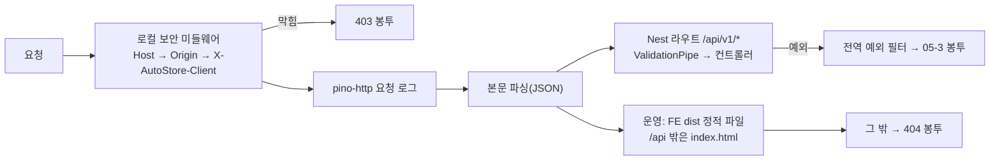

# 06-2. BE 스캐폴딩 (apps/BE)

| 항목 | 내용 |
|---|---|
| 상태 | **Proposed** (오너 위임 D-11. 오너가 짚으면 고친다) |
| 날짜 | 2026-09-27 |
| 스택 | NestJS 12.1 · Prisma 7.10(`prisma-client` 생성기 + `@prisma/adapter-pg`) · PostgreSQL 14.20 · Jest 30 + ts-jest · ESLint 9 |
| 근거 | [02-ADR-001](../02_기술스택/02-ADR-001_기술스택.md), [03-ADR-003](../03_아키텍처/03-ADR-003_아키텍처.md), [03-2 C4 §3·§5](../03_아키텍처/03-2_C4다이어그램.md), [04-3 Prisma 스키마](../04_데이터베이스/04-3_schema.prisma), [04-4 V1 SQL](../04_데이터베이스/04-4_V1__init.sql), [05-1 §1](../05_API/05-1_엔드포인트표.md), [05-2 openapi](../05_API/05-2_openapi.yaml), [05-3 오류 코드](../05_API/05-3_에러코드페이징규약.md) |
| 같이 볼 문서 | [06-1 저장소·형상관리](06-1_저장소·형상관리.md), [06-3 FE 스캐폴딩](06-3_FE스캐폴딩.md), [06-4 환경변수](06-4_환경변수.md) |

## 1. 한눈에 보기

- BE는 NestJS 프로세스 하나다. `127.0.0.1:3100`에만 붙고, API는 `/api/v1` 아래에 있다.
- 03-ADR-003의 모듈 13개를 빈 껍데기로 만들었다. 실제 엔드포인트는 배선 확인용 하나뿐이다: `GET /api/v1/ai-cli-checks/latest`(system 모듈, D-16).
- P1-01(공통 기반)에서 `GET /api/v1/events`(SSE), `GET /api/v1/image-assets/{id}`·`…/file`, `GET /api/v1/call-usage`와 외부 호출 관문·이미지 저장·감사 기록 서비스를 더했다(§9-8~16).
- 로컬 보안(Host·Origin·`X-AutoStore-Client`)은 Express 전역 미들웨어로 모든 요청 맨 앞에서 검사한다. CORS는 켜지 않는다.
- 모든 오류는 05-3 오류 봉투 `{ code, message, status, timestamp, path, fieldErrors?, details? }`로 나간다.
- Prisma 스키마와 첫 마이그레이션은 문서(04-3·04-4)의 사본이다. `db:check-sync`가 둘이 같은지 검사한다.
- **NestJS 12는 ESM 전용**이다. 그래서 BE도 ESM(`"type": "module"`)이다(§9-1).

## 2. 폴더 구조

```
apps/BE/
├─ src/
│  ├─ main.ts                 시작점. app.listen(PORT, '127.0.0.1')
│  ├─ app.module.ts           모듈 조립 + 운영에서 FE 정적 파일(serve-static)
│  ├─ app.setup.ts            main·e2e 공용 설정(보안 미들웨어·접두사·파이프·필터·404 봉투)
│  ├─ openapi-export.ts       구현 명세 → dist/openapi.impl.json
│  ├─ common/
│  │  ├─ common.module.ts     전역: 진행 알림·파일 저장·감사 기록(P1-01)
│  │  ├─ config/              환경변수 검증(env.validation.ts)·AppConfigService·경로(paths.ts)
│  │  ├─ security/            로컬 보안 규칙(local-security.ts)
│  │  ├─ errors/              오류 코드(error-codes.ts)·ApiException(headers)·전역 예외 필터·ValidationPipe
│  │  ├─ logging/             nestjs-pino 설정(비밀 헤더 가림)
│  │  ├─ time/kst.ts          한국 날짜(kst_date)·다음 KST 0시(Retry-After)
│  │  ├─ events/              SSE: 이벤트 타입 22개·ProgressEventsService·GET /events
│  │  ├─ files/               FileStorageService(APP_DATA_DIR)·ImageAssetsService·GET /image-assets/*
│  │  ├─ audit/               UserActionLogService(user_action_log)
│  │  ├─ secrets/             SecretStore 포트·키체인 구현·비밀 가림(secret-mask)·SecretsModule(전역, P1-07)
│  │  └─ safety/              안전장치 끄기 이름·개인 값 검사기(테스트·P1-03이 쓴다)
│  ├─ prisma/                 PrismaService(@prisma/adapter-pg)·PrismaModule(전역)
│  ├─ generated/prisma/       Prisma 생성물(git 제외, prisma generate가 만든다)
│  └─ modules/
│     ├─ step-engine/ keywords/ sourcing/ pricing/ category/ thumbnails/
│     ├─ content/ tags/ registration/ products/ settings/          (빈 껍데기, 책임 한 줄 주석)
│     │     settings/ 설정 파일(P1-03) · purchase-agency-profile/ GET·PUT /purchase-agency-profile·고정값·⑨ 요청 조각·입력 이름(P1-09)
│     │               · dispatch-delivery-companies/ GET /dispatch-delivery-companies(설정 파일 목록, P1-09)
│     ├─ system/              ai-cli-checks/ (첫 엔드포인트) · secrets/ GET·PUT /secrets · commerce-auth/ GET /auth-status·POST /auth-checks(P1-07)
│     └─ integrations/        http/ 외부 호출 관문(ExternalHttpGateway·대상 표·URL 가림·CallLogService·토큰 3개)
│                             call-usage/ GET /call-usage·KST 0시 타이머
│                             ai-engine/ ai-engine.port.ts·cli-isolation.ts(AI CLI 격리 검사기)
│                             naver-commerce/ 서명·토큰 캐시(CommerceTokenService)·CommerceApiClient·전송 포트(P1-07)
│                             commerce-meta/ 메타 동기화(대상별 syncers/·mappers/·수동 API·하루 1회 자동·재시작 정리)·캐시 목록 API 4개·CommerceMetaCacheService(P1-08)
├─ prisma/
│  ├─ schema.prisma           04-3 사본(generator output만 다름)
│  └─ migrations/
│     ├─ 20260927000000_v1_init/migration.sql   04-4 바이트 그대로
│     └─ migration_lock.toml
├─ test/                      e2e(app.e2e-spec.ts)·jest 설정·테스트 DB 준비
├─ scripts/                   check-db-sync.mjs · with-test-db.mjs · test-db-env.cjs
├─ prisma.config.ts           Prisma CLI 설정(DATABASE_URL)
├─ nest-cli.json · tsconfig.json · tsconfig.build.json · eslint.config.mjs · jest.config.cjs
└─ .env.example · .env(git 제외)
```

- 모듈 이름은 03-ADR-003 결정 3의 경계 그대로다. 단계 모듈끼리는 서로 부르지 않는다(03-2 §3). 이 규칙은 아직 코드 검사로 막지 않았다(§10).
- `ai-engine.port.ts`에는 PRD §8.9·03-2 §3의 `AiEngineAdapter { code, detect(), authStatus(), smokeTest(model), runStructured(task, schema, inputs, {model, timeoutMs}) }`만 있다. 결과 타입의 필드는 `ai_cli_check`(ERD v0.4)에서 가져왔다. 입력 타입(`AiEngineInputs`)은 Proposed다. 어댑터 3개는 아직 없다.

## 3. 요청 처리 순서



- 보안 검사는 `app.use()`로 가장 먼저 등록한다. 그래서 없는 경로·정적 파일·SSE도 같은 검사를 받는다. 본문을 읽기 전에 막으므로, 밖에서 온 잘못된 JSON도 400이 아니라 403이 된다.
- 막은 요청은 `LocalSecurity` 로그에 `경고`로 남는다(코드·메서드·경로만, 헤더 값은 남기지 않는다).

## 4. Prisma 흐름과 문서 원본·사본 관계

| 문서 원본 | 앱 사본 | 규칙 |
|---|---|---|
| `docs/dev/04_데이터베이스/04-4_V1__init.sql` | `apps/BE/prisma/migrations/20260927000000_v1_init/migration.sql` | **바이트 그대로**. 한 글자도 다르면 안 된다 |
| `docs/dev/04_데이터베이스/04-3_schema.prisma` | `apps/BE/prisma/schema.prisma` | `generator client` 블록의 `output`만 다를 수 있다 |

- 허용 차이는 하나다: `output = "../generated/prisma"` → `"../src/generated/prisma"`. 생성물을 `src` 안에 두어야 `nest build`(tsc)가 같이 컴파일한다. 이 경로는 루트 `.gitignore`·`.prettierignore`에 이미 들어 있다.
- `moduleFormat`은 넣지 않았다. BE가 ESM이라 Prisma 기본값(ESM, 상대 import에 `.js`)이 그대로 맞는다.
- 접속 URL은 `schema.prisma`가 아니라 `prisma.config.ts`가 준다(Prisma 7). `prisma.config.ts`는 `apps/BE/.env`를 읽되 셸에 이미 있는 값은 덮어쓰지 않는다(`process.loadEnvFile`).
- 런타임은 드라이버 어댑터를 쓴다: `new PrismaClient({ adapter: new PrismaPg({ connectionString: DATABASE_URL }) })`. 첫 쿼리 때 접속하고, 앱이 끝날 때 끊는다.

**스키마를 바꿀 때 순서**

1. 문서 04-3(필요하면 04-1 ERD)을 먼저 고친다.
2. 사본에 복사한다(`generator` 블록의 `output`은 그대로 둔다).
3. 새 마이그레이션 폴더를 만든다: `pnpm exec prisma migrate dev --create-only --name <이름>`. Prisma 밖 SQL(CHECK·부분 인덱스·트리거)은 손으로 끝에 붙인다(04-4 머리말).
4. `pnpm --filter @autostore/be db:migrate`(개발 DB) · `db:migrate:test`(테스트 DB)로 적용한다.
5. `db:diff`가 "No difference detected."인지, `db:check-sync`가 통과하는지 본다.

- 04-4처럼 문서에 SQL 원본을 두는 마이그레이션은 V1 하나다. V2부터 문서에 SQL을 둘지는 정하지 않았다(§10).

## 5. 스크립트

모두 `pnpm --filter @autostore/be <스크립트>`로 부른다. 저장소 루트에서 먼저 `nvm use`.

| 스크립트 | 하는 일 |
|---|---|
| `dev` | `nest start --watch`. `.env`의 `NODE_ENV=development` |
| `build` | `prisma generate && nest build` → `dist/main.js` |
| `start` | `nest start`(한 번 빌드하고 실행) |
| `start:prod` | `NODE_ENV=production node dist/main.js`. FE `dist`가 있으면 화면도 내보낸다 |
| `test` | 단위 테스트(`src/**/*.spec.ts`) |
| `test:e2e` | e2e(`test/*.e2e-spec.ts`). `autostore_test`에 마이그레이션을 적용한 뒤 돈다 |
| `lint` | ESLint(타입 정보 규칙 포함) |
| `typecheck` | `prisma generate && tsc --noEmit` |
| `db:generate` | Prisma 클라이언트 생성(`src/generated/prisma`) |
| `db:migrate` | `prisma migrate deploy`(개발 DB) |
| `db:migrate:test` | 같은 것을 테스트 DB에(`TEST_DATABASE_URL`) |
| `db:status` | `prisma migrate status` |
| `db:diff` | DB ↔ `schema.prisma` 차이. 다르면 exit 2 |
| `db:check-sync` | 문서 원본 ↔ 앱 사본 검사(§4). 어긋나면 exit 1 |
| `openapi:export` | `nest build` 뒤 `dist/openapi.impl.json` 쓰기. HTTP 경로로는 내보내지 않는다 |

- `build`·`typecheck`가 `prisma generate`를 먼저 부르는 이유: 생성물이 git에 없어서 새로 받은 저장소에서도 바로 되게 하려고.
- `test`·`test:e2e`는 `NODE_OPTIONS='--experimental-vm-modules …'`로 Jest를 ESM 모드로 돌린다(§9-1).

## 6. 로컬 보안·오류·로그

**로컬 보안**(05-1 §1.2, 03-2 §5) — `src/common/security/local-security.ts`

| 순서 | 검사 | 대상 | 막으면 |
|---|---|---|---|
| 1 | `Host`가 `127.0.0.1:포트`·`localhost:포트` | 모든 요청(SSE·정적 파일 포함) | 403 `HOST_NOT_ALLOWED` |
| 2 | `Origin`이 있으면 앱 자신(`http://127.0.0.1:포트`·`http://localhost:포트`). 개발에서만 `DEV_FE_ORIGINS` 추가 | POST·PUT·PATCH·DELETE | 403 `ORIGIN_NOT_ALLOWED` |
| 3 | `X-AutoStore-Client: 1` | POST·PUT·PATCH·DELETE | 403 `CLIENT_HEADER_REQUIRED` |
| — | CORS | 켜지 않는다(`Access-Control-*` 헤더 없음) | — |

- '포트'는 요청이 실제로 들어온 포트(`req.socket.localPort`)다. 설정값을 따로 비교하지 않아서 e2e(임의 포트)에서도 같은 규칙이 돈다.
- Vite 개발 서버는 `/api`를 넘길 때 `changeOrigin: true`로 Host를 `127.0.0.1:3100`으로 바꾼다. Origin(`http://127.0.0.1:5173`)은 그대로라 개발에서만 허용한다.

**오류 봉투**(05-3 §2) — `src/common/errors/`

| 상황 | 코드 | HTTP |
|---|---|---|
| 도메인 오류(`ApiException`) | 코드 그대로 | 05-3 표 |
| 본문 검증 실패(ValidationPipe) | `VALIDATION_FAILED` + `fieldErrors` | 422 |
| 쿼리 검증 실패 | `INVALID_QUERY_PARAMETER` + `fieldErrors` | 422 |
| JSON을 읽을 수 없음 | `MALFORMED_REQUEST` | 400 |
| 본문이 너무 큼 | `PAYLOAD_TOO_LARGE` | 413 |
| 없는 경로(`/api/v1` 안팎 모두) | `ROUTE_NOT_FOUND` (**Proposed**, §9-3) | 404 |
| 예상 못 한 오류 | `INTERNAL_ERROR`(내부 메시지는 로그에만) | 500 |

- `timestamp`는 이 PC 시간대 오프셋을 붙인 ISO 8601이다(예 `2026-09-27T20:27:19+09:00`).
- ValidationPipe는 `whitelist`·`forbidNonWhitelisted`·`transform`을 켰다. 정의하지 않은 필드가 오면 422다.
- `fieldErrors[]`는 05-2 `FieldError` 형식 `{ field, message, rejectedValue? }`를 따른다(§9-4).

**로그** — nestjs-pino(`src/common/logging/`)

- 개발은 `pino-pretty` 한 줄 출력, 운영은 JSON 한 줄. 수준은 `LOG_LEVEL`.
- `authorization`·`proxy-authorization`·`cookie`·`set-cookie`·`x-*-secret`·`x-*-token`·`x-*-key` 헤더는 `***`로 가린다(P1-07에서 `[Redacted]` → `***`). 요청 본문은 남기지 않는다(키 입력 API, 05-1 §1.2). 로그 인자 전체를 `hooks.logMethod`로 한 번 더 거른다: 알려진 비밀값·`Bearer <토큰>`·비밀 이름의 키(`client_secret_sign`·`access_token` …)를 지운다(§9-32).
- 로그 파일은 아직 쓰지 않는다(표준 출력만). 파일 로그는 system 모듈을 만들 때 `APP_DATA_DIR/logs`로 붙인다.

## 7. 첫 엔드포인트 `GET /api/v1/ai-cli-checks/latest`

- 05-2 `getLatestAiCliChecks`의 응답 `AiCliCheckLatestList`를 따른다: `{ selectedEngine, items[3] }`, 엔진 순서 CLAUDE·AGY·CODEX, 각 `{ engineCode, selected, latest }`.
- `latest`는 `ai_cli_check`에서 엔진마다 `checked_at DESC, id DESC` 첫 행이다. 점검한 적 없으면 `null`(05-2 설명 그대로).
- `selectedEngine`: 원본은 설정 JSON의 `ai.engine`이다(D-16). 설정 JSON 로더(settings 모듈)가 아직 없어서, 가장 최근 `settings_snapshot.content.ai.engine`을 읽고 없으면 기본값 `CLAUDE`(PRD §8.9 R3)를 준다. **Proposed** — settings 모듈을 만들 때 그쪽 값으로 바꾼다.
- 시각(`checkedAt`)은 UTC ISO 8601(`…Z`, 밀리초 포함)이다. 05-1 §1.1은 오프셋 표기를 허용할 뿐 강제하지 않는다.

## 8. 테스트

| 종류 | 위치 | 내용 |
|---|---|---|
| 단위 | `src/common/security/local-security.spec.ts` | Host 허용·거부 6가지, 조회 메서드 통과, 상태 변경 메서드의 헤더·Origin 규칙, 개발 FE Origin, 검사 순서 |
| 단위 | `src/common/errors/all-exceptions.filter.spec.ts` | ApiException 그대로, 빈 필드 빼기, Nest 예외 → 코드 매핑 6가지, 500에 내부 메시지 안 넣기, 시각 형식 |
| 단위 | `src/common/errors/app-validation.pipe.spec.ts` | 422 `VALIDATION_FAILED`·`INVALID_QUERY_PARAMETER`, 정의 밖 필드 거부 |
| 단위 | `src/common/config/env.validation.spec.ts` | 기본값, 형 변환, 필수·잘못된 값 거부 |
| e2e | `test/app.e2e-spec.ts` (supertest, `autostore_test`) | `/ai-cli-checks/latest` 200·형태(빈 DB, 최신 1건 고르기, 선택 엔진), Host 거부 2건, Origin 거부 2건, 헤더 없음 거부, 통과 후 404, CORS 없음, 404 봉투 2건, 400 봉투 |

**P1-01에서 더한 테스트**

| 종류 | 위치 | 내용 |
|---|---|---|
| 단위 | `src/common/time/kst.spec.ts` | KST 날짜 경계, 다음 0시까지 초 |
| 단위 | `src/modules/integrations/http/url-mask.spec.ts` · `external-targets.spec.ts` · `external-hosts.guard.spec.ts` · `external-http.gateway.spec.ts` | 비밀 쿼리 가림(CHECK 식), 대상 13개 = ERD CHECK, 간격 값, src 안 호스트 검사(F-BS-07), 허용·헤더 검사 |
| 단위 | `src/modules/integrations/ai-engine/cli-isolation.spec.ts` | 격리 규약 위반 6가지(F-BS-07) |
| 단위 | `src/common/safety/*.spec.ts` | 안전장치 끄기 키 없음(F-BS-04), 127.0.0.1 고정·바인딩 env 없음(F-BS-01), 개인 값 없음(F-BS-03) |
| 단위 | `src/common/audit/user-action-log.service.spec.ts` · `events/progress-events.service.spec.ts` · `files/*.spec.ts` | CHECK 11종·gate 필수·kst_date, 이벤트 22개 = 05-2 oneOf(M1), 후보 필터·경로 가림, 경로 탈출 거부·임시 파일 rename, 이미지 규칙·내용 판별 |
| e2e | `test/external-http.e2e-spec.ts` | 가짜 fetch·가짜 시계로 관문 전체(허용·UA·직렬·간격·하루 상한·24시간 쉼·call_log·SSE)와 `GET /call-usage` |
| e2e | `test/image-assets.e2e-spec.ts` · `test/events.e2e-spec.ts` | 이미지 메타·파일(ETag·304·404 두 가지), SSE 프레임·후보 필터·422·403 |
| e2e | `test/prisma-timezone.e2e-spec.ts` | 세션 TimeZone=UTC 회귀(§9-8) |
| e2e | `test/user-action-log.e2e-spec.ts` | KST 0~9시 CHECK 통과, 부르는 쪽 트랜잭션 안 기록·되돌림, 추가만 |

- P1-01 뒤 검증(2026-09-30): 단위 BE 17개 파일 185개·FE 27개, e2e 6개 파일 78개 통과. `lint`·`typecheck`·`build`·`format:check`·`secretlint`·`db:check-sync` 통과. `pnpm dev`에서 Vite 프록시(5173 → 3100)로 `GET /api/v1/events`가 헤더를 바로 받고 25초 뒤 `: keep-alive`가 끊기지 않고 온다.

**P1-07에서 더한 테스트**

| 종류 | 위치 | 내용 |
|---|---|---|
| 단위 | `src/common/secrets/secret-keys.spec.ts` · `secret-mask.spec.ts` | 허용 키 6개 = 05-2 enum 순서, 알려진 비밀값·Bearer·헤더·폼 본문·Error 가림 |
| 단위 | `src/common/secrets/keychain-secret-store.spec.ts` | 가짜 항목으로 set·get·status, 모든 예외 → 503 `KEYCHAIN_UNAVAILABLE`(로그에 값 없음), `security` 출력 mdat 해석. 실제 키체인은 `AUTOSTORE_KEYCHAIN_TEST=1`일 때만 |
| 단위 | `src/common/logging/logging.module.spec.ts` · `errors/all-exceptions.filter.spec.ts` · `errors/app-validation.pipe.spec.ts` | 로거 직렬화기(들어오는·나가는 헤더, 토큰 폼, 오류 객체), 예외 필터 응답·로그 가림, `@OmitRejectedValue()` |
| 단위 | `src/modules/integrations/naver-commerce/*.spec.ts` | 서명 고정 벡터(Python bcrypt), 토큰 폼 5필드·`type=SELF`·`account_id` 없음·13자리 timestamp, 14:00→16:29/16:30 재발급·17:00 만료, 동시 3번 → 발급 1번, invalidate, 401 `GW.AUTHN` 재발급 1회·재전송 1회·다시 401이면 `auth.failed` 1건, 원인 분류표 행마다 |
| e2e | `test/secrets.e2e-spec.ts` | `GET /secrets` 6개, `PUT` 204·멱등·404·422(`rejectedValue` 없음)·403·503, 감사 기록 키 이름만, 누출 검사(pino 메모리 스트림 + `call_log`·`user_action_log` 전체) |
| e2e | `test/commerce-auth.e2e-spec.ts` | 가짜 커머스 서버를 가짜 fetch 뒤에 두고 실제 관문으로: 409·200(`call_log` 1행·trace)·502 원인 5가지·`EXTERNAL_API_ERROR`(연결 오류·5xx)·SSE `auth.failed`·커머스 키 변경 뒤 `tokenValid=false` |

**P1-08에서 더한 테스트**

| 종류 | 위치 | 내용 |
|---|---|---|
| 단위 | `src/modules/integrations/commerce-meta/mappers/mappers.spec.ts` | fixture → 대상별 행·문서(`isOverseas` ← `overseasAddress`, `addressBookNo` 숫자 글자, `exceptionalCategories` 배열, `parentCode`), 빈·모양 다른 응답 오류, 문서 해시(정규화 JSON SHA-256) |
| 단위 | `…/syncers/cache-writes.spec.ts` | `categories-last` → `-v2` → 다시 `-last`: 사라진 행 `removed_at`·`id` 그대로·새 행·이름 변경·다시 나타나면 `removed_at=null`, 문서 같은 payload 1행·sha 같음/다르면 덮어씀 |
| 단위 | `…/commerce-meta-sync.service.spec.ts` | 전체 8개 SUCCEEDED·건수·SSE 8건·호출 38번, ADDRESSBOOK 500 실패 격리(이전 주소록 그대로), 403 권한 안내, 캐시 쓰기 실패 되돌림, 카테고리 캐시 없음, 429 재시도·한도, 인증 실패면 남은 대상 FAILED, 409 진행 중·키 없음·503 |
| 단위 | `…/commerce-meta-recovery.spec.ts` · `commerce-meta-sync.scheduler.spec.ts` · `commerce-meta-api.spec.ts` · `commerce-meta-query.service.spec.ts` | 재시작 RUNNING → FAILED, 자동 실행 판단(가짜 시계: 오늘 KST 성공이면 건너뜀·다음 날 실행·FAILED 6시간·키 없으면 건너뜀·꺼짐), RateLimit 헤더 쉼·429 재시도, 카테고리 거르기(MALE 3·FEMALE 3, 아동·CON-08·removed_at·신발 밖 제외) |
| e2e | `test/commerce-meta.e2e-spec.ts` | 빈 latest 8개 null, 409 키 없음·403·503, 202·Location·RUNNING 8 → SUCCEEDED 8·건수·SSE 8·`call_log` 39행(비밀 없음), 진행 중 409(`details.job=META_SYNC`), 422 5가지, 목록 4개(422·409·정렬·페이지·`raw` 없음·`includeRemoved`), v2 재동기화 `removed_at`·프로필 FK 유지, 재시작 정리 |

**P1-09에서 더한 테스트**

| 종류 | 위치 | 내용 |
|---|---|---|
| 단위 | `src/modules/settings/purchase-agency-profile/profile-values.spec.ts` | 12개 키·빈 기본값, `missingFields`(빈 기본값 → 10개·05-2 예시 4개 포함, 채움 → [], 빈 문자열·⑥-3용 좁은 목록), 정리(공백·빈 문자열 → null, 고시 빈 문구 제거), 바뀐 키(같음 [] · importer만 · 고시 키 순서 무관) |
| 단위 | `…/profile-registration-fragment.spec.ts` | 고정값(INCLUDED·개인통관 false·미성년 true·DELIVERY·FREE), 주소는 로컬 id가 아니라 주소록 번호 숫자(`'100000001'` → 100000001), 확인 안 된 필드 분리, 다른 행·큰 번호는 던짐 |
| 단위 | `…/purchase-agency-profile.service.spec.ts` | 메모리 Prisma(`FakeMetaPrisma` + `purchaseAgencyProfile`)와 실제 `CommerceMetaCacheService`: 참조 검사(해외 통과·국내 422·없는/사라진 id 404·목록 밖 발송 코드 422·설정 없음 503·반품 택배사 404), 저장(1행·profile.* 전파·감사 키 이름만·같은 값 무기록·공백 차이 무기록·importer만 전파·참조 오류 무기록·전파 실패 되돌림), 주소 경고, 요청 조각 |
| 단위 | `…/dto/purchase-agency-profile-input.dto.spec.ts` · `profile-input-keys.spec.ts` | 전역 ValidationPipe로 12개 키·빠진 키·`deliveryFeeKrw`·범위·길이·고시 값 모양, 입력 이름 64자·이름표(step-engine `inputKeyLabel`과 같다)·읽는 단계 |
| e2e | `test/purchase-agency-profile.e2e-spec.ts` | 빈 GET 18키, 시드 뒤 PUT 200·1행(`singleton_key=1`)·감사 1행(값 없음), 같은 PUT 무기록, 422 `ADDRESS_NOT_OVERSEAS`·404 두 가지·422 `DELIVERY_COMPANY_NOT_ALLOWED`·404 반품 택배사, 본문 422 6가지·403, `removed_at` 뒤 `addressWarnings`, 전파(⑥-3만 RERUN_REQUIRED·`stale_inputs=['profile.importer']`·SSE 1건·자동 실행 없음, 승인대기 → 작업중, 잠긴 후보 건너뜀), 발송 택배사 목록·스냅샷 없음 503 |

- 프로필 e2e는 캐시를 동기화하지 않고 `test/fixtures/settings/purchase-agency-profile/`(`seedProfileCaches`)로 직접 넣는다. 발송 택배사는 설정 파일에 fixture 목록(`settings-dispatch-companies.json`)을 끼워 앱을 켠다. 정리는 `TRUNCATE purchase_agency_profile, commerce_addressbook, commerce_return_delivery_company, …(step-engine 표) RESTART IDENTITY CASCADE`.
- 메타 e2e는 `test/support/fake-commerce-meta.ts`(가짜 커머스 메타 서버, fixture `test/fixtures/commerce/meta`)를 P1-07 가짜 커머스 서버 뒤에 끼워 실제 관문(`call_log`)을 지난다. 단위 테스트는 `test/support/commerce-meta-kit.ts`(메모리 Prisma `FakeMetaPrisma` — 실패하면 되돌리는 `$transaction`)를 쓴다. 202 뒤 백그라운드는 `CommerceMetaSyncService.whenIdle()`로 기다린 뒤 정리(TRUNCATE)한다.
- e2e는 `test/setup-env.cjs`가 `APP_DATA_DIR`을 `os.tmpdir()/autostore-e2e-*`로 잡고, 파일마다 끝나면 지운다(`test/cleanup-data-dir.cjs`). 저장소의 `.data/`는 쓰지 않는다.
- e2e 가짜는 `test/helpers/`(가짜 시계·가짜 fetch·`createTestApp`)에 있다. `HTTP_FETCH`·`CLOCK`·`SSE_HEARTBEAT_INTERVAL_MS`를 `overrideProvider`로 바꾸고, 메타데이터 자동 동기화(`COMMERCE_META_SCHEDULE`)는 끈다(P1-08).
- e2e는 `test/global-setup.cjs`가 테스트 DB에 `prisma migrate deploy`를 먼저 돌린다. `DATABASE_URL`은 `TEST_DATABASE_URL`로 바뀌고, DB 이름에 `test`가 없으면 멈춘다(개발 DB 보호).
- 테스트 정리는 `TRUNCATE … RESTART IDENTITY CASCADE`다. `ai_cli_check`에 추가만 트리거, `settings_snapshot`에 삭제 금지 트리거가 있어 `deleteMany`는 막힌다(04-3 주석).
- Jest가 ESM 모드라 `jest.mock` 끌어올리기를 쓸 수 없다. 대신 Nest DI의 `overrideProvider`로 바꿔 끼운다.

## 9. 결정·차이(오너 검토 대상)

1. **BE를 ESM으로 했다.** `@nestjs/common`·`core`·`config`·`serve-static`·`swagger`·`testing` 12.x가 모두 `"type": "module"`이다. 그래서 `apps/BE/package.json`에 `"type": "module"`, tsconfig는 `module/moduleResolution: nodenext`, 상대 import는 `.js`를 붙인다. Jest는 `--experimental-vm-modules` + ts-jest `useESM`으로 돈다(Node 24에서 경고만 끄고 정상 동작).
2. **Origin 검사는 상태 변경 요청에만 한다.** 05-1 §1.2 표와 05-3 `ORIGIN_NOT_ALLOWED` 조건('상태를 바꾸는 요청의')을 따랐다. 조회(GET)는 CORS를 열지 않아서 다른 사이트가 응답을 읽을 수 없다. Origin이 없는 상태 변경 요청(curl 등)은 헤더 검사만 받는다.
3. **`ROUTE_NOT_FOUND`(404) 코드를 더했다.** 05-3 §5.1에 '없는 경로'용 공통 코드가 없다. 문구는 '요청한 주소를 찾을 수 없습니다.' 05-3·05-2에 넣을지 정해 주세요.
4. **`FieldError` 형식이 문서끼리 다르다.** 05-2는 `{ field, message, rejectedValue? }`, 05-3 §2 예시는 `{ field, reason, rejectedValue? }`다. 05-2(API 원본)를 따랐다. 05-3 예시를 고칠지, `reason`을 더할지 정해 주세요.
5. **구현 명세는 OpenAPI 3.0.0**이다(`@nestjs/swagger` 기본). 05-2는 3.1이다. 대조(13 테스트 단계)할 때 `nullable` ↔ `type: [x, 'null']` 차이를 감안한다.
6. **스크립트 2개를 더했다**: `db:migrate:test`, `db:diff`.
7. **serve-static은 `NODE_ENV=production`이고 `apps/FE/dist/index.html`이 있을 때만** 켠다. 개발(3100)에서는 화면을 내보내지 않고, 화면은 Vite(5173)가 맡는다.
8. **DB 세션 시간대를 UTC로 맞춘다(P1-01에서 찾은 버그).** `@prisma/adapter-pg` 7.10은 `timestamptz` 값을 오프셋 없는 UTC 벽시계 문자열로 보내고, 읽을 때 오프셋을 `+00:00`으로 바꿔 버린다. PostgreSQL 기본 시간대가 `Asia/Seoul`이라 저장 시각이 9시간 어긋났고, `ck_call_log_kst`·`ck_ual_kst`가 KST 0~9시에 깨졌다. `PrismaService`가 접속마다 `options: '-c TimeZone=UTC'`를 준다. 회귀 테스트 `test/prisma-timezone.e2e-spec.ts`. (psql로 볼 때는 여전히 서버 기본 시간대로 보인다.)

**P1-01 공통 기반에서 정한 것(Proposed, 2026-09-30 — 오너 검토)**

9. **외부 호출 관문(`ExternalHttpGateway`)**
   - 허용 목록 밖 요청을 막는 코드: `EXTERNAL_REQUEST_NOT_ALLOWED`(500, `details.target`·`reason`). 앱 코드의 잘못이라 500이다. 요청도 `call_log` 행도 만들지 않는다. 막는 것: 대상 표 밖 호스트, `https:`가 아닌 URL, 기본 포트가 아닌 URL, URL 속 사용자 정보, 호출자가 넣은 `User-Agent`·`Origin`·`Cookie`·`Host`·`Forwarded`·`Via`·`X-Forwarded-*`·`X-Real-IP` 등, DATALAB 밖이거나 PRD §8.1 값이 아닌 `Referer`. 05-3 §5.1에 행을 더했다.
   - UA 형식: `autoStore/<앱 버전> (local single-seller tool)`(앱 버전은 `apps/BE/package.json`). NFR-04는 UA를 설정 파일에 두라고 했지만, 브라우저 위장을 막으려고(F-BS-08) 코드 상수로 두고 설정으로 바꾸지 못하게 했다.
   - 최소 간격은 **앞 요청이 끝난 때부터** 잰다(더 보수적). 간격·직렬 큐만 프로세스 메모리에 두므로 앱을 다시 켠 직후 첫 요청은 기다리지 않는다.
   - 쉼·상한 검사는 두 번 한다: 큐에서 기다리기 전(빨리 거절)과 보내기 직전(판단 원본, 같은 대상 요청이 줄 서 있어도 상한을 넘지 않는다).
   - 데이터랩 하루 상한: **100요청**(버튼 수집 1회 = 상위 100위 10요청·500위 50요청). 값은 `daily-limit.provider.ts`의 `DEFAULT_DAILY_LIMITS` 한 곳에만 있고 P1-03이 설정 파일로 옮긴다.
   - 리다이렉트는 따라가지 않는다(`redirect: 'manual'`). 3xx를 그대로 돌려준다. 다른 호스트로 새지 않게 하려는 것이고, 따라가야 하면 부르는 쪽이 관문으로 다시 부른다(새 `call_log` 행).
   - 응답 대기 기본 30초(`timeoutMs`로 바꿀 수 있다). 넘거나 연결이 실패하면 `call_log`에 `succeeded=false`·`error_code=TIMEOUT|NETWORK_ERROR`를 남기고 502 `EXTERNAL_API_ERROR`(`details.target`·`reason`)를 던진다.
   - 2xx가 아닌 응답은 예외가 아니라 그대로 돌려준다(`error_code`는 `HTTP_<상태>`). 비공식 수집의 403·418·429만 쉼을 시작하고 409 `EXTERNAL_CALL_COOLDOWN`을 던진다. 본문을 봐야 아는 오류 코드(커머스API `GW.AUTHN` 등)·건수는 `ctx.describeResponse`로 준다(결과 열은 한 번만 쓰므로). `trace_id`는 응답 헤더 `GNCP-GW-Trace-ID`.
   - `call_log` 쓰기는 `CallLogService.start/finish/recordItemCount`에 모았다. AI CLI(P1-10)처럼 HTTP가 아닌 호출도 같은 서비스로 남긴다.
   - `url_masked`: 이름에 `accesskey`·`applicationid`·`client_secret`·`authkey`·`servicekey`·`apikey`·`token`·`password`·`secret`이 들어간 쿼리값을 `***`로, 사용자 정보·fragment는 빼고, 2048자로 자른다. 마지막에 CHECK 식과 같은 모양이 남아 있으면 한 번 더 가린다.
10. **`GET /call-usage` 목록 대상**: 허용 표에 호스트가 있는 대상만(§05-1 §7.1). KST 0시 타이머는 `setTimeout`(unref)으로 다음 0시 + 1초에 돌고, 목록 대상마다 `call-usage.changed`를 보낸다.
11. **이미지 파일**: 폴더 모양 `APP_DATA_DIR/images/<sha256 앞 2자>/<sha256>.<ext>`(ext: `jpg`·`png`·`webp`·`gif`). 받는 형식은 이 넷뿐이고 내용(sharp)으로 판별한다. 파일을 먼저 쓰고 행을 넣는다(행 없는 파일은 남을 수 있어도 파일 없는 행은 만들지 않는다). ORIGINAL 중복은 `INSERT … ON CONFLICT DO NOTHING`(`createManyAndReturn skipDuplicates`)으로 넣어 부르는 쪽 트랜잭션을 깨지 않는다. `usageRight`는 종류로 정한다(주면 종류와 맞아야 한다).
12. **데이터 폴더(F-BS-02)**: 운영 기본값은 OS 사용자 데이터 폴더(macOS `~/Library/Application Support/autoStore`, Windows `%APPDATA%\autoStore`, 그 밖 `$XDG_DATA_HOME/autoStore`). 개발·테스트 기본값은 지금처럼 저장소 루트 `.data`. `APP_DATA_DIR`이 `apps/` 안이면 시작하지 않고, 운영에서 저장소 안이면 시작하지 않는다(06-4).
13. **SSE**: 25초마다 주석 줄(`: keep-alive`)을 보낸다(`SSE_HEARTBEAT_INTERVAL_MS`, 테스트는 0으로 끈다). `id`는 프로세스 안 카운터(1부터). `data` 속 로컬 경로는 발행 전에 가린다.
14. **감사 기록**: `occurred_at`을 앱이 정해 `kst_date`와 같은 시각으로 쓴다(DB `now()`와 0시 경계에서 어긋나지 않게). `detail`에 넣지 못하는 키 이름 패턴: `secret`·`password`·`token`(단독), `client_secret`·`*Token`·`apiKey`·`accessKey`·`applicationId`·`authKey`·`serviceKey`·`competitorTag(s)`·`rawTag(s)`. 키 이름을 적는 `secretKey`는 된다.
15. **안전장치 끄기 이름(F-BS-04)**: '끄기·건너뛰기·허용·강제' 말(`disable`·`skip`·`bypass`·`ignore`·`allow`·`force`·`override`·`off`·`no-`)과 '안전장치 대상' 말(`g4`·`approv`·`gate`·`child`·`kid`·`person`·`celebrit`·`face`·`duplicate`·`dedup`·`original`·`safety`·`guard` 등)이 한 이름에 같이 있거나 `auto-approve`면 금지다(`common/safety/safety-rules.ts`). 개인 값 모양(F-BS-03): 이메일, 휴대전화·유선 번호, 사업자등록번호, 사용자 홈 경로.
16. **AI CLI 격리 검사기(`cli-isolation.ts`)**: 환경변수 허용 목록 `PATH`·`HOME`·`USER`·`LOGNAME`·`LANG`·`LC_ALL`·`LC_CTYPE`·`TMPDIR`·`TZ`·`TERM`·`NO_COLOR`·`DISABLE_AUTOUPDATER`. `ANTHROPIC_API_KEY`·`OPENAI_API_KEY`는 금지. claude 전역 설정 차단은 `--safe-mode` 또는 `--setting-sources`+`--strict-mcp-config` 중 하나(M0 S6에서 확정). cwd는 비어 있는 절대 경로이고 저장소 밖이어야 한다. 실행 파일은 `claude`·`agy`·`codex`만.

**P1-03 설정 파일 로더·검증·설정 스냅샷에서 정한 것(Proposed, 2026-09-30 — 오너 검토)**

17. **설정 파일**: `APP_DATA_DIR/settings/settings.json` 하나(ERD §7.4-1). 섹션·키·표기·내장 안전 목록은 06-4 §2.2. 첫 실행(파일 없음)에는 기본 템플릿을 그대로 복사해 만든다. 다시 읽을 때 파일이 없어도 같다(시작과 같은 코드). 기본 템플릿 JSON은 `nest-cli.json` `assets`로 `dist`에 복사하고 런타임에 `import.meta.url` 기준으로 읽는다. `SettingsModule`은 `SettingsService`만 export한다(P1-09부터 `PurchaseAgencyProfileService`도 — §9-49. `SettingsFileLoader`는 모듈 안에서만 쓴다 — 규칙 14를 DI에서도 막고, `settings-boundary.spec.ts`가 글자로도 본다).
18. **검사 순서와 오류**: JSON 문법 → JSON Schema(Ajv 8 `allErrors`·`useDefaults`·`strict`, `multipleOfPrecision 9`) + 값끼리의 관계(목표 사이즈·배송기간 최소 ≤ 최대, 고지 블록 ID 중복) → 안전 기준 하한. 앞에서 실패하면 뒤는 보지 않는다. `field`는 JSON Pointer이고 파일 전체(문법 오류·읽기 실패)는 `/`. 문구는 한국어로 바꾸고 값(`rejectedValue`)·파일 내용·절대 경로는 넣지 않는다. 문법 오류는 줄·칸만 알린다. 모든 객체 `additionalProperties: false`, 빠진 키는 기본 템플릿 값(`default`)으로 채워 검사한다(원본 파일은 그대로). 같은 모양을 나눠 쓰는 칸(`targetSizeMm.MALE`·`FEMALE`, `ai.models.*`)도 각자 제 기본값으로 채운다(`MALE: {}` → 250~290).
19. **스냅샷**: `content_sha256`은 기본값을 채운 내용의 키 정렬 JSON SHA-256. 같은 해시면 `last_loaded_at`만(시계가 뒤로 가도 `first_loaded_at`보다 작게 쓰지 않는다), 새 해시면 새 행. 시작 검사·다시 읽기는 한 프로세스 안에서 한 번에 하나씩 돈다(같은 해시로 두 행을 만들려다 UNIQUE에 걸리지 않게). 저장과 재실행 필요 전파 포트(`SETTINGS_RERUN_PROPAGATOR`, 기본 0)는 한 트랜잭션이다. 전파 구현은 DI 토큰을 바꾸거나 `SettingsService.setRerunPropagator()`로 끼운다(step-engine ↔ settings 모듈 순환을 피하는 창구).
20. **시작 검사 실패**: 앱은 뜬다. 가장 최근 스냅샷(`last_loaded_at` 최대)의 `content`를 지금 스키마·안전 기준으로 다시 검사해 통과하면 그것을 현재 설정으로 쓰고 `GET /settings`는 `valid:false`·`errors`. 없거나 통과하지 못하면 `current()`·`currentSnapshotId()`·`GET /settings`가 503 `SETTINGS_INVALID`(`fieldErrors`). DB 오류로 저장하지 못해도 던지지 않고 503 상태로 둔다(로그만).
21. **다시 읽기 실패 SSE**: 422를 던지기 전에 `settings.reloaded`(`settingsSnapshotId` null·`valid` false·`errors` = `"{경로}: {문구}"`)를 보낸다. GET /settings의 검사 결과가 바뀌었기 때문이다(05-2 설명에 반영).
22. **`ai` 섹션**: 파일에서 직접 바꾼 다시 읽기도 받아들인다(05-1 §7.5-51 처리). `ai.*` 키는 `changedKeys`에 넣고 전파 포트에는 넘기지 않는다. `AiCliChecksService.readSelectedEngine()`은 P1-11까지 스냅샷 `content.ai.engine`을 직접 읽는다(경로 그대로).
23. **하루 상한 원본**: `DAILY_LIMIT_PROVIDER`가 요청마다 설정을 읽는다(RAKUTEN_PAGE = `sourcing.pageFetchDailyLimit`, DATALAB = `keywords.datalabDailyLimit`). 쓸 수 있는 설정이 없으면 `DEFAULT_DAILY_LIMITS`(110·100). `IntegrationsModule`이 `SettingsModule`을 가져온다.
24. **앱 버전**: `common/config/app-version.ts`의 `APP_VERSION`(package.json version) 하나를 UA와 `settings_snapshot.app_version`이 같이 쓴다.
25. **e2e 도구**: `createTestApp({ beforeInit })` — 앱 init(시작 검사) 전에 DB를 비우거나 파일을 놓을 수 있다. 설정 e2e는 setup-env가 준 임시 `APP_DATA_DIR`만 쓰고 저장소 `.data`는 건드리지 않는다.

**P1-04 후보 만들기·목록·상태 전환에서 정한 것(Proposed, 2026-09-30 — 오너 검토, API 결정은 05-1 §7.2 'P1-04 구현 결정')**

26. **목록·페이징 공통(`common/paging/`)**: `parsePageRequest(경로, { page, size, sort })`가 page(0 이상)·size(1~100, 기본 20)·sort(`필드,asc|desc`, 허용 필드만, 같은 필드 두 번 금지)를 한 곳에서 검사하고 어긋나면 422 `INVALID_QUERY_PARAMETER`(fieldErrors). 경로별 허용 필드·기본 정렬은 `LIST_SORT_RULES`(05-3 §1 M1 행 그대로). 쿼리 DTO는 `PageQueryDto`를 상속한다. 같은 값끼리는 `id`(첫 정렬과 같은 방향)로 순서를 고정한다.
27. **step-engine 트랜잭션(`StepEngineTransactions.run(scope => …)`)**: 상태를 바꾸는 쓰기는 이 안에서 한다. `scope.now`(CLOCK)로 한 트랜잭션의 시각을 맞추고, SSE는 `scope.afterCommit`에 모아 커밋 뒤에만 보낸다(롤백된 전이는 알리지 않는다). 후보 행은 `SELECT … FOR UPDATE`로 잠그고 바꾼다(`CandidateGuardService.lockForUpdate`).
28. **포트 3개**: `GATE_VALIDITY`(P1-06이 지문 비교로 교체), `CANDIDATE_CREATION_EXTENSION`(P2-02가 ② URL_CREATE를 채움, 기본 null), `GENDER_INPUT_LISTENERS`(열린 ②·④에 성별을 넘김, 기본 빈 배열).
29. **DB 부분 UNIQUE 위반(23505) 변환**: `CandidateIdentityService.withDuplicateMapping(key, fn)`이 트랜잭션 밖에서 `uq_candidate_active_item_color` 위반(Prisma P2002)을 알아보고 기존 후보 id를 찾아 409 `CANDIDATE_DUPLICATE`로 바꾼다.
30. **단위 테스트 틀**: 실제 서비스들을 Nest DI로 묶고 DB·시계·게이트·SSE·감사 기록만 `overrideProvider`로 바꾸는 `candidates/candidate-services.testing.ts`와 메모리 Prisma `test/helpers/fake-prisma.ts`. `*.testing.ts`는 `tsconfig.build.json`에서 빼 빌드본에 들어가지 않는다.
31. **② 검색어 규칙 함수 위치**: `modules/sourcing/domain/rakuten-query.rules.ts`(순수 함수). 후보 만들기와 P2-02의 검색·`validateRakutenQuery`가 같이 쓴다.

**P1-07 비밀정보(키체인)·커머스API 토큰·인증 상태에서 정한 것(Proposed, 2026-09-30 — 오너 검토, API 결정은 05-1 §7.5-44)**

32. **비밀 가림 두 겹(`common/secrets/secret-mask.ts`)**: (1) 이름으로 — 비밀 헤더·필드(`client_secret_sign`·`access_token`·`apiKey`·`accessKey`·`applicationId`·`serviceKey` …) 값과 `Bearer <토큰>`을 `***`로. (2) 값으로 — 키체인에서 읽거나 쓴 값, 받은 토큰, 만든 서명을 프로세스 메모리의 '알려진 비밀' 목록(6자 이상, 최대 256개, 파일·DB에 쓰지 않음)에 올리고 로그 인자(`hooks.logMethod`)·예외 필터 응답(`message`·`details`·`fieldErrors`)과 로그·SSE `data`·`call_log.url_masked`·`error_message`·`error_code`에서 지운다. 키 **이름**(`secretKey: 'COMMERCE_CLIENT_ID'`)은 비밀이 아니다.
33. **`SecretStore` 포트 위치**: C4에 자리가 없어 `common/secrets`(전역 `SecretsModule`, 토큰 `SECRET_STORE`)에 둔다. M1 구현은 `KeychainSecretStore`(`@napi-rs/keyring` `AsyncEntry(서비스 'autoStore', 계정 = 키 이름)`). 모든 저장소 예외 → 503 `KEYCHAIN_UNAVAILABLE`(details.secretKey), 원 예외는 이름·가린 메시지만 경고 로그. `updatedAt`은 macOS `security find-generic-password`의 `mdat`(값을 꺼내지 않는 호출, 셸 없음, 5초 제한). 테스트 저장소 `test/support/in-memory-secret-store.ts`는 같은 클래스에 메모리 항목을 끼운 것이라 예외 변환·값 등록을 그대로 탄다.
34. **`@OmitRejectedValue()`**(`common/errors/app-validation.pipe.ts`): 이 데코레이터를 단 본문 DTO의 422 `fieldErrors`에는 `rejectedValue`를 넣지 않는다(정의 밖 필드 포함). `SecretValueRequestDto`가 쓴다.
35. **토큰(`integrations/naver-commerce/CommerceTokenService`)**: 메모리 캐시만(05-1 §1.2 '키체인'과 달리 05-2를 따름 — 05-1 §1.2에 적음). 남은 시간이 30분 이하면 쓰기 전에 새로 받는다(14:00 → 16:30, 만료 17:00). `expires_in`이 없으면 3시간, 30분보다 짧으면 절반 지점. 미리 받기가 실패해도 만료 전이면 기존 토큰을 쓴다. 동시에 여러 요청이 와도 발급은 한 번(single-flight). `invalidate()`는 진행 중인 발급 결과도 버린다(바뀐 키로 다시 받게). 토큰 값은 JS private 필드에 두고 `toString`·`toJSON`·`inspect`는 가린 모양만 준다. 값을 쓰는 곳은 `authorizationHeader()` 하나.
36. **발급 실패 분류**: 키 없음 409 `SECRET_NOT_CONFIGURED`(details.secretKeys), 키체인 503, `client_secret`이 bcrypt salt 모양이 아니면 보내지 않고 502 `COMMERCE_AUTH_FAILED`(SECRET_CHANGED, `CLIENT_SECRET_FORMAT_INVALID`), 발급 거절(4xx, 429 제외) 502 `COMMERCE_AUTH_FAILED`, 429·5xx·응답 없음·읽을 수 없는 200은 502 `EXTERNAL_API_ERROR`(`reason` RATE_LIMITED·SERVER_ERROR·TIMEOUT·NETWORK_ERROR·INVALID_RESPONSE, `httpStatus`·`traceId`). 발급 호출이 실패하면 SSE `auth.failed`. 원인 분류표는 05-3.
37. **`CommerceApiClient.request(method, path, { query, json, form, multipart, headers, candidateId, stepRunId, timeoutMs })`**: 2xx가 아니어도 던지지 않고 `{ status, ok, headers, body, data, error{code,message,invalidInputs,traceId}, traceId, callLogId, retriedAfterReissue }`를 준다. 예외는 인증 실패뿐 — 401 `GW.AUTHN`(또는 코드 없는 401)이면 재발급 1회 + 원 요청 1회 다시, 그래도 401이면 토큰을 버리고 `auth.failed` + 502. 403 `GW.IP_NOT_ALLOWED`도 `auth.failed` + 502.
38. **전송 포트 `COMMERCE_TRANSPORT`**: 실제 구현 `GatewayCommerceTransport`는 외부 호출 관문을 지나고 오류 본문의 `code`·`message`를 `call_log.error_code`·`error_message`로 남긴다(`trace_id`는 관문이 `GNCP-GW-Trace-ID`로). 테스트 가짜 `test/support/fake-commerce-transport.ts`는 요청 기록 + fixture 응답 + 막힘·연결 오류 모드를 두고, 단위 테스트는 포트로, **e2e는 가짜 fetch(HTTP_FETCH) handler로** 끼운다 — `call_log` 행을 실제 관문이 쓰는지까지 보려고(실행 문서는 e2e에서도 `COMMERCE_TRANSPORT`를 바꾸라고 했지만 그러면 `call_log`가 생기지 않는다).
39. **키 입력 감사 기록**: `PUT /secrets`가 성공하면 `user_action_log`에 `SETTING_CHANGED`·`detail = { secretKey }`만 남긴다. 기록이 실패해도 값은 이미 키체인에 들어갔으므로 요청은 204(경고 로그).
40. **로그 출력 주입 `LOG_DESTINATION`**(`common/logging`): 기본 null(표준 출력). e2e 누출 검사가 메모리 스트림과 수준을 넣는다. `createTestApp({ overrides })`로 `SECRET_STORE`·`LOG_DESTINATION` 등을 더 바꿔 끼운다.

**P1-08 커머스API 메타데이터 동기화에서 정한 것(Proposed, 2026-09-30 — 오너 검토, API 결정은 05-1 §2.13 'P1-08 구현 결정')**

41. **모듈 위치**: `modules/integrations/commerce-meta/`(ERD §3.12·05-2 태그 integrations). `system.module.ts` 주석의 '메타데이터 동기화'를 integrations 소유로 고쳤다(SCR-11은 보여 주기만 한다).
42. **동기화기 규약** `MetaTargetSyncer { target; fetch(ctx: { api, leaves }); apply(tx, raw, now) → itemCount }`: 대상마다 파일 하나(`syncers/*.syncer.ts`), 응답 → 행 변환은 순수 함수(`mappers/*.ts`). `fetch`는 트랜잭션 밖에서 외부 호출을 모두 끝내고 행으로 바꿔 둔다(모양이 다르면 여기서 실패해 캐시에 손대지 않는다).
43. **캐시 쓰기 `syncKeyedRows`**: 기존 행을 읽어 새 키 `createMany`, 값이 바뀐 행만 `update`, 응답에 있는 키 `updateMany(synced_at=now, removed_at=null)`, 없는 키 `updateMany(removed_at=now)`(이미 표시된 행은 그대로). 지우지 않아 `id`와 프로필 FK가 유지된다. 문서형은 `(kind, scope_key)` upsert + `payload_sha256` = 키 정렬 JSON의 SHA-256.
44. **`item_count`**: CATEGORY = 받은 리프 수, 카테고리 단위 3개 = 부른 리프 수, ORIGIN_AREA = 맨 위 + 하위 코드 수, ADDRESSBOOK = 주소록 수, PROVIDED_NOTICE = 문서 1, RETURN_DELIVERY_COMPANY = 택배사 수.
45. **읽기 창구 `CommerceMetaCacheService`**(IntegrationsModule export, 이름 고정): `findCategory(categoryId)`, `listShoeLeaves(gender)`(사라진 행 제외, `blockReason` 함께 — CHILD_CERTIFICATION·CHILD_CATEGORY·CON08_EXCLUDED·null), `getDocument(kind, scopeKey)`, `findOriginArea(code)`, `findAddressbook(id)`, `findReturnDeliveryCompany(id)`. 다른 모듈은 캐시 표에 쓰지 않는다.
46. **`error_message`**: 비밀 없는 한 줄(알려진 비밀값 가림, 500자). 커머스 응답 오류는 'HTTP 상태 · 코드 · 메시지', 주소록 403은 '판매자정보' API 그룹 안내, 알 수 없는 예외는 '앱 내부 오류' 문구(원 예외는 로그에만).
47. **자동 실행 끄기**: 환경변수 `COMMERCE_META_AUTO_SYNC=off`(06-4 §2), 테스트는 `COMMERCE_META_SCHEDULE` 토큰(`createTestApp`이 기본으로 끈다). 새 의존성(`@nestjs/schedule` 등)은 더하지 않았다.
48. **ALREADY_IN_PROGRESS 동시성**: DB RUNNING 행이 원본이다. 행 만들기는 `pg_advisory_xact_lock` 트랜잭션 안에서 진행 중을 한 번 더 본다(같은 대상 RUNNING 두 개 방지). 실행은 프로세스 안 한 줄(직렬)이라 수동·자동이 겹쳐도 커머스API 호출은 하나씩이다.

**P1-09 구매대행 프로필에서 정한 것(Proposed, 2026-09-30 — 오너 검토, API 결정은 05-1 §2.12 'P1-09 구현 결정')**

49. **모듈 경계**: 프로필·발송 택배사 목록은 `SettingsModule` 안(`modules/settings/purchase-agency-profile/`·`dispatch-delivery-companies/`)이고 `PurchaseAgencyProfileService`를 export한다. 주소록·반품 택배사 검사는 integrations의 `CommerceMetaCacheService`로 한다(settings → integrations, 03-2 §3). integrations가 이미 settings를 import하므로(하루 조회 상한) 두 모듈은 서로 `forwardRef`로 부른다. 모듈 파일끼리만 돌고, 서비스 파일은 서로 import하지 않는다.
50. **재실행 필요 전파 포트** `PROFILE_RERUN_PROPAGATOR`(`profile-rerun.port.ts`, 기본 0): 설정 변경 포트(`SETTINGS_RERUN_PROPAGATOR`)와 같은 모양이고, step-engine `PropagationService.onModuleInit`이 `PurchaseAgencyProfileService.setRerunPropagator`로 `onProfileChanged`를 끼운다(settings가 step-engine을 import하지 않게). `onProfileChanged`는 입력 이름을 **정확히** 맞춘다(설정 키의 앞부분 일치와 다르다). 두 전파는 `markSettingsReaders` 한 곳을 같이 쓴다.
51. **입력 이름** `profile.<필드>`(`profile-input-keys.ts`): 단계 실행기는 `profileStepInputs(stepCode, values)`를 `readInputs`에 더한다(`sourceType=SETTINGS`·시작 조건·`required=false` — 빈칸은 단계가 따로 막는다). `STEP_INPUT_SPECS`(가짜 실행기가 쓰는 표)에는 넣지 않았다: 실행기가 이 표 밖의 키를 더 읽는 것은 P1-05 규약이 허락하고, 표에 넣으면 기존 가짜 실행기 지문이 모두 바뀐다. 이름표는 `PROFILE_INPUT_KEY_LABEL`을 step-engine `INPUT_KEY_LABEL`과 FE `inputLabels.ts`가 같이 쓴다.
52. **PUT 본문 검증**: 12개 키는 `@RequiredKey(check)`(`dto/purchase-agency-profile-input.dto.ts`)로 본다 — 키가 없으면 '빠진 키' 문구, null은 통과(수량·고시 제외), 값이 있으면 형식·범위. class-validator `@IsDefined()`는 null도 막아 쓰지 않았다. 위 끝은 DB 열(int4 id·smallint 수량)과 설정 금액 칸(1억 원)에 맞췄다(05-2에 적음). 정의 밖 필드(`deliveryFeeKrw`)는 전역 ValidationPipe(forbidNonWhitelisted) 그대로다.
53. **저장 직렬화**: `replace`는 프로세스 안에서 한 번에 하나씩(설정 다시 읽기와 같은 큐 방식) 돈다. 바뀐 키 계산(트랜잭션 안에서 행을 다시 읽음)과 쓰기 사이에 다른 저장이 끼지 않게 한다.
54. **설정 키** `delivery.dispatchCompanies`(06-4 §2.2): 새 섹션 `delivery`를 더했다. 빠진 파일은 기본값(빈 목록)으로 채워 검사하므로 이미 있는 설정 파일이 깨지지 않는다. 같은 코드가 두 번 나오면 스키마 오류(`/delivery/dispatchCompanies/{i}/code`). 기본 템플릿·fixture(`test/fixtures/settings/*.json`)에 `delivery` 섹션을 더했다.

## 10. 검증 결과 (2026-09-27, Node 24.21.0, 이 PC)

| 검사 | 명령 | 결과 |
|---|---|---|
| 타입 검사 | `typecheck` | 통과(exit 0) |
| 린트 | `lint` | 오류 0 · 경고 0 |
| 포맷 | 루트 `prettier --check apps/BE` | 통과 |
| 단위 테스트 | `test` | 4개 파일, 50개 통과 |
| e2e | `test:e2e` | 1개 파일, 12개 통과(`autostore_test`) |
| 마이그레이션 | `db:migrate` · `db:migrate:test` | 두 DB 모두 `20260927000000_v1_init` 적용. 테이블 56개(55 + `_prisma_migrations`) |
| 차이 | `db:diff`(개발) · 테스트 DB 같은 명령 | 두 DB 모두 "No difference detected." (exit 0) |
| 상태 | `db:status` | "Database schema is up to date!" |
| 원본·사본 | `db:check-sync` | SQL 98,675바이트 동일(sha256 `8b1e09011a2d…`), Prisma 1,783행 동일, 허용 차이 `output` 1건 → 통과. 일부러 한 글자 바꾸면 해당 행을 짚고 exit 1 |
| 빌드 | `build` | `dist/main.js` 생성 |
| 구현 명세 | `openapi:export` | 경로 1개 → `dist/openapi.impl.json` |

**빌드본 실행**(`start:prod`, 그 뒤 종료)

| 요청 | 결과 |
|---|---|
| `GET http://127.0.0.1:3100/api/v1/ai-cli-checks/latest` | 200 `{"selectedEngine":"CLAUDE","items":[…3개, latest null]}` |
| 같은 요청, `Host: localhost:3100` | 200 |
| 같은 요청, `Host: attacker.example` | 403 `HOST_NOT_ALLOWED` |
| `POST /api/v1/ai-cli-checks`(헤더 없음) | 403 `CLIENT_HEADER_REQUIRED` |
| `POST`, `X-AutoStore-Client: 1`, `Origin: http://127.0.0.1:5173`(운영) | 403 `ORIGIN_NOT_ALLOWED` |
| `GET /api/v1/nope` | 404 `ROUTE_NOT_FOUND` |
| `GET /settings/ai-engine`(FE dist 있음) | 200 `text/html`(SPA 대체) |
| `GET /`, `Host: x.example` | 403 |
| `lsof -iTCP:3100 -sTCP:LISTEN` | `TCP 127.0.0.1:3100 (LISTEN)` 한 줄뿐 |
| 이 PC의 LAN 주소(en0)로 3100 접속 | 연결 거부(curl exit 7) |

- 개발 모드(`start`, `NODE_ENV=development`)에서는 `Origin: http://127.0.0.1:5173` + 헤더가 있는 POST가 보안 검사를 지나 라우팅된다(없는 경로라 404) — FE 개발 서버 허용 확인.

## 11. 남은 일

- 단계 모듈끼리 import를 막는 린트 규칙(예: `no-restricted-imports` 경로 규칙)을 모듈을 채울 때 더한다.
- 05-3 오류 코드 143개를 `error-codes.ts`에 옮기는 것은 09 API 개발에서 모듈별로 한다. 지금은 공통 9개만 있다.
- `AiEngineAdapter` 구현 3개와 fixture 어댑터, `POST /ai-cli-checks`는 D-16 구현 때 만든다.
- 파일 로그(`APP_DATA_DIR/logs`)와 앱 재시작 복구(03-2 §4)는 system·step-engine 모듈에서.
- (P1-01) 라쿠텐 상품 이미지를 내려받는 호스트와 그 `CallLogTarget`은 허용 표에 없다. `RAKUTEN_PAGE`로 세면 하루 110 예산을 먹는다. P3-01 전에 정한다.
- (P1-01) 환율 두 곳(`FX_KOREAEXIM`·`FX_CUSTOMS`) 호스트는 P2-04에서 허용 표에 더한다.
- (P1-01) 요청 DTO가 생기면 `findSafetyGuardSwitches`로 키 이름을 검사하는 테스트를 더한다. 설정 스키마 키는 P1-03이 `safety-guards.spec.ts`에 더했다.
- (P1-03) 재실행 필요 전파 구현(P1-05), `ai` 섹션 변경 뒤 선택 엔진 계약 테스트 훅(P1-11), `AiCliChecksService`를 `SettingsService`로 바꾸기(P1-11).
- (P1-07 완료, 2026-09-30) 비밀정보 저장소(`SECRET_STORE`, 키체인)·키 입력 API(`GET·PUT /secrets`)·커머스API 서명·토큰 캐시·자동 갱신·401 재발급(`CommerceTokenService`·`CommerceApiClient`)·인증 상태 API(`GET /auth-status`, `POST /auth-checks`)·SSE `auth.failed`·로그/응답/`call_log` 비밀 가림.
- (P1-07) 실제 커머스API 연결 확인은 오너가 앱 등록(PRD §0 5번)·M0 S3 뒤 SCR-11에서 키를 넣고 '토큰 다시 받기'로 한 번 한다. 그때 받은 오류 코드로 원인 분류표(05-3)·fixture를 고친다.
- (P1-07) 터미널로 키를 넣는 명령(F-SY-01 '또는 터미널 명령')은 만들지 않았다. 만든다면 값을 명령 인자로 받지 않고 가려진 표준 입력으로 받는다.
- (P1-07) 라쿠텐·환율 키를 읽는 쪽(P2-02·P2-04)은 `SECRET_STORE.get()`만 쓰고, 없으면 409 `SECRET_NOT_CONFIGURED`(`details.secretKeys`, `{키 이름}`은 `secretKeysLabel`)를 던진다.
- (P1-08 완료, 2026-09-30) 메타데이터 8개 대상 동기화(수동 `POST /commerce-meta-sync-runs`·하루 1회 자동·재시작 정리)·캐시 목록 API 4개·`GET /commerce-meta-sync-runs/latest`·SSE `commerce-meta-sync.completed`·SCR-11 메타 패널.
- (P1-09 완료, 2026-09-30) 구매대행 프로필 GET·PUT, 발송 택배사 목록, 고정값·⑨ 요청 조각(`buildProfileFragment`)·입력 이름(`profileStepInputs`), 프로필 변경 전파(`onProfileChanged`), SCR-10 '구매대행 프로필' 탭.
- (P1-09) 해외 출고에 쓸 발송 택배사 코드·주문당 구매수량 제한 필드·반품 택배사 필드·고시 0/1 입력 형식은 M0 S3 뒤 정한다. 코드는 출처와 함께 설정 파일 `delivery.dispatchCompanies`에 넣고, 필드 자리는 P4-03이 `unconfirmedFields`에서 옮긴다.
- (P1-08) 실제 첫 동기화는 오너가 앱 등록(PRD §0 5번)·M0 S3 뒤 키를 넣고 SCR-11 '지금 동기화'로 한다. 그때 받은 응답으로 `commerce-meta/mappers/*.ts`·`commerce-meta.constants.ts`(경로·쿼리 이름)·fixture(`test/fixtures/commerce/meta`)와 ERD §7.3-9를 함께 고친다. 주소록 조회는 커머스API 앱에 '판매자정보' API 그룹이 있어야 한다.
