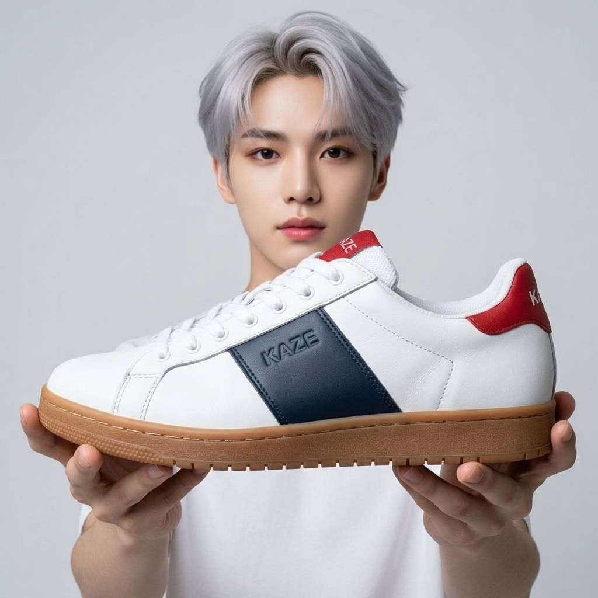
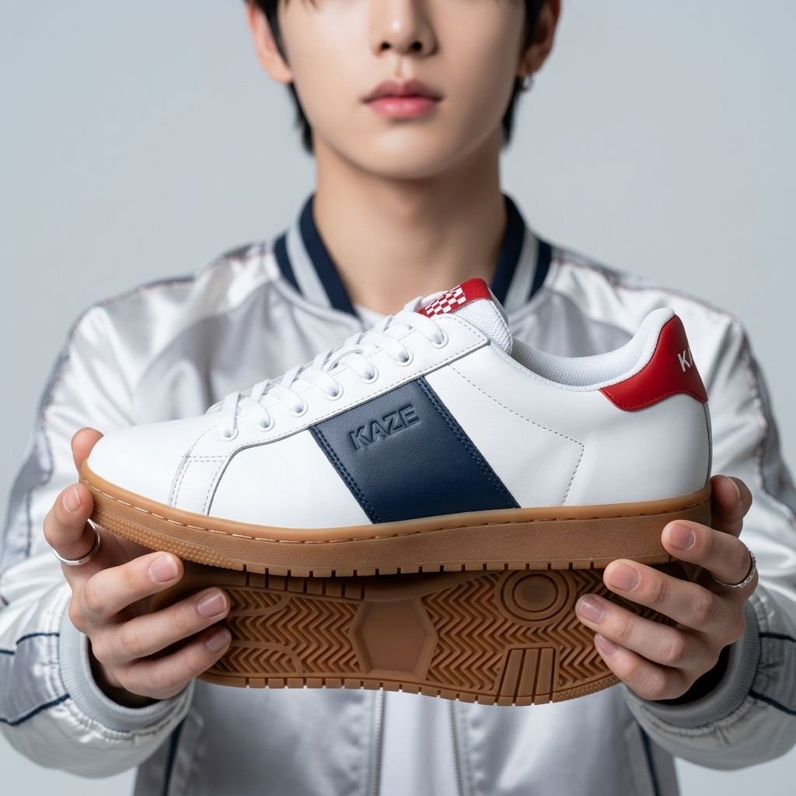
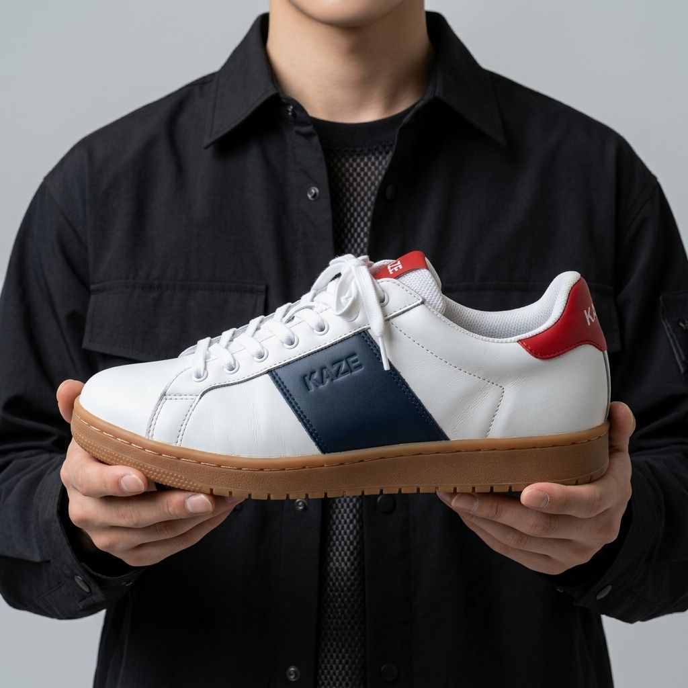

# M0 S1 — agy 헤드리스 썸네일 생성(`generate_image`)

> **상태**: Proposed. 실측 결과와 추천안이다. 신발 충실도·얼굴 노출 판정은 Claude가 눈으로 본 것이라 참고값이다. PRD 사람 채점 기준(70%·디테일)은 **미측정**이다(§6). 오너 결정(2026-10-03, [원천자료 10](../../prd/원천자료/10_S1결정_2026-10-03.md)): Q1 → D-21(해상도 기본 1024), Q2 → D-22('70%'는 신발 길이), Q3 → D-23(하드 타임아웃 기본 300초), Q4 → D-24(얼굴 노출 문장 그대로), Q5 → D-25(agy 기록은 지우지 않고 용량 표시), Q6 → D-26(StitchMCP 그대로). Q1~Q6이 모두 정해졌다(§8).
> **작성**: 2026-10-02. 오너 PC(macOS)에서 오너 본인 Google 플랜으로 로그인된 공식 `agy`를 불러 쟀다(D-19).
> **범위**: PRD §17 S1 중 agy 경로만 본다. 레퍼런스 사진 → 썸네일이 되는지, 출력 찾기, 크기·형식, 권한, 격리, 실패 모양, 시간, 학습·텔레메트리 끄기, 거부를 봤다. Gemini API 비교는 하지 않았다(키 없음, D-19).
> **이미지 생성 호출**: 13회(성공 12, 시간 초과로 취소 1). 그 밖에 생성 없이 끝난 호출 1회(레퍼런스 파일 없음), 쿼터를 쓰지 않는 감지 호출 7회(`/quota`·`/config`·`/permissions`).
> **설정**: 오너의 agy·Gemini 설정 파일은 읽기만 했다. 학습·텔레메트리 설정은 건드리지 않았다(D-20).
> **입력**: 실제 라쿠텐 사진이 아니라 agy로 만든 **합성 판매 사진** 2장(가상 브랜드 KAZE·RYU)이다. 합성 사진 배경에는 실제 상표(Rakuten, ASICS 등)가 그려져 있어 저장소에 넣지 않았다.

---

## 0. 한눈에 보기

| 항목 | 결과 |
|---|---|
| 되는가 | **된다.** 레퍼런스 편집 10회와 텍스트→이미지 2회가 모두 이미지를 냈다(12/12). 거부 0회 |
| 권한 플래그 | **필요 없다.** 기본 모드(`request-review`)에서 동작했다. `--dangerously-skip-permissions`도 허용 목록도 쓰지 않았다 |
| 출력 위치 | 작업 폴더가 아니라 `~/.gemini/antigravity-cli/brain/<conversation_id>/<ImageName>_<13자리 시각>.jpg` |
| 출력 찾기 | `--json-schema`로 받은 `structured_output.image_path`(스키마를 쓴 성공 11/11 정확). 그 경로가 `brain/<conversation_id>/` 바로 아래인지 다시 확인한다 |
| 크기·형식 | 12장 모두 **JPEG 1024×1024**. 확장자와 내용이 같았다. **2048 요청 7회도 모두 1024**였다 |
| 시간(벽시계) | 이미지 12장 p50 **27.9초**, 최대 **92.2초**. 생성 도구만 보면 p50 10초, 최대 74초 |
| 실패 모양 | 레퍼런스 파일이 없을 때도, 시간을 넘겼을 때도 `status: SUCCESS`, exit 0 |
| 보안 | `generate_image`는 작업 폴더 경계를 보지 않는다. `--add-dir` 밖 파일과 홈 아래 저장소 파일도 거부 없이 읽었다 |
| 사용자 MCP | 호출마다 StitchMCP가 자식 프로세스로 뜬다. 부르지는 않았다 |
| 남는 파일 | 작업 폴더에는 0개. 오너 홈 `~/.gemini/antigravity-cli/` 아래에 이미지를 만든 호출당 약 1.2~2.2MB(brain 폴더 + 대화 DB)가 남는다 |
| 학습·텔레메트리 끄기 | 호출 단위로 끄는 방법을 **찾지 못했다**. 오너가 계정 설정에서 끈다(D-20) |
| `AGY_CLI_DISABLE_AUTO_UPDATE` | `=1`은 효과가 없다. **`=true`면 꺼진다**(감지 호출로 확인). 이미지 실행 14회는 모두 `=1`로 돌았다(§2) |
| 사람 채점 기준 | **미측정**: 실제 라쿠텐 상품 사진으로 오너 채점이 필요하다(§6) |

**판정(Proposed)**: agy 경로는 **쓸 수 있다**. 앱에 실제 어댑터를 붙였다(§7). PRD 성공 기준 중 사람 채점 3개는 오너가 실제 상품으로 채점한 뒤 정한다.

---

## 1. 목적

- D-19로 정한 경로(agy `generate_image`, 오너 Google 플랜)가 헤드리스로 도는지 본다. 공식 문서가 없다(R06 F08).
- 앱 어댑터 계약을 정한다: 호출 인자, 출력 위치와 찾는 법, 크기·형식, 실패 신호, 시간 제한(PRD §17 M0 산출물).
- `--dangerously-skip-permissions`가 필요한지, 사용자 설정 파일을 고치지 않고 호출 단위로 상호작용 수집을 끌 수 있는지 본다(PRD §17 S1, D-20).

## 2. 환경

| 항목 | 값 |
|---|---|
| CLI | `agy` 1.2.14(`~/.local/bin/agy`). 측정 중 바뀌지 않았다(`update_status: Already on the latest version`) |
| 계정 | 오너 본인 Google 플랜(`useG1Credits: false` — 한도를 넘어도 유료 크레딧으로 넘어가지 않는다) |
| 에이전트 모델 | `gemini-3.8-flash-medium`(S7 텍스트 기본값). e06 1회만 `-low`. 이미지 모델은 고를 수 없다(도구 인자에 없음) |
| 실행 | 셸 없이 인자 배열, 새 프로세스 그룹, stdin 닫음, 호출마다 새 빈 작업 폴더 |
| 환경변수 | 앱 허용 목록 중 이 셸에 있던 것(`PATH`·`HOME`·`USER`·`LOGNAME`·`LANG`·`LC_CTYPE`·`TMPDIR`) + `AGY_CLI_DISABLE_AUTO_UPDATE`. API 키 변수 없음. 이미지 실행 14회(g01·g02·e01~e12)는 모두 `AGY_CLI_DISABLE_AUTO_UPDATE=1`(효과 없음 — §4.9)로 돌았다. `=true`는 감지 호출 p07 1회에만 줬다. 그래도 측정 중 버전은 1.2.14 그대로였다 |

## 3. 방법

- 프롬프트는 앱 코드 그대로다. `buildPrompt`(dist)와 설정 기본값 `thumbnail.promptTemplate`으로 만들었다.
- 그 위에 감싸는 지시문을 붙였다. 내용은 'generate_image를 정확히 한 번 부른다. ImagePaths·Prompt(글자 그대로)·ImageName을 준다. 다른 도구는 쓰지 않는다. 결과 경로를 `image_path`에, 실패 문구를 `error`에 넣는다'다. 문구 전문은 [`agy-image-gen.provider.ts`](../../../apps/BE/src/modules/integrations/image-gen/agy-image-gen.provider.ts) `buildAgyImagePrompt`에 있다.
- 호출 인자(최소 권한):

```
agy -p <감싸는 지시문 + 썸네일 프롬프트> --model gemini-3.8-flash-medium
    --output-format json
    --json-schema '{"type":"object","properties":{"image_path":{"type":"string"},"error":{"type":["string","null"]}},"required":["image_path","error"],"additionalProperties":false}'
    --print-timeout <하드 타임아웃 - 20>s --add-dir <이번 호출 레퍼런스 폴더> --disable-slash-commands
```

- 모델은 `generate_image`를 레퍼런스 편집은 `{ImagePaths, Prompt, ImageName}`, 텍스트→이미지는 `{Prompt, ImageName}`으로 불렀다. `AspectRatio: "1:1"`은 14회 중 11회에 스스로 더했다(e02·e09·e10은 넣지 않았다. e02 결과도 1024²였다). Prompt는 감싸는 지시문을 쓴 12회(e01~e12, 실패 2회 포함) 모두 글자 그대로 넘겼다.
- 실행기는 stdout 줄마다 도착 시각을 적었다. 2초마다 자식 프로세스를 표본으로 모았고(API 키는 지움), 호출 전후에 새로 쓰인 파일을 찾았다.
- 입력: agy 텍스트→이미지로 '라쿠텐 판매 사진' 2장을 만들었다(g01·g02). KAZE는 흰색·네이비 가죽 스니커, RYU는 검정 러닝화다. 둘 다 복잡한 배경과 일본어 글씨가 있다. 상세 크롭 1장은 sharp로 잘랐다(e11).
- 충실도·얼굴 노출은 Claude가 결과를 눈으로 봤다. 채점자 1명, 합성 입력이라 참고값이다.

## 4. 결과

원본 기록(stdout·stderr·트랜스크립트)은 저장소에 넣지 않았다. 사용자 경로·대화 id·agy 로그 잡음이 섞여 있다. 앱 테스트용으로 정리한 녹화본만 [`apps/BE/test/fixtures/image-gen/`](../../../apps/BE/test/fixtures/image-gen/README.md)에 넣었다.

### 4.1 실행별

| id | 종류 | 결과 | 벽시계(초) | 생성(초) | 출력 | 충실도(참고) | 얼굴 옵션 |
|---|---|---|---|---|---|---|---|
| g01 | 텍스트→이미지, stream, 스키마 없음 | 성공 | 29.6 | 10 | JPEG 1024² | — | — |
| g02 | 텍스트→이미지, json + 스키마 | 성공 | 27.7 | 9 | JPEG 1024² | — | — |
| e01 | KAZE FULL_FACE, 2048 요청 | 성공 | 31.0 | 10 | JPEG 1024² | 양호 | 지킴 |
| e02 | KAZE CHIN_CROP, 2048 요청 | 성공 | 27.4 | 10 | JPEG 1024² | **실패**(밑창이 하나 더 생김, 혀 탭 무늬 바뀜) | 부분(코·입 보임) |
| e03 | RYU FULL_FACE, 2048 요청 | 성공 | 27.5 | 11 | JPEG 1024² | 양호 | 지킴 |
| e04 | RYU HANDS_UPPER_BODY, 1024 | 성공 | 32.3 | 11 | JPEG 1024² | 양호 | **안 지킴**(얼굴 전체) |
| e05 | KAZE FULL_FACE, `--add-dir` 없음 | 성공 | 28.1 | 10 | JPEG 1024² | 양호(좌우 반전) | 지킴 |
| e06 | KAZE FULL_FACE, 2048, 에이전트 `-low` | 성공 | 25.4 | 10 | JPEG 1024² | 부분(안감 흰색 → 빨강) | 지킴 |
| e07 | RYU CHIN_CROP, 2048 요청 | 성공 | 30.7 | 9 | JPEG 1024² | 양호 | 부분(코·입 보임) |
| e08 | 홈 아래 저장소 단색 이미지, `--add-dir` 없음 | 성공 | 27.3 | 9 | JPEG 1024² | 신발을 지어냄 | 지킴 |
| e09 | 레퍼런스 경로 없음 | **실패**(도구 오류) | 16.3 | 0.05 | 없음 | — | — |
| e10 | `--print-timeout 12s` | **실패**(시간 초과, 취소) | 16.8 | — | 없음 | — | — |
| e11 | KAZE 레퍼런스 2장(전체 + 로고 크롭), json | 성공 | **92.2** | **74** | JPEG 1024² | 양호(좌우 반전) | 지킴 |
| e12 | KAZE HANDS_UPPER_BODY + 조정 문구 | 성공 | 25.5 | 10 | JPEG 1024² | 양호 | **지킴** |

### 4.2 시간

| 구간 | p50 | 최대 | 비고 |
|---|---|---|---|
| 호출 전체(이미지 12장) | 27.9초 | 92.2초 | e11만 1분을 넘었다(캐시 빗나감, 토큰 5.6만) |
| 생성 도구(`generate_image`) | 10초 | 74초 | stream 이벤트 `duration_seconds` |
| 감지 호출(`/quota` 등, 생성 없음) | 5초 | 6초 | agy 시작 비용 |

- 토큰: 호출당 약 3.0만~3.2만(캐시 2.4만 포함). 캐시가 빗나간 호출은 약 5.6만이었다.
- 쿼터(Gemini 그룹): 주간 0.98439 → 0.98422, 5시간 1.0 → 0.99737. 생성 13회와 에이전트 턴을 합한 값이다.

### 4.3 출력 찾기·크기·형식

- 결과 파일은 `~/.gemini/antigravity-cli/brain/<conversation_id>/thumbnail_<13자리>.jpg`에 생긴다. 작업 폴더(cwd)에는 12/12 아무것도 남지 않았다.
- `structured_output.image_path`는 스키마를 쓴 성공 11회(e01~e08·e11·e12·g02) 모두 정확했다(g01은 스키마 없이 불렀다). `conversation_id`는 결과 봉투에 있다. 성공 12회 모두 그 폴더 맨 위에 이미지가 정확히 1개였다.
- 응답 텍스트에 기대면 안 된다. 도구 결과에 'Do not output the path of this image to show to the user'가 붙어 경로가 빠질 수 있다.
- stream 도구 이벤트(`step_update`)에는 출력 경로와 ImagePaths가 없다.
- 형식: 12/12 JPEG(JFIF), 확장자 `.jpg`와 내용이 같았다. 크기는 12/12 1024×1024다. 도구 인자가 Prompt·ImageName·AspectRatio·ImagePaths뿐이라 크기를 줄 수 없다.
- 파일 크기: 편집 결과 447~617KB, 텍스트→이미지 790~924KB.
- 메타데이터: Google LLC가 서명한 C2PA 매니페스트('Created by Google Generative AI', 'Applied imperceptible SynthID watermark', `trainedAlgorithmicMedia`). sharp로 1000×1000 JPEG로 다시 만들면(장당 9~11ms) C2PA는 빠진다. 'AI 생성' 표시는 라벨(IM-08)로 한다.

### 4.4 실패 모양

| 상황 | exit | status | 단서 | 앱 처리 |
|---|---|---|---|---|
| 레퍼런스 없음(e09) | 0 | SUCCESS | 도구 `state: ERROR`, `structured_output.error`에 'failed to read image file: …', `image_path: ""` | 실패(AI_CLI_FAILED), 문구에서 경로 지움 |
| `--print-timeout` 경과(e10) | 0 | SUCCESS | stderr `[agy] print timeout after Ns with turn in progress; returning partial output`, `structured_output` 없음. 생성 요청이 취소돼(`context canceled`) 파일 없음 | 실패(AI_TIMEOUT) |
| 레퍼런스가 신발이 아님(e08) | 0 | SUCCESS | 단서 없음. 신발을 지어낸다 | 잡지 못함 — G3 사람 확인 |
| 콘텐츠 필터 거부 | — | — | 관찰 못 함. 바이너리에 종료 사유 이름만 있다: `IMAGE_SAFETY`, `IMAGE_PROHIBITED_CONTENT`, `IMAGE_RECITATION`, `IMAGE_OTHER`, `NO_IMAGE`(그리고 `SAFETY`, `PROHIBITED_CONTENT`, `BLOCKLIST`, `SPII`) | `error`에 이 이름이 있으면 REFUSED. 이름이 없으면 파일·권한·쿼터 같은 도구 오류 낱말이 없고 거부 문구('refused', 'safety policy' 등)가 있을 때만 REFUSED. 'policy'·'blocked' 낱말 하나로는 거부로 보지 않는다(추정 — 첫 실제 거부 때 고친다) |
| 쿼터·한도·서버 오류 | — | — | 관찰 못 함. S6·changelog 1.2.6 기준 stderr `AGY_ERROR: {…}` + exit 3. 1.2.1부터 429·5xx는 프로세스 안에서 재시도 | 실패(AGY_ERROR) |
| 도구 권한 거부 | — | — | 이번에는 0회(S6에서 관찰). 봉투 `denied_actions` 또는 stderr `jetski: no output produced` | 실패(AI_CLI_FAILED) |
| SUCCESS인데 경로가 없거나 brain 폴더 밖이거나 파일이 없음 | 0 | SUCCESS | — | 빈 결과(AI_OUTPUT_INVALID) |

**조용한 품질 문제(오류 아님)**: 요청 해상도 무시(늘 1024²), 좌우 반전(12장 중 2장), 디테일 어긋남(밑창이 하나 더 생김, 안감 색), 얼굴 노출 옵션 무시(§4.7).

### 4.5 권한

- 최소 권한은 '권한 플래그 없음'이다. 기본 `toolPermission: request-review`에서 동작했다. `/config`의 `permissions`는 null이고 프로젝트·공유·전역 규칙이 모두 비어 있었다. 모든 실행에서 `denied_actions`가 없었다.
- `--dangerously-skip-permissions`는 필요 없었고 시험하지도 않았다.
- 권한 규칙 문법(`command(…)`, `read_file(<abs>)`, `write_file(<abs>)`, `mcp(<server>/<tool>)`)은 바이너리에서 확인했다. 넣을 곳이 사용자 설정 파일뿐이라 앱이 쓸 수 없다.
- **보안**: `generate_image`는 작업 폴더 경계를 보지 않는다. `--add-dir` 없이도 `/private/tmp` 아래 레퍼런스(e05)와 `$HOME` 아래 저장소 파일(e08)을 거부 없이 읽었다. S6에서 `view_file`이 작업 폴더 밖을 거부한 것과 다르다. 그래서 앱은 이번 호출용으로 복사한 레퍼런스의 경로만 넘긴다. `--add-dir`는 경계 역할을 못 하지만 비용이 없어 계속 넣는다.
- 실제로 부른 도구는 모든 실행에서 `generate_image` 1회와 `finish`(스키마를 쓸 때)뿐이다. 그래도 init 이벤트에는 도구 58개(`run_command`, `write_to_file`, `browser_*`, `call_mcp_tool`, `search_web` 등)가 그대로 실린다.

### 4.6 격리·남는 파일

- 사용자 MCP는 호출마다 실린다. 쿼터를 쓰지 않는 `/quota` 호출을 포함해 모든 표본에서 자식 프로세스 `npm exec mcp-remote https://stitch.googleapis.com/mcp …`가 떴다. agy는 호출마다 `~/.gemini/antigravity-cli/mcp/StitchMCP/*.json`(도구 스키마 15개)를 다시 쓴다. 부르지는 않았다.
- 작업 폴더에는 파일이 0개 남는다. `~/.gemini/config/projects`에 새 프로젝트 파일도 생기지 않았다.
- 홈에 남는 것(호출마다): `brain/<id>/`(이미지와 트랜스크립트, 0.5~1.0MB), `conversations/<id>.db`(이미지 호출 744~1,216KB), `annotations`·`presence`·`implicit`, `log/cli-<ts>.log`(20~30KB), 캐시·요약 DB. 임시 폴더에는 `$TMPDIR/unleash-repo-schema-v1-codeium-language-server.json`(463KB 기능 플래그 캐시)을 매번 다시 쓴다.
- 누적: 이번 측정으로 `conversations/`가 40M → 52M, `brain/`이 6.1M → 14M로 늘었다.
- 트랜스크립트에는 프롬프트 전문, 레퍼런스 절대 경로, 결과 경로가 평문으로 남는다. 대화 기록을 끄는 플래그는 없다.
- 오너 Antigravity IDE의 언어 서버도 따로 StitchMCP를 띄우고 있었고, 그 `ps` 명령 줄에 API 키가 그대로 보인다(S6 §6.7과 같음). 이 키는 보고서·fixture에 옮기지 않았다.
- 측정 뒤 남은 agy 프로세스는 없었다(`pgrep -l agy` 결과 없음).

### 4.7 거부·얼굴 노출

- 거부는 0/10이었다. 앱 골격 프롬프트('A fictional young Korean male model with K-pop idol styling — NOT resembling any real person or celebrity — …')로 레퍼런스 편집 10회(FULL_FACE 6회 — e01·e03·e05·e06·e08·e11, CHIN_CROP 2회, HANDS_UPPER_BODY 2회 — e12는 조정 문구) 모두 이미지가 나왔다. 텍스트→이미지 2회(g01·g02)도 거부되지 않았다.
- 실존 인물 이름으로 거부를 유도하는 시험은 하지 않았다. 실존 인물을 닮은 이미지가 나올 수 있어서다. 앱은 그 전에 차단어 검사로 막는다(IM-07).
- 얼굴 노출 준수(참고):

| 옵션 | 지금 문장(`FACE_OPTION_PHRASES`) | 준수 |
|---|---|---|
| FULL_FACE | `full face` | 6/6(e08은 신발을 지어냈지만 얼굴 옵션은 지킴) |
| CHIN_CROP | `crop at chin (face not shown)` | 0/2(눈은 가렸지만 코·입이 보임) |
| HANDS_UPPER_BODY | `hands and upper body only` | 0/1(얼굴 전체가 보임) |
| HANDS_UPPER_BODY + 조정 문구 | '… the head and face must be completely outside the frame; crop at the shoulders …' | 1/1(턱 끝만 보임) |

- 오너 결정 D-24(2026-10-03): 얼굴 노출 준수는 품질·G3 기준이 아니다. 기준은 신발이 돋보이는가 하나다. 문장은 그대로 둔다(§8 #8).

### 4.8 학습·텔레메트리 끄기(D-20)

호출 단위로 상호작용 수집이나 텔레메트리를 끄는 방법은 **찾지 못했다**.

| 본 곳 | 결과 |
|---|---|
| `agy --help` | 해당 플래그 없음 |
| `agy -p /config --output-format json`(쿼터 소모 없음) | 설정 키 32개에 텔레메트리·상호작용 키 없음(`showFeedbackSurvey: true`만 있음) |
| 바이너리의 환경변수 이름(`AGY_*`, `ANTIGRAVITY_*`, `JETSKI_*`) | 텔레메트리를 끄는 것 없음. `ANTIGRAVITY_SENTRY_SAMPLE_RATE`(충돌 보고 표본 비율로 보임)만 있고 시험하지 않았다 |
| settings.json 키 | 바이너리에 `enableTelemetry` 문자열이 있다(S6 약관 G10: 문서상 기본 true). 오너의 `~/.gemini/antigravity-cli/settings.json`을 고쳐야 해 하지 않았다(D-20) |
| 약관 | 모델 학습용 상호작용 수집은 계정 단위 설정이다('navigate to settings to change your preference') |

결론: D-20대로 **오너가 Antigravity 설정 › 계정 › 'Enable Telemetry'를 끈다**. 앱은 학습을 켜지도 끄지도 않고, 사용자 설정 파일을 고치지 않는다. M1 리허설 사전 점검 16에 있다.

### 4.9 자동 업데이트

- `AGY_CLI_DISABLE_AUTO_UPDATE=1`일 때 08:03:48에 `Spawned background update process`가 찍혔다.
- `=true`일 때 08:19:14에 `Auto-update disabled via environment variable AGY_CLI_DISABLE_AUTO_UPDATE`가 찍혔고(agy CLI 로그 `~/.gemini/antigravity-cli/log/cli-<시각>.log`) `last_check.timestamp`도 갱신되지 않았다.
- 앱은 agy 자식에만 `AGY_CLI_DISABLE_AUTO_UPDATE=true`를 넣는다(§7). S7에서 측정 중 1.2.9 → 1.2.14로 바뀐 일을 막는다. 오너가 터미널에서 직접 쓰는 agy는 그대로 업데이트된다.
- 한계: 이미지 실행 14회는 모두 `=1`(효과 없음)로 돌았다. `=true`로 이미지를 만든 실행은 없다(감지 호출 p07에서만 확인). 앱으로 처음 만들 때(M1 리허설 사전 점검 12) 가장 새 agy CLI 로그에 'Auto-update disabled' 줄이 남는지 함께 본다.

## 5. 샘플

agy가 만든 AI 이미지다(가상 브랜드, 가상 모델). 원본 JPEG(447~580KB)를 sharp로 품질 80 JPEG로 다시 저장했다(80~105KB, C2PA 메타데이터 빠짐, 픽셀 속 SynthID는 남음). 원본 12장과 합성 입력은 저장소에 넣지 않았다.

| e01 FULL_FACE(양호) | e02 CHIN_CROP(디테일 실패) | e12 HANDS_UPPER_BODY + 조정 문구(지킴) |
|---|---|---|
|  |  |  |
| 모양·색·KAZE 엠보싱·빨간 힐탭·검 밑창 유지, 배경 글씨 사라짐 | 아래에 밑창이 하나 더 생김, 혀 탭이 체크무늬로. 눈은 가렸지만 코·입이 보임 | 신발이 레퍼런스와 거의 같다. 턱 끝만 보인다 |

## 6. PRD §17 S1 기준 대조(agy만)

| 기준 | 결과 | 판정 |
|---|---|---|
| 사람 채점 기준 70% 통과율 ≥ 60% | 합성 입력이라 재지 않았다. 참고: 눈대중 긴 변 길이비 약 0.84~0.88(D-22 기준 통과), 박스 면적 약 0.30~0.35 | **미측정**: 실제 라쿠텐 상품 사진으로 오너 채점 필요. '70%'는 신발 길이로 잰다(D-22) |
| 디테일 통과율 ≥ 50% | 합성 입력 참고값 7/9(Claude 눈 판정, 채점자 1명) | **미측정**: 실제 라쿠텐 상품 사진으로 오너 채점 필요 |
| 상품 10개 × 후보 2장 | 합성 입력 2종으로 10장 | **미측정**: 실제 라쿠텐 상품 사진으로 오너 채점 필요 |
| 장당 ≤ 5분 | 최대 92.2초 | 충족 |
| (API 경로) 장당 ≤ $0.15 | API 경로를 쓰지 않음(구독 쿼터) | 해당 없음 |
| 1K와 2K 디테일 차이 | agy는 늘 1024. 2048 요청도 1024 | 해당 없음(2K를 받을 수 없다) |
| `--dangerously-skip-permissions` 필요 여부 | 필요 없음 | 확인 |
| 콘텐츠 필터 거부율 | 0/10 | 확인(표본 작음, 거부 문구는 관찰 못 함) |
| 호출 단위 상호작용 수집 끄기(D-20) | 없음 | 확인 — 오너가 계정에서 끈다 |

- '70%' 지표 메모: 1:1 화면에서 옆모습 신발(가로:세로 약 2.3:1)은 바운딩박스 면적이 약 0.43을 넘기 어렵다. 박스 면적으로 재면 기준을 넘기 힘들다. → **결정: D-22**(2026-10-03): 신발 길이(박스 긴 변 ÷ 같은 방향 이미지 변) ≥ 0.70으로 잰다. 오너는 지금 샘플(§5)이 원하는 모양이라고 했다. 프롬프트는 그대로다.
- 오너 채점 방법(추천): 실제 라쿠텐 상품 5~10개를 ⑤에서 후보 2장씩 만들고, G3 체크리스트 '신발 길이가 화면 폭의 70% 이상'(D-22)·'디테일 일치'를 체크한 수를 센다. 생성 이력(`generation_run`)과 결과 이미지가 앱에 남는다.

## 7. 앱 반영(2026-10-02)

| 무엇 | 어디 |
|---|---|
| 실제 어댑터 `AgyImageGenProvider`: 최소 권한 호출(§3), 레퍼런스 복사본만, 출력 찾기(realpath로 brain 폴더 확인 → 맨 위 이미지 1개 대체), 실패 매핑(§4.4), `--print-timeout` = 하드 - 20초, 호출마다 `call_log` AI_AGY_CLI, 작업 폴더 삭제. 기록 모델이 Google 모델(`gemini-*`, PRD §8.9 R12)이 아니면 부르지 않는다. 바이트·크기는 바꾸지 않는다(1000×1000 JPEG는 ⑧ 업로드) | `apps/BE/src/modules/integrations/image-gen/agy-image-gen.provider.ts` |
| 공급자 고르기: 설정 `thumbnail.imageProvider`(기본 AGY)로 `RoutingImageGenProvider`가 어댑터를 고른다. NODE_ENV=test는 가짜 공급자이고, e2e·흐름 테스트는 `IMAGE_GEN_PROVIDER`를 가짜로 바꿔 끼운다(실제 어댑터는 이 토큰 안에만 있어 함께 빠진다). GEMINI_API·OPENAI_API·CODEX는 '연결되지 않음' 실패 | `image-gen/routing-image-gen.provider.ts`, `integrations.module.ts` |
| 실행기 중단 신호: 하드 타임아웃 `signal`이 끊기면 자식을 끝낸다. 생성 작업은 시도 행을 바로 마감하고, 끊긴 agy가 끝날 때까지(최대 10초) 다음 생성을 미룬다(agy 2개가 겹치지 않게) | `ai-engine/process/isolated-cli-runner.ts`, `thumbnails/generation/generation.worker.ts` |
| agy 자식 환경에 `AGY_CLI_DISABLE_AUTO_UPDATE=true` | `ai-engine/process/env-allowlist.ts`, `cli-isolation.ts` 허용 목록 |
| 녹화본 fixture와 단위 테스트(성공·대체 찾기·출력 없음·거부·빈 SUCCESS·도구 오류·시간 초과·중단·미설치·AGY_ERROR·권한 거부·로그인 풀림·크기 후처리) | `apps/BE/test/fixtures/image-gen/`, `agy-image-gen.provider.spec.ts` |
| 실제 호출 테스트(기본 꺼짐): `AI_CLI_LIVE=1 AI_CLI_LIVE_ENGINES=agy-image` | `image-gen/live-image-gen.spec.ts` |

## 8. 추천

| # | 추천 | 상태 |
|---|---|---|
| 1 | S1 agy 경로를 '쓸 수 있음'으로 보고 실제 어댑터를 기본 공급자로 붙인다 | **반영함**(§7) |
| 2 | 출력은 `structured_output.image_path` → brain 폴더 realpath 확인 → 맨 위 이미지 1개 대체 → 아니면 빈 결과 | **반영함** |
| 3 | 실패 매핑(§4.4). `userMessage`에서 로컬 경로를 지운다 | **반영함**. 거부 신호 정규식은 추정이다 — 첫 실제 거부 때 녹화본을 더하고 고친다 |
| 4 | 시간 제한: AGY 하드 타임아웃 기본 300초(관찰 최대 92.2초의 약 3배, '장당 ≤ 5분'과 맞음). `--print-timeout`은 하드보다 20초 짧게 | `--print-timeout`은 **반영함**. 기본값 300초는 **결정: D-23**(2026-10-03) — 설정 기본 900 → 300초(범위 1~900초 그대로, `--print-timeout` 기본 280초). 이미 있는 설정 파일의 값은 앱이 바꾸지 않는다 |
| 5 | 해상도: agy는 늘 1024² JPEG다. `thumbnail.resolutionPx` 기본을 1024로 두거나, 요청값과 실제 크기를 나눠 보이고 화면 요약('2K')을 실제 크기로 고친다 | **결정: D-21**(2026-10-03, [원천자료 10](../../prd/원천자료/10_S1결정_2026-10-03.md)). 기본을 1024로 바꿨다(화면 요약 '1K'). 업로드 때 1000×1000 JPEG로 맞추는 처리(P4-01)는 그대로다. 엔진별 크기 문구는 두지 않는다. 이미 있는 설정 파일의 값은 앱이 바꾸지 않는다 |
| 6 | 보안: 앱이 만든 레퍼런스 복사본 경로만 넘긴다. 라쿠텐 글 같은 외부 텍스트는 이미지 지시문에 넣지 않는다 | **반영함**(프롬프트는 설정 골격 + 오너 조정 문구뿐) |
| 7 | agy 자식 환경에 `AGY_CLI_DISABLE_AUTO_UPDATE=true` | **반영함** |
| 8 | 얼굴 노출 문장을 강하게 고친다. HANDS_UPPER_BODY: 'the head and face must be completely outside the frame; crop at the shoulders; only the hands, arms and torso are visible'(1/1). CHIN_CROP: 'crop the frame at the chin: the model's eyes, nose and mouth must not be visible'(미측정) | **하지 않음 — D-24**(2026-10-03). 얼굴은 보여도 잘려도 상관없다. 기준은 신발이 돋보이는가 하나다(신발 광고 사진). `FACE_OPTION_PHRASES`는 그대로이고, 얼굴 노출 준수는 품질·G3 기준이 아니다. G3 '실존 인물 연상 없음'(초상권 가드레일)은 그대로다 |
| 9 | '70%' 지표를 긴 변 길이비 ≥ 0.70으로 바꿀지 | **결정: D-22**(2026-10-03). 지금 생성 결과가 목표다. 신발 길이(박스 긴 변 ÷ 같은 방향 이미지 변) ≥ 0.70으로 재고 프롬프트는 그대로 둔다. G3 문구는 '신발 길이가 화면 폭의 70% 이상'(키 `shoeRatioOver70`은 그대로, 체크리스트 버전 `M1-2`) |
| 10 | agy 대화 기록 정리: 앱이 썸네일을 가져간 뒤 `brain/<id>`·`conversations/<id>.db`를 지울지 | **지우지 않음 + 용량 표시 — D-25**(2026-10-03). 앱은 사용자 홈의 agy 파일을 지우지 않는다. AI 엔진 설정 화면(SCR-13)에 용량 세 가지를 보인다: agy 기록 폴더(`~/.gemini/antigravity-cli/`) 크기, 앱이 저장한 이미지 폴더(라쿠텐 원본·생성 후보) 크기, PC 디스크 남은 공간. 앱은 크기를 재기만 한다. **반영**(2026-10-03, M1): SCR-13 맨 아래 '저장 공간' 패널(`F-ST-33`, `GET /storage-usage`, PRD §8.9 R17). agy 기록 정리는 오너가 직접 한다 |
| 11 | StitchMCP가 호출마다 뜨니, 원하면 오너가 직접 `agy mcp disable StitchMCP`로 끈다 | **그대로 — D-26**(2026-10-03). 앱 프롬프트가 다른 도구를 쓰지 말라고 하고, S1에서 한 번도 부르지 않았다. 오너 IDE도 같은 방식으로 띄운다. 앱도 오너도 할 일이 없다 |
| 12 | Antigravity 계정 'Enable Telemetry'를 끈다(D-20) | **오너 할 일**(M1 리허설 사전 점검 16) |
| 13 | 쿼터를 쓰지 않는 `agy -p /quota --output-format json`(`remaining_fraction`)을 헬스 패널의 남은 쿼터 표시에 쓴다 | M2 후보(녹화본 `agy-quota-probe.*`만 넣었다) |
| 14 | 실제 라쿠텐 상품 5~10개 × 2장 오너 채점 | **남음**(§6) |

**오너 확인이 필요한 것**

- ~~Q1. 해상도: agy는 늘 1024×1024입니다. 설정 기본 2048을 1024로 바꿀까요, 아니면 요청값은 두고 화면에 실제 크기를 보일까요? 업로드는 1000×1000이라 화질 차이는 없습니다.~~ → **결정: D-21**(2026-10-03): 기본 1024, 업로드 때 1000×1000 JPEG. Q2~Q6의 답도 [원천자료 10](../../prd/원천자료/10_S1결정_2026-10-03.md)에 있다(Q28~Q32).
- ~~Q2. '신발 70%'를 박스 면적 대신 긴 변 길이비로 잴까요?~~ → **결정: D-22**(원천10 Q28): 지금 생성 결과가 목표다. 신발 길이 ≥ 0.70으로 재고 프롬프트는 그대로 둔다.
- ~~Q3. 생성 하드 타임아웃 기본을 900초에서 300초로 줄일까요? 관찰 최대는 92.2초였습니다.~~ → **결정: D-23**(원천10 Q29): 300초.
- ~~Q4. 얼굴 노출 문장을 §8 #8처럼 강하게 바꿀까요? 지금 문장은 CHIN_CROP 0/2, HANDS_UPPER_BODY 0/1을 지켰습니다.~~ → **결정: D-24**(원천10 Q30): 바꾸지 않는다. 얼굴 노출은 품질 기준이 아니다.
- ~~Q5. 앱이 썸네일을 가져간 뒤 agy 대화 기록(이미지 호출당 약 1.2~2.2MB, 프롬프트·경로 평문)을 지울까요?~~ → **결정: D-25**(원천10 Q31): 지우지 않고 SCR-13에 용량 세 가지(agy 기록 폴더·앱 이미지 폴더 크기, 디스크 남은 공간)를 보인다(M1). 반영함('저장 공간' 패널, `GET /storage-usage`).
- ~~Q6. StitchMCP를 끌까요(오너가 직접 `agy mcp disable StitchMCP`)?~~ → **결정: D-26**(원천10 Q32): 그대로 둔다.
- D-18 실무 메모: agy에 업무 메일과 다른 Google 계정으로 로그인하면 Google이 잘못 판단했을 때 영향이 줄어든다.

## 9. 하지 않은 것·한계

| 항목 | 이유 | 다음 |
|---|---|---|
| 실제 라쿠텐 사진 채점(70%·디테일, 상품 10개 × 2장) | 합성 입력만 썼다. 라쿠텐 사진은 S2(앱 키) 뒤에 앱으로 받는다 | 오너가 M1 리허설에서 ⑤로 만들고 G3에서 센다 |
| Gemini API 비교 | 키 없음(D-19) | S1 미달이면 오너가 대안을 고른다 |
| 콘텐츠 필터 거부·쿼터 초과 녹화 | 관찰하지 못했다 | 첫 실제 발생 때 fixture를 더하고 정규식을 고친다 |
| 이미지 모델 이름 | 도구 인자·봉투에 없다 | `generation_run.model`에는 에이전트 모델(`--model` 값)을 적는다 |
| `--version` 감지 시간 | 따로 재지 않았다(감지 호출 `/quota`는 4~6초) | 앱은 버전을 모를 때와 앱 시작 때만 감지한다 |

## 10. 파일

| 경로 | 내용 |
|---|---|
| `docs/dev/07_M0스파이크/S1_samples/*.jpg` | 결과 샘플 3장(품질 80 JPEG, 80~105KB) |
| `apps/BE/test/fixtures/image-gen/` | 녹화본(경로를 `<HOME>`·`<RUN_DIR>`·`<BRAIN>`으로, 대화 id를 가짜 UUID로 바꿈)과 합성본 2개. [README](../../../apps/BE/test/fixtures/image-gen/README.md) |
| `apps/BE/src/modules/integrations/image-gen/agy-image-gen.provider.ts` | 실제 어댑터 |
| `apps/BE/src/modules/integrations/image-gen/routing-image-gen.provider.ts` | 설정 공급자 고르기 |
