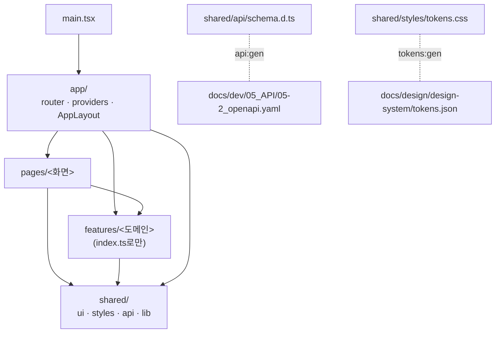
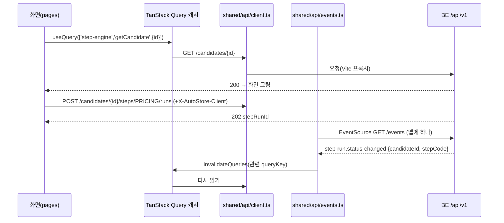

# 03-2. 폴더 구조 · 모듈 경계 · 데이터 흐름

| 항목 | 내용 |
|---|---|
| 버전 | 0.1 (2026-09-27) |
| 상태 | **Proposed** (D-11). 폴더·경로는 스캐폴딩 공통 명세 §3과 같다 |
| 근거 | [02-ADR-001](../../02_기술스택/02-ADR-001_기술스택.md) · [03-ADR-003](../../03_아키텍처/03-ADR-003_아키텍처.md) · [05-2 OpenAPI 태그](../../05_API/05-2_openapi.yaml) · [03-ADR-004](03-ADR-004_FE아키텍처.md) |
| 적용 | 실제 파일은 06 개발 환경 구축([06-3 FE 스캐폴딩](../../06_개발환경/06-3_FE스캐폴딩.md))에서 만들었고, §2 SSE 구독·§5 경계 규칙·§6 호출 규약은 [P1-02](../../../action/phase-1_기반/P1-02_FE공통부품.md)(2026-09-30)에서 코드로 옮겼다 |

## 1. 트리

```
apps/FE/
├─ index.html
├─ vite.config.ts            127.0.0.1:5173(strictPort) · /api → 127.0.0.1:3100 프록시 · 별칭 @/ → src/
├─ scripts/gen-tokens.mjs    tokens.json → src/shared/styles/tokens.css
└─ src/
   ├─ main.tsx               진입점. AppProviders + RouterProvider('react-router/dom')
   ├─ test/                  Vitest 준비(setup.ts)·renderRoute(같은 경로 표를 createMemoryRouter로)
   ├─ app/                   앱 조립(가장 위 레이어)
   │  ├─ router.tsx          createBrowserRouter(routes)
   │  ├─ routes.tsx          경로 표(RouteObject[]) — 05-3과 같다. 테스트도 이 표를 쓴다
   │  ├─ providers.tsx       QueryClientProvider + ProgressEventsProvider(SSE 연결 1개)
   │  ├─ RouteErrorBoundary.tsx  경로 없는 layout route의 오류 경계(내비는 남는다)
   │  ├─ AppLayout.tsx       왼쪽 내비(220px) + <main><Outlet/></main>
   │  └─ AppNav.tsx          왼쪽 내비(NavLink) + 아래 상태 상자(useCallUsageQuery)
   ├─ pages/<화면>/          화면 하나 = 폴더 하나. 라우트가 부르는 얇은 조립층
   │  └─ candidate/          후보 작업 틀: CandidateLayout · CandidateIndexRedirect · StepRail (후보 머리는 P1-04에서 features/step-engine으로 올렸다)
   ├─ features/<도메인>/     도메인 기능. 지금 있는 것: integrations(P1-02, getCallUsage) · settings(P1-03) · step-engine(P1-04, 후보 훅·후보 머리·단계 점)
   │  └─ <도메인>/
   │     ├─ index.ts         공개 API(배럴). 밖에서는 이것만 import
   │     ├─ api/             Query 훅(useXxxQuery·useXxxMutation)과 queryKey
   │     ├─ components/      이 도메인 전용 화면 부품
   │     └─ model/           타입 별칭·변환 함수(schema.d.ts에서 파생)
   └─ shared/                도메인을 모르는 공용
      ├─ ui/                 공통 부품(CSS Modules) — 목록은 04-3
      ├─ styles/             tokens.css(생성물) · global.css
      ├─ api/                schema.d.ts(생성물) · client.ts · queryClient.ts · errors.ts · queryKeys.ts · events.ts · idempotency.ts
      └─ lib/                steps.ts(단계 코드 ↔ 경로) · format.ts(숫자·시각) · appName.ts(앱 이름·탭 제목, D-28) · cx.ts · useControllableState.ts
```

## 2. 무엇을 어디 두나

| 두는 것 | 위치 | 한 줄 규칙 |
|---|---|---|
| 경로 표, 레이아웃, 공급자 | `src/app/` | 앱 전체에 한 번만 있는 것 |
| 왼쪽 내비와 내비 아래 상태 상자 | `src/app/AppNav.tsx` | 경로를 아는 부품이라 shared에 두지 않는다 |
| 후보 작업 틀(후보 머리·단계 레일) | `src/pages/candidate/` | 지금은 이 틀만 쓴다. 후보 머리를 목록 화면(SCR-12)도 쓰게 되면 `features/step-engine`으로 올린다 |
| 화면 한 장 | `src/pages/<화면>/` | 데이터 훅과 부품을 배치만 한다. 비즈니스 규칙을 쓰지 않는다 |
| 한 화면에서만 쓰는 부품 | 그 `pages/<화면>/` 안 | 두 화면 이상이 쓰면 features나 shared로 올린다 |
| 도메인 조회·변경 훅, 도메인 부품 | `src/features/<도메인>/` | 도메인 이름은 OpenAPI 태그 그대로(§3) |
| 도메인 없는 부품(Button, StatusChip…) | `src/shared/ui/` | 도메인 용어·API를 모른다. 토큰 변수만 쓴다 |
| 토큰 CSS | `src/shared/styles/tokens.css` | **생성물.** 손으로 고치지 않는다(`tokens:gen`) |
| API 타입 | `src/shared/api/schema.d.ts` | **생성물.** 05-2에서 `api:gen`으로 만든다 |
| API 호출기 | `src/shared/api/client.ts` | openapi-fetch 하나(`api`). 변경 요청에 `X-AutoStore-Client: 1`. 오류 봉투 타입 `ApiError`·`isApiError` |
| Query 기본값 | `src/shared/api/queryClient.ts` | retry 1, refetchOnWindowFocus false |
| SSE 구독 | `src/shared/api/events.ts`(P1-02 구현) | `connectProgressEvents(queryClient, { EventSourceImpl })`가 `EventSource('/api/v1/events')` **하나**를 앱 전체가 나눠 쓰게 한다(구독 수를 세어 마지막 구독이 풀리면 닫는다). `app/providers.tsx`의 `ProgressEventsProvider`가 마운트 때 붙고 언마운트 때 푼다. 이벤트 → queryKey 표 `EVENT_INVALIDATIONS`(지금은 `call-usage.changed → [['integrations','getCallUsage']]` 하나, 나머지 21개는 도메인 훅을 만드는 실행 문서가 더한다). 이벤트 이름 `ProgressEventName`(M1 22개)은 `schema.d.ts`의 `ProgressEventFrame`에서 파생. 오류 뒤 다시 열리면 `invalidateQueries({ refetchType: 'active' })`. 브라우저가 다시 붙기를 포기하면(CLOSED, 예: 개발 프록시 502) 1·2·5·10·30초 간격으로 새 연결을 연다(Proposed) |
| 오류 풀기 | `src/shared/api/errors.ts`(P1-02) | `request(() => api.GET(...))`가 2xx가 아니면 `ApiRequestError`(status·code·message·`envelope`)를 던진다. 봉투가 아닌 응답(프록시 502 HTML·빈 본문)은 `UNEXPECTED_RESPONSE`, 연결 실패는 `NETWORK_ERROR`(status 0) 봉투를 FE가 만든다(Proposed). Query의 기본 오류 타입도 `ApiRequestError`(`queryClient.ts`의 `Register`) |
| queryKey | `src/shared/api/queryKeys.ts`(P1-02) | `qk(tag, operationId, params?)`. 태그는 OpenAPI 태그 15개, operationId는 `schema.d.ts`의 연산 이름(틀리면 타입 오류) |
| 멱등 키 | `src/shared/api/idempotency.ts`(P1-02) | `newIdempotencyKey()` = `crypto.randomUUID()`. G4 승인 버튼을 누를 때 한 번 만든다(P4-03) |
| 단계 코드 ↔ 화면 경로 | `src/shared/lib/steps.ts` | ERD 단계 코드 10개 → 05-1 경로 |

## 3. features 목록 (OpenAPI 태그 1:1)

이름을 바꾸지 않는다. 폴더는 **그 도메인을 쓰는 첫 화면을 만들 때** 만든다(빈 폴더를 미리 만들지 않는다).

| feature | OpenAPI 태그 | 쓰는 화면 | M1 연산 수 |
|---|---|---|--:|
| `step-engine` | step-engine | 후보 작업 틀·목록, 대시보드, 모든 단계 화면 | 23 |
| `keywords` | keywords | SCR-02 | 9 |
| `sourcing` | sourcing | SCR-03 | 10 |
| `pricing` | pricing | SCR-04, SCR-10(환율) | 7 |
| `category` | category | SCR-04 | 2 |
| `thumbnails` | thumbnails | SCR-05 | 6 |
| `content` | content | SCR-06, SCR-08 | 5 |
| `tags` | tags | SCR-07 | 4 |
| `registration` | registration | SCR-08, 내비 상태 상자(차단 스위치) | 9 |
| `settings` | settings | SCR-10, SCR-13 | 10 |
| `system` | system | SCR-11, SCR-13(감지·연결 테스트) | 6 |
| `integrations` | integrations | SCR-11, 내비 상태 상자(오늘 페이지 조회) | 7 |
| `products` | products | SCR-09(M2) | 0 |
| `dashboard` | dashboard | SCR-01(M2 집계) | 0 |
| — | common | SSE·이미지 파일은 도메인이 없어 `shared/api`에 둔다 | 3 |

## 4. 의존 방향



- 화살표 반대 방향 import는 금지다. `shared`는 아무 레이어도 모른다.
- feature끼리는 서로의 `index.ts`만 부른다. 순환이 생기면 공통 부분을 `shared`로 내린다.
- 03-ADR-003의 BE 규칙("단계 모듈끼리 직접 호출 금지")과 같은 뜻이다. 단계 화면끼리도 서로 import하지 않는다.

## 5. 모듈 경계 ESLint 규칙 (적용됨)

> **적용됨(P1-02, 2026-09-30).** 아래 초안 그대로 `apps/FE/eslint.config.js`의 `boundaries`로 넣었다(`prettier` 앞). 새 플러그인 없이 ESLint 9 기본 규칙 `no-restricted-imports`만 쓴다. 검증: `src/app/eslint-boundaries.test.ts`가 ESLint Node API(`lintText`)로 shared → features, pages → 다른 pages, feature 내부 파일 import가 오류이고 `@/features/x`(index)는 허용됨을 확인한다.

```js
// eslint.config.js 에 덧붙일 초안 — defineConfig([...]) 배열 안, prettier 앞에 ...boundaries 로 넣는다
const layer = (files, patterns) => ({
  files,
  rules: { 'no-restricted-imports': ['error', { patterns }] },
});

export const boundaries = [
  // shared는 도메인·화면을 모른다 — 위 레이어를 부르면 재사용이 깨진다
  layer(['src/shared/**/*.{ts,tsx}'], [
    { group: ['@/app', '@/app/*', '@/pages', '@/pages/*', '@/features', '@/features/*'],
      message: 'shared는 app·pages·features를 import하지 않습니다.' },
  ]),
  // features는 화면·라우터를 모른다 — 도메인 로직이 한 화면에 묶이지 않게
  layer(['src/features/**/*.{ts,tsx}'], [
    { group: ['@/app', '@/app/*', '@/pages', '@/pages/*'],
      message: 'features는 app·pages를 import하지 않습니다.' },
    // 다른 feature 내부 파일 직접 import 금지 — 공개 API(index.ts)로만
    { group: ['@/features/*/*'],
      message: '다른 feature는 @/features/<이름>(index.ts)으로만 import합니다.' },
  ]),
  // pages는 라우터가 부른다 — 화면끼리 엮이면 lazy 분할이 깨진다
  layer(['src/pages/**/*.{ts,tsx}'], [
    { group: ['@/app', '@/app/*'], message: 'pages는 app을 import하지 않습니다.' },
    { group: ['@/pages/*'], message: '다른 화면을 import하지 않습니다. 공통은 features·shared로 올립니다.' },
    { group: ['@/features/*/*'], message: 'feature 내부 파일 직접 import 금지(index.ts로만).' },
  ]),
];
```

- 같은 폴더 안은 상대 경로(`./`, `../`)로 부른다. 폴더 밖은 `@/` 별칭으로 부른다.
- 한계: `../../features/x/api`처럼 상대 경로로 레이어를 넘는 import는 이 규칙으로 못 잡는다. 필요해지면 06에서 `eslint-plugin-boundaries` 도입을 따로 정한다(지금은 의존성 추가 없음).

## 6. 데이터 흐름 규약

### 6.1 서버 상태 · 클라이언트 상태

| 질문 | 서버 상태 | 클라이언트 상태 |
|---|---|---|
| 원본이 BE(DB·설정 파일)에 있나? | 예 | 아니오 |
| 새로고침 뒤에도 남아야 하나? | 예 | 대개 아니오(URL에 두면 남는다) |
| 예 | 후보·단계 상태, 비교표, 판정, 설정, AI 엔진 감지 결과 | 고른 탭, 펼침/접힘, 폼 입력 중인 값, 고른 후보 체크박스 |
| 담당 | **TanStack Query**(openapi-fetch로 호출) | **React state**. 공유·북마크가 필요하면 **URL search params** |
| 금지 | 서버 값을 복사해 전역 스토어에 두기 | 서버에서 온 값을 로컬에서 고쳐 원본처럼 쓰기 |

- 전역 클라이언트 스토어(Zustand 등)는 **두지 않는다**(Proposed). 지금 필요한 전역 상태가 없다. 필요해지면 React context부터 쓴다.
- 폼은 저장 전까지 클라이언트 상태다. 저장은 mutation 하나로 보내고, 성공하면 관련 쿼리를 무효화한다.

### 6.2 호출 규약

| 항목 | 규약 |
|---|---|
| 호출기 | `shared/api/client.ts`의 openapi-fetch `createClient<paths>({ baseUrl: '/api/v1' })` 하나만 쓴다. `fetch` 직접 호출 금지(SSE·이미지 파일 제외) |
| 보안 헤더 | POST·PUT·PATCH·DELETE에 미들웨어가 `X-AutoStore-Client: 1`을 붙인다(05-1 §1.2). 화면 코드는 신경 쓰지 않는다. 05-2가 이 헤더를 연산마다 **필수 header 파라미터**로 적어 두어, client.ts는 생성 타입 `paths`에서 이 헤더만 선택 사항으로 바꾼 `ApiPaths`로 클라이언트를 만든다. ⚠️ 확인 필요: 명세 쪽에서 헤더를 `components.securitySchemes`의 `apiKey`(in: header)로 옮기면 이 타입 변환이 필요 없다(05 API 담당 판단) |
| 오류 | 오류 봉투 `{ code, message, status, timestamp, path, fieldErrors, details }`(05-3) 타입을 client.ts에서 낸다. 화면은 `code`로 분기하고 `message`를 그대로 보여 준다 |
| queryKey | `[태그, operationId, 파라미터]`. 예: `['step-engine', 'getCandidate', { candidateId: 12 }]`. 태그 단위·연산 단위로 무효화할 수 있다 |
| 훅 위치 | `features/<태그>/api/`. 화면은 훅만 부른다 |
| 202 작업 | 단계 실행 등은 202 + 실행 기록 id를 받는다(05-1 §1.3). 결과는 SSE 알림 → 조회 API 재조회로 받는다. 폴링하지 않는다 |
| 멱등 키 | G4 승인 `createCandidateRegistration`은 `Idempotency-Key`를 보낸다(05-1 §1.7). 키는 승인 버튼을 누를 때 한 번 만든다 |

### 6.3 SSE 흐름



- 이벤트 이름 → 무효화할 queryKey 표는 `shared/api/events.ts`의 `EVENT_INVALIDATIONS`다(P1-02). 이벤트는 무효화만 한다(캐시에 값을 쓰지 않는다). 표에 없는 이벤트·모르는 이벤트·읽을 수 없는 data는 무시한다.
- 재연결 뒤 놓친 이벤트는 다시 오지 않는다(05-2 `streamProgressEvents` x-decision). 재연결하면 활성 쿼리를 모두 다시 읽는다(`invalidateQueries({ refetchType: 'active' })`). 처음 열릴 때는 다시 읽지 않는다.
- 화면마다 `EventSource`를 새로 열지 않는다. 후보별 필터(`/events?candidateId=`)는 쓰지 않고 전역 연결 하나에서 queryKey 파라미터로 거른다(Proposed, P1-02).
