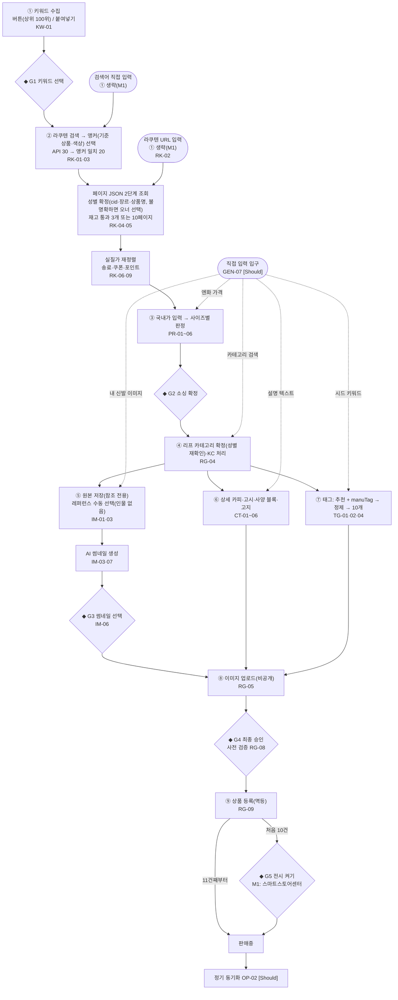
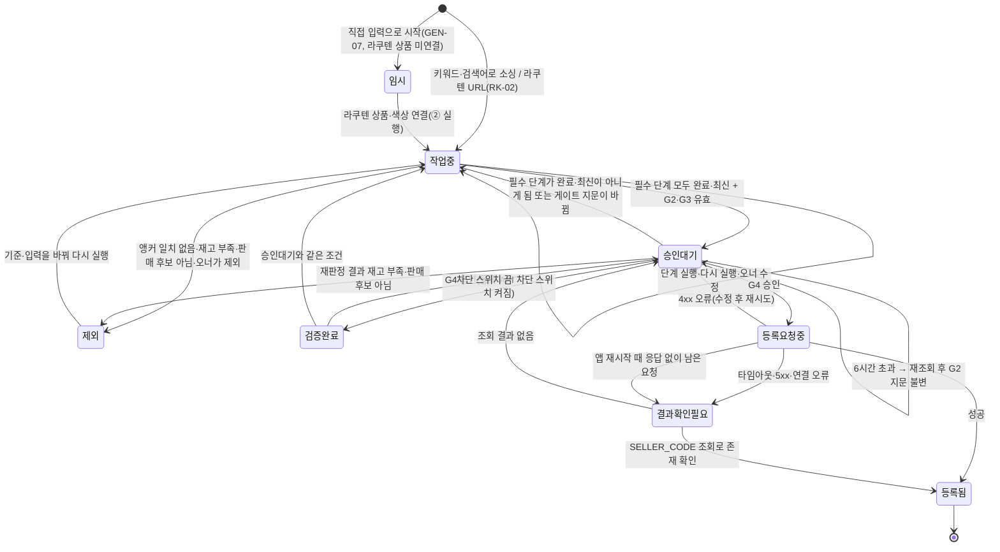
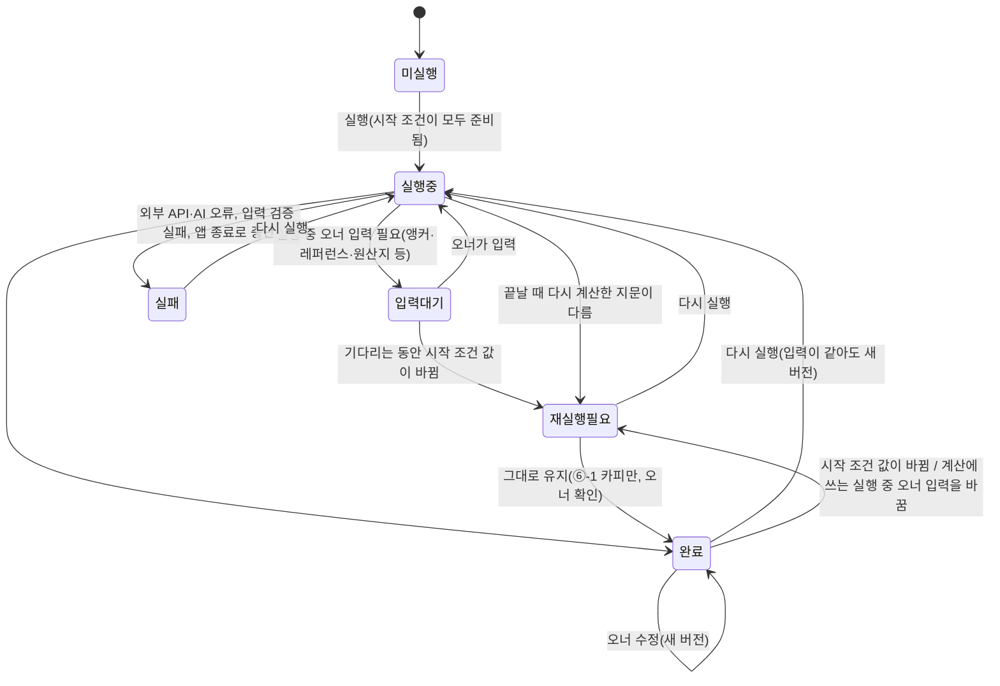

# PRD 초안 — 신발 해외구매대행 스마트스토어 자동등록 로컬 웹앱 (가칭 autoStore)

| 항목 | 내용 |
|---|---|
| 버전 | 0.4.6 (0.2 검토 반영 + 단계별 실행 추가 요청 + 오너 결정 D-07 + 동료 셀러 배포·사전 조건 + D-11 추천 채택 + 기능 리스트 반영 + D-16 AI 엔진 선택 + M0 S6·S7 결과와 오너 결정 D-17~D-20 + M0 S1 결과 + S1 결정 D-21) |
| 작성일 / 개정일 | 2026-09-24 / 2026-10-03 |
| 상태 | **추천안으로 확정(D-11)**. 오너가 [§16 오너 결정 시트](#16-오너-결정-시트)의 추천을 모두 채택했다. 다음 산출물은 기능 리스트 → 디자인이고(D-12), 오너는 완성본을 보며 고칠 곳을 짚는다 |
| 사전 준비 | 오너는 §0의 1~4번(사업자·전자상거래업자부호·해외상품판매 권한·주소록)을 이미 갖췄다(D-10). 남은 일은 커머스API 앱 등록이다(라쿠텐 앱은 있는지 확인) → [§0](#0-오너-준비-사항) |
| 소유자 | 오너(1인 셀러). 지인·동료 셀러에게 무료로 나눠 각자 자기 PC에 설치해 쓴다(D-08·D-09) |
| 독자 | 오너, 그리고 이 문서로 구현할 AI 코딩 에이전트(Claude Code, Codex, Antigravity CLI) |
| 사실 기준일 | 외부 API·법·정책 사실은 모두 2026-09-24 기준이다. 바뀔 수 있는 값은 설정값으로 둔다(NFR-04, OP-06) |
| 관련 문서 | [03-1 요구사항추출](03-1_요구사항추출.md) · [03-2 유저스토리](03-2_유저스토리.md) · [03-3 MoSCoW](03-3_moscow.md) · [04 기능 리스트](04_기능리스트.md) · [검증 체크리스트](_검증체크리스트.md) · [원천자료](원천자료/) · [리서치 R01~R07](리서치/) |

> 요구사항 ID(GEN·KW·PR·RK·IM·CT·TG·RG·OP·AI·NFR·CON)의 정의와 출처는 03-1에 있다. 이 문서는 그 요구사항을 제품 관점으로 묶고, 구현에 필요한 규칙·기본값·결정을 정리한다. 분류 표기: **[Must]** = M1(MVP), **[Should]** = M2, **[Could]** = M3.

---

## 0. 오너 준비 사항

오너는 해외구매대행을 이미 수동으로 하고 있어 1~4번을 갖췄다(D-10, [원천자료 04](원천자료/04_배포와사전조건_2026-09-27.md)). 개발 전에 남은 일은 5번이다(D-10). 수동 판매에는 필요 없던 API 등록이다. 6번(라쿠텐 Developers 앱)은 D-10 질문에 없던 항목으로, M0 S2에 라쿠텐 앱 키가 필요해 AI가 더했다. 이미 등록했으면 알려 주면 된다.

- 동료 셀러에게는 1~6번이 모두 필요하다. 설치 안내와 첫 실행 점검(GEN-05·GEN-09)에서 확인한다. 전자상거래업자부호는 2026-10-12까지 해외상품판매 권한에 입력해야 하고, 기존 해외판매 셀러도 대상이다(R04 검증 M1).
- (참고) 오너도 부호를 해외상품판매 권한 화면에 입력까지 했는지 한 번만 확인하면 된다(스마트스토어센터 › 판매자정보 › 상품판매권한).

| 순서 | 할 일 | 어디서 | 완료 | 막히면 |
|---|---|---|---|---|
| 1 | 사업자등록(해외직구대행업 525105 포함 여부)과 통신판매업 신고 상태를 확인한다. 부호 등록 요건인지는 관세청 고시 2026-51과 네이버 공지 cac/32908로 확인한다 | 홈택스, 정부24 | ☑ 오너 완료(D-10) | 세무사 |
| 2 | **전자상거래업자로 등록하고 부호를 발급받는다**(관세법 제254조, 「전자상거래물품의 특별통관에 관한 고시」 2026-51) | 관세청 전자상거래업자 등록 시스템(통관 플랫폼) | ☑ 오너 완료(D-10) | 관세청 고객지원센터 125 |
| 3 | 스마트스토어 **해외상품판매 권한**에 부호를 입력하고 신청한다(P-02) | 스마트스토어센터 › 판매자정보 › 상품판매권한 신청 | ☑ 오너 완료(D-10) | 스마트스토어 고객센터 |
| 4 | 해외 출고지(배대지)와 국내 반품·교환지 주소록을 등록한다(P-03). 권한이 있어야 할 수 있다 | 스마트스토어센터 › 주소록 | ☑ 오너 완료(D-10) | 〃 |
| 5 | 커머스API '내 스토어 애플리케이션'을 등록하고 API 호출 IP를 등록한다(P-04) | 커머스API센터 | ☐ 남음 | 커머스API GitHub Discussions |
| 6 | Rakuten Developers 앱을 등록한다(`applicationId`·`accessKey`, 앱 유형은 ①-7)(P-05) | Rakuten Developers | ☐ 있는지 확인 | 라쿠텐 문의 |

**이번 주에 시작할 외부 문의** (답이 늦게 온다)
- 라쿠텐에 API 이용 목적 문의: 규약 제10조 (4)(7)(10), 제8조 링크 조항 → [§16 ①-2](#16-오너-결정-시트)
- 네이버 고객센터에 AI 표시 라벨과 대표이미지 텍스트 기준이 충돌하는지, 타 판매자 사진을 AI 레퍼런스로만 쓰는 것이 'AI 무단 변형'에 해당하는지 문의 → ①-3, ②-15
- 전문가 확인 E-1~E-10 → §16. E-10은 동료 셀러 배포의 법·약관 확인이다(①-9)

> M0 스파이크의 실제 등록 테스트(S3)는 5번을 마쳐야 할 수 있다. 끝나지 않았으면 S3는 드라이런 JSON까지만 한다. 라쿠텐 스파이크(S2)는 6번이 필요하다.

---

## 1. 배경

- 오너는 일본 라쿠텐(楽天市場)의 신발을 네이버 스마트스토어에서 해외구매대행으로 파는 1인 셀러다.
- 오너가 정의한 절차는 여덟 단계다(원천자료 01).
  1. 데이터랩에서 수요 키워드를 찾는다.
  2. 셀러라이프로 부가세·배송비·환율을 따져 국내가보다 싼지 판단한다.
  3. 라쿠텐에서 최저가 상품을 고른다.
  4. 이미지를 내려받는다.
  5. AI로 썸네일을 만든다.
  6. AI로 상세 문구와 원산지·소재·굽높이를 정리한다.
  7. 경쟁 상품 태그(manuTag)를 넣는다.
  8. 오너 승인 후 등록한다.
- 오너는 이 단계들을 한 번에 돌리기보다 **필요한 단계만 따로 실행하거나 다시 실행**하기를 원한다. 키워드 수집 없이 라쿠텐 URL이나 가격 같은 값을 직접 넣어 중간 단계부터 시작할 수도 있어야 한다(원천자료 03, D-05·D-06).
- 오너가 먼저 쓰고, 지인·동료 셀러에게도 무료로 나눠 줄 계획이다. 동료 셀러는 각자 자기 PC에 설치해 자기 스토어·키·AI 구독으로 쓴다(원천자료 04, D-08·D-09).
- 이 과정은 데이터랩, 셀러라이프, 라쿠텐, 스마트스토어센터 네 곳을 오가며 계산·번역·이미지 작업을 반복해야 한다. 오너는 이것을 **자기 컴퓨터에서만 도는 로컬 웹앱**으로 자동화하고, AI 작업은 이미 쓰는 **로컬 AI CLI**(Claude Code, Antigravity CLI, Codex)로 처리하려 한다.

## 2. 목표·비목표·성공 지표

### 2.1 목표

| # | 목표 | 관련 |
|---|---|---|
| G1 | 오너가 고른 키워드 하나에서 '등록 승인 대기'까지 한 흐름으로 이어진다. 원하는 단계만 따로 실행하거나 다시 실행할 수도 있다 | GEN-02, GEN-03, GEN-07 |
| G2 | '국내보다 싸고, 선택 색상의 목표 사이즈 재고가 있는 라쿠텐 신발'만, 어느 사이즈에서도 역마진 없이 등록된다 | PR-01~06, RK-03~06, RG-08 |
| G3 | 썸네일, 상세 카피, 고시정보, 태그 초안은 AI와 API가 만들고, 오너는 검토하고 승인한다 | IM, CT, TG, RG-08 |
| G4 | 네이버·라쿠텐 약관과 법 규정을 어겨 판매중지나 계정 제재를 받지 않는다 | CON-01~15, CT-04, IM-07, RG-04, RG-12 |
| G5 | 동료 셀러가 설치 안내만 보고 자기 PC에 설치·설정해 쓸 수 있다. 오너의 키·데이터는 섞이지 않는다(M2 이후, ②-18) | GEN-01, GEN-05, GEN-09 |

### 2.2 비목표

- 주문 처리: 주문 수집, 라쿠텐 구매, 배대지 신청, 송장, 통관 연동(OP-07)
- 서버형 서비스(SaaS), 한 설치본에서 여러 사용자·여러 스토어, 유료 판매(CON-10, D-08·D-09). 동료 셀러가 각자 설치해 쓰는 것은 범위 안이다(GEN-09)
- 광고 집행, 자동 가격 경쟁(리프라이싱)
- 신발 외 카테고리, 라쿠텐 외 소싱처

### 2.3 성공 지표 (제안 — 오너 확인 필요)

| 지표 | 목표 | 측정 방법 | 적용 단계 |
|---|---|---|---|
| 후보 1건당 오너 작업 시간(후보를 만든 때부터 승인까지) | M1은 추정만(12~20분, §6.1), M2 이후 10분 이하 | UserActionLog(NFR-03 [Should]): 그 후보의 단계 화면(SCR-03~08, SCR-12)에 머문 시간의 합. 키워드 화면(SCR-02) 시간은 하루 단위로 따로 재고 그날 만든 후보 수로 나눠 더한다. N분 넘게 창이 비활성이면 뺀다 | M2부터 측정 |
| 처리 건수 | M1: 실제 상품 5건 끝까지 통과 / M2: 하루 10건 / 이후: 하루 50건 | '승인 대기'에 처음 도달한 후보 수(후보당 1회만 센다) | 단계별 |
| 로컬 검증을 통과한 뒤의 등록 API 실패율 | 5% 이하 | 등록 로그 | M1 |
| 역마진 상태로 등록된 상품 | 0건 | M1: 등록 기록에 저장한 판정 스냅샷과 모드 B 게이트 결과(PR-06·RG-08) / M2: 재계산(PR-10) | M1 |
| 품절 상태로 등록된 상품 | 0건 | M1: 판정 유효 시간(6시간) 검사와 재조회 기록(RG-08) / M2: 자동 재확인(OP-01)과 동기화 결과(OP-02) | M1 근사, M2 측정 |
| 플랫폼 제재·권리침해로 판매중지된 상품 | 0건 | 스마트스토어 알림 | M1 |
| 썸네일 1차 채택률(재생성 없이 채택) | 50% 이상(M0 뒤 조정) | GenerationRun 로그 | M1 |

---

## 3. 리서치로 바뀐 전제 ⚠️

오너 요청을 그대로 구현할 수 없는 부분이다. 2026-09-24 기준으로 확인한 사실과 이 PRD가 택한 방향을 정리했다. #1~#11과 #15는 오너 요청과 부딪히는 제약이고, #12~#14는 요청 밖에서 새로 생긴 제약이다. 근거는 [리서치 R01~R07](리서치/)의 본문과 각 보고서 끝 '검증 결과'에 있다.

| # | 오너 요청 | 실제 사정 | PRD 반영(단계) | 근거 |
|---|---|---|---|---|
| 1 | 국내판매가격과 비교 | **네이버 쇼핑 검색 API가 2026-07-31에 종료**됐고 대체 API가 없다. 네이버쇼핑 페이지 수집은 robots·약관이 금지하고, 비브라우저 요청에는 HTTP 418을 돌려준다 | 국내가는 오너가 수동 입력한다. 앱은 네이버쇼핑 링크를 주고 근거를 저장한다 [Must]. 셀라파인더 엑셀 가져오기는 샘플을 확보한 뒤 붙인다 | PR-05 · R01 §2.1, 검증 F01 |
| 2 | "sellerlife 를 통해서 부가세, 배송비, 환율 따져서" | 셀러라이프는 현재 **셀록홈즈**다. **일본 구매대행용 관부가세·환율 계산기와 공개 API가 없다.** 쿠팡 그로스 계산기와 1688 견적만 있다 | **자체 마진 계산 엔진**을 둔다 [Must]. 셀러라이프는 국내가, manu태그, 배대지 쿠폰을 조회하는 도구로 쓴다 | PR-01 · R02 §2.1, 검증 F02 |
| 3 | 데이터랩 1개월 수집 | 인기검색어 **순위를 주는 공식 API가 없다**. 웹 내부 엔드포인트만 있는데, 그 경로는 robots `Disallow: /`다. '패션잡화 > 신발' 노드가 하나로 있지 않고 여성신발·남성신발로 나뉜다 | 버튼 수집(오너가 누를 때 1회, 상위 100위)과 붙여넣기를 둔다 [Must]. 잔여 리스크: robots가 막은 경로에 자동 요청, 네이버 수집 정책의 법적 조치 경고, 약관의 역설계 금지. 수집 방식은 오너가 정한다(①-5) | KW-01 · R01 §2.3, §2.5, 검증 누락 1·2 |
| 4 | "쿠폰까지" | 라쿠텐 API에 쿠폰 정보가 없다. 비공개 API로만 보이고, 사람마다 다른 쿠폰이다 | 쿠폰 금액 1칸 [Must], 쿠폰 상세 입력 [Should] | RK-06, RK-07 · R03 §2.3 |
| 5 | "20개까지 가격비교 … 재고는 있어야함" | API `availability`는 상품 단위라 **사이즈별 재고를 알 수 없다**. 사이즈 재고는 상품 페이지에만 있고, 페이지 조회에는 약관·차단 리스크가 있다 | 가격 비교는 API 20개로 한다. 사이즈 재고 확인은 가격순으로 차례로 조회해 **재고 통과 3개 또는 최대 10페이지**까지만 한다 [Must]. 나머지는 '미검증'으로 두고, 오너가 누르면 조회한다 | RK-04, RK-05 · R03 §2.4, §2.5 |
| 6 | 라쿠텐 API 사용 | Rakuten Web Service 규약이 금지하는 행위와 충돌할 소지가 있다: 제10조 (4) 어필리에이트 외 수익화, (7) 목적 외 사용·개변, (10) **특정인만 접근하는 환경에서의 사용**, 제8조 라쿠텐 외 링크 | 오너가 결정한다(①-2). 라쿠텐 URL 소싱(수동 URL)은 [Must]다(②-16 결정 D-07). API를 쓰지 않기로 해도 이 경로로 소싱을 이어 갈 수 있다 | RK-02, CON-14 · R03 §2.9, R07 검증 F13 |
| 7 | "이미지를 다운로드" | 판매자 사진은 저작권 대상일 수 있다(특히 연출 컷). 네이버 AI 생성물 기준(2026-07-10, **2차 보도 기준, 공지 원문 미확인**)은 '저작권 이미지의 AI 무단 변형'을 금지한다 | 원본은 **'참조 전용'**(게재 금지) [제약]. **사람이 없는 신발 단독 제품 컷만** 레퍼런스로 쓴다 [Must]. 그래도 AI 레퍼런스로 쓰는 것 자체의 잔여 리스크는 남는다(①-3) | CON-07, IM-03 · R07 §2.3 C1·C5, 검증 F03 |
| 8 | "한국남자 아이돌이 신발들고있는 사진" | 실존 아이돌을 닮은 AI 인물은 부정경쟁방지법 (타)목(퍼블리시티)과 네이버 AI 기준(실존 인물 모방 금지)에 걸릴 수 있다. 공정위 지침(2026-06-01)은 추천·보증 광고 속 AI 가상인물에 표시를 요구하지만, 신발을 들고만 있는 썸네일에 적용되는지는 불명확하다 | **'특정 실존 인물과 닮지 않은 가상의 아이돌 스타일 모델'** + 실존 인물명 차단 [Must]. 표시 라벨은 보수적으로 붙인다 [Should] (②-15) | IM-03, IM-07, IM-08 · R07 §2.4 |
| 9 | "manutag를 찾아서 삽입" | 경쟁 상품 태그를 주는 **공식 API가 없다**. 셀러라이프 셀라파인더가 '네이버 manu태그(상위 비광고 상품 태그 30개)'를 보여 준다 | 추천 태그 자동 조회 [Must] + 셀라파인더·브라우저 결과 붙여넣기 [Must] → `restricted-tags` 검증 → 10개 이하 | TG-01, TG-02, TG-04 · R02 §2.1 #7, R05 |
| 10 | "내 승인하에 등록" | 커머스API는 등록할 때 **판매대기(WAIT)를 지정할 수 없다**. 전시중지(SUSPENSION)로는 등록할 수 있다 | 로컬 승인 게이트 [Must]. 기본은 **처음 10건 전시중지 → 스마트스토어센터에서 확인 후 켜기, 그다음부터 즉시 전시**다 | RG-08, RG-09 · R04 §2.8 |
| 11 | "codex나 antigravity cli, claude code를 이용해서" | `claude -p --json-schema`는 동작한다(Max 구독). `agy -p`도 동작하고 이미지 생성 도구가 내장돼 있지만 문서가 없다. **Gemini CLI는 개인 로그인으로 쓸 수 없다.** **Codex는 미설치**이고, Claude는 이미지를 만들지 못한다 | 사용자가 고른 AI 엔진(claude·agy·codex, 기본 claude)의 텍스트·비전 호출 + 이미지 경로 1개(agy `generate_image`, D-19. M0 S1 실측 완료, 2026-10-02) [Must](AI-10, D-16). codex는 M0 S7에서 설치·실측한다. API 키 공급자·작업별 우선순위 [Should] | AI-01, AI-09, AI-10, IM-09 · R06, 원천자료 08 |
| 12 | (요청 외) 해외 판매 권한 | **2026-10-12부터 전자상거래업자부호가 없으면 해외상품판매 권한이 회수된다** | 오너는 갖췄다(D-10). 동료 셀러는 설치 안내·첫 실행 점검(GEN-05·GEN-09)으로 확인한다. [§0](#0-오너-준비-사항), P-02 | R04 검증 M1 |
| 13 | (요청 외) 등록 한도 | 2026-06-02부터 저실적 스토어는 등록 한도가 1,000개이고 '판매상품비중 3%' 기준이 생겼다 | 대시보드 경고 [Should]. 하루 50건이면 약 20일이면 1,000개에 닿는다 | OP-03 · R04 §2.9, 검증 M5 |
| 14 | (요청 외) 관부가세 포함 판매(D-03) | 관부가세를 판매가에 넣어 받으면 관세법 제19조⑤에 따라 **구매대행업자로서 연대납세의무**를 질 수 있다. 과세 상품의 실제 납부 흐름은 주문 처리(범위 밖)에 속한다 | D-11로 ①-1 추천을 채택했다: M1은 면세 구간만 판다. D-03(판매가 포함 판매)은 관세사 확인(E-2) 뒤 설정으로 켠다 | PR-04 · R02 검증 F13, 누락 2 |
| 15 | "다른사람도 쓰게할거야"(원천04 Q14) | 리서치는 1인 전용을 전제로 했다(CON-10). 앱을 다른 셀러에게 제공하면 오너가 AI 기본법상 인공지능이용사업자가 되어 제31조 의무(생성형 AI 사용 사전 고지, 결과물 표시)를 질 수 있다(R07 P5, 검증 F06). claude 약관은 제3자 제품이 claude.ai 로그인·구독 한도를 쓰게 하는 것을 허용하지 않고(사전 승인 제외), agy는 제3자 도구로 접근하는 것을 약관 위반으로 본다(R06 §2.2). M0 S6 약관(2026-10-01)에서 더 찾았다: Anthropic 법무 페이지는 사용자 대신 구독 자격으로 요청을 보내는 것과 로그인 정보를 모으거나 중개하는 것을 금지하고, 제품 안에서 Claude Code를 돌리려면 상업 약관 동의가 필요하다고 적었다. agy 약관은 'Google이 제공하지 않은 제품과 함께 쓰는 것'도 남용의 예로 들고, 제재는 Google 계정 삭제까지 갈 수 있다. 처음에는 위험을 '상'으로 봤다. 오너 결정 D-18(2026-10-02)로 다시 봤다: '제3자 소프트웨어로 접근' 금지는 다른 프로그램이 Antigravity 로그인(OAuth)을 빌려 쓰는 경우(예: OpenClaw)라, 사용자 PC에서 수정하지 않은 공식 agy를 본인 로그인으로 플랜 한도 안에서 부르는 이 앱에는 해당하지 않는다. 남는 불확실성은 넓은 '제공하지 않은 제품' 문장뿐이라 오너 본인 사용은 위험 '중'이다. 배포(남이 약관을 어기도록 부추기는 서비스 금지)는 E-10 확인 전이다([원천자료 09](원천자료/09_M0결정_2026-10-02.md)). 커머스API 내 스토어 앱은 스토어 1개와 묶이고, 라쿠텐 앱 키도 사용자별로 받아야 한다 | 각자 자기 PC에 설치(D-08), 무료(D-09). 설치본당 1명·스토어 1개, 사용자마다 자기 키·계정, 오너 값과 데이터 분리, 안전장치 끌 수 없음, 데이터 외부 전송 없음(GEN-01 [Must]). 배포 패키지·설치 안내·첫 실행 고지(GEN-09 [Should]). AI 약관·AI 기본법은 오너가 정한다(①-9, E-10) | GEN-01, GEN-09, CON-10 · R07 P3~P5, R06 §2.2, R04 R04-C-01, 원천09 D-18 |

> **단계 순서 조정**: 원천자료에서는 '셀러라이프 판정'이 '라쿠텐 선정'보다 앞이다. 하지만 마진을 판정하려면 라쿠텐 원가가 있어야 해서, 라쿠텐 후보 비교 → 국내가 입력·판정 → 소싱 확정 순서로 둔다.

---

## 4. 사용자와 사용 환경

- **사용자**: 설치본 하나에 사용자 1명·스마트스토어 1개다. 오너가 먼저 쓰고, 동료 셀러는 각자 자기 PC에 설치해 쓴다(D-08, 03-2 페르소나). 로그인·권한 관리가 없다.
- **'오너'의 두 뜻**: 앱 동작을 설명하는 '오너'(오너 입력·확인·수정·승인, 오너 게이트, 오너 본인 명의 등)는 그 설치본의 사용자다. 동료 셀러의 설치본에서는 동료 셀러다. 원천자료·D-nn·PRD §0·§16의 '오너'는 이 문서를 요청한 오너(배포자)다. 화면 문구에는 '오너' 대신 '직접 입력', '내 입력으로 유지'처럼 쓴다.
- **실행 환경** (오너 PC, 2026-09-24 실측, R06 §2.1. 동료 셀러의 OS는 §16 ②-17)

| 항목 | 상태 | PRD 영향 |
|---|---|---|
| OS·HW | macOS, Apple M4 Pro, RAM 24GB | 로컬 이미지 후처리 가능. 비밀정보는 macOS 키체인(NFR-02) |
| Node | v24.11.1 | — |
| Python | 3.9.6(시스템) | rembg 등은 3.11 이상이 필요해 별도 가상환경을 쓴다 |
| 이미지 도구 | ffmpeg 있음, ImageMagick 없음 | 이미지 처리는 라이브러리(예: sharp)로 한다 |
| `claude` | 2.1.269, Max 구독 로그인 | AI-10 선택 엔진(기본값) |
| `agy` | 1.2.9, **스스로 자동 업데이트** | AI-10 선택 엔진, 이미지 생성 후보. 쓰는 경우 켤 때마다 계약 테스트(AI-07) |
| `gemini` | 0.42.0, 개인 로그인 불가 | 사용 안 함(CON-12) |
| `codex` | 미설치(2026-09-27 재확인) | AI-10 선택 엔진, 미설치 → M0 S7에서 설치·실측 |
| 네트워크 | 가정용 회선(고정 IP 여부 미확인) | 커머스API IP 화이트리스트(최대 3개)와 라쿠텐 앱 IP 등록(2차 자료 기준, M0 확인)에 영향 |

---

## 5. 전체 흐름



- 실선은 연속 실행의 기본 순서다. **모든 단계는 따로 실행하거나 다시 실행할 수 있다**(GEN-02, §5.3). ⑤·⑥·⑦은 서로의 결과를 읽지 않아서, 단계 실행으로는 어떤 순서로 실행해도 된다.
- 점선은 직접 입력 입구(GEN-07 [Should], M2)다. 검색어 직접 입력(RK-01)과 라쿠텐 URL 입력(RK-02)은 M1부터 된다(RK-02는 §16 ②-16 결정 D-07).

### 5.1 오너 게이트

| 게이트 | 오너가 하는 일 | 통과 조건 |
|---|---|---|
| G1 | 수집된 키워드 중 소싱할 것을 고르고 라쿠텐 검색어를 확인한다 | 키워드 1개 이상 |
| G2 | 앵커를 고른다 → (필요하면 성별을 고른다) → 비교표에서 검증된 후보 1개를 고른다 → 국내 기준가를 넣는다 → 판정을 확인한다 | '판매 후보' 판정(모드 B 게이트를 통과한 판매 가능 사이즈가 최소 기준 이상), 판매 제외 브랜드 아님(RK-13 도입 시). 라쿠텐 URL로 만든 후보는 비교를 했거나, 오너가 '비교 없이 확정'을 체크했다 |
| G3 | 썸네일 후보 중 하나를 고른다 | 체크리스트 통과: 신발 비중, 디테일, **레퍼런스·생성본의 색상이 후보의 선택 색상과 같음**, 레퍼런스에 인물 없음, 실존 인물 연상 없음, 이미지 속 문구 없음. 레퍼런스가 이 후보의 라쿠텐 상품 이미지가 아니면 '같은 상품·색상' 확인 |
| G4 | 상품 전체를 미리 보고 승인한다 | 로컬 사전 검증 전부 통과(§8.7). 판정에 쓴 라쿠텐 페이지를 받은 뒤 6시간 이내 |
| G5 | (전시중지로 등록된 처음 10건) 스마트스토어에서 보이는 모습을 확인하고 전시를 켠다 | M1은 스마트스토어센터에서, M2는 앱에서(RG-10) |

**단계 실행과 게이트** (GEN-02·03)
- G1은 키워드에서 시작할 때만 거친다. 검색어나 라쿠텐 URL로 시작하면 건너뛴다.
- 단계 실행으로는 G2·G3 뒤의 단계를 게이트보다 먼저 실행할 수 있다. 예를 들어 판정 전에 카피를 만들 수 있다. 연속 실행은 G2 앞에서 멈춘다(§5.3).
  - 판정(G2) 전에 AI 단계(⑤·⑥-1·⑥-2)를 실행하면 '판매 후보가 아니면 AI 비용이 낭비된다'는 경고를 띄운다. 막지는 않는다.
  - 승인대기로 들어가려면 G2·G3을 통과해야 한다.
- G4는 어느 경로로 왔든 건너뛸 수 없다. 게이트 통과와 오너 확인은 웹 화면에서만 기록한다(CLI 불가).
- **게이트 지문**: 게이트를 통과할 때, 그 게이트가 확인한 내용의 요약값(지문)을 함께 저장한다. 나중에 그 내용이 바뀌면 지문이 달라지고, 그 게이트를 다시 통과해야 한다. 단계의 '입력 지문'도 같은 방식의 요약값이다(§5.3 규칙 1, §19).
  - G2 지문 = ② 소싱 선택(`itemCode`·선택 색상) + ③ 판정 결과 중 판매 후보 여부, 판매 사이즈 집합, 사이즈별 판매가·옵션가.
  - G3 지문 = 고른 레퍼런스 파일 해시 + 선택본 파일 해시 + 후보의 앵커 키(型番·색상).
  - ③을 다시 실행해도 G2 지문이 같으면 G2는 그대로 유효하다. 예: 환율이 조금 바뀌어 최소 판매가(P_min)만 달라지고 판매가·판매 사이즈는 그대로인 경우.

### 5.2 상태 모델

**후보(Candidate)** — 등록되면 끝나고, 등록 이후 상태는 등록 상품(SmartstoreProduct)이 맡는다. 후보 안의 단계별 진행은 아래 '단계 상태'가 맡는다.



- **작업 단위**: 후보 = 앵커 모델(型番. 없으면 앵커 상품) + 선택 색상이다. 이것을 **앵커 키**라고 부른다.
  - 후보 안에서 앵커 키는 바꿀 수 없다. 다른 모델이나 색상을 팔려면 새 후보를 만든다.
  - 같은 앵커 키 안에서 어느 샵의 상품(`itemCode`)을 살지는 ②에서 바꿀 수 있다. 바꾸면 G2 지문이 바뀌고, 바뀐 ② 값을 읽는 단계가 '재실행 필요'가 된다. 보통 ③·⑥-1·⑥-2이고, 장르·상품유형이 달라지면 ④와 ④를 읽는 ⑦도 해당된다(실제 대상은 §5.3 표의 시작 조건으로 정한다). 썸네일(⑤)과 G3은 그대로다.
- **후보 중복**: 진행 중인 후보(제외·등록됨이 아닌 것)에 같은 `itemCode + 색상`이 있으면 새 후보를 만들거나 연결하지 않고 그 후보를 연다. 앵커 키만 같으면 경고한다. 이 검사는 후보를 만들 때, 임시 후보를 연결할 때, ②에서 소싱 선택을 바꿀 때, 제외된 후보를 다시 작업중으로 돌릴 때 한다. 등록 직전의 RG-12 검사는 그대로 한다.
- **필수 단계**: ②, ③, ④, ⑤, ⑥-1, ⑥-2, ⑥-3, ⑦, ⑧이다. ①(키워드 수집)은 여러 후보에 걸친 일괄 작업이라 후보의 단계가 아니다. 후보에는 출처 키워드만 남는다.
- **⑥의 표시**: ⑥은 따로 상태를 갖지 않는다. 화면에는 ⑥-1~⑥-3 상태를 묶어 보여 주고, ⑥의 '실행'은 ⑥-1 → ⑥-2 → ⑥-3을 연속 실행한다.
- **잠금**: 등록요청중·결과확인필요·등록됨 후보는 단계 실행과 입력 수정을 막는다. 결과확인필요의 SELLER_CODE 조회는 등록 기록에 저장한 `sellerManagementCode`로 한다(후보의 현재 값으로 다시 만들지 않는다).
- 임시 후보는 ⑧·⑨를 실행할 수 없다.
- 상태가 바뀔 때마다 산출물과 UserActionLog를 저장한다. 앱을 다시 켜면 '실행중'으로 남은 단계를 '실패(중단됨)'로 바꾸고(⑨의 후보 상태는 아래), 후보마다 흐름상 첫 번째 미실행·입력 대기·실패·재실행 필요 단계부터 이어서 할 수 있게 한다(GEN-03).
- 외부 API나 AI가 실패하면 해당 단계에 '실패'를 남기고, 그 단계만 다시 실행할 수 있다. **예외**: ⑨ 등록은 멱등성 규칙(§8.7)을 따른다. ⑨ 실행 중 앱이 꺼졌으면 ⑨는 '실패(중단됨)'가 되고, 후보 상태는 등록 기록으로 정한다. 등록 기록이 '등록요청중'이면 후보를 '결과확인필요'로 두고 SELLER_CODE 조회부터 한다. 등록 기록을 저장하기 전이었거나 차단 스위치가 켜져 있었으면 후보를 '승인대기'로 되돌린다.

**단계 상태(StepRun)** — 후보마다, 단계마다 하나씩 있다(⑥은 ⑥-1~⑥-3 각각).



### 5.3 단계 실행 방식 (GEN-02·03·07)

> **한눈에 보기** (오너용 요약)
> - 단계마다 '실행' 버튼이 있다. 누르면 그 단계만 돌고 멈춘다. '여기부터 연속 실행'을 누르면 판정 확정(G2) 전까지, 또는 G2를 통과한 뒤 최종 승인 전까지 이어서 돈다. 오너 입력이 필요한 단계는 기다리게 두고, 그 결과가 필요 없는 다음 단계는 계속 돈다.
> - 앞 단계를 다시 돌려 값이 바뀌면, 영향을 받는 뒷단계에만 '재실행 필요' 표시가 붙는다. 자동으로 다시 돌지 않는다. 이 표시가 남아 있으면 최종 승인을 할 수 없다.
> - 오너가 손으로 고친 값(카피, 태그, 고시 문구 등)은 그 단계를 다시 돌려도 지워지지 않는다. 다만 원산지나 사이즈처럼 라쿠텐 상품 사실에서 나온 값은, 그 근거가 바뀌면 다시 확인해야 한다.
> - **M1(MVP)에서 되는 것**: 라쿠텐 소싱(②, 후보 선택)을 마친 후보에서, 필요한 입력이 준비된 단계를 따로 실행·다시 실행하기. 연속 실행. 키워드 없이 검색어로 소싱 시작하기. 라쿠텐 상품 URL을 붙여 넣어 바로 후보를 만들고 원하는 단계만 실행하기(예: URL만 넣고 썸네일 만들기. §16 ②-16 결정 D-07).
> - **M2로 미룬 것**(§16 ②-16 결정 D-07): 엔화 가격만 넣고 판매가 계산하기, 내 신발 사진으로 썸네일 만들기, 설명을 붙여 넣어 카피 만들기, 시드 키워드로 태그 만들기, 카테고리 검색.

**실행 방식**

| 방식 | 하는 일 | 멈추는 곳 | 분류 |
|---|---|---|---|
| 연속 실행 | 고른 단계부터 흐름 순서대로 이어서 실행한다(세부 규칙은 아래) | G2를 통과하기 전에는 ③(국내 기준가 입력·G2)에서 멈춘다. 그 뒤로는 G3·G4에서 멈추고, 오너 입력이 필요하거나 실패한 단계는 그 결과를 읽는 단계만 막는다 | GEN-02 [Must] |
| 단계 실행 | 고른 단계 하나만 실행하거나 다시 실행한다. 다음 단계를 자동으로 시작하지 않는다 | 그 단계가 끝날 때(또는 오너 입력을 기다릴 때) | GEN-02 [Must] |
| 여러 후보에 같은 단계 | 고른 후보들에 같은 단계를 대기열에 넣어 차례로 실행한다 | 후보마다 위와 같음 | GEN-06 [Should] |
| 터미널 명령(CLI) | 웹 화면의 단계 실행과 같은 기능을 터미널 명령으로 부른다. 자동으로 도는 부분만 실행하고, 오너 입력·확인이 필요하면 '입력 대기'로 멈춘다. ⑨ 등록과 게이트는 실행할 수 없다 | — | GEN-08 [Could] |

**단계별 입력과 산출물**

- **시작 조건**: 앞 단계 산출물과 설정이다. 이 값이 바뀌면 그 단계가 '재실행 필요'가 된다. 단계의 입력 지문은 시작 조건으로만 만든다.
- **실행 중 오너 입력**: 단계 안에서 오너가 고르거나 넣는 값이다. 그 단계의 산출물(오너 입력 필드)로 저장하므로, 오너가 단계 안에서 값을 골라도 그 단계가 '재실행 필요'가 되지 않는다. 단계가 끝난 뒤에 바꾸면 '오너 수정'(새 버전)이다. 단, 산출물 계산에 쓰는 실행 중 오너 입력(③ 국내 기준가, ⑤ 레퍼런스 선택)을 완료 뒤 바꾸면 그 단계를 '재실행 필요'로 둔다. 다시 실행할 때(재조회 포함)는 직전 버전의 실행 중 오너 입력을 기본값으로 가져온다.
- ⑥은 AI가 필요한 부분(⑥-1·⑥-2)과 규칙으로만 만드는 부분(⑥-3)을 나눠, 필요한 부분만 다시 실행하게 했다.

| 단계 | 시작 조건 | 실행 중 오너 입력·확인 | 직접 넣을 수 있는 값(M1) | 직접 입력 입구(M2, GEN-07) | 산출물 |
|---|---|---|---|---|---|
| ② 소싱 | 라쿠텐 검색어(① 선택 키워드에서 만들거나 직접 입력) 또는 라쿠텐 상품 URL('URL로 만들기'), (다시 실행이면) 후보의 앵커 키, 재고 판정 설정(목표 사이즈 범위·최소 사이즈 수·기본 폭·取り寄せ·기본 송료) | 앵커·색상(처음 한 번), 성별(불명확할 때), 후보 1개 선택('검색·비교') 또는 색상 선택('URL로 만들기'), (장르를 얻지 못했거나 대상 외 장르이거나 전체 사이즈 최댓값이 설정값 이하이면) '성인용 상품 확인' | 검색어 직접 입력(RK-01), 라쿠텐 상품 URL(RK-02) | — | 소싱 선택(`itemCode`·샵), 성별, SKU별 가격·재고, 원본 이미지 목록, 설명·속성, 장르, 페이지 수집 시각, 비교표·실질가 |
| ③ 판정 | ② 목표 사이즈 SKU가·재고·송료, 후보 성별(목표 사이즈 범위), 쿠폰(선택, 기본 0), 판정 설정(환율·요율·요금표, 마진·최소 이익·판정 여유, 가격 규칙, 부가세 모드, 면세 버퍼·관세율) | 국내 기준가, G2(URL 후보는 비교를 했거나 '비교 없이 확정' 체크) | 국내 기준가(PR-05), 쿠폰 금액 1칸(RK-06), 환율(PR-02) | 사이즈별 엔화 가격('계산 전용', 등록에 못 씀. GEN-07) | 판정 스냅샷(사이즈별 P_min·판매 가능, 판매가·옵션가, SKU가 출처, 판정에 쓴 라쿠텐 페이지 수집 시각) |
| ④ 카테고리 | ② 장르·상품유형(URL 후보에서 얻지 못했으면 없이 실행. 아래 '라쿠텐 URL' 규칙), 후보 성별 | 카테고리 선택, 성별 재확인(후보 성별을 바꿈), 'KC 면제 성인용 확인' | 위 세 가지(RG-04) | 리프 카테고리 검색·직접 선택(아동 카테고리 제외. GEN-07) | `leafCategoryId`, KC 처리 결과 |
| ⑤ 썸네일 | 프롬프트·얼굴 노출 옵션. 레퍼런스로 쓸 이미지가 있어야 한다(② 원본 또는 입구로 올린 이미지) | 레퍼런스 선택('사람·얼굴 없음'), G3 | 레퍼런스 선택(IM-03) | 오너가 올린 신발 이미지(GEN-07) | 고른 레퍼런스(파일 해시), 썸네일 후보, 선택본 |
| ⑥-1 카피 | ② 상품명·설명(HTML에서 뽑은 텍스트)·SKU 속성 | — (편집은 완료 뒤 오너 수정) | 카피 편집 | 설명 텍스트 붙여넣기(GEN-07) | 카피(§8.5 스키마) |
| ⑥-2 고시 원자료 | ② 소싱 선택(`itemCode`), 속성·설명·스펙 이미지(파일 해시), 선택 색상 원문 | 원산지를 확정하지 못하면 원산지 입력(근거 URL 포함), 근거 대조 | 원산지 오너 입력(CT-02), 색상 표기 수정 | 설명 텍스트 + 출처 URL(GEN-07) | 원산지·소재·굽높이(값과 근거), 색상 한국어 표기, 소재별 주의 문구 |
| ⑥-3 고시·사양·고지·HTML | ⑥-1, ⑥-2, 후보 성별, ③ 판매 사이즈(PR-07을 켜면 판매가도), 프로필·템플릿 설정(`importer` 포함) | 미리보기 확인. 프로필의 `importer`·상호·A/S 정보가 비어 있으면 ⑥-3을 시작할 수 없다(프로필 입력 링크 표시) | 상품명, `importer`(RG-07 프로필) | — | 고시 필드, 상품 사양 블록, 구매대행 고지, HTML(이미지 자리표시자), 상품명 제안(CT-07). AI를 쓰지 않는다 |
| ⑦ 태그 | 시드 키워드(① 선택 키워드·② 검색어·오너 입력), ② 모델명·상품유형(임시 후보는 선택), 후보 성별, 경쟁 태그 입력(선택. 없으면 추천 태그만), ④ 리프 경로(선택) | — (편집은 완료 뒤 오너 수정) | 경쟁 태그 붙여넣기(TG-01), 태그 추가·삭제 | 시드 키워드 직접 입력(GEN-07) | 최종 태그(10개 이하) |
| ⑧ 업로드 | ⑤ G3 선택본(파일 해시), ⑥-3 HTML. G3 통과가 필요하다 | — | — | 없음 | 업로드 URL(이미지 해시별), 최종 `detailContent` |
| ⑨ 등록 | ②~⑧의 현재 버전 | G4 | — | 없음 | 등록 기록 |

- **필수 시작 조건**: '선택'이라고 적지 않은 시작 조건은 모두 필수다. 앞 단계 산출물은 그 단계의 현재 버전이 '완료'일 때만 읽는다. 필수 값을 내는 앞 단계가 미실행·실행중·입력 대기·실패·재실행 필요이면 그것을 읽는 단계는 실행할 수 없다. '선택' 값을 내는 앞 단계가 완료가 아니면 그 값 없이 실행한다.
- ⑦을 ④보다 먼저 실행하면 카테고리 경로 필터(TG-04)를 빼고 '카테고리 미확정'을 표시한다. ④가 끝나면 ⑦은 '재실행 필요'가 된다.
- **② 소싱의 세 동작**
  - '검색·비교': 검색 → 앵커 → 페이지 조회 → 후보 선택. 오너 입력에서 '입력 대기'가 된다.
  - 'URL로 만들기'(RK-02): 페이지 1건 조회 → 제외어·아동화 신호 검사 → 색상 선택. 오너 입력(색상, 필요하면 성별·'성인용 상품 확인')이 끝나면 ②는 '완료'이고, 비교표·실질가 순위는 비운 채 '비교 안 함'으로 표시한다. '비교 없이 확정'은 ②가 아니라 G2(③)에서 체크한다.
  - '재조회': 고른 상품의 페이지만 다시 읽어 ②의 새 버전을 만들고, 이어서 ③을 (지문과 관계없이) 다시 실행한다. 한 동작이며 오너 입력은 없다. ③을 아직 실행하지 않았으면 ②만 한다.
- **성별**: 후보 필드 하나(값, 출처: ② 자동 / 오너 입력)로 둔다. ②가 처음 정하고(불명확하면 ②에서 오너가 고른다), ④의 성별 재확인은 이 필드를 '오너 입력'으로 바꾼다. ②를 다시 실행해도 오너 입력은 덮어쓰지 않고, ②의 판단이 다르면 '재확인 필요'를 붙인다. ③·④·⑥-3·⑦은 이 필드를 시작 조건으로 읽는다. ④에서 바꾸면 ④는 같은 실행 안에서 새 성별로 카테고리 후보를 다시 뽑고(④ 자신은 '재실행 필요'가 되지 않는다), ③·⑥-3·⑦이 '재실행 필요'가 된다.
- ⑥-3의 HTML은 이미지 자리에 자리표시자(나중에 실제 이미지 주소로 바꿀 빈칸)를 쓰고, 미리보기는 그때 선택된 이미지로 채운다. 그래서 썸네일을 다시 골라도 ⑥은 그대로이고 ⑧만 다시 실행한다.
- 카피(⑥-1)에는 원산지·소재·굽높이 값을 쓰지 않는다. 이 값은 상품 사양 블록(⑥-3)에만 쓴다. 그래서 ⑥-1은 ⑥-2를 읽지 않는다.
- ⑧은 같은 파일 해시의 이미지를 다시 올리지 않고 URL을 재사용한다. ⑥-3만 바뀌어 ⑧을 다시 실행하면 이미지 업로드 없이 `detailContent`만 다시 만든다.
- 최종 태그의 `restricted-tags` 재검증과 중복 확인은 ⑧이 아니라 RG-08 검사에서 한다. 승인 화면을 열 때와 승인 직전에 돈다(§8.7).

**'재실행 필요' 판정** (GEN-03 [Must])
1. **입력 지문**은 단계가 시작할 때 읽은 값(시작 조건)의 요약값(해시)이다. 값이 조금이라도 바뀌면 지문이 달라진다.
   - 설정은 파일 전체가 아니라 그 단계가 읽는 키의 값만 넣는다. 관계없는 설정을 고쳐도 영향이 없다.
   - 설명은 HTML에서 뽑은 텍스트(NFKC, 공백 정리)로, 이미지는 파일 해시로 넣는다.
   - 수집 시각처럼 매번 바뀌는 값은 넣지 않는다. 그래야 재조회만으로 모든 뒷단계가 '재실행 필요'가 되지 않는다. 시간 조건은 아래 '판정 유효 시간'이 따로 맡는다.
2. 실행을 시작할 때 지문을 만들고, 끝날 때 시작 조건으로 다시 계산한다. 그사이 값이 바뀌었으면 결과는 저장하되 상태를 '재실행 필요'로 둔다.
3. 값이 바뀌는 경우는 앞 단계의 새 버전(다시 실행·재조회·오너 수정), 입력 출처 전환('앞 단계' ↔ '오너 입력'), 설정 변경이다. 이때 그 값을 읽는 단계의 지문을 다시 계산해, 저장된 지문과 다르면 '재실행 필요'로 바꾸고 바뀐 입력 이름을 기록한다.
4. 앞 단계의 새 버전에서 읽는 값이 그대로면 뒷단계는 영향을 받지 않는다. 예: 국내가만 고쳐 재판정했는데 판매 사이즈가 그대로면 ⑥-3은 최신이다.
5. 자동으로 다시 실행하지 않는다. '재실행 필요 단계 모두 실행'은 흐름 순서대로 실행하고, 그 과정에서 새로 '재실행 필요'가 된 단계까지 표시가 모두 없어질 때까지 이어 간다. 오너 입력과 게이트에서는 멈춘다.
6. '그대로 유지'는 ⑥-1 카피에만 허용한다. 오너가 바뀐 입력의 차이를 본 뒤 고르며, 새 지문과 '오너 확인'을 기록한다. 원산지 근거(⑥-2), 판정(③), 업로드(⑧), 게이트는 유지할 수 없다.

**판정 유효 시간**
- ② 페이지 데이터는 받은 뒤 6시간(설정)이 지나면 '오래됨'으로 표시한다. 입력이 바뀐 것은 아니라서 '재실행 필요'는 아니다.
- RG-08은 **판정에 쓴 라쿠텐 페이지 수집 시각**이 6시간 이내인지 본다. ③만 다시 실행해도 이 시각은 새로 찍히지 않는다. 승인 화면의 '재조회'는 ② 재조회와 ③ 재판정을 한 번에 한다.
- 6시간 조건은 연속 실행의 건너뛰기 판단과 RG-08 '판정 유효 시간' 검사에만 쓴다. 연속 실행은 판정에 쓴 수집 시각이 6시간을 넘었으면 ③을 '완료'여도 건너뛰지 않고 ② 재조회(→ ③ 재판정)부터 한다. §5.2 후보 상태 전이의 '최신'은 지문 일치만 본다(그래서 6시간이 지나도 후보는 승인대기에 머물고, 승인 화면에서 '재조회'로 푼다).

**다시 실행과 오너 수정**
- '다시 실행'은 입력이 같아도 새로 만든다(새 버전). 외부 조회 캐시(§8.2)는 그대로 적용한다. AI-05의 입력 해시 캐시는 자동 재시도와 연속 실행의 건너뛰기에만 쓰고, 오너가 누른 '다시 실행'에는 쓰지 않는다.
- 연속 실행과 '이어 하기'는 '완료'이고 최신인 단계를 다시 만들지 않는다.
- 오너 수정(카피 편집, 고시 필드 수정, 색상 표기 수정, 태그 추가·삭제 등)은 그 단계의 새 버전('오너 수정')으로 저장하고, 뒷단계에는 값이 바뀐 것으로 전파한다.
- 오너가 고친 값은 필드 단위 '오너 입력'으로 남아, 그 단계를 다시 실행해도 덮어쓰지 않는다. 다시 실행한 결과가 오너 입력과 다르면 나란히 보여 주고 오너가 고른다.
- **예외(파생 필드)**: 라쿠텐 상품 사실에서 나온 필드는 근거가 바뀌면 오너 수정값을 그대로 두지 않는다. 해당 필드는 ⑥-2의 원산지·소재·굽높이 값과 근거, ⑥-3의 고시 `size`·`material`·원산지다. 근거가 바뀌는 경우는 소싱 선택 `itemCode`, 판매 사이즈, ⑥-2 결과가 바뀔 때다. 이때 그 필드를 '재확인 필요'로 표시하고, 오너가 현재 근거로 다시 확인하거나 입력해야 완료된다.
- 태그의 추가·삭제는 목록으로 저장해 다시 실행한 결과에 다시 적용한다. 그 뒤 규칙 필터와 `restricted-tags` 검증을 다시 거친다(오너 수정도 검사를 건너뛰지 않는다).
- 이전 버전은 지우지 않는다. SCR-12에서 이전 버전을 볼 수 있고, 다시 고르면 그것을 새 버전으로 저장한다.

**동시 실행과 잠금**
- 어떤 단계가 실행 중이면 버튼을 끄고 사유를 보여 준다.
  - 그 단계의 산출물을 직접·간접으로 읽는 단계는 시작할 수 없다.
  - 그 단계가 직접·간접으로 읽는 앞 단계는 다시 실행하거나 수정할 수 없다.
  - 같은 단계는 한 번에 하나만 실행한다.
- '입력 대기'는 실행 중이 아니라서 잠그지 않는다. 기다리는 동안 시작 조건 값이 바뀌면 그 단계는 '재실행 필요'가 된다.
- 앱이 꺼지면 '실행중'이던 단계는 다음에 켤 때 '실패(중단됨)'가 된다. ⑨였으면 후보 상태는 등록 기록에 따라 '결과확인필요' 또는 '승인대기'가 된다(§5.2).

**연속 실행 세부**
- 순서: ② → ③ → **[G2]** → ④ → ⑤ → ⑥-1 → ⑥-2 → ⑥-3 → ⑦ → **[G3]** → ⑧ → **[G4]**.
- '여기부터 연속 실행'은 고른 단계를 상태와 관계없이 실행한다. 그 뒤 단계는 '완료'이고 최신(지문 일치, ②·③은 6시간 이내)이면 건너뛴다.
- G2가 유효하지 않은 후보에서는 '여기부터 연속 실행'을 ②·③에서만 쓸 수 있다. ④ 이후 단계에서는 버튼을 끄고 '판정(G2) 전에는 단계 실행만 된다'는 사유를 보여 준다.
- **G2 전**: ③이 국내 기준가 입력이나 G2 확인을 기다리면 연속 실행은 거기서 멈춘다. G2 전에 뒷단계를 미리 돌리려면 단계 실행을 쓴다(AI 비용 경고, §5.1).
- **G2 뒤**: 어떤 단계가 오너 입력을 기다리거나 실패하면, 그 단계를 '입력 대기'나 '실패'로 두고 그 결과를 읽지 않는 다음 단계는 계속 실행한다. 예: ⑤가 레퍼런스 선택을 기다리는 동안 ⑥-1·⑥-2·⑦은 실행한다. 더 실행할 단계가 없으면 연속 실행이 끝난다.
- 이미 통과했고 지문도 그대로인 게이트에서는 멈추지 않는다. G3은 ⑧ 앞에서, G4는 끝에서 확인한다.
- 오너 입력이 필요한 곳: 앵커·색상, 성별(불명확할 때), 후보 선택, '성인용 상품 확인', 국내 기준가, 카테고리 선택, 'KC 면제 성인용 확인', 레퍼런스 선택, 원산지 미확정, 상품명(CT-07 도입 전). 프로필의 `importer`·상호·A/S 정보가 비어 있으면 ⑥-3은 시작 조건이 모자라 실행되지 않는다.

**진입 경로와 관계없는 안전 규칙** (단계 실행, 연속 실행, 직접 입력, CLI 모두 같다)
- 등록(⑨)은 웹 화면의 G4에서만 실행된다. 어떤 실행 방식도 G4를 대신하지 않는다.
- CLI는 게이트 통과와 오너 확인 항목을 기록할 수 없다. 해당 항목은 '사람·얼굴 없음', '성인용 상품 확인', 'KC 면제 성인용 확인', '같은 상품·색상', '비교 없이 확정', '그대로 유지', 원산지·상품명·`importer` 같은 오너 입력이다. 두 '성인용' 확인은 이름과 저장 필드를 나눈다(②·④ StepRun의 오너 확인 기록).
- RG-08 사전 검증을 전부 적용하고, 단계 최신성도 함께 검사한다(§8.7).
- 아동화 필터(CON-08): 키워드 필터를 거치지 않는 검색어·URL 입력에도 네 가지 신호를 모두 적용한다.
  - 상품명: 아동 키워드(キッズ·ジュニア·ベビー 등)를 검사한다.
  - 사이즈: 상품 전체 사이즈 라벨의 최댓값이 설정값(기본 235mm) 이하면 '아동화 의심'으로 멈추고 '성인용 상품 확인'을 받는다. 목표 사이즈 범위 밖 사이즈는 재고 판정(RK-05)에서도 빠진다.
  - 장르: 검색 경로는 `genreId`·`NGKeyword`를 쓴다. URL 경로는 페이지 JSON의 장르 ID를 쓰고, 없으면 `itemCode`로 Item Search를 조회해 얻는다. 경로는 M0 S2에서 확인한다. 얻은 장르가 설정 `genreId`(기본 `558885` 靴)의 하위가 아니면 '대상 외 장르'로 멈춘다. 장르를 얻지 못했거나 대상 외 장르이면 '성인용 상품 확인'을 받아야 진행한다.
  - ④(RG-04)에서 한 번 더 막는다. 카테고리 검색 입구는 아동 카테고리를 목록에서 뺀다.
- 이미지: 오너가 올린 이미지도 원본과 같이 '참조 전용'이 기본이고, 업로드 함수가 거부한다(IM-01, CON-07). 레퍼런스로 쓰려면 '사람·얼굴 없음'을 체크해야 한다(IM-03). 실존 인물 차단(IM-07)은 모든 생성에 적용한다.
- 외부 호출: 단계를 여러 번 다시 실행해도 호출 간격·캐시·하루 페이지 조회 예산(§8.8)을 그대로 적용한다. AI 일일 상한(AI-06 [Should])도 도입하면 같다. URL 입구와 재조회의 페이지 조회도 예산에 들어간다.
- 중복: 후보를 만들거나 연결할 때 §5.2 후보 중복 규칙을 적용하고, 등록 직전에는 RG-12로 다시 확인한다.

**직접 입력 입구 규칙** (라쿠텐 URL은 RK-02 [Must], 나머지는 GEN-07 [Should]. §16 ②-16 결정 D-07)
- **라쿠텐 URL**: 페이지 JSON을 1건 조회해 `itemCode`를 정규화하고(RG-12), 오너가 색상을 고르면 후보가 된다. 이 상품이 앵커가 된다.
  - 출처는 '수동'으로 표시한다(RK-02, 비교표의 수동 행과 같은 이름). 가격 비교를 하지 않았으면 '비교 안 함' 배지를 붙인다.
  - ②를 '검색·비교'로 다시 실행하면 이 상품을 앵커로 삼아 비교한다.
  - G2는 비교를 했거나 오너가 '비교 없이 확정'을 체크해야 통과한다. 이 선택은 G4 화면에 표시한다.
  - 제외어: 검색 경로의 `NGKeyword`(`中古 インソール 靴紐 シューレース 箱のみ キッズ ジュニア ベビー`)를 상품명에 적용한다. 걸리면 후보를 만들지 않고 사유를 보여 준다. 並行輸入品·アウトレット 등을 포함한 위험 플래그 전체(RK-10)는 M2다.
  - 식별자: 두 경로의 키가 다르면(M0 S2) §8.2 '식별자'의 보완 규칙을 쓴다. 키를 얻지 못하면 후보를 만들지 않는다.
  - 카테고리: 매핑표로 후보를 뽑지 못한 URL 후보(장르 없음, 매핑표에 없는 장르)는 ④에서 후보 성별 경로(`패션잡화>남성신발>…` / `…여성신발>…`)의 리프 목록을 보여 주고 오너가 고른다(RG-04, M1). 아동 카테고리는 목록에서 뺀다. GEN-07의 카테고리 검색 입구(M2)와는 다르다.
- **임시 후보**: 엔화 가격, 내 이미지, 설명 텍스트, 시드 키워드, 카테고리 검색으로 시작한 작업은 라쿠텐 상품에 연결되기 전까지 '임시'로 저장한다.
- **입구가 대신하는 값**: 입구로 넣은 값은 해당 앞 단계 산출물을 대신하고, 출처는 '오너 입력'이다. 아래 '더 넣을 값'이 없으면 실행할 수 없다.

| 입구 | 대신하는 시작 조건 | 오너가 더 넣을 값 |
|---|---|---|
| 엔화 가격(③) | ② 목표 사이즈 SKU가·재고(입력한 사이즈는 재고 있음으로 본다)·송료(기본 송료) | 성별(목표 사이즈 범위), 국내 기준가, 쿠폰(선택) |
| 카테고리 검색(④) | ② 장르·상품유형 | 성별 |
| 내 신발 이미지(⑤) | ② 원본 이미지 | — |
| 설명 텍스트(⑥-1·⑥-2) | ② 상품명·설명·속성, ② 소싱 선택(`itemCode`. 출처 URL로 대신) | 출처 URL, 선택 색상(⑥-2의 색상 표기용) |
| 시드 키워드(⑦) | 시드 키워드, ② 모델명·상품유형(선택) | 성별 |

- **연결 순서**
  1. 임시 후보에서 ②를 실행해 앵커 키와 소싱 선택을 정한다. §5.2 후보 중복 규칙에 걸리면 연결하지 않고 기존 후보를 연다.
  2. 연결 화면에서 직접 넣은 값마다 '② 값으로 바꿈'(기본)과 '오너 입력으로 유지' 중 하나를 고른다. 엔화 가격은 유지할 수 없다. 내 이미지는 '유지'(기본, G3에서 같은 상품·색상 확인)와 '② 원본에서 레퍼런스 다시 고르기' 중 하나를 고른다.
  3. 그다음 지문을 다시 비교한다. 앵커 키가 새로 생기므로 G3 지문이 바뀌고, G3을 다시 통과해야 한다.
  4. '오너 입력으로 유지'한 값은 승인 화면에 모아 보여 준다.
- **엔화 가격**: 판정은 '계산 전용'이다. 연결한 뒤에도 등록하려면 ②의 라쿠텐 페이지 값으로 ③을 다시 실행해야 한다.
- **내 이미지**: '참조 전용'과 '사람·얼굴 없음' 체크가 필요하다. 이 후보의 라쿠텐 상품 이미지가 아니므로 G3에서 '같은 상품·색상'을 확인한다.
- **설명 텍스트**: 출처 URL을 함께 넣는다. ⑥-2의 근거 발췌는 붙여 넣은 텍스트에서 뽑고, 근거 URL로 출처를 남긴다. 원산지를 확정하지 못하면 진행할 수 없는 규칙(CT-02)은 같다.
- **M1에 이미 있는 직접 입력**
  - ② 검색어(RK-01), 라쿠텐 상품 URL(RK-02, D-07)
  - ③ 국내 기준가, 쿠폰 금액, 환율
  - ④ 카테고리 선택, 성별 재확인, KC 면제 성인용 확인
  - ⑤ 레퍼런스 선택
  - ⑥-2 원산지, 색상 표기
  - ⑥-3 상품명, `importer`(프로필)
  - ⑦ 경쟁 태그
  - 송료 직접 입력은 RK-08 [Should]이고, M1은 기본 송료를 쓴다.
- **M1 데이터 모델에 미리 넣을 것**: GEN-07 입구 화면은 M2라도, 아래 데이터 구조는 M1부터 둔다. 그래야 M2에 화면만 붙이면 된다(03-3의 GEN-07 Should 근거).
  - Candidate: 생성 경로, '임시' 상태, `itemCode`·`selectedColor` 비어 있음 허용
  - StepRun: 입력 출처를 입력 항목마다 기록(예: ③의 SKU가 = ② 산출물, 국내 기준가 = 오너 입력)
  - PriceJudgement: SKU가 출처와 라쿠텐 페이지 수집 시각

---

## 6. 범위 (M1 = Must, M2 = Should)

상세 분류와 근거는 [03-3 MoSCoW](03-3_moscow.md)에 있다. Must 45 / Should 45 / Could 10 / Won't 5(합계 105). Must 비율은 42.9%로 기준 40%를 넘는다(**과적 경고**, 03-3 §2). 라쿠텐 URL 입구(RK-02, D-07)와 환율 자동·상품명 자동(PR-03·CT-07, D-11)을 올리고, AI 엔진 선택(AI-10, D-16)을 더했기 때문이다. 비율을 낮추거나 M1 구현량을 줄일 후보는 03-3 §4에 있다.

| 단계 | Must (M1) | Should (M2) |
|---|---|---|
| 공통 | GEN-01 로컬 웹앱(설치본당 1명, 배포 대비 설계 제약), GEN-02 연속 실행·단계 실행(단계별 검토), GEN-03 '상품 + 색상' 단위 단계 상태·'재실행 필요' 전파·재개 | GEN-04 설정 화면, GEN-05 온보딩·자격증명 알림, GEN-06 일괄 처리, GEN-07 직접 입력으로 시작, GEN-09 동료 셀러 배포 |
| ① 키워드 | KW-01 버튼·붙여넣기 수집, KW-05 선택 게이트 | KW-02 cid·필터, KW-04 분류·브랜드 사전, KW-06 검색어 변환 |
| ② 소싱 | RK-01 API 검색, RK-03 앵커 판정, RK-04 페이지 2단계 조회, RK-05 색상·사이즈 재고, RK-06 실질가(송료 기본값·쿠폰 1칸), RK-09 비교·선정, RK-02 라쿠텐 URL 소싱(D-07) | RK-07 쿠폰 상세, RK-08 송료 입력, RK-10 가품 플래그, RK-11 타임세일, RK-13 브랜드 정책 |
| ③ 판정 | PR-01 엔진, PR-02 파라미터, PR-04 사이즈별 면세·관부가세, PR-05 국내가 입력, PR-06 사이즈별 판정·가격·모드 B 게이트, PR-03 환율 자동(D-11) | PR-07 모드 A 요건, PR-08 시뮬레이션, PR-10 재계산 |
| ④ 카테고리 | RG-04 카테고리 확정·KC 유형별 처리 | — |
| ⑤ 이미지 | IM-01 원본 저장, IM-03 썸네일(레퍼런스 수동 선택), IM-06 비교·선택, IM-07 실존 인물 가드레일 | IM-02 자동 추천·인물 탐지, IM-04 70% 자동 측정, IM-05 디테일 자동 검증, IM-08 AI 표시, IM-09 폴백 |
| ⑥ 콘텐츠 | CT-01 카피, CT-02 원산지·소재·굽높이, CT-03 고시 매핑, CT-04 구매대행 고지, CT-06 HTML·사양 블록, CT-07 상품명(D-11) | CT-05 문구 린터 |
| ⑦ 태그 | TG-01 manuTag 입력, TG-02 추천 태그, TG-04 정제·검증·10개 | TG-03 점수화, TG-05 실패 복구 |
| ⑧⑨ 등록 | RG-01 인증, RG-03 메타 동기화, RG-05 이미지 업로드, RG-06 사이즈 옵션, RG-07 구매대행 프로필, RG-08 승인 게이트, RG-09 등록(차단 스위치·멱등), RG-12 중복 방지 | RG-02 IP·시계 점검, RG-10 전시 전환, RG-11 전체 드라이런, RG-13 상품 관리, RG-14 브랜드·속성 |
| 운영 | — | OP-01 자동 재확인, OP-02 동기화·예산, OP-03 대시보드, OP-06 기준값 버전, OP-08 공지 모니터링 |
| AI·품질 | AI-01 실행 계층(필수 규약), AI-02 구조화 출력, AI-10 AI 엔진 선택(D-16), NFR-01 처리 규모, NFR-02 키체인. AI-04 중 ⑥-1 카피의 검증 실패 1회 바로 다시 부르기(D-17) | AI-03~09(AI-04는 위 ⑥-1 1회를 뺀 나머지), NFR-03~06 |

### 6.1 M1 기준 오너 수작업 목록

M1에서 오너가 손으로 해야 하는 일이다. 줄이려면 [§16 ②-7](#16-오너-결정-시트)에서 승격을 정한다.

| 작업 | 빈도 | 예상 시간 | 줄이는 방법 |
|---|---|---|---|
| 데이터랩 수집 버튼(또는 붙여넣기) | 하루 1회 | 1~3분 | — |
| 키워드 선택 | 하루 1회 | 2~5분 | KW-04 분류 [Should] |
| 라쿠텐 검색어 입력(일본어·영문 + 型番) | 후보마다 | 약 1분 | KW-06 [Should] |
| 앵커(기준 상품·색상) 선택 | 후보마다 | 약 1분 | — |
| (URL로 시작할 때) 라쿠텐 URL 붙여넣기·색상 선택, G2에서 '비교 없이 확정' 체크 또는 '검색·비교' 실행. 검색어 입력·앵커 선택 대신 한다 | URL 후보마다 | 1~2분 | — |
| 쿠폰 확인(라쿠텐 페이지 열기) | 쿠폰이 있을 때 | 1~2분 | — |
| 국내 기준가 확인·입력(네이버쇼핑 링크) | 후보마다 | 2~3분 | 셀라파인더 엑셀(PR-05 확장) |
| 원가 환율·과세환율 확인(자동 수집이 실패할 때만 입력) | 가끔 | 1분 | PR-03 [Must, D-11]로 자동 |
| 레퍼런스 선택과 썸네일 체크리스트 | 후보마다 | 2~3분 | IM-02·04·05 [Should] |
| 카피·고시 근거 확인 | 후보마다 | 2~3분 | — |
| 상품명 확인·수정(자동 생성) | 후보마다 | 30초 | CT-07 [Must, D-11]로 자동 |
| 태그 확인 | 후보마다 | 약 1분 | TG-03 [Should] |
| 최종 승인 | 후보마다 | 1~2분 | GEN-06 일괄 승인 [Should] |
| G2 재확인(재판정으로 판매 사이즈·판매가가 바뀐 경우) | 가끔 | 약 1분 | — |
| 처음 10건 전시 켜기 | 10회 | 1분 | RG-10 [Should] |
| 팔린 뒤 사이즈 재고 보충 | 판매 시 | 1분 | RG-13, OP-02 [Should] |
| 판매상품비중 입력 | 월 1회 | 1분 | — |

→ **M1 추정: 후보 1건에 12~20분**이다(D-11로 환율·상품명이 자동이 되어 1~2분 준다). 목표 10분은 일괄 처리(GEN-06)를 도입한 뒤에 맞출 수 있다.

## 7. 범위 제외

| 항목 | 이유 | ID |
|---|---|---|
| 데이터랩 무인 정기 자동 수집 | robots·약관 리스크가 있어 버튼 수집으로 대신한다(②-10에서 확장 규칙 승인 필요) | KW-08, CON-03 |
| 셀러라이프 자동 로그인·스크래핑 | API가 없고 약관을 확인하지 못했다. 결과 붙여넣기로 대신한다 | PR-11, CON-04 |
| 라쿠텐 쿠폰 자동 수집 | 비공개 API이고 개인화 쿠폰이라 부정확하다 | RK-12, CON-04 |
| manuTag 자동 크롤링 | 약관 위반이고 HTTP 418로 차단된다 | TG-07, CON-03, CON-04 |
| 주문 처리 자동화 | 이번 목표를 벗어나고 개인정보 처리가 필요하다. 다음 버전 후보다 | OP-07, CON-09 |
| 라쿠텐 자동 구매 | 라쿠텐 규약이 자동 주문과 なりすまし를 금지한다 | CON-06 |
| 아동화(만 13세 이하용) 판매 | 어린이제품법 제30조는 KC가 없는 안전관리대상어린이제품의 구매대행을 금지한다(과태료 500만원 이하) | CON-08 |
| 바퀴 달린 운동화·고령자용 신발 | 법상 구매대행 금지 대상은 아니다(R07 검증 F09). 보수적 설계로 기본 제외한다. 허용하면 전기생활용품안전법 제36조 구매대행 고지가 적용된다 | CON-08 |
| 신발 외 카테고리, 라쿠텐 외 소싱처, 한 설치본에서 여러 스토어, 서버형 서비스(SaaS), 유료 판매, 광고, 리프라이싱, 모바일 앱 | 이번 범위 밖이다. 동료 셀러가 각자 설치해 쓰는 것은 범위 안이다(GEN-09) | CON-01, CON-10 |
| 원본 이미지 워터마크·로고 제거 | 저작권 침해를 돕는 기능이다 | CON-07 |

---

## 8. 기능 요구사항 상세 (단계별 핵심 규칙)

요구사항 원문은 03-1에 있다. 여기서는 구현에 필요한 규칙, 기본값, 알고리즘을 정리한다. 기본값은 모두 설정 파일로 관리하며, §16 ③ 목록에서 오너가 바꿀 수 있다.

### 8.1 ① 키워드 수집·선별 (KW)

- **수집 대상**: 여성신발 `50000173`, 남성신발 `50000174`. cid별로 따로 호출한다. 여러 cid를 콤마로 묶으면 가장 작은 cid의 결과만 오류 없이 돌아오므로 금지한다(입력 검증).
- **요청** (내부 엔드포인트, 설정 파일로 분리)
  - `POST https://datalab.naver.com/shoppingInsight/getCategoryKeywordRank.naver`, `application/x-www-form-urlencoded`
  - form 파라미터: `cid`, `timeUnit=date`, `startDate`, `endDate`, `age`, `gender`, `device`(여러 값은 콤마로 결합, 빈 값은 전체), `page`, `count=20`
  - 날짜 형식은 `YYYY-MM-DD`로 가정하고 M0 S4에서 확정한다.
  - 헤더: `Referer: https://datalab.naver.com/shoppingInsight/sCategory.naver`(없으면 404). UA는 **앱 고유의 정직한 문자열**을 쓰고 브라우저로 위장하지 않는다(CON-04). 정직한 UA로 동작하는지는 M0 S4에서 확인하고, 동작하지 않으면 붙여넣기를 기본 경로로 바꾼다.
  - 응답: Content-Type은 `text/html`이지만 본문은 JSON이다: `{returnCode, range:"2026.08.23. ~ 2026.09.23.", ranks:[{rank, keyword, linkId}]}`. `range`를 파싱해 요청한 기간과 대조한다.
- **범위**: 기본 상위 100위(cid당 page 1~5, 합계 10요청, 약 20초). 500위(cid당 25페이지, 합계 50요청)는 옵션이다.
- **기간**: 종료일 = 어제(Asia/Seoul), 시작일 = 종료일 − 1개월(달력 기준).
- **정상과 이상 구분**
  - `ranks: []`는 정상 종료(마지막 페이지 다음)다.
  - 다음은 이상이다. 즉시 멈추고 자동 재시도 없이 경고한 뒤 붙여넣기 입력란을 연다: `ranks` 키 없음, 404, JSON 아님, `returnCode≠0`, 결과 건수 불일치, 403·418·429.
- **붙여넣기 파서**: 데이터랩 화면에서 복사한 '순위 + 키워드' 텍스트를 줄 단위로 파싱한다.
- **아동화 키워드 제외**(CON-08 공통 필터, M1): 수집 직후 키즈·주니어·아동·キッズ·ジュニア·ベビー 등이 들어간 키워드를 기본으로 뺀다. '제외됨' 필터로만 볼 수 있다.
- **분류**(KW-04 [Should], 규칙 기반, CON-13): 브랜드 사전과 모델 패턴(영숫자 型番)으로 일반어 / 브랜드 / 브랜드+모델을 나눈다. 브랜드 사전의 '판매 정책' 필드는 RK-13에서 쓴다.
- **P2-01 구현에서 정한 것(Proposed, 2026-09-30 — 오너 검토, 근거·코드 위치는 05-1 §7.2 'P2-01 구현 결정')**
  - 붙여넣기 줄 형식: 한 줄 '순위 키워드'(구분은 공백·탭·`.`·`)`·`:`·`위`, 붙어 있어도 된다) 또는 숫자만 있는 줄 다음 줄이 키워드. 빈 줄은 건너뛰고, 형식이 다른 줄·순위 0·100자 넘는 키워드·같은 순위는 줄 번호와 함께 거절한다. M0 S4 복사 텍스트로 확정한다.
  - '결과 건수 불일치': 한 페이지에 요청 크기(`count`)보다 많이 옴, 항목의 순위·키워드 모양이 다름, 순위가 그 페이지 구간((page−1)×count+1 ~ page×count) 밖이거나 겹침. 요청 크기보다 **적게** 온 페이지는 그 cid의 마지막 페이지로 보고 다음 페이지를 부르지 않는다. `returnCode`가 없어도 이상(`RETURN_CODE`)으로 본다. 그 밖의 2xx 아닌 응답(500 등)은 `NOT_JSON` + 상태 코드.
  - 월말 기간: 시작일 = 종료일의 1개월 전 같은 날, 그 날이 없으면 그 달 마지막 날(3/31 → 2/28·2/29).
  - `range` 불일치: 멈추지 않고 `range_matched=false`로 표시만 한다(화면·묶음 조회에서 보인다).
  - 받은 페이지의 키워드는 중단(ABORTED)돼도 남긴다(다시 열어 고를 수 있다). 수집 중 앱이 꺼지면 재시작 때 그 묶음을 중단(`APP_RESTART`)으로 닫고, 응답을 받지 못하면 `NETWORK_ERROR`, 그 밖에 도중에 멈추면 `INTERRUPTED`로 닫는다(ERD v0.5 새 마이그레이션). 자동으로 다시 하지 않는다.
  - 하루 상한(100요청)을 도중에 넘지 않게, 오늘 남은 요청이 이번 수집 요청 수(100위 10·500위 50)보다 적으면 시작하지 않는다(409 `DAILY_LIMIT_REACHED`).
  - 아동 단어 비교: 키워드와 단어를 모두 NFKC → 소문자 → 앞뒤 공백 제거로 맞춘 뒤 '포함'으로 본다(반각 ｷｯｽﾞ·KIDS/kids가 같은 단어). 같은 단어 더하기(409)도 같은 기준이다. 더한 단어는 다음 수집·붙여넣기부터 쓴다.
  - 바퀴 달린 운동화·고령자용 신발 단어(설정 `safety.wheeledShoeWords`·`seniorShoeWords`, 더하기만): 바퀴·롤러·힐리스·heelys·ローラー·ヒーリーズ·車輪 / 실버화·효도화·효도신발·노인화·介護·高齢者·シニア·リハビリ. 키워드 경로는 글자만 있어 아동 단어만 보고(제외 사유 CHILD 하나), 상품명·장르·사이즈까지 보는 ②·④가 같은 공통 함수로 바퀴·고령자 단어를 함께 본다.
  - 아동화 공통 판별 함수 위치: `apps/BE/src/common/child-shoe/child-shoe.rules.ts`(단계 모듈끼리 import할 수 없어 공용 위치, 03-2 C4 §3).

### 8.2 ② 라쿠텐 소싱 (RK)

**검색 (RK-01)**

- 엔드포인트: `GET https://openapi.rakuten.co.jp/ichibams/api/IchibaItem/Search/20260701`
- 인증: `applicationId` + `accessKey`(둘 다 필수). 구 도메인 `app.rakuten.co.jp`는 쓰지 않는다. 연결은 되지만 400을 돌려줘 원인을 잘못 짚게 만든다.
- 앱 유형: 기본은 **백엔드형 + 공인 IP 등록**이다(2차 자료 기준, M0 S2에서 확인). 웹앱형 키에 Origin·Referer를 임의로 넣는 방식은 CON-04와 충돌할 수 있어 쓰지 않는다.
- 오류 메시지를 한국어 안내로 바꾼다.
  - 400 'applicationId/accessKey must be present…': 키 누락
  - 403 'Invalid Access Key': 키 오류
  - 403 `CLIENT_IP_NOT_ALLOWED`: 허용 IP가 아님. 2차 관찰값이라 M0에서 확인한다
  - 429·503: 한도 초과 또는 점검
- 기본 파라미터
  - `keyword`: 오너가 고칠 수 있다. 전체는 반각 128자 이내다. 단어마다 반각 2자 또는 전각 1자 이상이어야 하고, 히라가나·가타카나·기호는 2자 이상이어야 한다.
  - `genreId`: 설정값(기본 `558885` 靴). 장르 트리는 IchibaGenre API로 캐시하며, 경로는 M0에서 확인한다.
  - `sort=+itemPrice`, `hits=30`, `availability=1`, `imageFlag=1`, `field=1`, `formatVersion=2`, `purchaseType=0`, `carrier=0`
  - `minPrice`: 설정(예: 3000)
  - `NGKeyword`: 설정(`中古 インソール 靴紐 シューレース 箱のみ キッズ ジュニア ベビー`)
- 호출 규칙: 직렬로 1.5초 이상 간격을 둔다. 429·503은 **HTTP 상태 코드**로 판정해 지수 백오프한다(최대 3회). 같은 쿼리는 6시간 캐시한다.
- **'최저가 낮은순'의 기준**: API 정렬은 송료를 뺀 가격순이다. 라쿠텐 사이트에는 '가격+송료순'(`s=11`)이 따로 있다. 앱은 검증을 마친 후보를 실질가(송료·쿠폰·포인트 포함)로 다시 정렬하고, UI에 정렬 기준을 표시한다.

**앵커와 동일 상품 판정 (RK-03)**

1. **앵커 확정** [Must]: 오너가 검색 결과에서 기준 상품 1개와 색상을 고르거나, 型番+색상 코드를 직접 입력한다.
2. 型番 정규화: NFKC → 대문자 → 공백·하이픈 제거.
3. 나머지 결과를 분류한다.
   - 일치: 앵커와 '모델+색상 코드'가 정확히 같다.
   - 확인 필요: 시리즈만 같거나 색상 코드가 없다.
   - 불일치: 그 밖의 경우.
4. 일치가 20개보다 적으면 `page=2`까지 본다.
5. 페이지 JSON을 조회한 행은 `articleNumber`(JAN/UPC)와 `メーカー型番`으로 다시 확인한다.
6. 그래도 불확실하면 AI(claude)로 `{match, confidence, reason}`을 판정하고, 최종 판단은 오너가 한다.
7. **탐색 모드**: 型番이 없는 일반어·브랜드 키워드는 동일 상품 필터 없이 목록만 보여 준다. 앵커를 고르기 전에는 G2로 갈 수 없다.

**상품 페이지 JSON 2단계 조회 (RK-04)**

1. 1차 순위: 앵커와 일치한 항목을 `itemPriceMin3`(구매 가능 SKU 최저가) + 송료 추정 순으로 정렬한다.
2. 그 순서대로 페이지를 조회한다. 재고 기준을 통과한 후보가 **K=3개**가 되거나 **M=10페이지**에 닿으면 멈춘다. 하루 조회 예산(§8.8) 안에서만 한다.
3. 조회하지 않은 행은 '미검증'이다. 실질가 정렬에서 빠지고 선택할 수 없다. 오너가 그 행에서 '재고 확인'을 누르면 그 페이지만 조회한다.
4. 조회 규칙: 간격 3초 이상, 정직한 UA(CON-04, CON-05). 페이지 JSON은 캐시하지 않는다(재조회할 때 늘 새로 받는다).

`<script type="application/json" id="item-page-app-data">`를 EUC-JP로 디코딩해 파싱한다. 경로는 전체 경로로 적었다. 같은 데이터가 `api.data.itemInfoSku`에도 있어 대체 루트로 쓴다.

| 경로 | 용도 |
|---|---|
| `newApi.itemInfoSku.variantSelectors[]` | 옵션 축(색상 `カラー`, 사이즈 `サイズ`, 폭 `ウイズ（幅）` 등) |
| `newApi.itemInfoSku.sku[]` | `variantId`, `selectorValues`, `taxIncludedPrice`, `hidden`, `articleNumber`, `shipping{postageIncluded, singleItemShipping}`, `attributes[]` |
| `newApi.purchaseInfo.variantMappedInventories[]` | `{sku, quantity}`. **`variantId`로 조인**한다(`sku[]`에 없는 고아 행이 있다) |
| `newApi.purchaseInfo.sku[].newPurchaseSku.stockCondition` | sold-out·almost-out일 때만 붙는 조건부 키 |
| `newApi.itemInfoSku.media.images[]` | 원본 이미지 전체 목록 |
| 장르 ID(URL 입구의 아동화 신호) | 경로는 M0 S2에서 확정한다. 페이지에 없으면 `itemCode`로 Item Search를 조회해 `genreId`를 얻는다 |
| `newApi.itemInfoSku.identicalVariants.standardPrice.identical`, `…backOrderFlag`, `…unlimitedInventoryFlag` | 모든 SKU 같은 가격 여부, 取り寄せ, 무제한 재고 |
| 설명 HTML(`productDescription` 후보), 세일 기간 필드 | M0 S2 fixture로 정확한 경로를 확정한다 |

- HTTP 200이어도 점검·삭제 페이지('ページが表示できません')일 수 있으니 본문으로 판정한다. 키가 없어도 동작하게 방어적으로 파싱하고, 실패하면 '수동 확인'으로 넘긴다.

**색상·폭·사이즈와 재고 (RK-05)**

- 작업 단위는 **'라쿠텐 상품 + 선택 색상'**이다(GEN-03). 상품(型番)과 색상은 앵커에서 정해지고, 후보 안에서는 바뀌지 않는다. 같은 모델·색상 안에서 어느 샵의 상품을 살지만 바꿀 수 있다(§5.2).
- 성별: 키워드 cid(50000173 여 / 50000174 남), 라쿠텐 장르 경로(メンズ靴 110983 / レディース靴 100480), 상품명으로 정한다. 공용이거나 판단할 수 없으면 오너가 고른다.
- 목표 사이즈 범위는 성별로 정한다(기본 남 250~290mm, 여 220~260mm).
- 폭 축은 기본 폭(설정, 예: `2E (標準)`) 하나로 고정한다.
- 재고 있음 = 선택 색상·기본 폭 SKU 중 목표 범위 안에서 `quantity > 0`이고 `hidden == false`인 것.
- 取り寄せ(`backOrderFlag`)는 기본 제외한다. `24.5cm`처럼 cm가 아닌 사이즈 라벨(S/M/L, US 사이즈)은 파싱에 실패하면 '수동 확인'으로 넘긴다. JP cm는 KR mm로 바꾼다(24.5 → 245).
- 재고 있는 사이즈가 최소 기준(기본 3)보다 적으면 제외한다.

**실질가 (RK-06)** — 단위: 엔, 배율은 '배'

```
SKU가_i    = 사이즈 i의 taxIncludedPrice (세금 포함, 쿠폰 적용 전)
송료       = 0                       (postageFlag=0 또는 postageIncluded=true)
           | 기본 송료(설정, 예: ¥800) + '송료 추정' 배지   [Must, 0으로 두지 않음]
           | 오너 입력                                       (RK-08, Should)
쿠폰       = 오너 입력 금액(엔), 기본 0                       [Must: 1칸] / % 환산·최소 금액·병용 (RK-07, Should)
프로그램별 배율 r_j (배):
  기본          = 1
  상품 추가분   = pointRate_includes_base ? pointRate − 1 : pointRate   (기본 true = 보수적, M0 S2에서 확정)
  샵·이벤트     = 오너 수동 입력
  SPU           = 오너 설정
세전 기준액  base = floor((SKU가_대표 − 쿠폰) / 1.1)
포인트(pt)   = Σ_j floor(base × r_j / 100)                     (프로그램별 내림, 기본)
             | floor((SKU가_대표 − 쿠폰) × Σ_j r_j / 110)       (단순식, 설정으로 선택)
실질가       = SKU가_대표 + 송료 − 쿠폰 − 포인트 × k_rank
```

- **대표 SKU**: 재고 있는 목표 사이즈 SKU 중 가장 비싼 것을 쓴다(보수적). 사이즈별 원가·판정은 §8.3에서 따로 계산한다.
- 내림 순서는 라쿠텐 공식 규칙이 확인되지 않았다(R03 §2.3). 기본은 프로그램별 내림이고, M0 S2에서 상품 페이지에 표시된 포인트와 대조해 확정한다.
- `k_rank`(순위용, 기본 0.5, ②-5)와 `k_margin`(판정용, 0 고정)을 나눈다. 포인트는 통상분이 다음 달 13~15일쯤 지급된다. SPU 등 가산분은 대부분 기간한정이며 부여월 다음 달 말일에 만료된다.
- 카드 계열 SPU는 산정 기준이 다르다(소비세·송료 제외 카드 이용액). 그래서 식이 근사치이며, 화면에 '근사'라고 표시한다.
- 테스트 기대값(기본 1 + 상품 추가분 9 = 합계 10배, 쿠폰 0)
  - ¥12,000 → base 10,909 → 109 + 981 = **1,090pt**(단순식도 1,090)
  - ¥12,099 → base 10,999 → 109 + 989 = **1,098pt**(단순식은 1,099)

**비교표 (RK-09) 열**
- 샵명, 상품명, 앵커 일치(型番·색상·JAN), 검증 여부(검증 / 미검증), 목표 사이즈 재고 수
- SKU가(대표), 송료(추정 여부), 포인트 분해, 쿠폰, 실질가
- 리뷰 수·평점, 並行輸入品·アウトレット 표시, 해외 배송 가능(`shipOverseasFlag`), 타임세일 배지(RK-11), 가품 위험 플래그(RK-10), 수집 시각, 라쿠텐 링크
- 'Supported by Rakuten Developers' 크레딧을 표시한다. **네이버 링크는 이 화면에 두지 않는다**(CON-14 제8조).

**식별자 (RG-12)**
- 고유 키 = `itemCode`(API 형식 `샵코드:상품ID`) + 선택 색상 코드.
- 수동 URL 경로(RK-02)는 URL 세그먼트를 그대로 쓰지 않고, 페이지 JSON에서 같은 식별자를 얻어 정규화한다. 두 경로의 키가 같은지는 M0 S2에서 같은 상품을 두 경로로 넣어 확인한다.
- 두 경로의 키가 다르면: URL 입구는 URL의 샵 코드로 Item Search를 조회해(`shopCode` + 型番 또는 상품명 키워드) 결과의 `itemUrl`이 붙여 넣은 URL과 같은 항목의 `itemCode`를 쓴다. 찾지 못하면 후보를 만들지 않는다(RG-12 중복 검사를 건너뛰지 않는다). API를 쓰지 않기로 하면(①-2 대안) 모든 후보가 URL 경로 키를 쓰므로 이 보완은 필요 없다.

**P2-02 구현에서 정한 것(Proposed, 2026-09-30 — 오너 검토, 근거·코드 위치는 05-1 §7.3 'P2-02 구현 결정')**

- 검색어 반각 환산: 전각 1자(가나·한자·한글·전각 영숫자·전각 기호) = 반각 2자, 반각 가타카나 = 1자. 단어는 반각·전각 공백으로 나눈다. 히라가나·가타카나·기호로만 된 단어는 2자 이상, 그 밖 전각 글자가 든 단어는 1자 이상, 반각만인 단어는 반각 2자 이상.
- 받는 라쿠텐 상품 URL(RK-02): https 스킴의 `item.rakuten.co.jp/{샵}/{상품}/` 하나(http는 https로, 끝 `/`·쿼리 무시). 모바일·검색·단축 URL은 '라쿠텐 상품 주소가 아닙니다'(422 `RAKUTEN_URL_INVALID`)로 막고 페이지를 부르지 않는다.
- 식별자 보완(RG-12)이 실패하면 새 오류 422 `RAKUTEN_ITEM_CODE_UNRESOLVED`('이 상품의 라쿠텐 상품 코드(itemCode)를 찾지 못해 쓸 수 없습니다.')로 알리고 스냅샷·후보를 만들지 않는다. 보완 검색어는 型番, 없으면 상품명 앞 단어 5개(괄호 광고 문구 뺌).
- 장르 트리 캐시(IchibaGenre): 모르는 장르만 그때 한 번 물어 조상까지 저장하고, 30일(설정 `sourcing.rakutenApi.genreCacheDays`)이 지나면 다시 묻는다. 부를 수 없으면 오래된 캐시를 쓰고, 그것도 없으면 '장르 모름'으로 보고 '성인용 상품 확인'을 받는다.
- 재조회 새 버전은 앞 버전의 '성인용 상품 확인'을 그대로 가져간다(같은 상품이라 다시 묻지 않는다). 새 페이지 상품명에 제외어가 생기면 ②가 실패로 멈춘다.
- URL 입구 제외어는 따로 두지 않고 검색의 `NGKeyword` 설정 목록(기본 8개가 같다)과 아동 단어(CON-08 공통)를 상품명에 적용한다.
- ② 검색은 page 1(30건)을 부르고, '일치가 20개보다 적으면 page=2'(RK-03 4)는 앵커 분류와 함께 붙인다(P2-03). 한 페이지 조회가 점검·파싱 실패면 그 행만 '수동 확인'으로 넘기고 다음 행을 읽는다. 앵커 일치 행을 다 읽으면 멈춤 사유는 '더 읽을 행 없음'(`NO_MORE_ROWS`)이다.
- 429·503 백오프 대기는 2·4·8초다(1.5초 간격과 별개). 라쿠텐 API 오류 코드 이름은 `RAKUTEN_KEY_MISSING`·`RAKUTEN_INVALID_ACCESS_KEY`·`CLIENT_IP_NOT_ALLOWED`·`RAKUTEN_RATE_LIMITED`·`RAKUTEN_UNAVAILABLE`로 두고 한국어 안내를 붙인다.
- 원본 상품 페이지는 받은 바이트 그대로 데이터 폴더(`rakuten/pages/`)에 SHA-256 이름으로 둔다. 페이지 JSON 경로 가정(샵 코드·관리 번호·장르·설명·세일 기간·색상 코드 출처)은 코드 한 곳(`page-json.constants.ts`)에 모아 M0 S2 결과로 바꾼다.

**P2-03 구현에서 정한 것(Proposed, 2026-09-30 — 오너 검토, 근거·코드 위치는 05-1 §7.3 'P2-03 구현 결정')**

- **型番 추출(RK-03 2~3)**: API 행은 상품명에서 뽑는다. NFKC·대문자 뒤 영문과 숫자가 섞인 5~20자 토큰(숫자 3개 이상, `cm`·`mm`로 끝나지 않음)이 型番이고, 바로 뒤 하이픈(또는 붙은 숫자)으로 이어지는 영문·숫자 2~4자가 색상 코드다('1201A019-108' → 1201A019 + 108). 페이지를 읽은 행(수동 행)은 `メーカー型番`을 먼저 쓴다. 앵커의 型番이 상품명에 있으면(글자 사이 공백·하이픈 허용) 그 뒤 색상 코드를 본다.
- **'시리즈만 같음'**: 型番은 다르지만 앞에서부터 max(4, 앵커 型番 길이 − 2)자가 같으면(1201A019·1201A018) '확인 필요'. 모델이 같아도 앵커나 행의 색상 코드를 모르면 '확인 필요', 다른 색상 코드면 '불일치'. 型番이 없는 상품을 앵커로 고르면 그 상품만 '일치'이고 나머지는 '확인 필요'다.
- **JAN·メーカー型番 재확인(RK-03 5)**: 결과는 `anchor_match`를 바꾸지 않고 따로 남긴다(모름 = 확인 안 함). JAN 기준은 검색 결과에서 고른 앵커 상품 페이지의 앵커 색상 SKU JAN이라 앵커 상품 페이지를 가장 먼저 읽는다. 고를 수 있는 '같은 상품'은 오너 판단(같은 상품·다른 상품)이 있으면 그것, 없으면 규칙 '일치'이면서 JAN·メーカー型番이 어긋나지 않은(모름은 통과) 행이다.
- **AI 판정 보조(RK-03 6)**: 부르는 행은 규칙이 '확인 필요'인 행(앵커 뒤)과 페이지를 읽었는데 JAN·メーカー型番이 어긋난 '일치' 행, 작업 한 번에 10행까지. 결과(일치·확신도·이유)는 참고로만 보이고 분류·선택을 바꾸지 않는다. AI 호출이 실패하면 그 행만 참고 없이 두고 비교는 계속한다. ②는 AI 단계라 선택한 AI 엔진을 쓸 수 없으면 시작하지 않는다(05-1 표 A 그대로 — 오너 검토).
- **성별 신호 우선순위(RK-05)**: 키워드 cid → 라쿠텐 장르 경로 → 상품명(적힌 순서). 앞 신호가 판단하면 뒤 신호는 보지 않고, 한 신호 안에서 남·여가 함께 나오면 그 신호는 판단 불가다. 판단하지 못하면 앵커 뒤 페이지 조회 전에 멈추고, 오너가 성별을 고르면 이어 간다. 오너가 넣은 성별은 바꾸지 않고 자동 판단이 다르면 '재확인 필요'를 붙인다.
- **폭 축이 없는 상품**: SKU에 폭 값이 없으면 기본 폭으로 본다. 기본 폭 비교는 표기 정규화 뒤 같거나, 둘 다 '標準'을 담거나, 괄호 앞 표기('2E')가 같을 때다. 색상은 색상 코드 → 색상 라벨 순으로 가리고, 상품에 색상이 하나뿐이면 모든 SKU다.
- **송료**: 대표 SKU의 `postageIncluded`로 본다(대표 SKU가 없으면 앵커 색상 SKU가 모두 송료 포함일 때만 0).
- **실질가 0.5엔(ERD §7.1-7)**: `포인트 × k_rank`를 **내림**한다(포인트 가치를 적게 쳐 실질가를 보수적으로 높게 둔다). 포인트·실질가는 정수식으로만 계산한다(base = floor((가격 − 쿠폰) × 10 / 11), 배율은 ×10000 정수). 단순식은 합계 배율로 한 번 내리고, 표시용 프로그램별 조각은 각 배율로 내린다.
- **같은 실질가·재고 부족 정렬**: 검증 행 안에서 재고 통과 행이 먼저이고(재고 부족 샵은 실질가가 낮아도 뒤), 같은 실질가면 검색 순위(수동 행은 뒤) → 행 순서. 미검증 행은 어느 정렬에서도 뒤다.
- **후보 제외 판단 시점(F-SO-21)**: 앵커 뒤 페이지 조회를 끝까지 본 때(10페이지·읽을 일치 행 없음)만 판단한다. 같은 상품일 수 있는 행(일치·확인 필요·오너 '같은 상품')이 하나도 없으면 '앵커 불일치'로, 페이지를 읽은 행이 있는데 재고 통과가 하나도 없으면 '재고 부족'으로 제외한다. '확인 필요' 행만 있으면 오너가 확인하도록 제외하지 않는다. 하루 조회 상한·쉼으로 멈추면 판단하지 않는다.
- **앵커 확정 시점**: 앵커(型番·색상)는 ② 버전 안에서 한 번 정하고(바꾸려면 ② 다시 실행), 후보의 앵커 키는 **처음 최종 후보를 고를 때** 확정한다(型番 정규화값 + 색상 코드). 색상 코드를 얻지 못한 상품(시안 샵 C)은 고를 수 없다(ERD §7.3-1).
- **수동 행 포인트(ERD §7.3-3, M0 S2 전)**: Item Search의 `pointRate`가 없어 상품 추가분을 0으로 두고 기본 1배 + 샵·이벤트 + SPU만 센다.
- **비교표 열 배치(RK-09)**: 시안 보드의 9열(샵·앵커 일치·목표 사이즈 재고·SKU가·송료·포인트·실질가·표시·받은 시각)을 그대로 두고, 보드에 칸이 없는 **상품명·리뷰 수·평점·해외 배송 가능**은 행을 펼친 맨 위 '상품' 줄에 보인다(샵 이름에 마우스를 올려도 상품명). 불확실한 행의 '같은 상품인가' 줄에는 앵커와 이 상품의 상품명·型番·색상 코드·JAN 대조를 나란히 보여, 라쿠텐 링크를 열지 않고도 판단할 수 있게 한다. 검증 여부는 묶음 머리('검증 N'·'미검증 N'), 쿠폰은 펼친 행 입력칸, 라쿠텐 링크는 샵 칸 아이콘이 맡는다. 여러 샵의 리뷰·해외 배송을 한눈에 견주려면 열이 필요할 수 있어 오너 검토로 둔다(열을 늘리면 표 폭이 보드를 넘는다). 타임세일 배지(RK-11)·가품 플래그(RK-10)는 M2.
- **'수동' 행(F-SO-34)의 쓰임 범위**: 수동 행은 앵커가 정해진, 입력을 기다리는 ② 비교표에만 넣을 수 있다(앵커 없음 409 `ANCHOR_NOT_FIXED`). 그래서 F-SO-34 설명의 'API를 쓸 수 없을 때(키 없음·장애)'에는 쓸 수 없다 — 키가 없으면 ② 시작이 409이고, 검색이 실패하면 ②가 실패로 끝나 비교표가 생기지 않는다. M1에서는 이때 'URL로 만들기'(RK-02, F-SO-36 — 비교 안 함)로 후보를 만든다. 수동 행이 실제로 쓰이는 곳은 검색은 됐지만 원하는 샵이 결과에 없을 때(검색 순위 밖·규약상 결과에서 빠짐)다. API 장애 때도 비교표를 쓰려면 '검색 없이 앵커 코드로 빈 비교표 만들기'가 필요하다 — 오너 검토.

### 8.3 ③ 가격·마진 판정 (PR)

**기호** (R02 §2.7과 달리 `Y_item`은 **쿠폰 적용 전** 금액이다)

| 기호 | 정의 | 단위 |
|---|---|---|
| `Y_item_i` | 사이즈 i의 SKU `taxIncludedPrice`(쿠폰 적용 전) | 엔 |
| `Y_ship` | 일본 내 송료(§8.2) | 엔 |
| `Coupon` | 쿠폰 입력값(엔 환산, 기본 0) | 엔 |
| `FX_base` | 수출입은행 `deal_bas_r`를 **원/엔**으로 정규화한 값(`JPY(100)`이면 ÷100) | 원/엔 |
| `FX_cJPY`, `FX_cUSD` | 관세청 주간 과세환율. 엔은 **원/엔**으로 정규화한다(응답 화폐단위명이 100엔이면 ÷100). `FX_base`와 ±20% 넘게 다르면 경고 | 원/엔, 원/달러 |
| `C_ship_intl` | 국제운임 = 요금표(청구무게)의 운송료. 검수·포장 포함 여부는 설정이고, 기본은 포함(보수적) | 원 |
| `C_fwd` | 배대지 비용 = 국제운임 + 부가비(검수·포장 등). 요금표가 없으면 기본 15,000원 + '가정값' 배지 | 원 |

**기본 파라미터** (모두 설정값. '가정'은 §16 ③에서 바꿀 수 있음)

| 파라미터 | 기본값 | 근거 |
|---|---|---|
| 카드 가산율 `k_card` | 2.5% | R02 §2.4 #5 |
| 배대지 요금표 | CSV: `weight_max_kg, fee, currency(JPY\|KRW), volumetric_divisor, volumetric_applies_when`. 엔화 요금은 `FX_base`로 환산한다 | R02 §2.3, 검증 누락 6 |
| 신발 박스 기본 | 33×22×12cm, 1.2kg(가정). 청구무게 = 요금표 규칙상 max(실무게, 부피무게) | R02-13 |
| 면세 기준 | 미화 150달러 − 안전버퍼 5달러 = 145달러 | R02 §2.2 |
| 관세율 | 6401 8%, 6402~6405 13%. **FTA·RCEP 협정세율은 기본 미적용**(원산지 증빙 필요, 특송 간이신고 배제) | R02 검증 F07·F08 |
| 간이세율 모드 | 18%, 기본 꺼짐(법적 근거 있음, 실무 적용은 관세청에 확인) | R02 검증 F09 |
| 판매수수료 `r_sale` | 3.0%(마케팅·광고 유입 1.0%). 배송비에도 붙는지는 미확인이라 설정값이고 기본 '포함'이다 | R02 검증 F16 |
| Npay 수수료 `r_order` | 3.63%(등급표: 영세 1.947 / 중소1 2.563 / 중소2 2.728 / 중소3 3.003 / 일반 3.630, 결제수단 무관) | R02 검증 F16 |
| 기타비용 `C_misc` | 3,000원(가정: 포장, 반품 적립) | R02 §2.7 |
| 목표 마진 `m` / 최소 이익 `Π_min` | 10% / 5,000원(가정) | ②-6 |
| 판정 여유 `δ_judge` | 1%(가정) | ②-6 |
| 가격 책정 규칙 | `floor100(P_ref × (1 − 1%))`, 하한은 판매 가능 사이즈 중 최대 `P_min_i`. 대안: `P_ref − 100원` / 가장 비싼 SKU 기준 단일가 / 옵션가 방식 | ②-6 |
| 포인트 환산 `k_margin` | 0 | R02-12 |
| 셀러 부가세 모드 | A(대행수수료 과세). **모드 B 기준 순이익 ≥ 0 게이트**를 함께 적용한다 | R02 §2.4 #9 |
| 셀러라이프 배대지 쿠폰 | (선택) 쿠폰당 약 2,000원, 월 사용 한도 | R02 검증 누락 7 |
| 반올림 | 100원 | — |

**계산 순서** (사이즈 i마다 계산한다. 무료배송이 전제다 — RG-07)

```
1) 상품원가     C_goods_i = (Y_item_i + Y_ship − Coupon) × FX_base × (1 + k_card)
2) 면세 판정    V_usd_i  = (Y_item_i + Y_ship) × FX_cJPY / FX_cUSD      # 쿠폰 할인 전(보수적)
               면세_i    = V_usd_i ≤ 150 − buffer_usd
               2켤레 판정 = 2 × V_usd_i ≤ 150 − buffer_usd (표시용)
3) 관부가세     면세면 C_tax_i = 0
               과세면 CV_i = (Y_item_i + Y_ship) × FX_cJPY + C_ship_intl     # CIF
                      [일반]       C_tax_i = CV_i × t + (CV_i + CV_i × t) × 10%   # t = 13% → 실효 24.3%
                      [간이세율]   C_tax_i = CV_i × 18%
                      (M1은 ①-1 추천(D-11)에 따라 '면세만'이다: 과세 사이즈는 판매 불가로 처리한다. D-03의 판매가 포함 계산은 E-2 확인 뒤 설정으로 켠다)
4) 마켓 수수료  C_mkt = P × r_sale + P × r_order          # 고객 배송비 0. r_sale의 배송비 포함 여부는 설정
5) 셀러 부가세  모드 A: VAT_A = (P − C_goods_i − C_fwd − C_tax_i) / 11 − C_mkt / 11
               모드 B: VAT_B = P / 11 − 공제 가능 매입세액(기본: C_mkt / 11)
               모드 C: 0
6) 순이익       Π_i(P) = P − C_goods_i − C_fwd − C_tax_i − C_mkt − VAT − C_misc
7) 최소 판매가  P_min_i = Π_i(P) ≥ max(m × P, Π_min)을 만족하는 최소 P → 이분 탐색 후 100원 올림
8) 1차 판정     판매 가능_i ⇔ P_min_i ≤ P_ref × (1 − δ_judge)
9) 가격         salePrice = 가격 책정 규칙(기본 floor100(P_ref × 0.99)), 단 ≥ max(판매 가능 사이즈의 P_min_i)
               옵션가 방식(설정): salePrice = min(P_min_i), 옵션가_i = ceil100(max(0, P_min_i − salePrice))
               사이즈별 판매가_i = salePrice + 옵션가_i(단일가 방식이면 옵션가_i = 0)
10) 모드 B 게이트  판매 가능_i 중 Π_B,i(판매가_i) < 0인 사이즈는 '판매 불가'로 바꾼다
11) 최종 판정   판매 후보 ⇔ (게이트를 통과한 판매 가능 사이즈 수) ≥ 최소 기준(RK-05)
               판매 불가 사이즈는 옵션에서 뺀다. 사이즈가 빠져 max(P_min_i)가 바뀌면 9)부터 다시 계산한다
```

- `P_ref`는 오너가 넣은 국내 기준가(PR-05)이며, **판매가 + 고객 배송비** 총액으로 정의한다. 추천 정의(②-6)는 네이버 전체 최저가(구매대행 포함)다.
- 150달러 경계(±5%) 사이즈에는 '경계' 배지를 붙인다. 과세환율은 **수입신고 시점** 기준이라 구매할 때는 면세였다가 통관할 때 과세될 수 있다.
- 관부가세를 판매가에 넣어 받으면 관세법 제19조⑤에 따라 구매대행업자로서 연대납세의무를 질 수 있다. 과세 상품의 실제 납부는 주문 처리 범위다(①-1, E-2).
- **판정 스냅샷** [Must, PR-06]: 판정할 때마다 입력값(가격, 사이즈별 SKU가 출처(② 버전 / 오너 입력)와 판정에 쓴 라쿠텐 페이지 수집 시각, 환율 값·출처·시각, 요율·요금표 버전, 기준값)과 결과를 저장하고, 등록 기록이 이를 참조한다.
- **테스트 기대값** (NFR-06)
  - 입력: ¥12,000, 송료 0, 쿠폰 0, `FX_base` 8.76원/엔, `k_card` 2.5%, `FX_cJPY` 8.76원/엔(100엔 876원 정규화), `FX_cUSD` 1,358.72원/달러, `C_fwd` 15,000, `C_misc` 3,000, `r` = 3.0% + 3.63%, 마진 10%, `Π_min` 5,000원, `δ_judge` 1%, 모드 A
  - 결과: 면세(US$77.37) → C_goods 107,748원 → **P_min 153,100원(순이익 15,365원)**
  - R02 예시 154,300원과 다른 이유는 수수료 정정 때문이 아니라 매입세액(C_mkt/11) 공제를 반영했기 때문이다.
  - 같은 가격의 모드 B 순이익은 약 4,206원이다. 모드 B로 마진 10%를 맞추는 P_min은 약 168,000원이다(매입세액을 수수료분만 공제한 근사).
  - 쿠폰 ¥1,000을 넣으면 C_goods만 줄고 V_usd·CV는 그대로여야 한다.

### 8.4 ⑤ 이미지·AI 썸네일 (IM)

**파이프라인**

1. **원본 저장**(IM-01) [Must]: `media.images[]`의 원본을 받는다. 메타데이터는 출처 URL, 샵, 수집 시각, 해상도, 용도(기본 '참조 전용')다. '참조 전용' 파일은 업로드 함수가 코드 수준에서 거부한다.
2. **레퍼런스 선택**(IM-03·CON-07) [Must]: 오너가 **신발만 나온 제품 컷 1~3장**(정면, 측면, 로고 클로즈업)을 직접 고른다. 선택 화면의 '사람·얼굴 없음' 체크를 해야 생성 버튼이 켜진다.
   - 사람이 나온 착용·연출 컷은 쓰지 않는다. 원본 모델의 초상권 문제가 있고, 연출 컷은 저작물성이 높다(R07 C1).
   - 자동 추천, 인물 자동 탐지·경고, 배경 제거·크롭은 IM-02 [Should]가 맡는다(상업 이용 가능 모델만).
3. **생성**(IM-03) [Must]: 후보 N장(기본 2), 1:1. 생성 해상도는 설정이다(기본 **1K = 1024px**, D-21. agy는 요청과 관계없이 늘 1024×1024를 내서 1K·2K 비교는 해당 없었다 — M0 S1). 업로드 크기는 아래 7번 정규화가 1000×1000으로 맞춘다. 텍스트·비전 엔진(§8.9)을 무엇으로 골라도 썸네일은 이 경로가 만들어서 엔진별 크기 문구는 두지 않는다.
4. **자동 검증**(IM-04·05) [Should]: 신발 비중, 디테일 체크리스트. 미달이면 **후보마다** 최대 3회 다시 만든다.
5. **오너 선택**(IM-06, G3) [Must]: 원본과 후보를 나란히 보고 체크리스트를 확인한다(§5.1 G3).
6. **라벨**(IM-08) [Should]: 'AI 생성 이미지 · 가상인물' 짧은 라벨(기본 켬).
7. **정규화**: 실제 포맷을 판별하고 1000×1000 JPEG로 바꿔 업로드 단계로 넘긴다(RG-05).

**기본 프롬프트 골격** (설정 파일. 이미지 모델에는 영어 프롬프트가 안정적이다)

```
Photorealistic studio product photo, square 1:1, {resolution} pixels.
A fictional young Korean male model with K-pop idol styling — NOT resembling any real person or celebrity —
holds the exact shoe from the reference images toward the camera.
The shoe is the hero: it fills at least 70% of the frame, centered, in sharp focus.
Reproduce the shoe exactly as in the references: same logo, stitching, colors, materials, sole pattern, laces and eyelets.
Do not add, remove, or alter any logo or text. One shoe (or one pair) only. One person only.
{face_option}   # full face | crop at chin (face not shown) | hands and upper body only
Clean light-gray background, soft studio lighting. No text, no watermark, no price, no graphics.
```

- 프롬프트에 실존 인물·그룹·연예인 이름이 있으면 생성을 막는다(IM-07). 차단어 사전은 설정 파일로 둔다.
- 콘텐츠 필터가 거부하면(인물 생성 제한 등) 거부 사유를 기록한다. 그리고 얼굴 노출 수준을 낮춘 옵션으로 다시 시도할지 오너에게 묻는다.

**'70%' 지표** (IM-04, §16 ③)
- 기본은 신발 바운딩박스 면적 ÷ 이미지 면적 ≥ 0.70이다. 비전 모델이 `box_2d = [ymin, xmin, ymax, xmax]`(0~1000 정규화)를 돌려준다.
- 세그멘테이션 폴리곤은 `[x, y]` 순서라 축 순서가 박스와 다르다. 헷갈리지 말 것.
- 대안 지표(설정): 실루엣 마스크 면적비, 긴 변 길이비. 마스크 면적 70%는 인물이 거의 보이지 않는 수준이라 기본값으로 쓰지 않는다.

**디테일 검증 스키마** (IM-05, VLM 판정)

```json
{ "logo_match": true, "color_match": true, "sole_match": true, "lace_eyelet_match": true,
  "text_legible_and_unchanged": true, "extra_artifacts": false, "shoe_count_ok": true,
  "hands_ok": true, "overall_pass": true, "reasons": ["..."] }
```

보조 수단으로 주요 색을 k-means로 뽑아 Lab ΔE를 비교한다. 임베딩 유사도(DINOv2·DreamSim 등)는 선택이며, 효과는 M0에서 본다.

**공급자** (IM-09. 1순위는 오너 Google 플랜의 agy `generate_image`로 정했다 — D-19, 2026-10-02, [원천자료 09](원천자료/09_M0결정_2026-10-02.md). M0 S1(2026-10-02)에서 실측해 경로는 쓸 수 있다고 봤다. 사람 채점 기준은 실제 상품으로 오너가 채점한 뒤 정하고, 못 미치면 대안(Gemini API 유료 키 또는 대표이미지 대안)을 오너가 고른다. Gemini API 키는 지금 두지 않는다)

| 순위 | 경로 | 과금 | 비고 |
|---|---|---|---|
| 1 | `agy` 내장 `generate_image`(Gemini 3.1 Flash Image / 3 Pro Image) | Google 구독 쿼터 | 헤드리스 동작이 문서화돼 있지 않다. M0 S1 실측(2026-10-02, agy 1.2.14): 권한 플래그 없이 동작(`--dangerously-skip-permissions` 불필요), 크기 지시를 무시하고 늘 JPEG 1024×1024, 결과는 `~/.gemini/antigravity-cli/brain/<id>/`에 생겨 스키마의 `image_path`로 받는다, 실패도 SUCCESS·exit 0, 장당 p50 27.9초·최대 92.2초([S1](../dev/07_M0스파이크/S1_썸네일생성.md)). 앱 어댑터 `AgyImageGenProvider` |
| 2 | Gemini API(Nano Banana 2 `gemini-3.1-flash-image` / Pro `gemini-3-pro-image`) | 2K 생성: NB2 약 $0.101, Pro 약 $0.134. 1K: NB2 약 $0.067. Batch는 약 절반 | 객체 레퍼런스 최대 10장(NB2)·6장(Pro), SynthID 워터마크. 지금은 키를 두지 않는다(D-19). S1 미달 때 오너가 고를 수 있는 대안이다 |
| 3 | OpenAI Images API(`gpt-image-2`) 또는 Codex 내장 | API 과금 / ChatGPT Plus 이상 | Codex는 미설치 |

**M1 업로드 이미지 구성** (RG-05)
- 대표 1장: 고른 AI 썸네일.
- 추가 0장 이상: 다른 AI 후보를 고를 때만.
- 상세 HTML은 업로드한 이미지를 다시 쓴다. 원본은 어떤 경로로도 업로드하지 않는다.

### 8.5 ⑥ 상세 콘텐츠·고시정보 (CT)

**카피 스키마** (CT-01)

```json
{ "headline": "string(≤40자)", "selling_points": ["string", "…3~5개"], "body": "string",
  "fit_and_styling": "string", "size_guide": "string", "source_facts_used": ["string"] }
```

- 입력은 라쿠텐 상품명, 설명(`itemCaption` 또는 페이지 설명 HTML에서 뽑은 텍스트), ②의 SKU 속성이다. **번역하지 않고, 원문의 사실만 근거로 새로 쓴다**(②-8).
- 프롬프트 규칙
  - 원문에 없는 기능·효능을 지어내지 않는다.
  - 가격·최저가·할인·배송 문구를 쓰지 않는다.
  - '공식', '정품 100%'를 쓰지 않는다.
  - 타 브랜드를 언급하지 않는다.
  - 제조국과 판매국(일본)을 구분한다. 원산지·소재·굽높이 값은 카피에 쓰지 않는다. 이 값은 상품 사양 블록에만 쓴다(§5.3).
  - **가상인물이 직접 신어 본 듯한 경험 표현을 쓰지 않는다**(공정위 지침: 표시했더라도 부당광고).
- 외부 텍스트는 데이터 블록으로 격리한다(AI-08).
- **결과 검증 실패 때 1회 다시 부르기**(D-17, M1): AI 결과가 앱 재검증(AI-02)에서 떨어지면(`AI_OUTPUT_INVALID`: 스키마 불일치, 또는 필드 속 결과 JSON·`placeholder` 같은 모양 깨짐) 실행 시작 때 고정한 같은 엔진·모델로 1회 바로 다시 부른다. 두 번째도 떨어지면 '실패'(`FAILED`, `AI_OUTPUT_INVALID`)로 끝낸다. 시간 초과·CLI 실패·엔진 사용 불가·한도·취소에는 다시 부르지 않는다. 두 호출 모두 일일 AI 호출 상한(AI-06)에 들고 호출 기록에 남는다. ⑥-1만 해당하고 다른 AI 단계는 그대로다. AI-04(재시도, M2)의 일부를 M1으로 앞당긴 것이다([원천자료 09](원천자료/09_M0결정_2026-10-02.md)). M0 S7에서 claude 카피 10건 중 4건이 이렇게 깨졌고, 다시 부르자 3건이 정상이었다(재호출에는 결과 모양 안내 한 줄을 더했다 — S7 §4.7).

**원산지·소재·굽높이 추출** (CT-02)

| 순위 | 출처 | 예 |
|---|---|---|
| 1 | SKU 속성 | `原産国／製造国`: `ベトナム、インドネシア、中国` / `素材（生地・毛糸）` / `種類（アウトソール）` / `ヒール高`: `{"value":"3.5","unit":"cm"}` |
| 2 | 설명문 패턴 | `原産国|生産国|製造国|MADE IN`, `アッパー|ライニング|ソール|素材`, `ヒール高さ?|ソール高|厚底 約` |
| 3 | AI 추출 | 텍스트와 설명 HTML 속 스펙표 이미지(OCR)에서 `{value, evidence_quote, method}`를 뽑는다. 이미지 선택 규칙(최대 장수, 크기)은 M0 S2에서 정한다 |
| 4 | 없음 | '정보 없음'. 추측하지 않는다. **원산지가 확정되지 않으면 오너가 근거 URL과 함께 국가를 입력해야 진행된다** |

필드마다 원문 발췌(일본어), 출처 URL, 추출 방법을 저장하고 승인 화면에서 원문과 대조한다.

**`SHOES` 고시 매핑** (CT-03, R04 §2.5)

| 필드 | 필수 | 매핑 규칙 |
|---|---|---|
| `material` | ○ | 겉감 / 안감 / 밑창을 구분한다(운동화는 겉감·안감 구분 의무) |
| `color` | ○ | 선택 색상의 한국어 표기. 색상 사전 → AI 보조 → 오너 확인 순(⑥-2에서 한다) |
| `size` | ○ | 국내 mm를 먼저, JP cm를 병기한다(예: `250~280mm (JP 25.0~28.0cm)`) |
| `height` | 선택 | 굽 재료를 쓰는 여성화만. 해당 없으면 **키를 뺀다**(상세 사양 블록에는 밑창 높이를 표기) |
| `manufacturer` | ○ | `제조자: {브랜드/제조사} / 수입자: {오너 입력}`. 수입자 표기는 **추정·미확정**(E-3)이라 기본값을 비우고 오너 입력을 필수로 한다 |
| `caution` | ○ | 소재별 주의 문구 템플릿 + AI 보완(⑥-2에서 한다) |
| `warrantyPolicy` | ○ | 템플릿('소비자분쟁해결기준에 따름') |
| `afterServiceDirector` | ○ | 프로필(상호, 연락처) |
| `returnCostReason`, `noRefundReason`, `qualityAssuranceStandard`, `compensationProcedure`, `troubleShootingContents` | ○ | 고정값('상품상세 참조'). 입력 형식(0/1 문자열)은 M0 S3에서 확인 |
| 원산지 | ○ | `detailAttribute.originAreaInfo`. 아래 원산지 코드 규칙 |

**원산지 코드 규칙**
- 단일 국가: 일본어 국가명 → '대륙 > 국가' 사전(설정 파일, 예: `ベトナム` → `아시아 > 베트남`)으로 `GET /v1/product-origin-areas/query?name=…`를 조회해 수입산 `02` 계열 코드를 캐시한다.
- 여러 국가(예: 베트남·인도네시아·중국): 코드 조합은 M0 S3에서 확정한다. 후보는 '첫 국가 코드 + `plural=true`' 또는 '`03` + 상세 표기'이고, 상세 사양 블록에 '입고 시기에 따라 다름'을 적는다.
- `03`(상세설명에 표시)과 `04`(직접 입력): 오너가 명시적으로 고르고, 상세 사양 블록에 실제 국가 표기가 있을 때만 허용한다. RG-08이 기계적으로 검사한다.
- `importer`: 기본값을 비우고 오너 입력을 필수로 한다(E-3).

**상세 HTML 조립** (CT-06): 콘텐츠 단계(SCR-06)의 HTML은 이미지 자리에 자리표시자를 쓰고, 미리보기는 그때 선택된 **로컬 이미지 경로**로 채운다. ⑧ 업로드 단계를 실행할 때 이미지를 업로드하고, 자리표시자를 업로드 URL로 바꿔 최종 `detailContent`를 만든다(§8.7 4단계). 썸네일을 다시 골라도 콘텐츠 단계는 다시 실행하지 않는다(§5.3).

**상품 사양 블록** (CT-06, 상세페이지 본문. 고시와 같은 레코드에서 만든다)

```
[상품 사양]
· 제조국(원산지): {제조국}          ← 근거 없으면 오너 입력 전까지 진행 불가
· 소재: 겉감 {…} / 안감 {…} / 밑창 {…}   ← 근거 없는 항목은 행 생략
· 굽·밑창 높이: 약 {n}cm            ← 근거 없으면 행 생략
· 사이즈: {mm 목록} (JP {cm 목록})
```

**구매대행 고지 템플릿** (CT-04, 초안. 법률 검토(E-3) 전. 블록 ID와 해시로 필수 문장이 들어 있는지 판정한다)

```
[해외구매대행 상품 안내]
· 이 상품은 {상호}가 일본 판매처에서 구매해 고객님께 보내 드리는 해외구매대행 상품입니다.
· 배송: 주문 후 약 {배송기간_최소}~{배송기간_최대}영업일이 걸립니다(현지 사정·통관에 따라 늦어질 수 있습니다).
· 관부가세: 판매가에 예상 관부가세가 포함되어 있습니다. 목록통관 면세 기준(미화 150달러, 미국 발송 200달러)을 넘어 부과되는 관부가세는 판매자가 부담합니다.
· 여러 켤레를 한 번에 주문하시거나 같은 날 여러 번 주문하시면 합산 과세될 수 있어, 주문당 구매 수량을 {최대수량}켤레로 제한합니다.
· 개인통관고유부호: 통관을 위해 주문 시 수령인의 개인통관고유부호가 필요합니다. 2026년부터 매년 갱신해야 하며, 수령인 이름·연락처·우편번호가 관세청 등록 정보와 같아야 합니다.
· 취소·반품: 상품을 받은 날부터 7일 이내에 반품(청약철회)을 요청할 수 있습니다. 단순 변심일 때는 실제 드는 반송비(약 {반품비}원)를 고객님이 부담하고, 상품 하자·오배송일 때는 판매자가 부담합니다.
· 교환: {교환정책, 기본: 해외 구매 특성상 사이즈 교환은 반품 후 재주문으로 처리됩니다}.
· 원산지: 제조국은 판매처 국가(일본)와 다를 수 있습니다. 아래 상품 사양과 상품정보제공고시를 확인해 주세요.
· A/S: {A/S 안내}
(기준일: {템플릿_기준일})
```

**조건부 블록**
- 소재에 천연·인조 가죽이 있거나 소재가 '정보 없음'이면 넣는다. 가죽제품 범위는 E-9에서 확인한다.
  - `· 이 상품은 구매대행으로 유통되는 제품이며, 「전기용품 및 생활용품 안전관리법」상 안전관리대상제품(안전기준준수대상)에 해당할 수 있습니다.`
- AI 표시(②-15)를 켜면 넣는다.
  - `· 대표이미지는 AI를 기반으로 생성된 가상인물이 포함된 이미지입니다.`
- (선택) 모드 A 요건(PR-07)을 켜면 넣는다.
  - `· 판매가 구성: 물품대금 {…}원 / 해외 배송비 {…}원 / 관부가세(예상) {…}원 / 구매대행 수수료 {…}원`

**금지·주의 문구** (CT-05 [Should], 설정 파일 사전. 차단 등급은 G4를 막고, 초안 저장은 허용한다)

| 분류 | 예 | 처리 |
|---|---|---|
| 청약철회 제한 | 반품 불가, 단순변심 환불 불가, 취소수수료 | 차단 |
| 근거 없는 비교·과장 | 최저가, 인터넷 최저가, 최고, 효능 표현 | 차단(근거가 있으면 오너가 사유를 적고 해제) |
| 공인 오인 | 공식, 공식몰, 정품 100%(증빙 없음) | 차단 |
| 타 브랜드·상표 | 대상 외 브랜드명 | 차단 |
| 가상인물 경험 표현 | "직접 신어 보니", "모델 착용 후기" | 차단 |
| 홍보·혜택 | 무료배송, 특가, 사은품, MD추천, 신상품 | 상품명·태그·이미지에서는 차단, 상세 본문에서는 경고 |
| 판매국·제조국 혼동 | '일본 제품', '일본산'(제조국이 다를 때) | **RG-08 필수 검사 [Must]** |

**상품명** (CT-07 [Must], D-11. ⑥-3에서 템플릿으로 제안하고 오너가 고친다. 100자 검사)
- 템플릿: `{브랜드} {시리즈} {모델명} {상품유형} {대표색상} {성별}`, 100자 이내.
- 예: `뉴발란스 530 스틸그레이 운동화 MR530KA`(네이버 공식 좋은 예시).
- 라쿠텐 상품이 並行輸入品이면 '병행'을 표기한다(§16 ③).

### 8.6 ⑦ 태그(manuTag) (TG)

1. **사전 태그**(TG-02) [Must]: `GET /v2/tags/recommend-tags?keyword=`에 시드 키워드, 모델명, 상품유형(예: 러닝화), 용도어를 넣어 `{code, text}`를 받는다. 짧게 캐시한다.
2. **경쟁 태그 입력**(TG-01) [Must]
   - 입력원: ① 셀러라이프 셀라파인더 '키워드정보'의 네이버 manu태그(엑셀·붙여넣기. 빈도 없는 목록으로 가정하고 M0 S5에서 확인) ② (고급) 오너 브라우저의 네이버쇼핑 검색 응답(JSON·HAR)에서 `manuTag` 필드 ③ 자유 텍스트.
   - 파서는 태그, 순위, 상품 ID만 저장한다. 원본 붙여넣기는 저장하지 않고 AI에 넣지 않는다. HAR의 Cookie·Authorization 헤더와 판매자 연락처는 지운다(CON-09).
   - 앱은 네이버에 요청을 보내지 않는다(CON-03). 브라우저 확장이나 F12를 쓸 때 네이버쇼핑 접속이 차단(418)될 수 있다고 안내한다.
3. **정규화**: trim, '#' 제거, 영문 소문자화, 공백 정규화, 중복 제거.
4. **규칙 필터**(TG-04) [Must]
   - 대상: 카테고리 경로 토큰(RG-04에서 확정한 리프 기준), 자사·타사 브랜드명, 판매처·스토어명, 홍보·가격·배송 수식어, 성별·용도·시즌이 상품과 맞지 않는 태그.
   - 뺄 때 사유를 기록한다.
   - 경쟁 manuTag에는 네이버 자동 태그가 섞여 있을 수 있어 필터가 필수다.
   - 관련성 판정은 규칙 사전으로 한다. AI 판정은 기본 꺼짐이고, 켜면 CON-13 예외로 기록한다.
5. **검증**(두 시점): ① 태그 단계에서 후보를 `GET /v2/tags/restricted-tags?tags=…`로 1차 검증해 `restricted=true`를 빼고 사유를 보여 준다. ② 승인 화면을 열 때와 승인 직전에 오너가 편집한 최종 태그를 다시 검증한다(RG-08 태그 검사, §8.7 5단계). 배열 직렬화 형식과 1회 최대 개수는 M0 S3에서 확인한다.
6. **선정** [Must, MVP 규칙]
   - 순서: recommend-tags와 정확히 일치하는 경쟁 태그 → 나머지 경쟁 태그(입력 순서 또는 빈도순) → 사전 태그. **최대 10개**다.
   - 전송 형식: 정확히 일치하면 `{code, text}`, 아니면 `{text}`만 보낸다.
   - 점수화(TG-03) [Should]: `score = 0.6 × 경쟁 빈도비(순위 가중 1/log2(rank+1)) + 0.4 × 사전 등재`, 기준 점수 0.3 미만은 제외한다. 빈도가 없는 입력원은 목록 순서로 대체한다.
7. **오너 승인**: 태그별 출처, 뺀 태그와 사유를 보여 주고, 오너가 추가·삭제할 수 있다.
8. **실패 복구**(TG-05) [Should]: 등록 응답의 `Restricted.sellerTags`·`NotValid.recommendTags.*`에서 문제 단어를 뽑아 제거하고 다시 시도하자고 제안한다. `restricted-tags`는 카테고리를 입력받지 않아서 카테고리별 제한은 등록해 봐야 안다.

### 8.7 ④⑧⑨ 카테고리·승인·등록 (RG)

**인증** (RG-01)
- 요청: `POST https://api.commerce.naver.com/external/v1/oauth2/token`, `application/x-www-form-urlencoded`.
- 파라미터: `client_id`, `timestamp`(13자리 ms, 5분 유효), `grant_type=client_credentials`, `client_secret_sign`, `type=SELF`.
- 서명: `Base64(bcrypt(client_id + "_" + timestamp, salt = client_secret))`.
- **`account_id`를 넣으면 안 된다.** 규격을 어기면 내 스토어 앱의 호출이 **시간당 1회로 제한**된다. 인증 모듈 단위 테스트로 고정한다.
- 토큰 수명: 3시간 유효. 만료 30분 전에 갱신하고, 401 `GW.AUTHN`이면 다시 발급받는다.
- 재발급도 실패하면 원인을 분류해 안내한다: 통합매니저 인증 휴면, 시크릿 변경(휴면을 풀면 바뀜), 스토어 이용정지, IP. 시크릿 재입력(NFR-02)으로 연결한다.
- 커머스API `llms.txt`의 curl 예시에는 자동 생성 오류(JSON Content-Type 등)가 있다. 구현 에이전트에게는 **요청·응답 표만 믿으라고** 지시한다.

**카테고리 확정** (RG-04. 연속 실행에서는 G2 직후에 한다. 단계 실행으로는 ② 뒤 언제든 할 수 있다. ⑦ 태그 필터와 상품명이 이 값을 쓴다)
1. 설정 매핑표(라쿠텐 장르·상품유형 → 네이버 리프 후보)로 후보를 뽑고, `/v1/categories?last=true`의 `wholeCategoryName`을 성별 경로(`패션잡화>남성신발>…` / `…여성신발>…`)로 거른다. 매핑표로 후보를 뽑지 못한 URL 후보(RK-02. 장르 없음, 매핑표에 없는 장르)는 성별 경로의 리프 목록 전체를 후보로 보여 준다.
2. 후보가 여럿이면 오너가 고른다. `{leafCategoryId, wholeCategoryName}`을 후보에 저장하고 TG-04와 상품명에서 쓴다.
3. 카테고리 상세(`/v1/categories/{id}`)의 `exceptionalCategories`로 예외 유형을 판단한다.
   - `CHILD_CERTIFICATION`이거나 아동 카테고리: 무조건 차단한다.
   - 성인 카테고리의 `KC_CERTIFICATION`: 오너가 'KC 면제 성인용 확인'을 체크하면 `certificationTargetExcludeContent = {kcCertifiedProductExclusionYn: "KC_EXEMPTION_OBJECT", kcExemptionType: "OVERSEAS"}`를 자동으로 구성한다.
   - CON-08 제외 품목: 이 경로에서도 차단한다.
   - 판단 결과는 감사 로그에 남긴다.

**등록 호출 순서**
1. 토큰 확인.
2. 메타 캐시(하루 1회, RG-03): `/v1/categories?last=true`, `/v1/categories/{id}`, `/v1/options/standard-options`, `/v1/product-attributes/*`, `/v1/product-origin-areas/*`, `/v1/seller/addressbooks-for-page`, `/v1/products-for-provided-notice/SHOES`, `/v2/product-delivery-info/return-delivery-companies`. 발송 택배사 코드는 설정값으로 두고 출처를 명시한다. 해외 출고 상품에 쓸 수 있는 코드는 M0 S3에서 확인한다.
3. 카테고리 확정(연속 실행 기준 G2 직후).
4. (⑧ 업로드 단계) **이미지 업로드**(RG-05): `POST /v1/product-images/upload`, multipart `imageFiles`, 호출당 10장·합계 10MB 미만, 스토어당 직렬 처리. 업로드만으로는 스토어에 노출되지 않는다. 업로드가 끝나면 HTML의 자리표시자를 업로드 URL로 바꿔 최종 `detailContent`를 만든다(G4 미리보기는 이 최종본이다). 같은 파일 해시의 이미지는 다시 올리지 않고 URL을 재사용한다. 이후 G3 선택본이나 ⑥-3 HTML이 바뀌면 ⑧이 '재실행 필요'가 된다(자동 재업로드 없음).
5. **태그 최종 검증**(승인 화면을 열 때와 승인 직전): 오너가 편집한 최종 태그를 `restricted-tags`로 다시 확인한다(태그 단계의 1차 검증 뒤 바뀐 태그까지 포함).
6. 중복 확인(RG-12, 승인 화면을 열 때와 승인 직전): 로컬 DB 고유 키와 `POST /v1/products/search`(SELLER_CODE).
7. 로컬 사전 검증(아래 표) → 승인 화면.
8. **G4 오너 승인** → 멱등 규칙에 따라 `POST /v2/products` → `originProductNo`, `smartstoreChannelProductNo` 저장.
9. 처음 10건: 전시중지로 등록 → 오너가 스마트스토어센터에서 확인하고 켠다(M1). M2부터는 앱에서 켠다(RG-10: `GET /v2/products/channel-products/{no}` → `channelProductDisplayStatusType=ON` → 전체 PUT. 전환 직전에 검수 상태를 확인한다).

**요청 골격**: R04 §2.11의 신발 해외구매대행 최소 JSON을 따른다. 핵심 값은 다음과 같다.
- `statusType=SALE`(등록할 때는 SALE만 가능).
- `deliveryInfo`는 필수다(빼면 '배송 없는 상품'이 된다).
  - `deliveryType=DELIVERY`, `deliveryCompany`(프로필)
  - `deliveryFee`: 무료
  - `claimDeliveryInfo.shippingAddressId`: 해외 출고지(`overseasAddress=true`)
  - `returnAddressId`
- `customsTaxType=INCLUDED`(D-03).
- `businessCustomsClearanceSaleYn=false`: 개인통관이며, 주문서에 개인통관고유부호 입력란이 자동으로 붙는다.
- `minorPurchasable=true`.
- `productInfoProvidedNotice.productInfoProvidedNoticeType=SHOES`.
- `seoInfo.sellerTags` 10개 이하.
- 주문당 구매수량 제한(`purchaseQuantityInfo` 계열 필드, M0 S3에서 확인).
- `sellerCodeInfo.sellerManagementCode = "RKT:{itemCode}:{colorCode}"`(길이·문자 제한은 M0에서 확인).
- `smartstoreChannelProduct.naverShoppingRegistration`(입점 상태에 따라 다름, P-12), `channelProductDisplayStatusType`(모드에 따라 다름).

**로컬 사전 검증** (RG-08. 하나라도 실패하면 승인 버튼 비활성)

| 검사 | 기준 |
|---|---|
| 필수 필드 | name(100자 이내), detailContent, 대표이미지 URL, salePrice, leafCategoryId, stockQuantity, `SHOES` 필수 항목, originAreaInfo(`importer` 포함), afterServiceInfo, deliveryInfo(`deliveryCompany` 포함), customsTaxType, `minorPurchasable`, `naverShoppingRegistration`, `channelProductDisplayStatusType` |
| 이미지 | 모두 업로드 API가 준 URL. 대표 1장, 추가 9장 이하, 1000×1000. '참조 전용' 원본 없음 |
| 옵션 | 선택 색상·기본 폭의 재고 있는 사이즈만. 같은 mm 옵션명 중복 없음. `stockQuantity` = 옵션 재고 합. 판매가 + 옵션가 ≥ 10원. 고시 `size`와 상품 사양 블록의 사이즈가 옵션 사이즈와 같다 |
| 태그 | 10개 이하, 제한 태그 없음(승인 화면을 열 때와 승인 직전에 `restricted-tags` 재검증) |
| 법정 고지 | 구매대행 고지 블록 해시가 템플릿과 일치하고, 조건부 블록(가죽 등)이 들어 있다 |
| **원산지** | 제조국이 확정됨(근거 또는 오너 입력). 근거가 추출값이면 출처 URL이 현재 `itemCode`의 페이지(또는 GEN-07 설명 텍스트의 출처 URL)이고, 오너 입력이면 현재 `itemCode`로 바뀐 뒤에 기록했다. '재확인 필요' 필드가 없다. 코드가 `03`·`04`이면 상세 사양 블록에 실제 국가 표기가 있음 |
| **판매국·제조국 혼동** | 상품명·상세에 '일본 제품'·'일본산' 등이 없음(제조국이 일본이 아닐 때) |
| 가격 | 모든 판매 사이즈에서 모드 A 기준 `Π ≥ max(m × P, Π_min)`, 모드 B 기준 `Π ≥ 0`(§8.3 10) |
| **가격·배송비 표시** | 상품명·상세·카피에 판매가·배송비 밖의 비용을 나중에 청구한다는 표현이 없다(예: '관부가세 별도', '통관비 별도 청구'). `deliveryFee`가 무료이고, 구매대행 고지의 관부가세·배송 안내와 일치한다 |
| **판정 유효 시간** | **판정에 쓴 라쿠텐 페이지 수집 시각**부터 6시간 이내. ③만 다시 실행해도 이 시각은 바뀌지 않는다. 넘었으면 '재조회' 버튼으로 ② 재조회(목표 사이즈 재고·SKU가) → ③ 재판정을 한다 |
| 카테고리 | 리프, 성별 일치, KC 유형별 처리 완료 |
| 중복 | 같은 `itemCode + 색상` 없음 |
| 대표이미지 | G3 체크리스트 완료(이미지 속 가격·홍보 문구 없음, 상품 1개, 모델 1명). 레퍼런스·생성본 색상이 선택 색상과 같다는 G3 확인이 있다. 레퍼런스 출처가 이 후보의 라쿠텐 상품(같은 앵커 키)이거나, 오너가 G3에서 '같은 상품·색상'을 확인했다. 판정은 ImageAsset의 출처 `itemCode`·앵커 키로 한다 |
| **단계 최신성** | 필수 단계(②·③·④·⑤·⑥-1·⑥-2·⑥-3·⑦·⑧)가 모두 '완료'다(미실행·실행중·입력 대기·실패·재실행 필요 없음). G2·G3 게이트 지문(§5.1)이 현재 값과 같다. (URL 후보) 비교를 했거나 '비교 없이 확정' 기록이 있다. (GEN-07 도입 시) 판정이 엔화 직접 입력이 아닌 라쿠텐 페이지 값으로 만들어졌고, '오너 입력으로 유지'한 값 목록을 승인 화면에 보여 준다 |
| 최소 차단어 | '반품 불가', '환불 불가', '최저가', '공식', '정품 100%'가 없다(②-11, D-11). 전체 린터는 CT-05(M2) |
| (도입 시) 린터 | CT-05 차단 항목 없음 |
| (도입 시) 브랜드 | RK-13 판매 제외 브랜드 아님 |

**등록 모드와 멱등성** (RG-09)
- 기본 모드: 처음 10건(설정)은 전시중지(SUSPENSION)로 올리고, 그 뒤로는 즉시 전시(ON)다.
  - 전시중지 상품도 상세페이지 직접 링크로는 구매될 수 있다는 공식 단서가 있다. 확인 전에 판매를 확실히 막으려면 원상품 `change-status`(SUSPENSION)를 함께 건다(RG-10 옵션).
  - 전시중지로 7일 넘게 두면 경고한다(등록 한도 정책상 정리될 수 있음).
- **등록 API 차단 스위치**(최소 드라이런) [Must]: 켜면 G4 승인 때 `POST /v2/products`를 부르지 않고 요청 JSON과 검증 결과만 저장한 뒤 '검증완료'로 둔다(이미지는 ⑧에서 이미 올라가 있다). JSON 내려받기 등 전체 드라이런은 RG-11 [Should]이다.
- **멱등성** [Must]
  1. POST 전에 등록 기록을 `등록요청중` 상태와 `sellerManagementCode`로 저장한다.
  2. 타임아웃·5xx·연결 오류면 자동으로 재시도하지 않고 `결과확인필요`로 둔다.
  3. 다시 등록하기 전에 등록 기록에 저장한 `sellerManagementCode`로 `POST /v1/products/search`(SELLER_CODE)를 조회한다(후보의 현재 값으로 다시 만들지 않는다). 결과가 있으면 그 상품 번호를 연결하고 `등록됨`으로 바꾼다.
  4. 4xx `invalidInputs`만 고친 뒤 다시 시도할 수 있다. 업로드한 이미지 URL은 다시 쓴다.
- 오류는 `invalidInputs`를 한국어로 풀어 보여 주고, `GNCP-GW-Trace-ID`를 로그에 남긴다.

**수정** (RG-13 [Should]): PUT은 본문 전체를 교체한다. `seoInfo`를 빼면 태그가 초기화된다. 반드시 **직전 GET 본문**을 바탕으로 바뀐 필드만 고쳐 보낸다.

### 8.8 운영 (OP)

- **판정 유효 시간**(M1): RG-08이 6시간 기준으로 검사한다. 오너가 '재조회'를 누른다.
- **등록 직전 자동 재확인**(OP-01 [Should]): 승인할 때 기준 시간이 지났으면 자동으로 다시 조회하고 다시 판정한다.
- **정기 동기화**(OP-02 [Should]): 하루 1회 실행한다.
  1. Item Search API로 가격과 상품 단위 재고 변동을 먼저 감지한다. 이 호출도 ①-2 판단 대상이다.
  2. 변동 상품과 순환 대상만 페이지를 조회한다. 모든 등록 상품이 최대 N일(기본 7)에 한 번은 순환 확인되도록 보장한다.
  3. 우선순위: 최근 판매, 150달러 경계, 마진 여유가 작은 상품.
  4. 품절, 역마진, 150달러 초과로 바뀐 상품은 '조치 필요'에 올리고 판매중지나 가격 수정을 제안한다(자동 실행 안 함). 세일 종료 시각(RK-11) 직후에는 재평가를 예약한다.
  5. 예산을 넘긴 상품은 '동기화 지연'으로 표시한다.

**라쿠텐 페이지 조회 예산표** (①-6에서 동의받을 값)

| 단계 | 신규 소싱(후보 × 최대 10페이지) | 재조회(RG-08) | 동기화(등록 상품 R개) | 하루 합계(최대) |
|---|---|---|---|---|
| M1 | 5~10건 × 10 = 50~100 | 건당 1 → 10 | 없음 | **약 110** |
| M2 (10건/일, 등록 300개) | 100 | 10 | 7일 순환 약 43 + 변동 10% 30 = 73 | **약 180** |
| M2 (10건/일, 등록 1,000개) | 100 | 10 | 7일 순환 약 143 + 변동 10% 100 = 243 | **약 350**(순환을 14일로 늘리면 약 280) |
| 50건/일(등록 1,000개) | 500 | 50 | 243 | **약 790** → M(페이지 상한)을 5로 줄이거나 오너가 예산을 늘려야 한다 |

- **하루 조회 상한**(RK-04·RK-02 [Must], M1부터): 설정값(M1 기본 110페이지, ①-6 답으로 조정)으로 둔다.
  - 신규 소싱, URL 입구(건당 1페이지), '재고 확인', '재조회'를 모두 센다. M2부터는 동기화(OP-02) 몫도 이 상한 안에서 나눈다.
  - 한국 시간 0시에 초기화한다. 상한에 닿으면 페이지를 읽는 버튼을 끄고 사유를 보여 준다.
  - '재조회'를 못 해 판정 유효 시간을 넘긴 후보는 승인대기에 머문다.

- **대시보드**(OP-03 [Should]): 단계별 대기 건수, 오늘 처리량, 등록 상품 수와 한도(기본 1,000, 설정. 80% 도달 시 경고).
  - 판매상품비중은 오너가 스마트스토어센터 값을 입력하거나 CSV로 가져온다(주문 API는 쓰지 않는다). 5% 아래면 미판매 정리 후보를 보여 준다.
- **기준값 버전**(OP-06)과 **공지 모니터링**(OP-08): 템플릿, 금지어, 요율, 면세 기준에 '기준일'을 붙인다. 주 1회 커머스API 공지·`llms.txt` 버전·라쿠텐 RWS 블로그를 확인하고, 바뀌었으면 경고한다. AI 제공자 약관·과금 문서(Anthropic 법무 페이지·`claude -p` 과금 변경 지원 문서, Antigravity 추가 약관, Codex 요금 문서 — M0 S6 약관 §10 #7)도 대상에 넣는다.

### 8.9 로컬 AI 연동 (AI)

**작업별 AI 엔진** (텍스트·비전 작업은 사용자가 고른 선택 엔진이 맡는다. AI-10 [Must], 아래 'AI 엔진 선택'. 작업별 지정·대체는 AI-09 [Should])

| 작업 | 입력 | 출력(스키마) | 선택 엔진(기본 claude) | M2 작업별 지정·대체(AI-09) |
|---|---|---|---|---|
| 라쿠텐 검색어 변환(KW-06 [Should]) | 한국어 키워드 1개(CON-13 허용 범위) | `{query_ja, brand_ja, model_code_candidates[]}` | 텍스트 | 다른 엔진 |
| 동일 상품 판정 보조(RK-03) | 두 상품의 이름·속성 | `{match, confidence, reason}` | 텍스트 | 다른 엔진 |
| 원산지·소재·굽높이 추출(CT-02) | 속성·설명 텍스트·스펙 이미지 | `{field: {value, evidence_quote, method}}` | 비전 | 다른 엔진 |
| 상세 카피(CT-01) | 상품명·설명·속성 | §8.5 카피 스키마 | 텍스트 | 다른 엔진 |
| 색상 한국어 표기 보조(CT-03, ⑥-2) | 라쿠텐 색상 원문 | `{color_ko}` | 텍스트 | — |
| 태그 관련성 판정 | — | — | **규칙 기반**(AI 기본 꺼짐, CON-13) | — |
| 썸네일 생성(IM-03) | 레퍼런스 이미지와 프롬프트 | 이미지 파일 | 선택 대상 아님. 이미지 생성 공급자: agy `generate_image`(D-19. M0 S1 실측 완료 — 앱 어댑터 `AgyImageGenProvider`) | IM-09 폴백 |
| 썸네일 검증(IM-04·05 [Should]) | 원본과 생성본 | `box_2d` + §8.4 체크리스트 | 비전(`box_2d`는 Gemini 모델 기준. 다른 엔진은 M0 S7에서 확인하고, 안 되면 체크리스트만) | 다른 엔진 |

- '텍스트'·'비전'은 선택 엔진의 텍스트 모델·비전 모델을 쓴다는 뜻이다. M1은 선택 엔진을 쓸 수 없으면 멈추고, 다른 엔진으로 넘어가지 않는다(R10).

**호출 템플릿** (AI-01 [Must]. M0 S6·S7 실측 반영 2026-10-01 — [S6 격리·비전](../dev/07_M0스파이크/S6_AI격리·비전.md) §9)
- claude 텍스트: `claude -p "<prompt>" --model <alias> --output-format json --json-schema '<schema>' --tools "" --no-session-persistence --safe-mode --setting-sources "" --strict-mcp-config`
- claude 비전: `claude -p "<prompt>" --model <alias> --output-format json --json-schema '<schema>' --tools "Read" --add-dir <이미지 전용 디렉터리> --no-session-persistence --safe-mode --setting-sources "" --strict-mcp-config`
  - 격리 플래그 3개: `--safe-mode`가 사용자 훅·MCP·CLAUDE.md·플러그인·스킬·자동 메모리를 막고, `--setting-sources ""`가 사용자 전역 설정 파일을 막는다(`--safe-mode`만으로는 읽는다). 구독 인증은 그대로 된다. `--bare`는 구독 인증을 읽지 않아 쓸 수 없다.
  - 비전 호출에는 `--tools ""`를 넣지 않는다. Read가 꺼지면 이미지를 못 읽는다.
  - `--allowedTools Read`는 넣지 않는다. 넣으면 경로 제한 없이 Read를 미리 허용해 `--add-dir` 밖 파일도 읽혔다(S6 실측). 빼면 `--add-dir` 안만 읽고 밖은 자동 거부된다.
  - 스키마에 `images_seen` 필드를 넣고, 결과 봉투의 `permission_denials`가 비어 있는지도 본다. 읽기가 모두 거부돼도 `images_seen`에 프롬프트의 파일 이름을 적은 실측이 있다. 거부가 있으면 실패(`AI_IMAGES_NOT_SEEN`)다.
  - `--input-format stream-json` base64 이미지 블록 방식은 `-p`에서 된다(토큰 약 47%, 6.5초). 실행기가 stdin을 열어야 해서 M2 후보로 둔다(오너 결정).
- agy: `agy -p "<prompt>" --model <id> --output-format json --json-schema '<schema>' --print-timeout <duration> --disable-slash-commands`
  - duration은 `120s`, `15m`처럼 단위를 붙인다. 1.2.9 기본값 0은 무제한이라 금지다.
  - stdin은 닫고, 파일은 `--add-dir`로 넘긴다. 비전 프롬프트에는 이미지 **파일 절대 경로**를 하나씩 적고 '파일 보기 도구로 하나씩 연다. 터미널 명령·폴더 목록·URL 읽기 도구는 쓰지 않는다'를 넣는다(폴더 경로만 주면 명령 실행이 자동 거부돼 빈 결과로 끝났다).
  - `status`, exit code, stderr의 `AGY_ERROR`를 확인한다. `SUCCESS`인데 `structured_output`이 비었거나 부분 출력 경고가 있으면 실패로 처리한다.
  - agy는 실패를 `SUCCESS`·exit 0으로 감춘다(1.2.14 실측). stderr `print timeout after`는 시간 초과, 봉투 `denied_actions`나 stderr `no output produced`는 도구 권한 거부로 보고 실패 처리한다. 결과는 `structured_output`만 쓴다(`response`에는 잡음이 섞인다). stream 입력은 글만 받는다(base64 이미지 불가).
  - 사용자 MCP·규칙(GEMINI.md)·플러그인을 끄는 플래그는 없다. 호출마다 사용자 MCP 서버가 함께 뜬다. 앱은 `agy mcp list`를 부르지 않고(출력에 사용자 MCP 키 값이 보인다), agy 로그 파일로 로그인을 판정하지 않는다.
- codex: 아래 **AI 엔진 선택**의 codex 템플릿(M0 S7에서 확정)
- 필수 실행 규약 [Must]
  - **전용 빈 작업 디렉터리**에서 실행한다. `-p`는 신뢰 대화상자 없이 cwd의 훅과 MCP를 실행한다.
  - **환경변수 화이트리스트**로 넘긴다. `ANTHROPIC_API_KEY`가 있으면 구독 대신 API로 과금된다. `codex`의 `OPENAI_API_KEY`·`CODEX_API_KEY`, agy의 `GEMINI_API_KEY`도 같은 이유로 넘기지 않는다. claude에는 `CLAUDE_CODE_DISABLE_NONESSENTIAL_TRAFFIC=1`을 넣는다(본 호출과 따로 붙던 세션 제목용 haiku 호출이 사라진다, M0 S6). agy에는 `AGY_CLI_DISABLE_AUTO_UPDATE=true`를 넣는다(자동 업데이트 끄기 — 값이 `true`여야 꺼진다, M0 S1).
  - 셸 없이 인자 배열로 실행하고, stdin을 닫는다.
  - `--model`을 명시한다.
- 타임아웃과 단계적 종료는 AI-03 [Should]가 맡는다: 텍스트 120s, 비전 180s, 이미지 15m, SIGINT → SIGTERM.
- **스키마 규칙**: draft-07 공통 부분집합을 쓴다. `additionalProperties:false`, 모든 필드를 `required`로 두고 선택 필드는 null 허용 타입으로 표현한다. `format` 키워드에 기대지 않는다. 앱에서 다시 검증한다(AI-02).
- **버전**: 앱은 하위 프로세스 환경변수로만 자동 업데이트를 끈다. claude는 `DISABLE_AUTOUPDATER=1`, agy는 `AGY_CLI_DISABLE_AUTO_UPDATE=true`다(M0 S1 — 값이 `1`이면 꺼지지 않는다). 앱이 띄우는 자식 프로세스만 끄고, 사용자 PC의 CLI 설치·버전은 바꾸지 않는다. 지원 범위(P-13) 밖 버전이면 계약 테스트(AI-07)가 경고한다. 오너가 터미널에서 직접 쓰는 agy는 계속 스스로 업데이트되므로, agy를 쓰는 경우(선택 엔진이거나 이미지 생성 경로) 켤 때마다 계약 스모크 테스트를 돌린다(AI-07). M0에서 검증한 버전은 claude 2.1.269, agy 1.2.14다. agy는 S7 측정 중 1.2.9 → 1.2.14로 스스로 업데이트됐다(그때는 끄는 값을 몰랐다).

**AI 엔진 선택** (AI-10 [Must], D-16)

사용자는 텍스트·비전 작업을 맡길 AI 엔진을 Claude Code(`claude`), Antigravity CLI(`agy`), Codex(`codex`) 중에서 고른다([원천자료 08](원천자료/08_AI엔진선택_2026-09-27.md)). 오너가 정하지 않은 세부는 아래 추천안(D-11)이다. 이미지 생성 경로는 계속 **이미지 생성 공급자**(IM-09)라 부르고 AI 엔진과 섞지 않는다. 엔진 코드(DB·API·설정 공통, 표시 순서)는 `CLAUDE`, `AGY`, `CODEX`다.

| # | 항목 | 규칙(추천안) |
|---|---|---|
| R1 | 고르는 대상 | 텍스트·비전 작업 전부: 검색어 변환(KW-06), 동일 상품 판정 보조(RK-03), 원산지·소재·굽높이 추출(CT-02), 상세 카피(CT-01)·상품명 제안(CT-07, AI를 쓸 때. M1 기본은 템플릿), 색상 한국어 표기(CT-03), 썸네일 체크리스트 검증(IM-04·05). 이미지 생성은 대상이 아니다(`claude`는 이미지를 만들 수 없다) |
| R2 | 고르는 단위 | M1은 앱 전체에 엔진 1개(전역)와 엔진마다 텍스트 모델·비전 모델. 작업별 엔진 지정과 자동 대체는 M2(AI-09) |
| R3 | 기본값 | 설정 파일 기본 `CLAUDE`(텍스트 `sonnet`, 비전 `sonnet`). 첫 실행 때는 쓸 수 있는(설치·연결 테스트 통과) 엔진을 `CLAUDE → CODEX → AGY` 순서로 추천하고 사용자가 확정한다 |
| R4 | 별도 페이지 | SCR-13 'AI 엔진'(`/settings/ai-engine`). 설정(SCR-10) 하위 메뉴로 왼쪽 탐색에 따로 보인다. 첫 실행 점검(SCR-11)과 AI 단계 실패 안내에서 바로 간다 |
| R5 | 페이지 내용 | 엔진 카드 3개(라디오 선택): 설치 여부·실행 파일 경로·버전·지원 범위(P-13), 로그인 상태, 마지막 연결 테스트 결과·걸린 시간, 텍스트/비전 모델 선택, [연결 테스트], 로그인 방법(터미널 명령), 구독·약관 주의. 아래에 최근 점검 이력 표, 하단 고정 저장 바 |
| R6 | 감지 | 페이지를 열 때와 [다시 감지]를 누를 때 세 CLI의 `--version`·경로를 확인한다(호출 비용 없음). 로그인 상태는 `claude auth status`, `codex login status`로 본다. `agy`는 확인 명령이 없어 '연결 테스트로 확인'으로 표시한다. 앱은 로그인 정보·토큰 파일을 읽지 않는다(CON-11) |
| R7 | 연결 테스트 | 'OK' 한 단어를 스키마로 받는 호출 1회(AI-07 계약 테스트와 같다). 사용자가 누를 때만 돈다. 선택하지 않은 엔진을 앱이 스스로 부르지 않는다(구독 쿼터 보호). 앱을 켤 때는 선택 엔진만 계약 테스트한다 |
| R8 | 저장 | 고른 엔진·모델로 10분 안에 연결 테스트를 통과해야 저장된다(아니면 409 `AI_ENGINE_NOT_VERIFIED`). 저장하면 설정 JSON의 `ai` 섹션을 원자적으로 쓰고 새 `settings_snapshot`을 만든다 |
| R9 | 전환 영향 | 저장 뒤 새로 시작하는 AI 단계부터 새 엔진을 쓴다. 진행 중인 실행은 시작할 때 고정한 엔진으로 끝낸다. 이미 만든 결과는 '재실행 필요'로 바꾸지 않는다(엔진·모델은 입력 지문·재실행 전파에서 뺀다). AI-05 입력 해시 캐시 키에는 엔진·모델을 넣는다 |
| R10 | 실패 처리 | 선택 엔진이 없거나 로그인이 풀렸거나 계약 테스트가 실패하면 AI 단계 시작을 409 `AI_ENGINE_UNAVAILABLE`로 거절한다. 실행 중 실패면 StepRun을 '실패'(`FAILED`, errorCode `AI_ENGINE_UNAVAILABLE`)로 끝낸다. 화면은 'AI 엔진 설정으로' 링크를 보여 준다. 다른 엔진으로 몰래 넘어가지 않는다(M1) |
| R11 | 기록 | StepRun에 실행 시작 시점의 `ai_engine`·`ai_model`·`ai_cli_version`을 남긴다(AI를 안 쓴 단계는 null). 앱의 'AI 생성' 표시에 엔진 이름을 붙인다(예: 'AI 생성 · Claude Code') |
| R12 | 모델 목록 | `CLAUDE`: 별칭 `sonnet`·`opus`·`haiku`. `AGY`: `agy models` 결과 중 `gemini-*`만(예: `gemini-3.8-flash-high/medium/low`, `gemini-3.1-pro-high/low`. agy에서 제3자 모델을 고르면 그 모델 약관을 따른다 — M0 S6 약관), 기본 텍스트 `gemini-3.8-flash-medium`·비전 `gemini-3.8-flash-high`(M0 S7에서 그대로 확정). `CODEX`: 목록 명령이 확인되지 않아 직접 입력(기본값은 codex 설치 뒤 S7에서 정한다). `--model`은 항상 명시한다(AI-01) |
| R13 | 동시성·상한 | 선택 엔진 동시 2개, 이미지 1개(AI-05). 일일 상한(AI-06, M2)의 호출 수는 '선택 엔진 호출 250회'다 |
| R14 | 약관 | 세 엔진 모두 사용자 본인 구독으로 로그인한 공식 CLI만 부른다(CON-11). 페이지에 약관·쿼터 고지(①-9, K16)를 엔진마다 한 줄로 보여 준다. 엔진마다 약관 문장이 달라 문구도 다르다(M0 S6 약관 §8). 오너 본인 사용의 위험은 세 엔진 모두 '중'이다. agy는 처음 '상'이었다가 D-18(2026-10-02)로 '중'이 됐다: OAuth를 빌려 쓰는 제3자 소프트웨어 금지는 이 앱에 해당하지 않고, 남는 것은 넓은 'Google이 제공하지 않은 제품과 함께 쓰기' 문장이다. AGY 고지는 '실험적(결과 품질 기준 미달). 본인 Google 계정 한도를 쓰며, Google 약관과 계정 책임은 본인에게 있습니다.'에 사용자 MCP를 끌 수 없다는 사실을 붙인다(D-18). 엔진 카드는 제공자 로고 없이 글자 이름만 쓴다. `codex`는 `OPENAI_API_KEY`·`CODEX_API_KEY`, agy는 `GEMINI_API_KEY`가 환경에 있으면 API 과금으로 바뀌므로 넘기지 않는다(`claude`의 `ANTHROPIC_API_KEY`와 같은 규칙) |
| R15 | 검증(M0) | S7 엔진 동등성(§17): 같은 계약 세트(스키마 5종 × 샘플 10건)로 세 엔진의 스키마 통과율·지연·한국어 카피 품질을 비교하고, `codex`의 사용자 설정(`~/.codex` AGENTS.md·MCP) 격리 여부와 기본 모델을 확정한다. 통과 기준은 스키마 통과율 ≥ 95%, 호출당 ≤ 120s. 미달 엔진은 페이지에 '실험적'으로 표시한다. **결과(2026-10-01)**: `CLAUDE` 통과(50/50), `AGY` '실험적'(43/50, 비전 3/10), `CODEX` 미설치로 미실시('실험적' 유지). 스키마는 통과했지만 필드에 결과 JSON·`placeholder`가 들어간 카피(claude 4/10)를 막으려고 앱 재검증에 모양 검사를 더했다(AI-02). AGY '실험적'은 결과 품질 이유만이다(약관 이유 아님, D-18). ⑥-1 카피는 검증 실패 때 1회 바로 다시 부른다(D-17, §8.5) |
| R16 | 학습 | 학습은 허용하지 않는다(D-20, [원천자료 09](원천자료/09_M0결정_2026-10-02.md)). 앱은 엔진 계정의 학습을 켜지 않고 '학습 허용' 옵션을 두지 않는다. 계정 설정은 사용자(오너)가 끈다: claude.ai 개인정보 설정(data-privacy-controls)의 'Help improve Claude', Antigravity 설정 › 계정 › 'Enable Telemetry', ChatGPT 데이터 제어의 'Improve the model for everyone'. 앱과 Claude는 계정에 로그인하거나 설정을 바꾸지 않는다(CON-11). 개인 플랜 기본값이 켜짐일 수 있어(agy `enableTelemetry` 기본 `true`, ChatGPT 기본 학습 허용 — M0 S6 약관 G10·O9) 끄는 일을 사전 점검(§13 P-09, M1 리허설)에 넣는다. 사용자 설정 파일을 고치지 않고 agy 상호작용 수집을 호출 단위로 끄는 스위치가 있으면 어댑터가 쓴다(M0 S1 탐색에서 확인). **S1 결과(2026-10-02): 그런 스위치는 없다**(`agy --help`, `/config` 키 32개, 바이너리 환경변수 이름 확인). agy는 오너가 Antigravity 계정 설정에서 끈다 |

- **codex 호출 템플릿** (M0 S7에서 확정. `claude`·`agy`는 위 템플릿 그대로)
  - 텍스트: `codex exec "<prompt>" --model <id> --output-schema <schema 파일> --sandbox read-only --skip-git-repo-check --ephemeral --output-last-message <결과 파일>`
  - 비전: 위 + `--image <path>`(여러 장이면 반복, 프롬프트 인자 뒤)
  - 규약: 전용 빈 cwd, stdin 닫기, 인자 배열, `--model` 명시. 결과는 `--output-last-message` 파일의 JSON만 믿고 Ajv로 다시 검증한다(AI-02). 진행 로그는 stderr로 나온다. `--json`(JSONL 이벤트)은 진행 표시에만 쓴다.
- **설정 파일 `ai` 섹션**: 선택 엔진의 원본은 DB가 아니라 설정 JSON이다. `settings_snapshot.content`에 사본이 남는다.

```json
{
  "ai": {
    "engine": "CLAUDE",
    "models": {
      "CLAUDE": { "text": "sonnet", "vision": "sonnet" },
      "AGY":    { "text": "gemini-3.8-flash-medium", "vision": "gemini-3.8-flash-high" },
      "CODEX":  { "text": null, "vision": null }
    }
  }
}
```

- **어댑터**(구현 참고): `AiEngineAdapter { code, detect(), authStatus(), smokeTest(model), runStructured(task, schema, inputs, {model, timeoutMs}) }`. 구현은 `ClaudeCodeAdapter`·`AgyAdapter`·`CodexAdapter`이고, 이미지 생성 포트(`ImageGenProvider`)와 분리한다.

**비용·쿼터 추정** (가정: 후보당 claude 호출 5회. 호출당 고정 오버헤드는 M0 S6 실측으로 고쳤다 — 격리 전 약 4.5만 토큰 → 격리 템플릿 claude 텍스트 약 0.54만, 비전(파일 방식) 약 1.8만, 비전 base64 약 0.86만. 아래 표는 텍스트 4회 + 비전 1회로 셌다(후보당 약 4만). agy는 모델 단계당 약 2.6만이고 구조화 답은 2단계라 호출당 약 5.2만(S7 작업별 입력 2.6~3.7만). codex는 미측정. 이미지는 후보 2장 + 재생성 1회 = 4장. M2 자동 재생성이면 최악 8장)

| 처리량 | claude 호출/일 | 고정 오버헤드 토큰/일(격리 템플릿) | 이미지/일 | API 경로 월 비용(30일): NB2 1K / NB2 2K / Pro 2K |
|---|---|---|---|---|
| 10건/일 | 약 50 | 약 40만(격리 전 가정 225만) | 약 40 | 약 $80 / $121 / $161 |
| 50건/일 | 약 250 | 약 200만(격리 전 가정 1,125만) | 약 200 | 약 $402 / $606 / $804 |

- 구독 경로(claude·agy·codex)는 현금 비용 대신 쿼터를 쓴다. 대량 처리 시 '평범한 개인 사용'을 넘는다는 판단(K16)을 받을 위험이 있다.
- M0 S6 결과: `--safe-mode --setting-sources "" --strict-mcp-config`가 사용자 훅·MCP·CLAUDE.md·플러그인·자동 메모리·사용자 설정 파일을 모두 막았다(init 이벤트·디버그 로그·카나리 일치). 'OK' 한 번의 프롬프트 토큰이 38,258~48,282 → 5,211~5,396(약 −87%), 지연이 11~16초 → 2.4~3.6초로 줄었다. 고정 문맥 대부분(약 4,850토큰)은 1시간 캐시로 다시 쓴다. 가능하면 여러 필드를 한 번에 묻는 식으로 호출을 묶는다.
- 작업별 지연(S7, p50/최대): claude 연결 테스트 2.7/4.4초·카피 33.5/44.5초·사양 추출 글 9.0/18.6초·비전 13.3/16.1초·동일 상품 판정 3.7/6.2초. agy 연결 테스트 17.1/44.8초·카피 19.3/23.5초·글 16.4/19.7초·비전 30.0/72.2초(성공분)·판정 13.8/18.3초.
- Anthropic은 `claude -p`를 구독 한도에서 빼고 월 크레딧(Max 5x $100·20x $200)으로 돌리려던 계획을 **보류** 중이다(M0 S6 약관 §6 #4). 다시 시작하면 이 표의 전제가 바뀐다. 해당 지원 문서를 공지 모니터링(OP-08) 대상에 넣는다.
- agy는 headless 호출마다 `~/.gemini/antigravity-cli/conversations`에 대화 기록을 남긴다(호출당 약 0.3~0.5MB, 하루 250회면 약 100MB). 끄는 옵션은 찾지 못했다(S7).
- **일일 상한 기본값**(AI-06): 이미지 120장, API $15, 선택 엔진 호출 250회. 하루 약 30건 기준이다. 넘으면 큐를 멈추고 알린다. 하루 50건이면 이미지 200장 이상, API $21 이상(NB2 2K), 선택 엔진 300회 이상으로 올려야 한다(재시도 여유 포함).

---

## 9. 비기능 요구사항

| ID | 항목 | 기준 | 분류 |
|---|---|---|---|
| NFR-01 | 처리 규모 | D-04(하루 10~50건)가 설계 기준이다. 산식: 오너 시간 = 10분 × N, 자동 처리 = 20분 × N(M1 직렬). N = 50이면 오너 약 8시간 20분, 자동 약 16.7시간이 걸린다. 단계별 목표: M1 5건 끝까지 통과 → M2 하루 10건 → 하루 50건(GEN-06, AI-05 도입 뒤). 자동 처리 목표 시간은 M0에서 확정한다 | Must |
| NFR-02 | 보안 | 비밀정보는 **macOS 키체인**에 저장한다(다른 OS는 ②-17. 저장소는 OS별로 바꿔 끼울 수 있게 만든다). `.env`·JSON에는 비밀이 아닌 설정만 둔다. 처음 실행할 때와 시크릿을 다시 넣을 때는 최소 키 입력 화면(또는 CLI)으로 받는다. UI·로그에서 마스킹한다. AI 프롬프트에 넣지 않는다. 백엔드는 `127.0.0.1`에만 연다 | Must |
| NFR-03 | 감사 로그 | 외부 호출, AI 호출, 이미지 생성 이력, 오너 승인 행위, 게이트 진입·통과와 단계 화면 진입·이탈(후보 id 포함, UserActionLog)을 기록한다 | Should |
| NFR-04 | 설정 분리 | 엔드포인트, API 버전, 헤더, UA(앱 식별용), 요율, 템플릿, 금지어는 설정 파일로 둔다 | Should |
| NFR-05 | 속도 제한 | 커머스API는 RateLimit 헤더로 스로틀링한다. 라쿠텐 API는 1.5초 이상 간격을 두고 429·503은 상태 코드로 판정한다. 이미지 업로드는 직렬로 한다 | Should |
| NFR-06 | 테스트 | 외부 연동마다 목과 fixture를 둔다(라쿠텐 페이지 JSON 샵별, 데이터랩, 커머스API 오류). 가격 엔진(§8.3)과 포인트(§8.2) 기대값을 테스트로 고정한다 | Should |
| AI-03~08 | AI 실행 품질 | 타임아웃, 재시도(⑥-1 카피의 검증 실패 1회 바로 다시 부르기만 M1, D-17), 동시성(선택 엔진 2, 이미지 1), 사용량 상한, 헬스체크, 인젝션 방어 | Should |
| — | 시간대 | Asia/Seoul. 커머스API 날짜는 `+09:00`. 시계 NTP 동기화를 점검한다 | — |
| — | 가용성 | 설치본마다 1명이 쓰는 로컬 도구라 SLA는 없다. 동료 셀러 지원은 설치 안내와 오류 메시지로 한다(GEN-09). 외부 장애가 나면 단계를 멈추고, 나중에 재개할 수 있어야 한다 | — |

## 10. 외부 연동 요약

| 시스템 | 용도 | 방식 | 인증 | 한도·간격 | 주요 리스크 | 폴백 |
|---|---|---|---|---|---|---|
| 네이버 데이터랩(내부 엔드포인트) | 인기검색어 순위 | 버튼 수집 POST | 없음(Referer 필수, 정직한 UA) | 2초 이상 간격, 1회 10요청(상위 100위) | robots·약관·역설계 금지 조항, 예고 없는 변경 | 붙여넣기 |
| NAVER API HUB 쇼핑인사이트 | (Could) 추세 보강 | REST | NCP 키 | 월 5만 건, 50 RPS | 유료 전환 | 사용 안 함 |
| 셀러라이프(셀록홈즈) | 국내가, manu태그 | 사용자가 화면에서 내보낸 파일·붙여넣기 | 사용자 본인 계정(구글·카카오, 선택) | — | 화면·파일 형식 변경 | 수동 입력, 추천 태그 |
| 라쿠텐 Ichiba Item Search API `20260701` | 후보 검색 | REST | `applicationId` + `accessKey`. 앱 유형(백엔드형 + IP)은 2차 자료 기준이며 M0에서 확인 | 공식 수치 없음(2013년 구 호스트 공지는 약 1초 1회, 신규 플랫폼은 앱 등록 때 예상 QPS 기재). 직렬 1.5초 이상, 429·503 백오프 | RWS 규약 제8·10조, 버전 폐지 주기 | 수동 URL(RK-02) |
| 라쿠텐 상품 페이지 | 사이즈 재고, JAN, 속성, 이미지, 설명 | HTML 속 JSON 파싱 | 없음 | 3초 이상 간격, 하루 예산(§8.8) | 쇼핑 규약 제7조(7), Akamai 차단, 구조 변경 | 수동 확인 |
| 한국수출입은행 환율 API | 원가 환율 | REST | authkey(2년 만료) | 하루 1,000회, 영업일 11시 갱신 | 키 만료 | 마지막 값, 수동 입력 |
| 관세청 관세환율(data.go.kr) | 과세환율 | REST(XML) | serviceKey | 하루 1,000회, 주 1회 | 단위(100엔) 정규화 | 수동 입력 |
| 네이버 커머스API | 등록, 메타, 태그, 이미지 | REST | SELF 토큰(bcrypt 서명) | Token bucket(비공개), 이미지 직렬 | IP 화이트리스트, 규격 위반 제재, 거의 매주 바뀌는 스펙, 샌드박스 없음 | 없음(필수) |
| `claude` CLI | AI 엔진(AI-10 선택 시 텍스트·비전, 기본값) | 서브프로세스 | 사용자 본인 구독(오너는 Max) | 구독 한도(플랜마다 다름. AI-06 상한을 플랜에 맞춘다) | 약관상 '평범한 개인 사용', `--bare` 기본화 예고 | 없음(M1은 다른 엔진으로 넘어가지 않음, AI-10) |
| `agy` CLI | AI 엔진(AI-10 선택 시 텍스트·비전), 이미지 생성 공급자(IM-09, D-19) | 서브프로세스 | Google 계정(업무 메일과 다른 계정 권장, D-18) | 플랜 쿼터(비공개) | 헤드리스 이미지 생성 문서 없음, 자동 업데이트, 빈 SUCCESS 버그 | (이미지 생성) S1 미달이면 오너가 고름: Gemini API 유료 키 또는 대표이미지 대안(D-19) |
| Gemini API | (선택) 이미지 생성·비전. 지금은 키를 두지 않는다(D-19) | REST | API 키 | 티어별 | 비용(§8.9) | OpenAI API |
| `codex` CLI | AI 엔진(AI-10 선택 시 텍스트·비전) | 서브프로세스(`codex exec`) | 사용자 본인 ChatGPT 구독 로그인 | 플랜 쿼터 | 오너 PC 미설치(M0 S7 실측), `OPENAI_API_KEY`가 있으면 API 과금 | 없음(M1) |
| OpenAI API | (선택) 이미지 생성 | REST | API 키 | — | 비용 | — |

## 11. 화면 목록

| ID | 화면 | 주요 요소 | 관련 |
|---|---|---|---|
| SCR-01 | 대시보드 | 단계별 대기 건수, 오늘 처리량, 이어 하기, '재실행 필요' 후보 목록, 단계 바로 열기, 조치 필요 목록, 등록 한도·판매 비중, 시스템 경고, 일괄 실행 | GEN-02, GEN-03, GEN-06, OP-03 |
| SCR-02 | 키워드 | cid·필터 선택, 수집 버튼·진행률, 붙여넣기, 분류 태그, 제외·우선 목록, 신규·급상승, 선택 → 검색어 확인 | KW-01~07 |
| SCR-03 | 라쿠텐 후보 비교 | 검색어·필터, 앵커 선택, 비교표(§8.2 열, 검증 / 미검증), 재고 확인 버튼, 쿠폰·송료 입력, 라쿠텐 URL 붙여넣기(비교표 '수동' 행 / 바로 후보 만들기. RK-02), 성별 확인·선택, 크레딧(**네이버 링크 없음**) | RK-01~11, RK-13, CON-14 |
| SCR-04 | 판정·소싱 확정 | 국내가 입력 영역(네이버쇼핑 링크, 셀라파인더 업로드, 수동 입력. SCR-03과 분리), 쿠폰 금액 1칸(비교표 행이 없는 URL 후보용, RK-06), 사이즈별 비용 분해표, 면세·과세·경계 배지, 모드 A·B, 판정·권장가, 시뮬레이터, 소싱 확정(G2. URL로 만든 후보는 비교 결과 또는 '비교 없이 확정' 체크), 리프 카테고리 확정(성별 재확인)·KC 처리 | PR-01~10, RG-04, RK-02, RK-06 |
| SCR-05 | 썸네일 스튜디오 | 원본 이미지(용도 표시), 레퍼런스 선택과 '사람·얼굴 없음' 체크, 프롬프트·얼굴 노출 옵션, 후보 그리드(비중 %, 디테일 판정), 원본 대비 비교, 체크리스트, 선택(G3) | IM-01~10 |
| SCR-06 | 상세 콘텐츠 | 카피 편집, 고시 필드(원문 근거 대조), 상품 사양 블록, 구매대행 고지 미리보기, 린터 결과, 상품명, HTML 렌더링 미리보기(로컬 이미지 경로) | CT-01~08 |
| SCR-07 | 태그 | 추천 태그, 경쟁 태그 입력(파일·붙여넣기), 후보 표(출처·빈도·점수), 뺀 태그와 사유, 최종 10개 편집 | TG-01~06 |
| SCR-08 | 최종 승인 | 전체 미리보기, 소싱 방식 표시(비교함 / 비교 없이 확정. RK-02), 사전 검증 결과, 재조회 버튼, 요청 JSON, 등록 모드·등록 API 차단 스위치, 승인·등록(G4), 결과·오류, 목록형 일괄 승인 | RG-05~09, RG-11, RG-12, RG-14, GEN-06, RK-02 |
| SCR-09 | 등록 상품 | 목록(상태·검수·마진·동기화 결과), 전시 켜기(G5), 판매중지·재개, 재고·가격 수정, 삭제, 내보내기 | RG-10, RG-13, RG-15, OP-02, OP-04, OP-05 |
| SCR-10 | 설정 | 비용 파라미터·요금표, 구매대행 프로필, 템플릿·금지어·차단어 사전, 브랜드 사전, 목표 사이즈, 이미지 생성 공급자·AI 일일 상한(텍스트·비전 AI 엔진은 SCR-13, 현재 엔진 링크 카드), 기준값 버전 | GEN-04, PR-02, PR-03, RG-07, KW-04, RK-13, AI-01, AI-06, AI-09, AI-10, OP-06 |
| SCR-11 | 시스템 상태 | 키 입력(키체인), 사전조건 체크리스트·자격증명 만료, CLI 헬스(AI 엔진 3개 claude·agy·codex + 이미지 생성 CLI, 선택 엔진 표시, SCR-13 링크), 첫 실행 'AI 엔진 고르기', 공인 IP, 메타 동기화 상태, 외부 호출 로그, AI 사용량, 공지 모니터링, 버전·변경 내역·이용 고지(GEN-09) | GEN-05, GEN-09, NFR-02, RG-01~03, AI-07, AI-10, NFR-03, OP-08 |
| SCR-12 | 후보 작업(단계 레일) | 후보 하나의 단계 목록(②~⑨. ⑥은 ⑥-1~⑥-3을 묶어 표시. 출처 키워드는 정보로만 표시), 단계별 상태(미실행·실행중·입력 대기·완료·실패·재실행 필요)·마지막 실행 시각·입력 출처(앞 단계 / 오너 입력), '실행'·'다시 실행'·'여기부터 연속 실행'(G2 전에는 ②·③에서만)·'재실행 필요 단계 모두 실행' 버튼과 잠금 사유, '재실행 필요' 사유(바뀐 입력), 필드별 '재확인 필요' 표시, 페이지 데이터 '오래됨' 표시, 게이트 통과 상태, (URL 후보) 출처 '수동'·'비교 안 함' 배지, 단계별 버전 이력(이전 버전 다시 고르기), 판정 전 AI 실행 경고, (GEN-07) 임시 후보의 라쿠텐 상품 연결 | GEN-02, GEN-03, GEN-07, RK-02 |
| SCR-13 | AI 엔진 | 설정(SCR-10) 하위 별도 페이지(`/settings/ai-engine`). 엔진 카드 3개(Claude Code·Antigravity CLI·Codex, 라디오 선택): 설치 여부·경로·버전·지원 범위, 로그인 상태·로그인 방법, 마지막 연결 테스트 결과·걸린 시간, 텍스트/비전 모델 선택, [연결 테스트]·[다시 감지], 구독·약관 주의. 사용 범위·전환 안내('새로 시작하는 AI 단계부터 적용'), 최근 점검 이력, 하단 고정 저장 바(연결 테스트 통과 뒤 저장) | AI-10, AI-01, AI-07, CON-11, GEN-09 |

- AI 단계가 선택 엔진을 쓸 수 없어 멈추면(`AI_ENGINE_UNAVAILABLE`) SCR-12와 그 단계 화면에 SCR-13으로 가는 링크를 보여 준다(AI-10).
- SCR-02~SCR-08은 SCR-12의 단계에서 열 수도 있고, 메뉴에서 바로 열 수도 있다. 바로 열면 '입력 고르기' 패널에서 후보를 고르거나(M1), 값을 직접 넣는다. SCR-03의 검색어(RK-01)와 라쿠텐 URL(RK-02)은 M1이고, 나머지 직접 입력 입구는 GEN-07 [Should](M2)다.

## 12. 핵심 데이터 개체

| 개체 | 주요 필드 | 비고 |
|---|---|---|
| KeywordSnapshot / Keyword | 수집 시각, cid, 기간, 필터, rank, keyword, 분류, 제외 여부 | KW-01~04 |
| BrandPolicy | 브랜드 표기(한·일·영), 국내 전용, 일본 브랜드 우선, 판매 정책(허용 / 통관 보류 위험 / 판매 제외) | KW-04, RK-13 |
| Candidate | id, **생성 경로(키워드 / 검색어 / 라쿠텐 URL / 직접 입력)**, 출처 키워드, 라쿠텐 검색어, **앵커 키(型番·색상 코드. 후보 안에서 고정)**, **itemCode(소싱 선택, 바뀔 수 있음), selectedColor, gender(출처: ② / 오너 입력), leafCategoryId**(임시 후보는 앵커 키·itemCode·selectedColor가 비어 있음), '비교 없이 확정' 여부, 상태(§5.2 후보), 단계별 현재 버전 포인터, 게이트 통과 기록(게이트, 시각, 게이트 지문), 타임스탬프 | 작업 단위(GEN-03). 등록되면 끝 |
| StepRun | 후보 id, 단계(②~⑨. ⑥은 ⑥-1~⑥-3 각각), 버전, 실행 방식(단계 / 연속 / 일괄 / CLI / 오너 수정), **입력 항목별 출처**(앞 단계 산출물 버전 / 오너 입력), 입력 지문(시작·종료), 산출물 참조, 필드별 오너 입력 값, 상태(§5.2 단계 상태), '재실행 필요' 사유, '그대로 유지' 확인 기록, 시작·종료 시각, 오류, **AI 실행 기록(`ai_engine`·`ai_model`·`ai_cli_version`. 실행 시작 때 고정, AI를 안 쓴 단계는 비움)** | GEN-02·03·07, AI-10. 추가만 하고 지우지 않는다. ①은 KeywordSnapshot이 맡는다 |
| RakutenItem / RakutenSku | itemCode, 샵, 상품명, 型番, JAN, SKU별(색상·사이즈·폭) 가격·재고·hidden·backOrder, 속성, 송료 플래그, 이미지 목록, 설명 HTML, 세일 기간, 장르 ID·경로(출처: API / 페이지 JSON / Item Search 보완 / 얻지 못함), 상품유형, 수집 시각, 출처(API·수동), 검증 여부 | RK-01~05 |
| SourcingComparison | 앵커, 후보 목록, 실질가 분해, 쿠폰·송료 입력, 동일 상품 판정, 선택 결과 | RK-03·06·09 |
| DomesticPrice / DomesticPriceImport | P_ref(총액), 출처 URL, 입력 시각, (가져오기) 셀라파인더 파일 스냅샷과 매칭 결과 | PR-05 |
| PriceJudgement | 입력 스냅샷(환율 값·출처·시각, 요율·요금표 버전, 기준값, **SKU가 출처(② / 오너 입력)와 라쿠텐 페이지 수집 시각**), **사이즈별** 비용 분해·면세·P_min_i·판매 가능, 모드 A·B 이익, 판정, salePrice·옵션가, 판정 시각 | PR-01~07 |
| FxRate | 종류(원가·과세), 통화, 값, 단위(1엔·100엔), 출처, 기준 시각, 수집 시각 | PR-02·03 |
| ImageAsset | 종류(원본·레퍼런스·생성·업로드본), 파일 경로, 해상도, 출처 URL, **출처 `itemCode`·앵커 키(알면 SKU 색상)**, 권리 용도(참조 전용·허락됨), 인물 없음 확인, 해시 | IM-01·03, CON-07 |
| GenerationRun | 프롬프트, 공급자·모델·버전, 레퍼런스 해시, 결과 이미지, 비중 %, 디테일 판정, 채택 여부 | IM-03~06 |
| ContentDraft | 카피(스키마), 고시 필드 + 근거(원문 발췌·URL·방법), 사양 블록, 고지 템플릿 버전·블록 해시, 린터 결과, 상품명, HTML | CT-01~07 |
| TagSet | 입력 출처(원본은 저장 안 함), 추천 태그, 후보·점수, 필터 사유, restricted 결과, 최종 태그(code·text) | TG-01~05 |
| Registration | 요청 JSON, 검증 결과, 업로드 이미지 URL, 승인 시각, 모드, 상태(검증완료 / 등록요청중 / 결과확인필요 / 등록됨. 4xx 실패는 오류를 기록하고 후보를 승인대기로 되돌린다), sellerManagementCode, originProductNo, channelProductNo, 오류·Trace-ID, 판정 스냅샷 참조 | RG-05·08·09 |
| SmartstoreProduct | 상품 번호, 상태(§5.2 등록 상품), 검수 상태, 마지막 동기화, 조치 필요 사유 | RG-10·13, OP-02 |
| Settings / PolicyTemplate | 파라미터, 요금표 버전, 템플릿·금지어·차단어 사전(기준일), 구매대행 프로필, AI 엔진 선택(`ai` 섹션: 선택 엔진·엔진별 텍스트/비전 모델) | GEN-04, OP-06, AI-10 |
| CredentialLifecycle | 자격증명 종류, 만료·인증 기한, 알림 이력(비밀값 자체는 키체인) | GEN-05, NFR-02 |
| InstallInfo | 앱 버전, 이용 고지 동의 시각·고지 버전, 사용자 데이터 폴더 경로, 새 버전 자동 확인 여부(기본 끔) | GEN-01, GEN-09 |
| AiCliCheck | 엔진 코드(`CLAUDE`·`AGY`·`CODEX`), 점검 계기(앱 시작·수동·저장 전·첫 실행), 설치 여부, 실행 파일 경로, CLI 버전·지원 범위 여부, 로그인 상태, 연결 테스트 결과·모델·걸린 시간, 오류, 점검 시각 | AI-07, AI-10. 추가만 한다. 저장 조건(R8)의 근거 |
| CallLog / UserActionLog | 외부·AI 호출(시각, 대상, 상태 코드, 소요 시간, 토큰·비용) / 게이트 진입·통과, 단계 화면 진입·이탈(후보 id), 조작 이벤트 | NFR-03, AI-06 |

- 중복 방지 고유 키: `(itemCode, selectedColor)`. 이 키가 Registration과 SmartstoreProduct를 잇는다(RG-12).

## 13. 사전 조건 — 사용자 준비 사항

§0의 1~6번은 여기서 P-01~P-05에 해당한다. 오너는 P-01~P-03을 갖췄다(D-10). 동료 셀러는 이 표의 항목을 각자 갖춰야 하고, 설치 안내와 첫 실행 점검(GEN-05·GEN-09)이 이 표를 쓴다.

| # | 준비 사항 | 마감·주의 | 관련 |
|---|---|---|---|
| P-01 | 사업자등록(해외직구대행업 525105 포함 여부), 간이·일반과세, 통신판매업 신고. 규모가 커지면 관세법 제222조 구매대행업자 세관 등록 기준(직전연도 10억원 이상) | 부가세 모드(PR-07)와 고지 문구에 영향 | R07 §2.1 |
| P-02 | 스마트스토어 **해외상품판매 권한 + 전자상거래업자부호 등록** | 오너 완료(D-10). 동료 셀러: ⚠️ **2026-10-12까지.** 미등록 시 권한 회수, 해외배송 상품 판매중지, API 등록·수정이 막힐 수 있음. 2026-10-14부터 관세청 주문 연동 | R04 검증 M1 |
| P-03 | 스마트스토어센터에서 **해외 출고지(배대지)**와 반품·교환지 주소록 등록 | API로는 해외 주소록을 만들 수 없다 | R04 §2.3 O3 |
| P-04 | 커머스API센터: 통합매니저 권한으로 가입, **내 스토어 애플리케이션** 등록(상품·판매자정보 API 그룹), **API 호출 IP 등록**(IPv4, 최대 3개). 커머스ID 이메일(장애·공지 메일) 수신 확인 | 유동 IP면 바뀔 때마다 고쳐야 한다. 연 2회 통합매니저 인증을 안 하면 휴면되고, 풀면 시크릿이 바뀐다 | R04 §2.1, 검증 M6 |
| P-05 | Rakuten Developers 앱 등록(`applicationId`, `accessKey`), 앱 유형 선택(추천: 백엔드형 + 공인 IP) | 앱 유형·IP 수·유효기간(1년)은 2차 자료 기준이다. 대시보드의 만료일을 GEN-05에 입력한다. 규약 판단은 ①-2 | R03 §2.1, 검증 F03 |
| P-06 | 한국수출입은행 환율 API 키, data.go.kr 관세청 관세환율 API 키 | 수출입은행 키는 2년 뒤 만료된다 | R02 §2.5 |
| P-07 | 일본 배대지 선택, 요금표(무게 구간, 부피무게 적용 조건), 창고 소재지(도도부현), 실제 배송 소요일 | 송료·고지 배송기간 계산에 필요하다 | R02 §2.3 |
| P-08 | 라쿠텐 결제 수단 확인(한국 발행 카드가 되는지) | 결제가 막히면 대리결제 비용이 든다 | R02 §2.4 #6 |
| P-09 | AI: 텍스트·비전 엔진으로 `claude`·`agy`·`codex` 중 하나에 본인 구독으로 로그인(AI-10, SCR-13에서 고름. 오너는 `claude` Max 완료, `codex` 미설치. 동료 셀러는 ①-9), 이미지 생성 경로용 `agy` Google 플랜(D-19. 업무 메일과 다른 Google 계정을 권한다 — D-18), (선택, 지금은 두지 않음 — D-19) Gemini API 키·월 예산. 쓰는 엔진 계정의 학습 설정 끄기(D-20: claude.ai 'Help improve Claude', Antigravity 'Enable Telemetry', ChatGPT 'Improve the model for everyone') | Gemini CLI는 쓸 수 없다. `codex`는 ChatGPT 플랜으로 `codex login`. 학습 설정은 앱이 대신 바꾸지 않는다(§8.9 R16) | R06, 원천자료 08·09 |
| P-10 | **(권장)** 셀러라이프(셀록홈즈) 멤버십 | 없으면 국내가와 경쟁 태그를 상품마다 수동으로 넣어야 한다. 요금 구조(2026-09 기준): FREE + 기본 멤버십 월 16,800원 + 옵션. 셀라파인더가 어느 요금제에 들어가는지는 미확인 | R02 §2.1, 검증 F04 |
| P-11 | 현재 판매자 등급과 최근 3개월 실적 | 등록 한도 1,000개 구간인지 확인 | R04 §2.9 |
| P-12 | **네이버쇼핑 입점(광고주) 상태** 확인(스마트스토어센터 노출 서비스 관리) | 입점하지 않았으면 `naverShoppingRegistration=true`로 보내도 false로 저장돼 네이버쇼핑 검색에 노출되지 않는다 | R04 §2.2 |
| P-13 | 실행 환경: 지원 OS(②-17), `claude`·`agy` 지원 버전 범위(`--json-schema`·`--safe-mode` 지원. M0에서 검증한 버전: claude 2.1.269, agy 1.2.14 — 범위 최소값은 오너가 정한다), `codex` 지원 버전 범위(`exec --output-schema`·`--output-last-message` 지원, codex 설치 뒤 S7에서 정함), 권장 구독 플랜 | 오너 실측은 macOS + Max 구독이다(§4). 더 낮은 플랜이면 AI 일일 상한(AI-06)을 낮춘다. 첫 실행 점검(GEN-05)에서 확인한다 | R06 §2.1 |

## 14. 리스크와 대응

대응 열의 `[M]`은 M1(Must), `[S]`는 M2(Should)에 들어 있다는 뜻이다.

| # | 리스크 | 심각도 | 대응 | 관련 |
|---|---|---|---|---|
| K1 | 라쿠텐 판매자 사진을 쓰거나 AI로 변형해 저작권·부정경쟁 침해가 되고, 권리침해 신고로 판매중지된다 | 상 | 원본 참조 전용[제약], **신발 단독 제품 컷만 레퍼런스**(저작물성 낮음, R07 C1)[M], 잔여 리스크는 오너가 수용(①-3), 대응 키트(OP-05)[Could]. 대량등록 도구를 거쳐도 판매자 책임이라는 판결이 있다 | R07 §2.3 |
| K2 | 가상 모델이 실존 아이돌과 닮아 퍼블리시티권 침해나 네이버 AI 기준 위반이 된다 | 상 | 실존 인물 차단·가상 인물 프롬프트·얼굴 노출 옵션(IM-07)[M], G3 사람 확인[M] | R07 §2.4 |
| K3 | 동료 셀러가 전자상거래업자부호를 입력하지 않은 채 쓰다가 해외상품판매 권한이 회수되거나 등록이 막힌다(2026-10-12). 오너는 갖췄다(D-10) | 중 | 설치 안내·첫 실행 점검(GEN-05·GEN-09)[S], P-02 | R04 검증 M1 |
| K4 | RWS 규약 위반으로 해석돼 라쿠텐 앱 ID가 정지·삭제된다 | 중 | 오너 결정·라쿠텐 문의(①-2), 수동 URL 경로(RK-02)[M, D-07], 호출량 최소화, 크레딧 표시·링크 분리(CON-14) | R03 §2.9 |
| K5 | 라쿠텐 페이지 JSON 구조가 바뀌거나 Akamai에 차단돼 사이즈 재고를 못 가져온다 | 중 | 2단계·저빈도 조회(RK-04)[M], 방어적 파서, fixture 테스트[S], 수동 확인 폴백[M] | R03 §2.4, §2.9 |
| K6 | 데이터랩 내부 엔드포인트가 바뀌거나 막히고, 약관 위반 소지가 있다. 네이버 약관은 역설계·소스 추출을 금지하고, 검색결과 수집 정책은 robots가 막은 DB 수집에 법적 조치를 경고한다 | 상 | 버튼 수집(상위 100위)·저빈도·정직한 UA, 이상 감지 시 즉시 중단, 붙여넣기 폴백(KW-01)[M]. 수집 방식은 오너가 정한다(①-5). 변호사 확인(E-6) | R01 §2.5, 검증 F10·누락 1·2 |
| K7 | 커머스API IP 화이트리스트(유동 IP) 불일치, 토큰 규격 위반 제재(시간당 1회) | 상 | 인증 규격 단위 테스트, 실패 원인 분류(RG-01)[M], 공인 IP 점검(RG-02)[S] | R04 §2.1, 검증 M2 |
| K8 | 샌드박스가 없어 실제 스토어에 잘못된 상품이 노출된다 | 상 | 등록 API 차단 스위치·처음 10건 전시중지·로컬 사전 검증(RG-08·09)[M], 전체 드라이런(RG-11)[S] | R04 §2.1 A13 |
| K9 | AI가 원산지·소재를 잘못 추출해 고시 위반·허위 표시가 된다 | 상 | 원문 근거 저장·대조, 추측 금지, 원산지 미확정 시 진행 불가(CT-02·RG-08)[M] | R07 §4 L5 |
| K10 | 구매대행 고지 누락이나 '반품 불가' 같은 금지 문구로 전자상거래법 위반이 된다 | 중 | 고지 템플릿과 블록 해시 검사(CT-04·RG-08)[M], 카피 프롬프트 규칙(CT-01)[M], 문구 린터(CT-05)[S] | R07 §2.1 A8 |
| K11 | 150달러 경계·환율 변동으로 과세로 바뀌어 역마진이 난다 | 중 | 안전버퍼·경계 배지·사이즈별 판정(PR-04)[M], 정기 재평가(OP-02)[S] | R02 §4 |
| K12 | 배송기간을 짧게 고지해 지연 클레임·취소가 늘거나, 라쿠텐 품절·지연으로 판매관리 페널티가 쌓인다 | 중 | 보수적 배송기간 기본값(10~20영업일, 실측 후 조정), 판정 유효 시간(RG-08)[M], 자동 재확인·동기화(OP-01·02)[S] | R07 §2.1 A9, §2.2 N7 |
| K13 | 중복상품 등록으로 복구할 수 없는 삭제와 클린 제재를 받는다 | 상 | `itemCode + 색상` 고유 키·등록 전 교차 확인(RG-12)[M], 등록 멱등성(RG-09)[M] | R05 §2.6 |
| K14 | 등록 한도(1,000개) 초과나 판매상품비중 3% **미달**로 자동 정리된다(판매 이력 없는 상품 판매중지·삭제) | 중 | 대시보드 경고·미판매 정리(OP-03)[S] | R04 §2.9, 검증 M5 |
| K15 | agy 헤드리스 이미지 생성이 불안정하다(문서 없음, 크기 무시, 빈 SUCCESS, 자동 업데이트) | 중 | M0 S1 실측 완료(2026-10-02, 경로 agy `generate_image`, D-19): 크기 무시(늘 1024²)는 요청 기본도 1024로 맞추고(D-21) 후처리 정규화(RG-05, 업로드 때 1000×1000)[M]가 받고, SUCCESS로 감춘 실패(레퍼런스 못 읽음·시간 초과·빈 결과)는 어댑터가 실패로 잡고, 자동 업데이트는 `AGY_CLI_DISABLE_AUTO_UPDATE=true`로 끈다. 남은 것: 실제 상품 사람 채점(70%·디테일). 미달이면 대안을 오너가 고름(Gemini API 유료 키 또는 대표이미지 대안, D-19), 폴백 체인(IM-09)[S], 켤 때마다 계약 테스트(AI-07)[S] | R06 §4, 원천09 D-19, [S1](../dev/07_M0스파이크/S1_썸네일생성.md) |
| K16 | 구독 CLI 자동화가 약관상 '평범한 개인 사용'을 넘어 계정 제재를 받는다. agy는 약관이 'Google이 제공하지 않은 제품과 함께 쓰기'를 남용의 예로 들어, 글자 그대로 읽으면 앱이 공식 agy를 부르는 것도 걸릴 수 있다(Google 계정 삭제까지). OAuth를 빌려 쓰는 제3자 소프트웨어 금지(OpenClaw 예)는 이 앱에 해당하지 않는다(D-18) | 중 | 공식 바이너리만 사용(CON-11), 선택하지 않은 엔진은 부르지 않음·엔진마다 다른 약관 고지(AI-10, SCR-13 `termsNote`)[M], AGY '실험적' 표시는 결과 품질 이유(M0 S7, D-18)[M], 낮은 동시성·일일 상한(AI-05·06)[S], 대량 처리 시 API 키 경로로 전환. agy는 업무 메일과 다른 Google 계정을 권한다(D-18). 오너 본인 사용의 agy 계정 위험은 오너가 받아들였다(D-18). 동료 셀러에게 배포하면 '제3자 제품의 구독 사용'으로 볼 위험이 더해진다(①-9, K25) | R06 §2.2, M0 S6 약관 §6 #1~#3, 원천09 D-18 |
| K17 | 관부가세를 판매가에 포함해 연대납세의무·관세포탈 해석 리스크가 생긴다 | 중 | 실구매자 명의 목록통관(CON-15), M1은 면세 구간만(①-1, D-11), 관세사 확인(E-2) | R02 검증 F13 |
| K18 | 네이버 AI 표시와 대표이미지 텍스트 금지 기준이 충돌한다 | 하 | 중립적인 짧은 라벨, 네이버 고객센터 확인(②-15) | R07 §4 L21 |
| K19 | 사이즈마다 가격이 달라 비싼 사이즈가 역마진으로 팔린다 | 상 | 사이즈별 P_min·판매 가능 판정·가격 규칙(PR-06)[M] | 검토 반영 |
| K20 | 한 주문에 여러 켤레가 들어와 합산 과세되고, 셀러가 관부가세를 부담한다 | 중 | 주문당 수량 제한 기본 1(RG-07)[M], 고지 안내(CT-04)[M] | R02 §2.2 #14 |
| K21 | 착용 컷 속 모델 얼굴이 레퍼런스로 들어가 초상권 문제가 생긴다 | 상 | 레퍼런스 수동 선택과 '사람·얼굴 없음' 확인(IM-03)[M], 인물 자동 탐지(IM-02)[S] | R07 검증 누락 6 |
| K22 | AI 이미지·호출 비용이나 쿼터를 넘는다. 단계를 따로 여러 번 다시 실행하면 더 커진다 | 하 | 일일 상한(AI-06)[S], 해상도·재생성 상한, 비용 추정표(§8.9), 판정 전 AI 실행 경고·자동 재실행 없음(GEN-02·03)[M] | R06 §2.4 |
| K23 | 단계를 따로 실행하다 오래된 산출물이 섞인 채 등록된다(예: 재판정으로 판매 사이즈가 바뀌었는데 고시·사양 블록은 옛 사이즈) | 상 | 후보 안 앵커 키(型番·색상) 고정, 입력 지문과 '재실행 필요' 전파, 게이트 지문과 재통과, 양방향 잠금(GEN-03)[M], RG-08 단계 최신성·대표이미지 출처·판정 유효 시간(라쿠텐 수집 시각 기준) 검사[M] | 원천자료 03, 검토 반영 |
| K24 | 동료에게 나눠 준 설치본에 오너의 키·설정·작업 데이터가 섞여 유출된다 | 상 | 비밀정보는 OS 저장소에만(NFR-02)[M], 설정·데이터·로그는 설치 폴더 밖(GEN-01)[M], 배포 패키지 검사(GEN-09)[S] | 원천자료 04 |
| K25 | 배포 때문에 법·약관 책임이 커진다: 오너가 AI 기본법상 인공지능이용사업자가 되거나, AI 구독 약관('제3자 제품'), 데이터랩 자동 요청, 라쿠텐 페이지 조회 등 오너가 §16에서 받아들인 잔여 리스크가 배포본 기본값으로 동료에게 넘어간다 | 중 | 무료·각자 설치(D-08·D-09), 사용자마다 자기 계정·키, 첫 실행 이용 고지(GEN-09)[S], ①-9 결정, E-10 확인(E10-a~i), 첫 실행 고지에 잔여 리스크 목록. 배포본의 AGY 기본값(끔·별도 동의 여부)은 M2에서 E-10 확인 뒤 정한다(D-18. M0 S6 약관 R-P2는 E-10 확인 전) | R07 P3~P5, R06 §2.2, R03 §2.9, 원천자료 04·09, M0 S6 약관 §7.2 |
| K26 | 업데이트하지 않은 설치본이 외부 API 규격 변경으로 오작동하거나 규격 위반 제재를 받는다(커머스API 스펙은 거의 매주 바뀐다) | 중 | 버전 표시·새 버전 확인 안내(GEN-09)[S], 공지 모니터링(OP-08)[S], 계약 테스트(AI-07)[S] | R04, 원천자료 04 |
| K27 | 엔진마다 결과 품질·스키마 준수가 달라 같은 후보도 엔진에 따라 결과가 다르다 | 중 | M0 S7 엔진 동등성, 스키마 재검증(AI-02)[M], StepRun에 엔진·모델·CLI 버전 기록(AI-10)[M], 기준 미달 엔진 '실험적' 표시(AI-10)[M] | 원천자료 08 |

## 15. 유저스토리

[03-2 유저스토리](03-2_유저스토리.md)에 에픽 7개, 스토리 38개가 있다. 인수조건마다 `[요구사항 ID / 분류]` 태그가 붙어 있고, M1 검수는 Must 또는 제약(CON) 태그 AC가 대상이다.

| 에픽 | 스토리 |
|---|---|
| E1 키워드 발굴 | US-01 수집, US-02 선별, US-03 검색어 변환 |
| E2 소싱·가격 판정 | US-04 최저가 후보 비교, US-05 쿠폰·송료, US-06 라쿠텐 URL로 소싱, US-07 국내 기준가, US-08 마진 판정, US-09 비용·환율 관리, US-10 시뮬레이션, US-30 성별·카테고리 확정 |
| E3 콘텐츠 제작 | US-11 원본 이미지, US-12 AI 썸네일, US-13 인물·AI 표시 가드레일, US-14 카피, US-15 원산지·소재·굽높이, US-16 구매대행 고지, US-17 상품명 |
| E4 태그 | US-18 태그 10개 선정, US-19 태그 실패 복구 |
| E5 승인·등록 | US-20 최종 승인 등록, US-21 구매대행 프로필, US-22 카테고리·중복 안전장치, US-23 드라이런 |
| E6 운영·관리 | US-24 상품 관리, US-25 동기화 알림, US-26 대시보드, US-31 일괄 처리, US-32 브랜드 정책 |
| E7 기반 | US-27 온보딩·키 입력, US-28 AI 엔진 설정, US-29 이어 하기, US-33 원하는 단계만 실행, US-34 직접 입력으로 시작, US-35 따로 돌려도 어긋나지 않게, US-36 동료 셀러 설치, US-37 나눠 줄 설치본 만들기, US-38 AI 엔진 고르기 |

---

## 16. 오너 결정 시트

오너가 답할 곳은 여기 한 곳이다. 03-3 '논의 필요'도 이 시트 번호로 연결돼 있다. 결정 사항은 영향이 큰 순서로 세 단계로 나눴고, 끝에 전문가 확인을 붙였다.
- **①**: 마감·법 리스크가 걸린 결정. 먼저 답해 주세요.
- **②**: MVP 범위와 설계를 바꾸는 결정.
- **③**: 이미 기본값으로 진행하는 항목. 바꾸고 싶을 때만 알려 주세요.
- **E**: 전문가에게 물을 할 일.

오너가 확인할 사실(계정·환경)은 [§13](#13-사전-조건--사용자-준비-사항)과 [검증 체크리스트](_검증체크리스트.md)에 있다. 이미 정한 결정 D-01~D-12는 [원천자료 02](원천자료/02_오너결정_2026-09-24.md)·[03](원천자료/03_추가요청_2026-09-27.md)·[04](원천자료/04_배포와사전조건_2026-09-27.md)·[05](원천자료/05_위임과산출순서_2026-09-27.md)에 있다. D-16(AI 엔진 선택)은 [원천자료 08](원천자료/08_AI엔진선택_2026-09-27.md)에 있다. D-17~D-20(M0 결정: 카피 1회 재호출, AGY 유지, 썸네일 경로 agy, 학습 허용 안 함)은 [원천자료 09](원천자료/09_M0결정_2026-10-02.md)에 있다. D-21(S1 결정: 썸네일 생성 해상도 기본 1024)은 [원천자료 10](원천자료/10_S1결정_2026-10-03.md)에 있다.

> **D-11(2026-09-27)**: 오너가 이 시트의 모든 문항을 추천대로 정했다([원천자료 05](원천자료/05_위임과산출순서_2026-09-27.md)). 아래 표는 질문과 추천을 그대로 남긴다. 결과로 바뀐 것은 다음과 같다.
> - ①-1: M1은 면세 구간만 판다. D-03(관부가세를 판매가에 넣어 판매)은 관세사 확인(E-2) 뒤 설정으로 켠다.
> - ②-7: PR-03(환율 자동)·CT-07(상품명 자동)을 Must로 올렸다(§6, Must 44).
> - ②-11: 최소 차단어 5개를 최종 승인 검사(RG-08)에 넣었다. ②-10: 준수 제약·확장 규칙·법정 요건 해석을 승인했다.
> - **D-16(2026-09-27)**: 사용자가 텍스트·비전 AI 엔진을 claude·agy·codex 중에서 고른다(AI-10 [Must], §8.9 'AI 엔진 선택'). ②-12의 '앱은 claude·agy를 호출'이 세 엔진 모두로 넓어졌다.
> - **D-17~D-20(2026-10-02)**: M0 S6·S7 뒤 오너 결정. ⑥-1 카피는 검증 실패 때 1회 바로 다시 부른다(D-17, §8.5). AGY는 계속 고를 수 있고 오너 본인 사용 위험은 '중'이다(D-18, ①-9·K16·K25). 썸네일 생성 경로는 agy `generate_image`다(D-19, §17 S1). 학습은 허용하지 않는다(D-20, §8.9 R16).
> - **D-21(2026-10-03)**: M0 S1 Q1 오너 결정. ③ '썸네일'의 생성 해상도 기본을 2K에서 1K(1024)로 바꿨다. 업로드 때 1000×1000 JPEG로 맞춘다(§8.4 7번).
> - ②-2 추천(셀러라이프 사용)에 따른 TG-02 강등은 선택 사항이라 하지 않았다. E(전문가 확인)와 §0 5·6번은 할 일이라 그대로 남는다.

### ① 마감·법 리스크 — 먼저 답해 주세요

| # | 질문 | 추천 | 대안 | 고르면 달라지는 것 | 관련 |
|---|---|---|---|---|---|
| ①-1 | **관부가세가 붙는 비싼 신발(물품가 약 US$145 초과, 현재 환율로 약 ¥22,500 초과)도 팔까요?** (D-03 재확인) | MVP는 **면세 구간만** 등록한다. 과세 사이즈는 옵션에서 빼고, 상품 전체가 과세면 제외한다. 과세 상품은 관세사 확인(E-2) 뒤에 판다 | D-03 그대로: 관부가세를 판매가에 넣어 팔고 셀러가 부담한다 | 관부가세를 받아 두면 **고객 관세를 함께 책임지는 의무(연대납세의무)**가 생긴다. 과세 상품이 팔리면 납부를 오너가 직접 처리해야 한다(주문 처리는 범위 밖). 추천안이면 이 부담이 없지만 비싼 모델은 못 판다. 이 답은 배포본의 기본값이 되어 동료 셀러에게도 같은 리스크가 생긴다(GEN-09 첫 실행 고지, K25) | PR-04, K17 |
| ①-2 | **라쿠텐 API 규약 위반 소지를 어떻게 처리할까요?** (설치본별 로컬 앱 사용, 영리 목적, 라쿠텐 외 링크) | 라쿠텐에 이용 목적을 문의한다. 답을 받기 전에는 리스크를 수용하고 API를 쓴다. 수동 URL 경로(RK-02)는 ②-16 결정(D-07)으로 이미 M1에 있다 | API를 쓰지 않는다: 수동 URL 경로(RK-02, 이미 Must)만 쓰고, 오너가 라쿠텐에서 직접 검색해 URL을 붙인다 | 위반으로 판단되면 라쿠텐 앱 ID가 정지·삭제될 수 있다(규약 제17조). 대안을 고르면 후보 검색이 모두 수작업이 된다. URL 경로도 장르 보완 조회(Item Search)를 쓸 수 없어, 페이지에 장르가 없는 후보는 모두 '성인용 상품 확인'과 ④ 성별 경로 목록 선택을 거친다. 이 답은 배포본의 기본값이 되어 동료 셀러에게도 같은 리스크가 생긴다(GEN-09 첫 실행 고지, K25) | RK-01·02, CON-14, K4 |
| ①-3 | **라쿠텐 원본 사진을 AI 레퍼런스로 써도 될까요?** | 사람이 없는 **신발 단독 제품 컷만** 레퍼런스로 쓴다(창작성이 낮아 저작물성이 낮음). 잔여 리스크를 수용하고, 스마트스토어에는 원본을 올리지 않는다 | 브랜드·판매자에게 이용 허락을 받은 이미지만 쓴다 | 네이버 AI 기준(2차 보도)은 '저작권 이미지 AI 무단 변형'을 금지해서 참조 전용이어도 리스크가 남는다. 대안을 고르면 허락을 받기 전까지 썸네일을 만들 수 없다. 이 답은 배포본의 기본값이 되어 동료 셀러에게도 같은 리스크가 생긴다(GEN-09 첫 실행 고지, K25) | CON-07, IM-03, K1 |
| ①-4 | **썸네일 인물을 '특정 실존 인물과 닮지 않은 가상의 아이돌 스타일 모델'로 바꿔도 될까요? 얼굴은 얼마나 보일까요?** | 바꾼다. 얼굴은 전체 노출하고, G3 체크리스트로 확인한다. 문제가 생기면 턱 아래 크롭으로 바꾼다 | 처음부터 턱 아래 크롭, 또는 손·상반신만 | 얼굴이 많이 보일수록 '아이돌 느낌'이 강해지지만 실존 인물 닮음 리스크(퍼블리시티권, 네이버 제재)도 커진다 | IM-03·07, K2 |
| ①-5 | **데이터랩 인기검색어를 어떻게 모을까요?** | (나) 버튼 수집, 상위 100위(요청 10회). (가) 붙여넣기는 폴백으로 둔다 | (가) 데이터랩 화면에서 복사해 붙여넣기(차단 위험 없음, 1~2분) / (다) 무인 정기 자동 수집(Won't 해제) | (나)·(다)는 네이버가 robots로 막은 내부 주소에 같은 인터넷 IP로 자동 요청을 보낸다. 약관 위반 소지, IP 차단 위험, 네이버의 법적 조치 경고 문구가 있다. 500위로 넓히면 요청이 50회로 는다. 동료 셀러에게 배포하면 이 자동 요청 기능을 여러 사람에게 나눠 주는 셈이라 책임 소지가 커진다(E-6, K25) | KW-01·08, K6 |
| ①-6 | **라쿠텐 상품 페이지를 앱이 읽어도 될까요(하루 몇 페이지까지)?** | 허용한다. M1은 하루 약 110페이지, M2는 약 180페이지(등록 300개)~350페이지(등록 1,000개, 순환 7일)(§8.8 예산표) | 읽지 않는다: 사이즈 재고·원산지·원본 이미지를 오너가 페이지를 열어 직접 확인한다 | 라쿠텐 쇼핑 규약 제7조(7)(자동 수단의 정보 취득) 해석 리스크와 차단 가능성이 있다. 대안을 고르면 재고·고시·이미지가 모두 수작업이 된다. 이 답은 배포본의 기본값이 되어 동료 셀러에게도 같은 리스크가 생긴다(GEN-09 첫 실행 고지, K25) | RK-04, CON-05, K5, K25 |
| ①-7 | **라쿠텐 앱을 어떤 방식으로 등록할까요? 집 인터넷이 고정 IP인가요?** | 백엔드형 + 공인 IP 등록. 고정 IP가 아니면 IP가 바뀔 때마다 다시 등록한다(앱이 알려 줌) | 웹앱형(등록한 웹사이트 도메인 기준) | 웹앱형을 로컬 앱에서 쓰려면 Origin 헤더를 임의로 넣어야 해서 위장 금지(CON-04)와 충돌할 수 있다. 커머스API IP 등록에도 같은 IP가 쓰인다 | RK-01, RG-02, P-04·05 |
| ①-8 | **팔지 않을 브랜드를 정해 둘까요?** | 기본은 허용하고 제외 목록을 둔다. 전문가 확인(E-5) 결과로 '판매 제외 / 통관 보류 위험' 브랜드를 채운다 | 허용 목록 방식(허용한 브랜드만 판매) | 병행수입이 막힌 브랜드나 세관 지식재산권 신고 브랜드는 통관 보류·상표 분쟁 위험이 있다 | KW-04, RK-13 |
| ①-9 | **동료 셀러에게 나눠 줄 때 AI 구독 약관과 AI 기본법을 어떻게 처리할까요?** (D-08·D-09) | 각자 자기 구독으로 공식 CLI(claude·agy·codex, D-16)에 로그인해 쓰게 하고, 앱은 로그인 정보를 다루지 않는다. 첫 실행 때 '약관·법규 준수와 계정 책임은 사용자에게 있다'는 고지에 동의를 받는다. API 키 경로(Gemini API 등, AI-09)를 대안으로 함께 제공한다. AI 기본법 해당 여부는 E-10으로 확인한다. 그 전에도 첫 실행 고지에 생성형 AI 사용 사전 고지를 넣고, 앱 화면의 AI 결과물에 'AI 생성'을 표시한다. 구매자에게 보이는 라벨(IM-08)은 ②-15에서 따로 정한다 | 배포본은 API 키 경로만 쓴다(동료가 AI 사용료를 낸다) / 배포하지 않고 오너만 쓴다 | claude 약관은 제3자 제품이 claude.ai 로그인·구독 한도를 쓰게 하는 것을 허용하지 않는다(사전 승인 제외). 동시에 사용자가 수정하지 않은 공식 CLI에 자기 구독으로 로그인하는 것은 막지 않는다고도 한다. 다만 법무 페이지에 세 문장이 더 있다(M0 S6 약관 §6 #1): 사용자 대신 구독 자격으로 요청 보내기 금지, 로그인 정보 수집·저장·중개 금지, 제품 안에서 Claude Code를 돌리려면 상업 약관 동의 필요(동의 대상인지는 E-10). agy는 제3자 도구로 접근하는 것을 약관 위반으로 보고, 'Google이 제공하지 않은 제품과 함께 쓰는 것'도 남용으로 든다(§6 #2). 오너 본인 사용은 D-18(2026-10-02)로 위험 '중'이다. 제3자 도구 금지는 OAuth를 빌려 쓰는 경우라 이 앱에 해당하지 않고, 남는 것은 넓은 '제공하지 않은 제품' 문장이다. 남이 약관을 어기도록 부추기는 서비스도 금지라 배포본의 AGY 기본값(끔·별도 동의 여부)은 M2에서 E-10 확인 뒤 정한다(K25). 첫 실행 고지에는 본인 계정만 쓰기(공유 금지), 나이 제한(Claude·agy 18세, OpenAI 13세), AI에 넣는 사진·설명의 권리는 본인 책임, 엔진별 학습 끄는 위치와 '학습은 끄고 쓴다'(D-20, §8.9 R16)를 넣는다(§6 #12·#13). 해석이 갈리면 동료의 AI 계정이 제재받을 수 있다. API 키 경로는 약관 리스크가 작지만 사용료가 든다. 오너가 인공지능이용사업자로 보이면 AI 기본법 제31조 의무가 생긴다. 과태료(3천만원 이하, 계도기간 1년 이상)는 제31조제1항 사전 고지 위반에 붙고, 결과물 표시(제2항) 위반은 시정명령을 거친다(R07 검증 F06) | GEN-09, AI-01, AI-09, CON-10, K25 |

### ② MVP 범위·설계

| # | 질문 | 추천 | 대안 | 고르면 달라지는 것 | 관련 |
|---|---|---|---|---|---|
| ②-1 | 승인 후 바로 판매를 시작할까요? | 처음 10건만 전시중지로 올려 스마트스토어에서 확인하고, 그 뒤로는 즉시 전시한다 | 항상 전시중지 후 확인 / 항상 즉시 | '항상 전시중지'면 상품마다 스마트스토어센터에서 켜야 한다(앱 기능 RG-10을 Must로 올려야 함). 전시중지 상태에서도 직접 링크로는 구매될 수 있다 | RG-09·10 |
| ②-2 | 셀러라이프(셀록홈즈)를 유료로 쓰고 있나요? 'manutag'는 어느 화면에서 봤나요? 일본 배대지 쿠폰도 쓰나요? | 멤버십을 쓰고 셀라파인더 엑셀을 국내가·manu태그 입력으로 쓴다 | 쓰지 않는다: 국내가는 수동 입력, 태그는 추천 태그(TG-02) 위주 | 쓰지 않으면 추천 태그(TG-02)를 Must로 유지해야 한다. 꾸준히 쓰면 TG-02를 Should로 되돌릴 수 있다 | PR-05, TG-01·02 |
| ②-3 | 신발 비중 70%와 디테일 **자동** 검증을 MVP에 넣을까요? | M2에 넣는다(M1은 G3 사람 체크리스트) | MVP에 넣는다(M0에서 측정 정확도 확인 후) | 하루 10건 이상이면 사람 확인 부담이 커진다. MVP에 넣으면 M1 기간이 길어진다 | IM-04·05 |
| ②-4 | **하루에 이 작업에 쓸 수 있는 시간은 몇 시간인가요?** | M1 5건 통과 → M2 하루 10건 → 하루 50건은 일괄·동시 처리(GEN-06, AI-05) 뒤 | 하루 50건을 MVP 목표로 삼는다(GEN-06·AI-05를 Must로 올림) | 50건이면 오너 약 8시간 20분 + 자동 처리 약 16.7시간(직렬)이 걸린다(NFR-01) | NFR-01, GEN-06 |
| ②-5 | 라쿠텐 포인트를 **후보 순위**에 얼마나 반영할까요? | 절반 가치(k_rank = 0.5). 기간한정 포인트는 부여 다음 달 말에 만료되기 때문이다 | 0(포인트 무시) / 1(액면 그대로) | 0을 고르면 포인트가 순위에 전혀 반영되지 않는다(오너 요청 '포인트까지'). 마진 판정에는 어느 쪽이든 포인트를 넣지 않는다 | RK-06 |
| ②-6 | **가격 기준**: ¥12,000짜리 신발은 최소 판매가가 153,100원(마진 10%)입니다. 국내 최저가가 169,000원이면 얼마에 팔까요? | 국내가 = 네이버 전체 최저가(구매대행 포함, 배송비 포함 총액). 목표 마진 10% + 최소 이익 5,000원. 판정 여유 1%(국내가 × 0.99 ≥ 최소 판매가면 판매 후보). 판매가 = 국내가 −1%(167,300원, 이익 약 2.7만 원) | 판매가 = 국내가 −5%(160,500원, 이익 약 2.2만 원) / 국내가 −100원(168,900원, 이익 약 2.9만 원) / 국내 정식 유통가(구매대행 제외) 기준 | 더 싸게 팔수록 전환은 늘지만 건당 이익은 준다. 국내가가 155,000원이면 추천 기준으로 153,400원(마진 약 10%)에 간신히 통과한다 | PR-05·06 |
| ②-7 | MVP 수작업을 줄이려고 다음을 Must로 올릴까요? PR-03 환율 자동, CT-07 상품명 자동, KW-06 검색어 변환, RK-07 쿠폰 상세 | PR-03과 CT-07은 올린다(구현 부담이 작고 매일·매건 수작업이 사라진다). KW-06과 RK-07은 M2 | 모두 M2 / 모두 올림 | 올리면 Must 비율이 더 오른다(초과 사유 기록). 올리지 않으면 §6.1 수작업이 남는다 | §6.1 |
| ②-8 | 상세 문구는 라쿠텐 원문을 번역할까요, 원문 사실만 근거로 새로 쓸까요? | 새로 쓴다 | 번역 | 번역은 원문 저작권 리스크가 있고, 일본 판매 문구가 한국 구매자에게 어색하다 | CT-01 |
| ②-9 | 네이버 데이터(데이터랩 키워드, manuTag)를 AI에 넣어도 될까요? | 최소화한다. 분류·태그 판정은 규칙 기반으로 하고, AI는 오너가 고른 키워드의 검색어 변환에만 쓴다(끌 수 있음) | 태그 관련성 판정에도 AI 사용 | 네이버 검색 API 약관은 데이터의 AI 입력을 금지한다. 데이터랩·manuTag에도 적용되는지는 불명확하다 | CON-13, KW-06, TG-04 |
| ②-10 | **AI가 리서치에서 뽑은 규칙을 승인할까요?** (a) 준수 제약 CON-01~15 (b) Won't 확장: 무인 수집(KW-08), 셀러라이프 자동화(PR-11), 쿠폰 자동 수집(RK-12), manuTag 크롤링(TG-07) (c) 법정 요건을 Must로 보는 해석(IM-07, CT-04 등) | 모두 승인 | 항목별로 반려 | 반려한 항목은 다시 분류한다. 예: KW-08은 리스크를 수용하면 Could | 03-3 §1.3 |
| ②-11 | 금지 문구 검사를 MVP에 넣을까요? | 최소 차단어 5개(반품 불가, 환불 불가, 최저가, 공식, 정품 100%)만 승인 검사에 넣고, 전체 린터는 M2 | 전체 린터를 MVP에 넣는다 / M2 | "반품 불가", "최저가" 표시는 공정위 제재 사례가 있다 | CT-05 |
| ②-12 | "codex나 antigravity cli, claude code를 이용해서"는 **앱이 이 도구들을 AI 엔진으로 호출한다**는 뜻인가요, **개발에만 쓴다**는 뜻인가요? | 둘 다다. 앱은 claude·agy를 구독으로 호출하고, 개발도 이 도구들로 한다. → D-16(2026-09-27): 앱이 부르는 텍스트·비전 엔진은 claude·agy·codex 중에서 사용자가 고른다(AI-10) | 개발에만 쓴다: 앱은 API 키로 AI를 호출한다 | 추천안은 현금 비용이 없는 대신 구독 쿼터와 약관 리스크(K16)가 있다. 대안은 API 과금(§8.9 표)이 들고 약관 리스크는 없다 | AI-01·09·10 |
| ②-13 | 배송비는 무료배송(판매가에 포함)으로 할까요? | 무료배송 | 배송비 별도 부과 | 별도 부과는 계산식·고지·가격 표시(다크패턴 규제) 검토가 필요해 MVP에서 지원하지 않는다 | RG-07, E-8 |
| ②-14 | 한 주문에 여러 켤레를 허용할까요? | 주문당 1켤레 | 허용하고, 합산 과세되면 셀러가 부담 | 여러 켤레를 허용하면 150달러를 넘어 관부가세가 생길 수 있다(D-03상 셀러 부담) | RG-07, K20 |
| ②-15 | 썸네일·상세에 'AI 생성 · 가상인물' 표시를 넣을까요? | 상세 첫머리 고지 한 줄은 MVP 템플릿에 넣고(켬), 썸네일 라벨은 M2. 네이버 고객센터에 대표이미지 기준과 충돌하는지 문의한다 | 넣지 않는다 / 썸네일 라벨도 MVP | 신발은 네이버 기준상 '권장'이다(2차 보도). 공정위 가상인물 표시 지침이 이런 썸네일에 적용되는지는 불명확하다 | IM-08, K18 |
| ②-16 | **직접 입력으로 시작하는 입구를 MVP에 넣을까요?** → ✅ **결정(D-07, 2026-09-27): 추천안.** 기능은 D-05로 정했고, 넣는 시점만 묻습니다. 어느 답이든 M1에서 후보 안의 단계별 실행·다시 실행과 검색어로 시작하기는 됩니다 | **라쿠텐 URL 입구만** MVP에 넣는다(RK-02를 Must로). 나머지 입구는 M2 | (가) D-05에서 든 두 예시의 입구만 MVP: 라쿠텐 URL(RK-02) + 엔화 가격 계산(GEN-07을 Must로 올리되 M1 범위는 판정 화면의 엔화 직접 계산까지. 결과 표시만 하고 임시 후보 저장·연결은 M2) / (나) 모두 MVP / (다) 모두 M2 | 추천안이면 URL로 후보를 만든 뒤 원하는 단계만 실행할 수 있다(예: URL만 넣고 썸네일 생성). 라쿠텐 상품이 있으면 판매가 계산도 된다. 다만 라쿠텐 상품 없이 '¥가격만 넣고 계산'하기와 '내 신발 사진으로 썸네일'은 M2다. (다)를 고르면 M1은 D-05에서 고르지 않은 '후보 안에서만' 방식에 검색어 시작을 더한 수준이 된다. Must 비율: 추천안 42/103 = 40.8%(적용됨), (가) 43/103 = 41.7%. ②-7 추천(PR-03·CT-07)까지 받으면 44/104 = 42.3%가 된다(v0.4 기준) | GEN-07, RK-02, ①-2, ②-7 |
| ②-17 | 동료 셀러들은 어떤 컴퓨터(OS)를 쓰나요? | M1·M2는 macOS만 지원한다. 비밀정보 저장소·경로·CLI 호출은 OS별로 바꿔 끼울 수 있게 만든다. Windows는 요청이 생기면 M3 | 처음부터 Windows도 지원 | Windows를 지원하려면 비밀정보 저장(Windows 자격 증명 관리자), 경로·프로세스 처리, AI CLI 동작을 따로 시험해야 해서 M1·M2가 길어진다 | GEN-09, NFR-02 |
| ②-18 | 동료 셀러에게 언제부터 나눠 줄까요? | M2 종료(하루 10건 1주 안정 운영) 뒤, 설치 안내와 첫 실행 점검(GEN-05·GEN-09)을 갖춘 다음. 먼저 동료 1명과 시험 설치한다 | M1 직후(GEN-09·GEN-05와 설정 화면 GEN-04를 Must로 올림. Must 비율이 더 오른다) | 일찍 나눠 주면 외부 API 변경과 버그를 동료도 함께 겪고, 지원 부담이 커진다. 늦게 나눠 주면 동료의 피드백이 늦어진다 | GEN-09, GEN-05, §17 |

### ③ 기본값 목록 — 이대로 진행합니다. 바꾸려면 알려 주세요

| 항목 | 기본값 | 관련 |
|---|---|---|
| 데이터랩 수집 범위 | 남녀 2단계 cid, 필터 전체, 상위 100위. 다음 단계로는 오너가 고른 키워드만 넘긴다 | KW-01·02 |
| 라쿠텐 '20개'의 정의 | 앵커와 일치한 뒤 20개(2페이지까지) | RK-01 |
| 페이지 조회 | 재고 통과 3개 또는 10페이지까지 | RK-04 |
| 목표 사이즈 범위 / 최소 재고 사이즈 수 | 남 250~290mm, 여 220~260mm / 3개 | RK-05 |
| 폭·取り寄せ | 기본 폭(標準) 고정, 取り寄せ 제외 | RK-05 |
| 기본 송료(송료 별도 상품) | ¥800 + '송료 추정' 배지 | RK-06 |
| 포인트 | `pointRate`에 기본 1배가 포함된 것으로 본다(M0 확인). SPU는 오너가 입력(기본 0배) | RK-06 |
| 병행수입품·아울렛·중고 | 병행수입품은 허용(표시), 아울렛·중고는 제외 | RK-10 |
| 해외 직배송 샵 | 우선하지 않고 표시만 | RK-09 |
| 배대지 비용 | 요금표를 받기 전까지 15,000원(가정값 배지) | PR-02, P-07 |
| 결제 수단 | 한국 카드, 가산율 2.5% | PR-02·09, P-08 |
| 부가세 | 모드 A + 모드 B 안전 게이트 | PR-06·07 |
| 썸네일 | 생성 1K(1024px — D-21. agy는 늘 1024를 낸다), 후보 2장, 업로드 때 1000×1000 JPEG로 맞춰 대표이미지로 사용 | IM-03·10, RG-05 |
| '70%' 지표 | 신발 바운딩박스 면적비 0.70 | IM-04 |
| 상품명 | 並行輸入品이면 '병행' 표기 | CT-07 |
| 고지: 배송기간 | 10~20영업일(배대지 실측 전 가정) | CT-04, P-07 |
| 고지: 반품·교환 | 반품비는 배대지 요금 기준 실비, 교환은 반품 후 재주문, 반품 적립은 C_misc 3,000원에 포함 | CT-04, PR-02 |
| `importer`·수입자 표기 | 비워 두고 오너 입력 필수(후보 '상호명(구매대행)'은 E-3 확인 후 기본값으로) | CT-03, RG-07 |
| 태그 | 직접 입력 태그 허용(사전 미등록 경고), 10개를 억지로 채우지 않음, 경쟁 태그 범위는 같은 모델의 국내 상품 | TG-04 |
| 검색광고 API | 없음으로 가정 → TG-06 제외 | TG-06 |
| 사이즈별 표기 재고 | 2개. 높이면 라쿠텐 품절 때 품절 취소 페널티가 쌓이고, 낮추면 판매 기회가 줄고 수동 보충이 잦아진다 | RG-06 |
| 네이버쇼핑 노출 | `naverShoppingRegistration=true`(입점하지 않았으면 false로 저장됨, P-12) | RG-09 |
| 판정 유효 시간 / 처음 전시중지 건수 | 6시간 / 10건 | RG-08·09 |
| 동기화 | 하루 1회, 순환 7일, 조치는 제안만 | OP-02 |
| 일일 AI 상한 | 이미지 120장, API $15, 선택 엔진 호출 250회 | AI-06 |
| AI 엔진 | 기본 `CLAUDE`(텍스트 `sonnet`, 비전 `sonnet`). 첫 실행 때 쓸 수 있는 엔진을 `CLAUDE → CODEX → AGY` 순서로 추천하고 사용자가 확정한다(D-16 추천안) | AI-10 |
| 주문 처리(OP-07) | 다음 버전 후보(로드맵 미정) | OP-07 |
| 단계 실행 | 단계 실행은 다음 단계를 자동으로 시작하지 않는다. 입력이 바뀐 뒷단계는 자동으로 다시 실행하지 않고 '재실행 필요'로 표시한다. 연속 실행은 '완료'이고 최신인 단계를 건너뛴다 | GEN-02·03 |
| 판정 전 AI 단계 | 실행을 허용하고 비용 경고만 띄운다(막지 않음) | GEN-02, AI-06 |
| '그대로 유지' | ⑥-1 카피만 허용한다(차이 확인 후). 원산지 근거(⑥-2)·판정·업로드·게이트는 다시 실행해야 한다 | GEN-03 |
| 연속 실행 중 입력 대기 | G2 전에는 ③에서 멈춘다. G2 뒤에는 입력 대기·실패 단계의 결과를 읽지 않는 다음 단계를 계속 실행한다 | GEN-02 |
| 오너 수정 보존 | 오너가 고친 필드는 다시 실행해도 덮어쓰지 않는다. 태그 추가·삭제는 다시 적용한 뒤 규칙 검사를 다시 한다. 예외: 원산지·소재·굽높이, 고시 `size`·`material`처럼 상품 사실에서 나온 필드는 근거가 바뀌면 '재확인 필요' | GEN-03 |

### E. 전문가 확인 (할 일, 법률 자문 아님)

| # | 질문 | 누구에게 | 관련 |
|---|---|---|---|
| E-1 | 구매대행 부가세 과세표준(대행수수료)을 인정받는 요건을 충족하는지. 요건 체크리스트(PR-07) 검토 | 세무사 | PR-07, OP-04 |
| E-2 | 관부가세를 판매가에 포함할 때의 연대납세의무와 실제 납부 흐름. 과세 상품 반품 시 관세 환급 | 관세사 | PR-04, ①-1 |
| E-3 | 구매대행 고지 문안, 고시 수입자·`importer` 표기(상호 vs 실구매자)가 모드 A 요건·CON-15와 충돌하는지 | 변호사(전자상거래), 세무사 | CT-03·04 |
| E-4 | 가상인물 썸네일의 표시 의무 범위(공정위 추천·보증 지침) | 변호사 | IM-08 |
| E-5 | 브랜드별 병행수입·상표 사용 한계('정품' 표기 등), 세관 지식재산권 신고 브랜드 | 변리사·변호사 | RK-13, CT-05 |
| E-6 | 데이터랩 내부 엔드포인트 버튼 호출과 수집 데이터 저장의 약관·DB제작자 권리·부정경쟁 리스크 | 변호사 | KW-01, K6 |
| E-7 | 대외무역법상 통신판매 원산지 표시 방식(복수 원산지, '상세설명 참조') | 관세사 | CT-02·03 |
| E-8 | 가격·배송비 표시 방식이 전자상거래법 다크패턴(순차공개 가격) 규제에 맞는지 | 변호사 | ②-13 |
| E-9 | 전기생활용품안전법 '가죽제품'(안전기준준수대상)이 가죽 갑피 신발 전반에 적용되는지(인조가죽 포함 여부)와 제36조 고지 문안 | 국가기술표준원, 변호사 | CT-04 |
| E-10 | 무료로 나눠 준 로컬 앱(각자 설치, 각자 AI 구독)이 AI 기본법상 인공지능이용사업자 의무를 부르는지, 생성물 표시 의무의 주체가 누구인지. 커머스API 내 스토어 앱과 라쿠텐 RWS 규약이 이런 배포를 제한하는지. AI 제공자 약관 확인 9개(E10-a~i: Anthropic 상업 약관 동의 대상인지, agy 'products not provided by us'의 범위, OpenAI 'programmatically extract Output'과 `codex exec`의 관계 등 — [M0 S6 약관 §9](../dev/07_M0스파이크/S6_AI약관.md)). 오너 본인 사용의 agy 위험은 D-18로 받아들였다. E10-d('products not provided by us' 범위)·E10-e(배포)는 그대로 확인한다 | 변호사 | GEN-09, CON-10, ①-9 |

---

## 17. 추진 단계

### M0 스파이크 (약 1주)

- 진입 조건: 없다. 다른 스파이크는 바로 시작한다.
  - 예외 S3: 실제 등록 테스트는 §0 5번(P-04 커머스API 앱 등록)을 마친 뒤에만 한다(1~4번은 오너 완료, D-10). 끝나지 않았으면 드라이런 JSON까지만 한다.
  - 예외 S2: 라쿠텐 앱 키(§0 6번, P-05)가 필요하다.
  - 예외 S7: 오너 PC에 `codex`를 설치하고 로그인해야 한다(2026-09-27 미설치).
- 산출물: 이미지 생성 어댑터 계약(입력, 출력 경로, 포맷 판별), 샵별 fixture, 측정 기록.

| 스파이크 | 확인할 것 | 성공 기준 | 실패하면 |
|---|---|---|---|
| S1 썸네일 | agy 헤드리스 `generate_image`(경로, D-19. 오너 Google 플랜)로 상품 10개 × 후보 2장, 1K와 2K 디테일 차이, `--dangerously-skip-permissions` 필요 여부, 콘텐츠 필터 거부율. 사용자 설정 파일을 고치지 않고 호출 단위로 상호작용 수집을 끄는 스위치가 있는지(D-20) | 사람 채점 기준 70% 통과율 ≥ 60%, 디테일 통과율 ≥ 50%, 장당 ≤ 5분, (API 경로를 고르면) 장당 ≤ $0.15 | 대안을 오너가 고른다: Gemini API 유료 키, 또는 대표이미지 대안(신발 단독 AI 컷 등)(D-19) |
| S2 라쿠텐 | 앱 유형·IP·오류 본문, 샵 5곳 이상의 페이지 JSON fixture, `pointRate`의 의미(페이지 표시 배율과 대조), 세일 필드와 설명 HTML 경로, 장르 ID 경로(없으면 `itemCode`로 Item Search 조회), URL 경로와 API 경로 `itemCode` 일치 여부 | fixture 5개 이상, 차단률 ≤ 20%, 두 경로 키 일치 | 차단률이 20%를 넘으면 수동 확인 경로를 기본으로 바꾼다(URL 입구 RK-02도 페이지 조회에 기대므로 함께 영향을 받는다). 두 경로 키가 다르면 §8.2 식별자 보완 규칙(Item Search로 `itemCode` 얻기)을 쓴다. 장르 ID를 얻을 수 없으면 URL 후보는 모두 '성인용 상품 확인'과 ④ 성별 경로 목록 선택을 거친다 |
| S3 커머스API | 토큰 규격, IP, 메타 동기화, 고시 0/1 입력 형식, `restricted-tags` 배열 형식·최대 개수, 원산지 복수 조합, 해외 출고 `deliveryCompany` 코드, 주문당 수량 제한 필드, `sellerManagementCode` 길이·문자 제한, 태그 11개를 보냈을 때 응답, 실제 1건 전시중지 등록 → 확인 → 삭제 | 등록 1건 성공, 확인 항목 전부 답이 나옴 | 막힌 항목은 §16 ③ 기본값을 조정하고 R04 경로를 다시 조사한다 |
| S4 데이터랩 | 정직한 UA로 200과 JSON 응답이 오는지, 날짜 형식, `range` 파싱 | 응답 성공 | 붙여넣기를 기본 경로로 바꾼다(①-5를 다시 묻는다) |
| S5 셀러라이프·manuTag | 셀라파인더 가격·manu태그 엑셀 샘플(국내가 열 포함), 빈도·순위 필드 유무, 브라우저 응답에 `manuTag` 필드가 지금도 있는지 | 샘플 확보, 필드 확인 | TG-01 입력원을 자유 텍스트 + 추천 태그로 좁힌다 |
| S6 AI 텍스트 | claude 호출 격리와 오버헤드(`--safe-mode`·`--setting-sources`·`--strict-mcp-config`, 빈 cwd. 사용자 전역 훅·MCP가 적재되지 않는지), 비전 템플릿 동작(`images_seen`), `stream-json` base64 대안, 고시 추출 정확도(상품 10개), AI 제공자 약관(상업 이용, 인물 생성, 학습 opt-out) | 고시 필드 정확도 ≥ 90%, 비전 호출 성공 | 추출을 '규칙 우선 + 사람 확인'으로 강화한다 |
| S7 엔진 동등성 | 같은 계약 세트(스키마 5종 × 샘플 10건)로 `claude`·`agy`·`codex`의 스키마 통과율·지연·한국어 카피 품질 비교, `codex` 호출 템플릿(§8.9)과 사용자 설정(`~/.codex` AGENTS.md·MCP) 격리 여부, `codex`·`agy` 기본 모델, `codex` 지원 버전(P-13) | 엔진마다 스키마 통과율 ≥ 95%, 호출당 ≤ 120s | 미달 엔진은 SCR-13에 '실험적'으로 표시한다(AI-10) |

**M0 결과(2026-10-01, [docs/dev/07_M0스파이크](../dev/07_M0스파이크/README.md))**

| 스파이크 | 결과 | 판정 |
|---|---|---|
| S1 썸네일 | agy 1.2.14 `generate_image`로 레퍼런스 → 썸네일 12/12(편집 10, 텍스트→이미지 2), 거부 0/10. 권한 플래그 필요 없음. 결과는 늘 JPEG 1024×1024(2048 요청 7회도 1024 — 1K·2K 비교는 해당 없음. 요청 기본을 1024로 바꿈 — D-21), 출력은 `~/.gemini/antigravity-cli/brain/<id>/`. 장당 p50 27.9초·최대 92.2초. 실패(레퍼런스 못 읽음·시간 초과)도 SUCCESS·exit 0. 호출 단위 학습·텔레메트리 끄기 스위치 없음(D-20 — 오너가 계정에서 끔). 입력이 합성 판매 사진이라 사람 채점 기준(70% 통과율·디테일 통과율)은 **미측정**: 실제 라쿠텐 상품 사진으로 오너 채점 필요. [S1_썸네일생성](../dev/07_M0스파이크/S1_썸네일생성.md) | 장당 ≤ 5분 **충족**, 경로 **사용 가능(Proposed)** — 앱 어댑터 반영. 채점 기준은 오너 채점 뒤 판정 |
| S2~S5 | 미실시 | — |
| S6 AI 텍스트 | claude 격리: `--safe-mode --setting-sources "" --strict-mcp-config`로 사용자 훅·MCP·CLAUDE.md·플러그인·설정 파일이 모두 막힌다(프롬프트 토큰 약 −87%). 비전: claude 성공(합성 이미지 30/30), agy는 앱 템플릿 0/2 → 파일 절대 경로 안내로 2/2. 고시 필드 정확도(상품 10개, S7에서 측정): claude 글 100%·비전 98%, agy 글 100%·비전 30%. `images_seen`만으로는 부족해 `permission_denials`·`denied_actions`를 같이 본다. 약관: [S6_AI약관](../dev/07_M0스파이크/S6_AI약관.md)(agy 위험 상 → 오너 본인 사용은 D-18로 중, E-10 확인 9개) | claude **충족**, agy 비전 **미달** |
| S7 엔진 동등성 | claude 50/50(100%)·최대 44.5초, agy 43/50(86%)·최대 72.2초(비전 3/10, headless 도구 권한 거부). 기본 모델은 그대로(claude `sonnet`/`sonnet`, agy `gemini-3.8-flash-medium`/`-high`). **codex 미실시**(미설치) | claude 통과, agy·codex **'실험적'** |

**M0 오너 결정(2026-10-02, [원천자료 09](원천자료/09_M0결정_2026-10-02.md))**: D-17 ⑥-1 카피는 검증 실패 때 같은 엔진·모델로 1회 바로 다시 부른다(M1). D-18 AGY는 계속 고를 수 있고, 오너 본인 사용 위험은 '중'이며, '실험적'은 결과 품질 이유다. D-19 S1 경로는 agy `generate_image`이고 Gemini API 키는 지금 두지 않는다. D-20 학습은 허용하지 않는다(계정 설정은 오너가 끈다).

- **M0 종료 조건**: 스파이크마다 성공 기준을 통과했거나 '실패하면' 결정이 확정됐다. 그리고 §16 ①·② 답변을 받았다.

### M1 · M2 · M3

| 단계 | 내용 | 종료 조건 |
|---|---|---|
| **M1 MVP** | Must 45개(D-07의 RK-02, D-11의 PR-03·CT-07, D-16의 AI-10 포함) | 실제 상품 5건이 키워드부터 등록(처음 10건 모드)까지 끝까지 통과. 라쿠텐 URL로 시작한 상품 1건도 등록까지 통과. Must·제약(CON) 태그 AC 전부 통과 |
| **M2** | Should 45개. 우선순위: 온보딩, 쿠폰 상세, 직접 입력 입구(GEN-07), 70%·디테일 자동 검증, 린터, 전시 전환, 드라이런, 동기화·예산, 일괄 처리, 동료 셀러 배포 준비(GEN-09) | 하루 10건을 1주 동안 안정적으로 운영. 배포 준비(GEN-05·GEN-09)를 마치고, 동료 1명이 설치 안내만 보고 설치부터 첫 등록까지 성공(②-18) |
| **M3** | Could 10개(단계 실행 CLI GEN-08 포함) | — |

## 18. 구현 참고 (비구속)

- 기술 스택은 후속 단계(`.claude/skills/backend|frontend/02. 기술 스택 선정`)에서 정한다. 결정할 때 고려할 사실은 다음과 같다.
  - Node 24가 설치돼 있다. Python은 3.9라 이미지 세그멘테이션 도구에는 3.11 이상 가상환경이 필요하다.
  - 필요한 기능:
    - EUC-JP 디코딩
    - multipart 업로드
    - bcrypt 서명
    - 이미지 변환(1000×1000 JPEG)
    - 로컬 영속 저장(SQLite 등)
    - OS 비밀정보 저장소 접근(M1은 macOS 키체인. 다른 OS는 ②-17)
    - 서브프로세스 관리(타임아웃, 시그널)
    - JSON Schema 검증
- 배포(GEN-01·GEN-09)
  - 동료 셀러가 설치하기 쉬운 형태(설치 패키지 또는 짧은 설치 명령)와 지원 OS(②-17)를 스택 선정 때 함께 고려한다.
  - 설정·작업 데이터·로그는 설치 폴더 밖 사용자 데이터 폴더에 둔다. 오너 개인 값은 코드에 넣지 않고, 개발용 값은 저장소에 올리지 않는 파일로 분리한다.
- 단계 실행 구조(GEN-02·03)
  - 단계마다 `run(후보, 입력) → 산출물` 형태의 모듈로 만든다. 연속 실행, 단계 실행, 일괄 처리(GEN-06), CLI(GEN-08)는 모두 이 모듈을 부르는 얇은 호출자다.
  - 게이트와 안전 검사는 호출자가 아니라 모듈과 RG-08 안에 둔다. 그래야 어느 경로로 불러도 빠지지 않는다.
  - 입력 지문: §5.3 표의 '시작 조건'을 키 정렬 JSON으로 정규화해 SHA-256을 쓴다. 이미지는 파일 해시를 넣는다. 실행 중 오너 입력은 넣지 않는다.
  - StepRun은 추가만 하고, 후보·단계별 '현재 버전' 포인터를 따로 둔다.
- 외부 스펙 문서
  - 커머스API는 `https://apicenter.commerce.naver.com/llms/llms.txt`(엔드포인트별 md)가 AI 에이전트에 넘기기 좋다. 단 **표만 믿고** 서술 문단과 curl 예시는 믿지 않는다.
  - 라쿠텐은 `https://webservice.rakuten.co.jp/documentation/ichiba-item-search`가 기준이다.
- 구현 에이전트에게 주는 규칙
  - CON-01~15를 먼저 읽는다.
  - 외부 서비스 테스트는 등록 API 차단 스위치와 전시중지를 기본으로 한다. 실제 스토어이고 샌드박스가 없다.
  - 비밀정보를 코드·로그·프롬프트에 남기지 않는다.
  - 테스트 기대값을 고정한다: 가격 엔진(§8.3), 포인트(§8.2).

## 19. 용어

| 용어 | 뜻 |
|---|---|
| 해외구매대행 | 고객 주문을 받은 뒤 해외 판매처에서 사서 고객 명의로 통관해 보내는 판매 방식 |
| 배대지 | 해외 배송대행지. 라쿠텐 판매처가 일본 국내로 보내면 여기서 한국으로 보낸다 |
| 목록통관 | 자가사용·물품가격 미화 150달러(미국 200달러) 이하 특송물품의 간이 통관. 관부가세가 면제된다 |
| 과세환율 | 외국환중개회사가 전주 월~금에 매일 처음 고시한 기준환율 또는 재정환율의 평균(관세법 제18조, 시행규칙 제1조의2). 매매기준율 계열이며 전신환매도율(tts)이 아니다. 관세청이 주 단위로 정하고 수입신고일을 기준으로 적용한다. 엔화는 100엔 단위로 고시된다 |
| 앵커 | 동일 상품 판정의 기준이 되는 라쿠텐 상품·색상. 오너가 고른다 |
| 실질가 | 라쿠텐 SKU 가격 + 송료 − 쿠폰 − 포인트 × k_rank(§8.2) |
| P_min / P_ref | 목표 마진을 만족하는 최소 판매가 / 국내 기준가(판매가 + 배송비 총액) |
| δ_judge | 판정 여유. `P_min ≤ P_ref × (1 − δ_judge)`면 판매 가능 |
| k_rank / k_margin | 포인트 환산계수. 순위용 / 판정용(0 고정) |
| SPU | 라쿠텐 슈퍼 포인트 업 프로그램. 오너가 쓰는 라쿠텐 서비스에 따라 포인트 배율이 올라간다 |
| SKU | 색상·사이즈·폭 조합 하나. 라쿠텐은 SKU마다 가격·재고가 다를 수 있다 |
| 型番 / JAN | 제조사 모델번호 / 일본 상품 바코드(13자리). 동일 상품 판정에 쓴다 |
| cid | 네이버 데이터랩·쇼핑 카테고리 ID(예: 남성신발 50000174) |
| manuTag | 네이버쇼핑 검색 데이터 속 판매자 입력 검색태그로 알려진 필드(비공식 명칭). 셀러라이프 셀라파인더도 '네이버 manu태그'로 보여 준다 |
| restricted-tags | 커머스API의 제한 태그 확인 API. 등록할 수 없는 태그를 미리 거른다 |
| HAR | 브라우저 개발자 도구에서 저장하는 네트워크 기록 파일. 쿠키 등 민감정보가 들어 있을 수 있다 |
| 드라이런 | 실제 등록 API를 부르지 않고 검증과 요청 생성까지만 하는 모드 |
| 판매상품비중 | 최근 13개월 동안 판매된 상품 종류 수 ÷ 등록 상품 수. 3%에 **못 미치면** 등록 한도 제재를 받는다 |
| 전시중지(SUSPENSION) | 스마트스토어 채널 상품의 전시 상태. 구매자 검색·목록에 보이지 않는다(직접 링크로는 구매될 수 있음) |
| 리프 카테고리 | 더 쪼개지지 않는 최하위 카테고리. 등록은 리프로만 할 수 있다 |
| 연대납세의무 | 구매대행업자가 화주에게서 관세 상당액을 받으면 그 관세를 함께 책임지는 의무(관세법 제19조⑤) |
| 연속 실행 / 단계 실행 | 고른 단계부터 흐름 순서대로 이어서 실행하는 방식. G2 전에는 ③에서 멈추고, G2 뒤에는 오너 입력·실패 단계의 결과를 읽는 단계만 막으며 G3·G4에서 멈춘다 / 고른 단계 하나만 실행하는 방식(§5.3) |
| 시작 조건 / 실행 중 오너 입력 | 단계가 시작할 때 읽는 앞 단계 산출물·설정(바뀌면 '재실행 필요') / 단계 안에서 오너가 고르거나 넣는 값(그 단계의 산출물로 저장) |
| 입력 지문 | 단계가 시작할 때 읽은 시작 조건의 요약값(해시). 실행 중 오너 입력은 넣지 않는다. 값이 조금이라도 바뀌면 달라지고, 저장된 값과 다르면 그 단계는 '재실행 필요'다 |
| 게이트 지문 | 게이트가 확인한 내용의 요약값. 바뀌면 그 게이트를 다시 통과해야 한다(§5.1) |
| 앵커 키 | 후보의 모델(型番)과 색상. 후보 안에서 바뀌지 않는다 |
| 입력 대기 | 단계가 오너 입력(앵커·레퍼런스·원산지 등)을 기다리는 상태. 잠금을 걸지 않는다 |
| 자리표시자 | 상세 HTML에서 나중에 실제 이미지 주소로 바꿀 빈칸 |
| 재실행 필요 | 단계가 읽은 입력이 실행 뒤에 바뀐 상태. 자동으로 다시 실행하지 않고, 승인 전에 해소해야 한다 |
| 임시 후보 | 직접 입력으로 시작해 아직 라쿠텐 상품·색상에 연결되지 않은 작업. 업로드·등록을 할 수 없다 |
| 동료 셀러 | 오너가 무료로 나눠 준 설치본을 자기 PC에서 자기 스토어·키·AI 구독으로 쓰는 셀러(D-08·D-09) |
| 설치본 | 한 PC에 설치된 앱 하나. 사용자 1명과 스마트스토어 1개를 다룬다 |
| AI 엔진 | 텍스트·비전 작업을 맡는 로컬 CLI(LLM). `claude`·`agy`·`codex` 중 사용자가 하나를 고른다(AI-10, SCR-13). 이미지 생성 경로는 '이미지 생성 공급자'(IM-09)라 부르고 섞지 않는다 |
| 오너 | 앱 동작을 설명하는 '오너'(오너 입력·확인·수정·승인, 오너 게이트, 오너 본인 명의 등)는 그 설치본의 사용자다. 동료 셀러의 설치본에서는 동료 셀러다. 원천자료·D-nn·PRD §0·§16의 '오너'는 이 문서를 요청한 오너(배포자)다. 화면 문구에는 '오너' 대신 '직접 입력', '내 입력으로 유지'처럼 쓴다 |

## 20. 변경 이력

| 버전 | 날짜 | 내용 |
|---|---|---|
| 0.1 | 2026-09-24 | 최초 초안. 원천자료 01·02와 리서치 R01~R07(적대적 재검증 포함)을 반영 |
| 0.2 | 2026-09-26 | 5관점 검토(정합성·사실 충실도·커버리지·구현 가능성·오너 관점) 116건 반영 |
| 0.2.1 | 2026-09-26 | 수정 재검증 반영: 치명·중대 63건 중 일부만 반영된 8건과 새로 발견한 불일치 14건. 대상은 결정 시트의 가정 범위, 상태도(재조회·드라이런·검수 전이), 조회 예산(순환 7일 기준), 모드 B 사이즈별 게이트, 포인트 내림 순서, 가격·배송비 표시 검사, 태그 2단계 검증, 로컬 미리보기 → 업로드 URL 치환, M0 진입 조건, 〔MVP〕 표시 정의, 확인필요 참조 위치 |
| 0.3 | 2026-09-27 | 오너 추가 요청(원천자료 03: 단계를 한 번에 돌리지 않고 따로 실행)과 결정 D-05(어느 단계든 직접 입력으로 시작)·D-06(웹 화면 버튼, CLI는 Could) 반영. 4관점 적대적 검토(48건, 반박 0건) 반영. 아래 '0.3 주요 변경' 참고 |
| 0.3.1 | 2026-09-27 | 오너 결정 D-07(§16 ②-16 추천안: 라쿠텐 URL 입구만 MVP) 반영. RK-02를 Should에서 Must로 올렸다(Must 42 / Should 46, Must 40.8%로 과적 경고). 아래 '0.3.1 주요 변경' 참고 |
| 0.4 | 2026-09-27 | 오너 추가 요청(원천자료 04: 다른 사람도 쓰게 함, 사전 조건은 이미 갖춤)과 결정 D-08(각자 자기 PC에 설치)·D-09(지인·동료에게 무료)·D-10(§0 1~4번 완료, 커머스API 앱은 아직) 반영. 아래 '0.4 주요 변경' 참고 |
| 0.4.1 | 2026-09-27 | 오너 위임(원천자료 05). D-11: 결정 시트를 모두 추천대로 정했다(①-1 M1은 면세 구간만, ②-7 PR-03·CT-07 → Must, ②-11 최소 차단어를 RG-08에). D-12: 다음 산출물은 기능 리스트 → 디자인 → 개발. Must 44 / Should 45 / Could 10 / Won't 5(Must 42.3%) |
| 0.4.2 | 2026-09-27 | 기능 리스트([04](04_기능리스트.md))를 만들며 찾은 D-11 이전 표기를 고쳤다. §8.5 상품명을 CT-07 [Must]로 적고, §5.3 ⑥-3 산출물에 상품명 제안을 넣었다. 화면은 라이트 테마만 먼저 만든다(D-13, [원천자료 06](원천자료/06_화면테마_2026-09-27.md)) |
| 0.4.3 | 2026-09-27 | 오너 요청(원천자료 08 Q21)과 결정 D-16: 사용자가 텍스트·비전 AI 엔진을 Claude Code(`claude`)·Antigravity CLI(`agy`)·Codex(`codex`) 중에서 고르고, 고르는 곳은 별도 설정 페이지(SCR-13 'AI 엔진')다. AI-10 [Must] 신설(요구사항 105개, Must 45 / Should 45 / Could 10 / Won't 5, Must 42.9%), AI-01·05·06·07 개정, AI-09 축소(API 키 공급자·작업별 우선순위·대체), US-38, SCR-13, AiCliCheck, K27, M0 S7. 세부는 **추천안(D-11), 오너 검토 대상**이다(§8.9 'AI 엔진 선택'): R1 대상은 텍스트·비전 작업 전부(이미지 생성 제외), R2 M1은 전역 엔진 1개 + 엔진별 텍스트·비전 모델(작업별 지정·자동 대체는 M2), R3 기본 `CLAUDE`(`sonnet`)·첫 실행 추천 순서 `CLAUDE → CODEX → AGY`, R4 SCR-13 `/settings/ai-engine`, R5 엔진 카드 3개·점검 이력·저장 바, R6 `--version`·로그인 상태 감지(토큰 파일은 읽지 않음), R7 연결 테스트는 누를 때만·앱 시작 때는 선택 엔진만, R8 10분 안 연결 테스트 통과해야 저장, R9 새로 시작하는 AI 단계부터 적용·기존 결과 유지, R10 쓸 수 없으면 멈춤(다른 엔진으로 넘어가지 않음), R11 StepRun에 엔진·모델·CLI 버전 기록, R12 엔진별 모델 목록(`codex`는 직접 입력), R13 선택 엔진 동시 2·일일 250회, R14 공식 CLI·본인 구독만·`OPENAI_API_KEY` 차단, R15 M0 S7 엔진 동등성(스키마 통과율 ≥ 95%, 호출당 ≤ 120s) |
| 0.4.4 | 2026-10-02 | M0 S6·S7 결과(2026-10-01)와 오너 결정 D-17~D-20([원천자료 09](원천자료/09_M0결정_2026-10-02.md) Q22~Q25)을 반영했다. 2026-10-01 S6·S7 반영(§3 #15, §8.8 공지 모니터링, §8.9 호출 템플릿·R12·R14·R15·비용·쿼터, §13 P-13, K16·K25, ①-9, E-10, §17 M0 결과)은 버전을 올리지 않고 넣었던 것이라 이 판에 함께 묶는다. D-17: ⑥-1 카피의 AI 결과가 앱 검증에서 떨어지면(`AI_OUTPUT_INVALID`) 같은 엔진·모델로 1회 바로 다시 부른다(§8.5, §6, §9). AI-04 재시도(M2)의 일부를 M1으로 앞당겼고, 요구사항 분류는 그대로다(Must 45). 코드는 다음 커밋에서 구현한다. D-18: AGY를 계속 고를 수 있다. 오너 본인 사용의 agy 약관 위험을 '상'에서 '중'으로 고쳤다(OAuth를 빌려 쓰는 제3자 소프트웨어 금지는 해당하지 않고, 남는 것은 넓은 '제공하지 않은 제품' 문장. §3 #15, §8.9 R14·R15, K16, ①-9, E-10). 배포본 AGY 기본값은 M2에서 E-10 확인 뒤 정한다(K25). AGY '실험적'은 결과 품질 이유만이다. D-19: 썸네일 생성 경로는 agy `generate_image`, Gemini API 키는 지금 없음. S1 미달이면 대안을 오너가 고른다(§3 #11, §8.4, §8.9, §10, §13 P-09, K15, §17 S1). D-20: 학습은 허용하지 않는다. 앱은 학습을 켜지 않고, 계정 설정 3개는 오너가 끈다(§8.9 R16 신설, ①-9, §13 P-09, §17 S1) |
| 0.4.5 | 2026-10-02 | M0 S1 결과(agy `generate_image` 실측, [S1](../dev/07_M0스파이크/S1_썸네일생성.md))를 반영했다. §3 #11·§8.4·§8.9 표의 'S1에서 실측' 표기, §8.4 공급자 표 1순위 비고(권한 플래그 불필요, 늘 1024² JPEG, 출력 위치), §8.9 필수 실행 규약·버전(agy 자동 업데이트는 `AGY_CLI_DISABLE_AUTO_UPDATE=true`로 끈다), R16(호출 단위 학습 끄기 스위치 없음), K15(실측 완료·남은 것), §17 M0 결과 S1 줄. 사람 채점 기준(70%·디테일)은 합성 입력이라 미측정이다. 요구사항 분류는 그대로다 |
| 0.4.6 | 2026-10-03 | M0 S1 Q1 오너 결정 D-21([원천자료 10](원천자료/10_S1결정_2026-10-03.md) Q26·Q27)을 반영했다. 썸네일 생성 해상도 기본값을 2K(2048)에서 1K(1024)로 바꿨다(agy는 요청과 관계없이 늘 1024×1024를 낸다). 업로드 때 1000×1000 JPEG로 맞추는 정규화(§8.4 7번, RG-05)는 그대로다. 썸네일은 텍스트·비전 엔진 선택과 관계없이 agy가 만들어서 엔진별 크기 문구는 두지 않는다. 고친 곳: §8.4 생성 3번, §16 머리 글·D-11 인용 상자·③ '썸네일', K15, §17 S1 결과. 이미 있는 설치본의 설정 파일 값(2048)은 앱이 바꾸지 않는다(오너가 설정 파일에서 고친다). 요구사항 분류는 그대로다 |

**0.4 주요 변경**

- **전제 변경**: 오너 1인 전용 → 설치본 하나에 1명. 오너가 먼저 쓰고, 동료 셀러가 각자 자기 PC에 설치해 자기 스토어·키·AI 구독으로 쓴다(D-08). 배포는 무료다(D-09). 서버형 서비스(SaaS)와 한 설치본의 여러 스토어는 계속 범위 밖이다.
- **요구사항**: GEN-09 동료 셀러 배포 [Should] 신설. GEN-01에 〔MVP〕 배포 대비 설계 제약(오너 값 분리, 안전장치 끌 수 없음, 사용자 데이터 외부 전송 없음) [Must]. CON-10 개정. 103개 → 104개, Must 42 / Should 47 / Could 10 / Won't 5(Must 40.4%, 과적 경고 유지).
- **§0**: 오너는 1~4번(사업자·부호·해외상품판매 권한·주소록)을 이미 갖췄다(D-10). '2026-10-12 마감' 즉시 행동을 '오너 준비 사항'으로 바꾸고, 남은 일로 커머스API 앱 등록(5번)과 라쿠텐 앱 등록(6번)을 남겼다. 동료 셀러에게는 여전히 필요한 조건이라 §13을 '사용자 준비 사항'으로 바꿨다.
- **새 결정 문항**: ①-9(배포 시 AI 구독 약관·AI 기본법), ②-17(동료 셀러 OS), ②-18(배포 시점), E-10(배포의 법·약관 확인).
- **검증 반영**(2관점, 31건 중 중복을 합쳐 25건): '오너' 용어 정의(§4·§19), CON-06·CON-11을 사용자 본인 명의·계정으로, AI CLI의 사용자 전역 설정 격리(AI-01, §8.9, S6), 안전장치 설정의 하한과 외부 호출 허용 목록(GEN-01), AI 기본법 과태료 범위 정정(①-9, §3 #15. 과태료는 제31조제1항 사전 고지 위반)과 첫 실행 사전 고지, 오너가 받아들인 잔여 리스크가 동료에게 넘어간다는 안내(①-1·①-2·①-3·①-6, K25), 상호·A/S 정보 필수(RG-07, ⑥-3), fixture 가명화(NFR-06), 업데이트·마이그레이션(GEN-09), P-13 실행 환경, §10 사용자 본인 구독, §0 6번은 AI가 더한 확인 항목으로 표시.
- **그 밖**: §1 배경, §2 목표 G5·비목표, §3 #12·#15, §4 사용자, §6·§7 범위, §9, SCR-11, §12 InstallInfo, K3·K16 개정, K24~K26 신설, §15(US-36·US-37), §17 M2 종료 조건, §18 배포 참고, §19 용어.

**0.3.1 주요 변경**

- 오너가 §16 ②-16에 "추천대로 하자"로 답했다(D-07, 원천자료 03). 라쿠텐 URL 입구만 MVP에 넣는다.
- RK-02를 Should에서 Must로 올렸다. Must 42 / Should 46 / Could 10 / Won't 5. Must 비율이 40.8%로 기준 40%를 넘어 과적 경고와 초과 사유를 기록했다(03-3 §2, 재검토 후보 §4).
- 반영한 곳: §3 #6, §5 흐름도, §5.3(한눈에 보기, 단계 표, 입구 규칙, M1 직접 입력 목록), §6, SCR-03·04, K4, §16 ①-2·②-16, §17(M1 종료 조건에 URL로 시작한 1건 추가).
- GEN-07의 입구(엔화 가격, 카테고리 검색, 내 이미지, 설명 텍스트, 시드 키워드)는 M2 그대로다.
- **검증 반영**(2관점, 14건): URL 입구가 M1이 되면서 드러난 공백을 메웠다.
  - 두 경로 키가 다를 때 Item Search로 `itemCode`를 얻는 보완 규칙(§8.2, §17 S2). 중복 방지(RG-12)가 뚫리지 않게 했다.
  - URL 경로의 제외어(`NGKeyword`)·대상 외 장르 검사, 장르 없는 후보의 ④ 성별 경로 목록(§5.3, §8.7).
  - ② 'URL로 만들기' 동작을 정의하고 '비교 없이 확정'을 G2(③)로 옮겼다. M1 하루 조회 상한(§8.8).
  - SCR-04(쿠폰 1칸)·SCR-08(소싱 방식 표시)·SCR-12(배지), §6.1 URL 수작업, §12 RakutenItem 장르 필드, ①-2 영향, §11 '입력 고르기' 문장.
  - '수동 확인' 폴백(§8.2, K5, S2)의 M1 동작은 이번 결정 전부터 정의가 없다. 설계를 추정하지 않고 검증 체크리스트 항목으로 남겼다.

**0.3 주요 변경**

- **신설**: §5.3 단계 실행 방식(실행 방식, 단계별 입력·산출물, '재실행 필요' 판정, 진입 경로와 관계없는 안전 규칙, 직접 입력 입구 규칙), 단계 상태 상태도, SCR-12 후보 작업 화면, StepRun 개체, K23, §16 ②-16, US-33·US-34.
- **개정**
  - 후보 상태도를 '작업중 / 임시 / 제외 / 승인대기 …'로 바꿨다. 소싱중·판정완료·카테고리확정·콘텐츠작성중은 단계 상태로 옮겼다.
  - RG-08에 단계 최신성 검사를 더했다. ⑥을 ⑥-1 카피 / ⑥-2 원산지·소재·굽높이 / ⑥-3 고시·사양·고지·HTML로 나눴다.
  - 상세 HTML은 이미지 자리표시자를 써서, 썸네일만 바꿀 때 콘텐츠를 다시 만들지 않게 했다.
- **요구사항 변경**
  - 101개에서 103개로 늘었다(GEN-07 직접 입력 시작 [Should], GEN-08 단계 실행 CLI [Could] 신설).
  - GEN-02·GEN-03의 M1 범위를 넓혔다(연속 실행·단계 실행, 단계 상태·입력 지문·'재실행 필요' 전파). 새 Must ID는 없다.
  - Must 41개는 그대로지만, 비율은 분모가 늘어 40.6%에서 39.8%가 됐다. GEN-02·03의 M1 구현량이 늘었으므로 과적 경고를 유지한다.
- **검토 반영(48건)**
  - 후보 안에서 앵커 키(型番·색상)를 고정하고, 샵(`itemCode`)만 바꿀 수 있게 했다. 다른 색상의 썸네일이 대표이미지로 남는 경로를 막았다.
  - 게이트 지문을 판정 결과 기준으로 정의했다(G2: 소싱 선택·판매 사이즈·판매가, G3: 레퍼런스·선택본·앵커 키).
  - 판정 유효 6시간을 라쿠텐 페이지 수집 시각부터 잰다. ③만 다시 돌려 시계를 되돌리는 경로를 막았다.
  - '그대로 유지'를 ⑥-1 카피로 좁혔다. 색상 표기·주의 문구 AI를 ⑥-2로 옮겨 ⑥-3을 규칙 전용으로 만들었다. 카피에는 원산지·소재·굽높이 값을 쓰지 않는다.
  - 양방향 잠금, '입력 대기' 상태, 앱 종료 시 '실패(중단됨)', 오너 수정 보존, 연속 실행 세부 규칙, 필수 입력 정의, 지문 정규화 규칙을 더했다.
  - URL 입구에도 아동화 신호 네 가지를 적용하고, CLI는 오너 확인을 기록할 수 없게 했다.
  - 업로드(⑧)를 버튼·연속 실행으로 부르는 단계로 정리하고(같은 이미지 재사용), 태그 재검증·중복 확인을 RG-08 검사 시점으로 옮겼다.
  - URL 후보의 G2 규칙('비교 없이 확정'), 후보 중복 규칙, M1 데이터 모델 준비 목록, ②-16 선택지(오너 예시 두 입구)를 더했다.
  - 기존 Must 문장(KW-05, RK-01, RG-04, RG-05, RG-08, CT-06, TG-04, US-02·04·20·29·30)을 단계 실행에 맞게 고쳤다.
- **회귀 검사 반영(10건)**: 성별을 후보 필드 하나로 정리, 계산에 쓰는 실행 중 오너 입력을 완료 뒤 바꾸면 '재실행 필요', G2 전 연속 실행은 ②·③에서만, 6시간 조건의 적용 범위, 사이즈 신호를 Must(RK-01)로, ⑨ 종료 처리 세분, 비어 있는 `importer`는 시작 조건 부족, 입구 표 보정, 용어 정리.
- **수정 재검증 반영**(해결 37 / 부분 11 / 새 문제 25)
  - 단계 입력을 '시작 조건'과 '실행 중 오너 입력'으로 나눴다. 지문은 시작 조건으로만 만든다.
  - 연속 실행 순서에 게이트를 넣었다(② → ③ → [G2] → … → [G3] → ⑧ → [G4]). G2 전에는 ③에서 멈춘다.
  - '재조회'를 ② 재조회 + ③ 재판정 한 동작으로 정했다. ③의 '최신'에 수집 시각 조건을 넣었다.
  - 파생 필드(원산지·고시 사이즈 등)는 근거가 바뀌면 오너 수정값에 '재확인 필요'를 붙인다. RG-08에 원산지 근거 출처, 고시 사이즈 = 옵션 사이즈, 레퍼런스 색상 검사를 더했다.
  - ⑨ 실행 중 앱 종료는 '결과확인필요'로 보낸다. 드라이런 스위치는 G4 승인 때 POST만 막는다.
  - 경쟁 태그는 선택 입력으로 바꿨다. 입구마다 대신하는 값과 더 넣을 값을 표로 정했다. 두 '성인용' 확인의 이름을 나눴다.
  - 사이즈 신호(최대 사이즈 235mm 이하면 아동화 의심)와 장르 ID 경로(M0 S2)를 더했다.
  - Must AC를 보강했다(US-33 수정, US-35 신설, US-18·20·29 보강). M1 검수 대상을 'Must·제약(CON) 태그 AC'로 통일했다.

**0.2 주요 변경**

- **오류 정정**
  - 포인트 식의 단위 오류(100배 과대)를 바로잡았다(§8.2).
  - 예시 최소 판매가를 153,100원으로 정정했다(§8.3).
  - K14의 판매상품비중 방향(초과 → 미달)을 바로잡았다.
  - 라쿠텐 API 한도 서술과 NB2 2K 단가를 정정했다.
- **설계 보강**
  - 앵커 기반 동일 상품 판정.
  - '상품 + 색상' 작업 단위와 폭·取り寄せ 규칙.
  - 사이즈별 판정·가격 규칙과 모드 B 안전 게이트.
  - 송료 기본값과 쿠폰 1칸(MVP).
  - 페이지 2단계 조회와 조회 예산표.
  - 이미지 업로드 시점을 G4 앞으로 통일.
  - 등록 멱등성, 등록 API 차단 스위치, 처음 10건 전시중지 모드.
  - 카테고리를 G2 직후에 확정, KC 유형별 처리.
  - 원산지 코드 규칙과 원산지 미확정 차단.
  - 상품 사양 블록, 가죽 조건부 고지, 합산과세·주문 수량 제한.
  - 기호표와 단위 정규화.
  - claude 비전 템플릿 분리, agy duration 형식.
  - 키체인 비밀정보 저장.
- **신설**: §0 즉시 행동, §6.1 수작업 목록, §16 오너 결정 시트(①②③·E), M0 성공 기준표, 비용 추정표, P-12, K19~K22.
- **요구사항 변경**
  - 97개에서 101개로 늘었다(GEN-06, RK-13, OP-08, AI-09 신설).
  - TG-02를 Must로 올리고, RK-11을 Should로 올렸다.
  - AI-01을 둘로 나눴다.
  - KW-08을 '암묵'으로 재분류했다.
